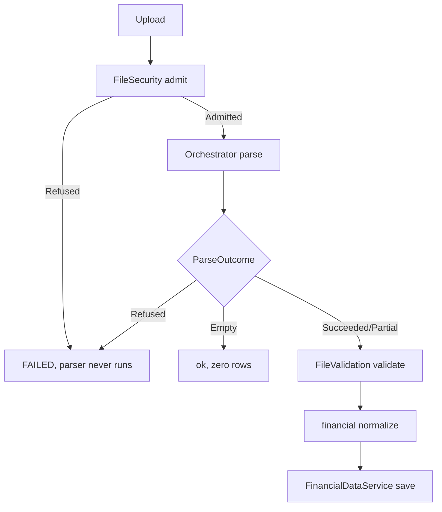

# 01 Ingestion + Financial

## A. WHY
Untrusted supplier files enter here. Job: refuse garbage
fast (security), salvage what is readable (parse), never
trust a row until validated, then normalize to canonical
Invoice rows for downstream math. Invariant:
accepted+rejected+skipped == reader total.

## B. FLOW

1. admit: size 25MB, content-type csv/excel/xlsx, magic
bytes, zip-bomb, traversal. -> Admitted(meta+sha256) |
Refused(reason).
2. parse: CsvFileParser (commons-csv, BOM, quoted NL,
row-limit->PARTIAL) or ExcelFileParser (POI, sheet, blank
skip, corrupt->FAILED). -> sealed ParseOutcome.
3. validate: header vs schema, row types, date<=asOfDate,
currency allowlist, 200k cap. PARTIAL keeps failureReason.
4. normalize+save: trim, upper currency, new BigDecimal
(never double), UTC dates, org_id + rowHash idempotent.

## C. FILES ingestion (69)
| subpackage | n | st | job |
|---|---|---|---|
| service 6 | 6 | REAL | IngestionService orchestration; Orchestrator selects parser; FileSecurity gate; FileValidation gates; Status transitions |
| parser 12 | 12 | REAL | ParseOutcome sealed; Csv/Excel parsers; ParserRegistry; FileParser iface |
| validator 10 | 10 | REAL | header/type/date/currency/dupe checks |
| security 5 | 5 | REAL | magic bytes, formula-escape, path norm |
| model 23 | 23 | REAL | IngestionRequest, FileParseResult, ValidationResult, ParsedRow |
| enums 13 | 13 | REAL | IngestionStatus(+FAILED fixed), Stage, ParseStatus, RejectionReason |
| dto 6 | 6 | REAL | upload req/resp |
| repository 3 | 3 | REAL | source_files, runs, errors |
| controller 1 | 1 | PH | IngestionController TODO |

## D. DEEP DIVE
### IngestionService.ingest() L65-98
builder.identifiers(run,org,fileUUID)->status RUNNING->
stage FILE_SECURITY_VALIDATION->admit()->if Refused return
FAILED->orchestrator.parse()->switch: Refused=>refusedAt
Parse(FAILED+PARSING+finding); Empty=>emptyRun(not failure);
Succeeded/Partial=>validated().
### validated() L108-126
validation.validate(parse,schema,asOf,limits)->preserve
PARTIAL failureReason->acceptAll+rejectAll+findings+skip->
build. screenOnly() L156 checksum-only. fileIdOf() L167
String->UUID strict, non-UUID throws.
### ParseOutcome.java L33-168
sealed permits Succeeded/PartiallyRead/Empty/Refused.
of() L62 maps enum->type so compiler forces switch.
rejectionOf() L77 reuses parser finding. Each record
null-checks, rows()/status(). Partial rows usable but run
stays partial. Refused rows empty.

## E. GOTCHAS
- Parser must never see refused bytes. Empty != failure.
- Partial must not claim full. Discount Incomplete != zero.
- fileId String must be UUID (V3 column type).

## F. IMPLEMENT
- controller/IngestionController.java PH: POST multipart
  upload + GET status, delegate to IngestionService,
  tenant from SecurityContext, Idempotency-Key support.

## G. NEXT -> financial persist (V4), then 02 price/truth.
