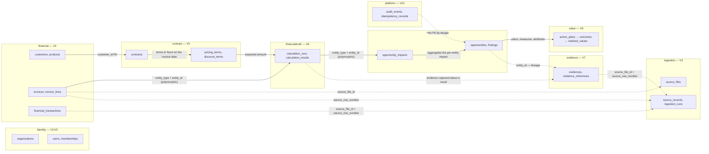

# 01 Boot and boundaries — the modular monolith at a glance

> Spring Boot 4.1.1 / Java 25. **466** main Java files: **311 built**, **155 stub**.
> 37 test files: 14 real (11 test classes + 3 support), 23 placeholder stubs.
> The README's "452 files / 280 REAL / 148 STUB" and the `00-overview.md` catalogue are
> stale — every number below is reconciled against the working tree.

This is the entry chapter. A reader who reads only this file should understand what the
product does, why the architecture is shaped exactly this way, where every file lives and
which chapter owns it, and — most importantly — *what is real and what is a stub* today.

---

## A. WHY this module exists

AI_CFO is a single-tenant-per-request, multi-tenant financial intelligence platform: it
ingests invoices (CSV/XLSX, up to 25 MB / 200 k rows), normalizes them, resolves the
contract price and discount that were in force on the invoice date, and deterministically
computes expected-vs-actual **variance → opportunity → action → realized value**, then
optionally asks an LLM to *explain* a computed figure under guardrails. The tenant is
`organization_id` (V1); every table carries it and every query is scoped by it.

The boot chapter is the trust root for everything downstream, because the properties
that matter for finance are decisions made here and cannot be made safely later:

- **Trustworthy math.** If money were `double` or division used a default rounding mode,
  the truth engine's figures would be un-auditable and, worse, non-reproducible. The boot
  chapter is where `Money`, `DateTimeUtils` and the JPA schema-validation contract are
  established, and where the YAML that binds them first takes effect.
- **Tenant isolation.** The tenant boundary is `organization_id`; the filter that resolves it
  from a verified JWT lives in `identity`. Until that filter is real, no downstream code can
  be trusted to be tenant-safe — so the boot chapter must own the honest status of it.
- **One source of truth for the schema.** Flyway owns the DDL; Hibernate only validates.
  The boot chapter is the place that explains why a migration that drifts from an entity
  fails the build instead of silently corrupting columns.
- **One source of truth for the boundary.** Modules may import `shared` and `platform`
  only. A cross-module import that compiles today is a compile cycle waiting to happen on
  the next merge; the boot chapter owns the rule *and* the admission that the guard is
  currently a convention, not a test.

**Hard invariants this chapter depends on (a change must not break any of these):**

- `CfoApplication` stays the only entry point and the sole scan root; moving it out of
  `com.fintech.cfo` silently stops module discovery.
- Only two `@Entity` types exist (`AuditEventEntity`, `IdempotencyRecord`); both map V10.
  The business modules stay free of persistence annotations so adding entities is a
  deliberate migration, not a drift.
- `spring.jpa.hibernate.ddl-auto` is `validate` everywhere; no profile creates or alters
  tables. (See ⚠ Review.)
- No business module imports another business module; `shared` and `platform` are the only
  cross-module substrate.

---

## B. FLOW — the runtime journey

The whole product, from an upload to an audited report and back to the source row:

```mermaid
flowchart LR
  UPL["client HTTPS upload<br/>multipart 25 MB"] --> ING["ingestion admit/parse/validate<br/>V3 source_files, runs, records"]
  ING --> NRM["normalize canonical model<br/>V4 customers, invoices, lines"]
  NRM --> CTR["contract terms resolve on date<br/>V5 pricing_terms, discount_terms"]
  CTR --> TRUTH["financialtruth engine<br/>V6 calculation_runs, results"]
  TRUTH --> VAR["variance → impact<br/>expected vs actual"]
  VAR --> OPP["opportunity lifecycle<br/>V8 opportunities, findings, reviews"]
  OPP --> ACT["action plans<br/>V9 action_plans, executions"]
  ACT --> OUT["outcome + realized value<br/>V9 outcomes, realized_values"]
  OUT --> REP["reporting / explain<br/>PDF + AI explain (guarded)"]
  REP --> EVID["evidence + lineage<br/>V7 snapshots, references, graph"]
  EVID -.-> ING
  EVID -.-> TRUTH
  EVID -.-> OPP
```



Numbered stages, with the owning module and the migration that carries the schema:

1. **Boot** — `CfoApplication.main` → Spring Boot assembles context, Flyway runs V1–V10,
   Hibernate validates the two entities, Tomcat binds `:8080`, virtual-thread request pool
   comes up. Owns module: `platform` (config, web, persistence, audit, idempotency).
2. **Tenant root + audit infra** — `V1__create_organizations` (tenant is the root; everything
   references it), `V2__create_users_roles` (global identity model, per-tenant membership),
   `V10__create_audit` (append-only `audit_events` + mutable `idempotency_records`). Owner
   `identity` (V1, V2) and `platform` (V10).
3. **Upload / ingest** — `V3__create_ingestion`: `source_files`, `ingestion_runs`,
   `source_records` (raw, immutable), `ingestion_errors`. Owner: `ingestion`.
4. **Normalize** — `V4__create_financial_data`: `customers`, `products`,
   `accounting_periods`, `invoices`/`invoice_lines` (canonical, source-independent),
   `financial_transactions`. Owner: `financial`.
5. **Contract terms** — `V5__create_contracts`: `contracts`, `contract_terms`,
   `pricing_terms`, `discount_terms`, `commercial_rules`. Owner: `contract`.
6. **Financial truth** — `V6__create_calculations`: `calculation_runs` (pinned
   `rule_version` + `input_checksum CHAR(64)`) and `calculation_results` with per-currency
   amount pairs and the central currency guard. Owner: `financialtruth`.
7. **Evidence & lineage** — `V7__create_evidence_lineage`: `evidence_snapshots`,
   `evidences`, `evidence_references`, `lineage_nodes`/`lineage_edges`. Owner: `evidence`.
8. **Opportunity** — `V8__create_opportunities`: `opportunities`, impacts, findings,
   reviews, lifecycle events, assignments, plus `investigations`. Owner: `opportunity`
   (investigations table) and `investigation`.
9. **Action / value** — `V9__create_value_tracking`: `action_plans`,
   `action_executions`, `outcomes`, `realized_values`, `value_attributions` (with the
   only non-negativity check in the schema). Owner: `value`.
10. **Report / AI** — no new table; `reporting` consumes V1–V9, `ai` consumes prompts
    (`prompts/contract-term-extraction.txt`, `prompts/opportunity-explanation.txt`). Owner:
    `reporting`, `ai`.

**Stage map (migrations per stage):**

| Stage | Purpose | Owner module | Migration(s) | Handbook chapter |
|---|---|---|---|---|
| 0 boot | tenant root + audit infra + config | identity / platform | V1, V2, V10 | this chapter → 05 |
| 1 ingest | upload, parse, validate, raw rows | ingestion | V3 | 01 |
| 2 normalize | canonical financial model | financial | V4 | 01–02 |
| 3 contract | pricing + discount terms | contract | V5 | 02-4 |
| 4 truth | deterministic variance engine | financialtruth | V6 | 02-2/3 |
| 5 evidence | lineage, snapshots | evidence | V7 | 03-4 |
| 5 opportunity | detection / lifecycle | opportunity | V8 | 03-2 |
| 5 value | action + realized value | value | V9 | 03-3 |
| 6 ai | LLM explain (guarded) | ai | prompts | 04-2 |
| 7 report | PDF reports | reporting | — | 04-3 |

### B.1 Condensed cross-module schema map

One node per module, clustered by the migration that owns it. Only the edges that
**cross a module boundary** are drawn — the intra-module foreign keys are inside a
cluster and are covered in full by chapter 14 (`docs/code-flow/14-database-schema.md`).
Every node is a table name; a cluster is one migration.

Dashed edges carry a **source reference** (`source_file_id` / `source_row_number`):
these are the lineage joins, the only edges that connect a computed or normalized
row back to the byte a supplier actually submitted. Solid edges are ordinary
foreign keys or the polymorphic (`entity_type` + `entity_id`) references the
engine uses in place of a real FK.



Five things this map is meant to make visible, which the runtime journey above does
not show:

- **Lineage joins (dashed) are the only way out of the schema's front door.** Three
  canonical tables carry `source_file_id`, and two of them carry
  `source_row_number` beside it; `evidences` repeats the pair. Together they answer
  "which row of which uploaded file produced this number". Each such FK is
  deliberately **non-cascading** (`V4:118`, `V4:202`, `V7:54`): a retention purge
  of raw uploads must not silently rewrite a financial record, so the invoice
  outlives its file.
- **Two cross-module edges are polymorphic, not foreign keys.**
  `calculation_results.entity_type`/`entity_id` and
  `opportunity_impacts.entity_type`/`entity_id` let one calculation span invoices,
  lines and transactions without `financialtruth` naming any of them — the same
  constraint the module boundary puts on Java imports (§D.5), expressed in the
  schema instead of enforced by ArchUnit.
- **`contract` feeds `financialtruth` one-way.** V5 terms are the engine's input;
  V4 never references V5. That is why a change of supplier system stops at
  normalization and cannot reach the truth engine.
- **Every node is also reachable from `organizations`.** The tenant key
  `organization_id` is denormalised onto all 35 tenant-owned tables, which is why
  `ORG` is drawn but not wired: it fans out to every cluster in the schema
  (chapter 14 §D.10). `USERS`, `ROLES` and `PERMISSIONS` are the exceptions — global
  by design, reachable only through `memberships`.
- **`platform` (V10) has no foreign key to anything.** The dashed
  `AUD -.-> OPPS` edge is a convention of the audit trail, not a constraint: an
  audit row must remain readable after the record it describes is deleted
  (chapter 14 §D.5, §D.9.10).

---

## C. FILES — the project catalogue

One row per module plus the root files. Counts are verified against the working tree
(`Get-ChildItem` over `src\main\java\com\fintech\cfo`). A file is `BUILT` if it has real
logic; `STUB` if its body is an empty placeholder (the "Architecture placeholder" shells
emitted by the generator carry a written contract but no implementation — they are stubs).

**466 main files: 311 built, 155 stub. Root: CfoApplication.java (1, built).**

| module | total | built | stub | status | owns | chapter |
|---|---|---|---|---|---|---|
| `com.fintech.cfo` (root) | 1 | 1 | 0 | BUILT | entry point | this |
| `shared` | 24 | 24 | 0 | BUILT | Money, CurrencyCode, ids, DateTimeUtils, HashUtils, exceptions, SecurityPrincipal | 05-1 |
| `platform` | 28 | 28 | 0 | BUILT | config, web, audit, idempotency, storage, persistence, observability | 05-2/4 |
| `identity` | 30 | 0 | 30 | STUB | JWT→tenant filter, security chain, users/roles/memberships | 05-7 |
| `ingestion` | 79 | 75 | 4 | mostly BUILT | admit, parse, validate (CSVs, XLSX), file security | 01 |
| `financial` | 43 | 27 | 16 | mixed | canonical model + mappers; controllers/services/repos STUB | 01 |
| `contract` | 55 | 50 | 5 | mostly BUILT | contracts, terms, pricing, discounts; repos STUB | 02-4 |
| `financialtruth` | 50 | 46 | 4 | mostly BUILT | the truth engine; controllers/repos STUB | 02-2/3 |
| `evidence` | 26 | 11 | 15 | mostly STUB | lineage graph + snapshots (5 real enums/models) | 03-4 |
| `opportunity` | 40 | 18 | 22 | mixed | enums + models + findings; services/controllers STUB | 03-2 |
| `value` | 24 | 1 | 23 | mostly STUB | only `CodedEnum` real; everything else STUB | 03-3 |
| `ai` | 37 | 30 | 7 | mostly BUILT | extraction, explanation, guardrails, ports; clients/controllers STUB | 04-2 |
| `reporting` | 10 | 0 | 10 | STUB | PDF report generation | 04-3 |
| `investigation` | 7 | 0 | 7 | STUB | dispute investigations | 04-4 |
| `processing` | 12 | 0 | 12 | STUB | Spring Batch job config (ingest/truth/report) | 05-8 |

**Root files outside the package tree:** `pom.xml` (build, BUILT); `src/main/resources/` —
`application.yml` + `application-{dev,prod,test}.yml`, `application.properties`,
`logback-spring.xml`, 10 migrations in `db/migration/`, 2 AI prompt templates in
`prompts/`. Of the 4 resource blocks, only `application.yml` is the authoritative base;
the profiles overlay on top of it.

**Stale numbers corrected (from `README.md` §1/§3 and `00-overview.md`):**

- README §1 claimed **452** files → actually **466**. §3 catalogue claimed `ingestion 69`,
  `financial 37 (20 REAL + 17 SPEC)`, `contract 51`, `ai 24 STUB`, `financialtruth 50 REAL`,
  `evidence 5 REAL enums`, `opportunity 40 STUB`, `value 24 STUB`, `processing 8 REAL + 4 SPEC`.
  The corrected split is in the table above. The biggest corrections: `ai` grew 24→37 with
  **30** real files (extraction/guardrails/explanation services exist), `financialtruth` is
  **46 real / 4 stub** (not all-real), `opportunity` is **18 real / 22 stub**, `financial` is
  **27 / 16**, `contract` is **50 / 5**, `processing` is **0 / 12** (all stub), and
  `value` has a single real file (`CodedEnum`).

---

## D. DEEP DIVE — method by method

### D.1 `CfoApplication` — the entry class

`CfoApplication` is, deliberately, not a class you read for behaviour. It is three lines of
annotation and one method, and that is the point: it exists only to make Spring Boot's
machinery start, so no logic added here could run inside dependency injection.

`CfoApplication.main(String[] args)` (CfoApplication.java:86-89)
- Returns: nothing (`void`). The `ConfigurableApplicationContext` is discarded on purpose.
- Steps: `SpringApplication.run(CfoApplication.class, args)` builds the bean factory,
  triggers auto-configuration, refreshes the context, then (for the servlet flavour) starts
  the embedded Tomcat and blocks.
- Why discard the context: in a servlet application the running context *is* the JVM's
  lifetime. Keeping a static reference would only expose a `close()` hook that could run
  while a request is mid-flight — exactly the partial-shutdown hazard the comment
  (CfoApplication.java:71-74) rules out.
- Guards: none here. The contract is the annotations; `main` just forwards `args`, which
  carry `--spring.profiles.active=…` and `--key=value` so environment overrides reach the
  `Environment` before any bean is built.
- Why `args` matters: production is launched with `CFO_DB_URL`/`CFO_SERVER_PORT`/`CFO_OIDC_*`
  read from the environment, and `--spring.profiles.active=prod` selects the profile block.
  If `args` were dropped, prod boots against dev defaults.

### D.2 What the two annotations actually do

`@SpringBootApplication` (CfoApplication.java:61) is a composition of three annotations,
each with a distinct job:

- `@Configuration` — this class is a bean-definition source (a source of `@Bean` methods).
  It carries none here; it exists only so the other two attach to a configuration.
- `@ComponentScan` — discovers every `@Component` / `@Service` / `@Repository` /
  `@RestController` / `@Configuration` whose package is `com.fintech.cfo` or below. **The
  package of the annotated class is the scan root**, so the directory layout *is* the
  module layout: every module lives under `com.fintech.cfo.<module>` and is found
  automatically. This is why "move `CfoApplication` and discovery breaks" is a real failure
  mode — a controller moved to a foreign top-level package would disappear from scanning.
- `@EnableAutoConfiguration` (`@AutoConfiguration` in Boot 4 terms) — turns on Spring Boot's
  conditional auto-configuration. Each auto-config is `@ConditionalOnClass`/
  `@ConditionalOnMissingBean`, so the DataSource, JPA, Flyway, security, actuator, Tomcat
  and Jackson beans appear *only* if their classes are on the classpath and the application
  has not supplied its own. The pom declares exactly the starters that should activate
  (pom.xml:56-112); nothing extra is pulled in by accident.

`@ConfigurationPropertiesScan` (CfoApplication.java:62) — registers every
`@ConfigurationProperties`-annotated type under `com.fintech.cfo.*` as a bean and binds it
once, at refresh, from `application*.yml`. Today the sole such type is
`platform.config.ApplicationProperties` (ApplicationProperties.java:33,
prefix `cfo.application`): a record of `name`, `version`, `environment` and
`correlationIdResponseHeader`. Binding here — rather than `@Value` scattered through
business modules — is what keeps a configuration change from rippling into a service and a
half-applied value from never being observed; the config chapter (05) owns the rest.

### D.3 Startup sequence, end to end

1. **JVM → `main`.** Classloaders form; `CfoApplication.main` runs
   (CfoApplication.java:86). `SpringApplication` is constructed with
   `CfoApplication.class` as the source.

2. **`@SpringBootApplication` is read.** Boot derives the candidate components from the
   class: the scan root is `com.fintech.cfo`, so every module beneath it is discovered
   (D.2). A bean definitions registry now contains every real service/filter plus the
   empty stub classes (stub controllers register as inert beans; they contribute nothing
   but do not fail).

3. **`@ConfigurationPropertiesScan` registers binders.** `ApplicationProperties` becomes a
   bean and is bound from YAML during the upcoming refresh. See the ⚠ Review: the YAML
   declares more `cfo.*` blocks than any record binds.

4. **Auto-configuration contributes infrastructure.** Conditionally: the HikariCP
   `DataSource` (`spring.datasource.*`, pool 20/5, connection-timeout 30s,
   application.yml); Flyway (`spring.flyway.locations=classpath:db/migration`,
   `baseline-on-migrate=true`); the JPA `EntityManagerFactory` (`ddl-auto: validate`,
   `time_zone: UTC`, `default_batch_fetch_size: 50`); the actuator endpoints
   (`health,info,metrics,prometheus`); Spring Security's default filter chain; Tomcat.

5. **Flyway runs before `EntityManagerFactory` validation.** During datasource
   initialization the migrations apply in order V1→V10. Hibernate then builds the EMF and
   runs `validate`, comparing every `@Entity`/association against the *migrated* schema.
   This ordering is the reason a schema owned by SQL is safe to keep owning it: a column
   Hibernate thinks should exist but the migration did not create — or one the migration
   created in a type Hibernate did not expect — fails the boot
   (`CfoApplication.java:30-34`, `application.yml` jpa `ddl-auto: validate`).

6. **Bean post-processing wires the cross-cutteries.** `@EnableAsync` (AsyncConfig.java:42)
   installs the `applicationTaskExecutor`, a `VirtualThreadTaskExecutor` named to match
   Boot's default qualifier (AsyncConfig.java:58-61). `@EnableTransactionManagement`
   (TransactionConfig.java:18) and `@EnableJpaAuditing` (JpaConfiguration.java:39) install
   their advisors. The auditor bean yields the authenticated caller id, or *empty* for
   scheduled/async work (JpaConfiguration.java:53-61).

7. **Tomcat opens the port.** `spring-boot-starter-webmvc` brings the embedded Tomcat;
   `server.port` defaults to 8080 via `${CFO_SERVER_PORT:8080}`. With
   `spring.threads.virtual.enabled=true`, Boot 4 serves requests on virtual threads, so
   thread-per-request parking is cheap and the Hikari pool (20) is the real concurrency
   ceiling — the sizing comment in `application.yml` is what makes that a decision and not
   a default.

8. **The servlet filter chain takes shape, in `@Order`.** The ordered `@Component` filters:
   `CorrelationIdFilter` — `@Order(HIGHEST_PRECEDENCE)` (CorrelationIdFilter.java:61):
   mints/validates the request id, stamps the response header, the request attribute, and
   the MDC;
   `RequestLoggingFilter` — `@Order(HIGHEST_PRECEDENCE + 1)` (RequestLoggingFilter.java:52):
   reads that MDC and times the whole request, logging once in `finally`;
   Spring Security's auto-configured `SecurityFilterChain` — order `-100` — runs next;
   `IdempotencyFilter` (IdempotencyFilter.java:42) has no explicit `@Order`, so it runs
   after security, around the handler, with the response buffered only when an
   `Idempotency-Key` was supplied (IdempotencyFilter.java:96-96 — `shouldNotFilter` skips
   safe methods and keyless requests).

9. **`/health` readiness.** Liveness/readiness probes (`/actuator/health/liveness`,
   `/readiness`) report `DOWN` until Flyway + EMF validation complete, so a pod is not
   routed to until its schema and mappings agree. `show-details: never` (application.yml)
   keeps a failing component from naming the dependency that is down.

### D.4 Why Flyway ordering matters, and the `CHAR(64)` drift guard

The schema is owned by SQL, not by objects. Hibernate is in `validate` mode in *every*
profile (including `application-test.yml`), so it never creates or alters a column — drift
must fail the boot. The two entities that exist today are the proof surface for this:

- `platform.audit.AuditEventEntity` → `audit_events` (V10, AuditEventEntity.java:54-59).
- `platform.idempotency.IdempotencyRecord` → `idempotency_records` (V10, IdempotencyRecord.java:27-31).

The canonical example of the drift guard is `IdempotencyRecord.requestFingerprint`.
`V10__create_audit.sql` declares it **fixed-width** `CHAR(64)` (V10:82) because it stores a
SHA-256 hex digest, and a fixed-width hex digest is what the column genuinely is. A plain
`@Column(length = 64)` on a `String` tells Hibernate the type is `varchar(64)`. In `validate`
mode Hibernate then sees `bpchar` where it expected `varchar(64)` and refuses the context
with "found [bpchar], but expecting [varchar(64)]" — a boot failure. The entity therefore
states the type the migration actually creates, twice, so the two cannot disagree:

```java
@Column(name = "request_fingerprint", nullable = false, columnDefinition = "char(64)")
@JdbcTypeCode(SqlTypes.CHAR)
private String requestFingerprint;
```

(IdempotencyRecord.java:94-95.) `@JdbcTypeCode(SqlTypes.CHAR)` tells the validator to expect
`bpchar`; `columnDefinition` keeps any emitted DDL text agreeing with it. Neither statement
is a *second source of truth* for the schema — the migration is unchanged — they are
documentation that the entity maps exactly to the DDL. The same reasoning applies to
`idempotency_key VARCHAR(255)` (`@Column(length=255)`, IdempotencyRecord.java:63) and the
`version` `@Version` optimistic-lock column (V10:95, IdempotencyRecord.java:155-157).
The consequence is that `mvn package` is a schema-integrity gate as well as a compile gate:
rename a column in the migration and forget the entity, and the build goes red.

### D.5 The module boundary rule — and that it is not enforced

**The rule** (module-implementation-rules.md:39-54): a module may import only
`com.fintech.cfo.shared.**`, `com.fintech.cfo.platform.**`, Java/JakartaEE/Spring, and the
libraries in `pom.xml`. A module **must not** import another business module
(`identity`, `ingestion`, `financial`, `contract`, `financialtruth`, `evidence`,
`opportunity`, `value`, `ai`, `reporting`, `investigation`, `processing`).

**Why this prevents a compile cycle.** If `A` imports `B` and `B` imports `A`, neither can
be compiled first: `A`'s build needs `B`'s classes, and `B`'s needs `A`'s. In practice that
binds two modules together permanently — a change in the importers' internals ripples into
the importee's compile, so two teams that were supposed to move in parallel now block on
each other, and the boundary that kept the financial logic separate from the ingest logic
silently evaporates. Forcing the only shared substrate to be `shared`/`platform` (which
depend on nothing) makes the dependency graph a tree rooted there: every edge points
downward, and "add a new module" is "drop a new package under `com.fintech.cfo`".

**How cross-module data actually flows (it must go through a consumer-owned type).**
`financialtruth` needs invoice lines and contract terms, but it imports neither `financial`
nor `contract` (verified: every module today imports only `shared`/`platform`). The exchange
is mediated by:
- shared value types — `Money`, `CurrencyCode`, `OrganizationId`, `UUID`
  (FinancialTruthEngine.java imports; FinancialTruthEngine.java); and
- a **consumer-owned input** — `financialtruth.model.InvoiceLineInput` and
  `TermEvaluation` are financialtruth's own DTOs that carry the normalized data the engine
  scored. The producer (the future `financial`/`contract` service layer) will feed them;
  financialtruth never names the producer's types.

**Real current state of enforcement.** The rule exists as prose in
`module-implementation-rules.md` and as *intent* in two test files, but **not as a running
check**. The ArchUnit tests that were meant to enforce it are:

- `src/test/.../architecture/ModuleBoundaryTest.java` — **STUB**. Its own Javadoc says the
  rules "are not written" and that "until they are, the boundary is a convention rather
  than a constraint" (ModuleBoundaryTest.java:26-33). It compiles and passes by asserting
  nothing.
- `src/test/.../architecture/DependencyRuleTest.java` — **STUB** as well
  (DependencyRuleTest.java:21-26).

Both are 12-line placeholders with `// TODO: Add test cases.` So: **every business module
currently respects the boundary** (the cross-module grep is clean), but that compliance is
a convention a single import would silently break. A future `mvn` build cannot catch it;
only review can. This is the single largest structural gap for this chapter to call out.

### D.6 The determinism rule (and the clock that is the only allowed source of "now")

The financial path must be reproducible months later (module-implementation-rules.md:73-85).
A calculation that depends on the wall clock, the host zone, or iteration order is a
calculation that cannot be defended — and in this system a number that cannot be reproduced
is a number that cannot be quoted to a counterparty.

- **No `LocalDate.now()` / `Instant.now()` in calculation or pricing.** The clock is
  `shared.util.DateTimeUtils` (`@Component`, DateTimeUtils.java:41), which holds a `Clock`
  injected at construction. Production uses `Clock.systemUTC()` (DateTimeUtils.java:48-50);
  tests pass a fixed/offset clock and then assert byte-identical results.
- **Business dates are UTC.** `DateTimeUtils.today()` projects the instant into UTC
  (DateTimeUtils.java:84-86), so month/quarter/fiscal-year boundaries do not shift when a
  server crosses a time zone or daylight-saving step. The fiscal year is Indian
  (Apr–Mar), `startOfFinancialYear`/`endOfFinancialYear` (DateTimeUtils.java:153-166).
- **The engine reads the clock exactly once per run.** `FinancialTruthEngine` takes an
  injected `Clock` and stamps every result row in a run with the same `calculatedAt`
  (FinancialTruthEngine.java); that is what lets a retrospective re-run prove the inputs
  evaluated identically.
- **No locale-sensitive formatting, no random, no hash-ordered sums.**
  `CurrencyCode.of` upper-cases with `Locale.ROOT`
  (CurrencyCode.java:62) and so does `Environment.from`
  (ApplicationProperties.java:92), because a Turkish default would turn `"i"` into a
  dotted capital and corrupt the currency. Variance aggregation must not depend on
  `HashMap` ordering of a sum.
- **Version + effective date + checksum accompany every result.** `calculation_runs`
  stores `rule_version` and `input_checksum CHAR(64)` (V6), so a run carries the exact
  rule set and inputs it was evaluated against.

⚠ **Review — audit timestamps use the system clock, not the injectable one.**
`JpaConfiguration.timestampAuditor` and `PersistenceAuditListener.currentTimestamp` call
`Instant.now()` directly (JpaConfiguration.java:74, PersistenceAuditListener.java:52-53).
These are *audit/event* timestamps, not calculation inputs, so they do not violate the
financial determinism rule; but the `JpaConfiguration` comment claims they exist "so tests
can reason about one clock source," and `Instant.now()` is not that source. The contract
is correct (audit is append-only and ordered by `now()`); the comment is not.

### D.7 The money rule (and why `double` is not an option here)

`shared.domain.Money` is the only amount type (module-implementation-rules.md:59-71).
`double`/`float` are not merely discouraged — they are structurally absent from the
calculation classes.

- **Why `Money` is a final class, not a record** (Money.java:23). The class guards
  arithmetic and overrides `equals`/`hashCode` to use `BigDecimal.compareTo`, so `100` and
  `100.00` are equal. A record would auto-generate `equals` from `BigDecimal.equals`,
  which is *scale-sensitive* and would make two representations of the same amount compare
  unequal inside a hash collection — corrupting the aggregation that turns variances into
  opportunity totals. The trade-off: hand-written accessors instead of generated ones, which
  is the price of a correct equality contract on money.
- **No cross-currency arithmetic.** `add`/`subtract`/`compareTo` route through
  `requireSameCurrency`, which throws `IllegalArgumentException` on a mismatch
  (Money.java:78-80, :290). Conversion belongs to a separately audited FX component that
  does not exist yet — so a total that would need a rate is *rejected*, never silently
  summed. This is the schema's parallel: V4 stores a `currency` on every amount column and
  refuses to net across currencies.
- **Division demands an explicit scale + `RoundingMode`** (Money.java:132). `BigDecimal`
  division is exact-or-throw; a caller that omits rounding gets an `ArithmeticException`
  on a non-terminating decimal instead of a financial number. Forcing the choice is
  forcing a *policy* decision: the scale (4 for money, 6 for rates — see V4/V5 comments)
  and the rounding mode are business choices, and they must be visible at the call site
  rather than hidden behind a default.
- **Stored as `NUMERIC(20,4)`; quantities/rates as `NUM.ERIC(20,6)`** (module-implementation-rules.md:70,
  V4:4 — unit_price is 6-decimal "a unit rate is a rate, not a payable amount"). The engine
  rounds the gross to the money scale *once*, before discount and tax.
- **Variance carries its currency** (rule §3: "a variance without a currency is a bug").
  `calculation_results` stores `variance_amount`/`variance_currency` and
  `impact_amount`/`impact_currency` as paired columns with a guard that a variance may not
  exist without its currency (V6, the `ck_calc_results_variance_currency` /
  `ck_calc_results_impact_currency` checks).
- **JSON never routes numbers through `double`.** `JacksonConfig` enables
  `USE_BIG_DECIMAL_FOR_FLOATS` (JacksonConfig.java:38) and serializes `BigDecimal` as a
  string, so a JSON figure cannot lose a cent to binary floating point on the wire.

---

## E. GOTCHAS — what breaks if you get it wrong

Ranked by consequence (money/tenancy/determinism first).

1. **Entity drifts from the migration → the build hides it as a runtime failure.**
   - *Symptom:* context fails to start in prod-like mode but passed `mvn test` (where the
     schema is built by the same migrations, so validate agrees with itself).
   - *Cause/Blast radius:* omitting `@JdbcTypeCode(SqlTypes.CHAR)` on
     `IdempotencyRecord.request_fingerprint` (IdempotencyRecord.java:94) makes Hibernate
     expect `varchar(64)` against V10's `CHAR(64)` → "found [bpchar], but expecting
     [varchar(64)]"; the whole EMF refuses to build, killing audit + idempotency.
   - *Fix:* keep `@Column(columnDefinition="char(64)")` + `@JdbcTypeCode(SqlTypes.CHAR)`
     on every fixed-width column; never "simplify" one off.

2. **`ddl-auto` relaxed to `update`/`create` in any profile → schema drift in production.**
   - *Symptom:* a column appears/disappears without a migration, so the audit trail no
     longer matches what was deployed.
   - *Cause:* the `cfo.async.*` / `cfo.ingestion.*` blocks are *not* bound to a typed
     record today (see ⚠ Review), so a developer reaching for a quick `@Value` plus a
     `ddl-auto: update` to "fix" a mapping can silently rewrite a live table.
   - *Fix:* only `validate` is permitted; schema changes are new numbered migrations.

3. **A module imports another business module → a hidden compile cycle.**
   - *Symptom:* a PR that looks like one-file change pulls two modules into a mutual
     dependency; incremental builds start failing inconsistently.
   - *Cause:* the ArchUnit boundary tests are stubs (ModuleBoundaryTest.java:21,
     DependencyRuleTest.java:21), so nothing in `mvn` detects it.
   - *Fix:* implement the ArchUnit rules; until then review must enforce.

4. **`@ConfigurationPropertiesScan` removed or relocated → silent empty config.**
   - *Symptom:* `ApplicationProperties` is null; an upload NPEs or a tenant is mis-scoped.
   - *Cause:* `@ConfigurationPropertiesScan` (CfoApplication.java:62) is what binds the
     `cfo.*` records; losing it makes every typed property `null` with no error at the
     site of use.
   - *Fix:* keep the annotation on the root; bind via the typed record, never `@Value`
     in a service.

5. **Correlation ID not cleared in `finally` → audit lines misattributed.**
   - *Symptom:* request B's logs carry request A's correlation id; a support report
     quotes an id that retrieves the wrong session.
   - *Cause:* `MDC.remove` must run in `finally` (CorrelationIdFilter.java:128-131); the
     servlet thread is pooled and inherits the previous caller's MDC otherwise.
   - *Fix:* never restructure that `try/finally`; an idempotent retry (IdempontencyFilter)
     must reuse the *same* id, not mint a new one.

6. **A `double` slips into a calculation → a rupee that cannot be audited.**
   - *Symptom:* two runs of the same input differ by sub-cent amounts that "wash out" in
     aggregation but accumulate across 200 k rows.
   - *Cause:* bypassing `Money` for an intermediate average.
   - *Fix:* route everything through `Money`; the `divide(divisor, scale, RoundingMode)`
     signature (Money.java:132) exists to force the policy choice.

7. **Virtual threads meet a `synchronized` block → throughput collapses to one lane.**
   - *Symptom:* latency stays low under load then suddenly serialises; CPU is unused.
   - *Cause:* `spring.threads.virtual.enabled=true` plus a `synchronized` hot path
     (application.yml comment) pins virtual threads to a carrier.
   - *Fix:* keep critical sections lock-free; size the Hikari pool, not a thread count.

⚠ **Review — declared config with no binder.** `application.yml` declares
`cfo.application` (bound), and also `cfo.security.*`, `cfo.ingestion.*`, `cfo.storage.*`,
`cfo.idempotency.ttl`, `cfo.ai.*`, and `cfo.async.{core-pool-size,max-pool-size,
queue-capacity}`. **No `@ConfigurationProperties` record binds any of these** — the only
bound record is `ApplicationProperties` (prefix `cfo.application`, ApplicationProperties.java:33).
Concretely: `IdempotencyService` hard-codes `DEFAULT_TTL = 24h`
(IdempotencyService.java:43) and ignores `cfo.idempotency.ttl: PT24H`; `AsyncConfig` builds a
`VirtualThreadTaskExecutor` and ignores the bounded-pool settings under `cfo.async.*`
(AsyncConfig.java:58-61) — which is the *opposite* of what those keys declare and directly
contradicts the AsyncConfig Javadoc that takes pride in *not* sizing a pool. And
`application.yml` sets `cfo.storage.root` while `ObjectStorageService` reads
`cfo.storage.local-root` (ObjectStorageService.java:145-146), so neither key is wired as
intended. These are dead declarations: they are read by no bean and therefore change
nothing at runtime. The intended `IngestionProperties` (alluded to in CfoApplication's
Javadoc at lines 24-26 and in `00-overview.md`) does not exist.

⚠ **Review — security filter chain is a stub.** The `identity` module is 30/30 stub,
including `SecurityConfig`, `JwtAuthenticationConverter` and `TenantContextFilter`
(identity/security/). There is **no** `SecurityFilterChain` or `@EnableWebSecurity` in main
source. The `spring-boot-starter-oauth2-resource-server` dependency is present
(pom.xml:108-112) but `CFO_OIDC_ISSUER_URI` defaults to empty, so the resource-server chain
is inactive and Spring's *default* security auto-configuration applies instead. The
`SecurityPrincipal`/`SecurityContext` model in `shared.security` reads an empty context at
runtime, so tenant scoping from a verified JWT is not actually happening; `CfoApplicationTests`
confirms this is known (CfoApplicationTests.java:17-18) and `AuthenticationTest` is itself a
placeholder (AuthenticationTest.java:16-18).

---

## F. TESTS — what locks this down

37 test files; **14 are real** (11 test classes + 3 test-support), **23 are placeholder
stubs**. The 329 passing tests come from the real classes.

| test file | invariant protected | highest-value cases | gap |
|---|---|---|---|
| `CfoApplicationTests` | context assembles; Flyway V1–V10 apply; the two `@Entity` types validate against the migrated DDL | `contextLoads` — the assertion is that Boot can build the EMF and run every migration without drift | needs Docker (TestcontainersConfiguration); cannot run without a daemon (CfoApplicationTests.java:24-27) |
| `financialtruth/MoneyTest` | amounts never go through `double`; currency mismatch throws; divide forces scale+RoundingMode | `equals` is scale-insensitive (`100` == `100.00`); divide-by-zero is rejected | none for arithmetic; locale edge cases are in `CurrencyCode` not here |
| `financialtruth/DiscountVarianceRuleTest`, `../PricingVarianceRuleTest`, `../FinancialTruthEngineTest`, `../FinancialRegressionTest`, `../CalculationReproducibilityTest` | variance = f(inputs, terms, rule_version); a re-run of the same inputs yields the same figure; rule changes do not silently rewrite history | reproducibility: identical `input_checksum` → identical result | no cross-rule regression harness yet |
| `ingestion/CsvFileParserTest`, `../ExcelFileParserTest`, `../FileValidationServiceTest` | the parsers never accept a disguised file; content-type vs detected-type is the security signal | rejected MIME types; quoted/embedded-newline CSV | no 200 k-row load test; no malicious-archive test |

**Not locked down — the gaps this chapter exists to surface:**

- The **module boundary** (§D.5) has no executable guard: `ModuleBoundaryTest` and
  `DependencyRuleTest` are 12-line stubs (23 stub test files in total, including every
  `security.*`, `api.*`, and `*ServiceTest` whose module service is itself a stub). A
  cross-module import compiles and passes `mvn` today.
- No test pins the **`cfo.async.*` / `cfo.ingestion.*` / `cfo.ai.*` / `cfo.idempotency.ttl`
  binding (the ⚠ Review in §D). Nothing fails if those YAML blocks are deleted.
- The **security/tenant chain** is untested (`AuthenticationTest`, `AuthorizationTest`,
  `FileUploadSecurityTest`, `TenantIsolationTest` are all placeholders).
- `CfoApplicationTests` is the *only* whole-context canary, and it requires Docker, so the
  "does the filter chain actually order correctly" and "does idempotency replay a stored
  body verbatim" paths have no non-container test.

---

## G. WIRING — where this connects

`shared` is the bottom of the graph: `Money`, `CurrencyCode`, the id records
(`OrganizationId`, `UserId`, `TenantId`), `DateTimeUtils`, `HashUtils`, and the typed
exceptions. It imports nothing inside `com.fintech.cfo`.

`platform` wraps `shared` and is the infrastructure spine: config (`ApplicationProperties`,
`AsyncConfig`, `TransactionConfig`, `JacksonConfig`, `OpenApiConfig`), web
(`ApiResponse`/`ApiErrorResponse`, `GlobalExceptionHandler`, the three real filters),
audit (`AuditEvent`/`AuditEventEntity`/`AuditEventJpaRepository`/`AuditService`),
idempotency (`IdempotencyRecord`/`IdempotencyRepository`/`IdempotencyService`/
`IdempotencyFilter`), storage (`ObjectStoragePort`/`ObjectStorageService`/`StorageObject`),
persistence (`JpaConfiguration`, `PersistenceAuditListener`) and observability
(`MetricsConfiguration`, `TracingConfiguration`, `BusinessMetrics`). It imports `shared`
only.

**Business modules** (`identity`, `ingestion`, `financial`, `contract`,
`financialtruth`, `evidence`, `opportunity`, `value`, `ai`, `reporting`,
`investigation`, `processing`) each import `shared` and `platform` only, and never another
business module — currently by convention (§D.5), to become by ArchUnit once the stub tests
are implemented.

**Cross-module exchange** is through shared value types and consumer-owned ports/DTOs:
`financialtruth`'s `InvoiceLineInput`/`TermEvaluation`/`Variance` carry data *into* the
engine without naming `financial`/`contract`; `opportunity`'s `CalculationReference` points
back at a `calculation_results` row by id; `ai` reads its LLM through `LlmPort`/
`DocumentExtractionPort`/`EmbeddingPort` ports (ai/client/) and is gated by
`AiGuardrailService`. Nothing business reads another business module's package.

**The integration milestone** is what realizes the actual wiring between modules: the
ingestion→normalization producer, the contract-term resolver → truth-engine input, the
truth→opportunity detection, the opportunity→action linkage, and the
Spring-Batch jobs in `processing/`. Until those are wired, the stub controllers/repos in the
business modules remain inert beans. The wiring types that will connect them are the
consumer-owned ones above plus the `platform` ports (`ObjectStoragePort`,
`AuditRepository`) and the batch vocabulary from `spring-boot-starter-batch` (pom.xml:63-66).

**Where to go next.** The engine room is `financialtruth` (chapter 02-2/3); the trust roots
just described here are `shared.domain.Money`, `shared.util.DateTimeUtils`,
`platform.audit.*`, `platform.idempotency.*`, and `V10__create_audit.sql`. The single
highest-leverage follow-up is implementing `ModuleBoundaryTest`/`DependencyRuleTest` so the
boundary becomes a build constraint, because right now compliance is a convention that any
import can break silently.
