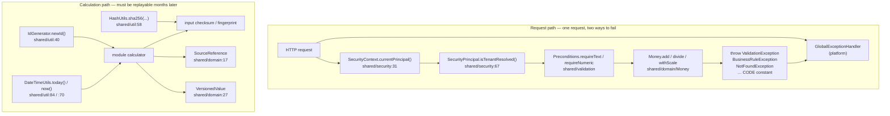

# 02 — The shared kernel

`src/main/java/com/fintech/cfo/shared/**` — 24 files, all `BUILT`, no stubs.
Imported 287 times across 136 of the 466 main source files. Everything above this
floor is a business module; nothing below it knows any of them.

> This chapter replaces the shared-kernel portion of the now-deleted
> `05-platform-shared-config.md`. That chapter's
> file count for `shared` (24: domain 8, enums 3, exception 6, security 2, util 3,
> validation 2) was **correct** and is preserved below. What was wrong was the
> word it used: it labelled all 24 "REAL". Four of them — `domain/TenantId`,
> `enums/Status`, `enums/Currency`, `enums/ProcessingStatus` — have **zero
> production consumers**. They are built, correct, and currently reached by
> nothing. The corrections in this chapter are about load-bearingness, not about
> arithmetic.

---

## A. WHY this module exists

A CFO platform's output is a number that somebody will act on. The failure modes
that matter are not crashes — they are a variance that is wrong by a paisa, a
total that silently mixes dollars into rupees, or a report that shows one
company's invoices to another. None of those announce themselves: the number
still looks like a number, and it is usually discovered weeks later during
audit. So this module exists to make three classes of mistake *impossible to
express* rather than merely discouraged: money that is not currency-tagged,
validation that behaves differently depending on which file copied it, and
tenant scope that can be read off a request parameter.

It is deliberately tiny and deliberately boring. It has no Spring MVC, no JPA,
no module knowledge, and no knowledge of any business vocabulary. It contributes
a money type, seven value carriers, eight guard clauses, six exception types,
two tenancy primitives, three determinism utilities, and three enums — and
nothing else. Its value is entirely defensive: if a rule in section **A.1** is
broken, the platform still compiles and still returns HTTP 200, and the damage
shows up as a wrong figure rather than an error.

### A.1 Invariants a future change must not break

1. **An amount is only ever a `Money`, and a `Money` is only ever one currency.**
   No `double`, no `float`, no bare `BigDecimal` field in a business record.
2. **Two currencies are never added, subtracted, compared or averaged.** The
   operation throws. There is no FX component, and adding one is not a
   simplification — it is a separate audited product decision (§3 of the
   implementation rules).
3. **Division and rounding always state a scale and a `RoundingMode` at the call
   site.** There is no default overload to reach for by accident.
4. **Equality and ordering of money are numeric, not textual.** `100`,
   `100.00` and `1E+2` are the same amount, and they must agree in a hash
   collection too.
5. **A validation failure is a `ValidationException` and names the field.**
   Never a bare `NullPointerException`, never a framework exception, never a
   silent default value.
6. **A tenant scope is read from an authenticated `SecurityPrincipal`, never
   from a request body, query parameter or path variable.**
7. **A reported amount carries a `SourceReference` back to its source row**, and
   that reference stores an identifier and a row number — never the document.
8. **"Now" is a parameter.** Every instant and business date in a calculation
   path comes from an injected `Clock` (`DateTimeUtils`, or a `java.time.Clock`
   passed directly). No `LocalDate.now()`, no `Instant.now()`.
9. **A value that feeds a financial result carries the version and effective
   instant it was evaluated at** (`VersionedValue`).
10. **An error carries a stable machine-readable `CODE`, not just a message.**
    The message is a diagnostic; the code is the client contract.

These ten are the promises the rest of this chapter keeps referring back to.

---

## B. FLOW — the runtime journey

There is no "shared kernel flow" in the way a business module has one. `shared`
is entered and left constantly. The diagram below is the two paths that matter:
the **request path**, where a domain failure becomes an HTTP response, and the
**calculation path**, where determinism is established.



### B.1 The request path, step by step

1. **Trigger** — an HTTP call reaches a controller. The kernel is not on the
   dispatch path itself; it is entered at the first guard.
2. **Where** — `platform/web/GlobalExceptionHandler.java` is the *exit*; the
   kernel is what the handler translates.
3. **What it does** — every failure the kernel can raise is a `DomainException`
   subclass carrying a `CODE`, and the handler maps that `CODE` to a status.
4. **Why this way** — a code is a contract and a message is not. A client can
   branch on `BUSINESS_RULE_VIOLATION` and cannot branch on "opportunity is not
   yet validated", which is a sentence that will be reworded. Putting the status
   in one place is what stops two services inventing two shapes for "not found".

### B.2 Establishing who the caller is

1. **Trigger** — Spring Security has populated its context (or not).
2. **Where** — `shared/security/SecurityContext.currentPrincipal()`,
   `SecurityContext.java:31`.
3. **What it does** — reads `SecurityContextHolder`, rejects a null or
   unauthenticated `Authentication`, and returns the `SecurityPrincipal` only if
   the principal object is one of ours; otherwise `null`.
4. **Why a null rather than a synthetic anonymous principal** — so that every
   call site is forced to decide what "anonymous" means for it. A synthetic
   guest principal would let a tenant-less request reach a query and produce an
   empty result set, which reads as "this customer has no invoices" instead of
   "this request was not authenticated".

### B.3 The tenancy gate

1. **Trigger** — a module is about to run a tenant-scoped query.
2. **Where** — `SecurityPrincipal.isTenantResolved()`,
   `SecurityPrincipal.java:67`.
3. **What it does** — returns true only when an `organizationId` is present
   *and* `tenantVerified` is true.
4. **Why two conditions and not one** — an organization id in a token claim is
   an assertion by the client until a server-side membership check confirms it.
   Testing the id alone would make a forged claim sufficient to widen access;
   `isTenantResolved` is where "the id is real" and "the id is permitted" are
   forced to be the same question. The live example is
   `ingestion/security/UploadAuthorizationService.authorize` (line 31), which
   calls `isTenantResolved()` *before* comparing the target organization.

### B.4 Guarding an argument

1. **Trigger** — a compact constructor or a service method receives a value.
2. **Where** — `validation/Preconditions.java`, one of eight guards.
3. **What it does** — rejects and normalises: trims text, converts blank
   optional text to `null`, checks a `NUMERIC(precision, scale)` budget, checks a
   1-based coordinate.
4. **Why guard clauses beat `if-chains`** — see section **D.1**; the short
   answer is that a guard is a *value-returning expression*, so
   `this.amount = requireNumeric(value, "amount", 20, 4);` cannot be forgotten
   and cannot be reordered, whereas a bare `if (v == null) v = ZERO;` is a line
   that a later refactor can delete without a compile error.

### B.5 Doing arithmetic

1. **Trigger** — a calculator adds two amounts, or divides one.
2. **Where** — `domain/Money.add` (`Money.java:78`) →
   `requireSameCurrency` (`Money.java:290`) → `BigDecimal.add`.
3. **What it does** — throws `IllegalArgumentException` on a currency mismatch,
   otherwise returns a new `Money`.
4. **Why throw instead of convert** — there is no rate in this system. Any
   conversion performed here would be one the organisation never approved, on a
   date and from a source nobody recorded, and every downstream figure would
   inherit it invisibly.

### B.6 The determinism path

1. **Trigger** — a calculation run starts.
2. **Where** — `util/IdGenerator.newId()` (`:40`), `util/DateTimeUtils.today()`
   (`:84`), `util/HashUtils.sha256(...)` (`:58`), `domain/VersionedValue`
   (`:27`).
3. **What it does** — mints a run id, reads the as-of date from an injected
   clock, digests the inputs, and stamps the term version in force.
4. **Why it matters** — §4 of the implementation rules requires that the same
   inputs produce the same rupee amount months later. That is only provable if
   the id, the timestamp and the digest are all *inputs to the run record*
   rather than ambient facts about when the code happened to execute. The live
   proof is `financialtruth/.../CalculationReproducibilityTest`, which pins a
   fixed `Clock` and asserts the fingerprint is byte-identical across runs.

---

## C. FILES — every file in the module

**24 files: 24 built, 0 stub.** Counts by sub-package: `domain` 8, `enums` 3,
`exception` 6, `security` 2, `util` 3, `validation` 2. Verified against
`Get-ChildItem -Recurse` on `src/main/java/com/fintech/cfo/shared`.

| # | file | status | what it is for | key methods / lines |
|---|---|---|---|---|
| 1 | `domain/Money.java` | BUILT | The only type an amount may be held in; a currency-tagged, exactly-rounded `BigDecimal` with guarded arithmetic. | `divide` `:132` · `requireSameCurrency` `:290` · `equals` `:250` · `hashCode` `:270` · `clamp` `:195` |
| 2 | `domain/CurrencyCode.java` | BUILT | Interned, normalised three-letter currency identifier; the tag half of `Money`. | `of` `:58` · `isAlphaUpper3` `:123` |
| 3 | `domain/OrganizationId.java` | BUILT | Strongly-typed tenant key; the `organization_id` boundary in Java form. | compact ctor `:24` · `newId` `:32` · `fromString` `:42` |
| 4 | `domain/TenantId.java` | BUILT | A second, *unused* UUID carrier. Zero production consumers. See ⚠ R6. | `newId` `:35` · `fromString` `:45` |
| 5 | `domain/UserId.java` | BUILT | Strongly-typed human key; prevents a user id being used where an org id belongs. | `newId` `:30` · `fromString` `:40` |
| 6 | `domain/SourceReference.java` | BUILT | The lineage pointer: system / type / id / file / row, and nothing else. | ctor `:35` · `of` `:54`,`:66` · `equals` `:102` · `toString` `:126` |
| 7 | `domain/DateRange.java` | BUILT | Inclusive business-date interval; cannot be constructed inverted. | compact ctor `:27` · `days` `:53` · `overlaps` `:90` |
| 8 | `domain/VersionedValue.java` | BUILT | A value plus the version and effective instant it applied at; the determinism stamp. | compact ctor `:33` · `isInForceAt` `:53` · `advancedTo` `:66` |
| 9 | `enums/Currency.java` | BUILT | Curated eight-currency set for config and closed API parameters. Zero production consumers. ⚠ R6. | `toCurrencyCode` `:38` · `from` `:48` |
| 10 | `enums/ProcessingStatus.java` | BUILT | Six-value lifecycle for an async work unit, with `SKIPPED` split out from `FAILED`. Zero production consumers. ⚠ R6. | — (constants only) |
| 11 | `enums/Status.java` | BUILT | Six-value lifecycle for a business record. Zero production consumers. ⚠ R6, ⚠ R11 | — (constants only) |
| 12 | `exception/DomainException.java` | BUILT | Base of the hierarchy; enforces that every exception carries a non-blank code. | ctor `:23`,`:33` · `getCode` `:41` · `requireCode` `:50` |
| 13 | `exception/ValidationException.java` | BUILT | Input or invariant rejected by our own rule → HTTP 400. | `CODE` `:11` |
| 14 | `exception/NotFoundException.java` | BUILT | Resource unresolvable *or* owned by another tenant → HTTP 404. | `CODE` `:11` |
| 15 | `exception/BusinessRuleException.java` | BUILT | Well-formed request the business refuses in this state → HTTP 422. | `CODE` `:11` |
| 16 | `exception/ConflictException.java` | BUILT | Optimistic lock, duplicate idempotency key, illegal transition → HTTP 409. | `CODE` `:11` |
| 17 | `exception/AccessDeniedException.java` | BUILT | Authenticated but not permitted → HTTP 403. | `CODE` `:14` |
| 18 | `security/SecurityContext.java` | BUILT | Single static read of the authenticated caller, delegating to Spring's holder. | `currentPrincipal` `:31` · `requirePrincipal` `:53` |
| 19 | `security/SecurityPrincipal.java` | BUILT | The immutable authenticated identity: user, org, authorities, verification flag. | compact ctor `:34` · `hasAuthority` `:43` · `isTenantResolved` `:67` |
| 20 | `util/DateTimeUtils.java` | BUILT | The only sanctioned source of "now" and of period boundaries; UTC-pinned. | `today` `:84` · `startOfQuarter` `:125` · `startOfFinancialYear` `:153` |
| 21 | `util/HashUtils.java` | BUILT | SHA-256 for file checksums and idempotency fingerprints; explicitly not password hashing. | `sha256(byte[])` `:58` · `sha256(InputStream)` `:98` |
| 22 | `util/IdGenerator.java` | BUILT | The single seam through which every primary key is minted. | `newId` `:40` · `newIdAsString` `:51` |
| 23 | `validation/Preconditions.java` | BUILT | Eight guard clauses, all failing as `ValidationException`, all naming the field. | `requireText` `:60`,`:86` · `optionalText` `:107` · `requireNumeric` `:137`,`:157` |
| 24 | `validation/package-info.java` | BUILT | `@NullMarked` for the package plus the rationale for centralising the guards. | — |

> `domain/SourceReference.java:35` is not tab-indented like the rest of the
> codebase — see ⚠ R2c for the full note on this file.

---

## D. DEEP DIVE — method by method

### D.0 `domain/Money` — the most important type in the repository

`Money.java:23`. 299 lines. Imported by 44 main files — more than any other
#### D.0.1 Why a `final class` and not a `record`

This is the single most consequential design decision in the file, and the
Javadoc at `:17-21` states the reason only in a clause. Expand it.

A record's compiler-generated `equals` compares each component with
`Objects.equals`. For a `BigDecimal` component, `BigDecimal.equals` is
**scale-sensitive**: `new BigDecimal("100").equals(new BigDecimal("1E+2"))` is
`false`, because the first has unscaled value 100 at scale 0 and the second has
unscaled value 1 at scale −2. So a `record Money(BigDecimal amount, CurrencyCode
currency)` would consider `Money.of("100", INR)` and `Money.of("1E2", INR)`
different amounts.

Why that matters here specifically, during variance aggregation: a scale
mismatch between two representations of the same figure is not an exotic edge
case, it is the *normal* outcome of legal arithmetic. `multiply` returns a result
whose scale is the **sum of the operand scales** (`MoneyTest` line 144-149
asserts `10.000 × 2.00` has scale 5 and renders as `20.00000`). `add` returns
the greater of the two scales. `withScale(4, HALF_UP)` forces a fourth. A
single aggregation loop can therefore hold `20.00000` from one line and `20.0000`
from the next for the same rupee value, without any bug anywhere in the loop.

If those land in a `HashSet`, a `HashMap` key, or a `distinct()`:

* the second one silently inserts a duplicate key rather than matching the first;
* a "group by amount" collapses two entries instead of one;
* a dedup check passes when it should have matched;
* a `contains` used to decide "has this variance already been reported?" answers
  false for a variance that *was* already reported — so the same finding is
  reported twice and the impact figure double-counts.

The failure is silent, arithmetically invisible, and appears only as an
off-by-one-count in an aggregate. There is no log line, no exception, and no way
to tell from the output that the two figures are equal.

`Money` therefore overrides `equals` and `hashCode` by hand and declares the
class `final` so no subclass can reintroduce an inherited contract it does not
honour. The type also carries eight guarded operations that a record cannot
carry at all (no private canonical constructor, no currency-mismatch check in
`add`, no `divide` overload set). Both reasons point the same way.

⚠ The alternative was not "slower". A record would also have made `Money` a
`final` class with a *different* `equals` — and nothing in the compiler, the
IDE, or a code review would have flagged it.

#### D.0.2 Why `double` and `float` are banned

Not a style preference. `double` has 53 bits of mantissa; a rupee amount needs
to distinguish values differing by 0.01 up to roughly 9×10¹³, and a `double`
runs out of representable integers at 9×10¹⁵ with the low bits no longer
reliable. Concretely, `0.1 + 0.2 != 0.3` in binary floating point, and
`1000.0001 + 0.0002` does not produce `1000.0003`. A `double` also has no
notion of scale, so there is nowhere to record that a figure is quoted to 4
decimal places — and rounding a `double` to 4dp is a decision made with an
implicit mode. `BigDecimal` is exact base-10 with an explicit scale and an
explicit `RoundingMode`, which is exactly the vocabulary a financial audit needs.

⚠ **Review R7 — a gap, not a violation:** `Money` bans `double` at the type
level, but `Money.of(BigDecimal, CurrencyCode)` is public and will accept any
`BigDecimal` a caller constructs, including `new BigDecimal(0.1)` from a double
literal. The ban is enforced by convention at the call site, not by the
constructor. There is also no way to express "this came from a float".

#### D.0.3 Method by method

**`private Money(BigDecimal amount, CurrencyCode currency)` — `:30`**
Both fields `Objects.requireNonNull`. **WHY** the private constructor: it is
what makes "a `Money` always has both halves" a type-level fact rather than a
code-review habit. A public constructor would let a future overload be added
that skips the guard.

**`static Money of(BigDecimal amount, CurrencyCode currency)` — `:39`**
Stores the amount at **whatever scale the caller supplied**; performs no
normalisation. **WHY** no implicit `setScale`: silently rescaling at
construction would make the rounding mode invisible, and the rules require the
rounding policy to be a documented decision *at the call site*. The trade-off is
that a value can carry scale 9 into a `NUMERIC(20,4)` column — which is exactly
why `Preconditions.requireNumeric` and `Money.withScale` exist.

⚠ **Review R5 — re-denomination is not blocked.** Because `of` is public and
does not know the provenance of its `BigDecimal`, this compiles and runs:
`Money.of(someRupeAmount.amount(), USD)`. `Money` prevents cross-currency
*arithmetic*; it does not prevent *relabelling* an amount. The guard is the
reviewer's eye at that call site. Nothing in the type system catches it.

**`static Money of(String amount, CurrencyCode currency)` — `:53`**
Trims, then `new BigDecimal(...)`. **WHY trim first:** ingestion sources are
spreadsheets, and a cell carrying `" 1,200.50 "` — or a numeric cell that
serialised with a leading space — is common enough that failing on it would make
the pipeline fragile for no financial benefit.

**Guards:** `NullPointerException` on a null string; `NumberFormatException` on
non-numeric text. **WHY this is safe in production:** `NumberFormatException`
extends `IllegalArgumentException`, which `GlobalExceptionHandler.java:209`
maps to HTTP 400 with the `VALIDATION_ERROR` code. A malformed spreadsheet cell
therefore surfaces as a client error, not a 500.

**`static Money zero(CurrencyCode currency)` — `:59`**
`BigDecimal.ZERO` (scale 0) in the given currency. **WHY a factory that takes a
currency rather than a constant `ZERO`:** zero is not currency-free. There is no
such thing as an amount of nothing; "zero rupees" and "zero dollars" are
different facts, and a bare `Money.ZERO` constant would invite exactly the
`zeroInr.add(zeroUsd)` confusion the type exists to prevent.

**`BigDecimal amount()` — `:64`** and **`CurrencyCode currency()` — `:69`**
Accessors. No `get` prefix (record convention, §10). The javadoc is explicit
that the scale is whatever this instance was built with — that is a contract, not
an incidental detail, because `Preconditions.requireNumeric` acts on it.

**`Money add(Money other)` — `:78`** · **`Money subtract(Money other)` — `:87`**
`this.amount.add(requireSameCurrency(other).amount())`, currency carried over
from `this`. **WHY the currency comes from `this` and not from `other`:** the
guard has already proved they are equal, so the choice is arbitrary; taking
`this` is the one that keeps the receiver's identity, which matters if the
receiver was the bound of a range or the value in a map entry.

**`Money multiply(BigDecimal multiplier)` — `:100`**
Exact: the result's scale is the sum of the operand scales. **WHY exact by
default:** a discount applied this way is not silently rounded away, and the
caller can see the drift in the scale and normalise deliberately. **The
trade-off:** scale grows with every multiplication, so a chain of three
multiplies on a scale-4 amount yields scale 16, which will not fit
`NUMERIC(20,4)`. `withScale` at the storage boundary is mandatory, not optional.
The alternative — a default scale here — would hide a rounding decision in a
method that looks like a pure multiplication.

**`Money multiply(BigDecimal multiplier, MathContext context)` — `:113`**
Multiplies under an explicit precision and rounding. **WHY a separate overload
rather than an optional context:** a caller who passes a `MathContext` has
consciously accepted a precision loss, and making it a distinct method means the
acceptance is visible at the call site. This is the only path in the class where
precision may be lost, and it is opt-in.

**`Money divide(BigDecimal divisor, int scale, RoundingMode roundingMode)` — `:132`**
**Guards:** null divisor, null mode, `divisor.signum() == 0` →
`IllegalArgumentException("divisor must not be zero")`; `scale < 0` →
`IllegalArgumentException("scale must not be negative")`.

**WHY there is no `divide(BigDecimal)` — the important point.** `BigDecimal`
exposes `divide(BigDecimal)` which throws `ArithmeticException` for a
non-terminating quotient (`1/3`), and `divide(BigDecimal, RoundingMode)`
available only in later JDKs. Neither makes the caller state a scale. The
alternative designs were all rejected: (a) a default scale of 2 would silently
round at the point of calculation rather than at the point of presentation, which
is where an auditor expects rounding to be visible; (b) a default
`RoundingMode.HALF_UP` would make the rounding policy a property of the library
rather than of the business rule being evaluated — and `HALF_UP` is right for
currency display and *wrong* for many allocation rules. Making scale and mode
mandatory parameters means the rounding policy is written down at every call
site, which is what §3 of the rules asks for. The cost is verbosity: eight
characters per call.

**`Money negate()` — `:147`** · **`Money abs()` — `:155`**
**WHY `abs` is called out in the javadoc as "what caps and variance magnitudes
compare against":** a variance cap of `abs(variance) <= threshold` and a
contract price floor of `abs(price) >= min` are the two places where a sign
error would silently invert a rule. Returning a magnitude here is the only way
to make the comparison honest.

**`boolean isZero()` — `:160`** — `signum() == 0`, so `0`, `0.00` and `0E-9`
all answer true. **WHY `signum` rather than `equals(BigDecimal.ZERO)`:** the
latter is scale-sensitive and would report `0.00` as non-zero.

**`boolean isPositive()` — `:168`** — `signum() > 0`. **WHY strict, documented
in the Javadoc:** "a free line item is not a discount". A zero-amount
discount line must not be treated as a positive discount, or a contract with a
`0%` discount silently becomes a rule that matches everything.

**`boolean isNegative()` — `:173`** — `signum() < 0`. Symmetric with the above.

**`Money withScale(int scale, RoundingMode roundingMode)` — `:183`**
`setScale(scale, mode)`. **WHY this is the designated normalise-to-storage
step:** it is the one method whose entire job is to bring a value to a declared
scale, so a `NUMERIC(20,4)` column and a report line can be made to agree
exactly. **Trade-off named:** the rounding mode is a business decision. `HALF_UP`
for a reported amount; `DOWN` never inflates a claim; `UP` never understates an
amount payable to a supplier. Choosing one here by default would be choosing a
policy for every caller.

**`Money clamp(Money lower, Money upper)` — `:195`**
1. `requireSameCurrency(lower)`, `requireSameCurrency(upper)` — *before* any
   comparison, so a mismatch surfaces as a currency error rather than as a raw
   failure from inside a `compareTo`.
2. If `low > high` → `IllegalArgumentException` naming both bounds.
3. If `this < low` → return `low`; if `this > high` → return `high`; else `this`.

**WHY the inverted-bounds check is a hard error rather than a swap:** a
contract that declares `minPrice=500, maxPrice=100` is a *data* defect, and
silently swapping them would let a price that violates the contract pass
validation. The exception message names both bounds so the offending term is
identifiable in a log.

**WHY it returns the bound instance rather than a new `Money`:** `Money` is
immutable, so returning the caller's object is safe and avoids an allocation on
the hot path of every resolved price.

**`Money min(Money other)` — `:216`** · **`Money max(Money other)` — `:225`**
`compareTo(other) <= 0 ? this : other`. **WHY `this` on a tie:** returning a
canonical instance means a `min` over a set of equal values always yields the
same object, which matters if a result is later used as a map key by identity in
a cache. The currency guard is inherited through `compareTo` →
`requireSameCurrency`, so a mismatch still throws even though there is no
explicit guard in the body.

**`boolean isBetween(Money lower, Money upper)` — `:230`**
Both bounds currency-checked, then `>= 0 && <= 0`. **WHY the Javadoc claims it
is "without allocating":** the guards only compare references, and no new
`Money` is constructed — which is what makes it usable in a per-line loop over
200,000 ingested rows. Note it does **not** validate `low <= high`; an inverted
pair simply returns `false`.

**`int compareTo(Money other)` — `:243`**
`this.amount.compareTo(requireSameCurrency(other).amount())`. **WHY
`BigDecimal.compareTo` and not `BigDecimal.equals`:** `equals` is
scale-sensitive, so a `TreeSet<Money>` or a `sorted()` using a
scale-sensitive comparison would order `100` before `1E+2` — the two would
appear as distinct elements in an ordered report. The inline comment at `:244-245`
states this.

**`boolean equals(Object other)` — `:250`**
Identity check → `instanceof` → `amount.compareTo(...) == 0 && currency.equals(...)`.
**WHY currency is compared separately:** `compareTo` on the amounts alone would
make `100 INR == 100 USD`. `MoneyTest` line 172-176 asserts they are not, and
the Javadoc calls this "the arithmetic rule applied to equality, where a wrong
answer would be a wrong total".

**`int hashCode()` — `:270`** — `31 * amount.stripTrailingZeros().hashCode() + currency.hashCode()`.

Three things are deliberate here:

* **Why `stripTrailingZeros()`:** it makes the hash agree with the
  scale-insensitive `equals`. Without it, `Money.of("100.00")` and
  `Money.of("1E2")` would be `equals` but land in different buckets, and every
  `HashSet`/`HashMap` would break its own contract. *Verified:* `stripTrailingZeros`
  normalises both forms to `1E+2`, and for zero it returns `BigDecimal.ZERO` at
  scale 0, so the zero cases are consistent too.
* **Why `Objects.hash` is avoided** (stated at `:265-268`): it allocates a
  varargs `Object[]` per call. **The trade-off made here:** `stripTrailingZeros()`
  itself allocates a new `BigDecimal` and walks the digits, so this `hashCode`
  is more expensive than `BigDecimal.hashCode`. That cost is paid in exchange for
  a correct collection contract — and the Javadoc's stated reason (variance
  aggregation) is the reason it is worth paying.
* **What the scale-insensitive hash trades away:** a `Money` can no longer be
  used to *distinguish* two representations that differ only in scale. That is
  the correct trade for a value type, but it does mean a caller that needs
  "did the supplier quote 4dp or 6dp?" must ask `amount().scale()`, not use a
  set.

⚠ **Review R15 — the Javadoc's premise is aspirational.** `hashCode` says this
"runs for every amount added to a hash collection during variance aggregation".
There is no `Set<Money>`, `Map<Money, …>` or `List<Money>` anywhere in `src/main`
today (verified). The reasoning is sound and the implementation is correct, but
the justification describes a workload that does not exist yet. A future
aggregator that keys on `Money` is exactly the caller this line was written for.

**`String toString()` — `:275`** — `amount.toPlainString() + " " + currency.value()`.
**WHY `toPlainString`:** `BigDecimal.toString` switches to scientific notation
for small values, so `0.00000001` would render as `1E-8` in an audit record.
`MoneyTest` line 199-204 pins this.

**`private Money requireSameCurrency(Money other)` — `:290`**
`Objects.requireNonNull(other, "other money must not be null")`; currency
mismatch → `IllegalArgumentException("currency mismatch: INR vs USD")`; returns
`other` so callers can chain it into the operation.

**WHY a single private gate used by every two-operand method:** it makes the
failure mode identical regardless of which method noticed it, and it makes the
rule auditable in one place. The alternative — repeating the check in eleven
methods — is exactly the drift `Preconditions` was created to end (§D.1).
**WHY the message names both currencies:** a mismatch surfaced three frames deep
inside an aggregation is otherwise undiagnosable.

### D.1 `validation/Preconditions` — the eight guards

`Preconditions.java:24`. 23 main files import it. Every method returns its input
(where it has one) so it can wrap an assignment inline, and every failure is a
`ValidationException` naming the field.

**Why centralised, and why guard clauses rather than `if` chains.** The Javadoc
(`:13-18`) records the real history: these were twenty-six hand-copied private
helpers across twenty files, and the copies had drifted. `requireScale` raised
`NullPointerException` for a null amount in `Invoice` and `InvoiceLine` while
every neighbour raised `ValidationException` — so the *same defect* produced an
HTTP 500 in one model and an HTTP 400 in another. A guard whose behaviour
depends on which file it was pasted into is not a guard.

Beyond consistency there is a structural reason. A guard is an *expression*:

```java
this.amount = requireNumeric(amount, "amount", 20, 4);
```

The validation cannot be separated from the assignment, cannot be reordered past
it, and cannot be deleted without breaking compilation. A guard *statement* in an
if-chain is a separate line that a refactoring tool, a merge, or an over-cautious
developer can remove with no signal at all. On a financial codebase where the
defect mode is a silently wrong number rather than an exception, "cannot be
forgotten" beats "is usually remembered".

| # | signature | rejects | returns |
|---|---|---|---|
| 1 | `requireNonNull(T value, String field)` `:36` | `null` | the value |
| 2 | `require(boolean condition, String message)` `:48` | `condition == false` | `void` |
| 3 | `requireText(String value, String field)` `:60` | `null`, then blank after trim | trimmed value |
| 4 | `requireText(String value, String field, int maxLength)` `:86` | 1–3, plus over-width | trimmed value |
| 5 | `optionalText(@Nullable String value, String field, int maxLength)` `:107` | over-width only | trimmed value, or `null` |
| 6 | `requireNumeric(Money value, String field, int precision, int scale)` `:137` | null; delegates to 7 | the `Money` |
| 7 | `requireNumeric(BigDecimal, String, int, int)` `:157` | null, over-scale, over-precision | the decimal |
| 8 | `requireAtLeast(int\|long value, long minimum, String field)` `:177`,`:191` | `value < minimum` | the value |
| 9 | `requirePositive(long value, String field)` `:206` | `value <= 0` | the value |

*(`requireNonNull`, `require`, `requireText`×2, `optionalText`, `requireNumeric`×2, `requireAtLeast`×2, `requirePositive` = **eight distinct guards, ten methods** — the two `requireNumeric` and two `requireAtLeast` overloads share one guard each.)*

**Guard 3, `requireText(value, field)` — `:60`.** Two-stage: null first (so the
message is about nullness), then trim, then blank. **WHY the order:** a caller
passing null wants to be told it was null, not that it was blank. Returns the
*trimmed* value, which is why the guard can be used directly in a field
assignment without a second `.trim()` — and why the stored value and the
validated value are the same string.

**Guard 4, `requireText(value, field, maxLength)` — `:86`.** Delegates to 3,
then measures the **trimmed** value. **WHY trim before measuring** (`:75-77`): a
value that only fits because of padding would pass here and then be truncated by
the database, leaving the in-memory object and the stored row disagreeing about
the same field. That disagreement is a correctness bug that surfaces only after a
reload, which is the worst time.

**Guard 5, `optionalText(value, field, maxLength)` — `:107`.** Blank collapses
to `null`; a non-blank over-width value still throws. **WHY blank → `null`**
(`:96-99`): persisting an empty string makes the domain type's `isPresent()`
answer true for something that renders as nothing. The alternative — storing `""`
— pushes a blank check into every reader of that field, forever.

**Guard 6, `requireNumeric(Money, …)` — `:137`.** Null-checks via 1, then
delegates to 7 with `value.amount()`, and returns the `Money` (not the
`BigDecimal`) so it can wrap the assignment of the wrapper.

**Guard 7, `requireNumeric(BigDecimal, field, precision, scale)` — `:157`.**
1. null check;
2. `value.signum() != 0 && value.scale() > scale` → "must not carry more than
   N decimal places";
3. `value.precision() - value.scale() > precision - scale` → "exceeds the declared
   column width NUMERIC(p,s)".

**WHY scale is checked before the digit budget** (`:123-128`): `precision` counts
*significant* digits including the fractional ones, so testing the digit budget
first would accept `0.000001` against a `NUMERIC(20,4)` budget in some
alignments and reject it in others — an acceptance that depends on how the digits
happened to line up is not a check.

**WHY zero is exempt from the scale test** (`:146-148`): `BigDecimal.ZERO` is
carried as `0E-9` in some construction paths, and rejecting zero for having nine
decimal places would mean no column could ever store an additive identity.

**Guard 8, `requireAtLeast` — `:177`/`:191`.** Two overloads rather than one
`long` signature, so an `int` call site is not silently widened. The message
quotes both the bound and the actual value.

**Guard 9, `requirePositive(value, field)` — `:206`.** Rejects zero and negative.
**WHY the message is worded "must be 1-based and positive" rather than "must be
greater than 0":** the failure this exists to prevent is a row number written
0-based and read by a 1-based parser, which is an off-by-one that *looks
correct*. Naming the cause tells the reader which convention to check.

⚠ **Review R4 — `requirePositive` has zero call sites.** Verified across
`src/main`. The 1-based rule is stated in the guard, the `SourceReference`
Javadoc documents a "1-based row", and nothing enforces either. See ⚠ R4 below.

⚠ **Review R3 — usage is concentrated.** Call-site counts: `requireNonNull` 48,
`requireText` 15, `optionalText` 13, `requireNumeric` 9, `requireAtLeast` 1
(`ai/extraction/ExtractionResult.java:51`), `require(boolean, …)` 1
(`ai/dto/InterpretContractRequest.java:34`), `requirePositive` 0. Four of the
eight guards carry the whole codebase; two are unexercised. That is not a defect
— a guard is allowed to exist before its first caller — but it does mean
invariants 5 and the 1-based row rule are *documented* rather than *enforced* in
most of the codebase.

### D.2 `domain/CurrencyCode` — interned, normalised, shape-checked

`CurrencyCode.java:26`. Imported by 29 main files.

**Why a `final class`, not a record or an enum.** Three reasons, all real:
(a) ISO-4217 has ~180 active codes and the business will add currencies without
a code change — an enum would be a lie about openness; (b) the type must carry
no FX behaviour, and an enum invites adding `convertTo`; (c) interning needs a
private constructor and a static factory, neither of which a record's canonical
constructor supports. The Javadoc at `:11-13` states (a) and the class doc at
`:19-21` states that FX belongs to a dedicated module.

**`static CurrencyCode of(String value)` — `:58`**
1. `Objects.requireNonNull`.
2. `value.trim().toUpperCase(Locale.ROOT)`.
3. `isAlphaUpper3(normalized)` or `IllegalArgumentException("invalid currency code: …")`.
4. `INTERNED.get(normalized)`; return on hit.
5. `INTERNED.computeIfAbsent(normalized, CurrencyCode::new)`.

**WHY `Locale.ROOT` and not the default locale** (`:60-61`): in a Turkish
locale, `"i".toUpperCase()` produces `"İ"` (dotted capital I), not `"I"`. A
Turkish-locale server would then reject `"inr"` from a CSV while an
English-locale server accepted it — a defect that only reproduces on one
machine, in production. This is the §4 determinism rule's "no
locale-sensitive formatting" applied to a currency code.

**WHY a length+range test and not `^[A-Z]{3}$`** (`:22-24`): this sits on the
read path of invoice and transaction resolution. A three-character check does not
need a regular-expression engine; `Pattern.matches` would compile or reuse a
pattern object and walk machinery for a bounded problem.

**Why read-then-`computeIfAbsent` rather than `computeIfAbsent` alone** (`:66-73`):
`computeIfAbsent` takes a lock on the bin even for a hit. The separate `get`
makes the hit path a lock-free read, which is the overwhelmingly common case.
`computeIfAbsent` is still used for the miss because it is atomic per key, so two
racing callers cannot intern two unequal instances for the same code.

**WHY the cache cannot leak** (`:18-20`): a valid code is exactly three
upper-case ASCII letters, so the map is bounded at 26³ = 17,576 entries
regardless of what arrives. That bound is the whole justification for using an
unbounded `ConcurrentHashMap` here.

**`isAlphaUpper3(String)` — `:123`** (private). Length test, then the **first
and last** characters are range-tested before the loop, then the interior. **WHY
the edge-first structure** (`:118-121`): wrong lengths and edge punctuation are
the common rejections, and this avoids entering the loop for them. Only a string
that starts and ends with an upper-case letter needs the interior check. The
result is correct; the ordering is a micro-optimisation on a documented hot path.

**`inr()` / `usd()` / `eur()` — `:77`/`:82`/`:87`** — the three constants the
demo and test fixtures use, interned at class-init through the private `intern`
helper (`:111`).

**`equals` — `:97`**, **`hashCode` — `:102`**, **`toString` — `:107`** — all by
the normalised `value`. **WHY this matters more than it looks:** because
`equals` is by value, the *interning* is a performance property, not a
correctness one. A `CurrencyCode` that arrives by Java deserialisation (the class
is `Serializable`) bypasses `of` and is therefore not interned — and it still
compares equal to the interned instance. Had `equals` been identity-based, every
serialised `Money` would have become unequal to every constructed one.

**There is no `of(long)` and no ISO numeric-code accessor.** A currency is
identified by its alphabetic code only. **WHY:** the numeric code is not what
appears on an invoice.

### D.3 `domain/OrganizationId`, `TenantId`, `UserId` — why records

All three are one-field records over a `UUID`, each with the same three members:
a compact constructor that null-checks, `newId()`, and `fromString(String)`.

**Why a record rather than a hand-written wrapper** (`OrganizationId.java:9-14`):
the type is pure data with no behaviour beyond construction, and the
compiler-generated `equals`, `hashCode` and `toString` are exactly as correct as
hand-written ones and **cannot drift from the accessor names** — which is the
failure §10's rule 1 of `Preconditions` was created to stop. A hand-written
wrapper would be 60 lines to say the same thing, and one of them would eventually
forget `hashCode`.

**Why `final` + `immutable` matters for `TenantId`** (`TenantId.java:9-14`): it is
read from pooled threads throughout the calculation path. A mutable identifier
would let a tenant boundary be *retuned mid-calculation*, producing a result that
is unreproducible — a §4 determinism failure, not a concurrency bug.

**`newId()` — `OrganizationId:32`, `TenantId:35`, `UserId:30`** —
`UUID.randomUUID()`. **WHY random rather than sequential:** an id must not
disclose how many records precede it, several ingestion workers must be able to
mint concurrently without contending on a sequence, and an object must be able
to hold its own key before it is persisted.

**`fromString(String)` — `OrganizationId:42`, `TenantId:45`, `UserId:40`**
Trim, then `UUID.fromString`. **Guards:** `NullPointerException` on null;
`IllegalArgumentException` from `UUID.fromString` on malformed text. **WHY trim**
(`TenantId.java:47-48`): a header or path variable routinely arrives with stray
whitespace and `UUID.fromString` would reject it, producing a 400 for a value
that is actually correct.

⚠ **Review R6 — `TenantId` is dead.** Verified: zero imports of
`shared.domain.TenantId` in `src/main`. The tenancy boundary is `OrganizationId`
(33 importers). `TenantId` is a *second* UUID type for the same concept, which
is exactly the confusion the three-wrapper design is meant to eliminate — two
types that both mean "the tenant", neither used. Note also that the two types
are **not** interchangeable at compile time, so a service that takes `TenantId`
can never be handed an `OrganizationId`; the failure would be a compile error,
which is good, but it means the type simply has no role today.

### D.4 `domain/SourceReference` — the lineage pointer

`SourceReference.java:17`. 22 main files import it. This is §5 of the rules
("every monetary result must be traceable to the row that produced it") reduced
to a value.

**Why a `final class`, not a record.** A record's generated `toString` would
render all five components including two nulls (`SourceReference[sourceSystem=X,
…]`). The custom `toString` at `:126` produces `ERP/INVOICE_LINE/INV-991
@file-7f2a#41`, omitting absent segments, which is a *locator* a human can paste
into a log search. Records do allow overriding `toString`, so this is a weak
reason on its own; the stronger one is that the type must not be accidentally
`instanceof`-matched away by pattern matching in the same way a plain value is.

**The five components, and why three are mandatory and two are not** (`:37-45`):
`sourceSystem`, `sourceRecordType`, `sourceRecordId` go through
`Preconditions.requireText`; `sourceFileId` and `sourceRowNumber` are stored
as-is. **WHY:** records created through an API rather than parsed from an upload
have no file and no row. Making those two mandatory would force the ingestion of
an API-created invoice to invent a file id — a fabricated provenance, which is
worse than an honest absence. The chain
`EconomicOpportunity → CalculationResult → FinancialRecord → SourceReference →
original file/row` (`:12-15`) requires the first three to resolve; the last two
refine the locator.

**`static of(...)` — `:54` and `:66`** — the 3-arg form yields a fileless
reference; the 5-arg form is fully qualified. Two named factories rather than one
optional pair, so the "this did not come from a file" case is visible in the
source rather than implied by passing `null, null`.

**`equals` — `:102` / `hashCode` — `:115`** — **all five components participate,
including file and row.** The Javadoc at `:97-100` gives the reason: "two
references to the same record in different files are genuinely different
provenance, so collapsing them would hide which file a number was read from."
**WHY this is the right call:** a lineage comparison is being used to answer "is
this the same evidence?" and the honest answer when the file differs is "no, or
at least not provably". Collapsing them would make a re-uploaded and
re-corrected invoice look like the same evidence row.

**`hashCode` uses `Objects.hash(...)`** — unlike `Money`, allocation here does
not matter: a `SourceReference` is created once per record and compared rarely.

⚠ **Review R2 — the private `requireText` is dead and its Javadoc contradicts the
constructor.** `SourceReference.java:145` defines a private
`requireText(String, String)` that throws `IllegalArgumentException`, and its
Javadoc at `:135-139` insists it is "kept private rather than delegating to
`Preconditions.requireText` deliberately" so the type "keeps an
`IllegalArgumentException` contract that a mapper translating rows can handle as
a bad row instead of as a client validation failure". **The constructor at
`:39-41` calls `com.fintech.cfo.shared.validation.Preconditions.requireText`.**
So: (a) the private method is never called and is dead code; (b) the stated
rationale is not what the code does; (c) the actual behaviour is that a bad row
from a mapper raises `ValidationException` → HTTP 400, not
`IllegalArgumentException`. The code and the comment disagree; the comment
should be corrected or the delegation reversed. Stated, not fixed.

⚠ **Review R4 — the 1-based row rule is not enforced.** `sourceRowNumber` is a
`Long` assigned straight through at `:45` with no `Preconditions.requirePositive`,
so `0` and `-1` are accepted. The `SourceReference` Javadoc (`:33`) and the CSV
parser's conventions are both 1-based, and `Preconditions.requirePositive`
(`Preconditions.java:206`) exists specifically to prevent a 0-based number
sitting beside a 1-based reader — the classic off-by-one that points at the
wrong invoice line and therefore at the wrong variance. The guard has zero call
sites.

⚠ **Review R2c — style.** `SourceReference.java:35` and the `@param` alignment
lines 36-46 are not tab-indented, against §10 of the rules. Cosmetic.

### D.5 `domain/DateRange` — an interval that cannot be inverted

`DateRange.java:21`. 3 main files import it.

**Why business dates only, and why inclusive at both ends** (`:11-13`): an
accounting period is *stated* as "1 April to 31 March", and both endpoints
belong to it. An exclusive range would make a single-day period measure zero
days and drop a transaction dated on the closing day.

**Compact constructor — `:27`.** Null checks, then `endDate.isBefore(startDate)`
→ `IllegalArgumentException`. **WHY in the compact constructor specifically**
(`:25-26`): it runs on *every* construction path including the canonical
constructor used by deserialisation and by a record-to-record mapping. An
inverted range therefore cannot exist as an instance — not "is usually rejected
by the factory". There is no other validation method to forget to call.

**`static of(start, end)` — `:40`** — named factory, no extra behaviour.
**`static singleDay(date)` — `:48`** — `new DateRange(date, date)`, which
`days()` then counts as **1**.

**`long days()` — `:53`** — `ChronoUnit.DAYS.between(start, end) + 1`. **WHY
the `+1`:** `ChronoUnit.between` is exclusive of the end date, this type is
inclusive, and without the increment a single-day range measures *zero* days.
The `+1` is a semantic correction, not a fudge; the Javadoc calls it out at
`:52`.

**`boolean contains(LocalDate)` — `:63`** — `!date.isBefore(start) && !date.isAfter(end)`.
**WHY negated rather than `isAfter(start) || isEqual`:** two calls instead of
four, and both bounds are inclusive with no equality special case to forget.

**`boolean contains(DateRange)` — `:77`** — delegates to both endpoints.
**WHY testing endpoints is sufficient** (`:71-72`): ranges over a contiguous
ordered type are themselves contiguous, so covering both ends covers the middle.
The comment states this so a future reader does not "fix" it into a loop.

**`boolean overlaps(DateRange)` — `:90`** — `!end.isBefore(other.start) &&
!other.end.isBefore(start)`. **WHY touching ranges overlap** (`:82-87`): two
periods that meet on the same day genuinely share that day, and a
lease-to-value period comparison that treats the handover day as belonging to
neither period double-counts or drops a day. A period ending the 31st and one
starting the 1st of the next month do **not** overlap, which this expression
also gets right.

**`toString()` — `:99`** — `"start..end"`. **WHY overridden:** the generated
record form `DateRange[startDate=…, endDate=…]` is twice as long and puts the
field names in an error message that already names the field.

### D.6 `domain/VersionedValue` — the determinism stamp

`VersionedValue.java:27`. 1 main file imports it
(`financialtruth/model/PricingTerm.java:92`), which makes it the least-used and
most load-bearing type in this chapter.

**What it is for** (§4 of the rules, "any value that feeds a financial result
must carry the version and effective date used"): a stored result must be able to
name the exact rule version that produced it, so a re-run months later can prove
it evaluated the same inputs. Without it, a contract whose pricing table is
edited in place is unreproducible — the run checksum matches but the answer
differs, and nothing in the record says why.

**Why a record** (`:15-18`): pure data, validated once in the compact
constructor, and the generated `equals`/`hashCode` compare `version` **numerically**,
which is what lets two runs be compared for equality. The single live consumer
`PricingTerm.asVersionedValue()` (line 92) wraps a term with `this.termVersion`
and its effective instant, which is exactly the shape the reproducibility service
needs.

**Compact constructor — `:33`.** Non-null `value` and `effectiveAt`; `version
<= 0` → `IllegalArgumentException`. **WHY 1-based:** version 0 would collide
with "no version recorded", and a run that cannot tell the difference between
"rule v0" and "version unknown" is a run that cannot be replayed.

**`boolean isInForceAt(Instant instant)` — `:53`** — `!instant.isBefore(effectiveAt)`.
**WHY not a half-open window** (`:45-48`), and this is the subtle part: with
`isBefore`, the exact instant a version takes effect falls *between* two
versions, so a naive `isBefore` comparison silently evaluates the **previous**
version at the boundary and reports a plausible wrong number. Inclusive of the
effective instant means the boundary resolves forward, to the version that just
took effect. `PricingTerm.inForceOn` composes this with the term's own expiry to
get a closed window.

**`VersionedValue<T> advancedTo(long nextVersion, Instant effectiveAt)` — `:66`**
Returns a *new* instance carrying the same value at the later version.
**WHY immutable rather than a mutator** (`:62-65`): a superseded version must
remain usable to reproduce an older calculation. A mutable "current version"
field would destroy exactly the history the type exists to preserve.

⚠ **Review R3b — a documented precondition that is not enforced.** The Javadoc
at `:60` states `nextVersion` "must exceed the current one". The body
(`:67`) does not check it: `new VersionedValue<>(this.value, nextVersion, effectiveAt)`
will happily accept a lower or equal number, producing a record that says
"version 7" is in force where version 7 already was. The compact constructor
only rejects `version <= 0`. If the monotonicity matters, it needs a check in
the method; if it does not, the Javadoc is a lie to the next reader.

### D.7 `exception/*` — six types, one hierarchy, one contract

`DomainException` (`:11`) is the base; five subclasses. Every instance carries a
`String code` that is the client-facing contract and a `message` that is a
diagnostic.

**Why a code at all.** `GlobalExceptionHandler` maps the code to an HTTP status
and puts the code in the response body (`platform/web/GlobalExceptionHandler.java:83, 140, 152, 164, 176, 190, 201`).
A message cannot be that contract because it is prose that gets reworded;
`DomainException`'s Javadoc (`:7-9`) says so directly. A second, sharper reason:
the message is composed partly from field names and input fragments, so a client
must not parse it — while the code is drawn from a closed set of seven values.

**`DomainException(String code, String message[, Throwable cause])` — `:23`/`:33`**
Both delegate to `super` then `requireCode(code)`.

**`getCode()` — `:41`.**

**`private static String requireCode(String code)` — `:50`** — null or blank →
`IllegalArgumentException("code must not be blank")`. **WHY the constructor
itself throws rather than accepting an empty code** (`:46-48`): an exception
with no code cannot be translated into a meaningful HTTP response, so it is a
*programming* error, not a runtime condition. Failing loudly at construction
means the mistake is found by the first test that throws it, not by a client
that received a body with an empty `code` field.

| type | `CODE` | HTTP | what it means, and what it must not mean |
|---|---|---|---|
| `ValidationException` | `VALIDATION_ERROR` `:11` | 400 | Our rule rejected the input. **Not** for JSON parse errors or bean-validation failures, which the handler maps to the same status with different messages — a client can therefore still tell "the framework rejected this" from "our rule rejected this" (`GlobalExceptionHandler.java:170-172`). |
| `NotFoundException` | `RESOURCE_NOT_FOUND` `:11` | 404 | The resource does not exist **or** the caller may not know that it does. The Javadoc (`:4`) and the handler comment (`:135-136`) both make this a tenancy rule: 403 here would confirm existence and let a caller enumerate another tenant's records. |
| `BusinessRuleException` | `BUSINESS_RULE_VIOLATION` `:11` | 422 | Well-formed, but not permitted in this state. **Why 422 not 400** (`GlobalExceptionHandler.java:183-186`): 400 invites the client to resend edited data, which would not help. The named consumer is `FinancialTruthEngine`, which must raise this rather than returning a fabricated or default monetary value (`BusinessRuleException.java:4`). |
| `ConflictException` | `RESOURCE_CONFLICT` `:11` | 409 | Optimistic-lock failure, duplicate idempotency key, illegal lifecycle transition. **Why 409**: it separates "retry later" from "fix the request", which is the decision the client has to make. |
| `AccessDeniedException` | `ACCESS_DENIED` `:14` | 403 | Authenticated but not permitted. **Why 403 not 401** (`GlobalExceptionHandler.java:157-159`): prompting for credentials again would be misleading — re-authenticating would not help. **Its message must not disclose that a resource exists in another tenant** (`:17-18`). |

**The `cause` overloads** (e.g. `ValidationException.java:25`) exist so a
framework or driver failure can be wrapped *and* keep the original for the log.
The handler does not echo a wrapped cause's message for an unknown exception
(`GlobalExceptionHandler.java:52-57`), so wrapping is safe.

**All are `public class`, not `final`, not records.** Non-final so a module can
add a domain-specific subtype (e.g. a settlement-specific rule failure) and still
be translated by the `DomainException` handler at `:199-202`, which uses the
exception's own `code` — so a new subtype gets a distinct, stable client-visible
code without editing the handler.

⚠ **Review R10 — documentation inconsistency.** `AccessDeniedException.CODE`
(`:10-13`) is the only `CODE` constant whose Javadoc does not state its HTTP
status, while the other four all say "mapped to HTTP NNN by the exception
handler". Trivial, but it is the one a reader is most likely to be unsure about.

**`IllegalArgumentException` is also mapped** (`GlobalExceptionHandler.java:209`)
to the `VALIDATION_ERROR` code, with the comment "A precondition helper in the
shared layer rejected an argument." **This is what makes `Money`'s
`IllegalArgumentException` a clean 400** rather than a leak of a framework
message. Note it also means a genuine internal `IllegalArgumentException` from a
third-party library will be reported to a client as a validation failure rather
than a 500 — a deliberate trade: the alternative is a message that might contain
a SQL fragment.

### D.8 `security/SecurityPrincipal` — the identity the modules are meant to trust

`SecurityPrincipal.java:23`, a 5-component record: `userId`, `email`,
`organizationId`, `authorities`, `tenantVerified`.

**Compact constructor — `:34`.** `userId` is non-null; `authorities` is
**defensively copied**: `authorities == null ? Set.of() : Set.copyOf(authorities)`.
**WHY both halves of that** (`:30-33`): a null set would force a null check into
every `hasAuthority` call, and — more importantly — `Set.copyOf` prevents a
caller from retaining a mutable set and adding an authority *after* the
authorization decision was made. A principal that is cached for the life of a
request and can be mutated underneath itself is a privilege-escalation primitive.
`Set.of()` and `Set.copyOf` are also immutable, so the field is safely shareable
across the virtual threads the application runs on.

**Why a record here even though `Money` is a class:** a principal is pure data.
There is no arithmetic to guard and no invariant that a generated `equals` would
get wrong. (A record's generated `equals` uses `Set.equals` for the authorities,
which is exactly right for an authority set.)

**`hasAuthority(String)` — `:43`** — a plain `Set.contains`.

**`hasAnyAuthority(String... candidates)` — `:51`** — loops with an early
return. **WHY a method and not `Arrays.stream(candidates).anyMatch(...)`:** this
is on an authorization decision that runs per request; the loop has no
allocation, no stream pipeline, and no lambda capture. **The trade-off:** a null
`candidates` array throws `NullPointerException` with no message naming the
field, which is a small gap against §4's discipline.

**`isTenantResolved()` — `:67`** — `organizationId != null && tenantVerified`.
**WHY this is the single most important method in the file:** see section B.3.
An organization id is a *claim*; `tenantVerified` is the record that a server
side membership check confirmed it. Treating the id alone as sufficient is the
defect this method exists to prevent, and §6 of the rules is explicit that scope
comes from the principal, never from the request.

**`organizationUuid()` — `:75`** — `organizationId == null ? null :
organizationId.value()`. **WHY it exists at all:** JPA and the migration schema
speak `UUID`; the domain speaks `OrganizationId`. A narrow accessor means the
unwrapping is written once and audited once, rather than at every repository
call site where someone could also unwrap the *wrong* id.

⚠ **Review R11 — the only shared type that is not `Serializable`.** Every other
value carrier here implements it. `SecurityPrincipal` holds a `Set<String>`, a
`UUID` and two strings, all serializable, so the omission is not forced. Low
consequence today (nothing is cached in a session), but inconsistent.

### D.9 `security/SecurityContext` — and the producer that does not exist yet

`SecurityContext.java:17`. 5 main files import it, and the pattern is uniform:
`AuditService:69, 92, 157, 162`, `IdempotencyFilter:240`,
`JpaConfiguration:54`, `PersistenceAuditListener:33, 44`.

**Why delegate to Spring's `SecurityContextHolder` rather than keep a second
`ThreadLocal`** (`:7-9`): two holders for one fact is two things that can
disagree, and the disagreement would be a *tenant* disagreement. Delegating
means the servlet filter, the method-security interceptor and the audit listener
all read the same object.

**Why `ScopedValue` is not used here** (`:11-16`), and the class doc is
right about it: Spring Security's filter chain populates its holder *before* any
application code runs, so the principal has to be readable from inside the
filter. The identity module's `TenantContextFilter` is meant to bridge *from*
this principal *into* a `ScopedValue`-bound tenant scope further down the chain,
so identity and tenant context live in separate single-source holders.

⚠ **Review R1 — that bridge does not exist, and the guard at line 36 does not do
what its comment says.** Two facts, both verified:

1. **The producer is a stub.** `identity/security/JwtAuthenticationConverter.java`
   and `identity/security/TenantContextFilter.java` are both empty shells
   (`// TODO: Implement …`, no body). Nothing in the running application
   constructs a `SecurityPrincipal`. Therefore
   `SecurityContext.currentPrincipal()` **returns `null` on every request
   today**, and `requirePrincipal()` throws `AccessDeniedException` on every
   request. The kernel's tenancy primitives are built and correct; the component
   that feeds them is not written. Said plainly because §6 is a rule the
   platform cannot currently satisfy.
2. **The `isAuthenticated()` guard is ineffective on its own.** The comment at
   `:35-36` reads "An `Authentication` that exists but is not authenticated is
   Spring's anonymous token; it must not be mistaken for a real caller."
   Spring's `AnonymousAuthenticationToken` calls `setAuthenticated(true)` in its
   constructor and does **not** override `isAuthenticated()`, so it inherits
   `AbstractAuthenticationToken.isAuthenticated()` which returns that field —
   `true`. Verified by disassembly:
   `javap -c org.springframework.security.authentication.AnonymousAuthenticationToken`
   shows `47: aload_0 / 48: iconst_1 / 49: Method setAuthenticated:(Z)V` with no
   `isAuthenticated` override, and
   `javap -c org.springframework.security.authentication.AbstractAuthenticationToken`
   shows `isAuthenticated()` as `getfield authenticated:Z / ireturn`.

   **The code is still correct**, but only because of a *different* line: the
   `principal instanceof SecurityPrincipal` check at `:42`, since the anonymous
   token's principal is the `String` `"anonymousUser"`. The stated reason for
   safety is wrong, and if a future change accepts a non-`SecurityPrincipal`
   principal (a username string, a session-scoped user object), the anonymous
   token would pass and every anonymous request would look authenticated. The
   robust guard is `authentication instanceof AnonymousAuthenticationToken` in
   the disjunction. Stated, not fixed.

**`currentPrincipal()` — `:31`**
1. `SecurityContextHolder.getContext().getAuthentication()`.
2. `null || !isAuthenticated()` → `null` (ineffective for anonymous, see above).
3. `principal instanceof SecurityPrincipal` → return it; else `null`.

**WHY `null` rather than a synthetic "anonymous" principal** (`:29-30`): a
caller that receives a guest object must still remember to check it. A `null`
makes the safe path the explicit one. **WHY step 3 exists at all:** it is the
real filter — a bare username string means the JWT filter did not run on this
path, and that is a misconfiguration worth failing closed on rather than
interpreting as a user.

**`requirePrincipal()` — `:53`** — `currentPrincipal()`, or
`AccessDeniedException("No authenticated principal available")`. **WHY a domain
exception rather than a raw `IllegalStateException`:** the handler turns it into
a 403 with the `ACCESS_DENIED` code (`GlobalExceptionHandler.java:161-166`)
instead of a 500 with a stack trace.

### D.10 `util/DateTimeUtils` — making the clock a parameter

`DateTimeUtils.java:42`, a `@Component` (the only stateful class in `shared`).

**Why a bean and not a static utility** (`:36-39`): production uses the
no-argument constructor (real time, UTC, `:48`); tests construct it directly with
a fixed `Clock` (`:53`). The period methods are static maths on a supplied
`LocalDate` and hold no state, so they are reproducible regardless of the clock —
which is why they are instance methods on a small class rather than a scattered
set of helpers.

**The core argument** (`:19-26`), which is the §4 determinism rule stated in
business terms: calling `Instant.now()` ties the caller to the system clock and
the default zone, and *today* is an **input to the calculation**, not an ambient
fact. The same inputs run on two machines at different times must produce the
same rupee amount, and a wall-clock test fails intermittently and cannot be
reproduced. Note the live proof that this is honoured in the hottest path:
`financialtruth`'s `CalculationRunService` takes a `java.time.Clock` directly
(§4 explicitly permits either) and `CalculationReproducibilityTest` pins
`FIXED_CLOCK`, asserting an identical fingerprint across runs and across a
freshly built engine.

**Why UTC specifically** (`:28-34`): business dates are period boundaries — month
ends, quarter ends, financial-year ends. A period that changes length twice a
year because of a daylight-saving transition would silently alter every variance
computed inside it. Pinning the interpretation to UTC removes the class of bug;
a local-time fiscal calendar, if ever needed, belongs in a dedicated policy
object rather than creeping back in through the default zone.

**`Clock clock()` — `:62`** — exposes the underlying clock for components that
need to derive a zone or duration themselves, rather than adding a second
constructor argument at every call site.

**`Instant now()` — `:70`** — `clock.instant()`. For event timestamps
(created-at, action-occurred-at), where an exact point matters.

**`LocalDate today()` — `:84`** — `LocalDate.ofInstant(clock.instant(),
ZoneOffset.UTC)`. **WHY not `LocalDate.now(clock)` or `LocalDate.now()`:** the
former would use the clock's zone, and the latter uses the machine default. The
concrete scenario is in the Javadoc (`:78-82`): at 02:00 UTC on the 1st, a host
in `Asia/Kolkata` reports the 1st and one in `America/Los_Angeles` reports the
previous day. For period selection that decides which quarter a record lands in.
The `ZoneOffset.UTC` is the deliberate non-default.

**`startOfMonth(date)` — `:96`** — `date.withDayOfMonth(1)`. **WHY
`with…` rather than `LocalDate.of`:** `with` preserves the chronology; `of` resets
to ISO and can throw on a non-ISO date such as a Japanese imperial or Buddhist
year. The Javadoc names this explicitly.

**`endOfMonth(date)` — `:108`** — `with(TemporalAdjusters.lastDayOfMonth())`.
**WHY:** the adjuster resolves the real month length, so 31 January and 28/29
February are one expression. Hard-coding "day 30" is how February bugs are born.

**`startOfQuarter(date)` — `:125`** — `((monthValue - 1) / 3) * 3 + 1`, then
`LocalDate.of(year, firstMonth, 1)`. **WHY the `-1`:** it makes the result
zero-based, so January's `(1 - 1) / 3 = 0` is correct. Without it January divides
to a negative value that floors to −1 and yields month −2, which throws.
**WHY `LocalDate.of` here and not `with`:** the answer is a different *month*, not
just a different day, so there is nothing to derive it from. The trade-off is
accepted, and it is the one place in this class where a non-ISO chronology could
throw.

⚠ **Review R13 — the chronology argument is applied inconsistently.** The
Javadoc for `startOfMonth` (`:94-95`) gives a specific, correct reason to prefer
`withDayOfMonth(1)` over `LocalDate.of` — chronology preservation. `startOfQuarter`
then uses `LocalDate.of` and `endOfQuarter` uses `plusMonths(3)` (which *does*
preserve chronology). So the class protects the chronology in four of its five
period methods and drops it in one. On ISO dates this is unobservable; on a
non-ISO chronology `startOfQuarter` is the single method that can throw. Worth
a comment at least, or `date.withMonth(firstMonth).withDayOfMonth(1)`.

**`endOfQuarter(date)` — `:140`** — `startOfQuarter(date).plusMonths(3).minusDays(1)`.
**WHY not "count 90 days":** stepping forward three months from the first of a
quarter lands exactly on the first of the next quarter, so one day back is the
last day of the current one. Deriving it *from* `startOfQuarter` means the two
can never disagree, and it stays correct for 90-, 91- and 92-day quarters.

**`startOfFinancialYear(date)` — `:153`** —
`monthValue >= 4 ? LocalDate.of(year, 4, 1) : LocalDate.of(year - 1, 4, 1)`.
**WHY April–March is written out rather than derived:** it is the Indian fiscal
convention and is *not* the calendar year, so it cannot be expressed in terms of
`startOfQuarter`. **The trade-off named in the class:** the convention is hard
coded, so a different jurisdiction requires a policy object — which is the
correct place for it, not a parameter smuggled into a date utility.

**`endOfFinancialYear(date)` — `:165`** —
`startOfFinancialYear(date).plusYears(1).minusDays(1)`, i.e. 31 March.
**WHY expressed relative to the start** (`:161-163`): the two boundaries are then
*guaranteed* to be one day apart and cannot drift if the convention is ever
changed. A literal `LocalDate.of(year, 3, 31)` would be a second place to edit.

**Consumer count:** 3 main files (ai, platform.audit, platform.idempotency) plus
`financialtruth`, which takes a raw `Clock` instead.

### D.11 `util/HashUtils` — content, not names

`HashUtils.java:39`. 10 main files. Private constructor, all static.

**Why SHA-256, and why it must never be used for passwords** (`:16-28`): these
hashes answer two questions — "is this byte-for-byte the file I saw before?"
(ingestion dedup, backed by the `sha256` unique constraint in migration V3) and
"is this replay the request I already answered?" (idempotency). Both need a fast,
collision-resistant digest. Password hashing deliberately trades speed for cost,
which is exactly wrong here, and the Javadoc says so in those words because
reaching for the same utility to store a credential would be a serious mistake.
**Why nothing is salted:** a checksum must be reproducible by design — the same
file has to hash to the same value on every machine, forever.

**`BUFFER_SIZE = 8192` — `:42`** and **`HEX = HexFormat.of()` — `:45`**. The hex
encoder is hoisted to a field because it is stateless and thread-safe and the
streaming path would otherwise allocate one per call.

**`String sha256(byte[] content)` — `:58`** — the two-argument
`MessageDigest.digest(alg, bytes)` single-shot form. **WHY not the streaming
path:** the content is already resident, so there is nothing to read in chunks
and the simpler exact call is correct.

**`String sha256(String content)` — `:70`** — encodes UTF-8 first.
**WHY the charset is explicit** (`:65-68`): a default-dependent encoding would
make the same string hash differently on two machines, defeating deduplication —
and it would do it intermittently, in production, on a different server. This is
the §4 determinism rule again, in a different costume.

**`String sha256(InputStream content)` — `:98`**
1. null check.
2. `MessageDigest.getInstance("SHA-256")` — **a fresh digest per call**
   (`:101`), because `MessageDigest` is stateful and not thread-safe; a shared
   instance would corrupt results under concurrent use.
3. A **local** 8 KB `byte[]` buffer (`:103`), so concurrent calls cannot share it
   and the allocation is reclaimed when the method returns.
4. `while ((read = content.read(buffer)) != -1) md.update(buffer, 0, read)` —
   **exactly the bytes just read** (`:108-110`), never the whole buffer, whose
   tail still holds the previous chunk. The `!= -1` terminator rather than a
   short-read check, because `read` may legally return fewer bytes than
   requested without meaning EOF.
5. `HEX.formatHex(md.digest())`.

**Does not close the stream** (`:78`) — the caller owns it. **Never returns
`null`** (`:79-82`): a partial read is an exceptional condition, and returning
`null` pushed that decision onto every caller, two of which passed the result
straight into a non-nullable integrity field. Callers that genuinely accept an
unverifiable document catch `UncheckedIOException` and decide explicitly.

**Why the two failure modes are separate** (`:89-97`): `NoSuchAlgorithmException`
→ `IllegalStateException`, because SHA-256 is platform-guaranteed and this can
only mean a broken JRE — not the caller's fault, not retryable. `IOException` →
`UncheckedIOException`, because the source failed partway and the operational
response is different (retry the upload vs. page someone about the JVM).

**`private static byte[] digest(String algorithm, byte[] content)` — `:132`** —
wraps the checked `NoSuchAlgorithmException` that `getInstance` declares, so
callers are not forced to catch an exception that can never occur.

### D.12 `util/IdGenerator` — the seam for the id strategy

`IdGenerator.java:35`, a `@Component`.

**`UUID newId()` — `:40`** — `UUID.randomUUID()`, type 4. **WHY type 4, not
type 1** (`:41-42`): a time-based variant would reintroduce exactly the
ordering the random choice exists to avoid.

**`String newIdAsString()` — `:51`** — `newId().toString()`, for the call sites
that store or transport an id as text rather than as a `UUID` column.

**Why a bean and not a static call** (`:15-19`): the id strategy is exactly the
kind of decision that migrates. A future move to snowflake or ULID for index
locality is a one-file change when every caller depends on this component, and a
repository-wide sweep when they do not. **The bean is the seam.**

**What is not guaranteed, stated at `:29-32`:** a type-4 UUID carries no
timestamp and does not sort in creation order. Nothing may depend on id
ordering; a newest-first query must sort on an explicit timestamp column. This
is stated because `SELECT … ORDER BY id` is the intuitive thing to write and it
would be silently, plausibly wrong.

### D.13 `enums/*` — three closed sets, and what they are actually for

**`enums/Currency.java:23` — `INR, USD, EUR, GBP, AED, SGD, AUD, JPY`.**
The closed set the business transacts in, with `INR` named as the reporting
currency. **`toCurrencyCode()` — `:38`** goes through `CurrencyCode.of(name())` so
the *interned* instance comes back, not a fresh one. **`from(CurrencyCode)` —
`:48`** maps back with `valueOf(...toUpperCase(Locale.ROOT))`.

**Why both this and `CurrencyCode` exist:** the enum is for configuration values
and enum-typed API parameters where a closed set is genuinely useful (a dropdown
the UI can render); `CurrencyCode` is open and is what a `Money` carries. The
Javadoc at `:10-12` is explicit that the enum is *not* the ISO-4217 list.

**Why the enum constants are named with the ISO codes** (`:19-21`): it makes
`toCurrencyCode` and `from` lossless name lookups instead of a second mapping
table that could drift from the constants — e.g. a table that still said `RUPEE`
after a rename.

⚠ **Review R12 — a misleading failure message.** `from` on a valid ISO code
outside the curated set (say `CHF`) throws
`IllegalArgumentException: No enum constant com.fintech.cfo.shared.enums.Currency.CHF`
from `Enum.valueOf`. That message names a Java internal, not the business fact
("CHF is a valid currency this deployment has not enabled"). A caller reading a
`400` body would send that to a user.

**`enums/ProcessingStatus.java:9` — `PENDING, RUNNING, SUCCEEDED, FAILED,
CANCELLED, SKIPPED`.** The lifecycle of an asynchronous work unit: an ingestion
run, a calculation run, a report job. **Why `SKIPPED` exists and is separated
from `FAILED`** (`:6-7`): a batch that was never eligible to run is not an error
and must not be alerted on as one. Conflating them produces alert fatigue that
teaches operators to ignore the failure channel.

**`enums/Status.java:11` — `DRAFT, PENDING, IN_PROGRESS, COMPLETED, FAILED,
CANCELLED`.** The lifecycle of a long-running *business record*, as opposed to a
work unit. The Javadoc (`:6-9`) names the Phase 0 opportunity/value chain —
`DETECTED → EVIDENCED → QUANTIFIED → VALIDATED → ACTED → MEASURED → REALIZED` —
and says modules needing finer states define their own enums and map from this
one. **`DRAFT` is the distinction that matters:** "being assembled and not yet
submitted, still freely editable" is a *different permission* from `PENDING`,
not a different progress bar.

⚠ **Review R6b — `PENDING` means two different things across these two enums.**
`ProcessingStatus.PENDING` means "accepted and queued, not yet started";
`Status.PENDING` means "submitted and awaiting review or execution". A reader
who imports the wrong one gets a lifecycle assertion that is wrong in a way no
compiler catches. This is a real hazard given both are unreferenced today (⚠ R6)
— resolving it while the types have no consumers is far cheaper than after.

⚠ **Review R14 — a duplicate already exists.** `ai/enums/AiProcessingStatus.java`
re-declares the same six values and its own Javadoc (`:10`) says it "maps to
`shared.enums.ProcessingStatus` by intent". The shared enum that was written to
be the single definition is not the one in use.

**Why these three are enums and not sealed interfaces + `switch` pattern
matching** (which §10 prefers for closed state sets): these are pure constant
sets with no behaviour to dispatch. The sealed-hierarchy pattern is for states
that own *handling logic*; there is none here, and a plain enum serialises to a
string in JSON and a `VARCHAR` in a migration without a mapper.

### D.14 `validation/package-info.java`

`:13-14` applies `@NullMarked` to the package, so every type in
`shared.validation` is non-null by default and only `@Nullable` opts out
(`optionalText`, `:107`). **Why it matters here:** `Preconditions` is the module
that decides what "absent" means, and the nullness of its signatures is part of
that decision. `optionalText` is the *only* method in the class that may return
`null`, and the annotation makes that explicit at the signature rather than
leaving it to be inferred from the body.

The file also repeats the centralisation rationale (`:4-8`) so a developer who
opens the package rather than the class still learns why the guards live here.

---

## E. GOTCHAS — what breaks if you get it wrong

Ranked by consequence. Every item here is a way the rules in **A.1** can be
violated without a compiler error.

### E.1 🔴 Money relabelled into a different currency

* **Symptom** — a total that is off by an exchange rate nobody approved, or a
  report mixing currencies. The figure is plausible and internally consistent,
  so nothing flags it.
* **Cause** — `Money.of(existingAmount.amount(), otherCurrency)` compiles
  (`Money.java:39`). The type prevents *arithmetic* across currencies; it does
  not prevent taking a `BigDecimal` that was rupees and labelling it dollars.
* **Blast radius** — money, and everything downstream of it: variance, impact,
  opportunity value, reported totals. There is no FX component, so there is
  nothing that would later notice.
* **Fix** — take the currency from the existing `Money`
  (`other.withCurrency(...)` does not exist and should not be added casually);
  never re-derive a currency from a bare `BigDecimal`. If a conversion is
  genuinely required, it is the separate audited FX component, not a call site.

### E.2 🔴 The scale-insensitive `equals`/`hashCode` contract is broken

* **Symptom** — the same amount appears twice in an aggregate; a "has this
  already been reported?" check answers false; a dedup passes; an impact figure
  double-counts. No exception, no log line.
* **Cause** — overriding `equals` via `compareTo` but leaving `hashCode` as
  `amount.hashCode()` (or `Objects.hash(amount, currency)`), which is
  scale-sensitive. `Money.java:250-272` currently gets this right; a refactor
  that "simplifies" it does not.
* **Blast radius** — money and evidence. The numbers still add up; the *count*
  is wrong, which is much harder to notice than a wrong amount.
* **Fix** — `equals` and `hashCode` must move together. If `equals` is numeric,
  `hashCode` must be `stripTrailingZeros()`. `MoneyTest:164-169` pins this with
  `hasSameHashCodeAs`; keep that assertion.

### E.3 🔴 Tenant scope taken from the request

* **Symptom** — a client reads another organisation's invoices by changing a
  path variable, a query parameter, or a `POST` body field. It is undetectable
  by the party receiving it and is the single most damaging failure in this
  codebase.
* **Cause** — using `@RequestParam`/`@PathVariable`/`@RequestBody` to decide
  scope instead of `SecurityContext.currentPrincipal()`
  (`SecurityContext.java:31`). §6 of the rules forbids it explicitly. Note that
  the *types* do not stop this: `OrganizationId.fromString` (`:42`) will happily
  parse a client-supplied UUID.
* **Blast radius** — tenancy, then money and evidence, because the other
  tenant's records are now in this one's report.
* **Fix** — scope comes from `SecurityPrincipal.organizationId()`, gated by
  `isTenantResolved()` (`SecurityPrincipal.java:67`). The live reference
  implementation is `ingestion/security/UploadAuthorizationService.authorize`
  (line 26-40), which takes the principal as a *parameter* — testable, and
  unable to depend on ambient request state.

### E.4 🔴 Division without an explicit scale and rounding mode

* **Symptom** — a `NumberFormatException`-free `ArithmeticException` (loud, so
  actually the *good* case), or — if a `MathContext` was passed to
  `multiply` instead — a figure that is quietly wrong in the last digits.
* **Cause** — reaching for `multiply(BigDecimal, MathContext)` where an exact
  `multiply` was meant, or letting a scale accumulate through repeated
  multiplication until it no longer fits the column.
* **Blast radius** — money, and determinism: two callers rounding the same
  figure differently is the difference between a reproducible calculation and
  one that cannot be re-derived.
* **Fix** — round exactly once per line, at the storage or presentation
  boundary, with `withScale(4, HALF_UP)` (`Money.java:183`) and a comment naming
  why that mode. `MoneyTest:107-115` and `190-196` lock the behaviour.

### E.5 🟠 Rounding twice

* **Symptom** — a total that is one paisa away from the sum of its printed
  lines. Finance notices immediately; it destroys trust in every other number in
  the report.
* **Cause** — normalising in the parser *and* again in the service, so the value
  the caller holds is not the value that was rounded.
* **Blast radius** — money, and reconciliation against the source document.
* **Fix** — one rounding per figure, at one named layer, documented at the call
  site per §3. This is also why `multiply` is exact by default: it never rounds
  behind your back.

### E.6 🟠 A guard copied instead of imported

* **Symptom** — the same defect returns HTTP 500 on one endpoint and 400 on
  another. Intermittent, and only reproducible by finding the right controller.
* **Cause** — writing a private `requireX` in a module instead of importing
  `Preconditions`. This is the exact drift the class was created to end
  (`Preconditions.java:13-18`).
* **Blast radius** — API predictability; clients cannot write one error handler.
* **Fix** — import the guard. If a new rule is needed, add it to
  `Preconditions` so it gets the same `ValidationException` contract. This
  chapter's own ⚠ R2 is a live instance of the failure mode in miniature: a
  private `requireText` was kept in `SourceReference` *and* the public one
  imported.

### E.7 🟠 Currency code normalised with the default locale

* **Symptom** — `CurrencyCode.of("inr")` succeeds on an English-locale server
  and throws on a Turkish-locale one. Only on that machine, only in production.
* **Cause** — `toUpperCase()` without `Locale.ROOT` (`CurrencyCode.java:62`).
* **Blast radius** — ingestion availability, and determinism (§4 forbids
  locale-sensitive formatting).
* **Fix** — `toUpperCase(Locale.ROOT)`, which is what line 62 does. Keep it;
  the same applies to `Currency.from` (`:49`).

### E.8 🟠 "Now" read from the system clock inside a calculation

* **Symptom** — a run that reproduces on the day it is written and does not
  reproduce in three months. A test that passes in CI and fails at 02:00 local.
* **Cause** — `LocalDate.now()` / `Instant.now()` in a service instead of an
  injected `Clock` (§4; `DateTimeUtils.java:19-26`).
* **Blast radius** — determinism, and therefore the reproducibility claim and
  the fingerprint stored against the run.
* **Fix** — inject `DateTimeUtils` or a `java.time.Clock`.
  `CalculationReproducibilityTest:289` (`refusesToReproduceWhenTheClockMoved`)
  is the test that catches it.

### E.9 🟠 A reported variance with no currency

* **Symptom** — a variance figure of `1,20,000` in a report that mixes
  currencies, where a reader cannot tell whether the comparison was against a
  USD price or an INR price.
* **Cause** — the `Money` wrapper is dropped at a DTO or report boundary. §3 of
  the rules: "report variance with its currency; a variance without a currency
  is a bug."
* **Blast radius** — money interpretation, and evidence: an auditor cannot
  reproduce the comparison.
* **Fix** — every DTO carries both the amount and the code.
  `financialtruth/dto/AmountResponse.from(Money)` is the reference shape.

### E.10 🟡 An exception thrown without a code

* **Symptom** — a response body with an empty or missing `code`, or a 500 with
  a stack-trace-shaped message.
* **Cause** — throwing a raw framework exception instead of one of the five
  typed ones (§9), or adding a `DomainException` subclass without a `CODE`.
* **Blast radius** — API contract, and incident diagnosis.
* **Fix** — use the typed exceptions. `DomainException.requireCode` (`:50`)
  already fails the construction of a blank code at the point it is written.

### E.11 🟡 Order taken from a UUID

* **Symptom** — "newest first" lists that are not in newest-first order, with
  no error.
* **Cause** — `ORDER BY id` on a type-4 UUID (`IdGenerator.java:29-32` states
  this explicitly).
* **Blast radius** — user-visible correctness; a "recent activity" feed that
  interleaves months.
* **Fix** — sort on the timestamp column.

### E.12 🟡 Lineage recorded with a 0-based row

* **Symptom** — an evidence link that resolves to the *previous* line and looks
  entirely plausible. The variance points at the wrong invoice line, so the
  finding and the remediation are both wrong.
* **Cause** — `SourceReference.sourceRowNumber` is accepted without a
  1-based check (`SourceReference.java:45`); `Preconditions.requirePositive`
  (`:206`) exists for exactly this and has no call sites (⚠ R4).
* **Blast radius** — evidence and lineage; a report that cannot be reconciled
  with the source file.
* **Fix** — validate at construction, and keep one convention in the parser and
  the reference.

---

## F. TESTS — what locks this down

**37 test files, 329 passing tests.** Coverage of `shared` is uneven, and the
gaps are as important as the tests.

### F.1 `financialtruth/MoneyTest.java` — 12 tests, the direct suite

Pure unit tests, no Spring context, no database. Business rules protected:

| business rule | test | line |
|---|---|---|
| An amount in one currency can never be combined with an amount in another | `rejectsArithmeticAcrossCurrencies` | `:55` |
| …and the same rule applies to *ordering*, not just arithmetic | `rejectsComparisonAcrossCurrencies` | `:65` |
| A currency code arriving in any case with padding is the same currency | `normalizesCaseAndPaddingOnConstruction` | `:73` |
| A malformed currency code is rejected, not coerced | `rejectsMalformedCurrencyCode` | `:78` |
| Decimal addition is exact, not approximately exact | `addsAndSubtractsExactly` | `:89` |
| `0.1 × 0.2` is exactly `0.02` — the floating-point trap | `multipliesWithoutLosingPrecision` | `:97` |
| Division always states scale and rounding; three combinations agree/differ correctly | `divisionRequiresExplicitScaleAndRounding` | `:107` |
| Division by zero and a negative scale are refused before `BigDecimal` sees them | `rejectsDivisionByZeroAndNegativeScale` | `:118` |
| Amounts far past `double`'s exact range stay exact, and the caller must normalise with `withScale` before persisting | `computesLargeAmountsExactly` | `:128` |
| `multiply` returns the *sum* of operand scales — the property that makes scale drift predictable | `multiplicationScaleIsTheSumOfOperandScales` | `:144` |
| Zero, positive and negative are distinguished | `reportsSign` | `:157` |
| **`100.00` and `100.000` are equal AND have the same hash code** | `ignoresTrailingZerosForEquality` | `:164` |
| `100.00 INR` is not `100.00 USD` | `distinguishesDifferentCurrenciesWithEqualAmounts` | `:172` |
| `negate`/`abs` flip and clear the sign | `negatesAndAbsolutes` | `:179` |
| The rounding mode is the caller's decision, and all three differ on a half-paisa | `appliesExplicitRounding` | `:190` |
| A tiny amount never renders as `1E-8` in a report or a CSV | `storesValueWithoutExponentNotation` | `:199` |

The `hasSameHashCodeAs` assertion at `:168` is the single highest-value
individual test in the repository: it is the only thing standing between the
scale-insensitive `equals` and a broken hash collection.

### F.2 `financialtruth/CalculationReproducibilityTest.java` — 25 tests

Protects determinism (§4) end to end, using `Money`, `CurrencyCode`,
`BusinessRuleException`, `ValidationException` and an injected `Clock`.
Highest-value cases: `producesTheIdenticalFingerprint` (`:131`),
`producesTheIdenticalFingerprintFromAFreshlyBuiltEngine` (`:147`),
`readsItsTimestampFromTheInjectedClockAndNotTheSystemClock` (`:156`),
`reproducesWhenTheValuesComeBackAtADifferentDecimalScale` (`:198`) — the scale
property again, end to end — `reproducesWhenTheTermsWereLoadedInTheOppositeOrder`
(`:209`), `refusesToReproduceWhenTheClockMoved` (`:289`),
`refusesToReproduceUnderADifferentRuleSet` (`:305`), and
`detectsAContractPriceAmendedInPlaceUnderTheSameTermId` (`:243`), which is the
`VersionedValue` rule in practice.

### F.3 Indirect coverage

* `financialtruth/FinancialRegressionTest`, `DiscountVarianceRuleTest`,
  `PricingVarianceRuleTest` — exercise `Money` arithmetic and `Preconditions`
  through the engine; a defect in `Money` shows up here as a changed variance.
* `contract/CommercialRuleServiceTest` — `Money.clamp` and `min`/`max` on
  bounded price and discount terms.
* `ingestion/CsvFileParserTest`, `ExcelFileParserTest`,
  `FileValidationServiceTest` — `HashUtils.sha256` for the file checksum, and
  `CurrencyCode.of` on whatever casing the spreadsheet contained.
* `api/IngestionControllerTest`, `CalculationControllerTest`,
  `OpportunityControllerTest` — the `CODE` → HTTP status mapping through
  `GlobalExceptionHandler`.

### F.4 ⚠ What is **not** covered — an untested rule is a claim

1. **There is no test class for `Preconditions`.** Zero. The eight guards that
   every compact constructor in the codebase depends on have no direct test. A
   regression in `requireNumeric`'s precision arithmetic would be caught only
   indirectly, by whichever model happens to store a wide value.
2. **No test for `HashUtils`.** The UTF-8 decision, the stream chunking, the
   "never returns null" contract, and the "does not close the stream" contract
   are all untested.
3. **No test for `DateTimeUtils`.** The fiscal-year branch (`:153`), the quarter
   arithmetic, and the UTC pinning of `today()` are untested — and the quarter
   arithmetic has an off-by-one risk that is exactly the kind a test exists to
   catch.
4. **No test for `SourceReference`, `DateRange`, or `VersionedValue`.**
   `DateRange.days()` returning 0 for a single-day range, and
   `VersionedValue.isInForceAt` resolving backward at the boundary instant, would
   both be silent.
5. ⚠ **`security/TenantIsolationTest` is a placeholder** — the file states it
   itself: "no tenant-isolation behaviour is executed by any test today". So
   §6 of the rules, invariant 6 above, and everything in **D.8/D.9** about
   tenancy is **unverified**. `AuthorizationTest` and `AuthenticationTest` are
   the same shape of gap.
6. ⚠ **The ArchUnit tests are placeholders.** `architecture/ModuleBoundaryTest`
   and `architecture/DependencyRuleTest` both contain
   `// TODO: Add test cases.` and no assertions. The rule this whole chapter
   rests on — a module may import `shared` and `platform` only — is therefore a
   convention, not a constraint. `module-implementation-rules.md:3-5` describes
   these tests as "intended to enforce" the rules; they do not yet.
7. **No test asserts that the producer of `SecurityPrincipal` exists.** Nothing
   fails when the JWT converter is missing; the symptom is that
   `currentPrincipal()` returns `null` on every request at runtime.

---

## G. WIRING — where this connects

### G.1 What `shared` consumes

| dependency | used by | note |
|---|---|---|
| `java.math`, `java.time`, `java.util` | throughout | no third-party types in any domain or exception type |
| `org.jspecify.annotations` | `validation/package-info.java:15`, `Preconditions.java:107` | nullness is part of the guard contract |
| `org.springframework.stereotype.Component` | `util/DateTimeUtils.java:41`, `util/IdGenerator.java:34` | the only two beans in the module |
| `org.springframework.security.core.context.SecurityContextHolder` | `security/SecurityContext.java:32-33` | referenced **fully qualified** rather than imported |

**`shared` imports no business module, no `platform` type, no JPA, and no web
type.** The `platform` dependency appears in exactly one direction and one place:
`SecurityContext` reads Spring Security's static holder, which is a framework
type, not a `platform` type. `shared` is a leaf, and that is what makes it safe to
depend on from everywhere.

⚠ **Review R17 — fully-qualified `SecurityContext` references.** `SecurityContext`
imports nothing; both usages of `SecurityContextHolder` (`:32-33`) and
`AccessDeniedException` (`:56`) are spelled out inline, and the Javadoc at `:50`
fully-qualifies the exception name too. §10 of the rules says "explicit imports,
no wildcards" — this is the inverse: explicit names with no imports. Harmless to
the compiler, and it does keep `shared.exception` out of this file's import
block, but it is a deviation from the house style and it is the kind of thing a
reviewer would query.

### G.2 What consumes `shared`

287 import statements across 136 main files. The heaviest users by import count:

| type | main files importing it | representative consumers |
|---|---|---|
| `ValidationException` | 102 | every module's compact constructors, via `Preconditions` |
| `Money` | 44 | `financialtruth` (calculators, rules), `contract` (price/discount resolution), `financial` (invoice lines), `opportunity`, `value` |
| `OrganizationId` | 33 | every tenant-owned model, all repositories, `platform.persistence.JpaConfiguration` |
| `CurrencyCode` | 29 | wherever a `Money` is constructed |
| `Preconditions` | 23 | all modules' records |
| `SourceReference` | 22 | `financial`, `financialtruth`, `evidence`, `opportunity` |
| `BusinessRuleException` | 18 | `financialtruth`, `contract`, `opportunity`, `value` |
| `HashUtils` | 10 | `platform.storage`, `platform.idempotency`, `ingestion` |
| `UserId` | 7 | `platform.audit`, `platform.idempotency`, `identity` models |
| `SecurityPrincipal` | 6 | `platform.audit.AuditService`, `platform.idempotency.IdempotencyFilter`, `platform.persistence.{JpaConfiguration,PersistenceAuditListener}`, `ingestion.security.UploadAuthorizationService`, `ingestion.model.IngestionRequest` |
| `SecurityContext` | 5 | the same four platform classes plus the audit service's helpers |
| `NotFoundException` / `AccessDeniedException` | 4 each | service and authorization layers |
| `DateTimeUtils` | 3 | `platform.audit`, `platform.idempotency`, `ai` |
| `ConflictException` | 3 | `platform.idempotency` |
| `IdGenerator` | 2 | entity/record construction |
| `DateRange` | 3 | period comparison in `contract` and `financialtruth` |
| `DomainException` | 1 | `GlobalExceptionHandler` (the catch-all typed handler) |
| `VersionedValue` | 1 | `financialtruth.model.PricingTerm.asVersionedValue` (`:92`) |
| `ProcessingStatus` | 1 | a Javadoc reference only |
| `TenantId`, `Status`, `Currency` | **0** | nothing — see ⚠ R6 |

The consumer pattern that matters: **`platform` reads `SecurityContext`, and
business modules read `SecurityPrincipal` as a parameter.** `ingestion`'s
`UploadAuthorizationService.authorize(SecurityPrincipal, OrganizationId)` takes
the principal explicitly (`ingestion/security/UploadAuthorizationService.java:26`)
rather than reaching for the thread-local. That is the shape the whole tenancy
model wants: the authorization decision is a pure function of its arguments, so
it can be unit-tested and cannot depend on ambient request state.

### G.3 What must happen before the wiring is real

1. **The identity producer must be written.** `JwtAuthenticationConverter` and
   `TenantContextFilter` are empty shells. Until they exist, no
   `SecurityPrincipal` is ever constructed and `currentPrincipal()` returns
   `null` on every request (⚠ R1). This is the single blocking item for §6.
2. **The JWT converter must not read tenant scope from the token body.** Its own
   Javadoc (`JwtAuthenticationConverter.java:8-12`) states the rule: extract
   user, email and authorities, but confirm the organization against
   server-side membership. A forged claim alone must not widen access — which is
   what `SecurityPrincipal.tenantVerified` and `isTenantResolved()` exist to
   express.
3. **The ArchUnit rules must be written.** `ModuleBoundaryTest` and
   `DependencyRuleTest` are placeholders. Until they are, "modules import
   `shared` and `platform` only" is unenforced and the 136-file import surface
   above is an observation, not a guarantee.
4. **Tenant isolation must be tested adversarially.** Create records in two
   tenants, then attempt read, list, filter, update and delete across the
   boundary, and assert each is refused *as not-found*. Also assert that
   pagination totals and error messages do not leak the other tenant's
   identifier or count — that is where this class of leak usually hides.
5. **The four unreferenced types need a decision.** `TenantId`, `Status`,
   `Currency` and `ProcessingStatus` should either be wired in (or documented as
   reserved) or removed. `TenantId` is the sharpest: it is a second type for a
   concept that already has one.

### G.4 The module boundary in one line

Per §2, a module may import `com.fintech.cfo.shared.**` and
`com.fintech.cfo.platform.**` and nothing else from this codebase. So no two
business modules ever meet inside `shared` — and the moment one tried to, a
`Money` would have to grow an opinion about the other module's vocabulary. The
cross-module exchange types that *will* be needed are consumer-owned: a
`CalculationInput`/`CalculationResult` for `financialtruth`, a
`ContractPricingView` for `contract`, an `OpportunitySummary` for `opportunity`,
each declared by the module that consumes it, with the wiring deferred to the
integration milestone. `shared` is below all of that and knows none of their
names.

---

## ⚠ Review items — summary

Stated, not fixed, per the handbook contract.

| id | file:line | what |
|---|---|---|
| **R1** | `security/SecurityContext.java:35-37` | The `isAuthenticated()` guard does not reject Spring's anonymous token, which sets `authenticated = true` (verified by disassembly). The comment's stated reason is wrong; correctness rests entirely on the `instanceof SecurityPrincipal` check at `:42`. **Plus:** the producer of `SecurityPrincipal` (`JwtAuthenticationConverter`, `TenantContextFilter`) is a `STUB`, so `currentPrincipal()` returns `null` on every request today. |
| **R2** | `domain/SourceReference.java:132-152` | The private `requireText` is dead code and its Javadoc contradicts the constructor, which delegates to `Preconditions.requireText` and therefore throws `ValidationException`, not the `IllegalArgumentException` the comment promises. |
| **R2c** | `domain/SourceReference.java:35-46` | Not tab-indented, against §10. |
| **R3** | `validation/Preconditions.java:48`,`:177` | `require(boolean, …)` and `requireAtLeast(int, …)` have one call site each. |
| **R3b** | `domain/VersionedValue.java:60` vs `:66-68` | `advancedTo` documents that `nextVersion` "must exceed the current one"; the code does not check it. |
| **R4** | `domain/SourceReference.java:45`; `validation/Preconditions.java:206` | `sourceRowNumber` is not checked 1-based, and `requirePositive` — written specifically to prevent that off-by-one — has zero call sites. |
| **R5** | `domain/Money.java:39` | `of(BigDecimal, CurrencyCode)` cannot detect re-denomination: a rupee `BigDecimal` can be relabelled USD with no error. |
| **R6 / R6b** | `domain/TenantId.java`, `enums/Status.java`, `enums/Currency.java`, `enums/ProcessingStatus.java` | Four of 24 files have zero production consumers. `TenantId` is a second type for a concept `OrganizationId` already owns. `PENDING` means different things in `Status` and `ProcessingStatus`. |
| **R7** | `domain/Money.java:39` | The `double` ban is a convention at the call site; `of(new BigDecimal(0.1))` compiles. |
| **R8** | `test/.../architecture/ModuleBoundaryTest.java`, `DependencyRuleTest.java` | Both are placeholders with no assertions, so the module boundary this chapter depends on is unenforced. |
| **R9** | `test/.../security/TenantIsolationTest.java` | Placeholder. No tenant-isolation behaviour is executed by any test. |
| **R10** | `exception/AccessDeniedException.java:10-13` | The only `CODE` constant whose Javadoc omits its HTTP status. |
| **R11** | `security/SecurityPrincipal.java:23`; `security/SecurityPrincipal.java:51` | The only shared value carrier that is not `Serializable`; `hasAnyAuthority` does not null-check its varargs array. |
| **R12** | `enums/Currency.java:48-50` | `from()` on a valid-but-uncurated code surfaces `Enum.valueOf`'s internal message, not a business explanation. |
| **R13** | `util/DateTimeUtils.java:127` vs `:97` | `startOfQuarter` uses `LocalDate.of` (resets chronology) while the class's own rationale for `startOfMonth` prefers `with…` (preserves it). |
| **R14** | `ai/enums/AiProcessingStatus.java` | Duplicates `shared.enums.ProcessingStatus`, so the shared enum that was written to be the single definition is not the one in use. |
| **R15** | `domain/Money.java:265-268` | The `hashCode` Javadoc's stated motivation (amounts in hash collections during variance aggregation) describes a workload that does not exist yet — verified zero `Set<Money>`/`Map<Money,…>` in `src/main`. The implementation is correct; the rationale is anticipatory. |
| **R16** | `domain/CurrencyCode.java`, `DateRange.java`, `OrganizationId.java`, `TenantId.java`, `UserId.java`, `enums/Currency.java`, `domain/VersionedValue.java` | Two consecutive Javadoc blocks per file. Javadoc tools honour only the one adjacent to the declaration, so the richer prose block is the orphan. |
| **R17** | `security/SecurityContext.java:32-33`,`:56` | Framework types and `AccessDeniedException` are fully qualified rather than imported, inverting §10's "explicit imports". |
