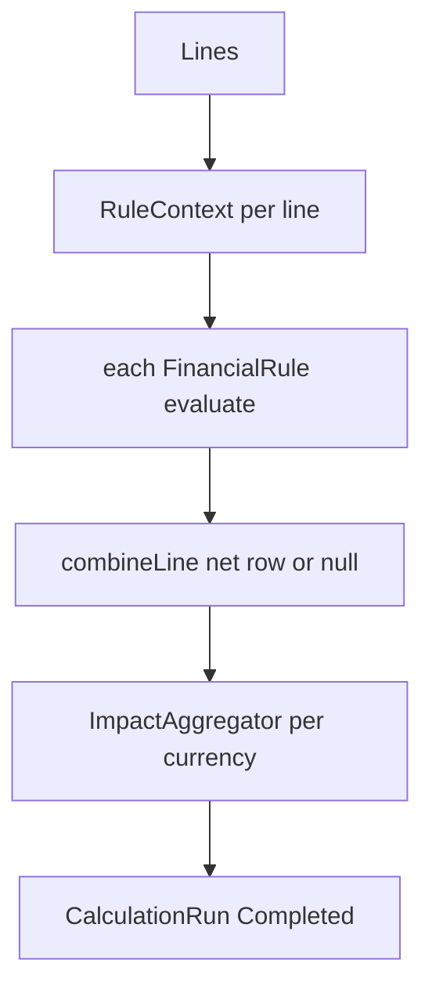

# 02 Truth + Contract (HEART)

## A. WHY
Turns normalized invoices + contract terms into trusted
money: expected vs actual -> variance -> impact,
bit-reproducible months later. No LLM here by design.

## B. FLOW

Formula: expectedNet = expectedGross - expectedDiscount
+ tax; actualNet likewise; netVar = pricingVar -
discountVar (assertReconciled). Tax pass-through cancels
but stays in payable.

## C. FILES
| pkg | n | st | job |
|---|---|---|---|
| truth/calculator 6 | 6 | REAL | Engine + Expected/Actual/Variance/Impact |
| truth/service 4 | 4 | REAL | Calculation, Run lifecycle, Reproducibility |
| truth/rules 6 | 6 | REAL | Pricing/DiscountVarianceRule, iface, ctx |
| truth/model 13 | 13 | REAL | Input/Run/Result/Variance/Impact |
| truth/enums 10 | 10 | REAL | CalcType/Status/Confidence/RuleStatus |
| truth/dto+repo+ctrl | 11 | REAL | run/repro endpoints |
| contract/service 11 | 11 | REAL | Price/Discount/Selector/Scale |
| contract/model 13 | 13 | REAL | Contract/Pricing/Discount/Window |
| contract/enums 8 | 8 | REAL | Pricing/Discount/Status types |
| contract/dto 14 | 14 | REAL | ResolvedPrice, DiscountEvaluation |
| contract/extraction 4 | 4 | REAL | pre-LLM regex extractor |

## D. DEEP DIVE Engine.calculate L127-171
guards -> evaluatedAt=clock.instant() ONCE -> per line
build ctx(line,asOf,currency,pricingTerm,discountTerms)
-> per rule appliesTo?evaluate:notApplicable -> map ->
combineLine -> collect combined -> aggregate(counts per
currency) -> Completed run.
### combineLine L196-258
pricing not Evaluated=>null. discount Incomplete=>null
(not zero!). gross/discount/tax -> nets -> netVar ->
components=pricingVar-discountVar -> decomposable?
(measured or actualDiscount zero) -> assertReconciled
else MEDIUM + note -> combined row NET_EXPECTED_AMOUNT.
### Services
CalculationService: thin facade, netResults excludes
components (no double-sum), netVarianceIn single-currency
else throws. RunService start/complete/fail with checksum
preserved, failure truncated 2000. Reproducibility verify:
re-run same runId, diff checksum/ruleVersion/count/rows/
fingerprint -> Verdict.
### Price L61 resolve
inForce+currency(no FX)+has-price -> MonetaryScale.price
(6dp) -> clamp floor then ceil -> ResolvedPrice+wasClamped.
resolveFor selects inForce or throws (no guessing).
### Discount evaluateFor
ONE term only (no stacking in V5), percent=gross/100*val
at 4dp or fixed+currency check, caps: maxAmount then gross,
reason None/Max/Gross.

## E. GOTCHAS
- Missing price fails run (no default). Clock injected,
  read once. Rules sorted, dup code rejected. Double-sum
  components is the classic report bug.

## G. NEXT -> 03 opportunities from combined rows.
