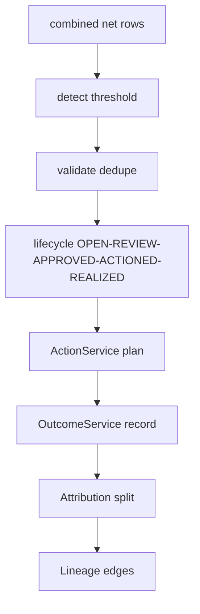

# 03 Opportunity + Value + Evidence

## A. WHY
Money findings become owned work: significant variances ->
deduplicated opportunities -> reviewed state machine ->
actions -> realized outcomes with proof -> attribution
without double-count -> lineage DAG for auditors.

## B. FLOW

Tables V8 opp+reviews, V9 actions+outcomes+attributions,
V7 evidence+edges.

## C. FILES (mostly PH, enums REAL)
opportunity 40 PH: service 5, model 12, dto 7, ctrl 3,
repo 3, enums 10. value 24 PH: svc 4, model 5, dto 5,
enum 5, repo 3, ctrl 2. evidence 26: enums 5 REAL, rest PH.

## D. INTENDED BEHAVIOR (from tests)
- Detect: |var|>=threshold AND conf HIGH/MED else skip.
  Map amount=var, ruleCode, sourceRef.
- Validate: reject zero var, LOW w/o reviewer, duplicate
  (org,entity,rule,period)->Conflict.
- Lifecycle: only OPEN->IN_REVIEW->APPROVED->ACTIONED->
  REALIZED (+REJECTED/EXPIRED), audit each.
- Action: link oppId PLANNED->IN_PROGRESS->DONE/CANCEL.
- Outcome: amount<=opp amount else Validation, needs
  evidenceId.
- Attribution: sum(split)==outcome total, else fail.

## E. GOTCHAS
- Never double-count attribution. Outcome without
  evidence is invalid. Lineage must be acyclic DAG.

## F. IMPLEMENT (each PH one-liner)
OppDetection: filter+map net rows. OppValidation: guards.
OppLifecycle: state machine. OppReview/Service: facade.
Models: JPA+org FK+version. DTOs: records+validation.
Controllers: detect-from-run/review/list tenant-scoped.
Repos: JPA+findByOrg+findDuplicate. Value mirror.
Evidence: EvidenceService store ref; LineageService append
edge+cycle check; SnapshotService freeze checksum.

## G. NEXT -> 04 explain/report once realized.
