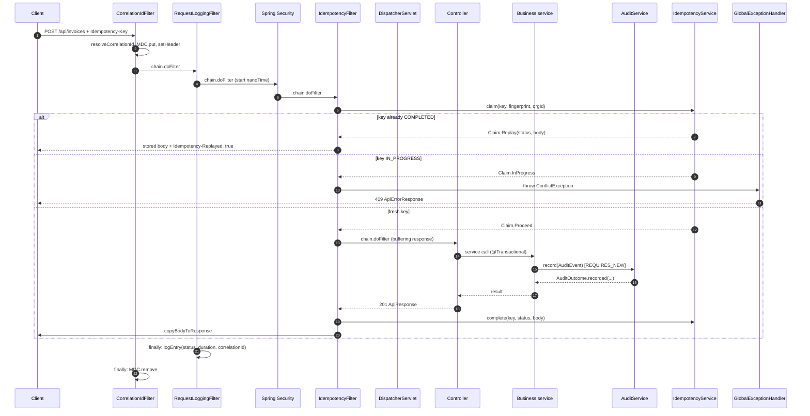
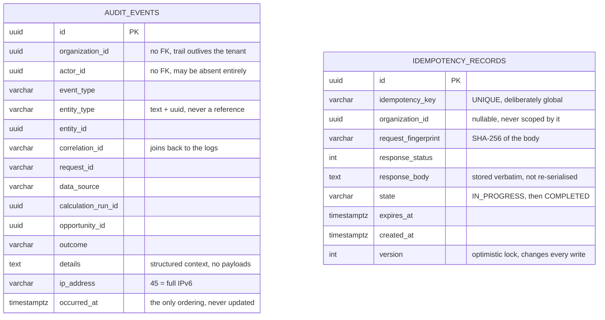

# 03 — `platform`

> The layer every request passes through and every claim the system makes passes
> out of. It owns the shape of an HTTP response, the identity of a request in the
> logs, the record of who did what, the guarantee that a retried payment is not
> paid twice, and the handful of configuration beans that make those mechanisms
> behave consistently.

---

## A. WHY this module exists

Before this platform existed, the finance team's problem was not that numbers were
wrong. It was that when someone asked *why* a number was wrong, the answer was
"the system said so". A reported opportunity of ₹4.2L had no way to be traced to
the invoice line that produced it, the calculation run that priced it, the request
that triggered it, or the person who approved it. Nobody could reconstruct the
sequence, so nobody could defend the number, and a system that cannot be defended
is a system nobody signs off on.

`platform` is the set of cross-cutting guarantees that make every other module's
claim reconstructable. It is deliberately not a business module — it has no
invoices, no opportunities, no contract logic — but it is where the evidence
trail for those things is actually created. It answers four questions for every
fact the system produces: *who did this*, *what request was this part of*, *has
this already been done*, and *did the write actually succeed*.

Without it, the specific bad outcomes are these. An operator investigating a
client complaint cannot find the request, because nothing joins the HTTP access
log to the application's own log lines. A client retries a `POST` after a network
timeout and the invoice is created twice, because nothing remembers that the first
attempt ran. A finance controller validates an opportunity and the action is
recorded with no actor, no time and no tenant, because there is no single place
that decides what "recorded" means. A `double` slips into a monetary field and a
value is wrong in the third decimal place with no way to find where. Each of
these is individually survivable; together, over a quarter of usage, they make the
platform's output unauditable, which is the same as unusable for a financial
product.

The module's hard invariants — the promises the rest of this chapter refers back
to — are:

- **Every response carries a correlation ID**, on the response header, in the
  response body, and stamped onto every log line for that request. A user can
  quote it; support can find it.
- **No error response ever contains a cause.** Stack traces, SQL, file paths,
  internal class names and provider internals are logged for the operator and
  never returned to the caller. Known domain exceptions, whose messages are
  written for clients, are the only messages echoed.
- **Money, contract text, file contents and tokens are never logged, and never
  used as a metric tag.** Not in the access log, not in the exception log, not in
  telemetry.
- **A retried write with the same `Idempotency-Key` and the same body returns the
  original response and does not re-run the work.** The same key with a
  *different* body is a `409`, never a stale replay.
- **Audit records are append-only and survive the business transaction.** A
  rollback does not erase the fact that someone tried. But the write can fail,
  and the caller is handed an outcome that says so.
- **Errors are translated in exactly one place.** A `NotFoundException` produces
  the same body whether it came from the invoice endpoint or the opportunity
  endpoint.
- **Tracing is not configured until there is an exporter.** A tracer that builds
  spans and discards them costs money and lies about coverage.

---

## B. FLOW — the runtime journey

The diagram below is the full request path. Only `web/` and `idempotency/`
participate; `audit/`, `storage/`, `persistence/` and `observability/` are called
from inside the business modules that this chapter's flow enters at step 6.



### Numbered steps

1. **Trigger** — any HTTP request arrives.
   **Where** — `CorrelationIdFilter.doFilterInternal` (`web/CorrelationIdFilter.java:115`).
   **What it does** — resolves or mints a correlation ID and publishes it on three channels: the request attribute `REQUEST_ATTRIBUTE`, the `X-Correlation-ID` response header, and the SLF4J `MDC` under key `correlationId`.
   **Why it does it that way** — it must be the *first* thing to run, for two independent reasons. The security filters log under this ID, so a request rejected before authentication is still traceable; and the ID must exist *before anything can fail*, because the failure case is precisely the case that most needs an identifier. All three channels are populated from one value, so they cannot disagree; the response header, the log lines and the body are guaranteed to carry the same string.

2. **Trigger** — the chain continues after the correlation filter.
   **Where** — `RequestLoggingFilter.doFilterInternal` (`web/RequestLoggingFilter.java:91`).
   **What it does** — takes a `System.nanoTime()` reading, delegates the whole chain, and in a `finally` block writes exactly one log entry at a level chosen from the final status and elapsed time.
   **Why it does it that way** — a filter is the only place that can observe a request as a whole: a controller-level log would miss time spent in filters and would produce nothing at all for a request rejected by security. Logging in `finally` means the entry is written for failures too; and because `GlobalExceptionHandler` converts a thrown exception into a *handled* response, `response.getStatus()` is the only reliable evidence of what actually happened. `nanoTime` rather than `currentTimeMillis` because a monotonic clock cannot jump backwards under NTP resynchronisation and produce a negative duration.

3. **Trigger** — an unsafe HTTP method carrying an `Idempotency-Key` header.
   **Where** — `IdempotencyFilter.shouldNotFilter` (`idempotency/IdempotencyFilter.java:87`).
   **What it does** — returns `true` (skip) for `GET`, `HEAD`, `OPTIONS`, `TRACE` or when the header is absent, so the overwhelming majority of traffic never touches the idempotency table.
   **Why it does it that way** — the safe/unsafe split is the HTTP specification's own definition: a duplicate of a safe method is harmless. Everything else, including any method this code does not anticipate, is assumed to be state-changing, which is the conservative default. Overriding the hook rather than branching inside `doFilterInternal` means a non-applicable request is never wrapped in a buffering response and never pays the feature's cost.

4. **Trigger** — a request that opted in passes the gate.
   **Where** — `IdempotencyFilter.doFilterInternal` (`idempotency/IdempotencyFilter.java:137`).
   **What it does** — validates and trims the key, fingerprints the request line, and calls `IdempotencyService.claim(key, fingerprintSource, currentOrganizationId())`.
   **Why it does it that way** — the key is validated against the *same 255-character bound the column enforces* (`MAX_KEY_LENGTH`, line 59), which turns a would-be database truncation error into a clean edge rejection before any state exists for the key. The fingerprint deliberately covers method, URI and query string but **not the body**: reading the body would consume the input stream the controller still needs. That is a real limitation, documented at lines 31–40, and it is why handlers needing body-level deduplication (ingestion's file checksum) must fingerprint their own payload.

5. **Trigger** — a claim is taken or a decision is reached on an existing one.
   **Where** — `IdempotencyService.claim` (`idempotency/IdempotencyService.java:64`) and `IdempotencyService.decide` (`:136`).
   **What it does** — either inserts a fresh `IN_PROGRESS` record and returns `Claim.Proceed`, or applies the decision order to an existing record: fingerprint mismatch → `ConflictException`; expired → expire and proceed; `COMPLETED` → `Claim.Replay`; `IN_PROGRESS` → `Claim.InProgress`; `FAILED`/`EXPIRED` → reset and proceed.
   **Why it does it that way** — the ordering *is* the design, and it is the reverse of the intuitive one. The fingerprint comparison comes first because a key reused with a different payload is a client defect that must be reported whatever state the record is in: serving a stored response there would return one answer to a question the caller did not ask. Expiry is checked second because an expired record carries a response that must not be replayed. State is read last, because only then is a stored response actually meaningful.

6. **Trigger** — a `Claim.Replay` comes back.
   **Where** — `idempotency/IdempotencyFilter.java:155`.
   **What it does** — echoes the key and `Idempotency-Replayed: true`, writes the stored status and body verbatim, and **returns without invoking the chain**.
   **Why it does it that way** — not invoking the chain is the entire point of the mechanism. The work must not happen twice. Replaying the raw stored string rather than re-serialising a parsed object is what makes the reproduction byte-for-byte, including number formatting — a re-serialised monetary value could differ from the original in its last digit.

7. **Trigger** — a `Claim.InProgress` comes back.
   **Where** — `idempotency/IdempotencyFilter.java:176`.
   **What it does** — throws `ConflictException("A request with this Idempotency-Key is still in progress")`.
   **Why it does it that way** — throwing the shared domain exception rather than writing a response by hand means the 409 is rendered by `GlobalExceptionHandler` in the identical error envelope as every other failure, with the correlation ID attached, for free. The status is 409 rather than 429 because the client's remedy is to retry the *same* request later, not to change the payload.

8. **Trigger** — this request owns the work.
   **Where** — `idempotency/IdempotencyFilter.java:180`.
   **What it does** — wraps the response in a `ContentCachingResponseWrapper`, runs the chain, and on the way out calls `complete(...)` for a status below 400 or `abandon(...)` for 4xx/5xx or an exception, before `copyBodyToResponse()`.
   **Why it does it that way** — three deliberate orderings. *Complete before flush*: a retry arriving in the window between the handler returning and the client receiving the response can already replay the completed result; the reverse order would tell a duplicate "still in progress" for work that had just finished. *Abandon on failure*: a claim that is never completed blocks that key permanently, and storing an error body would pin a transient failure to a key forever. *Buffering only here*: the memory cost of holding a response in memory is paid only by callers who asked for replayability.

9. **Trigger** — the controller delegates into a business service.
   **Where** — `TransactionConfig` (`config/TransactionConfig.java:19`) enables `@EnableTransactionManagement`; the boundary lives on the application-service method, never on a repository.
   **What it does** — opens one transaction around the business mutation.
   **Why it does it that way** — the rule from the architecture document is that a financial mutation and its audit row belong in the same transaction *except* where the audit is deliberately isolated. Large ingestion and calculation work is explicitly excluded; it uses chunked transactions under `processing/`. Wrapping a multi-gigabyte file parse in one transaction would hold locks and MVCC versions for the whole job and turn any failure into a full rollback of hours of work.

10. **Trigger** — a business rule changes a financial fact.
    **Where** — `AuditService.record(AuditEvent)` (`audit/AuditService.java:68`).
    **What it does** — fills `occurredAt` from `DateTimeUtils` if absent, converts the event to an entity via `AuditEventEntity.from`, saves it, and returns an `AuditOutcome`.
    **Why it does it that way** — the method is annotated `Propagation.REQUIRES_NEW`, so the audit row commits independently of the business transaction. If the business transaction later rolls back, the audit row remains, because the *attempt* happened and is itself auditable. The other half of the same trade-off is in the `catch` block: a `DataAccessException` is logged and returned as `AuditOutcome.failed(...)` rather than rethrown, because losing an audit row must never roll back a legitimate financial operation. The consequence — that the audit trail is not transactionally consistent with business data — is why §8 of the rules requires callers to check `outcome.recorded()`.

11. **Trigger** — an exception escapes the handler method.
    **Where** — `GlobalExceptionHandler` (`web/GlobalExceptionHandler.java:65`).
    **What it does** — picks the most specific `@ExceptionHandler` whose declared type is assignable from the thrown one, then funnels every case through one `build(...)` method that produces `ApiErrorResponse`.
    **Why it does it that way** — one builder is what guarantees the envelope is byte-identical regardless of which exception occurred, and that a future handler cannot forget the correlation ID. The specific methods must be declared ahead of the `Exception.class` catch-all because Spring resolves by assignability, and without that ordering `BusinessRuleException` and `DomainException` would be swallowed and reported as 500.

12. **Trigger** — the request completes, successfully or not.
    **Where** — `RequestLoggingFilter.logEntry` (`web/RequestLoggingFilter.java:129`) and `CorrelationIdFilter`'s `finally` (`web/CorrelationIdFilter.java:128`).
    **What it does** — writes the single access-log line at ERROR for 5xx, WARN for slow-or-4xx, INFO otherwise; then removes the MDC entry.
    **Why it does it that way** — the MDC removal is not tidiness. The MDC is a `ThreadLocal` and the servlet container reuses request threads; without the removal the next request served by that thread would log every one of its lines under the previous request's ID, silently corrupting the trail this mechanism exists to produce. It must be in `finally` so an exception unwinding the chain does not skip it.

### Schema — V10, the two tables `platform` owns



The two tables are deliberately unconnected, and that absence of edges is the design
rather than an omission. `AUDIT_EVENTS` is an append-only observation of every other
table in the schema and therefore carries **no foreign key to any of them**: an audit
trail must be able to record events about entities that no longer exist, and must not be
deleted when a business record is. Referencing the business tables would make the trail
the least durable thing in the schema. `IDEMPOTENCY_RECORDS` is the one mutable table in
the schema, because a request genuinely does transition from in-flight to completed.
The invariants enforced are: an event is written once and never updated, one key maps to
at most one stored response globally, and a key reused with a different request body
cannot be served the first response.

- **`ux_idempotency_key` (UNIQUE, global — not per tenant)** — if this could be violated,
  a replay would read an arbitrary one of several rows. Deliberately global so that a bug
  in tenant scoping surfaces as a constraint violation instead of passing silently.
- **`request_fingerprint` NOT NULL (SHA-256 of the body)** — a client that reuses a key
  for a genuinely different request is refused rather than being served the first
  response, which would report success for work that was never done.
- **`version BIGINT` optimistic lock on `idempotency_records`** — two concurrent requests
  carrying one key both read version 0; only the first UPDATE succeeds and the loser
  replays the winner's stored response instead of running the handler twice. A counter
  rather than a timestamp because it must change on *every* write.
- **No foreign keys on `audit_events`** — the trail survives deletion of the
  organization, the actor, and the record it describes; `entity_type` + `entity_id` stay
  readable as text forever.
- **`occurred_at` and the absence of any update path on `audit_events`** — the append-only
  guarantee the whole audit design rests on; mutating the ordering column would break it.
- **`ip_address VARCHAR(45)`** — 45 is the maximum length of a fully expanded IPv6
  address, so the value is never truncated into a different address that still parses.

---

## C. FILES — every file in the module

**28 files: 27 built, 1 interface with no production-grade adapter.**

| file | status | what it is for | key methods / lines |
|---|---|---|---|
| `web/GlobalExceptionHandler.java` | BUILT | Single translation layer from any exception to a safe HTTP error body. | `handleMethodArgumentNotValid`:80, `handleUnreadable`:111, `handleNotFound`:138, `handleConflict`:150, `handleBusinessRule`:187, `handleDomain`:199, `handleUnexpected`:227, `build`:247, `convertFieldErrors`:280 |
| `web/CorrelationIdFilter.java` | BUILT | Mints or adopts one correlation ID per request and publishes it on three channels. | `doFilterInternal`:115, `resolveCorrelationId`:149, `REQUEST_ATTRIBUTE`:75, `ALLOWED`:95, `MAX_LENGTH`:83 |
| `web/RequestLoggingFilter.java` | BUILT | Emits exactly one structured access-log entry per request, timed, at a severity chosen from the outcome. | `doFilterInternal`:91, `logEntry`:129, `SLOW_REQUEST_THRESHOLD_MS`:66 |
| `web/ApiResponse.java` | BUILT | The success envelope: payload plus `ApiMeta` carrying timestamp and correlation ID. | `success`:24, `ApiMeta`:35 |
| `web/ApiErrorResponse.java` | BUILT | The error envelope; eight fixed fields plus optional per-field errors, defensively copied. | compact constructor:32 |
| `audit/AuditService.java` | BUILT | The only entry point for recording audit facts; writes in an isolated transaction and returns an outcome. | `record`:68, `recordAll`:88, `recordForEntity`:111, `findByCorrelationId`:117, `findEntityHistory`:124, `findByOrganizationAndPeriod`:131, `countByOrganizationAndType`:142, `enrich`:146, `AuditOutcome`:189 |
| `audit/AuditEvent.java` | BUILT | Immutable 15-field audit fact; the transport type, with three fields validated at construction. | compact constructor:75, `of` (request form):105, `of` (system form):128, `withCorrelation`:144 |
| `audit/AuditEventEntity.java` | BUILT | The JPA shape of an audit row, mapped to `audit_events`, with three declared indexes. | `from`:198, `eventType` (`EnumType.STRING`):86, `details` (`TEXT`):150, `ipAddress` (45):158, `occurredAt`:174 |
| `audit/AuditEventJpaRepository.java` | BUILT | Spring Data access for audit rows; read methods only, writes go through `AuditService`. | `findByCorrelationIdOrderByOccurredAtAsc`:31, `findByEntityTypeAndEntityIdOrderByOccurredAtDesc`:41, `countByOrganizationIdAndEventType`:69, `findEntityHistory`:87 |
| `audit/AuditRepository.java` | BUILT | A narrow read/append port describing what an audit store must be able to do, independent of JPA. | `append`:27, `findByCorrelationId`:38, `findEntityHistory`:47, `findByOrganizationAndPeriod`:56, `countByOrganizationAndType`:66 |
| `audit/AuditEventType.java` | BUILT | The closed set of 40+ auditable business events, stored as strings. | `isSecurityEvent`:119 |
| `idempotency/IdempotencyService.java` | BUILT | Owns the claim/decide/complete/abandon lifecycle and the decision order that makes replay safe. | `claim`:64, `complete`:90, `abandon`:102, `purgeExpired`:111, `decide`:136, `fingerprint`:175, `Claim` sealed interface:182 |
| `idempotency/IdempotencyRecord.java` | BUILT | The persisted claim, with `@Version` optimistic locking and a `CHAR(64)` fingerprint column. | constructor:176, `complete`:196, `fail`:210, `expire`:221, `isExpiredAt`:233, `requestFingerprint` mapping:94 |
| `idempotency/IdempotencyFilter.java` | BUILT | Applies idempotency at the HTTP edge, buffering and replaying responses for keyed writes. | `shouldNotFilter`:87, `doFilterInternal`:137, `normalizeKey`:220, `currentOrganizationId`:239 |
| `idempotency/IdempotencyRepository.java` | BUILT | Three-query storage surface for claims: find, exists, bulk delete by expiry. | `findByIdempotencyKey`:39, `existsByIdempotencyKey`:48, `deleteByExpiresAtBefore`:70 |
| `config/ApplicationProperties.java` | `CONFIG` | Typed binding of `cfo.application.*`; immutable, defaulted, and deliberately free of secrets. | record:34, `Environment`:50, `isProduction`:73, `from`:86 |
| `config/AsyncConfig.java` | `CONFIG` | The single `@EnableAsync` declaration, a virtual-thread executor, and the uncaught-exception handler. | `applicationTaskExecutor`:58, `asyncUncaughtExceptionHandler`:75 |
| `config/JacksonConfig.java` | `CONFIG` | One place where JSON behaviour is decided, including the rule that financial numbers never become `double`. | `jsonMapperBuilderCustomizer`:36, `sharedDomainModule`:59 |
| `config/OpenApiConfig.java` | `CONFIG` | Document-level OpenAPI: title, bearer scheme, global security requirement, correlation header. | `openAPI`:49 |
| `config/TransactionConfig.java` | `CONFIG` | Enables transaction management; states the rule that services own boundaries. | `@EnableTransactionManagement`:18 |
| `observability/BusinessMetrics.java` | BUILT | Six business-level metric emissions, none of which tags a tenant, user or monetary value. | `recordCalculationRun`:42, `recordVariance`:68, `recordIngestionBatch`:91, `recordOpportunityLifecycle`:120, `recordAuditFailure`:140, `recordIdempotentReplays`:154 |
| `observability/MetricsConfiguration.java` | `CONFIG` | Two registry guards: a deny filter for identity tags and a cap on distinct meters. | `forbidIdentityTags`:40, `capMeterCount`:52, `FORBIDDEN_TAG_KEYS`:26 |
| `observability/TracingConfiguration.java` | `CONFIG` | Stamps `application=cfo-api` on every meter; explicitly does **not** configure tracing. | `applicationIdentityTag`:31 |
| `persistence/JpaConfiguration.java` | `CONFIG` | JPA auditing wiring: the identity auditor and the UTC timestamp auditor, referenced by name. | `auditorAware`:50, `timestampAuditor`:71 |
| `persistence/PersistenceAuditListener.java` | BUILT | A testable `AuditorAware<UUID>` collaborator duplicating the auditor logic in `JpaConfiguration`. | `getCurrentAuditor`:32, `hasAuthenticatedActor`:43, `currentTimestamp`:51 |
| `storage/ObjectStoragePort.java` | BUILT | The storage seam: stream in, stream out, metadata handle. No vendor types cross it. | `store`:30, `retrieve`:42, `exists`:62, `delete`:76, `localPath`:91 |
| `storage/ObjectStorageService.java` | BUILT | Tenant-scoped, checksum-verified facade over the port, plus a sandboxed local-filesystem default adapter. | `store`:60, `verify`:76, `retrieve`:89, `requireTenantPrefix`:107, `sanitize`:114, `LocalFileObjectStorageAdapter`:154, `resolve`:221 |
| `storage/StorageObject.java` | BUILT | Metadata handle for a stored blob. Carries no content, deliberately. | compact constructor:35 |

Reconciled against `src/main/java/com/fintech/cfo/platform/`: 28 `.java` files,
`audit` 6, `config` 5, `idempotency` 4, `observability` 3, `persistence` 2,
`storage` 3, `web` 5.

---

## D. DEEP DIVE — method by method

### D.1 `GlobalExceptionHandler` — the one place a failure becomes an HTTP response

The type is `@RestControllerAdvice` (`:64`) rather than a per-controller handler,
and that choice is not stylistic. Advice is registered once for all controllers,
so a `NotFoundException` maps identically whether it was reached through the
invoice endpoint or the opportunity endpoint; and because it is advice and not a
controller, it is not itself routable.

#### The full handler→status mapping

| handler method | line | exception(s) | status | `code` | message returned to client |
|---|---|---|---|---|---|
| `handleMethodArgumentNotValid` | :80 | `MethodArgumentNotValidException` | 400 | `ValidationException.CODE` | fixed: "One or more request fields are invalid." + per-field map |
| `handleConstraintViolation` | :96 | `ConstraintViolationException` | 400 | `ValidationException.CODE` | `ex.getMessage()` |
| `handleUnreadable` | :111 | `HttpMessageNotReadableException` | 400 | `MALFORMED_REQUEST` | fixed: "The request body could not be parsed." |
| `handleBadRequestParameter` | :127 | `MethodArgumentTypeMismatchException`, `MissingServletRequestParameterException` | 400 | `MALFORMED_REQUEST` | `ex.getMessage()` |
| `handleNotFound` | :138 | `NotFoundException` | 404 | `NotFoundException.CODE` | `ex.getMessage()` |
| `handleConflict` | :150 | `ConflictException` | 409 | `ConflictException.CODE` | `ex.getMessage()` |
| `handleAccessDenied` | :161 | `AccessDeniedException` | 403 | `AccessDeniedException.CODE` | `ex.getMessage()` |
| `handleValidation` | :173 | `ValidationException` | 400 | `ValidationException.CODE` | `ex.getMessage()` |
| `handleBusinessRule` | :187 | `BusinessRuleException` | **422** | `BusinessRuleException.CODE` | `ex.getMessage()` |
| `handleDomain` | :199 | `DomainException` | 400 | `ex.getCode()` | `ex.getMessage()` |
| `handleIllegalArgument` | :209 | `IllegalArgumentException` | 400 | `ValidationException.CODE` | `ex.getMessage()` |
| `handleUnexpected` | :227 | `Exception` (catch-all) | 500 | `INTERNAL_ERROR` | **fixed:** "An unexpected error occurred." |

Four of these mappings carry decisions worth stating outright.

**`MethodArgumentNotValidException` (`:80`)** is raised *before* the controller
method is entered, so business logic never sees the invalid input. The handler
flattens the `BindingResult` into a field-to-message map so a client can highlight
individual inputs rather than parse prose, and it uses `LinkedHashMap` (`:281`) so
the declaration order of constraints is preserved and the same invalid request
always produces a byte-identical response — a diff of two responses is then
meaningful. `putIfAbsent` keeps the first message per field, and the field pass
runs before the global-error pass (`:282`–`:286`) so a field-specific message
always beats a class-level one.

**`HttpMessageNotReadableException` (`:111`)** is a *client* error, not a server
fault, because the caller sent something this endpoint cannot interpret. The
Jackson message is suppressed specifically because it quotes the offending payload
and internal class names, which helps an attacker map the application's internals.

**`BusinessRuleException` → 422 (`:187`)** is the mapping most likely to be
"simplified" to 400. It must not be. The payload is well-formed and the client is
not at fault for the field values; the operation is simply not permitted in this
state. A 400 invites the client to resend edited data, which cannot help.

**`NotFoundException` → 404 (`:138`)** covers both "does not exist" and "you may
not know that it exists". The 404 rather than 403 in the second case is a
deliberate information-disclosure control: distinguishing them would let a caller
enumerate records belonging to another tenant. The same reasoning appears again in
`ObjectStorageService.requireTenantPrefix` (`storage/ObjectStorageService.java:107`).

#### The catch-all, and why it logs with the correlation ID and returns a generic message

```java
@ExceptionHandler(Exception.class)
public ResponseEntity<ApiErrorResponse> handleUnexpected(Exception ex, HttpServletRequest request) {
    log.error("Unhandled exception correlationId={} method={} path={}", getCorrelationId(request),
            request.getMethod(), request.getRequestURI(), ex);
    return build(HttpStatus.INTERNAL_SERVER_ERROR, "INTERNAL_ERROR", "Internal server error",
            "An unexpected error occurred.", request, Map.of());
}
```
(`web/GlobalExceptionHandler.java:227`)

The two halves of that method are different on purpose. The full exception and its
stack trace go to the `Logger`, for the operator. The response carries a fixed
string, for the caller. The class javadoc states the reason at lines 52–57:
exception messages routinely embed SQL, file paths, internal identifiers and
provider internals, and echoing one to an untrusted client is an information
disclosure. The operator gets everything they need to debug; the caller gets
nothing to exploit. The domain exceptions are the deliberate exception to the rule
— their messages are written for clients, which is why it is safe to echo them —
and that contract is why §9 of the rules says to throw the typed exceptions from
`shared.exception` rather than raw framework ones.

`correlationId`, `method` and `path` are logged alongside the exception (`:229`) so
the entry can be located from the ID the client was shown in the response body.
Without that, a user reporting a 500 with a correlation ID could not connect the
two.

#### `build(...)` (`:247`)

All twelve handlers funnel through this one method, and that is the point: the
envelope — timestamp, numeric status, stable `code`, `title`, `detail`, `path`,
`correlationId`, optional `fieldErrors` — is identical no matter which exception
occurred, and a future handler physically cannot forget the correlation ID.
`ResponseEntity.status(...).body(...)` sets both the status line and the entity;
nothing is written to the response body directly.

`getCorrelationId` (`:262`) is null-tolerant by design. The attribute is absent if
the filter did not run (a unit test, a non-HTTP invocation), and a missing
correlation ID must never turn into a second failure while already handling one.

### D.2 `CorrelationIdFilter` and `RequestLoggingFilter` — ordering, and what is never logged

#### Filter ordering

`CorrelationIdFilter` is `@Order(Ordered.HIGHEST_PRECEDENCE)` (`:61`) and
`RequestLoggingFilter` is `@Order(Ordered.HIGHEST_PRECEDENCE + 1)` (`:52`).
`@Order` on a `@Component` filter is honoured by Spring Boot's
`FilterRegistrationBean` auto-registration; nothing else in the module overrides
it, so the two values are the whole ordering.

The `+1` is a hard requirement rather than a preference. `RequestLoggingFilter`
reads the correlation ID out of the `MDC` (`:104`) and puts it in the log line. If
it ran first, every access-log entry would carry a `null` correlation ID and the
one line an operator is most likely to start from would be the one unjoinable
with the rest.

`CorrelationIdFilter` itself must be first for two *independent* reasons, stated at
lines 37–40: the Spring Security filters log under this ID, so a request rejected
before authentication is still traceable; and the ID must exist before anything can
fail, or the failure itself would be untraceable. Both the `response.setHeader`
call (`:122`) and the `MDC.put` (`:124`) are placed **before** `filterChain.doFilter`
for the same reason — the failure case is precisely the case that most needs an
ID, and it is the case that would be missing it if the header were set afterwards.

#### `resolveCorrelationId` (`:149`) — the trust boundary

An inbound `X-Correlation-ID` is honoured, but only after three checks:

1. `StringUtils.hasText` rejects null, empty and whitespace-only. An empty ID is
   worse than none at all — it would group unrelated requests together.
2. `trim()` handles a value that arrived padded, which proxies and some gateways do.
3. `MAX_LENGTH` (64) and the anchored pattern `^[A-Za-z0-9._-]+$` (`:95`) are then
   applied together.

**Why the pattern and not a sanitiser.** The header is attacker-controlled and this
value reaches log files. The allow-list refuses CR and LF — whose entire purpose in
a header value is to let a caller forge additional log lines — plus spaces and
angle brackets that could break log parsing. Anchoring at both ends means a
partially-valid string such as `"abc\nGET /admin"` is *rejected* rather than
trimmed down to a plausible-looking prefix, which would be the worst outcome: a
forged ID that looks legitimate.

**Why a fresh UUID rather than a 400.** A malformed observability header should
not fail a legitimate business request. Generating rather than rejecting means a
hostile or broken client degrades to a unique ID for itself instead of degrading
the observability of the whole system for everyone. The comment at `:158` adds the
reason for randomness over sequential or timestamp-based: the ID is not a secret,
but it must not be guessable enough to let one tenant imply another's.

**Why `OncePerRequestFilter`.** An internal forward — for example to an error page
— must not mint a second ID for what the user experiences as one action.

#### `RequestLoggingFilter` — the privacy boundary

The logged line is exactly five fields (`:130`):

```
method={} uri={} status={} durationMs={} correlationId={}
```

**Never logged:** authorization headers, cookies, request or response bodies,
uploaded file contents, contract text, and any customer financial payload. The
class javadoc (`:42`–`:49`) states why this filter is the right place to enforce
it: it sits on the request path of *every* endpoint in the system, so anything it
logged would end up in the organisation-wide log aggregation store. The deliberate
omission of payloads is what keeps that store free of customer financial data.

The same rule is applied to the async path: `AsyncConfig.asyncUncaughtExceptionHandler`
(`config/AsyncConfig.java:79`) logs the failing `Method` and the exception and
deliberately **not** the arguments, because arguments to an async business task can
carry customer financial data.

`logEntry` (`:129`) splits three ways — ERROR for 5xx, WARN for slow-or-4xx, INFO
otherwise — so an operator can filter WARN-and-above to see every slow or
unsuccessful request, and ERROR to see only genuine server faults, without reading
the whole stream. The message format string is declared once and reused across all
three calls because the logged field names must be identical regardless of level;
otherwise a query matching on `correlationId` would miss entries purely because of
the level they were written at. The condition order is cheapest-first and
deliberate: a 5xx is always an error even if it was also slow.

`SLOW_REQUEST_THRESHOLD_MS = 2_000` (`:66`) is a latency budget, not a failure
threshold. Crossing it does not mean anything is broken, but it does mean the
request would be visible to a user as a delay, so it is surfaced at WARN where
alerting can pick it up without filling the log with errors.

### D.3 `ApiResponse` — the success envelope, and why nobody hand-rolls an error body

```java
public static <T> ApiResponse<T> success(T data, String correlationId) {
    return new ApiResponse<>(data, new ApiMeta(Instant.now(), correlationId));
}
```
(`web/ApiResponse.java:24`)

Two fields of `ApiMeta`: the response creation time, and the correlation ID
**echoed rather than generated here**. That word is the invariant: the body and
the `X-Correlation-ID` header must always agree, and they can only agree if
there is exactly one source of truth, which is the request attribute the filter
set. If a second UUID were minted at serialisation time, a client that compared
the two would find them different, and support would lose the ability to quote one
identifier.

`ApiResponse` is HTTP representation only — the class javadoc (`:8`) is explicit
that domain and application services return domain results or DTOs, never this
wrapper. It belongs in the web layer.

`ApiErrorResponse` (`:22`) is the matching failure shape. Its compact constructor
(`:32`) replaces a null `fieldErrors` with `Map.of()` and otherwise applies
`Map.copyOf`, so the field-error map is immutable and cannot be mutated after the
response has been constructed — which matters because the same object is handed to
the serialiser and, in tests, inspected afterwards.

§9 of `module-implementation-rules.md` states the rule this pair exists to enforce:
*return `ApiResponse<T>` for success and let `GlobalExceptionHandler` render
failures; do not hand-roll error bodies*, and *never return an entity directly,
map to a DTO*. **WHY** a hand-rolled error body is forbidden rather than merely
discouraged: a hand-rolled body is the one place where a cause leaks. A controller
that catches its own exception and returns `new ErrorResponse(ex.getMessage())`
produces a response containing a SQL fragment, a file path, or a provider's
internal error text — the exact leak the catch-all is designed to prevent — and it
does so *outside* the one place that decides the mapping, so the client sees two
different error shapes depending on which endpoint failed. Centralising the
translation is what makes the status/code pair a stable contract a client can
branch on, and the OpenAPI description says so explicitly ("clients must depend on
'code' rather than 'detail'", `config/OpenApiConfig.java:61`).

### D.4 `idempotency` — duplicate detection, replay, and the deliberate global key

#### The claim lifecycle

`IdempotencyService.claim` (`:64`) runs in `Propagation.REQUIRES_NEW`. **WHY claim
before, not after:** the claim is taken in its own short transaction *before* the
business work starts. If the process dies mid-handler, the claim is already durable
and the retry replays rather than duplicating. A claim written after the work
would be worthless in exactly the case it exists for.

`saveAndFlush` (`:76`) is used rather than `save` so the insert and its unique-index
check happen inside this transaction. The `catch (DataIntegrityViolationException)`
at `:79` closes the read-then-insert race: another thread inserted the same key
between our read and our insert, so we re-read and apply the normal decision path.

#### The request fingerprint

```java
private static String fingerprint(String payload) {
    return HashUtils.sha256(payload == null ? "" : payload);
}
```
(`idempotency/IdempotencyService.java:175`)

The hash exists so a stored record can be compared against a new request **without
storing the payload itself** — the column is `CHAR(64)`, and the body is never
persisted for this purpose. The `null`-to-empty-string mapping is deliberate: a
request with no query string still fingerprints deterministically instead of
failing the claim.

**WHY the fingerprint is what makes the mechanism safe rather than merely
convenient.** Without it, a client that reuses a key for a genuinely different
request would silently receive the first request's response. That is the worst
failure mode in the whole set: the client would report *success* for work that was
never done, and the duplicate would be discovered only when someone noticed the
second thing never happened. `IdempotencyRecord.requestFingerprint`'s javadoc
(`:71`–`:79`) says exactly this.

#### `decide(...)` (`:136`) — the ordering is the design

```
fingerprint mismatch  → ConflictException
expired               → expire(now), save, Claim.proceed
COMPLETED             → Claim.replay(status, body)
IN_PROGRESS           → Claim.inProgress
FAILED, EXPIRED       → fail(now), save, Claim.proceed
```

The javadoc at `:120`–`:128` explains the reverse-intuitive order precisely, and
it is worth restating because each position is load-bearing:

- **Fingerprint first.** A key reused with a different payload is a client defect
  that must be reported *whatever the record's state*. Serving a stored response
  here would return one answer to a question the caller did not ask.
- **Expiry second.** An expired record still holds a response, but that response is
  no longer meaningful; serving it would hand a caller who has moved on a stale
  answer.
- **State last**, because only now is a stored response actually replayable.

The fingerprint comparison uses `equals` and not a null-safe comparison, with the
reason stated at `:138`: the column is `NOT NULL` and is populated at insert, so a
`null` here can only mean a genuine payload change, not missing data.

`isExpiredAt` (`:233`) uses `!instant.isBefore(expiresAt)` rather than
`isAfter`, making the boundary **inclusive** — a record expiring exactly now *is*
expired. Excluding the boundary would leave a key usable at the precise instant it
should stop being so.

An expired record is **marked expired and then reused, rather than deleted**
(`:145`), so the key stays unique in the table and a racing insert cannot win the
unique index out from under the existing row.

#### Why the key is deliberately GLOBAL, not tenant-scoped

`IdempotencyRecord.idempotencyKey` (`:63`) carries a unique index with no tenant
column, and `IdempotencyRepository.findByIdempotencyKey` (`:39`) is likewise not
tenant-scoped. The javadoc gives the reason at both ends, and `V10__create_audit.sql:72`–`:75`
states it a third time: a per-tenant key would let two organisations use the same
string, and a bug in tenant scoping would then be **invisible rather than caught by
a constraint violation**.

Read the other way: global uniqueness converts a tenancy bug from a silent
data-correctness problem into a loud conflict. The cost accepted is that two
tenants who independently generate the same key string collide — a false positive,
answered with a `409` and a clear message. The alternative — per-tenant keys — buys
that convenience at the price of being unable to detect the exact bug that makes one
tenant read another's cached response. The trade is deliberate: a visible false
conflict is cheap, an invisible cross-tenant leak is not.

`IdempotencyRepository`'s javadoc (`:31`–`:34`) adds the matching constraint on the
read path: adding a tenant predicate would imply a per-tenant uniqueness the schema
does not enforce, and a lookup that returned empty for another tenant's key would
hide a real conflict. `IdempotencyService` compares organisations on the returned
record instead.

Note the naming tension this creates, and it is worth flagging so a reader does not
"fix" it: `IdempotencyFilter.currentOrganizationId` (`:239`) passes the tenant
into `claim(...)`, and the record stores it, but the *lookup* that decides is global.
The stored `organizationId` is evidence of who claimed the key, not a partition of
the key space.

#### ⚠ `IdempotencyRecord` needed `@JdbcTypeCode(SqlTypes.CHAR)` because V10 declares `CHAR(64)`

This is the subtlest piece of the module and the one most likely to be undone by a
"simplification".

```java
@Column(name = "request_fingerprint", nullable = false, columnDefinition = "char(64)")
@JdbcTypeCode(SqlTypes.CHAR)
private String requestFingerprint;
```
(`idempotency/IdempotencyRecord.java:94`–`:96`)

`V10__create_audit.sql:82` declares:

```sql
request_fingerprint CHAR(64)  NOT NULL,
```

**WHY the annotation is required.** Every profile sets `spring.jpa.hibernate.ddl-auto:
validate` (`application.yml:50`, `application-test.yml:14`, `application-prod.yml:19`),
so Hibernate validates the mapping against the live schema at startup, in every
environment. Plain `@Column(length = 64)` on a `String` implies `varchar(64)`, and
PostgreSQL's `CHAR(n)` is a distinct type — `bpchar` — so the validator rejects the
application context with *"found [bpchar], but expecting [varchar(64)]"*. The
application does not start. `@JdbcTypeCode(SqlTypes.CHAR)` is what tells Hibernate to
expect `bpchar`; `columnDefinition = "char(64)"` keeps the emitted DDL text
agreeing with it.

The javadoc at `:81`–`:92` is emphatic that **both annotations state the type the
migration already creates** — they are documentation of the schema, not a second
source of truth for it. The migration is unchanged, and §7 of the rules is explicit
that entities map to the migration's exact types and that a migration is not edited
to suit an entity. **The trade-off made here:** the entity now carries a type
annotation that duplicates information the migration already owns, and the cost of
removing it is a boot failure in every environment. That is a cheap trade, but it
must be made knowingly; "the annotation is redundant" is exactly the reasoning that
would break the boot.

#### `@Version` and the double-execution race

`IdempotencyRecord.version` (`:155`) is a `long` with `@Version`. JPA appends it to
the `UPDATE` predicate and throws `OptimisticLockException` when no row matched.
Two concurrent requests claiming the same key both read version 0; only the first
`UPDATE` succeeds, and the loser learns it lost and replays the winner's stored
response instead of running the handler a second time. **WHY `long` and not a
timestamp:** it must change on every update, and a timestamp would not if two
writes landed in the same instant — which is precisely the race this column is
there to resolve.

### D.5 `audit` — `record(...)` returns an outcome, and why that matters

#### `AuditService.record(AuditEvent)` (`:68`)

1. Reads `SecurityContext.currentPrincipal()` (`:69`).
2. `enrich(event, principal)` (`:70` → `:146`) fills `occurredAt` from
   `DateTimeUtils.now()` **only if it is null**. An event that arrives with a
   deliberate timestamp keeps it; a system event with none gets the clock.
3. Converts to an entity with a caller-supplied UUID from the shared `IdGenerator`
   (`:72`).
4. Saves, and returns `AuditOutcome.recorded(eventType, entityType, entityId)` (`:74`).
5. On `DataAccessException`, logs with the correlation ID and returns
   `AuditOutcome.failed(eventType, ex.getMessage())` (`:76`–`:80`).

**WHY `REQUIRES_NEW`** — the trade-off has two halves that must be read together,
and the class javadoc (`:22`–`:39`) says so explicitly:

| half | consequence | acceptable because |
|---|---|---|
| The audit row commits independently of the business transaction. | If the business transaction rolls back, the audit row remains. | The *attempt* happened and is itself auditable. |
| A failed audit write is swallowed and logged, not propagated. | The caller never learns from an exception. | Losing an audit row must never roll back or fail a legitimate financial operation. |

The consequence is stated plainly at `:36`–`:39`: **the audit trail is not
transactionally consistent with business data.** A caller that needs "the record
exists and is audited, or neither happened" must check the returned outcome.

#### §8 requires callers to check `outcome.recorded()`

`module-implementation-rules.md` §8 says: *for events where a missing record would
be a compliance problem, check `outcome.recorded()` and react to `false`.* The
return type exists to make that check **compilable** — a method returning `void`
cannot be checked, so the design forces the decision to the call site. And
`BusinessMetrics.recordAuditFailure` (`:140`) is the other half: the trade hides the
failure from the caller, not from operations, and the counter
`cfo.audit.write.failures` is what makes the swallow defensible. Its description —
"Audit rows that could not be written - always actionable" (`:143`) — is the
statement that a failed audit is never merely tolerated.

⚠ **Note the gap:** `AuditService.record` logs the failure at `:77` and returns
`AuditOutcome.failed(...)`, but **it does not call `BusinessMetrics.recordAuditFailure`**
— the two are in the same module and nothing connects them. The metric is
`BUILT` and callable, but as the code stands nothing in the audit path increments
it. Until a caller does, the counter that justifies the swallow does not exist in
practice, and a failing audit write is visible only in the log stream. This is a
wiring gap, not a design error, but it is the kind that gets reported as "we have
audit failure alerting" when in fact there is none.

#### Audit is not a substitute for domain history

§8's second rule: *a state transition should also be visible in the domain's own
lifecycle records.* **WHY the rule exists.** An audit row records *that*
something happened — one flat event, appended, never updated. It does not record
the state the entity was in before, and it cannot answer "what did this invoice
look like yesterday". A row that is overwritten — the natural way to keep a "last
changed" field on a live record — is not an audit trail, because an audit trail
that can silently overwrite a previous entry cannot answer the question it exists
for. So the two must coexist: the domain's own lifecycle records (for example
`opportunity_lifecycle_events`) answer "what is the state", and `audit_events`
answers "who did it, when, and in which request". Neither substitutes for the
other, and the rule is written down precisely because the substitution is tempting.

#### `AuditEvent` (`:44`) — the flat record, and its three enforced fields

The compact constructor (`:75`) enforces `eventType != null`, `entityType` non-blank
and `occurredAt != null`, and each for a stated reason: `eventType` and
`entityType` together are what make a row *queryable* ("show me everything that
happened to invoices"), so a null or blank value produces an unanswerable audit
question; `occurredAt` is required because an event with no instant cannot be
ordered against any other event.

**Deliberately not enforced: `organizationId` and `actorId`.** System-generated
activity has neither a tenant nor a human actor, and rejecting those events would
leave the most interesting rows — a nightly calculation run, a scheduled report —
unrecorded. The same reasoning appears in `PersistenceAuditListener` (`:32`) and in
`AuditEventEntity.actorId`'s javadoc (`:70`–`:74`): a null actor is a *meaningful
distinction*, not missing data. Filling it with a sentinel "system" user id would
be worse, because the row would appear in a user's activity history and "who ran
the nightly calculation" would become impossible to answer.

`withCorrelation` (`:144`) returns a *copy*, not a mutated instance, for the same
reason the record has no setters: an already-recorded fact is not edited, and an
event that needs a different correlation ID is a different event.

#### `AuditEventEntity` (`:60`) — append-only, three indexes, and why the ID is supplied

**WHY the ID is a parameter and not `@GeneratedValue`:** `from(event, id)` takes the
UUID rather than letting the database generate it. The audit service already holds
a generator — the same one that assigns calculation-run and opportunity IDs — so
reusing it keeps every identifier in a single request traceable to one origin, and
that is what makes an audit trail reconstructable.

**WHY three indexes** (`:55`–`:59`), each mapping to one question actually asked:
`ix_audit_events_org_time` → "everything this tenant did in a period" (the natural
compliance query); `ix_audit_events_entity` → "what happened to this one record"
(what a support investigation needs); `ix_audit_events_correlation` → "everything
belonging to this one request" (what a log correlation lookup needs). The leading
columns are chosen for selectivity, because a column appearing only late in a
composite key cannot narrow the scan.

**WHY `EnumType.STRING` for `eventType` (`:86`):** ordinals are positional, so
reordering the enum would silently reinterpret every existing row against a
different meaning. Stored names survive reordering and addition.

**WHY `entityType` is free text, not a foreign key** (`:99`): an audit trail must
record events about entities that no longer exist — a deleted invoice, a retired
model — and must not be constrained by the referential integrity of live tables.
The trade is named: every event stays readable indefinitely, at the cost of the
guarantee that `entity_id` points at a real row.

**WHY `outcome` is capped at 1000 and `ip_address` at 45** (`:139`, `:158`): 45 is
the longest possible textual IPv6 form, so a v6 address is never truncated into
something that still parses as valid but is a *different* address. These bounds are
the defence against an audit write failing on hostile input — and because the table
is append-only, a rejected write is an event that is **permanently lost**.

`details` is `TEXT` rather than a bounded `varchar` (`:150`) because it holds the
field-level before-and-after values whose size depends on the record. Its javadoc
notes it "holds no customer payloads by convention" and points at
`RequestLoggingFilter` for the parallel restriction on logs.

#### `recordAll` (`:88`) and `normalizeLimit` (`:166`)

`recordAll` writes a batch as one isolated unit so a partially-written batch is
never visible. Note that a null or empty list returns
`AuditOutcome.recorded(null, null, null)` (`:90`) — a no-op is a success, so a
caller looping over a possibly-empty collection does not need to special-case it.

`normalizeLimit` clamps every read: a non-positive limit becomes `DEFAULT_LIMIT`
(100) and any limit is capped at 1000. **WHY cap reads at all:** a support-facing
diagnostic call must not itself become the expensive operation. A caller that asks
for 10 million rows gets 1000.

### D.6 `persistence` — ⚠ Review: the validation gap

⚠ **Review: `AuditEventEntity` and `IdempotencyRecord` are the only `@Entity`
classes in the codebase, so `ddl-auto: validate` checks 2 of 39 tables.**

Every profile sets `spring.jpa.hibernate.ddl-auto: validate`
(`application.yml:50`, `application-test.yml:14`, `application-prod.yml:19`), and
`module-implementation-rules.md` §7 is explicit that Flyway owns the schema and that
drift must fail the boot rather than be silently repaired. That is the right
setting. But the setting only validates what Hibernate knows about, and a
repository-wide search for `@Entity` returns exactly two classes — both in
`platform` — while `src/main/resources/db/migration` contains **39 `CREATE TABLE`
statements** across V1–V10 (`organizations`, `users`, `roles`, `permissions`,
`memberships`, `customers`, `products`, `invoices`, `invoice_lines`,
`financial_transactions`, `contract_terms`, `pricing_terms`, `discount_terms`,
`calculation_runs`, `calculation_results`, `opportunities`, `investigations`,
`action_plans`, `outcomes`, `realized_values`, `value_attributions`,
`source_files`, `ingestion_runs`, `source_records`, `evidences`, `lineage_edges`,
and more).

**What this means concretely.** If `V5__create_contracts.sql` declares
`pricing_terms.amount NUMERIC(20,4)` and the eventual entity maps it as
`NUMERIC(20,2)`, or if a column is misspelled, the application starts successfully
and the error surfaces as a runtime SQL failure on the first query that touches it
— in production, on a financial figure. The validation that the configuration
advertises is not happening for ~94% of the schema. This is consistent with §11 of
the rules, which says persistence is being added in a later pass and explicitly
disallows writing `@Entity` classes; the two entities that exist are the deliberate
exception needed for the audit and idempotency mechanisms.

**It does not change the correctness of `validate` as a setting** — it changes what
that setting can be relied upon to catch. Treat it as a claim about two tables, not
about the schema. Two things must happen before it becomes a real guarantee: the
remaining entities must be written to match their migrations exactly, and a startup
check should verify that the number of mapped tables equals the number Flyway
created.

`JpaConfiguration` (`:41`) enables JPA auditing and supplies two `AuditorAware`
beans. `auditorAware` (`:50`) returns the caller's user id, or `Optional.empty()`
when there is no principal. The javadoc at `:22`–`:26` states the reason for
`@EnableJpaAuditing(auditorAwareRef = "auditorAware")` rather than by-type
lookup: **two `AuditorAware<UUID>` beans exist in this codebase** — this one and
`PersistenceAuditListener` — and an unqualified reference would be ambiguous. The
reference makes the choice explicit.

`timestampAuditor` (`:71`) always returns a value, and the javadoc names the
asymmetry: an event has no meaningful timestamp, whereas an event may have no
attributable actor.

⚠ **Review: `PersistenceAuditListener` duplicates `JpaConfiguration.auditorAware`
by design, and the two must be kept behaviourally identical — but nothing enforces
it.** Both are `BUILT`; both resolve `SecurityContext.currentPrincipal()` to
`Optional.of(principal.userId().value())` or `Optional.empty()`. The duplication is
acknowledged in both javadocs (`JpaConfiguration:34`–`:37`,
`PersistenceAuditListener:16`). There is no test that asserts they agree, and
`PersistenceAuditListener` is a `@Component` that nothing injects — the framework
invokes the lambda, not the listener. The two smaller methods on the listener,
`hasAuthenticatedActor()` (`:43`) and `currentTimestamp()` (`:51`), have no callers
in the codebase. So the file is currently a testability shim with no tests attached
and no production consumer; the risk is a future change to one that quietly does
not apply to the other.

### D.7 `storage` — the port/adapter seam, and what is not implemented

`ObjectStoragePort` (`:14`) is the seam, and the hexagonal boundary is the point:
financial logic must never be coupled to a storage vendor SDK. Four methods, two
of them defaults:

- `store(key, content, contentType, declaredLength)` (`:30`) — **streaming, not a
  byte array**, because the largest callers are document uploads: an evidence PDF
  held in memory would be a multi-megabyte allocation per concurrent request on
  the ingestion path. Implementations must not close the supplied stream.
- `retrieve(key)` (`:42`) — ownership of the stream is the caller's, because the
  caller may need to read only part of the object; a port that closed the stream
  on return would make selective reads impossible.
- `exists(key)` (`:62`) — a default that attempts a retrieve, because a remote
  store's existence check and a get cost about the same. **WHY every runtime
  failure is reported as "does not exist"** (`:53`–`:57`): a store that is
  unreachable is not evidence that an object is absent, but callers use this to
  decide whether to skip work, and treating an outage as a definitive "absent"
  would cause them to skip processing that should have happened. The conservative
  direction is to let the later `retrieve` surface the real error.
- `localPath(key)` (`:91`) — a default that throws `UnsupportedOperationException`
  rather than a required method, because a remote implementation cannot honour it
  and making it abstract would force every remote port to declare a method it must
  always refuse.

`ObjectStorageService` (`:39`) is the tenant-scoped, checksum-verified facade, and
its javadoc names the reason it is not a thin passthrough at `:34`–`:36`: an
evidence attachment that cannot be proven to be the file which produced a number
is worthless for audit.

- `store` (`:60`) builds the key with `buildKey` (`:97`) as
  `tenantId + "/" + sanitize(category) + "/" + UUID.randomUUID() + "-" + sanitize(originalName)`.
  The random component is what makes the key opaque and collision-free; the
  original name is retained for display only, and `sanitize` (`:114`) strips
  everything outside `[A-Za-z0-9._-]` to `_` and caps at 120 characters.
- `verify` (`:76`) hashes the stream and compares to the recorded checksum,
  closing the stream in a `finally`. **WHY a read failure returns `false`** rather
  than propagating: an unverifiable document must never be treated as a verified
  one, and returning `false` is the conservative direction for the same reason
  `exists` swallows.
- `requireTenantPrefix` (`:107`) rejects any key not already under the caller's
  tenant prefix with **`NotFoundException`, not a 403** — the same
  information-disclosure control as `GlobalExceptionHandler.handleNotFound`. The
  message is deliberately generic ("Storage object not found") so the response
  cannot be used to confirm that another tenant's object exists.

`StorageObject` (`:29`) is metadata only, and its javadoc (`:11`–`:20`) explains
why there is no content field: this type travels back from the store on the request
path, and a variant carrying bytes would put every uploaded document on the heap at
least twice. `sizeHuman` exists for display and **must never be parsed** — it is
produced by truncating division, so "1 MB" can mean 1 MB or 1.9 MB; the
authoritative size is `contentLength`.

#### ⚠ Review: no production adapter exists

There **is** an implementation — `LocalFileObjectStorageAdapter` (`:154`), nested in
`ObjectStorageService` and registered by `LocalStorageConfiguration` (`:140`) under
`@ConditionalOnMissingBean(ObjectStoragePort.class)`, with the root defaulting to
`${java.io.tmpdir}/cfo-storage`. Its `resolve` (`:221`) normalises the key and
confirms it stays inside the root, so a crafted key containing `../` cannot escape
the sandbox — that is a real and correct defence, and it converts a path traversal
into a `ValidationException` at the boundary.

But it is a **development default**, and the seam has no production-grade adapter.
Every key is prefixed with the tenant, but every tenant's evidence lives in one
process's temp directory. `retrieve` throws `NotFoundException` if the file is
absent but `IllegalStateException` on any IO failure (`:198`), which is a
reasonable split. The gaps to name plainly:

- **No S3-compatible adapter.** `ObjectStoragePort` is not `[PLANNED]` — it has a
  working local implementation — but the vendor-independent storage the port was
  written for is `[PLANNED]`.
- **The `store` javadoc says implementations must not close the supplied stream**
  (`ObjectStoragePort:16`), and `LocalFileObjectStorageAdapter.store` honours that
  (`Files.copy` does not close the source). But the *caller* of `store` in
  `ObjectStorageService` does not close it either, so with the local adapter the
  incoming upload stream's ownership is unstated. Worth confirming per adapter.
- **The local root is a `@Value` on a `@Configuration` method** (`:145`–`:147`),
  the only `@Value` in the module, and the class javadoc at `config/ApplicationProperties.java:14`
  states that `@Value` is not scattered through business modules. It is confined
  to a framework-conditional bean method, so it does not violate the spirit of the
  rule, but it is the one place the two conventions meet.
- `LocalFileObjectStorageAdapter` has **no unit tests** — `store`, `retrieve`,
  `delete`, `localPath` and the traversal guard in `resolve` are all unexercised.

### D.8 `config` — the five beans that make the rest consistent

#### `ApplicationProperties` (`:34`)

`@ConfigurationProperties(prefix = "cfo.application")` binds four values: `name`
(default `AI_CFO`), `version` (default `0.0.1`), `environment` (default `local`),
and `correlationIdResponseHeader` (default `true`). Bound once by
`@ConfigurationPropertiesScan` and injected as an immutable object; services never
read YAML directly.

**WHY a record, not a class with setters** (`:17`–`:22`): configuration is read once
at startup and never mutated, so immutability is free here and removes the
possibility of a service observing a half-applied reconfiguration.
`@DefaultValue` on each component means the application starts with no
`cfo.application.*` block at all, which keeps a local run and a test slice from
having to declare configuration they do not care about.

**What it is not** (`:24`–`:27`): not a settings screen, not a place for feature
toggles. Its scope is the handful of values describing the deployment itself;
anything a module needs to behave differently belongs in that module's own
properties type, so the blast radius of a change stays inside the module that made
it.

**Secrets are deliberately excluded** (`:14`): database passwords, API keys, LLM
keys and cloud credentials must come from a secret manager or the environment. ⚠
**Review:** `correlationIdResponseHeader` is bound but **nothing reads it** —
`CorrelationIdFilter` sets the header unconditionally at `:122`, with no reference
to this property. The default `true` makes the two agree today, so there is no
visible bug, but the flag is a claim of configurability the code does not honour.
Either the filter should consult it or the property should be removed; a
configuration flag that is silently ignored is worse than no flag, because an
operator will believe it took effect.

`Environment` (`:50`) is a closed enum precisely so that the places where the
environment changes behaviour — logging levels, which endpoints are exposed, whether
verbose error detail may be logged — are decided by a compile-time exhaustive check.
`isProduction()` (`:73`) uses identity comparison rather than set membership because
the question is always strictly "is this live?", and `PROD` is the one value that
must never be inferred from a broader match. `from(String)` (`:86`) falls back to
`LOCAL` for absent/blank (an unlabelled deployment should behave like a development
one rather than like production) but **throws for an unrecognised** name, because
that is a deployment mistake worth surfacing rather than defaulting away. It uses
`Locale.ROOT` (`:92`) so a non-English default locale cannot corrupt the case
conversion.

#### `AsyncConfig` (`:44`) — the pool is the real concurrency limit

`@EnableAsync` (`:43`) is declared in exactly one place in the whole application,
and the class javadoc (`:36`–`:40`) says why that matters: it switches on
proxy-based interception of `@Async` methods across the entire application, so
declaring it in a second configuration class is legal and produces duplicate
infrastructure beans.

`applicationTaskExecutor` (`:58`) returns a `VirtualThreadTaskExecutor("cfo-async-")`
named to match the bean name the framework looks for, so `@Async` with no explicit
qualifier resolves here. The `cfo-async-` prefix is the only practical way to tell
a stuck task from a stuck request in a thread dump.

**On pool sizing — the point the prompt asks about.** There is deliberately **no
pool sizing** here, and the javadoc at `:22`–`:27` explains why: the work reaching
this executor is I/O-bound, so thread-per-request buys the platform's cheap threads
instead of paying to park expensive ones, and "a bounded platform thread pool needs
a size tuned to a workload, and tuning a number that costs nothing to overshoot is
a decision made for the wrong reason."

⚠ **But the real concurrency limit is elsewhere, and it is not this bean.** Virtual
threads remove the limit on *thread* concurrency; they do not remove the limit on
*concurrent work*. With `VirtualThreadTaskExecutor` there is no queue and no
rejection — an unbounded number of tasks are admitted and each spawns a virtual
thread. If those tasks contend for a finite downstream resource — database
connections from HikariCP, file handles in the local storage adapter, a rate-limited
external API — then the actual ceiling is that resource's pool size, and the
behaviour under overload changes from a clean `RejectedExecutionException` to
queueing inside the database pool, where it presents as latency rather than as
backpressure. **Practical consequence:** a burst of async tasks does not fail fast
at the executor; it fails slowly at the connection pool. Anything that must be
bounded needs an explicit bound — a semaphore, a bounded executor for the
durable path, or admission control at the caller — rather than relying on the
`@Async` executor to provide it.

**The durability boundary is the more important decision here.** The class javadoc
(`:14`–`:34`) restricts this executor to *lightweight, non-durable* work —
document metadata, non-critical notifications, independent post-processing — and
states that work arriving here **may be lost if the process exits**, because
nothing is persisted before the task starts and nothing is retried. That is
acceptable for a notification and unacceptable for an ingestion batch, which is
exactly why `processing/` and Spring Batch exist alongside this class. The rule
stated at `:31`–`:34` is that a use case which becomes durable must **move**, not
gain a retry loop here, so that the two durability models never overlap.

`asyncUncaughtExceptionHandler` (`:75`) handles the `void`-returning `@Async` case,
and the reason is specific: when an async method returns `void`, nobody holds its
`Future`, so an exception it throws has no other way to surface and would otherwise
disappear entirely — a failed background task would be invisible and the failure
discovered much later as missing data. Methods returning a value surface their own
failure through the `Future` and never reach this handler. The handler logs the
failing `Method` and **not** the arguments, for the privacy reason in D.2.

#### `JacksonConfig` (`:33`) — what breaks without it

Customizes Spring Boot's **managed** mapper via `JsonMapperBuilderCustomizer`
(`:36`) rather than declaring a competing global `ObjectMapper` bean — declaring
one would replace Boot's auto-configured mapper and lose the modules Boot installs.

The six settings, and what breaks if each is removed:

| setting | line | what breaks without it |
|---|---|---|
| `USE_BIG_DECIMAL_FOR_FLOATS` | :38 | **The most important line in the module.** Financial JSON numbers route through `double`. `0.1 + 0.2` is not `0.3` in binary floating point, so every amount read from a file or a request body is wrong in a digit that no rounding at the display layer can recover. The class javadoc (`:26`–`:27`) states it as a hard financial rule. |
| `USE_BIG_INTEGER_FOR_INTS` (disabled) | :39 | Integers beyond 2^53 arrive as `BigInteger` and must be converted by hand at every boundary, or silently narrowed. |
| `FAIL_ON_UNKNOWN_PROPERTIES` (disabled) | :40 | A client adding a field to a request breaks every existing endpoint. A rolling client deploy would fail against an un-updated server. |
| `FAIL_ON_TRAILING_TOKENS` | :42 | `"{} {}"` and `"1,2"` are silently accepted, taking the first token and discarding the rest. On a financial payload a silently-ignored trailing token is a corrupted input, not a lenient parse. |
| `FAIL_ON_EMPTY_BEANS` (disabled) | :43 | A DTO with no getters serialises as a `{}` error blob instead of failing at build time. |
| `ALLOW_FINAL_FIELDS_AS_MUTATORS` (disabled) | :44 | Deserialisation can write directly into `final` fields, bypassing the validation in a record's compact constructor. For a type with an invariant, that is an unchecked object. |
| `NON_NULL` value inclusion | :45 | Every null field is serialised explicitly, so a response's shape reveals internal nulls and the payload is larger for no benefit. |

`sharedDomainModule` (`:59`) registers string serializers for `BigDecimal`,
`Instant`, `LocalDate`, `LocalDateTime` and `OffsetDateTime`, so value objects
render as their canonical text — `Money` → `"920.00 INR"`, `CurrencyCode` →
`"INR"`. **WHY string form rather than a reflective bean layout:** the wire format
stays stable and explicit, and a monetary amount is never at the mercy of a
floating-point serialiser. Deserialisation of these types is intentionally left to
the DTO layer, which owns the API mapping.

Polymorphic deserialization is deliberately **not** enabled anywhere in the file
(`:29`–`:30`), so JSON can never trigger arbitrary Java class instantiation — the
gadget-chain class of deserialisation attack is structurally unavailable.

#### `OpenApiConfig` (`:37`)

Document-level only: the title, the `bearerAuth` HTTP bearer scheme, a global
security requirement, and the `X-Correlation-ID` header parameter. The javadoc at
`:19`–`:25` is explicit that per-endpoint documentation is declared on the
controllers and merged into this one document, so a new module's endpoints are
documented by being written, not by being registered here.

Two decisions worth naming. **Bearer rather than an OAuth2 flow** (`:66`–`:68`),
because the identity provider is external and this service only validates the token
it is handed — declaring a full flow would document something the service does not
perform. **The correlation header is declared with the same restrictions the filter
enforces** — "max 64 chars, `[A-Za-z0-9._-]`" (`:75`) — which is what stops a
generated client from sending a value the filter will silently discard. The
description is also explicit that clients must branch on `code` and not `detail`
(`:61`–`:62`), because clients written against `detail` break the first time a
message is reworded.

The global `addSecurityItem` (`:79`) means a newly added endpoint is authenticated
*by default* rather than becoming the one endpoint that forgot to be.

#### `TransactionConfig` (`:19`)

`@EnableTransactionManagement` on an otherwise empty class. Its javadoc states the
rule: application-service and use-case methods own transaction boundaries with
`@Transactional`; repository methods do not; financial mutations and their audit
records commit in the same transaction — *except* where the audit is deliberately
isolated, as `AuditService` does.

Large file-processing operations are explicitly **not** wrapped in one massive
transaction; ingestion and calculation jobs use chunked transactions via
`processing/`. The reason is mechanical: a single transaction over a multi-gigabyte
file parse holds locks and MVCC versions for the whole job, and any failure rolls
back hours of work.

### D.9 `observability` — what is instrumented, and what is refused

#### `MetricsConfiguration` (`:19`) — two guards

`forbidIdentityTags` (`:40`) uses the verified API `MeterFilter.deny(Predicate<Meter.Id>)`
and drops any meter carrying a tag whose lower-cased key is in `FORBIDDEN_TAG_KEYS`
(`:26`): `organizationId`, `organization_id`, `tenantId`, `tenant_id`, `userId`,
`user_id`, `actorId`, `actor_id`, `email`, `customerId`, `customer_id`,
`accountId`, `account_id`.

**WHY the allow-list of forbidden keys is a deny-list in code and not a
convention** (`:35`–`:37`): the failure it prevents is silent, and a review
checklist is not an adequate control. A metric label is indexed, retained for the
full metrics window, and frequently readable by anyone with dashboard access — so
tagging one with a tenant identifier exports financial data into telemetry. The
lower-casing (`Locale.ROOT`) makes the filter case-insensitive, so `TenantID` and
`tenant_id` are both caught.

⚠ **Review: the deny-list is a fixed set of names, so it catches only the leaks
someone anticipated.** A tag named `org`, `client`, `account` or `counterparty`
passes straight through. The filter is a strong control against the mistakes this
codebase has actually made, and a weak one against a new mistake with a new name.
The complementary control is that `BusinessMetrics` simply never adds such a tag.

`capMeterCount` (`:52`) calls `MeterFilter.maximumAllowableMetrics(MAX_DISTINCT_METERS)`
with `MAX_DISTINCT_METERS` = 2000 — the meter-count cap, distinct from the
per-meter `MeterFilter.maximumAllowableTags(int, Predicate<String>...)` tag-length
cap, which this module does not configure. ⚠ **Review:** neither cap constrains
*tag* cardinality per meter, and `maximumAllowableMetrics` stops registering new
meters once the count is reached rather than rejecting the excess ones, so a
high-cardinality tag is stopped by producing a truncated series rather than an
error. A `maximumAllowableTags` filter alongside it would make the failure visible
instead of silent. **WHY a cap at all:** a runaway high-cardinality tag would otherwise
exhaust the registry, and the symptom is a process that consumes unbounded memory
until it is killed — instrumentation becoming the incident.

`TracingConfiguration` (`:24`) contributes one thing: `applicationIdentityTag`
(`:31`) stamps `application=cfo-api` on every meter via
`MeterFilter.commonTags(Tags.of("application", "cfo-api"))`, so a shared metrics
backend can distinguish these series from any other service on the same cluster.

**Tracing is intentionally absent, and the javadoc says why** (`:12`–`:18`):
`micrometer-tracing` is not on the classpath. A tracer without a configured
exporter produces spans that are built and then discarded — costing work, yielding
no operational value, and *appearing instrumented*, which is worse than not
instrumented at all. Tracing belongs with the first real exporter (milestone M15),
so that span sampling and export cost are decided deliberately. The class is
naming a `[PLANNED]` capability explicitly rather than leaving its absence to be
discovered.

#### `BusinessMetrics` (`:22`) — six emissions, and the one rule they all obey

The class javadoc (`:12`–`:20`) states the constraint precisely: counts and
latencies are fine; **monetary values are not exported as metric tags**. A metric
label is indexed and often visible on shared dashboards, so a tagged amount would
leak tenant financial data into telemetry. Amounts are aggregated into
distributions with no tenant or entity label. Tags are limited to low-cardinality,
non-identifying values — status, calculation type, rule code. Tenant IDs are
deliberately excluded.

| method | line | meters | notable decision |
|---|---|---|---|
| `recordCalculationRun` | :42 | `cfo.calculation.runs` (counter, tags `type`+`status`), `cfo.calculation.duration` (timer, tag `type` only) | **Count and duration as two meters, not one timer**, because they answer different questions: how often versus how long. `status` is tagged only on the counter, because a per-status duration breakdown is not something the dashboards query. |
| `recordVariance` | :68 | `cfo.variances.detected` (counter, tags `rule`+`type`) | **The variance amount is deliberately not exported anywhere** (`:70`–`:73`). It is the single most sensitive value in the system — a leaked one tells a competitor what a specific customer overpaid. |
| `recordIngestionBatch` | :91 | `cfo.ingestion.batches` (counter), `cfo.ingestion.duration` (timer), `cfo.ingestion.rows` (`DistributionSummary`) | **Row count goes into a distribution, not a tag** (`:80`–`:83`): a per-row-count tag would create a new series for every distinct file size and exhaust the registry — exactly what the meter cap exists to catch. A negative `rowCount` means "not applicable" and is not recorded (`:103`). |
| `recordOpportunityLifecycle` | :120 | `cfo.opportunities.transitions` (counter, tags `type`+`status`) | Tags the **destination** status only, not the source (`:115`–`:117`), which makes the metric a histogram of current states rather than a count of every event. |
| `recordAuditFailure` | :140 | `cfo.audit.write.failures` (counter, tag `event`) | The metric that makes `AuditService`'s isolated-transaction trade-off defensible — see D.5. Described as "always actionable". |
| `recordIdempotentReplays` | :154 | `cfo.idempotency.replays` (counter) | Untagged and count-only. It answers "is client retry behaviour normal?", which is the reason the replay path exists at all. |

Every method calls `Counter.builder(...).register(registry).increment()` rather
than holding a `Counter` field. That is a deliberate consequence of using virtual
threads: a `Counter` field is resolved once, and a meter is identified by its name
*and* its tag set, so building on each call is the correct way to reach a
tag-specific meter. The cost is a registry lookup per emission, which Micrometer
caches internally.

---

## E. GOTCHAS — what breaks if you get it wrong

Ranked by consequence. The first three corrupt a reported figure, the next three
corrupt evidence or tenancy, and the last three corrupt operability.

### E.1 A cause leaks into an error body

- **Symptom.** A client receives a 500 whose `detail` contains `org.postgresql.util.PSQLException: ERROR: duplicate key value violates unique constraint "ux_idempotency_key"`, or a `NullPointerException` with a line number, or a file path from the local storage root.
- **Cause.** Any code path that produces a response body without going through `GlobalExceptionHandler.build` (`:247`). Concretely: a controller with a local `@ExceptionHandler`; a `catch` block that returns an error DTO; a `ResponseStatusException` from a framework class; or — the most likely accidental edit — adding `ex.getMessage()` to `handleUnexpected` (`:232`).
- **Blast radius.** Security and evidence. A `bpchar`/`varchar` mismatch, a table name, a file system path and an internal class name are all in the error text. An attacker maps the schema from one 500. In a financial system, information about *which* constraint fired is often the same as information about what data exists.
- **Fix.** Delete the local handler. Throw the typed exception from `shared.exception` and let the advice translate it, per §9. If a new failure genuinely needs a new status, add a handler to `GlobalExceptionHandler` that logs the exception and returns a fixed `detail` — never `ex.getMessage()` for an exception type whose message is not written for clients.

### E.2 A monetary value reaches a log or a metric tag

- **Symptom.** `grep` in the log aggregation store finds `920.00 INR` on a line tagged with a correlation ID. A dashboard shows a variance meter whose tag set includes an amount. Neither looks like a bug; both are one.
- **Cause.** Any new `log.*` call inside a financial module that takes a value object, or any `BusinessMetrics` call that adds a tag. The safe patterns are already established: `RequestLoggingFilter` logs exactly five fields (`:130`), `AsyncConfig`'s exception handler logs the `Method` and not the arguments (`:79`), and `recordVariance` takes only `ruleCode` and `varianceType` (`:68`).
- **Blast radius.** Tenancy and compliance. Logs are retained and broadly readable; metric labels are indexed and often visible on shared dashboards. Both are permanent. Unlike an HTTP response, there is no revocation path.
- **Fix.** Log the identifiers, not the values — `entityId`, `correlationId`, `ruleCode`. If a magnitude is genuinely needed in an investigation, aggregate it into a metric distribution with no tenant label, or read it from the audit row where it already lives. Verify with the `forbidIdentityTags` filter (`:40`): it will catch a tenant tag, but it will **not** catch a tag named `amount` or `variance` — see the ⚠ note in D.9.

### E.3 A float sneaks into a monetary field

- **Symptom.** A total that should be `100.00` is `99.99999999999999`, or a `BigDecimal` is missing and a `double` was used in a comparison. Usually visible only at scale — a single line item, not a report.
- **Cause.** Removing `DeserializationFeature.USE_BIG_DECIMAL_FOR_FLOATS` from `JacksonConfig.jsonMapperBuilderCustomizer` (`:38`), or a field typed `double`/`float` in a DTO. The mapper setting covers *inbound* JSON; an outbound `double` is not covered by it at all.
- **Blast radius.** Money, and it is unrecoverable. Binary floating point cannot represent `0.1`; once a value has been through a `double`, no rounding at the display layer restores it. Chapter on money (`shared`) covers the type rules; this is the boundary that lets a violation in.
- **Fix.** Restore the feature, and type the DTO field `BigDecimal` (or the `Money` value object). §3 of the rules: money is `BigDecimal`, never a floating-point type. A grep for `double` in any DTO in a financial path should return nothing.

### E.4 An idempotency key is wrongly scoped per tenant

- **Symptom.** Two organizations independently generate the same `Idempotency-Key` — a UUID is the obvious case, but so is anything derived from a timestamp or a client-side counter — and one of them receives the other's cached response, or a spurious 409.
- **Cause.** Changing `ux_idempotency_key` to a composite `(organization_id, idempotency_key)` index in `V10__create_audit.sql:100`, or adding a tenant predicate to `IdempotencyRepository.findByIdempotencyKey` (`:39`). Both would "fix" the false 409 and, at the same time, remove the constraint that detects a tenancy bug.
- **Blast radius.** Tenancy, and it is the worst kind: silent. A per-tenant key means a scoping bug in `currentOrganizationId` (`IdempotencyFilter:239`) no longer produces a constraint violation — it produces a cross-tenant read of a cached response. The client then reports success for work that was never done. The design deliberately chose a loud false positive over this quiet false negative (`IdempotencyRecord:57`–`:62`).
- **Fix.** Revert the index to a single column. If two tenants genuinely collide, that is a client-side key-generation problem, and the correct answer is to tell the client to use UUIDs — not to weaken the uniqueness the replay logic depends on. When `decide` finds a fingerprint match under a *different* organization, that is a bug to investigate, not a case to permit.

### E.5 An optimistic-lock failure is not mapped to `ConflictException`

- **Symptom.** A client sees a 500 with `INTERNAL_ERROR` where a 409 was expected, and the operator's log shows `ObjectOptimisticLockingFailureException` or `OptimisticLockException` from a service method.
- **Cause.** `GlobalExceptionHandler` has no handler for it, so the `Exception.class` catch-all (`:227`) takes it. §7 of the rules is explicit: *translate lock failures into `ConflictException`*, and `IdempotencyRecord`'s `@Version` (`:155`) is exactly the situation the rule anticipates — two concurrent requests on the same key, where the loser should replay rather than 500.
- **Blast radius.** Determinism and client behaviour. A 500 tells the client the server broke, which is false — the server did the right thing. Well-behaved clients stop retrying on 500 and surface an outage; the endpoint is healthy. It also loses the distinction between "your request conflicted" and "we have a defect", which is the distinction the whole error-code contract exists to preserve.
- **Fix.** Catch `ObjectOptimisticLockingFailureException` in the service and rethrow `ConflictException`, or add a handler to `GlobalExceptionHandler` mapping the Spring Data exception to 409. For the idempotency path specifically, the loser should *replay* the winner's stored response (`IdempotencyRecord:23`–`:26`) rather than being rejected at all.

### E.6 An audit failure is swallowed and never noticed

- **Symptom.** A compliance request — "show me every time this user's access was validated in Q3" — returns a gap. No log alert fires, because the failure was logged and the process continued normally.
- **Cause.** `AuditService.record` catches `DataAccessException` and returns `AuditOutcome.failed(...)` (`:76`–`:80`). That is correct in isolation. The failure is that **nothing calls `BusinessMetrics.recordAuditFailure`** (see the ⚠ note in D.5), so the counter that makes the swallow defensible is never incremented.
- **Blast radius.** Evidence, permanently. The audit table is append-only, so a rejected write is an event that is lost forever — there is no re-derivation path. The gap is invisible in the product and only surfaces months later, during an audit, when it cannot be fixed.
- **Fix.** Call `recordAuditFailure(eventType.name())` in the `catch` block, and alert on `cfo.audit.write.failures > 0`. Then, for events §8 classifies as compliance-relevant, check `outcome.recorded()` at the call site and fail the operation — the return type exists to make that check possible.

### E.7 The MDC leaks a correlation ID across requests

- **Symptom.** Every log line for one request carries the *previous* request's correlation ID. Support cannot join a user's report to anything; two unrelated requests appear as one.
- **Cause.** `MDC.remove(MDC_KEY)` at `web/CorrelationIdFilter.java:130` being removed, or moved out of the `finally` block. The MDC is a `ThreadLocal` and the servlet container reuses request threads from a pool.
- **Blast radius.** Evidence, and quietly. Nothing errors; the trail is simply wrong, and it is wrong in a way that makes unrelated events look causally linked — the exact inverse of what the mechanism is for.
- **Fix.** Restore the `remove` in the `finally`. If a new filter or an async task reads the MDC, it must copy the value explicitly (`MDC.getCopyOfContextMap`) and clear it when the task ends; virtual threads do **not** inherit the MDC of their submitting thread.

### E.8 A metric series silently stops

- **Symptom.** A dashboard panel goes flat. No error, no restart, no log line. The meter simply stopped appearing after some time.
- **Cause.** `MetricsConfiguration.capMeterCount` (`:52`) reaching `MAX_DISTINCT_METERS` = 2000, most likely from a high-cardinality tag. `maximumAllowableMetrics` stops *registering* further meters; it does not raise, so the failure is truncation, not an error.
- **Blast radius.** Operability, and it is the dangerous kind — a flat "0" reads as "nothing happened" rather than "we stopped measuring". `BusinessMetrics.recordIngestionBatch` deliberately avoids this by putting row counts in a `DistributionSummary` rather than a tag (`:80`–`:83`); a new metric that tags on anything unbounded reintroduces it.
- **Fix.** Add a `MeterFilter.maximumAllowableTags(int, Predicate<String>...)` so the offending tag is named in the failure, and audit the tag values in use against `FORBIDDEN_TAG_KEYS` and against unbounded inputs. The floor of 2000 itself should be revisited if a real high-cardinality dimension is ever needed — as a histogram, not a tag.

---

## F. TESTS — what locks this down

**There is no test class in the repository that names anything in `platform`.** A
search of `src/test/java` for `platform.audit`, `platform.idempotency`,
`platform.web`, `platform.observability`, `platform.storage`, `platform.config`
or `platform.persistence` returns nothing. The 41 test classes exercise business
modules, and two of them touch this module only indirectly. That is a material
finding, not an oversight in this chapter: **almost every invariant in section A is
currently a claim rather than a guarantee.**

What exists:

| test class | relationship to `platform` | invariant it protects |
|---|---|---|
| `CfoApplicationTests` | context-loads the whole application | that the five `@Configuration` classes, the two filters and the JPA auditing wiring can be instantiated together. The weakest possible check: it would pass with every filter's body emptied. |
| `ModuleBoundaryTest` | **a placeholder** — the file is `public class ModuleBoundaryTest { // TODO: Add test cases. }` and its own javadoc says so | intended: "a business module may import `shared` and `platform` but never another business module". **Not enforced.** The boundary is a convention, not a constraint, and this file is the list of what is unguarded. |
| `DependencyRuleTest` | architecture placeholder, same status | intended: no module depends on another business module; `shared` and `platform` stay free of business code. **Not enforced.** |
| `TenantIsolationTest` | exercises tenancy through services | *business rule:* one tenant's data is never visible to another. It does not reach `IdempotencyFilter.currentOrganizationId` or `ObjectStorageService.requireTenantPrefix`, the two places in this module where tenancy is enforced. |
| `FileUploadSecurityTest` | exercises the upload path | *business rule:* hostile uploads are rejected. It does not reach `LocalFileObjectStorageAdapter.resolve`, the traversal guard. |
| `AuthenticationTest`, `AuthorizationTest` | exercise the security layer | that the `403` from `handleAccessDenied` is the right status in context. |
| `OpportunityControllerTest`, `IngestionControllerTest`, `CalculationControllerTest` | MockMvc-style controller tests | that responses are `ApiResponse`-shaped and errors are `ApiErrorResponse`-shaped *in practice* — but only as a by-product, not as an asserted invariant. |

**Plainly not covered.** In rough order of how much a defect would cost:

- **`IdempotencyService.decide`'s ordering** — the single most important piece of
  logic in the module and completely untested. The four cases that need locks:
  fingerprint mismatch → `ConflictException`; expired → expire and proceed;
  `COMPLETED` → replay; `IN_PROGRESS` → conflict. A regression that moves the
  fingerprint check after the expiry check would silently serve a stale response to
  a client that sent a different body, and no test would notice.
- **The concurrency race in `claim`** — two threads claiming one key, asserting
  exactly one `Proceed`. This is the whole "exactly-once" claim, and it rests
  entirely on the unique index and `@Version`.
- **`@JdbcTypeCode(SqlTypes.CHAR)`** — protected today only by
  `ddl-auto: validate` at boot, which is an integration-level accident rather than
  a test. Remove the annotation and the test suite still passes; the *application*
  fails to start.
- **`CorrelationIdFilter.resolveCorrelationId`** — the header is attacker-controlled
  and the filter is the boundary. Needs: a valid inbound ID is adopted; a 65-character
  ID is replaced; an ID containing `\n` is replaced; an empty or whitespace ID is
  replaced; a partially-valid value like `"abc\nGET /admin"` is rejected whole, not
  trimmed; and after a request completes, `MDC.get(MDC_KEY)` is `null`.
- **`GlobalExceptionHandler`'s full mapping** — a table-driven test asserting
  exception type → status → `code` for all twelve handlers, plus: the 500 body
  contains no part of the exception message, and the `INTERNAL_ERROR` detail is
  exactly the fixed string.
- **`RequestLoggingFilter`'s severity split** and its non-logging of payloads —
  assert the INFO/WARN/ERROR boundary at 1999 ms / 2000 ms and at each status
  class.
- **`convertFieldErrors` determinism** — the same invalid request must produce a
  byte-identical map, and a field error must beat a class-level error.
- **`AuditService.record`'s isolation** — that a rolled-back business transaction
  leaves the audit row, and that a failing audit write returns
  `recorded == false` rather than throwing.
- **`BusinessMetrics`** — that no registered meter carries a forbidden tag. This
  is a five-line test that turns the ⚠ note in D.9 from a code-reading concern
  into an enforced rule.
- **`LocalFileObjectStorageAdapter.resolve`** — that `"../../etc/passwd"` throws
  `ValidationException`, and that `store`/`retrieve`/`delete` round-trip.
- **`AuditEvent`'s compact constructor** and `StorageObject`'s — the three and two
  argument guards respectively.

The two placeholders are worth naming as the highest-leverage fixes. ArchUnit is
already on the test classpath, and `ModuleBoundaryTest`'s own javadoc says the
rules were not written "until they are, the boundary is a convention rather than a
constraint". Writing them would enforce, in one class, several of the invariants
above that are currently only prose.

---

## G. WIRING — where this connects

### What `platform` consumes

Per chapter 01's module-boundary rule, `platform` may import `shared` and nothing
else. The imports it actually uses:

| from `shared` | used by | why |
|---|---|---|
| `shared.exception.{DomainException, NotFoundException, ConflictException, ValidationException, BusinessRuleException, AccessDeniedException}` | `GlobalExceptionHandler`, `IdempotencyFilter`, `ObjectStorageService` | the exception→status mapping in D.1 *is* the contract with `shared`'s exception hierarchy. Adding a constant to `shared.exception` is what makes a new handler here necessary — the coupling is deliberate and is what makes the mapping exhaustive. |
| `shared.security.{SecurityContext, SecurityPrincipal}` | `AuditService`, `IdempotencyFilter`, `JpaConfiguration`, `PersistenceAuditListener` | the single source of *who* and *which tenant*, for both audit attribution and idempotency scoping. `SecurityContext.currentPrincipal()` returning `null` is a load-bearing case in all four. |
| `shared.util.{DateTimeUtils, IdGenerator, HashUtils}` | `AuditService`, `IdempotencyService`, `ObjectStorageService` | one clock, one ID source, one hash. The `IdGenerator` reuse in `AuditEventEntity.from` is what makes identifiers in a single request traceable to one origin. |

`platform` imports **no** business module. `DependencyRuleTest` and
`ModuleBoundaryTest`, the two tests that would enforce that, are placeholders.

### What is designed to consume it

Named explicitly, per the boundary rule — cross-module exchange happens through
consumer-owned types or port interfaces, not through imports:

| consumer-facing type | designed consumers | what must happen before it is real |
|---|---|---|
| `AuditService.record` / `recordAll` / `recordForEntity` and `AuditOutcome` | every module that mutates a financial fact | each call site must decide what to do with `recorded == false` (§8). No call site does this today, and the `BusinessMetrics` wiring from `recordAuditFailure` is missing. |
| `IdempotencyService.claim` / `complete` / `abandon` | any non-HTTP write path — batch jobs, scheduled calculations, message consumers | those paths bypass `IdempotencyFilter` entirely and must claim/complete/abandon themselves, or a retried job duplicates work. Nothing does this yet. |
| `BusinessMetrics` | `financialtruth` (runs, variances, opportunities), `ingestion` (batches), `audit` (failures — *not wired*), `idempotency` (replays — *not wired*) | two of the six emitters have no caller. `recordAuditFailure` and `recordIdempotentReplays` in particular are the metrics that would justify and validate the two most important trade-offs in this module. |
| `ObjectStorageService` / `ObjectStoragePort` | `ingestion` (uploads), `evidence` (attachments) | a production adapter. The local-filesystem default is a development convenience; every tenant's evidence in one temp directory is not a deployment. |
| `ApiResponse` / `ApiErrorResponse` | every controller | controllers must return `ApiResponse<T>` and throw typed exceptions (§9), never return an entity and never hand-roll an error body. |
| `AuditRepository` (the port) | anything needing a store other than JPA — an archive, a replica | nothing implements it. `AuditService` talks to `AuditEventJpaRepository` directly, so the port is currently a description of a contract that no alternative satisfies. |

### What is not real yet

- **Tracing.** `micrometer-tracing` is not on the classpath.
  `TracingConfiguration` deliberately configures only the metrics identity tag. When
  the first exporter arrives (M15), span sampling and export cost must be decided
  then — not discovered.
- **The production storage adapter.** `ObjectStoragePort` has a working local
  implementation and no vendor implementation.
- **An audit archive.** `AuditEventEntity` is append-only and never deleted, and
  its javadoc says retention and archival are "handled outside the transactional
  model" — nothing does that yet, so `audit_events` grows without bound.
- **Scheduled sweeps.** `IdempotencyService.purgeExpired` (`:111`) is `BUILT` and
  correct, and **no scheduled caller exists**. Without one, `idempotency_records`
  grows monotonically; `ix_idempotency_expiry` exists to make the sweep cheap, but
  the sweep does not run.
- **Schema validation beyond two tables.** See the ⚠ in D.6: `ddl-auto: validate`
  checks 2 of 39 tables, so the guarantee §7 describes is currently a guarantee
  about `audit_events` and `idempotency_records` only.
- **Module boundary enforcement.** Both architecture tests are placeholders.

Each of these is a `[PLANNED]` capability with no code pretending otherwise — which
is the state §10 of the rules asks for: say what is not implemented rather than
leaving a stub.
