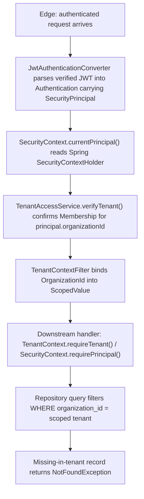
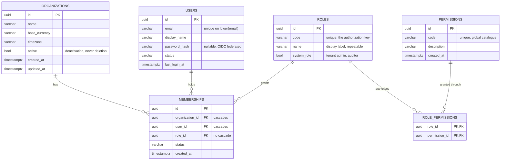

# 04 — Identity & Tenancy

## A. WHY this module exists

Multi-tenant financial software fails most dangerously by showing one customer
another customer's numbers. This module's only job is to make that
impossible: it establishes *who* the caller is, *which* tenant they may reach,
and *where* that scope is enforced — then nothing else in the platform needs to
trust a request parameter to stay in its lane.

It is defensive by design. Without it, every financial table would need its own
tenant check, every controller would need its own filter, and a single slip —
a record id copied from the request body instead of read from the principal —
would leak another tenant's invoices, contracts, or realized value. The module
owns those checks once, centrally, so a bug there is found once rather than
re-introduced per endpoint.

### Hard invariants (must not be broken)

- Every tenant-owned table carries `organization_id`; every query filters on it.
- Tenant scope is taken *only* from the authenticated `SecurityPrincipal`; never
  from a request body, query parameter, path variable, or JWT claim used to
  widen access.
- A record absent *within the caller's tenant* is reported **not-found**, never
  "belongs to someone else". Distinguishing them leaks the existence of another
  tenant's data.
- A value bound into the request scope cannot outlive the request. Scope is held
  in an immutable, lexically-scoped carrier (`ScopedValue`) that is auto-unbound
  on exit, never in a `ThreadLocal` that can leak into a pooled thread.
- No monetary value, contract text, file contents, credentials or bearer token
  is ever logged; only identifiers, statuses and correlation ids are.

---

## B. FLOW — the runtime journey



> ⚠ Review — none of the identity-module components in this flow are compiled
> yet. Only `SecurityContext.currentPrincipal()` and `SecurityPrincipal` execute
> today; the JWT converter, tenant verification, the filter and every repository
> are `STUB`. The diagram is the *designed* path, not the *running* one.

Numbered steps (each marks what actually runs):

1. **Trigger** — an HTTP request reaches the Spring Security filter chain.
2. **Where** — `identity/security/JwtAuthenticationConverter.java` (STUB).
   **What** — converts the verified JWT into a Spring `Authentication` whose
   principal is a `SecurityPrincipal`. **Why** — so the rest of the platform
   reads identity from one object instead of re-parsing the token. It must not
   lift `organization_id` from the token body to decide scope — that is
   server-verified against `Membership` in step 3.
3. **Where** — `identity/service/TenantAccessService.java` (STUB).
   **What** — confirms `SecurityPrincipal.tenantVerified()` is true by checking
   membership server-side. **Why** — a forged claim alone cannot widen tenant
   access; the membership lookup is the authoritative gate. This is the point
   where §6 tenancy is actually enforced.
4. **Where** — `identity/security/TenantContextFilter.java` (STUB).
   **What** — binds the principal's `organizationId` into a `ScopedValue`.
   **Why** — lexical scoping guarantees the value is invisible outside the
   handler invocation and auto-cleared on exit, so it cannot leak into a pooled
   thread. This is the bridge from `SecurityContext` (who) into `TenantContext`
   (which tenant).
5. **Where** — `shared/security/SecurityContext.java` (BUILT) and `shared/security/SecurityPrincipal.java` (BUILT).
   **What** — `SecurityContext.requirePrincipal()` / `.currentPrincipal()` exposes
   the caller to business code; services read tenant scope via `TenantContext`.
   **Why** — keeps identity in Spring's holder (single source of truth) and
   tenant scope in the identity module's own `ScopedValue`, so the two cannot
   drift apart.
6. **Where** — `identity/repository/*.java` (STUB).
   **What** — each query filters on `organization_id = <scoped tenant>`. **Why** —
   defence in depth at the last possible seam before data; even a caller that
   somehow bypassed an upstream check still reads only its own rows.
7. **Where** — `identity/service/*.java` (STUB).
   **What** — a lookup that finds nothing *within the caller's tenant* returns
   `NotFoundException`. **Why** — 404, never 403, so a cross-tenant probe learns
   only "not yours", never "exists somewhere".

### Schema — V1 + V2, the tenant root and the authorization graph



The diagram shows the tenant root and the two edges that make it enforceable. `organizations`
is the root that every other table hangs from; `memberships` is the one row that joins a
*global* user to a *tenant-scoped* grant, which is why the same analyst working for two
customers is one `USERS` row and two `MEMBERSHIPS` rows rather than two accounts. `ROLES`
and `PERMISSIONS` form a many-to-many through `ROLE_PERMISSIONS`, so a permission is
defined once and granted through a role instead of restated per user. The invariants the
constraints enforce are: a user cannot hold the same role twice in the same tenant, a
grant cannot outlive the role or permission it names, and deleting a tenant or a user
removes the memberships that would otherwise still grant access.

- **`ux_memberships_user_org_role` (UNIQUE)** — one active membership per
  (user, organization, role). Prevents duplicate grants, and because uniqueness is per
  *role* rather than per tenant, it does not cap a principal at a single role.
- **`ON DELETE CASCADE` on `memberships.organization_id` and `memberships.user_id`** —
  a deleted tenant or user cannot leave behind a membership row that still grants access
  to a tenant that no longer exists.
- **No `ON DELETE CASCADE` on `memberships.role_id`** — a role referenced by a
  membership must be retired explicitly, so access cannot be revoked by deleting the
  role definition and silently recreated by a later deployment.
- **`ux_users_email` on `lower(email)`** — prevents `Alice@x.com` and `alice@x.com`
  becoming two principals, which would be a duplicate-account takeover waiting to happen.
- **`PRIMARY KEY (role_id, permission_id)` on `role_permissions`** — makes a duplicate
  grant unrepresentable rather than merely discouraged; the pair *is* the identity.
- **`ux_organizations_registration_number` WHERE `registration_number IS NOT NULL`** —
  a statutory identifier cannot be claimed twice, while still allowing any number of
  tenants whose onboarding has not yet supplied one.

---

## C. FILES

**41 files: 5 built, 35 stub.**

### identity module — 30 stubs

| file | status | what it is for | key methods / lines |
|---|---|---|---|
| `identity/security/TenantContext.java` | STUB | ScopedValue-bound tenant scope for the request | `TODO: 23, 29` |
| `identity/security/TenantContextFilter.java` | STUB | Binds tenant scope around the handler chain | `TODO: 21, 27` |
| `identity/security/JwtAuthenticationConverter.java` | STUB | Builds the `SecurityPrincipal`-carrying `Authentication` from a verified JWT | `TODO: 19, 25` |
| `identity/security/CurrentUser.java` | STUB | Injection point surfacing the principal to controllers/services | `TODO: 17, 23` |
| `identity/security/CurrentUserProvider.java` | STUB | Fail-fast accessor returning a tenant-verified principal or throwing | `TODO: 19, 25` |
| `identity/security/SecurityConfig.java` | STUB | Registers the JWT converter + filter in the correct order | `TODO: 18, 24` |
| `identity/security/SecurityHeadersConfig.java` | STUB | HTTP response hardening headers (CSP, HSTS, etc.) | `TODO: 16, 22` |
| `identity/model/Organization.java` | STUB | Tenant root aggregate; the `organization_id` boundary itself | `TODO: 18, 24` |
| `identity/model/User.java` | STUB | Person who authenticates; backs `UserId` | `TODO: 17, 23` |
| `identity/model/Membership.java` | STUB | Link User↔Organization that grants tenant membership | `TODO: 22, 28` |
| `identity/model/Role.java` | STUB | Tenant-scoped collection of Permissions | `TODO: 17, 23` |
| `identity/model/Permission.java` | STUB | Atomic authorization right scoped to one Organization | `TODO: 17, 23` |
| `identity/enums/UserStatus.java` | STUB | Closed lifecycle set (ACTIVE, SUSPENDED, ...); non-ACTIVE blocks auth | `TODO: 17, 23` |
| `identity/enums/RoleType.java` | STUB | Closed tenant-scoped role vocabulary driving authority mapping | `TODO: 18, 24` |
| `identity/enums/PermissionType.java` | STUB | Closed authority-string vocabulary for `AuthorizationService` | `TODO: 16, 22` |
| `identity/service/UserService.java` | STUB | User CRUD; every query filters on principal's organization | `TODO: 17, 23` |
| `identity/service/TenantAccessService.java` | STUB | THE §6 enforcement: membership verified, scope from principal only | `TODO: 19, 25` |
| `identity/service/OrganizationService.java` | STUB | Organization provisioning/lifecycle, strict self-tenant scope | `TODO: 17, 23` |
| `identity/service/AuthorizationService.java` | STUB | Business-layer authority check against `SecurityPrincipal` | `TODO: 19, 25` |
| `identity/repository/UserRepository.java` | STUB | Persistence port for User (not yet implemented) | `TODO: 4, 10` |
| `identity/repository/RoleRepository.java` | STUB | Persistence port for Role | `identity/repository/RoleRepository.java:4, 10` |
| `identity/repository/OrganizationRepository.java` | STUB | Persistence port for Organization | `identity/repository/OrganizationRepository.java:4, 10` |
| `identity/repository/MembershipRepository.java` | STUB | Persistence port for Membership | `identity/repository/MembershipRepository.java:4, 10` |
| `identity/dto/UserResponse.java` | STUB | Wire-safe DTO projected from User | `TODO: 13, 19` |
| `identity/dto/RoleResponse.java` | STUB | Wire-safe DTO projected from Role | `identity/dto/RoleResponse.java:12, 18` |
| `identity/dto/PermissionResponse.java` | STUB | Wire-safe DTO projected from Permission | `identity/dto/PermissionResponse.java:14, 20` |
| `identity/dto/OrganizationResponse.java` | STUB | Wire-safe DTO projected from Organization | `identity/dto/OrganizationResponse.java:13, 19` |
| `identity/controller/UserController.java` | STUB | HTTP entrypoint for user operations | `TODO: 4, 10` |
| `identity/controller/RoleController.java` | STUB | HTTP entrypoint for role operations | `identity/controller/RoleController.java:4, 10` |
| `identity/controller/OrganizationController.java` | STUB | HTTP entrypoint for organization operations | `identity/controller/OrganizationController.java:4, 10` |

### shared tenancy primitives — built (the real tenant boundary)

| file | status | what it is for | key methods / lines |
|---|---|---|---|
| `shared/security/SecurityContext.java` | BUILT | Static access to the request principal over Spring's holder | `currentPrincipal():31`, `requirePrincipal():53` |
| `shared/security/SecurityPrincipal.java` | BUILT | Immutable authenticated caller; carries tenant scope | `SecurityPrincipal(…):23`, compact ctor `:34`, `hasAuthority(:43)`, `hasAnyAuthority(:51)`, `isTenantResolved():67`, `organizationUuid():75` |
| `shared/domain/TenantId.java` | BUILT | Strongly-typed tenant UUID | `newId():35`, `fromString():45` |
| `shared/domain/UserId.java` | BUILT | Strongly-typed user UUID (compile-time not-confusable with other ids) | `newId():30`, `fromString():40` |
| `shared/domain/OrganizationId.java` | BUILT | Strongly-typed organization/tenant UUID | `newId():33`, `fromString():42` |

### tests — 6 stubs

| file | status | what it is for | key methods / lines |
|---|---|---|---|
| `security/TenantIsolationTest.java` | STUB | Proves no path crosses the tenant boundary (404, not 403) | `TODO: 26, 31` |
| `security/FileUploadSecurityTest.java` | STUB | Proves the upload gate is actually reached from the security layer | `TODO: 22, 27` |
| `security/AuthorizationTest.java` | STUB | Authenticated-but-unauthorized callers are refused before any state change | `TODO: 22, 27` |
| `security/AuthenticationTest.java` | STUB | No/expired/malformed/mis-signed credentials refuse uniformly | `TODO: 20, 25` |
| `identity/TenantAccessServiceTest.java` | STUB | Pins the §6 tenant-scope decision and the not-found-not-forbidden rule | `TODO: 21, 26` |
| `identity/IdentityServiceTest.java` | STUB | Pins JWT→`SecurityPrincipal` construction and authority claim sourcing | `TODO: 22, 27` |

---

## D. DEEP DIVE — method by method

### shared.domain — the primitives that actually run

`TenantId`, `UserId` and `OrganizationId` are all `record`s over a single
`UUID value`. They exist to prevent a tenant key from being passed where a user
key fits, or vice-versa, at compile time — the only defence when the rest of the
system is not yet wired.

**Why records, not hand-written wrappers.** `equals`/`hashCode`/`toString` are
compiler-generated and cannot drift from the accessor names; an incorrect
`hashCode` on a tenant id would silently drop rows from a hash-partitioned
join. Null is rejected in the compact constructor (`Objects.requireNonNull`),
so a null id cannot propagate into a query and be serialized as the literal
string `"null"`.

**Why `fromString` trims.** Header and claim values frequently carry stray
whitespace; `UUID.fromString` would throw on it. Trimming once, at the trust
boundary, keeps every downstream parser honest.

**Why `newId()` uses `UUID.randomUUID()`.** Tenant provisioning must not
collide across nodes; `newId()` is the only place a fresh tenant id is minted,
so the choice is centralized and auditable.

`OrganizationId` is documented as the tenant boundary; `TenantId` is a
separate typed id for the narrower case (a sub-organ is still one tenant).
They are deliberately distinct types so the two concepts cannot be swapped by
mislabelled arguments.

These records are immutable and `Serializable`, so they are safe to carry
through pooled-thread pipelines and to cache for the lifetime of a calculation
(§4 determinism): a mutable identifier could let a tenant boundary be silently
retuned mid-calculation.

### shared.security — the implemented consumer side

`SecurityContext` is a non-instantiable `final` class; it is a static access
point over Spring Security's `SecurityContextHolder`, not a component.

```java
public static SecurityPrincipal currentPrincipal()          // line 31
public static SecurityPrincipal requirePrincipal()          // line 53
```

- **`currentPrincipal()`** — reads `SecurityContextHolder.getContext()`; if the
  `Authentication` is `null` or `!isAuthenticated()` it returns `null`
  (Spring's anonymous token must not masquerade as a real caller); if the
  principal is not a `SecurityPrincipal` it returns `null`. **Why** — identity
  is delegated to Spring's filter infrastructure so there is exactly one source
  of truth; this class only narrows *which* principal counts and refuses to
  synthesize one.
- **`requirePrincipal()`** — wraps `currentPrincipal()`, throwing
  `AccessDeniedException` on `null`. **Why** — callers that need a caller can
  express that as a precondition rather than re-checking null at every site.

`SecurityPrincipal` is a `record(UserId, String email, OrganizationId,
Set<String> authorities, boolean tenantVerified)` (line 23). The compact
constructor (line 34) normalizes a null authority set to `Set.of()` and copies
the input via `Set.copyOf`.

- **`hasAuthority(String)`** (line 43) — `authorities.contains`. **Why** a
  plain lookup: the set is already immutable and empty rather than null, so no
  null-check is needed at any call site.
- **`hasAnyAuthority(String...)`** (line 51) — short-circuits on the first hit.
  **Why** — callers frequently ask "is this any of a set of roles", and
  short-circuiting avoids building a stream for a common single-match case.
- **`isTenantResolved()`** (line 67) — `organizationId != null && tenantVerified`.
  **Why** — this is the single test a tenant-scoped query should make before
  touching tenant data. An organization id *alone* is not enough; it must also
  have been verified server-side. This exists precisely to defeat a token
  carrying an organization claim that was never confirmed against membership.
- **`organizationUuid()`** (line 75) — `organizationId == null ? null : value()`.
  **Why** — lets callers that only need the raw UUID avoid a null check on the
  wrapper while still getting `null` when the request is unscoped.

#### Why `ScopedValue`, not `ThreadLocal` (verified toolchain, §1)

`ThreadLocal` is banned here for one concrete reason: a server thread is
pooled, so a value stored in a `ThreadLocal` at the end of request N is
**still present** when the same thread picks up request N+1 — unless the
previous request happened to clear it. That is a latent cross-tenant leak that
only surfaces under load and is invisible in single-threaded tests.

`ScopedValue` fixes this structurally:

- It is **immutable** — you bind it once, with a value, and the binding cannot
  be mutated; only *which* value is bound changes.
- It is **lexically scoped** — `ScopedValue.where(key, value).run(...)` runs a
  `Runnable`; the binding is in scope only for that run. There is no way to
  read the binding outside the run, so it cannot escape into a sibling
  request on the same thread.
- It is **automatically unbound on exit** — even if the runnable throws. There
  is no `enter()`/clear-to-leave pattern to forget.

The real API (no `enter()`, no `isSupported()` — those were invented and backed
out): `ScopedValue.where(key, value).run(...)` / `.call(...)`, plus on the
`ScopedValue` itself `get()`, `isBound()`, `orElse(...)`. `TenantContext` (the
identity-side carrier) will wrap these so business code never names
`ScopedValue` directly.

### identity.security — the stubbed identity-side security

Every file here carries `TODO: Implement` and has an empty body. They are
contracts, not behaviour. The stub Javadocs state the invariants each must
honour; the contracts below are what the implementer inherits.

**`TenantContext`** (`identity/security/TenantContext.java:28`).
*Contract.* The `ScopedValue`-bound holder for the request tenant scope. Intended
API surface (from the Javadoc, not from code): a `bind(OrganizationId)`
static used by the filter, a `currentTenant()` accessor, and a
`requireTenant()` that throws `AccessDeniedException` when unbound. Invariants
(state, line 14): bound only by `TenantContextFilter` after the JWT is
verified; organization id never from request body/query/path; reads
must fail-closed when unbound. Collaborators: `TenantContextFilter`,
`SecurityPrincipal`, `OrganizationId`, `TenantId`, `SecurityContext`.

**`TenantContextFilter`** (`identity/security/TenantContextFilter.java:26`).
*Contract.* A servlet filter that runs *after* Spring Security has authenticated
the request. It reads the organization from the *verified principal only*,
binds it via `ScopedValue.where(...).run(...)` wrapping the downstream
`FilterChain`, and so every handler observes the same tenant. The ordering
constraint is the whole point: if it ran before the JWT converter, the
principal would be absent; if it did not wrap the chain, later code could not
see the binding. Collaborators: `SecurityContext`, `SecurityPrincipal`,
`TenantContext`, `TenantAccessService`, `JwtAuthenticationConverter`.

**`JwtAuthenticationConverter`** (`identity/security/JwtAuthenticationConverter.java:24`).
*Contract.* Maps a *verified* JWT into a Spring `Authentication` carrying a
`SecurityPrincipal`. It may extract `userId`, `email`, and authority claims, but
must **not** accept an `organization_id` from the JWT body to decide tenant scope
— scope is server-verified against `Membership` in step 3 of the flow. The
principal's organization is confirmed server-side before the request proceeds,
so a forged claim alone cannot widen tenant access. Collaborators:
`SecurityPrincipal`, `SecurityContext`, `TenantContextFilter`,
`TenantAccessService`.

**`CurrentUser`** (`identity/security/CurrentUser.java:22`) and
**`CurrentUserProvider`** (`identity/security/CurrentUserProvider.java:24`).
*Contract.* The injection/resolution point business code calls to get the
caller. It must return only principals that are both fully authenticated **and**
tenant-verified; anonymous or unverified tokens surface as
`AccessDeniedException`, never as a partial identity that downstream code acts
on. This is where §6's "tenant boundary is enforced here, not at the edge"
lands at the call site. Collaborators: `SecurityContext`,
`SecurityPrincipal`, `AccessDeniedException`.

**`SecurityConfig`** (`identity/security/SecurityConfig.java:23`) and
**`SecurityHeadersConfig`** (`identity/security/SecurityHeadersConfig.java:21`).
*Contract.* `SecurityConfig` registers the JWT converter and the tenant-context
filter in the correct order and establishes `SecurityContext` as the single
source of truth. `SecurityHeadersConfig` hardens every response — including
error and redirect paths — with CSP, HSTS, `X-Frame-Options`, etc. **Why** the
ordering matters inside `SecurityConfig`: a security filter registered after
the handler mapping is a real vulnerability that service-level unit tests would
never catch. Neither is implemented.

⚠ **Review — duplication risk.** `identity/security/{CurrentUser,
CurrentUserProvider, TenantContext}` duplicate `shared/security/{SecurityContext,
SecurityPrincipal}` in *role*, if not yet in code. Three concerns are
competing for ownership of one concept:

1. `SecurityContext` (shared, BUILT) — "who is the caller". Reads Spring's
   `SecurityContextHolder`, returns a `SecurityPrincipal` or `null`.
2. `TenantContext` (identity, STUB) — "which tenant may the caller reach".
   Planned to wrap the `ScopedValue` binding.
3. `CurrentUser` / `CurrentUserProvider` (identity, STUB) — "give me the
   tenant-verified principal, or throw". A convenience over `SecurityContext`.

`SecurityContext` already owns *who*; `TenantContext` already owns *which tenant*.
Before implementation, the team must decide **which** of these is the canonical
single accessor for a tenant-resolved principal, and **delete the duplicate**.
The risk is that business code imports both and the two drift — e.g. one
returns `null` for anonymous while the other throws, or the tenant scope one
carrier reads is not the one the filter set. The intended split is
`SecurityContext` = identity source of truth, `TenantContext` = tenant scope
source of truth, and `CurrentUserProvider` = a thin composing helper that
calls both — **not** a parallel principal source.

### identity.model — the domain shape (all stubs)

Each model file is an empty shell whose Javadoc records the invariants the
class must enforce once implemented. The contracts are the design record.

**`Organization`** (`identity/model/Organization.java:23`).
*Contract.* The tenant root aggregate; the `organization_id` that §6 defines as
the tenant scope for all financial data. The id is server-assigned
(`OrganizationId.newId()`) or server-verified, never client-supplied to widen
scope. Every `User`, `Role`, `Membership`, and every downstream financial
record is owned by exactly one Organization. Collaborators:
`OrganizationId`, `Membership`, `OrganizationRepository`,
`OrganizationService`.

**`User`** (`identity/model/User.java:22`).
*Contract.* The persistent record backing `UserId`. Lives within one or more
Organizations through `Membership`; its `UserStatus` gates whether
authentication succeeds at all. Tenant scope of any operation on a User is
always derived from the principal's organization (§6), never the request.
Collaborators: `UserId`, `UserStatus`, `Membership`, `UserRepository`,
`SecurityPrincipal`.

**`Membership`** (`identity/model/Membership.java:27`).
*Contract.* The User↔Organization link that grants tenant membership. Without a
`Membership`, the principal's `tenantVerified` flag stays false and the
request cannot proceed to tenant-scoped data. This is the authoritative check
behind `TenantAccessService` — the membership lookup is what turns a JWT claim
into a server-verified scope. Invariants (line 14): always within exactly one
organization; checked server-side before the caller is treated as a member.
Collaborators: `User`, `Organization`, `Role`, `MembershipRepository`,
`TenantAccessService`.

**`Role`** (`identity/model/Role.java:22`).
*Contract.* A tenant-scoped collection of Permissions assigned to users via
Membership. Always belongs to exactly one organization (§6); cannot reference
permissions from another tenant, so role leakage across tenants is structurally
impossible. Collaborators: `Permission`, `RoleType`, `Membership`,
`RoleRepository`.

**`Permission`** (`identity/model/Permission.java:22`).
*Contract.* The atomic authorization right. `AuthorizationService` checks it
against the principal's authority set; `PermissionType` drives the authority
string on `SecurityPrincipal`. Granted to a `Role`, never directly to a `User`;
scoped to one organization (§6). Collaborators: `PermissionType`, `Role`,
`RoleRepository`, `AuthorizationService`.

### identity.enums — closed vocabularies (all stubs)

`UserStatus` (`identity/enums/UserStatus.java:22`): *Contract.* A sealed
interface modelling the user lifecycle (ACTIVE, SUSPENDED, INVITED). A
non-ACTIVE status must block authentication at the identity boundary so a
revoked user cannot act even with a valid token. Sealed + pattern matching
(§2) so adding a state forces every handler to be revisited. Collaborators:
`User`, `SecurityConfig`.

`RoleType` (`identity/enums/RoleType.java:23`) and `PermissionType`
(`identity/enums/PermissionType.java:21`): *Contract.* Closed vocabularies.
`RoleType` is the tenant-level shorthand `AuthorizationService` translates into
concrete permissions; `PermissionType` is the source of the authority strings
`JwtAuthenticationConverter` places on `SecurityPrincipal` and
`AuthorizationService` evaluates. Closed sets prevent a typo'd label from
silently bypassing a check (§2).

### identity.service — the enforcement layer (all stubs)

**`TenantAccessService`** (`identity/service/TenantAccessService.java:24`).
*Contract.* This is THE §6 enforcement point. Organization is taken
exclusively from `SecurityPrincipal.organizationId()` — never from a request
parameter, body, or path variable — and `tenantVerified` must be true. A record
not found within the caller's tenant returns **not-found** rather than
"forbidden", so a caller cannot probe other tenants' existence. Collaborators:
`SecurityContext`, `SecurityPrincipal`, `MembershipRepository`,
`AccessDeniedException`.

**`AuthorizationService`** (`identity/service/AuthorizationService.java:24`).
*Contract.* Checks that the principal holds a required authority/permission
for the caller's organization. The authority is read from `SecurityPrincipal`
(server-verified, not request-supplied) and is always scoped to the principal's
organization (§6). Failure throws `AccessDeniedException` for the global
handler to render consistently. Collaborators: `SecurityPrincipal`,
`SecurityContext`, `TenantAccessService`, `AccessDeniedException`.

**`UserService`** (`identity/service/UserService.java:22`).
*Contract.* All user CRUD passes here. Every query filters on the principal's
organization (§6); a lookup finding nothing within the caller's tenant reports
not-found and never distinguishes "absent" from "belongs to another tenant"
(§6). Collaborators: `UserRepository`, `SecurityContext`,
`SecurityPrincipal`, `TenantAccessService`.

**`OrganizationService`** (`identity/service/OrganizationService.java:22`).
*Contract.* Organization provisioning/lifecycle, strictly self-scoped: a
caller sees/creates/modifies only its own organization (§6). The id derives
from the principal or `OrganizationId.newId()` at provisioning; never from the
request to widen scope. Collaborators: `OrganizationRepository`,
`SecurityContext`, `SecurityPrincipal`, `OrganizationId`.

### identity.repository — persistence ports (all stubs)

`UserRepository`, `RoleRepository`, `OrganizationRepository`,
`MembershipRepository` are all empty stubs. *Contract.* Narrow persistence
interfaces in this module, returning domain results (not framework types) per
§11. They are left untouched per the persistence-pass rule and listed in the
report; implementation is deferred to the later persistence pass via
`SharedEntityManager`/Spring Data. Each query must filter on
`organization_id`, which is defence-in-depth at the last seam.

### identity.dto — wire shapes (all stubs)

`UserResponse`, `RoleResponse`, `PermissionResponse`, `OrganizationResponse`
are empty stubs. *Contract.* The only shape a client can observe from each
entity (§9: never return an entity directly). Each excludes internal
persistence fields (e.g. password hashes). Intended to be fed by a MapStruct
mapper (§1, `unmappedTargetPolicy=ERROR`) so a dropped field fails the build
rather than silently truncating a response. `PermissionResponse`'s Javadoc
names a planned `PermissionController` not present in scope — that is expected
in the controller set; it is `STUB`/absent rather than a defect.

### identity.controller — HTTP entrypoints (all stubs)

`UserController`, `RoleController`, `OrganizationController` are empty stubs.
*Contract.* Each mediates requests through `SecurityContext`/`TenantContext` to
read the caller and tenant, then delegates to the matching service. No handler
may accept an `organization_id` from the request to decide scope (§6) — scope
enters only through the filter→`SecurityPrincipal` path. Responses map via the
DTOs above; failures throw the `shared.exception` types so
`GlobalExceptionHandler` renders them (§9).

### Tests — pinned intent, not executable

All six test files are empty placeholders describing the property they would
enforce. The strongest intent statements are:

- `identity/TenantAccessServiceTest.java` — pins the §6 decision: scope from
  principal only, and the 404-not-403 rule that stops cross-tenant existence
  probing.
- `security/TenantIsolationTest.java` — pins full-path tenant isolation: read,
  list, filter, update, delete across the boundary must each be refused, and
  the response body must not leak the other tenant's id, count, pagination
  total, or existence.
- `security/AuthenticationTest.java` — pins that no/expired/malformed/
  wrong-key credentials all refuse uniformly and without disclosure.
- `security/AuthorizationTest.java` — pins that an authenticated-but-
  unauthorized caller is refused *before* any state change.
- `identity/IdentityServiceTest.java` — pins JWT→`SecurityPrincipal`
  construction: valid token yields expected principal; token with no
  organization is refused, not unscoped; roles from verified claims only;
  disabled/suspended users refused even with valid tokens.
- `security/FileUploadSecurityTest.java` — pins filter ordering: the
  validated upload gate is actually reached from the security layer.

⚠ **Review — coverage gap.** No test exercises authentication,
authorization, or tenant isolation end to end. `IdentityServiceTest`,
`TenantAccessServiceTest`, and the four `security/*` classes are all
`STUB`. The only executable security code today is
`SecurityContext.currentPrincipal()` / `requirePrincipal()`, which is
untested at the boundary. The security-model stub and `ADR-001` both note
this as a known gap (see §F).

---

## E. GOTCHAS — what breaks if you get it wrong

Ranked by consequence. These are the failures this module exists to make
impossible.

| # | Symptom | Cause | Blast radius | Fix |
|---|---|---|---|---|
| 1 | One tenant's invoices/organizations/contracts returned to another tenant | A lookup reads the tenant id from a request body/query/path variable, or a repository query omits the `organization_id` filter, or `ScopedValue`/`ThreadLocal` is read without fail-closed | Tenancy · money · evidence (source references point at the wrong org's rows) · undetectable after the fact | Always source scope from `SecurityPrincipal` via `TenantContext`; every query filters `WHERE organization_id = <scoped tenant>`; never read the request for scope |
| 2 | 403 "forbidden" returned for a record in another tenant | Tenant-scoped lookup distinguishes "absent" from "belongs to someone else" | Tenancy — confirms another tenant's data exists, enabling enumeration | Report 404 not-found for *all* misses within the scoped lookup; never branch on "exists elsewhere" |
| 3 | Tenant A sees tenant B's id, count, pagination total, or existence — in a body, an error message, or a log | Error response/message includes the cross-tenant id, or a list endpoint leaks a total count across tenants | Tenancy · enumeration oracle that compounds with #1 | Error bodies and messages must not echo cross-tenant identifiers; pagination totals computed per-tenant only |
| 4 | A token carrying a forged `organization_id` claim grants access to that tenant | Organization accepted from the JWT body to decide scope instead of server-verified membership | Tenancy · authentication bypass | `JwtAuthenticationConverter` must not lift `organization_id` from the token to scope access; `TenantAccessService` confirms membership server-side and requires `tenantVerified` |
| 5 | Request N+1 on a pooled thread reads tenant A's `ScopedValue`/`ThreadLocal` left over from request N | Scope stored in `ThreadLocal` (or `ScopedValue` bound incorrectly so it persists), not auto-unbound at request exit | Tenancy — latent cross-tenant leak that surfaces only under load and is invisible in single-threaded tests | Use `ScopedValue` with `ScopedValue.where(key, value).run(...)` wrapping the handler chain; fail-closed (`requireTenant()` throws) when unbound; never use `ThreadLocal` |
| 6 | Anonymous token (Spring's unauthenticated `Authentication`) mistaken for a real caller | Handler checks `authentication != null` but not `isAuthenticated()` | Authorization — an unauthenticated caller treated as authenticated | Mirror `SecurityContext.currentPrincipal()`: reject both `null` and `!isAuthenticated()`; reject principals that are not `SecurityPrincipal` |
| 7 | One monetary value silently dropped from a response DTO | Hand-written mapper, or MapStruct with `unmappedTargetPolicy` relaxed, drops a money/amount field | Money · financial reporting (a reported figure that cannot be reconciled) | Keep `unmappedTargetPolicy=ERROR` (§1); prefer MapStruct over hand-written mappers; test field-by-field projection |
| 8 | Audit log or exception message contains a token, a money value, or contract text | Logging monetary values/credentials/tokens; §6 forbids it but it is tempting for debugging | Evidence · compliance · security (secrets in logs) | Log identifiers/statuses/correlation ids only; never `$token`, `$money`, `$body`; route events through `platform.audit.AuditService` (§8) |

---

## F. TESTS — what locks this down

**Tests in scope here.**

| test file | status | invariant it is meant to protect (business rule) | highest-value cases |
|---|---|---|---|
| `identity/IdentityServiceTest.java` | STUB | A `SecurityPrincipal` is built only from verified claims; an unscoped/invalid/disabled token is refused | Valid token → expected principal; no organization → refused not unscoped; roles from verified claims only; disabled/suspended → refused with valid token |
| `identity/TenantAccessServiceTest.java` | STUB | Tenant scope comes from the principal only; cross-tenant absence is 404 not 403 | Scope never from request; membership confirmed server-side; missing-in-tenant → NotFoundException not "forbidden" |
| `security/TenantIsolationTest.java` | STUB | No path lets one tenant's data reach another | Read/list/filter/update/delete across boundary refused; response body leaks no other tenant's id, count, pagination total, or existence |
| `security/AuthenticationTest.java` | STUB | No credential / expired / malformed / wrong-key refusals are uniform and non-disclosing | Same refusal for all; no monetary content, tenant id, or stack trace; consistent across endpoints |
| `security/AuthorizationTest.java` | STUB | Authenticated-but-unauthorized is refused before any state change | Each permission boundary refuses the lesser role; refusal consistent regardless of request shape; cross-org permission not honoured |
| `security/FileUploadSecurityTest.java` | STUB | The upload gate is actually reached from the security layer | Filter ordering observed end to end; refusal reaches caller as a response, not an exception |

**What is actually covered today: none.** All six are placeholders
(`TODO: Add test cases.`) with empty bodies. The only executable code under
review is `SecurityContext.currentPrincipal()` / `requirePrincipal()`, and even
that is not asserted at the boundary.

**Not covered (known gaps, stated plainly):**

- End-to-end authentication or authorization chain — noted as a known gap in
  `docs/architecture/security-model.md` (a TODO stub, not authority).
- Tenant isolation — `TenantIsolationTest` and `TenantAccessServiceTest` are
  the intended locks; neither runs.
- Cross-module boundary enforcement — the ArchUnit classes in
  `src/test/java/com/fintech/cfo/architecture/` are placeholders, so module
  boundaries are enforced by review only (per `ADR-001-modular-monolith.md`).

Until these tests are implemented, §6 tenancy is a *designed* rule, not a
*verified* one.

**Relationship to the TODO stubs referenced above.**
`docs/architecture/security-model.md` is a TODO stub that *redirects* here for
the JWT filter chain and to
`src/test/java/com/fintech/cfo/ingestion/FileValidationServiceTest.java` for the
upload gate that *does* exist. `ADR-001-modular-monolith.md` is a TODO stub
that *records* the modular-monolith decision rather than proposing it. Both
are treated as stubs in this chapter, not as authority.

---

## G. WIRING — where this connects

**Module boundary (§2).** `identity` may import `shared` and `platform` only,
and Java/Spring/the `pom.xml` libraries. It may **not** import another business
module. So identity owns the trust boundary and nothing inside it names a
financial/ingestion/opportunity type.

**What `identity` consumes, and the contract for each:**

| consumed from | type | contract |
|---|---|---|
| `shared.domain` | `UserId`, `OrganizationId`, `TenantId` | Immutable tenant/user identifiers; the typed keys every identity record carries |
| `shared.security` | `SecurityPrincipal`, `SecurityContext` | The authenticated caller and the static accessor over Spring's holder |
| `shared.exception` | `AccessDeniedException`, `NotFoundException`, `BusinessRuleException`, `ConflictException`, `ValidationException` | The typed exceptions this module throws instead of raw framework ones (§9) |
| `platform.*` | `platform.audit.AuditService` | Recorded business/security events (§8) |
| Spring/Jakarta | `Authentication`, `SecurityContextHolder`, servlet `FilterChain`, `@Configuration` | The framework surface the JWT converter and filter chain integrate with |

**The dependency direction is the key invariant:** `shared` is *below*
`identity`; `identity` depends on `shared`, never the reverse. `SecurityContext`
and `SecurityPrincipal` (BUILT, in `shared`) are consumed by *every* stub in
`identity/security/`; that direction is the one the team must not invert,
because inverting it would give `shared` an opinion about identity-module
filters and break the "shared is the trusted core" rule.

**What is designed to consume `identity` (the consumers, by integration milestone):**

- The Spring filter chain consumes `JwtAuthenticationConverter` and
  `TenantContextFilter` (registered by `SecurityConfig`) to establish
  principal + tenant scope before any controller runs.
- Controllers in `identity/controller/*` consume `UserService`,
  `OrganizationService`, `AuthorizationService`, `CurrentUser`/`CurrentUserProvider`
  for identity, and map results to the DTOs in `identity/dto/*`.
- Downstream modules (`financial`, `ingestion`, `opportunity`, etc.) consume
  only `shared.security.SecurityContext` / `SecurityPrincipal` for "who is the
  caller and which tenant" — they do **not** import `identity.security` at all;
  tenant scope reaches them through `SecurityContext` + the shared principal,
  keeping the cross-module seam on consumer-owned types (§2).

**What must happen before the wiring is real:**

1. `JwtAuthenticationConverter` must produce a `SecurityPrincipal` whose
   `organizationId` is the *token's claimed* org (still `tenantVerified =
   false` at this stage).
2. `TenantAccessService` must verify that org against `Membership` and only then
   set `tenantVerified = true` — this is the point that upgrades a claim into a
   server-verified scope.
3. `TenantContextFilter` must bind that verified scope via `ScopedValue`
   around the downstream chain.
4. The team must resolve the **duplication risk** in §D: pick one canonical
   accessor for a tenant-resolved principal among `SecurityContext`,
   `CurrentUser`, `CurrentUserProvider`, `TenantContext`, and delete or fold
   the others, so business code imports a single surface.

⚠ **Review — wiring not yet real.** None of the identity-side security types
are compiled. A request today cannot reach a `SecurityPrincipal` through the
JWT converter, cannot be tenant-verified, and cannot be `ScopedValue`-bound;
only `SecurityContext.currentPrincipal()` is executable, and only if Spring
Security's own filter chain happens to place a `SecurityPrincipal` in the
holder. The path from "verified JWT" → "scoped tenant request" is
`[PLANNED]` end to end.

---

## Symbols used throughout

| symbol | meaning |
|---|---|
| `BUILT` | real implementation |
| `STUB` | empty shell; the chapter says what belongs there |
| `[PLANNED]` | designed, not yet executable |
| `→` | calls |
| `!` | gotcha or defect risk |
| ⚠ **Review** | something looks wrong; stated, not fixed |
| `file.java:42` | line 42 in the real file |
