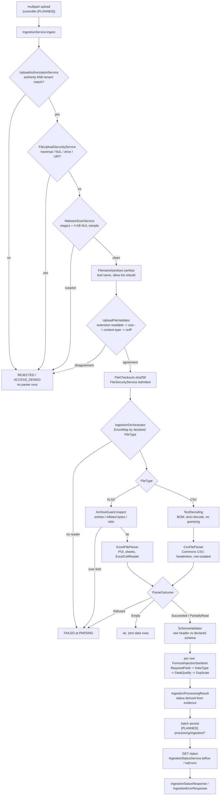
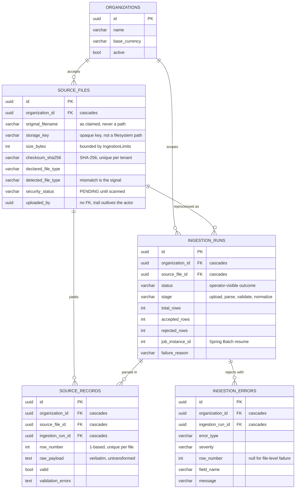

# 05 Ingestion — the front door

> Scope: `com.fintech.cfo.ingestion.**` (79 files), `com.fintech.cfo.processing.ingestion.**`
> (4 files, all `STUB`), `src/test/java/com/fintech/cfo/ingestion/**` (4 classes, 107 tests),
> and the tables in `V3__create_ingestion.sql`.
> Supersedes `01-ingestion-financial.md` and `10-ingestion-deep.md`, whose file counts
> and behaviour notes predate the repaired build.

---

## A. WHY this module exists

A finance team sends whatever their ERP, their bank portal and one analyst's
spreadsheet all happened to produce that month. Those files are hostile input in
every sense that matters: wrong type, wrong encoding, a name chosen to escape a
directory, a workbook that inflates to 40 GB, a cell that reads as a formula, a
column that is 6 fraction digits wide, a 200 000-row export with three bad rows in
it. This module is the boundary where untrusted bytes become rows that a
monetary calculation is allowed to stand on.

Without it, three specific bad outcomes follow. A decompression bomb takes the
process out before anyone knows a run was happening. A CSV cell beginning `=`
becomes code execution on a finance analyst's laptop when the rejected export is
re-opened to see what went wrong. And a run that quietly ignored 400 blank rows, or
stopped at row 100 000 without saying so, produces a total that looks complete and
is not — which is discovered at reporting time, not ingestion time.

Its hard invariants, which the rest of this chapter keeps referring back to:

- **No parser ever sees unrefuted bytes.** Every path from upload to a reader runs
  the security gate first, and the gate has exactly two outcomes.
- **The accounting is total.** `accepted + rejected + skipped` is the file's own
  row count. A row that is not accepted always has a reason attached.
- **Nothing is invented.** A value that cannot be read is refused; a value that is
  well-typed but implausible is flagged; a formula with no cached result is
  refused. No defaulting, no rounding, no coercing, no fabricated zero.
- **Every row is traceable.** A row carries a `RowCoordinate` (file, sheet,
  1-based row) that projects onto `shared.domain.SourceReference` (rule 4).
- **No clock is read.** `asOfDate` and `uploadedAt` are injected, so a re-run
  months later reaches the same verdict (rule 3).
- **Money is exact.** No `double` or `float` anywhere; amounts validate against
  `NUMERIC(20,4)` and are refused rather than rounded when they do not fit.

---

## B. FLOW — the runtime journey



### The admission pipeline, step by step

Each step names the file and method, and then the reason it is in that position.
The order is a security property, not a preference: every step is placed so that
the cheapest, least ambiguous check on the least data happens first, and so that
no later step has to be defensive about an earlier one that has not run yet.

1. **Trigger** — an HTTP multipart upload.
   **Where** — `controller/IngestionController.java:24` `[PLANNED]`, delegating to
   `service/IngestionService.java:65 ingest`.
   **What** — builds one immutable `IngestionRequest` holding the buffered bytes,
   the caller's `SecurityPrincipal`, the declared schema and the injected clock
   values.
   **WHY** — the controller is a `STUB`, so the entry point that exists today is
   `IngestionService.ingest`, which is plain Java with no Spring. The request is a
   `byte[]` rather than a stream (`model/IngestionRequest.java:37-40`) because the
   security gate, the checksum and the parser all need the same bytes; a stream
   would force a re-read that could see different content than the gate approved.

2. **Trigger** — `ingest` calls the gate.
   **Where** — `service/IngestionService.java:73` → `service/FileSecurityService.java:81 admit`.
   **What** — the authorisation decision is taken *before* any byte is examined.
   **WHY** — authorisation costs nothing and touches no untrusted data, so an
   unauthorised caller never gets to run the malware scan or the filename sanitiser
   on a payload they were not entitled to submit. It is also reported as
   `RejectionReason.ACCESS_DENIED` rather than as a file problem, so an audit can
   tell "this user may not upload" from "this file is bad" — two very different
   events. A caller that must not be told which is which sees the same
   `FileSecurityStatus.REJECTED`, so this leaks nothing to the client.

3. **Trigger** — the gate screens the name.
   **Where** — `security/FileUploadSecurityService.java:53` `containsTraversal`,
   then `:60` `MalwareScanService.scan`, then `:66` `FilenameSanitiser.sanitise`.
   **What** — a name carrying a separator, a drive-style `..`, an absolute path, a
   `://`, or a NUL byte is **refused**, not normalised; then the bytes are screened
   for dangerous signatures; only then is a leaf name built.
   **WHY this order** — the traversal test is pure string work on attacker data
   with no I/O, so refusing here is free. Doing it first means a traversal attempt
   is recorded as the attack it is rather than being quietly rewritten into a
   harmless name. Running the malware screen *before* sanitisation is the
   deliberate inversion: sanitisation is lossy and would destroy the evidence that
   the file was hostile. A file called `../../evil.csv` containing an ELF is
   reported as a traversal attempt first and a dangerous signature second, and
   both facts are preserved because the gate returns on the first refusal only —
   the audit log for the *attempt* is the traversal finding.

4. **Trigger** — the sanitised name and the bytes go to the type gate.
   **Where** — `validator/UploadFileValidator.java:27 validate`, via
   `security/FileUploadSecurityService.java:75`.
   **What** — four independent claims are compared in a fixed order: is the
   extension one this module can read; is there any content at all; is it within
   `maxFileBytes`; does the declared HTTP content type agree; do the *sniffed*
   bytes agree.
   **WHY the size check precedes the sniff** — a sniff is a linear scan of the
   leading 4096 bytes, cheap, but it still runs over an array the caller already
   holds. More importantly, `ParseRequest.readContent()`
   (`parser/ParseRequest.java:97`) re-enforces the ceiling independently by
   allocating `maxFileBytes + 1` and reading one byte past the limit, so an
   oversize stream is refused rather than materialised. The size test must come
   first because the byte array has already been supplied by the caller: refusing
   a 3 GB upload only makes sense if you never look inside it.
   **WHY sniffing beats the declared MIME type** — the declared type is a claim
   made by the client's HTTP stack about a name the client's user also chose. The
   magic bytes are the evidence. `ContentSniffer.sniff`
   (`validator/ContentSniffer.java:57`) is what turns `ledger.csv` + `PK\x03\x04`
   into a refusal rather than an attempt to read a zip as text. A generic declared
   type (`application/octet-stream`) is *not* treated as a lie
   (`UploadFileValidator.java:48`), because browsers send it for many honest
   uploads; when the declared type is unrecognised the decision rests on extension
   plus bytes.

5. **Trigger** — everything agreed.
   **Where** — `service/FileSecurityService.java:99-102` builds `UploadMetadata`,
   including `FileChecksum.sha256(content)`.
   **What** — the checksum is taken over the bytes that actually passed, and the
   result is returned inside the sealed `Admission`.
   **WHY here and not later** — rule 3 requires an input checksum for anything
   later claimed to be reproducible, and the checksum has to be of the *accepted*
   bytes. A re-read of a stream that may since have changed would produce a
   different digest, and the one stored would be of bytes nobody validated. The
   `Admitted` record's own compact constructor
   (`FileSecurityService.java:134-140`) throws if the metadata it is handed is
   not `PASSED`, so a caller cannot construct an admission for a file that did not
   pass.

6. **Trigger** — routing to a reader.
   **Where** — `service/IngestionService.java:89` → `service/IngestionOrchestrator.java:72 parse`.
   **What** — an `EnumMap<FileType, FileParser>` is consulted by declared type.
   **WHY** — selection by enumeration, never by `instanceof`, so no parser can be
   reached for a type it did not claim (`IngestionOrchestrator.java:48-60` rejects
   two parsers claiming the same type at construction). The `ParseRequest` is
   built from `metadata.displayName()` — the *sanitised* name — so a row
   coordinate can never quote a traversal path back to a client. Any
   `RuntimeException` escaping a reader becomes a stated `ROW_READ_FAILED`
   refusal (`IngestionOrchestrator.java:89-95`): the orchestrator's contract is
   that it always returns an outcome.

7. **Trigger** — the reader is selected.
   **Where** — XLSX: `parser/ExcelFileParser.java:81`; CSV:
   `parser/CsvFileParser.java:89`.
   **What** — the workbook is defused, then read; the delimited file is decoded,
   tokenised, header-resolved and read row by row.
   **WHY the workbook is defused before POI** — `.xlsx` is a zip, so magic-byte
   checking is not enough. `parser/ArchiveGuard.java:66 inspect` walks the
   container under three ceilings before `WorkbookFactory.create` is ever called
   (`ExcelFileParser.java:100-113`), because POI will inflate everything it is
   given and a 40 KB upload can otherwise become 40 GB.

8. **Trigger** — rows exist.
   **Where** — `service/IngestionService.java:92-97` switches on the sealed
   `parser/ParseOutcome.java:33`.
   **What** — `Refused` → `FAILED` at `PARSING`; `Empty` → a successful run with
   zero data rows; `Succeeded` / `PartiallyRead` → validation.
   **WHY a sealed interface rather than an enum** — an enum lets a caller write
   `if (status == FAILED || status == EMPTY)` and quietly merge a failed read into
   an empty one. The sealed hierarchy makes the `switch` in `ingest` exhaustive at
   compile time, so "rows were read but the file was only partly seen" cannot be
   treated as "rows were read". `PartiallyRead` is deliberately a separate subtype
   from `Succeeded` for the same reason.

9. **Trigger** — schema gate.
   **Where** — `service/FileValidationService.java:103 validateSchema` →
   `validator/SchemaValidator.java:30 validate`.
   **What** — the *raw* header is compared against the declared schema; a missing
   required column produces a file-level finding.
   **WHY the raw header and not the normalised names** — `HeaderDetector` rewrites
   repeats to `amount_2`, so the normalised list can never contain a duplicate and
   `DUPLICATE_COLUMN` would be unreachable. `FileParseResult.rawHeader(...)`
   (`model/FileParseResult.java:248`) captures the untouched cells *before*
   normalisation for exactly this reason, and the evidence that a supplier shipped
   two columns called `amount` would otherwise not exist anywhere in the result.

10. **Trigger** — row gate.
    **Where** — `service/FileValidationService.java:118 validateRows`.
    **What** — per row: sanitise, required fields, declared types, plausibility,
    then duplicates.
    **WHY in that order** — sanitisation must run first because it *mutates* the
    row (`FileValidationService.java:182`), and every later check must see what
    will actually be stored. Required-field runs before type because an absent
    value reported as "expected a date, found nothing" is a confusing message
    where "the required column has no value" is an actionable one. Duplicates run
    last because a duplicate key is only meaningful for a row that is otherwise
    valid.

11. **Trigger** — the result is closed.
    **Where** — `model/IngestionProcessingResult.java:353 Builder.build()`.
    **What** — the status is *derived*: rejections present → `COMPLETED_WITH_REJECTIONS`;
    accepted rows present → `COMPLETED`; an explicitly set `FAILED` / `REJECTED`
    is never overwritten.
    **WHY derive it** — a caller who could choose the status could report
    `COMPLETED` over a run that dropped rows, which is precisely the thing an
    auditor is entitled to catch. The guard on `PENDING`/`RUNNING` exists so a
    deliberate failure is not reclassified by the row counts.

12. **Trigger** — persist. `[PLANNED]`
    **Where** — `processing/ingestion/IngestionWriter.java:23` `STUB`.
    **What** — *should* write one `source_records` row per processed row, with its
    `rawPayload`, validity flag and reasons, keyed by the 1-based
    `RowCoordinate`.
    **WHY it is a job and not a loop** — a 100 000-row import must be committed in
    chunks so a failure costs one chunk, not the whole import. See section D.9.

13. **Trigger** — a client polls.
    **Where** — `service/IngestionStatusService.java:41 toRun` and `:65 toErrors`.
    **What** — the finished in-memory result is projected onto the `ingestion_runs`
    and `ingestion_errors` values that mirror V3.
    **WHY a separate service** — two callers deriving a run row slightly
    differently is how a persisted run stops matching the run that was executed.
    Error ids are derived from `runId + position` via
    `UUID.nameUUIDFromBytes` (`IngestionStatusService.java:103`), not randomly, so
    a replayed run collides with its own rows instead of duplicating them.

### Schema — V3, immutable raw evidence



The diagram shows the four evidence tables in the order the pipeline writes them, and
the decision that shapes all of them: **nothing here is updated in place.** A `SOURCE_FILES`
row is the artifact and its SHA-256; an `INGESTION_RUNS` row is one observable, resumable
attempt over that file; `SOURCE_RECORTS` holds each row exactly as read; and
`INGESTION_ERRORS` keeps the rejections rather than discarding them. Every one of the four
carries `organization_id` *directly* rather than only through a file reference, so a
run-wide or period-wide query never has to join through `source_files` to establish
tenancy — a missed join there would be a cross-tenant leak. The invariants enforced are:
one row per file position, one ingestion of a given byte sequence per tenant, and
`accepted + rejected = total` as a figure the operator can read straight off the run.

- **`ux_source_files_org_checksum` (UNIQUE on organization_id, checksum_sha256)** — the
  same bytes cannot be ingested twice inside one tenant, which would duplicate canonical
  rows by an operation that looked idempotent. Scoped per tenant because the same ledger
  legitimately belongs to more than one.
- **`UNIQUE (source_file_id, row_number)` on `source_records`** — a retry that re-reads a
  file replaces the row at the same position rather than appending a second copy, so row
  counts and every total derived from them stay truthful.
- **`security_status` defaulting to `PENDING`** — the parser can only be reached after the
  malware and archive checks have written a verdict, so an unscanned file cannot be read.
- **Cascading `organization_id` on all four tables** — a deleted tenant cannot leave
  behind evidence rows that a later query might still attribute to it.
- **No foreign key on `source_files.uploaded_by`** — the audit trail must survive deletion
  of the principal who produced it; an upload by a since-deleted service account has to
  remain intelligible.
- **`failure_reason VARCHAR(2000)` on `ingestion_runs`** — a stack trace is deliberately
  refused here; a diagnostic that fits is readable in a status endpoint, and a larger one
  belongs in the logs.

---

## C. FILES

### `com.fintech.cfo.ingestion` — 79 files: 75 built, 4 stub

| # | file | status | what it is for | key methods / lines |
|---|---|---|---|---|
| 1 | `controller/IngestionController.java` | **STUB** | Named home for the HTTP surface; should be a thin adapter over `IngestionService` + `IngestionStatusService`. Empty body with a `TODO`. | `:24` class only |
| 2 | `dto/package-info.java` | BUILT | `@NullMarked` package marker and the rule that no DTO echoes uploaded bytes. | — |
| 3 | `dto/IngestionErrorResponse.java` | BUILT | One persisted error as a client sees it; nullable `rowNumber` is how a file-level problem is stored without inventing a row. | `:35 from(IngestionError)`, `:51 isFileLevel()` |
| 4 | `dto/IngestionResponse.java` | BUILT | Full run outcome including each rejected row and each finding; `MAX_DETAIL_LENGTH` = 500 truncates detail. | `:47 from(IngestionProcessingResult)`, `:106 truncate` |
| 5 | `dto/IngestionStatusResponse.java` | BUILT | Polling snapshot: status, stage, three counts, `version` for optimistic-lock freshness. Carries no row values. | `:34 from(IngestionRun)`, `:48 rejectionRate()` |
| 6 | `dto/StartIngestionRequest.java` | BUILT | Client-supplied schema; carries no upload bytes and no Jackson annotations. | `:47 toSchema()`, `:73 toColumnSchema()` |
| 7 | `dto/UploadedFileResponse.java` | BUILT | The security verdict, reporting declared *and* detected type plus both filenames. | `:39 from(UploadMetadata)`, `:49 allowsParsing()` |
| 8 | `enums/ColumnType.java` | BUILT | What the *destination* expects a column to be (TEXT…BOOLEAN). | `:10` enum constants |
| 9 | `enums/FieldType.java` | BUILT | What a *reader observed* in a cell; kept separate from `ColumnType` so the validator can report a disagreement rather than coerce. | `:14 isNumeric()` |
| 10 | `enums/FileSecurityStatus.java` | BUILT | PENDING / PASSED / REJECTED, persisted to `source_files.security_status`; only `PASSED` allows parsing. | `:17 allowsParsing()` |
| 11 | `enums/FileType.java` | BUILT | The declared/detected format gate. Four constants, and `UNSUPPORTED` is deliberately distinct from `UNKNOWN` so a legacy `.xls` can be refused with an actionable message instead of "unknown file type". String values are the ones persisted to `source_files.declared_file_type` / `detected_file_type`. | `:88 fromExtension(...)`, `:110 fromFilename(...)`, `:139 fromContentType(...)`, `:166 isReadable()` |
| 12 | `enums/HeaderMode.java` | BUILT | AUTO / FIRST_RECORD / NONE — how the header is located. | `:12` constants |
| 13 | `enums/IngestionErrorType.java` | BUILT | 10-value classification written to `ingestion_errors.error_type` `VARCHAR(32)`. | `:13` constants |
| 14 | `enums/IngestionStage.java` | BUILT | 10 positions mirroring the agreed pipeline; a stalled run names the gate it stalled at. | `:35 isTerminal()` |
| 15 | `enums/IngestionStatus.java` | BUILT | Run lifecycle; `COMPLETED_WITH_REJECTIONS` exists so a run that dropped rows is never reported as clean. | `:27 isTerminal()`, `:31 isFailure()` |
| 16 | `enums/ParseStatus.java` | BUILT | SUCCESS / PARTIAL / EMPTY / FAILED — how far a read got. | `:20` constants |
| 17 | `enums/RejectionReason.java` | BUILT | 30-value operator vocabulary, grouped file / schema / row / field / security / quality. | `:12` constants |
| 18 | `enums/RowStatus.java` | BUILT | ACCEPTED / REJECTED / SKIPPED. **Declared but never referenced** by any code. | `:10` constants |
| 19 | `enums/ValidationSeverity.java` | BUILT | INFO / WARNING / ERROR; only `ERROR` blocks a row or refuses a file. | `:14` constants |
| 20 | `enums/package-info.java` | BUILT | Declares the enum string forms a storage contract. | — |
| 21 | `model/ColumnSchema.java` | BUILT | One expected column: name, declared type, required flag. Never inferred from the upload. | `:12` record, `:18 required/optional` |
| 22 | `model/FileChecksum.java` | BUILT | SHA-256 fingerprint; SHA-256 is the only permitted algorithm and the digest must be 64 hex chars. | `:38 sha256(byte[])`, `:56 sha256Of(InputStream)` |
| 23 | `model/FileParseResult.java` | BUILT | Everything one reader produced: rows, rejections, findings, `rawHeaders`, `skippedRows`, status. | `:69 failed(...)`, `:126 rawHeaders()`, `:274 build()` |
| 24 | `model/FileRejection.java` | BUILT | A whole-file refusal. Has no coordinates, deliberately — there is no row 417 to point at. | `:12` record |
| 25 | `model/FileSecurityResult.java` | BUILT | Combined security + type verdict. `allowsParsing()` is the single question the pipeline asks. | `:75 passed(...)`, `:97 rejected(...)`, `:121 allowsParsing()` |
| 26 | `model/IngestionError.java` | BUILT | Mirror of one `ingestion_errors` row; truncates message to 2000 and field name to 255. | `:45 from(...)` |
| 27 | `model/IngestionLimits.java` | BUILT | The ten hard ceilings, injected so a test can lower one and prove the guard fires. | `:25` record, `:45 defaults()` |
| 28 | `model/IngestionProcessingResult.java` | BUILT | Terminal in-memory output; `totalRowCount()` is the accounting identity and the status is derived in `build()`. | `:182 totalRowCount()`, `:353 build()` |
| 29 | `model/IngestionRequest.java` | BUILT | One immutable upload: bytes, principal, schema, injected clock values, limits. | `:24` record, `:44 content()`, `:52 contentUnsafe()` |
| 30 | `model/IngestionRun.java` | BUILT | Mirror of one `ingestion_runs` row with a guarded lifecycle: `started` / `completed` / `failed`. | `:69 pending(...)`, `:76 started(...)`, `:91 completed(...)` |
| 31 | `model/IngestionSchema.java` | BUILT | The caller's declared shape; case-insensitive lookups, declared-order iteration. | `:37 missingRequiredColumns(...)` |
| 32 | `model/ParsedCell.java` | BUILT | One cell as read: `text` (value) and `rawText` (what the file held) differ for exactly one case — a formula. | `:24` record, `:43 formula(...)` |
| 33 | `model/ParsedRow.java` | BUILT | One row plus its coordinate, an index by column, and a `\|`-joined `rawPayload`. | `:60 of(...)`, `:88 text(...)`, `:93 rawText(...)` |
| 34 | `model/RejectedRow.java` | BUILT | A refused row with reason, coordinates, optional column and the raw payload so finance can fix the export. | `:26 of(...)`, `:30 ofField(...)`, `:39 isColumnScoped()` |
| 35 | `model/Rejection.java` | BUILT | Sealed union of `FileRejection` and `RejectedRow` so callers talk about "what was refused" without caring which stage. | `:13` sealed interface |
| 36 | `model/RowCoordinate.java` | BUILT | File + sheet + 1-based row. Projects onto `shared.domain.SourceReference`. | `:20` record, `:44 toSourceReference(...)` |
| 37 | `model/SanitisedFilename.java` | BUILT | A filename proven safe as a leaf name; the constructor *rejects* anything with a separator, dot prefix, whitespace/control char or reserved device stem. | `:29` compact constructor |
| 38 | `model/SourceFile.java` | BUILT | Mirror of one `source_files` row; enforces V3 column widths here rather than discovering them as a failed insert. | `:41 of(...)`, `:57 duplicates(...)` |
| 39 | `model/SourceRecord.java` | BUILT | Mirror of one `source_records` row: `rowNumber` is the 1-based coordinate, never a sequence number. | `:38 accepted(...)`, `:48 rejected(...)` |
| 40 | `model/UploadMetadata.java` | BUILT | Everything known about an upload before parsing, including *both* filenames. | `:70 typeIsConsistent()`, `:77 displayName()` |
| 41 | `model/ValidationFinding.java` | BUILT | The structured observation. `coordinate == null` is how "this upload" is distinguished from "row 12". | `:29` record, `:64 toPersistableMessage()` |
| 42 | `model/ValidationResult.java` | BUILT | Findings plus the *mutated* accepted rows, so a caller cannot accidentally persist un-sanitised values. | `:149 rejectsFile()`, `:163 merge(...)`, `:277 Builder.reject(...)` |
| 43 | `model/package-info.java` | BUILT | `@NullMarked` marker; immutability is the auditability invariant. | — |
| 44 | `parser/ArchiveGuard.java` | BUILT | Zip-slip and decompression-bomb defence for the OOXML container, plus the spreadsheet-package shape test. | `:66 inspect(...)`, `:180 looksLikeSpreadsheetPackage()` |
| 45 | `parser/CsvFileParser.java` | BUILT | Commons CSV reader: headerless tokenisation, per-record isolation, partial reads on a lexical fault. | `:89 parse(...)`, `:217 materialise(...)`, `:268 tokenise(...)` |
| 46 | `parser/CsvParseOptions.java` | BUILT | The dialect as a record, so a parse is re-derivable. `ignoreEmptyLines` defaults **false**. | `:54 defaults()`, `:95 withIgnoreEmptyLines(...)` |
| 47 | `parser/ExcelCellReader.java` | BUILT | POI cell → `ParsedCell`, never evaluating a formula and never letting a `double` escape. | `:73 read(...)`, `:129 formula(...)`, `:167 hasNoCachedValue(...)` |
| 48 | `parser/ExcelFileParser.java` | BUILT | POI reader: archive guard first, then per-sheet header detection and per-row isolation. | `:81 parse(...)`, `:149 readWorkbook(...)`, `:275 readRow(...)` |
| 49 | `parser/ExcelParseOptions.java` | BUILT | Header mode, hidden-sheet policy, sheet allow-list, 1904 epoch override. | `:27 defaults()`, `:54 matchesWorkbookEpoch(...)` |
| 50 | `parser/FileParser.java` | BUILT | The port every reader implements: `supportedType()` + `parse(ParseRequest)`. | `:33 supportedType()`, `:40 parse(...)` |
| 51 | `parser/HeaderDetector.java` | BUILT | Header-row heuristic and column-name normalisation, shared by both readers. | `:50 detect(...)`, `:64 looksLikeHeader(...)`, `:105 normalise(...)` |
| 52 | `parser/ParseOutcome.java` | BUILT | Sealed `Succeeded` / `PartiallyRead` / `Empty` / `Refused`; makes the four states a compile-time obligation. | `:51 refusal()`, `:62 of(...)`, `:77 rejectionOf(...)` |
| 53 | `parser/ParseRequest.java` | BUILT | Bytes + declared type + injected `asOfDate` + limits; `readContent()` enforces the size ceiling while buffering. | `:45 of(...)`, `:97 readContent()`, `:127 ContentTooLargeException` |
| 54 | `parser/TextDecoding.java` | BUILT | BOM detection and strict decoding. Package-private; guessing is refused, not attempted. | `:29 decode(...)`, `:57 decodesCleanly(...)`, `:95 decodeStrictly(...)` |
| 55 | `parser/package-info.java` | BUILT | `@NullMarked` marker; parsing only ever runs behind the security gate. | — |
| 56 | `repository/IngestionErrorRepository.java` | **STUB** | Should bulk-insert `ingestion_errors`. Value is already produced by `IngestionStatusService.toErrors`. | `:21` class only |
| 57 | `repository/IngestionRepository.java` | **STUB** | Should insert/select `ingestion_runs`, always scoped by `organizationId`. | `:22` class only |
| 58 | `repository/SourceFileRepository.java` | **STUB** | Should write `source_files`, honouring `ux_source_files_org_checksum`. | `:21` class only |
| 59 | `security/FilenameSanitiser.java` | BUILT | Rebuilds an untrusted name from a character allow-list into a proven leaf name. | `:87 sanitise(...)`, `:145 extractLeafName(...)`, `:177 stripUnsafeCharacters(...)` |
| 60 | `security/FileUploadSecurityService.java` | BUILT | The untrusted-input gate: traversal refusal, signature screen, sanitisation, type gate. | `:50 screen(...)`, `:92 containsTraversal(...)` |
| 61 | `security/MalwareScanService.java` | BUILT | Offline signature screen. Explicitly **not** antivirus. | `:47 scan(...)`, `:81 looksLikeNulSmuggling(...)` |
| 62 | `security/UploadAuthorizationService.java` | BUILT | Authority **and** tenant-match checks; the principal is passed in, never read from a thread-local. | `:24 UPLOAD_AUTHORITY`, `:26 authorize(...)`, `:42 isAuthorized(...)` |
| 63 | `security/package-info.java` | BUILT | `@NullMarked` marker; untrusted input leaves this package as a proven type. | — |
| 64 | `service/FileSecurityService.java` | BUILT | Gate 1. Authorisation, screening, checksum; returns sealed `Admitted` / `Refused`. | `:81 admit(...)`, `:117 Admission`, `:132 Admitted`, `:164 Refused` |
| 65 | `service/FileValidationService.java` | BUILT | The validation facade: file gate, schema gate, row gate, and the per-row sanitiser. | `:103 validateSchema`, `:118 validateRows`, `:182 sanitise(...)` |
| 66 | `service/IngestionOrchestrator.java` | BUILT | Routes an admitted upload to its reader by declared type; never throws. | `:72 parse(...)`, `:102 readerFor(...)` |
| 67 | `service/IngestionService.java` | BUILT | The conductor. The only place the stages are sequenced, and the sequencing is the point. | `:65 ingest(...)`, `:108 validated(...)`, `:146 emptyRun(...)` |
| 68 | `service/IngestionStatusService.java` | BUILT | Projects a finished run onto `IngestionRun` / `IngestionError` values. Writes nothing. | `:41 toRun(...)`, `:65 toErrors(...)`, `:103 errorIdFor(...)` |
| 69 | `service/package-info.java` | BUILT | `@NullMarked` marker; no clock is read anywhere in this package. | — |
| 70 | `validator/ContentSniffer.java` | BUILT | Identifies the file from its leading bytes, independently of its name. | `:57 sniff(...)`, `:85 detectedType(...)`, `:115 isPlausibleText(...)` |
| 71 | `validator/DataQualityValidator.java` | BUILT | Well-typed but implausible checks; the as-of date is injected, never `now()`. | `:34 EARLIEST_PLAUSIBLE_DATE`, `:62 checkDate(...)` |
| 72 | `validator/DataTypeValidator.java` | BUILT | Can each value be read as its declared type? Never coerces. | `:43 check(...)`, `:64 parse(ColumnSchema, String)` |
| 73 | `validator/DuplicateValidator.java` | BUILT | Stateful per-file, per-sheet duplicate detection over canonicalised values. | `:43 COMPONENT_SEPARATOR`, `:61 check(...)`, `:79 canonicalKey(...)` |
| 74 | `validator/FormulaInjectionSanitiser.java` | BUILT | Neutralises spreadsheet formula injection; signed decimals are deliberately *not* escaped. | `:32 ESCAPE`, `:64 sanitise(...)`, `:96 isInjectionPayload(...)`, `:123 unescape(...)` |
| 75 | `validator/RequiredFieldValidator.java` | BUILT | Mandatory columns must carry a value; always an error, never a warning. | `:27 validate(...)`, `:48 hasMissingRequiredValue(...)` |
| 76 | `validator/SchemaValidator.java` | BUILT | Header vs declared schema, read from `rawHeaders()` so duplicates stay detectable. | `:30 validate(...)`, `:71 duplicateColumns(...)` |
| 77 | `validator/TypedValueParser.java` | BUILT | Exact, locale-free parsing of decimals, amounts, dates, currencies, booleans. | `:67 decimal`, `:92 amount`, `:112 quantity`, `:146 date`, `:195 isDecimal` |
| 78 | `validator/UploadFileValidator.java` | BUILT | The type gate: extension, emptiness, size, declared content type, sniffed content must agree. | `:27 validate(...)` |
| 79 | `validator/package-info.java` | BUILT | `@NullMarked` marker; nothing here ever coerces a value to make it fit. | — |

> Every one of the 79 rows above is a distinct file, reconciled against
> `Get-ChildItem src\main\java\com\fintech\cfo\ingestion -Recurse -Filter *.java`,
> which returns 79. `model/Rejection.java` appears once, at row 34.

**Reconciliation of the per-package counts**

| subpackage | files | built | stub |
|---|---|---|---|
| `controller` | 1 | 0 | 1 |
| `dto` | 6 | 6 | 0 |
| `enums` | 13 | 13 | 0 |
| `model` | 23 | 23 | 0 |
| `parser` | 12 | 12 | 0 |
| `repository` | 3 | 0 | 3 |
| `security` | 5 | 5 | 0 |
| `service` | 6 | 6 | 0 |
| `validator` | 10 | 10 | 0 |
| **total** | **79** | **75** | **4** |

### `com.fintech.cfo.processing.ingestion` — 4 files: 0 built, 4 stub

| file | status | what it is for | key methods / lines |
|---|---|---|---|
| `IngestionJobConfiguration.java` | **STUB** | Should declare one Spring Batch job per `IngestionRun` with chunk-scoped fault tolerance, so a 100 000-row failure costs one chunk. | `:22` class only |
| `IngestionJobLauncher.java` | **STUB** | Should start a job for an *already admitted* upload and hand the `IngestionRunId` to the batch infrastructure. | `:22` class only |
| `IngestionProcessor.java` | **STUB** | Item processor: one uploaded row per call. Must record a rejection and return, not throw, for row-attributable problems. | `:20` class only |
| `IngestionWriter.java` | **STUB** | Item writer: one `source_records` row per processed row, keyed by the 1-based `RowCoordinate`. Must detect the V3 `UNIQUE (source_file_id, row_number)` collision rather than overwrite. | `:23` class only |

### Tests — 4 classes, 107 passing tests

| file | status | what it locks down | tests |
|---|---|---|---|
| `CsvFileParserTest.java` | TEST | Dialect, BOM, encoding, header resolution, row isolation, row accounting, file-level refusals, typed cells. | 30 |
| `ExcelFileParserTest.java` | TEST | Real-workbook reading, cell typing, formula handling, hidden sheets, and the whole `ArchiveGuard` defence set. | 21 |
| `FileValidationServiceTest.java` | TEST | File gate, filename + content screen, schema gate, row gate, formula injection, exact value parsing. | 56 |
| `IngestionServiceTest.java` | **STUB** | Placeholder. Names its own intended scope: stage order, status transitions, idempotent re-submission. | 0 |

### Migration referenced (covered in depth elsewhere)

| file | status | what it is for |
|---|---|---|
| `db/migration/V3__create_ingestion.sql` | MIGRATION | Four tables: `source_files`, `ingestion_runs`, `source_records`, `ingestion_errors`. Every model class in this chapter mirrors one of them and enforces its column widths in its own compact constructor. |

---

## D. DEEP DIVE

### D.1 The admission pipeline, in order, and why each step is where it is

The full order is:

```
ingest → isAuthorized → containsTraversal → MalwareScanService.scan
      → FilenameSanitiser.sanitise → UploadFileValidator.validate
        (extension readable → non-empty → size → declared content type → sniff)
      → FileChecksum.sha256 → IngestionOrchestrator.parse
        → [XLSX: ArchiveGuard.inspect → POI] | [CSV: TextDecoding → Commons CSV]
      → HeaderDetector → SchemaValidator → per-row gates → IngestionProcessingResult
      → [PLANNED] batch persist → IngestionStatusService → IngestionStatusResponse
```

Five ordering decisions carry the design. The rest are ordinary.

**Authorisation before any byte is touched.** `FileSecurityService.admit`
(`service/FileSecurityService.java:84-89`) is the first statement. An
unauthorised caller never reaches the malware scan, the sanitiser or the type
gate, so an attacker cannot use the endpoint as free file-parsing or
signature-detection service. It is reported as `ACCESS_DENIED` rather than as a
file problem so the internal audit log can distinguish "this user may not upload"
from "this file is bad", while the client sees the same
`FileSecurityStatus.REJECTED` either way.

**Traversal refused, not stripped.** `FileUploadSecurityService.screen`
(`security/FileUploadSecurityService.java:53-58`) tests the raw name and returns
`PATH_TRAVERSAL_ATTEMPT` before anything else. A genuine browser upload is a leaf
name (`containsTraversal` rejects a NUL, a leading `/`, a `://`, or any `..`
path segment after folding `\` to `/` — `security/FileUploadSecurityService.java:92-109`).
Normalising `../../etc/passwd.csv` to `passwd.csv` and proceeding would be
defensible in isolation, but the attempt itself is the signal, and it is recorded
as a `FILE_SECURITY` finding that an operator can see.

**Signature screen before sanitisation — the deliberate inversion.** The scan at
`security/FileUploadSecurityService.java:60` runs on the raw bytes, before
`FilenameSanitiser` has destroyed anything. Sanitisation is lossy and
one-way (`security/FilenameSanitiser.java:16-19`); running it first would mean the
evidence that a file was hostile no longer existed by the time it was screened.
Consequence worth stating: because the gate returns on the first refusal, a file
that is *both* a traversal attempt and an ELF is reported as a traversal attempt
only. The one fact preserved is the earliest one.

**Size before sniff, and again inside the reader.** `UploadFileValidator`
(`validator/UploadFileValidator.java:37-45`) checks emptiness and then
`maxFileBytes` before any content inspection. The sniff reads at most 4096 bytes
(`validator/ContentSniffer.java:125`), so it is cheap, but the *reader* repeats
the check independently: `ParseRequest.readContent` (`parser/ParseRequest.java:97-111`)
allocates `maxFileBytes + 1` and reads one byte past the limit, so
"exactly at the limit" and "one byte over" cannot be confused. The
`+ 1` is the whole point — without it, a stream that ends exactly at the ceiling
and a stream that continues past it produce the same array length, and one of
them would be silently truncated. The resulting `ContentTooLargeException`
carries only the limit, never the content (rule 5).

**Sniffing beats the declared MIME type.** A content type is a claim made by the
client's HTTP stack about a name the client's user also chose. The bytes are the
evidence. `ContentSniffer.sniff` (`validator/ContentSniffer.java:57-74`) checks
in order: ZIP (`PK\x03\x04` or the empty-archive `PK\x05\x06`), OLE2, PDF,
executable magics, then text plausibility. `UploadFileValidator`
(`validator/UploadFileValidator.java:54-89`) then requires the sniff to be
*consistent* with the declared type in both directions — a ZIP named `.csv` is
`EXTENSION_CONTENT_TYPE_MISMATCH`, and plain text named `.xlsx` is refused too.
The trade-off is stated in the class: a *generic* declared type
(`application/octet-stream`) is treated as "unspecified" rather than as a lie,
because browsers send it constantly for honest uploads
(`validator/UploadFileValidator.java:47-52`). The cost of that tolerance is that
the declared type carries no weight in that case; the extension and the bytes
must carry the decision alone, which they do.

### D.2 `security/MalwareScanService.java` — a bounded screen, honestly named

**Signature** — `public ScanResult scan(byte[] content)` (`:47`)

**What it returns** — `ScanResult` (`:30`) carrying `clean`, a `signature` name
or `"none"`, and a `detail` that is safe to log. `null` or empty content returns
`noThreat()` without a special case in the caller, because a zero-byte upload is
caught by `UploadFileValidator` first anyway.

**Step by step** — eight prefix tests in a fixed order: `MZ` → PE executable;
`\x7FELF` → ELF; the four Mach-O magics → Mach-O; `CAFEBABE` → Java class;
`D0CF11E0` → OLE2 compound; `%PDF` → PDF; `#!` → script shebang; then
`looksLikeNulSmuggling`. Each returns a named signature, never the bytes.

**Guards** — nothing is thrown. The caller
(`security/FileUploadSecurityService.java:61-64`) turns a non-clean result into
`EXECUTABLE_CONTENT`.

**WHY a bounded 4 KB NUL sample.** `looksLikeNulSmuggling`
(`security/MalwareScanService.java:81-93`) inspects
`Math.min(content.length, 4096)` bytes and refuses if **any** NUL appears —
zero tolerance, unlike the 1% tolerance in `ContentSniffer.isPlausibleText`
(`validator/ContentSniffer.java:141`). The reasoning differs in each case. Here
the sample is bounded to keep a 20 MB upload off the cost of a full walk on a
path that runs before anything else: the gate must stay fast or the size limit
becomes the only defence against a large upload. The zero tolerance is safe
because a CSV or an XLSX never legitimately contains a NUL byte anywhere, so
there is no legitimate value that can be truncated away to evade the test. The
trade-off is real and should be named: a NUL planted *after* byte 4096 is not
seen here. It is still caught downstream, because `ContentSniffer.isPlausibleText`
samples the same prefix and a NUL makes the content `BINARY`, which
`UploadFileValidator` refuses as `CONTENT_TYPE_MISMATCH` — and for a real XLSX the
container never reaches `ArchiveGuard` at all if the NUL is in the first 4 KB.

**WHY the class is not called antivirus.** The javadoc
(`security/MalwareScanService.java:9-15`) says so explicitly: no signature
database, no engine, no network. What it closes is the *renamed-payload* path —
the handful of magics that can never be a CSV or an XLSX. A real AV product would
need a maintained signature set; promising one this class does not provide is how
a false assurance gets created.

### D.3 `security/FilenameSanitiser.java` — rebuild, never escape

**Signature** — `public SanitisedFilename sanitise(String originalFilename)` (`:87`)

**What it returns** — a `SanitisedFilename` whose own compact constructor
(`model/SanitisedFilename.java:29-64`) *re-validates* the invariants: no `/`, no
`\`, no NUL, no leading dot, no whitespace or control character, and no Windows
reserved device stem. The type is the guarantee, so there is no path where a
caller forgets to sanitise — the raw value is never passed on.

**Step by step** (`:88-102`):

1. `extractLeafName` (`:145`) — folds `\` → `/` and NUL → `/`, then keeps only
   the text after the **last** separator and trims.
2. `stripUnsafeCharacters` (`:177`) — character-by-character rebuild against an
   allow-list.
3. `collapseAndTrim` (`:211`) — collapses runs of `_` and `-`, strips a leading
   run of `.`, `_`, `-`.
4. `extractExtension` (`:238`) — takes the text after the **last** dot if it is
   ≤ 8 chars and alphanumeric, lower-cased; otherwise no extension at all.
5. Non-empty stem, reserved-name escape, length cap, reassemble.

**WHY the leaf name is extracted before filtering, and the extension split after.**
The class javadoc (`:32-34`) states the rule: extracting first means path
separators cannot survive into the output at all; splitting the extension after
filtering means the extension is derived from already-vetted text rather than raw
attacker input. Reversing either order reopens an attack.

**Why rebuild from an allow-list rather than escape.** Escaping (`/` → `_`) leaves
the class of bug where a new dangerous sequence appears in the *result* of the
transformation, and where the result is only as safe as every future consumer.
`isAllowed` (`:276-279`) is ASCII letters, digits and `. _ -` only. Unicode
letters are excluded on purpose (`:270-274`): Cyrillic `а` is a standard way to
disguise an executable as a document. Rebuilding means each surviving character
was individually approved, so the output is safe by construction and can be
concatenated with a storage prefix without further checks.

**Why the trailing underscore in `My_Ledger_June_.csv`.** This is the documented
output for the input `My Ledger (June).csv` and it looks wrong, so the reason is
worth being exact about (the test says the same thing at
`FileValidationServiceTest.java:255-260`). Trace it:

| input char | `My` | space | `Ledger` | space | `(` | `June` | `)` |
|---|---|---|---|---|---|---|---|
| after `stripUnsafeCharacters` | `My` | `_` | `Ledger` | `_` | `_` | `June` | `_` |
| after `collapseAndTrim` | `My` | `_` | `Ledger` | `_` | *dropped* | `June` | `_` |

`collapseAndTrim` (`:211-225`) collapses only **runs** of separators: the `_` that
replaced the space is a single separator, so it survives; the space that followed
it became another `_`, forming a run of two, so the second is dropped. That is
why the `(` disappears but the trailing `_` from `)` remains. The behaviour is
lossy and deterministic, which is the correct trade-off: the security property
(the result is a leaf name built from approved characters) is preserved, and the
result is a stable function of the input, so a replay produces the same storage
key. The cost is that the stored name is not the human name — which is why
`UploadMetadata` keeps `originalFilename` for the audit trail and
`sanitizedFilename` as the only value allowed near a storage key
(`model/UploadMetadata.java:12-16`).

**Three classes of character treated differently** (`:158-176`): ISO control and
bidi/format characters are **dropped**, not replaced — replacing would leave an
`_` that could make two distinct inputs collide into one output, and bidi
overrides (`U+202A`–`U+202E`, `isBidiOrFormat` at `:290-293`) let a name *render*
as a different extension than it has, defeating a visual check by a human
reviewer. Whitespace becomes `_` rather than being deleted, so "my report" and
"myreport" stay distinguishable. Everything else non-allow-listed becomes `_`,
substituting rather than dropping so the name keeps a recognisable shape.

**Reserved names.** `avoidReservedDeviceName` (`:113-118`) prefixes `file-` when
the upper-cased stem is in the 22-name set (`CON`, `PRN`, `AUX`, `NUL`,
`COM1`–`COM9`, `LPT1`–`LPT9`). The set matters even on Linux
(`:57-65`): these files live in object storage and may be synced to a Windows
share, where `CON` cannot be created and, depending on the layer, behaves
unexpectedly. `toUpperCase(Locale.ROOT)` is used rather than the default locale
so a Turkish default cannot turn `"i"` into `"İ"` and defeat the match — rule 4's
no-locale-sensitive-formatted rule, applied to a security control.

**Length limits.** `MAX_LENGTH` is 120 (`:45`) on the *final* assembled name, and
`truncateStem` (`:259-265`) computes the budget as `120 - (extension.length + 1)`
so stem + dot + extension respects the cap. Truncating the stem alone would not
enforce it. `MAX_EXTENSION_LENGTH` is 8 (`:52`), and a longer "extension" is
discarded rather than trusted — a long extension is a way to smuggle a second
filename past extension-based type checks.

**Guards** — never throws. A `null` name yields `""` and then the
`FALLBACK_STEM` `"upload"` (`:55`, `:96-98`), so the result is never empty. That
is a sanitisation outcome, not a programming error.

**What is still refused rather than sanitised.** The sanitiser removes a
directory component; it does not *decide* that is acceptable. The gate upstream
(`FileUploadSecurityService.java:53`) refuses such a name outright. The two are
complementary: the sanitiser is the guarantee, the gate is the alarm.

### D.4 `validator/FormulaInjectionSanitiser.java` — the control, precisely

**Signature** — `public static Result sanitise(String raw)` (`:64`),
`public static boolean isInjectionPayload(String value)` (`:96`),
`public static String unescape(String value)` (`:123`)

**What it returns** — `Result` (`:51`) with `text`, `neutralised` and
`removedControlCharacters`. Both flags are recorded as `WARNING` findings by
`FileValidationService.sanitise` (`service/FileValidationService.java:189-203`),
so a neutralised cell is visible in the audit without refusing the row.

**The threat.** Any cell whose text begins `=`, `+`, `-` or `@` is interpreted as
a formula by Excel and LibreOffice when the file is later opened or re-exported.
That is how a ledger upload becomes remote code execution on a finance analyst's
laptop. The defence used here is the one the spreadsheet applications themselves
understand: a leading apostrophe (`ESCAPE`, `:32`), which makes the remainder
literal text. A prefix a spreadsheet does not understand would leave the payload
live.

**Step by step** (`:64-91`):

1. NUL and the 16 bidi/format characters (`BIDI_AND_FORMAT_CHARACTERS`, `:34`)
   are **dropped**, setting `removedControlCharacters = true`.
2. If nothing is left, return it as-is with both flags false.
3. If `isInjectionPayload(value)`, prefix `ESCAPE` and set `neutralised = true`.

**Why strip before testing, not test then strip.** This is the load-bearing detail.
`isInjectionPayload` looks at `value.charAt(0)` (`:100`). If the payload test ran
first, an attacker could prefix a zero-width or bidi character:
`"\u200B=cmd|'/c calc'!A0"` would not be a payload by the test, and after the
strip the stored value would *begin* with `=` — a live formula the control had
already certified as safe. Stripping first and testing second means the value is
always judged **on what will actually be stored**
(`validator/FormulaInjectionSanitiser.java:85-86`). The two orders are
observationally identical for honest input and opposite for hostile input.

**Why signed decimals are not payloads.** `isInjectionPayload`
(`validator/FormulaInjectionSanitiser.java:106-114`):

```java
if (first == '\t' || first == '\r' || first == '\n') return true;   // bypass trigger
if (first == '=' || first == '@')                              return true;
if (first == '+' || first == '-') return !TypedValueParser.isDecimal(value);
return false;
```

`-1000` and `+4.5` are ordinary amounts. Escaping them to `'-1000` would corrupt
the financial record — a negative ledger entry stored as text, or silently
positive after a downstream cast. A negative number is *data*; a formula is
*code*; the distinguishing test is whether the rest of the cell parses as a plain
decimal. `TypedValueParser.isDecimal` (`:195-207`) is the shared implementation
(`new BigDecimal`, no grouping separators, and a value beginning with the escape
apostrophe is *not* a decimal — so an already-escaped value cannot be
double-classified).

**Why tab, CR and LF are triggers in their own right.** A leading `\t`, `\r` or
`\n` (`:103-104`) is the classic bypass: spreadsheets skip leading whitespace
and read what follows as a formula. The control must therefore treat the
whitespace as the trigger, not as noise to trim.

**Why embedded newlines are *not* rewritten.** The class javadoc
(`validator/FormulaInjectionSanitiser.java:26-29`) states it: a quoted CSV field
may legitimately contain a newline, and silently folding it would change the
evidence. Newlines cannot on their own start a formula, and a value such as
`"\r=cmd"` is already caught by the first-character test. The trade-off is
explicit: readability of a multi-line narration field is preserved, and the
residual risk is covered by the whitespace trigger.

**`unescape` and the one-way guarantee.** `unescape` (`:123-129`) removes a single
prefix only when the remainder is *still* a payload, so
`"'quoted name"` — where the apostrophe is part of the analyst's text — is left
alone. The sanitiser itself is documented as lossy and one-way (`:16-19` of
`FilenameSanitiser`, and the storage-key rationale in the same file); `unescape`
exists so a downstream consumer producing a non-spreadsheet artefact can recover
the analyst-facing value. It is not used to recover a file, which is why storage
keys are never derived from it.

### D.5 `parser/CsvFileParser.java` + `CsvParseOptions` + `TextDecoding` + `HeaderDetector`

#### `CsvParseOptions` (`:27`) — the dialect as a value

A record rather than scattered setters, because a parse must be re-derivable
months later (rule 3): the exact dialect a file was read with travels with the
reader instead of living in ambient state. `defaults()` (`:54`) is
`',', '"', '"', AUTO, ignoreEmptyLines=false, lenientEof=false, trim=false,
UTF-8, maxColumnsHard=true`.

**The `ignoreEmptyLines = false` decision — a defect that was found and fixed.**
The javadoc at `parser/CsvParseOptions.java:45-52` is the clearest statement of it
in the module. When Commons CSV is told to ignore empty lines it drops them
*silently, inside the lexer*: the record never reaches this module, so the
position is not read, not refused, and not counted as skipped —
`FileParseResult.totalRowCount()` stops being the total an operator reconciles a
file against. A run that quietly ignored 400 blank rows is a run whose row
numbering nobody can reproduce, which is exactly what `skippedRows` exists to
prevent. With it false, the blank record arrives, is counted at
`parser/CsvFileParser.java:175-182`, and reported as `BLANK_ROW` at `INFO`. The
cost of the fix is that `skippedRows` is now non-zero for a file a human would
call clean, which is the honest number.

`CsvParseOptions.withIgnoreEmptyLines(true)` still exists (`:95`). Setting it
re-opens the defect by choice; the option is kept because a diagnostic export
that wants strictly-comma-separated semantics may need it.

**Guards on the record itself** (`:31-40`): a delimiter that is `"`, `\n`, `\r`
or `0`, and a quote equal to the delimiter or to a newline, are rejected at
construction. A dialect that cannot round-trip is not a dialect.

#### `TextDecoding` (package-private) — BOM, then refusal, never guessing

**Signatures** — `static Decoded decode(byte[], Charset)` (`:29`),
`static boolean decodesCleanly(byte[], int, Charset)` (`:57`),
`static String toText(...)` (`:48`).

**Step by step** — `decode` checks three exact marks in order: `EF BB BF` → UTF-8
at offset 3; `FE FF` → UTF-16BE at offset 2; `FF FE` → UTF-16LE at offset 2. With
no mark, the configured default (UTF-8) is used and `hadMark` is false.

**Why the offset is returned rather than the caller stripping.** An Excel "CSV
UTF-8" export starts with `EF BB BF`. Left in the buffer, that mark becomes part
of the first header name and every later lookup of that column fails with an
error nobody can see. Reporting a *body offset* means the caller can never forget
(`parser/TextDecoding.java:32-33`).

**Why it does not guess.** With no BOM the default is applied and
`decodeStrictly` (`:95-100`) is configured with
`CodingErrorAction.REPORT` for both malformed input and unmappable characters. The
parser then refuses the file as `CORRUPT_FILE` naming the charset
(`parser/CsvFileParser.java:108-112`) rather than substituting U+FFFD.

**The trade-off, named.** A Latin-1 or CP-1252 export from an older ERP with no
BOM is **rejected**, not decoded. The alternative — trying UTF-8, then Windows-1252,
then Latin-1, and taking the first that decodes — would "work" for those files and
would also silently accept a genuinely corrupt upload, converting bytes into
plausible-looking mojibake that then becomes a ledger value. A text parser that
refuses mojibake is producing data someone will post. Refusing with a stated
reason is a better outcome than a clean-looking wrong number, and the caller can
re-upload with a BOM. This is a deliberate availability-for-integrity trade.

#### `HeaderDetector` — deliberately conservative heuristics

**Signatures** — `static int detect(List<List<String>>, int scanWindow)` (`:50`),
`static boolean looksLikeHeader(List<String>)` (`:64`),
`static List<String> normalise(List<String>)` (`:105`),
`static List<String> positionalNames(int)` (`:123`).

**The AUTO test** (`:64-93`) requires all three of:

- `nonBlank >= 2` — at least two populated cells;
- `letterInitial >= 1` — at least one cell matches
  `^[A-Za-z][A-Za-z0-9 _./()%'\-]*$` and is ≤ 64 chars;
- `labelish * 2 >= nonBlank` — at least half the non-blank cells are label-shaped.

**Why each is there.** `looksLikeValue` (`:182-194`) disqualifies a cell from
being a label if it is a decimal (`new BigDecimal` succeeds), a date
(ISO or slashed, `:37-40`), or a boolean — so a row of dates and amounts never
wins the vote. The letter-initial requirement is the one that matters most
(`:81-84`): it is what stops a headerless numeric export like
`INV-1,2024-01-31,100.50` from having its own first data row promoted to a header
and **silently lost**. The half-the-row threshold rejects a row that is mostly
data with one stray label.

**Why conservative, stated in the code** (`:90-91`): a false negative yields
positional names (`column_1…column_n`), which is *recoverable* — the rows are all
read and the schema gate can still report what is missing. A false positive
silently drops a data row. The asymmetry is the whole design. `HeaderMode.FIRST_RECORD`
and `HeaderMode.NONE` let a caller pin the answer for a known export, which is the
escape hatch for a heuristic that is wrong (rule 3: two runs of the same ERP export
must not guess differently).

**`normalise` (`:105-118`)** blanks become `column_n` and repeats become
`name_2`, `name_3` (case-insensitive, `unique` at `:159-167`). The comment is
exact about why this is normalisation rather than failure
(`parser/HeaderDetector.java:98-103`): a duplicate header is a *schema* problem
the validator reports, not a reason to throw away the rows underneath it. The
returned list preserves the header's order **and exact count**, so a data row's
field count can still be checked against it.

#### `CsvFileParser.parse` — headerless tokenisation and row isolation

**Signature** — `public FileParseResult parse(ParseRequest request)` (`:89`)

**Step by step:**

1. `request.readContent()` — the size ceiling is enforced while buffering
   (`:91-101`); `ContentTooLargeException` → `SIZE_LIMIT_EXCEEDED`.
2. Zero bytes → `EMPTY_FILE` (`:103-105`).
3. `TextDecoding.decode` + `decodesCleanly` (`:107-112`) → `CORRUPT_FILE` naming
   the charset.
4. `tokenise(text)` (`:123`, implementation at `:268`).
5. All-blank or no records → `EMPTY_FILE` (`:128-134`).
6. A lexer fault, if any, is recorded as a file-level `PARSE` finding (`:135-138`)
   — but the read **continues** with the records recovered so far.
7. Header resolution (`:141-166`) and preamble accounting.
8. Row loop (`:171-200`).
9. `PARTIAL` if there was a fault or the row limit was reached (`:202-206`).

**Why headerless tokenisation.** `tokenise` (`:268-289`) builds a `CSVFormat` and
never calls `.setHeader()`, so a record of the wrong width comes back as a plain
`List<String>` instead of throwing. That single decision is what makes ragged rows
recoverable instead of fatal, and therefore what stops one bad row from aborting a
100 000-row file. Registering a header with Commons CSV would convert a width
mismatch into an exception at the first bad record.

**`materialise` (`:217-245`) is the whole of row-level isolation.** It can only
ever return a `RowOutcome` holding *either* a `ParsedRow` *or* a `RejectedRow`
(`:343-353`); there is no third outcome in which a bad row vanishes without a
trace. Order of its guards: field count over `maxColumns` (`:219`), field count
against the header (`:224`), then per cell — blank becomes a `BLANK` cell
(`:232-235`), a value over `maxCellTextLength` rejects the row and names the
column (`:236-241`), anything else becomes a `STRING` cell (`:242`).

**Why cells arrive as `FieldType.STRING` even when they look numeric**
(`parser/CsvFileParser.java:61-64`): a delimited file carries no type
information. Typing a cell here would bake an inference into the evidence, and
`DataTypeValidator` types each column against the *declared schema* instead —
which is a statement about the destination, not a guess about the source.

**The two defects that were found and fixed.**

*(a) `ignoreEmptyLines` was `true`.* Covered above in `CsvParseOptions`. The
symptom it produced was `totalRowCount()` no longer reconciling with the file.

*(b) An unterminated quoted field was classified `CORRUPT_FILE`.* The current
behaviour is at `parser/CsvFileParser.java:292-314`. Commons CSV reaches
end-of-input inside an unterminated quoted field by throwing `CSVException`, which
the iterator wraps in an `UncheckedIOException`. The catch distinguishes the two:

```java
catch (UncheckedIOException ex) {
    return new Tokenisation(records,
        ex.getCause() instanceof CSVException
            ? new ParseFault(RejectionReason.TRUNCATED_RECORD, "... the rest of the file was not read")
            : new ParseFault(RejectionReason.CORRUPT_FILE, "..."));
}
```

A `CSVException` cause is a **truncated record**, not a corrupt file. The
reasoning is in the code at `:298-305`: this is the single most common real-world
CSV malformation, the result is already `PARTIAL` with every record read so far
kept, and reporting it as `CORRUPT_FILE` would tell finance the whole file is
untrustworthy when only the remainder of the last record is missing. Any *other*
cause is a genuine I/O failure and keeps `CORRUPT_FILE`. The plain
`CSVException` catch (`:292-296`) and the `RuntimeException` catch (`:319-323`)
round out the taxonomy. In every branch the records accumulated so far are
returned in the `Tokenisation` record, so **nothing is dropped silently and
nothing is claimed to have been read that was not** (`:47-53`).

**Record numbering.** 1-based and counts the header (`:57-59`), which is what a
person counting rows in the file would say — and is what makes the number usable
as evidence. An embedded newline inside a quoted field does not shift it,
because the number is the *record* index, not a line index.

**The row limit is a truncation, not a rejection** (`:183-189`): reading stops,
`MAX_ROWS_EXCEEDED` is recorded, and the status becomes `PARTIAL` with
`"reading stopped at the configured row limit"`. The rows already read stay
usable. What must never happen is a `COMPLETED` over a file whose tail was never
seen.

### D.6 `parser/ExcelFileParser.java` + `ExcelCellReader.java`

#### Sheet selection and hidden sheets

`readWorkbook` (`:149-185`) iterates sheets in order and, for each:

- stops entirely once `sheetsRead >= maxSheets` (`:158-164`), adding a
  `LIMIT_EXCEEDED` finding, setting `PARTIAL`, and `break`ing;
- skips a sheet not in `ExcelParseOptions.includedSheets` (`:166-168`, matched
  case-insensitively at `parser/ExcelParseOptions.java:58-61`);
- skips a `SheetVisibility.HIDDEN` sheet when `skipHiddenSheets` is set,
  recording an `INFO` finding so the skip is *visible* rather than silent
  (`:169-174`);
- only then increments `sheetsRead` and calls `readSheet` (`:175-177`).

The sheet counter is checked against the limit *before* the inclusion and hidden
checks, and only counts sheets actually read. So `maxSheets = 32` means 32 sheets
were read, not 32 sheets were visited — a workbook with 20 visible and 5,000
hidden tabs is not truncated. A hidden sheet is skipped silently in most
spreadsheet readers; here the skip is a recorded finding, because a tab the
uploader hid may be the tab with the numbers.

`readSheet` (`:187-268`) detects the header *per sheet* (`resolveHeaderOffset`,
`:328-334`), buffers up to 51 leading rows for that detection (`:205-207`), and
reports every row preceding the header as skipped with a `MISSING_HEADER` `INFO`
finding (`:222-227`) — so a "Ledger" title row above the real header is accounted
for, not mistaken for data.

**Row numbers are Excel's own** (`:39-42`, `:239`): `rowIndex + 1`, with the sheet
name in the coordinate. That is the number an operator sees on screen and the one
they will quote in a dispute, so evidence using any other numbering would not
survive contact with a conversation.

#### `FormulaWithoutCachedValue` — the defect this control exists to prevent

**Signature** — `static final class FormulaWithoutCachedValue extends RuntimeException`
(`parser/ExcelCellReader.java:52`), carrying the unevaluated `expression` (`:64`).

**The OOXML trap, exactly.** The comment at `parser/ExcelCellReader.java:131-140`
is the precise statement and it is worth reproducing in full because getting it
wrong produces invented money:

> WHY the guard tests the stored *value* rather than the cached *type*: OOXML
> defaults the `t` attribute to `"n"` (numeric) and allows a `<f>` with no `<v>`,
> so POI reports such a cell's cached type as NUMERIC and then reads its numeric
> value as `0.0`. Switching on the type therefore never reaches the
> `FormulaWithoutCachedValue` branch below, and a formula nobody ever calculated
> would be published as a fabricated zero — precisely the invented monetary
> figure this module must never produce.

In other words: the natural implementation — `switch (cell.getCachedFormulaResultType())`
and treat the numeric branch as a number — is **wrong**, because OOXML's default
`"n"` means "no cached value" and "cached value of type numeric" are
indistinguishable through the type alone. `hasNoCachedValue`
(`parser/ExcelCellReader.java:167-172`) therefore tests
`((XSSFCell) cell).getRawValue() == null`, which is positive evidence that the
file stored nothing, and is checked **before** the type switch (`:138-140`).

**Why a rejection, not a zero.** A formula nobody ever calculated has no value.
Reading it as `0` would invent a monetary figure the file never asserted — a
`SUM` over a not-yet-populated column becomes a fabricated nil, which then flows
into a variance, a variance into a report, and a report into a decision. So the
row is refused with `RejectionReason.FORMULA_WITHOUT_CACHED_RESULT` and the
expression is attached to the rejection
(`parser/ExcelFileParser.java:300-306`) — an auditor can then look at the
workbook and see what the cell was supposed to compute. Publishing `0` would
leave nothing to look at.

**Why the narrowing to `XSSFCell` is safe** (`:154-166`): POI 5 exposes the stored
value on the OOXML implementation rather than on the `Cell` interface, so the
check is narrowed. This module reads XLSX only — `FileType` has no other
spreadsheet type and `ArchiveGuard.looksLikeSpreadsheetPackage()` refuses anything
that is not an OOXML spreadsheet package — so the narrowing loses no reachable
case. Any other implementation returns `false` and falls through to the cached-type
switch, which is the pre-existing behaviour. That fallback is the important part:
**a cell is only ever refused on positive evidence that its value is absent,
never because the check could not be made.**

**Formulas are never evaluated** (`:26-33`): evaluating an uploaded formula means
running attacker-supplied expressions through the JVM's formula engine, and it
would make a result depend on the evaluator rather than on the file. The cached
result becomes the value; the expression is kept as `rawText` via
`ParsedCell.formula(...)` (`:143-149`), so a number used in a calculation can
still be traced to the expression that produced it — rule 4 satisfied without
executing anything.

**No `double` escapes.** `plain` (`parser/ExcelCellReader.java:203-205`) does
`new BigDecimal(Double.toString(cell.getNumericCellValue())).toPlainString()`.
`new BigDecimal(double)` would preserve the exact binary expansion
(`1234.5600000000001`) and hand a fabricated tail to the money layer;
`Double.toString` yields the shortest round-tripping decimal `1234.56`, which is
both deterministic and locale-independent. The result is carried as a *string*,
so no binary floating-point error can reach the money layer at all.

**Error cells are kept, not rejected** (`:317-322`): a cell holding `#REF!` adds a
`DATA_TYPE` finding and the row survives, because a formula error is information
finance needs to see, not noise to hide.

### D.7 `parser/ArchiveGuard.java` — zip-slip and decompression bombs

> The file lives in `parser/`, not `security/`. It is in the parser package
> because it only runs on the OOXML container on the way to POI, and because
> `ExcelFileParser` must call it before `WorkbookFactory.create`.

**Signature** — `public static ArchiveInspection inspect(byte[] content, IngestionLimits limits)` (`:66`)

**What it returns** — `ArchiveInspection` (`:177`) with `entryCount`,
`uncompressedBytes` (bytes *actually inflated while walking*, not a declared
figure) and normalised entry names. Throws `ArchiveRejection` (`:153`) carrying
a typed `RejectionReason`.

**Step by step:**

1. Walk the zip with `ZipInputStream`, allocating one 8 KB buffer (`:53`, `:73`).
2. Per entry: increment the counter; **reject immediately** if it exceeds
   `maxArchiveEntries` (`:79-83`) — before the entry is inflated.
3. Normalise the entry name for logging and the package-shape test (`:84`, `:131`).
4. Inflate the entry in 8 KB chunks, accumulating `totalUncompressed`; reject
   immediately if it exceeds `maxUncompressedBytes` (`:88-92`) or the ratio test
   fails (`:93-97`).
5. If zero entries were found → `CORRUPT_FILE` "not a zip container" (`:111-114`).
6. Return the inspection.

**Why declared sizes are not trusted** (`:25-27`): a zip bomb lies in its
headers. The bytes are actually inflated and measured, and the walk aborts the
moment a ceiling is crossed. The cost of that choice is bounded by construction:
at most `maxUncompressedBytes` are ever inflated before the walk stops, and the
entry-count check fires before the offending entry is touched at all.

**The ratio floor.** `exceedsRatio` (`:118-123`) returns `false` when
`compressedLength < ratioCheckMinBytes` (default 4 096). The reason is in the
class javadoc (`:29-31`): a legitimate small workbook can easily compress 20:1,
and refusing it would train users to bypass the check. The trade-off is named
plainly: **a bomb smaller than 4 KB is not ratio-checked.** It is still subject to
the inflated-bytes ceiling, so a small bomb is bounded, just not by ratio.

**Why a nested archive is refused outright.** This is a design property rather
than a single check, and it is worth stating as a principle. The guard reasons
about exactly one level of inflation. A zip inside a zip inside a zip multiplies
the ratio and cannot be reasoned about with a single-pass walk; POI will not open
it either, so analysing it would be work with no reader to hand the result to.
Refusing a nested archive is therefore the safe answer: the guard recognises the
OOXML package shape it *can* vouch for (`[content_types].xml` plus a
`xl/**/workbook.xml` part that is not under `_rels/`, `:42-51`, `:191-194`) and
treats anything else — including a container whose entries say `word/` — as not
a spreadsheet (`parser/ExcelFileParser.java:101-106`; the test
`ExcelFileParserTest.refusesAWordPackageNamedAsASpreadsheet` pins it). A Word
document renamed `.xlsx` gets a precise reason instead of a POI stack trace.

**Why the entry names are normalised but never used to create a file**
(`:33-37`): this module is entirely in-memory, so there is **no extraction step
for a zip-slip entry name to attack** — `../../etc/passwd` inside the container
has nowhere to be written. The names are still normalised (`normaliseName`,
`:131-144` — separators unified, control characters dropped, lower-cased) for two
reasons: a crafted name cannot forge a log line, and the package-shape test needs
to compare against real OOXML paths. The full path is kept rather than collapsed
because `xl/workbook.xml` and a bare `workbook.xml` are different parts.

**Why the reason travels on the exception** (`parser/ExcelFileParser.java:109-112`):
recovering it from the message wording would silently reclassify a refusal as
`ARCHIVE_LIMIT_EXCEEDED` the first time the text is reworded. This is the same
"typed, not parsed" discipline used throughout the module.

### D.8 The validators, and the partial-success model

#### `TypedValueParser` — exact decimals, preserved scale

**`decimal(String)` (`:67`)** → `new BigDecimal(value)` on a trimmed string.
Never `Double`. Refuses the escape apostrophe prefix (`:72-75`) so an
already-neutralised value is not misread as a number. Grouping separators are
**rejected, not guessed**: `1,234.56` and `1.234,56` are two different numbers
and neither is recoverable from the string, so the value is refused
(`:80-82`, and the class javadoc `:20-25`).

**`amount(String)` (`:92`)** adds the storage contract of rule 3: scale ≤
`AMOUNT_SCALE` (4) and integer digits ≤ `AMOUNT_PRECISION - AMOUNT_SCALE` (16).

**Why refusing is right, and what rounding would have cost** (`:33-37`): a
source figure with five fraction digits is refused rather than rounded. Rounding
during ingestion would change the audited number, and nothing downstream would
be able to tell — the report would show a figure the supplier never sent, and the
`rawPayload` would not match it. Refusing keeps the evidence honest and makes the
supplier fix the export. The cost is a rejected row that a finance team may
consider correct; the benefit is that no reported figure is one the system
invented.

**Scale must be preserved.** `decimal` returns exactly what `BigDecimal` parsed —
`1.2300` keeps scale 4, `1.23` keeps scale 2. Nothing in this module calls
`setScale`, `stripTrailingZeros` (except for duplicate *comparison*, never for a
stored value) or any rounding. This is what lets the money layer decide its own
rounding policy at a call site, as rule 2 requires.

**Dates are `ResolverStyle.STRICT`** (`:209-211`) so `2024-02-30` fails rather
than silently becoming 1 March. Only unambiguous layouts are accepted
(`:47-53`): `uuuu-MM-dd`, `dd/MM/uuuu`, `dd-MM-uuuu`, `dd.MM.uuuu`,
`uuuu/MM/dd`, `dd MMM uuuu`. **`MM/dd/yyyy` is deliberately absent** (`:46`, and
`:29-31`): accepting both orders for the same string makes the answer depend on
the caller rather than the data. The trade-off is a US-format export is refused —
and the finding says so (`"ambiguous month-first layouts are not accepted"`).

`quantity(String)` (`:112-123`) enforces `NUMERIC(20,6)`: ≤ 14 integer digits,
≤ 6 fraction digits. See the ⚠ note in section E — it is not reachable from
`DataTypeValidator` as the module stands.

#### `SchemaValidator` (`:30`) — file-level, not per-row

Every finding here is file-level, and the reason is in the javadoc (`:12-17`):
if a required column is absent, *every* row lacks it, so the whole upload is
refused rather than rejecting each row with the same message. That is the
difference between "this export is wrong" and "row 4001 is wrong", and an operator
needs the first.

An empty schema means the caller declared nothing to check, which is legitimate
for a free-form CSV; the validator then stays silent rather than inventing
expectations (`:45-47`).

`duplicateColumns` (`:71-88`) reads `parseResult.rawHeaders()`, **not**
`columnNames()`, and runs *before* the empty-schema early return (`:43`). Two
reasons, both in the code comment at `:35-42`: an empty schema means "the caller
declared nothing", not "the file may be malformed"; and `HeaderDetector` has
already rewritten repeats, so the normalised names can never repeat — checking
those would make `DUPLICATE_COLUMN` unreachable. Blank header cells are skipped
rather than compared as `""` (`:76-79`), because a padded header is a layout
artefact and the `column_n` names make those cells unambiguous anyway.

#### `DataTypeValidator` (`:29`) and `DataQualityValidator` (`:36`)

`DataTypeValidator` never coerces (`:23-25`): a value that cannot be read as its
declared type produces a finding naming the column, the reason and what was
expected, and the row is refused. All conversion goes through `TypedValueParser`
so the rules live in exactly one place. A blank optional column is skipped; a
blank required column is left for `RequiredFieldValidator` (`:20-21`) so the two
do not both report the same absence.

`DataQualityValidator` answers a different question: "is this a date the business
can believe" (`:14-16`). Severity follows the consequence. A date before
`EARLIEST_PLAUSIBLE_DATE` = 1900-01-01 is an **error** — it cannot be posted. A
date after the injected `asOfDate` is a **warning** — forward-dated entries are
real, and the analyst should see them but the row is still usable
(`:72-85`). The cut-off is a parameter, never `LocalDate.now()`, because an
import re-run next month must reach the same verdict (rule 3, `:18-21`).

#### `DuplicateValidator` (`:61`) — first occurrence wins

**Stateful by design** (`:17-22`): a duplicate is a property of the *set* of
rows, not of one row. Callers obtain one instance per file via
`forSchema` (`:53`) and feed it rows in reading order, so "the first occurrence
wins and later ones are refused" is reproducible — a replay of the same file
refuses the same rows.

**`Set.add` returning false means the key was already present** (`:66-72`). The
key is `sheetName + US + canonicalKey(row)` (`Component_SEPARATOR`, `:43`), so
duplicates are scoped per sheet: the same transaction legitimately appears on two
tabs of an export broken down by location, and a cross-sheet match is not a
duplicate (`:31-34`).

**Why ASCII 31 (Unit Separator) as the component delimiter** (`:38-42`): it cannot
occur in cell text that survived sanitisation — the allow-list in
`FilenameSanitiser` and the character dropping in `FormulaInjectionSanitiser`
guarantee that — so no two different rows can collide by accident. That is the
one way a duplicate key could produce a *false* rejection, and the choice
eliminates it. A `|` or `,` delimiter would be reachable in real data.

**Canonicalised, not textual** (`:24-30`): `100` and `100.00` are the same
amount, `31/01/2024` and `2024-01-31` are the same date, and repeated spaces
inside a narration are not a different narration. `canonicalNumber`
(`:111-119`) does `stripTrailingZeros().toPlainString()`; `canonicalDate` /
`canonicalDateTime` (`:121-137`) round-trip through `TypedValueParser`; currency
is upper-cased with `Locale.ROOT`; text collapses whitespace runs (`:139-144`).
Each falls back to the trimmed text when the value does not parse, so a row with
an unreadable amount is still comparable. The stated reason (`:26-30`): this
avoids the more common and more damaging **false negative**, where the same entry
exported twice with different formatting slips through and is posted twice.

#### The partial-success model: `RejectedRow` + `RowCoordinate`

**Why a bad row must not abort a 200 000-row file.** A finance export is not a
transaction. Three malformed rows out of 200 000 is a normal operational
condition, not a failure of the file. Aborting would mean the finance team
re-exports, re-uploads, and re-fixes the same three rows — and, worse, would make
the ingestion module a single point of failure for a 200 000-row import where
one mis-typed cell in row 149 000 destroys the other 199 999. Refusing the row,
recording exactly why, and continuing is what makes the accounting identity
(`accepted + rejected + skipped == total`) hold at all: if the reader aborted,
the "total" would be a number the module never actually observed.

**Every refusal is a `RejectedRow`** (`:15`) carrying a `RowCoordinate`, a
`RejectionReason`, an optional `columnName`, a content-free `detail`, and the
`rawPayload`. The raw payload is kept deliberately (`:8-10`): "row 417 is
invalid" is not actionable, but the value that was actually there lets finance
fix the export. `isColumnScoped()` (`:39-41`) lets a caller report against a
single column rather than the whole row — which is what lets a UI highlight the
exact cell.

**How a rejected row stays traceable.** `RowCoordinate`
(`model/RowCoordinate.java:20`) carries `sourceFileId`, `sourceFileName`,
1-based `rowNumber` and `sheetName`; the compact constructor rejects
`rowNumber < 1` (`:25-27`) so a zero-based number can never enter an audit
record. `toSourceReference(String sourceSystem, String recordType)` (`:44-47`)
projects it onto the shared lineage type:

```java
return SourceReference.of(sourceSystem, recordType,
        sheetName + ":" + this.rowNumber, this.sourceFileId, this.rowNumber);
```

This is the module's only outbound coupling and it is what satisfies rule 4:
"every monetary result must be traceable to the row that produced it". A
downstream variance computed from this row can carry a `SourceReference` that
resolves to `source_file_id` + the 1-based row, and an auditor asking "where did
this number come from" gets a row, not an assertion. The `recordId` is
`sheetName + ":" + rowNumber` — a human-readable composite — while `rowNumber`
is passed separately as the physical row, so a database that stores both has a
readable key and a correct one.

**The accounting identity.** `IngestionProcessingResult.totalRowCount()` (`:182`)
is `accepted + rejected + skipped`, and the field comment (`:174-181`) states the
consequence: if the three do not sum to the number of rows the file was known to
contain, rows have gone missing somewhere in the pipeline — the exact class of
silent data loss a CFO must not discover at reporting time. The same identity
exists at the reader (`FileParseResult.totalRowCount()`, `:154`), and `skippedRows`
is kept separate from `rejectedRows` throughout
(`model/IngestionProcessingResult.java:57-64`) because a rejected row was
*examined and refused* while a skipped row was *never examined* — conflating them
would hide a truncation.

**One instance of each, so nothing drifts.** `ValidationResult.Builder.reject`
(`model/ValidationResult.java:277`) records the rejection *and* derives the
finding in one step, with the `RejectionReason → IngestionErrorType` mapping
defined in that single place (`:288-301`). If they were recorded separately, some
path would eventually record a rejection without its finding and the report would
show rows refused with no explanation — a silently degraded import that looks
successful. A rejection with a null coordinate adds no finding here (`:283-285`),
because a file-level rejection is recorded at file scope.

### D.9 `model/IngestionLimits.java` — every ceiling and what it prevents

| field | default | what it prevents | the trade-off it makes |
|---|---|---|---|
| `maxFileBytes` | 20 MiB | A 3 GB upload exhausting the heap. Enforced twice: at the gate (`UploadFileValidator.java:41`) and while buffering (`ParseRequest.readContent`). | An in-memory design cannot stream arbitrarily; a genuinely huge export must be split. Chosen an order of magnitude above a full ERP invoice export for a mid-sized tenant (`:41-43`). |
| `maxRowsPerFile` | 100 000 | A single file monopolising a worker. Truncation is reported as `MAX_ROWS_EXCEEDED` + `PARTIAL`, never silently. | A legitimate 200 000-row export is truncated — but *visibly*. The alternative (no limit) risks the heap; the other alternative (hard failure) loses the whole file for one oversized export. |
| `maxColumns` | 512 | A header with 10 000 columns producing a 10 000-entry `ParsedCell` list per row. Wider input is **rejected, not truncated** (`CsvFileParser.java:219`, `ExcelFileParser.java:278`). | A mis-shaped export loses its rows. Padding or truncating a wide row would silently shift every value after the cut — the worst possible outcome for a ledger. |
| `maxSheets` | 32 | A workbook with thousands of tabs. Sheets beyond it are reported and the parse becomes `PARTIAL` (`ExcelFileParser.java:158-164`). | A real multi-entity workbook is truncated. Counted against *sheets read*, not visited, so hidden tabs do not consume the budget. |
| `maxUncompressedBytes` | 200 MiB | The total inflation of the OOXML container, measured by actually inflating. | The worst case bounds the guard's own cost at 200 MiB of inflation before it aborts (`:25-27`). |
| `maxArchiveEntries` | 2 000 | A zip with hundreds of thousands of entries. Checked **before** the offending entry is inflated (`:79-83`). | A pathological but legitimate package is refused. Entry count is a cheaper proxy than bytes, so it fires first. |
| `maxCompressionRatio` | 200 | The classic zip bomb: 40 KB inflating to 40 GB. | A legitimate highly-compressible workbook (a sheet of identical cells) could in principle exceed 200:1 and be refused. Mitigated by the ratio floor below. |
| `ratioCheckMinBytes` | 4 096 | A small container from being judged on a ratio that tiny files hit routinely. | **The named gap: a bomb below 4 KB is not ratio-checked.** Still bounded by `maxUncompressedBytes`. The class javadoc (`:29-31`) states the reason plainly: refusing legitimately dense small workbooks would train users to bypass the check. |
| `maxCellTextLength` | 4 096 | One cell that is a 20 MB embedded blob, repeated per row. | A legitimately long narration field is rejected. It is rejected per row with the column named (`RejectedRow.ofField`), not per file. |
| `headerScanWindow` | 10 | Scanning a whole file looking for a header. | A header below row 10 is not found; the file is read with positional names instead, which is *recoverable* (the rows are all read) rather than a data loss. |

**Why they are injected rather than constants** (`:10-11`): a test can lower one
to 2 and prove the guard fires, rather than asserting behaviour that only appears
at 20 MB. The record's compact constructor rejects a non-positive value and
rejects `maxFileBytes > Integer.MAX_VALUE` (`:35-37`) with the reason spelled out —
in-memory parsing needs one array.

### D.10 `processing/ingestion/**` — the batch job `[PLANNED]`

All four files are `STUB`: empty classes with a `TODO` and a Javadoc describing
what belongs there. Nothing in this section describes running behaviour. What
follows is the contract the stubs state and what must be true of the
implementation.

**`IngestionJobConfiguration`** (`:22`) — one job instance per `IngestionRun`, so
a run is a single auditable unit with a `JobInstanceId` recorded on
`ingestion_runs.job_instance_id` (V3:76). The stages of the in-memory flow —
security gate, parse, validate, write — become steps.

**Chunk size as a transaction boundary.** The chunk size is not a performance
knob; it is the blast radius of a failure. A 100 000-row import committed as one
transaction means a failure at row 99 000 rolls back everything and re-reads the
whole file. With chunk-scoped commits, a failure costs one chunk and a restart
resumes from the `JobInstanceExecution` — which is exactly what the V3 comment on
`job_instance_id` says the column is for (`:73-76`): "the only way to reprocess a
large upload without duplicating the rows an earlier attempt already accepted."

**Restartability** is also constrained by the schema, and the two together are
the design. `source_records` declares `UNIQUE (source_file_id, row_number)`
(V3:110) with the stated reason "Without it, a retry that re-reads a file would
double the row count and every total derived from it." So a restart is safe *by
collision*: re-reading row 4 117 collides with the row already written, and
`IngestionWriter` (`:23`) "is the layer that has to decide whether that collision
is a genuine re-upload or an error in the reader." That decision cannot be made by
`ON CONFLICT DO NOTHING` alone — silently dropping a collision would hide a reader
bug behind a plausible-looking count.

**Per-item versus fatal failure handling.** `IngestionProcessor` (`:20`) states
the rule: rejections are expected in normal operation — "a 100k-row export with
three bad rows is a success with three findings, not a failure" — so the processor
must **record a rejection and return**, not throw, for anything attributable to a
single row. Throwing would engage Spring Batch's skip/rollback machinery for a
condition that is already modelled, and a `NoRollback` exception type would be
needed just to say "this is not an error". The design already distinguishes the
two: `RejectedRow` for the expected case, an exception only for a fault that
should stop the chunk.

**`IngestionJobLauncher`** (`:22`) must refuse to launch for anything the gate did
not admit, which is why it sits downstream of `FileSecurityService` rather than in
front of it. Today `IngestionService.ingest` is synchronous and in-memory, so
there is no job to launch; the launch path is the integration milestone's.

---

## E. GOTCHAS — what breaks if you get it wrong

Ranked by consequence.

### 1. 🔴 Inventing a value for a formula nobody calculated

- **Symptom** — a workbook column of `SUM(...)` formulas that Excel never
  recalculated imports as a column of `0.00`. The ledger reconciles. Every
  downstream variance is wrong by exactly the amount that column should have
  carried, and nothing anywhere reports an error.
- **Cause** — switching on `cell.getCachedFormulaResultType()` and treating the
  `NUMERIC` branch as a number. OOXML defaults `t` to `"n"` and permits `<f>` with
  no `<v>`, so POI reports the cached type as NUMERIC and the value as `0.0`
  (`parser/ExcelCellReader.java:131-140`).
- **Blast radius** — money, evidence, audit. The system reports a figure the
  supplier never asserted, and the evidence chain is intact enough that nothing
  looks wrong.
- **Fix** (already applied) — test `hasNoCachedValue(...)` *before* the type
  switch, using positive evidence that the file stored nothing
  (`:167-172`). Do not "simplify" the `XSSFCell` narrowing; it is safe only
  because this module reads XLSX exclusively.
- **Regression test** — `ExcelFileParserTest.refusesAFormulaWithNoCachedResult`.

### 2. 🔴 A file-level schema error that completes anyway

- **Symptom** — an export missing a required `amount` column produces
  `status = COMPLETED` with accepted rows, and an `ERROR`-severity file-level
  `SCHEMA` finding sitting in `findings`. A caller reading only `status` — which
  is the obvious thing to read — sees a clean run.
- **Cause** — `FileValidationService.validate` (`:173-176`) merges the schema gate
  and the row gate and the row gate proceeds regardless; `IngestionService.validated`
  (`:108-126`) never consults `ValidationResult.rejectsFile()` (`:149`), and
  `rejectsFile()` has **no production caller** anywhere in `src/main`. The
  behaviour is deliberate at the `FileValidationService` level ("the rows are still
  validated so the analyst sees everything wrong in one pass") but nothing at the
  orchestration level acts on it.
- **Blast radius** — audit, and potentially money downstream if a consumer trusts
  `status`.
- **Fix** — decide which is correct and make it explicit. Either have
  `IngestionService.validated` refuse the run when `validated.rejectsFile()`, or
  document that a schema error is advisory and require consumers to check
  `hasErrors()`. Leaving it implicit means the answer depends on which field the
  caller happened to read.

### 3. 🔴 An empty-but-readable file ends in a non-terminal status

- **Symptom** — a CSV with a header and no data rows, or a workbook whose only
  sheet is empty, returns `status = RUNNING` with `failureReason = "the file
  contained no data rows"`. `isSuccess()` is `true` but `isTerminal()` is `false`.
  `IngestionStatusService.stageFor` (`:86-91`) then projects
  `stage = COMPLETED`, so the persisted `ingestion_runs` row reads
  `status = RUNNING, stage = COMPLETED` — a run that will never move again.
- **Cause** — `ingest` seeds the builder with `RUNNING` (`IngestionService.java:70`);
  `emptyRun` (`:146-150`) adds no rows; `Builder.build` (`:353-361`) only
  *changes* the status when rejections or accepted rows exist, so with both empty
  the status stays `RUNNING`. The builder's own comment ("stays `PENDING`")
  assumed the default, but the default has been overwritten by `ingest`.
- **Blast radius** — observability. Any dashboard or poller that waits for a
  terminal status waits forever on a run that is actually finished.
- **Fix** — `emptyRun` should set an explicit terminal status (e.g. `COMPLETED`
  with zero accepted rows, which is what actually happened), rather than relying
  on the derivation.

### 4. 🟠 `ignoreEmptyLines` set back to `true`

- **Symptom** — `totalRowCount()` no longer reconciles with the file. A 200 000-line
  export with 400 blank lines reports 199 600 rows and nobody can tell which 400
  positions are missing.
- **Cause** — Commons CSV drops the record inside the lexer when
  `ignoreEmptyLines` is true, so the module never sees, never counts and never
  reports it (`parser/CsvParseOptions.java:45-52`).
- **Blast radius** — audit, evidence. Row numbering becomes unreproducible, which
  invalidates every `RowCoordinate` downstream.
- **Fix** — leave it `false` (the current default). Blank records then arrive,
  are counted in `skippedRows` and reported as `BLANK_ROW`.
- **Regression test** — `CsvFileParserTest.countsBlankRows`,
  `CsvFileParserTest.theRowAccountingIsTotal`.

### 5. 🟠 A truncated quoted field reported as a corrupt file

- **Symptom** — a CSV whose last row has an unterminated quote is refused with
  `CORRUPT_FILE` and zero rows, when 199 999 good rows were readable.
- **Cause** — catching the wrapped `UncheckedIOException` without inspecting its
  cause (`parser/CsvFileParser.java:297-314`).
- **Blast radius** — money via availability: the finance team re-exports to recover
  rows that were already parsed, and is told the file is untrustworthy when only
  the tail of one record is missing.
- **Fix** (already applied) — classify a `CSVException` cause as `TRUNCATED_RECORD`
  and keep every record read so far; status is `PARTIAL`, not `FAILED`.
- **Regression test** — `CsvFileParserTest.reportsALexicalFaultAsPartialRatherThanFailingTheFile`.

### 6. 🟠 Escaping signed decimals

- **Symptom** — `-1000` stored as the text `'-1000`. A negative ledger entry
  becomes a string; a downstream `Money` construction fails or, worse, a naive
  `stripPrefix` produces `1000` and the sign is lost.
- **Cause** — treating every leading `+`/`-` as an injection trigger
  (`validator/FormulaInjectionSanitiser.java:110-113`).
- **Blast radius** — money, determinism.
- **Fix** (already applied) — `!TypedValueParser.isDecimal(value)`. Test-then-strip
  ordering is equally load-bearing; reversing it lets a zero-width prefix
  resurrect a live formula.
- **Regression tests** — `FileValidationServiceTest.leavesSignedAmountsAlone`,
  `CsvFileParserTest.leavesSignedAmountsUntouched`,
  `FileValidationServiceTest.payloadDetectionAgreesWithTheSanitiser`.

### 7. 🟠 A second, weaker entry to the type gate

- **Symptom** — a caller uses `FileValidationService.validateFile(...)`
  (`service/FileValidationService.java:90`) and a traversal filename is silently
  normalised instead of refused.
- **Cause** — `validateFile` calls `filenameSanitiser.sanitise(filename)` directly
  and never applies `FileUploadSecurityService.containsTraversal`. The gate's
  refusal lives in `FileUploadSecurityService.screen`
  (`security/FileUploadSecurityService.java:53`), which `validateFile` does not
  call. `ingest` is safe because it goes through `FileSecurityService.admit`; the
  exposure is the direct public method.
- **Blast radius** — security, but only for a caller that bypasses the documented
  entry point.
- **Fix** — either delete `validateFile` (it has no production caller) or have it
  delegate to `FileUploadSecurityService.screen`. The tests currently reach for
  `FileUploadSecurityService` directly for exactly this reason.

### 8. 🟡 `ColumnType.DECIMAL` has no precision or scale bound

- **Symptom** — a `DECIMAL` column carrying 40 fraction digits passes ingestion
  cleanly and fails (or is silently truncated by) `NUMERIC(20,6)` at the database.
- **Cause** — `DataTypeValidator.parse` (`:64-74`) routes `DECIMAL` to
  `TypedValueParser.decimal`, which applies no scale or precision check. The bounded
  parser, `TypedValueParser.quantity` (`:112-123`), enforces exactly the
  `NUMERIC(20,6)` contract and is **not reachable** from any validator: there is
  no `QUANTITY` member in `ColumnType`.
- **Blast radius** — money, determinism; the failure surfaces at the wrong layer
  and after the evidence has been committed.
- **Fix** — route `DECIMAL` through `quantity()` (the class javadoc already says
  `DECIMAL` means "a plain decimal that is not money, so the `NUMERIC(20,4)` scale
  does not apply" — `NUMERIC(20,6)` is what it *should* be bound to), or add a
  `QUANTITY` type and wire it.

### 9. 🟡 Dead configuration that looks live

Three declared options are never read, so setting them changes nothing and a
reader will reasonably believe it changed something:

- `ExcelParseOptions.requireCachedFormulaResults` (`:19`) — the uncached-formula
  check in `ExcelCellReader.hasNoCachedValue` is unconditional; setting this to
  `false` does **not** cause a fabricated zero to be published, because the option
  is never consulted. It appears in `toString()` (`:66`), which makes it look
  active.
- `CsvParseOptions.maxColumnsHard` (`:29`) — `CsvFileParser.materialise` always
  rejects an over-wide record; the flag is never read.
- `FileChecksum.sha256Of(InputStream)` (`:56`) — the Javadoc says "a stream that
  cannot be read to the end returns `null`", but `HashUtils.sha256(InputStream)`
  throws `UncheckedIOException`. A caller that relies on the documented `null`
  will get an exception instead. (`HashUtils`' own Javadoc explicitly records
  that the earlier `null` behaviour was removed for exactly this reason.)

Also unused by any code: `enums/RowStatus` and `RejectionReason.NO_DATA_ROWS`.
`FileValidationServiceTest` calls `validateSchema` directly rather than through
`IngestionService`; `IngestionService` itself has no test.

### 10. 🟡 `HeaderMode.FIRST_RECORD` means different things to the two readers

- **Symptom** — the same workbook and the same header content produce a different
  column set depending on whether the file arrived as `.csv` or `.xlsx`.
- **Cause** — `CsvFileParser.resolveHeaderIndex` (`:247-253`) maps `FIRST_RECORD`
  to `firstNonBlankIndex(records)`, skipping leading blank lines;
  `ExcelFileParser.resolveHeaderOffset` (`:328-334`) maps it to the constant `0`.
- **Blast radius** — determinism (rule 3): "a pipeline that guesses differently
  for two runs of the same ERP export is not reproducible".
- **Fix** — make the Excel reader skip leading blank rows the same way, or
  document the divergence.

### 11. 🟡 A sheet-level event reported with a row-level reason

- **Symptom** — `ingestion_errors` shows `BLANK_ROW` for a hidden sheet, so a
  client filtering on `error_type = PARSE, reason = BLANK_ROW` counts hidden tabs
  as empty rows.
- **Cause** — `ExcelFileParser.java:171-172` uses
  `RejectionReason.BLANK_ROW` as the reason for a skipped hidden sheet.
- **Blast radius** — evidence quality; a misleading count rather than a wrong one.
- **Fix** — add a `SKIPPED_SHEET` reason.

### 12. 🟡 Unreachable validation

- **Symptom** — a reviewer assumes `DataQualityValidator`'s `VALUE_TOO_LONG` check
  (`:48-54`) is a second line of defence that fires on parser-produced rows. It
  cannot: both parsers reject an over-long cell before the row reaches validation
  (`CsvFileParser.java:236`, `ExcelFileParser.java:311`). It only fires for a
  `ParsedRow` constructed directly.
- **Blast radius** — none today; a false sense of coverage.
- **Fix** — keep it (it is cheap and correct for hand-built rows) but say in the
  Javadoc that it is defence-in-depth, not a reachable path from an upload.

---

## F. TESTS — what locks this down

**107 passing tests across three classes.** Business rules stated as rules, not as
method names.

### `FileValidationServiceTest` — 56 tests, the largest and the most important

Invariants it protects, as business rules:

- An upload that is not CSV or XLSX, is empty, exceeds the size ceiling, or whose
  extension/content-type/bytes do not agree is **refused with a stated reason**
  before any reader sees it. *(`refusesAZipNamedAsCsv`, `refusesTextNamedAsXlsx`,
  `refusesAnEmptyUpload`, `refusesAFileOverTheSizeCeiling`,
  `refusesAGroupedAmount`)*

- A **filename carrying a directory component is refused, not normalised**.
  *(`refusesATraversalFilename`, `refusesAWindowsTraversalFilename`,
  `refusesAnAbsolutePath`, `refusesANulByteInTheFilename`)* — this is the single
  most important test in the module.

- Every sanitised name is a **leaf name with no separator, no NUL, no dot prefix
  and no surrounding whitespace**, whatever the input.
  *(`producesOnlyLeafNames`, which loops over eight hostile names including a
  300-character one)*

- The content screen **names a signature and never quotes the bytes**.
  *(`reportsTheSignatureWithoutTheContent`, `refusesNulSmuggling`)* — rule 5,
  enforced.

- A **name that had to be normalised is reported as a non-error warning**, and the
  documented lossy result (`My_Ledger_June_.csv`) is pinned.
  *(`normalisesAndReportsUnsafeNames`)*

- A **missing required column is a file-level refusal**, not a per-row complaint,
  and an empty schema means nothing was declared so nothing is invented.
  *(`refusesAMissingRequiredColumn`, `staysSilentForAnEmptySchema`)*

- **A value is never coerced.** An unparseable date, a non-existent date
  (`2024-02-30` rather than 1 March), an over-precise amount, a grouped amount, a
  currency symbol, a non-ISO code, and an escaped value are all *refused*.
  *(`refusesAnUnparseableDate`, `refusesANonExistentDate`,
  `refusesAnOverPreciseAmount`, `refusesAGroupedAmount`, `refusesACurrencySymbol`,
  `refusesAnEscapedValue`, `refusesAnInvalidCurrency`)*

- **A bad row costs only itself.** *(`isolatesABadRow`)*

- **Every rejection carries its coordinates**, and every rejection has a matching
  finding, so the two cannot drift apart. *(`everyRejectionCarriesItsCoordinates`,
  `everyRejectionHasAFinding`)*

- **The first occurrence of a duplicated row wins**; the same amount written two
  ways is still one duplicate. *(`refusesADuplicateRow`,
  `refusesADuplicateWrittenDifferently`)*

- **The accepted row is the sanitised row, never the raw one.**
  *(`returnsTheSanitisedRow`)*

- **Formula triggers are escaped; signed amounts and ordinary text are not;**
  invisible characters are removed; embedded newlines are preserved; escaping is
  reversible; and the payload predicate and the sanitiser **agree with each
  other**. *(`escapesEveryFormulaTrigger`, `leavesSignedAmountsAlone`,
  `leavesOrdinaryTextAlone`, `removesInvisibleCharacters`,
  `preservesEmbeddedNewlines`, `escapingCanBeUndone`,
  `unescapeDoesNotStripLegitimateApostrophes`,
  `payloadDetectionAgreesWithTheSanitiser`, `recordsTheNeutralisationAsAWarning`)*

- **Amounts parse exactly, and a negative amount keeps its sign and its scale.**
  *(`parsesAmountsExactly`, `parsesNegativeAmountsExactly`)*

- **The as-of date is injected**, and it alone decides whether a future date is
  plausible. *(`usesTheInjectedAsOfDate`)* — the determinism rule, tested.

### `CsvFileParserTest` — 30 tests

- Quoted fields may hold the delimiter, a newline, and an escaped quote **without
  shifting the row number**. *(`handlesDelimitersAndNewlinesInsideQuotedFields`,
  `readsEscapedQuotes`)*

- CRLF is a record separator; alternative delimiters work when asked for; a BOM is
  stripped; a UTF-16LE file with a BOM decodes rather than being refused.
  *(`readsWindowsLineEndings`, `readsAlternativeDelimiters`,
  `stripsTheByteOrderMark`, `decodesUtf16WithABom`)*

- **Bytes that are not valid text are refused as corrupt, not mangled** — the
  no-guessing rule. *(`refusesBytesThatAreNotText`)*, and non-ASCII vendor names
  survive intact *(`preservesNonAsciiText`)*.

- **A headerless numeric export keeps its first row** rather than promoting it.
  *(`doesNotPromoteADataRowToAHeader`)* — the conservative-heuristic rule.

- **A preamble above the header is skipped and reported**, not parsed as data.
  *(`reportsPreambleRowsAboveTheHeader`)*

- **One short row is refused and the rows around it are still read**, and
  accepted + rejected + skipped accounts for every record.
  *(`aRaggedRowDoesNotAbortTheFile`, `theRowAccountingIsTotal`)*

- **A blank row is skipped and counted, not silently ignored**, and a cell over
  the limit refuses its row and names the column. *(`countsBlankRows`,
  `refusesAnOverlongCell`)*

- **The row limit stops the read and reports it as partial.**
  *(`stopsAtTheConfiguredRowLimit`)*

- **An unterminated quoted field keeps the rows so far and reports partial.**
  *(`reportsALexicalFaultAsPartialRatherThanFailingTheFile`)*

- **Delimited cells carry no inferred type**; a formula payload is preserved by
  the parser and neutralised by the validation gate; a signed amount is left
  alone. *(`delimitedCellsCarryNoInferredType`,
  `formulaPayloadIsNeutralisedAfterParsing`, `leavesSignedAmountsUntouched`)*

- **Every row names its file, sheet and row** — the traceability rule.
  *(`everyRowCarriesItsSourceCoordinates`)*

- Empty, whitespace-only and header-only files are all distinguished and refused
  or reported as empty with a stated reason. *(`refusesAnEmptyFile`,
  `refusesAWhitespaceOnlyFile`, `reportsAHeaderOnlyFileAsEmpty`)*

### `ExcelFileParserTest` — 21 tests

- **A numeric cell becomes an exact decimal string, never a double artefact**, and
  a date cell uses the workbook's own date system.
  *(`convertsNumbersToExactDecimals`, `readsDateCells`)* — rule 2, tested.

- **A formula cell keeps its stored result and its expression, and is never
  evaluated** — and **a formula with no stored result refuses its row instead of
  inventing a zero**. *(`readsFormulaCellsWithoutEvaluating`,
  `refusesAFormulaWithNoCachedResult`)* — the module's most important invariant.

- **Each sheet is read independently**, hidden sheets are skipped *and the skip
  is reported*, and reading can be restricted to named sheets.
  *(`readsEachSheetIndependently`, `skipsHiddenSheets`,
  `canRestrictReadingToNamedSheets`)*

- **The whole `ArchiveGuard` defence set**: a genuine workbook reaches POI; a
  `word/`-shaped zip is refused as not a spreadsheet; a zip bomb is refused by the
  ratio ceiling; a container over the inflated ceiling is refused naming only the
  limit; too many entries is refused before inflation; non-zip content is corrupt
  rather than a limit breach; and **the guard reports the inflated size it
  measured, not a declared size**. *(`acceptsAGenuineWorkbookPackage`,
  `refusesAWordPackageNamedAsASpreadsheet`, `refusesAZipBomb`,
  `refusesAContainerOverTheInflatedCeiling`, `refusesTooManyArchiveEntries`,
  `refusesContentThatIsNotAZip`, `measuresTheInflatedSizeItself`)*

### What is **not** covered — claims, not guarantees

- **`IngestionService` has no tests at all.** `IngestionServiceTest.java` is a
  placeholder with a Javadoc naming its intended scope. So the things the
  orchestration is *for* are unguarded: that a run never advances past a failed
  gate; that the stage recorded is the stage that stopped it; that `Empty` is not
  treated as `FAILED`; that `PartiallyRead` is never reported as `Succeeded`; that
  a re-submitted file is idempotent; and the empty-run status defect in E.3.

- **`FileSecurityService` and `IngestionOrchestrator` have no direct tests.** They
  are covered only through their collaborators. The `EnumMap` duplicate-parser
  guard and the `screenOnly` path are untested.

- **`IngestionStatusService` has no tests.** The deterministic error-id derivation
  — the property that makes a replay collide with its own rows — is unverified.

- **The tenancy check is not tested at this layer.** `UploadAuthorizationService`
  is the only place the tenant match is enforced and it has no test here; only
  `ACCESS_DENIED` for traversal-adjacent cases appears.

- **Nested archives are never actually exercised.** The design refuses anything
  that is not an OOXML spreadsheet package, but no test builds a zip-inside-a-zip
  to prove the package-shape test rejects it.

- **The `ratioCheckMinBytes` floor is not tested.** No test builds a container
  below 4 096 bytes with a pathological ratio to prove it is *not* ratio-checked.
  The gap named in E.3/D.9 is documented but unverified.

- **No concurrency test.** Every type here is documented stateless, but nothing
  exercises two concurrent ingests (notably `DuplicateValidator`, which is
  deliberately stateful and must be per-file).

- **No property-based or fuzz test on the sanitiser or the sniffer** — only the
  eight fixed hostile names in `producesOnlyLeafNames`.

---

## G. WIRING — where this connects

### What this module consumes (allowed by rule 2)

Only `com.fintech.cfo.shared.**` and `com.fintech.cfo.platform.**` plus the
libraries in `pom.xml`. The concrete shared types it touches:

| shared type | used for | where |
|---|---|---|
| `shared.domain.OrganizationId` | the tenant on every request, metadata value and persisted mirror | `IngestionRequest`, `UploadMetadata`, `SourceFile`, `SourceRecord`, `IngestionRun`, `IngestionError` |
| `shared.domain.UserId` | `uploadedBy` | `IngestionRequest.java:24`, `UploadMetadata` |
| `shared.security.SecurityPrincipal` | the authority + tenant decision, passed in rather than read from a thread-local | `security/UploadAuthorizationService.java:26` |
| `shared.exception.AccessDeniedException` | the authorisation failure | `UploadAuthorizationService.java:28,32,35,38` |
| `shared.domain.SourceReference` | **the lineage contract** — the projection of a `RowCoordinate` | `model/RowCoordinate.java:44` |
| `shared.domain.CurrencyCode` | ISO-4217 validation in `TypedValueParser.currency` | `validator/TypedValueParser.java:15,172` |
| `shared.util.HashUtils` | SHA-256 for `FileChecksum` | `model/FileChecksum.java:8` |

There is no `platform.audit.AuditService` call anywhere in this module. Rule 8
requires business and security events to be recorded through it, and this module
raises exactly the events rule 8 describes — `ACCESS_DENIED`, traversal attempts,
executable content, zip bombs. **That wiring does not exist yet** and is not
covered by any current test.

### What is designed to consume this

| consumer | type it should use | status |
|---|---|---|
| `processing/ingestion/IngestionWriter` | `ParsedRow` + `RowCoordinate` + `RejectedRow` → `SourceRecord` | `STUB` |
| `financial` (canonical `Invoice` rows) | `ValidationResult.acceptedRows()` (already sanitised) + `RowCoordinate.toSourceReference(...)` | not wired |
| `evidence` | `FileChecksum`, `SourceFile`, `SourceRecord` | not wired |
| `reporting` | `IngestionStatusResponse` / `IngestionErrorResponse` | not wired |
| HTTP layer | `IngestionController` over `IngestionService` + `IngestionStatusService` | `STUB` |

### The module-boundary rule, applied

Per the boundary rule, no other business module imports `ingestion.**`. The
exchange runs the other way, through **consumer-owned types or port interfaces**,
and the types are already named:

- **For `financial`:** a consumer-owned port that accepts
  `List<ParsedRow>` and a consumer-owned `SourceReference` built by the consumer
  from the `RowCoordinate` it was given. The ingestion module exports no type that
  the financial module must import; `RowCoordinate.toSourceReference` is called
  *by the consumer*, on a value the consumer already holds.

  The one type to watch is `ParsedRow`. It is ingestion-owned. If `financial` needs
  it, the port is declared in `financial` and its implementation lives in the
  integration milestone — not a direct import of `com.fintech.cfo.ingestion.model`.

- **For `reporting`:** the DTOs (`IngestionResponse`, `IngestionStatusResponse`,
  `IngestionErrorResponse`) are transport shapes, deliberately framework-free
  (`dto/package-info.java:1-10`). They are the right hand-off because they carry
  no `ParsedRow` and no uploaded content, so a reporting consumer never receives
  ledger data it has no business holding.

- **For `evidence`:** `SourceFile` / `SourceRecord` / `FileChecksum` are ingestion
  -owned. The evidence module should declare the port; the integration milestone
  wires the adapter.

### What must happen before the wiring is real

1. **Persistence** — `IngestionRepository`, `SourceFileRepository`,
   `IngestionErrorRepository` must be implemented. Every method takes
   `organizationId` first; a run lookup that did not scope by it is the
   cross-tenant leak (rule 6). `SourceFileRepository` must honour
   `ux_source_files_org_checksum` so a re-upload of identical bytes returns the
   existing row rather than creating a second source file. `IngestionErrorRepository`
   must be a batch write, not a loop — a 100 000-row import can carry thousands of
   findings.
2. **The HTTP boundary** — `IngestionController` as a thin adapter, tenant scope
   from `SecurityContext` via `SecurityPrincipal` and never from a request
   parameter (rule 6), returning `ApiResponse<T>` with failures rendered by
   `GlobalExceptionHandler` (rule 9), and multipart size capped at
   `IngestionLimits.maxFileBytes` *before* the body is buffered, or the limit
   arrives too late to help.
3. **Audit** — wire `platform.audit.AuditService` for `ACCESS_DENIED`, traversal,
   executable content and archive-limit refusals, and check
   `outcome.recorded()` for the security events where a missing record would be a
   compliance problem (rule 8).
4. **The batch job** — the four `processing/ingestion` stubs, with the chunk and
   fault-tolerance semantics in D.10. The `UNIQUE (source_file_id, row_number)`
   collision decision is the design point that must be made deliberately, not left
   to `ON CONFLICT DO NOTHING`.
5. **Idempotency** — `IngestionStatusService.errorIdFor` already derives
   deterministic ids from `runId + position`; that is the foundation for an
   idempotent re-ingestion, and it should be exercised by a test before the
   repository relies on it.
6. **A test for `IngestionService` itself**, covering at minimum the two status
   defects in section E.
