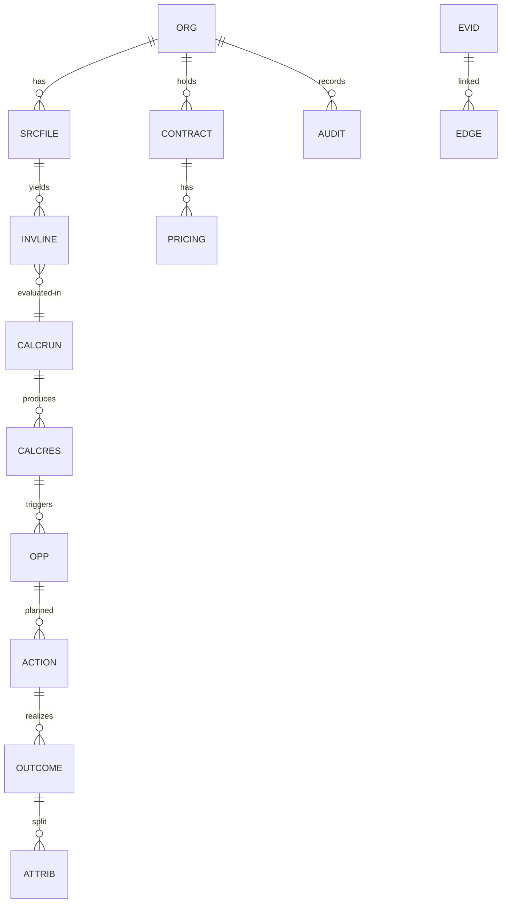

# 06 Appendices

## Glossary
variance=actual-expected; net=gross-discount+tax;
combined=authoritative net row; component=per-rule row;
fingerprint=hash of all canonical rows; decomposable=
can split net into parts; guardrail=LLM output check.

## Exception to HTTP
Validation/BusinessRule 422+400, NotFound 404, Conflict
409, AccessDenied 403. Handler adds correlationId,
never leaks stack.

## ER (V1-V10)

## FAQ
Q: where does money math live? A: 02 only, no AI.
Q: why MEDIUM conf? A: discount granted but no
entitlement measured (still reported).
Q: empty file failure? A: no, empty is ok distinct.
Q: add currency? A: CurrencyCode auto (A-Z 3),
Money works, add V4 seed if needed. No FX ever.

## Implement-a-PH checklist
1 read chapter F + Test file; 2 keep org_id + version;
3 throw typed ex (not null/zero default); 4 audit write;
5 checksum/citation where required; 6 mvn compile+test.
