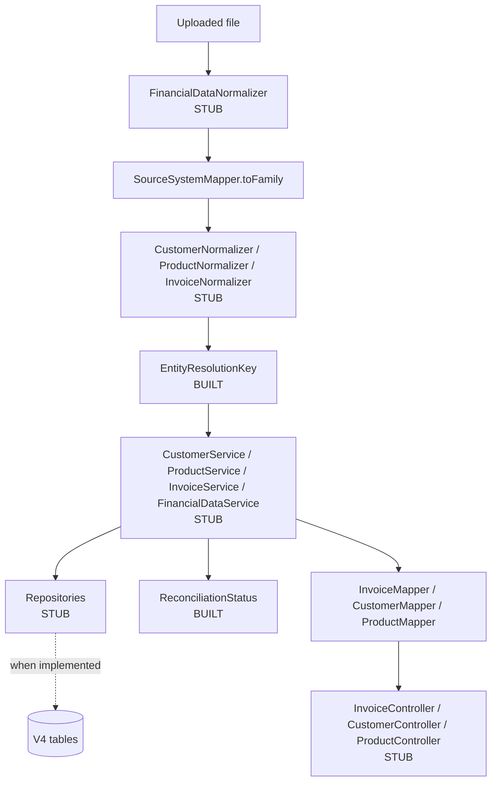
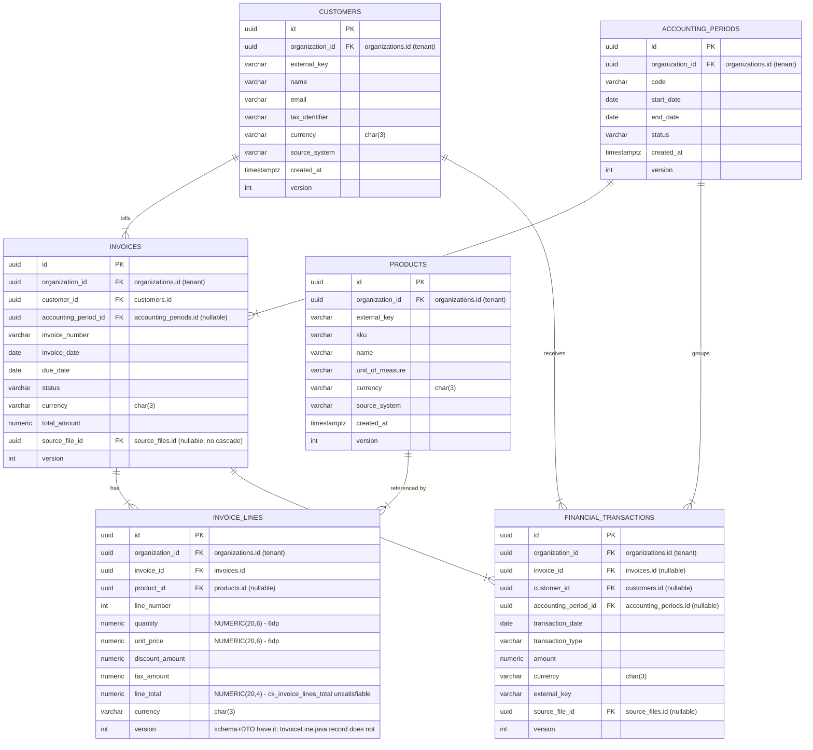

# 06 — Financial Data

Module `com.fintech.cfo.financial` — the canonical, source-independent financial
model. 43 files: 27 built, 16 stub.

## A. WHY this module exists

Every figure the finance team ever looks at arrives as text from somebody else's
accounting package, in that system's number format, with that system's idea of
what an invoice is. If the truth engine, the contracts and the opportunity
reports each read the raw uploads directly, then a change of supplier system
reaches all the way into the numbers people make decisions on, and a single
mis-grouped digit in a lakh-style amount is indistinguishable from a correct
one. This module is the one place where an uploaded file becomes a canonical
record: source-independent, tenant-scoped, arithmetically constrained, and
carrying a pointer back to the exact uploaded row it came from. Without it there
is no defensible figure at all — only an assertion.

Two things would be unsafe without it, and both are money:

* **A silently dropped amount.** The domain value types expose
  `CurrencyCode.value()`, `Money.amount()` and five `SourceReference` accessors.
  None of them is a JavaBean getter. A projection that copies fields implicitly
  writes `null` where a number belongs, and a report that sums `null` reports a
  wrong receivable with no error anywhere. This is why the build is configured to
  fail on unmapped targets rather than warn.
* **A disagreement that nobody can see.** A source system that reported a total
  of 100,000 and a line set that sums to 98,400 has made a statement. The
  module stores both figures and the verdict that separates them
  (`ReconciliationStatus`) rather than overwriting one with the other.

The module's hard invariants, which the rest of this chapter refers back to:

- **Tenancy is a constructor invariant.** Every canonical record requires
  `organizationId`, so a repository query built from a record is scoped by
  construction rather than by caller discipline.
- **Lineage is mandatory.** Every imported record requires a
  `SourceReference`. A canonical amount nobody can trace to an uploaded row is
  not evidence.
- **One currency per record, never a conversion.** Money carries its currency;
  the compact constructors prove all amounts in a record agree. There is no rate
  in this system, so a mixed record is refused, not converted.
- **Reported figures are facts, not defects to repair.** `Invoice` does not
  enforce `total == subtotal + tax`; `InvoiceLine` does not force
  `lineTotal == quantity * unitPrice - discount + tax`. The variance is
  measured and reported.
- **Rounding happens exactly once per line, HALF_UP, on the gross**, in
  `InvoiceLine`. No other layer rounds.
- **A missing external key means "not deduplicated", never "match anything".**
  `resolutionKey()` returns `null` rather than manufacturing an identity.
- **Every state set is closed.** Adding a member to `InvoiceStatus`,
  `TransactionType`, `AccountingPeriodStatus` or `ReconciliationStatus` is a
  compile-time obligation, because every set is a sealed type with an exhaustive
  `switch` over it.

## B. FLOW — the runtime journey

Two flows exist. Only the first is executable today; the second is designed and
marked `[PLANNED]` throughout, because the normalizers, services, repositories
and controllers it needs are all stubs.

### Flow 1 — read projection (executable)

```mermaid
flowchart TD
    A[Canonical record<br/>Invoice / Customer / Product / FinancialTransaction] --> B{Mapper interface}
    B --> C[MapStruct annotation processor<br/>compile time]
    C --> D[*MapperImpl generated]
    D --> E[Spring context startup]
    F[FinancialMappingSupport<br/>@MapperConfig] -.->|uses=| C
    G[FinancialMappingSupportBean<br/>@Component] -.->|injected into| D
    D --> H[InvoiceResponse / CustomerResponse / ProductResponse / TransactionResponse]
    I[SourceSystem] --> J[SourceSystemMapper]
    J --> K[SourceSystemFamily]
    K --> L[expectedGrouping]
```

1. **Trigger** — annotation processing during `javac`, then application context
   startup.
   **Where** — `mapper/InvoiceMapper.java:24`, `CustomerMapper.java:22`,
   `ProductMapper.java:21`, `TransactionMapper.java:18`,
   `SourceSystemMapper.java:21`.
   **What it does** — MapStruct generates an implementation for each mapper
   interface from the `@Mapping` annotations and the shared conversions.
   **Why this way** — the conversions are generated, not hand-written, so a
   renamed component cannot leave a stale getter behind in a mapper nobody
   reviews. Section D.1 covers the wiring that this depends on and the two
   alternatives that were tried and do not work.

2. **Trigger** — context startup.
   **Where** — `mapper/FinancialMappingSupportBean.java:21-23`.
   **What it does** — Spring instantiates a package-private, empty
   `@Component` implementing the `@MapperConfig` interface, so the
   `@Autowired FinancialMappingSupport` field MapStruct wrote into each
   `*MapperImpl` resolves to a real bean.
   **Why this way** — a `@MapperConfig` interface is never instantiated by
   MapStruct; it is a compile-time source of conversions only. Without a
   concrete bean the context fails to start. The class is empty on purpose: it
   exists so Spring has something to construct.

3. **Trigger** — a caller holding a canonical record and needing its wire form.
   **Where** — `InvoiceMapper.toResponse(Invoice, List<InvoiceLine>,
   ReconciliationStatus)` at `InvoiceMapper.java:96`, plus the single-argument
   line overload at `:121`; `CustomerMapper.toResponse` `:35`;
   `ProductMapper.toResponse` `:34`; `TransactionMapper.toResponse` `:60`.
   **What it does** — flattens the record: tenant `UUID` and ISO currency out
   of their value types, amounts out of `Money`, four lineage fields out of one
   `SourceReference`, lifecycle status out of its enum code.
   **Why this way** — every non-obvious conversion is qualified by name through
   `FinancialMappingSupport`, because implicit copying of a hand-written value
   type produces `null` rather than a compile error. Section D.9.

4. **Trigger** — a batch arrives and the parser needs a number format.
   **Where** — `SourceSystemMapper.toFamily(SourceSystem)` `:37`, feeding
   `SourceSystemFamily.expectedGrouping()` `:32`.
   **What it does** — projects the closed set of five source systems onto four
   formatting families through an exhaustive `@ValueMapping` set.
   **Why this way** — the profile is a property of the source, not a guess. A
   lakh/crore grouping read as a decimal comma yields a plausible wrong number,
   and the error surfaces only when somebody trusts it. `GENERIC` maps to
   `UNKNOWN`, and `UNKNOWN` groups with the western arm, so assuming a profile is
   a recorded assumption and a deviation stays reportable.

### Flow 2 — ingestion, resolution and reads `[PLANNED]`



5. **Trigger** — an upload completes parsing `[PLANNED]`.
   **Where** — `normalization/FinancialDataNormalizer.java:47`, a stub with a
   documented six-step contract.
   **What it does** — resolves the batch's `SourceSystem`, binds the family, and
   refuses an unknown code rather than assuming a profile.
   **Why** — the family decides which grouping is *expected*; both styles are
   always accepted by the parser, so a row in the other style is reported rather
   than reinterpreted.

6. **Trigger** — a raw record needs a canonical identity `[PLANNED]`.
   **Where** — `normalization/EntityResolutionKey.of(...)` `:65` (built), called
   from `Customer.resolutionKey()` `:91`, `Product.resolutionKey()` `:100`,
   `FinancialTransaction.resolutionKey()` `:128` (built).
   **What it does** — produces `(organizationId, sourceSystem, externalKey)` or
   `null`, and that key decides update-versus-insert.
   **Why** — deciding identity in the service rather than letting the unique
   index raise turns a re-run import into an idempotent update instead of a
   failed batch. Section D.7.

7. **Trigger** — a read request `[PLANNED]`.
   **Where** — `controller/*.java` (all three stubs), backed by `service/*.java`
   (all four stubs) and `repository/*.java` (all five stubs).
   **What it does** — serves the projection from Flow 1.
   **Why** — no write endpoint may accept caller-computed totals: the reported
   figures are source facts captured at ingestion, and letting a request set
    them collapses the distinction the reconciliation status exists to preserve.

### Schema reference — V4 entity-relationship diagram

This diagram shows the six tables V4 defines and the foreign-key relationships the
persistence layer writes into. It is reference only; neither Flow 1 nor Flow 2
touches the database. The annotations on `invoice_lines` record two live schema
defects documented in sections D.5 and D.6.



The diagram shows the canonical financial model: customers and products feed
invoices and their lines, accounting periods group both invoicing and transaction
activity, and financial transactions settle invoices against the same customer and
period. Every table is tenant-scoped through `organization_id`, and every monetary
column pairs with a `CHAR(3)` currency. The two annotated defects on `invoice_lines`
are explained in sections D.5 and D.6.

**Important constraints:**

- `ck_invoice_lines_total CHECK (line_total = quantity * unit_price - discount + tax)` — ensures a line total is derived from its own components; prevents a writer from storing a total that contradicts its quantity, price, discount and tax.
- `ck_accounting_periods_range CHECK (end_date >= start_date)` — prevents a period that ends before it starts, which would break every period-scoped posting.
- Partial unique index `ux_{customers|products|financial_tx}_org_source_key` on `(organization_id, source_system, external_key)` — prevents a re-run import from creating duplicate canonical rows for the same source identity.
- `ux_invoices_org_source_number (organization_id, source_system, invoice_number)` — prevents duplicate invoice numbers within one source system per tenant, while allowing two suppliers to both number from 1.
- `ON DELETE CASCADE` on every `organization_id` FK — prevents orphaned rows when a tenant is removed.

## C. FILES — every file in the module

**43 files: 27 built, 16 stub.** The 27 built comprise 23 executable types
(models, enums, DTOs, mappers, the resolution key) plus 4 configuration files
counted as built because they are complete and load-bearing: the two
`package-info.java` declarations and the two MapStruct wiring files.

| # | file | status | what it is for | key methods / lines |
|---|------|--------|----------------|--------------------|
| 1 | `controller/InvoiceController.java` | STUB | HTTP entry point for the invoice aggregate; must never serve an invoice without its reconciliation status | contract at `:13-28`; class at `:35` |
| 2 | `controller/CustomerController.java` | STUB | Read-only boundary for customer master data; must never accept a caller-chosen `sourceSystem`/`externalKey` | contract at `:14-27`; class at `:35` |
| 3 | `controller/ProductController.java` | STUB | Read-only boundary for the catalogue; product currency is a label, never a conversion authority | contract at `:14-26`; class at `:34` |
| 4 | `dto/InvoiceResponse.java` | BUILT | Wire shape of an invoice, carrying reported totals, the line set and the reconciliation verdict side by side | compact ctor `List.copyOf(lines)` `:68-70` |
| 5 | `dto/InvoiceLineResponse.java` | BUILT | Wire shape of one line; flat `BigDecimal` amounts plus a single currency scalar | record `:39-54` |
| 6 | `dto/CustomerResponse.java` | BUILT | Wire shape of a customer, with lineage flattened into four fields | record `:33-45` |
| 7 | `dto/ProductResponse.java` | BUILT | Wire shape of a catalogue entry; `sku` and `externalKey` are independently nullable | record `:28-41` |
| 8 | `dto/TransactionResponse.java` | BUILT | Wire shape of a cash movement; the stored sign is returned verbatim | record `:35-51` |
| 9 | `enums/InvoiceStatus.java` | BUILT | Sealed invoice lifecycle with settlement and terminality predicates | `fromCode` `:65`; seven records `:88-212` |
| 10 | `enums/TransactionType.java` | BUILT | Sealed classification of a monetary movement, with cash-flow and sign expectations | `fromCode` `:100`; ten records `:135-355` |
| 11 | `enums/AccountingPeriodStatus.java` | BUILT | Sealed period lifecycle; only `Locked` narrows `acceptsPostingOn` | `fromCode` `:70`; `acceptsPostingOn` default `:51` |
| 12 | `enums/ReconciliationStatus.java` | BUILT | Sealed verdict on reported-versus-recomputed totals; only `Matched` is balanced | `fromCode` `:57`; five records `:78-141` |
| 13 | `enums/SourceSystem.java` | BUILT | Closed set of five upstream systems, code derived from the constant name | ctor self-check `:43`; `fromCode` `:80` |
| 14 | `enums/SourceSystemFamily.java` | BUILT | Four formatting families plus the two grouping styles a parser can validate | `expectedGrouping()` `:32`; `DecimalGrouping` `:51` |
| 15 | `enums/package-info.java` | BUILT | Declares the package `@NullMarked` and the closed-set rule | `:10-13` |
| 16 | `mapper/FinancialMappingSupport.java` | BUILT | `@MapperConfig` holding the eleven named conversions shared by four mappers | `organizationUuid` `:56`; `amount` `:85`; four `SourceReference` projections `:98-127` |
| 17 | `mapper/FinancialMappingSupportBean.java` | BUILT | Empty `@Component` giving Spring a concrete bean for the generated `*Impl` classes | class `:22-23` |
| 18 | `mapper/InvoiceMapper.java` | BUILT | Projects the invoice aggregate; injects the reconciliation verdict as a source parameter | `toResponse` header `:96`; line overload `:121`; `invoiceCurrency` `:39` |
| 19 | `mapper/CustomerMapper.java` | BUILT | Projects a customer; deliberately withholds the resolution key and external key | `toResponse` `:35` |
| 20 | `mapper/ProductMapper.java` | BUILT | Projects a catalogue entry with the same qualification contract | `toResponse` `:34` |
| 21 | `mapper/TransactionMapper.java` | BUILT | Projects a transaction, preserving the stored sign | `toResponse` `:60`; `transactionCurrency` `:32` |
| 22 | `mapper/SourceSystemMapper.java` | BUILT | Exhaustive `SourceSystem` → `SourceSystemFamily` projection; the module's only `componentModel = "spring"` mapper | `toFamily` `:37` |
| 23 | `model/Invoice.java` | BUILT | Immutable mirror of the `invoices` row; carries the natural key and the nullable external key | compact ctor `:67-133`; `resolutionKey()` `:173`; ⚠ `:119` |
| 24 | `model/InvoiceLine.java` | BUILT | Immutable mirror of `invoice_lines`; owns the module's single rounding decision | `policyLineTotal()` `:159`; `exactCheckLineTotal()` `:189`; `schemaCheckVariance()` `:174` |
| 25 | `model/Customer.java` | BUILT | Immutable mirror of `customers`; no timestamps, owned by persistence auditing | `resolutionKey()` `:91`; `sourceSystem()` `:111` |
| 26 | `model/Product.java` | BUILT | Immutable mirror of `products`; SKU outside the resolution key on purpose | `resolutionKey()` `:100`; ⚠ `:64` |
| 27 | `model/FinancialTransaction.java` | BUILT | Immutable mirror of `financial_transactions`; sign preserved exactly | `resolutionKey()` `:128`; `currency()` `:112` |
| 28 | `model/AccountingPeriod.java` | BUILT | Immutable mirror of `accounting_periods`; the only record with no lineage and a `String` resolution key | `range()` `:84`; `acceptsPostingOn` `:118`; `resolutionKey()` `:132` |
| 29 | `model/package-info.java` | BUILT | Declares the model package `@NullMarked` and the no-entity rule | `:15-18` |
| 30 | `normalization/EntityResolutionKey.java` | BUILT | The `(org, sourceSystem, externalKey)` identity triple; all three components mandatory | `of(...)` `:65`; `requireText` `:82` |
| 31 | `normalization/FinancialDataNormalizer.java` | STUB | Facade that owns profile selection, period resolution and identity for a batch | contract `:18-39`; class `:47` |
| 32 | `normalization/CustomerNormalizer.java` | STUB | Turns one raw customer record into a canonical `Customer` and its resolution key | contract `:18-39`; class `:47` |
| 33 | `normalization/ProductNormalizer.java` | STUB | Turns one raw catalogue record into a canonical `Product`, resolved on external key not SKU | contract `:18-36`; class `:44` |
| 34 | `normalization/InvoiceNormalizer.java` | STUB | Turns a raw header and raw lines into `Invoice` + `InvoiceLine`s and computes the verdict | contract `:18-44`; class `:52` |
| 35 | `repository/CustomerRepository.java` | STUB | Tenant-scoped access keyed on the resolution triple; a null key must not become a wildcard | contract `:15-32`; class `:40` |
| 36 | `repository/ProductRepository.java` | STUB | Tenant-scoped access; SKU lookup is a convenience, never an identity | contract `:14-28`; class `:36` |
| 37 | `repository/InvoiceRepository.java` | STUB | Must expose **both** the natural-key and the resolution-key lookup for invoices | contract `:19-38`; class `:46` |
| 38 | `repository/InvoiceLineRepository.java` | STUB | Positional line access; upsert replaces an invoice's line set as a unit | contract `:18-38`; class `:46` |
| 39 | `repository/FinancialTransactionRepository.java` | STUB | Highest-volume table; every query index-shaped, every write period-aware | contract `:17-39`; class `:47` |
| 40 | `service/FinancialDataService.java` | STUB | Module entry point; the only place allowed to move a transaction into a period | contract `:18-42`; class `:49` |
| 41 | `service/InvoiceService.java` | STUB | Header and lines are written or not written together; computes the verdict | contract `:14-35`; class `:43` |
| 42 | `service/CustomerService.java` | STUB | Owns the transaction boundary; resolves identity before insert-or-update | contract `:15-32`; class `:40` |
| 43 | `service/ProductService.java` | STUB | Product identity is the external-key triple only; refuses deletion of referenced entries | contract `:16-33`; class `:41` |

Note there is no `package-info.java` in `controller`, `dto`, `mapper`,
`normalization`, `repository` or `service` — only `model` and `enums` declare
`@NullMarked`, so nullability in the other six packages is not package-default
and must be stated per field.

---

## D. DEEP DIVE — method by method

### D.1 The MapStruct wiring that broke startup

This is the single most instructive piece of engineering in the module, because
the failure was not in the business logic at all.

**Signature** — `mapper/FinancialMappingSupport.java:46-47`

```java
@MapperConfig
public interface FinancialMappingSupport {
```

**What it is** — a `@MapperConfig` interface carrying eleven `default`
conversions. It is never instantiated by MapStruct; it is a compile-time
provider of shared conversions. Four mappers reference it twice:

`@Mapper(config = FinancialMappingSupport.class, uses = FinancialMappingSupport.class)`

at `InvoiceMapper.java:24`, `CustomerMapper.java:22`, `ProductMapper.java:21`
and `TransactionMapper.java:18`.

**Step by step — what actually happens**

1. `javac` runs the MapStruct processor. For each `@Mapper` with
   `componentModel = spring` (the default when unspecified), it writes a
   `*MapperImpl` annotated `@Component`.
2. The processor resolves the conversions named in each `qualifiedByName` —
   `"organizationUuid"`, `"amount"`, `"sourceSystem"`, and so on — against the
   type named in `uses`.
3. Because `uses` names an *interface*, the generated implementation has no code
   to call. It emits a field and injects it: `@Autowired private
   FinancialMappingSupport financialMappingSupport;`.
4. At context startup Spring finds four `*MapperImpl` beans, each requiring a
   `FinancialMappingSupport` bean. `@MapperConfig` types are not components, so
   the container has nothing to inject and fails with
   **`NoQualifyingBeanDefinitionException`** — and because it fails while
   creating a singleton, the *entire* application context dies. One missing
   helper bean in a read-projection layer took down the whole service.
5. The fix is the last class in that file: a package-private
   `@Component` with an empty body, `FinancialMappingSupportBean`
   (`FinancialMappingSupportBean.java:21-23`). It inherits every conversion and
   exists only to be constructed.

**WHY this shape**

- *Why a separate top-level class rather than a nested one?* MapStruct treats a
  type referenced by `uses` as a helper source. A nested class inside the
  config would risk being picked up as an additional mapping provider, which can
  change which method wins an ambiguous lookup. Stating it plainly: the nesting
  is a defensive choice against a processor behaviour, not a style preference
  (`FinancialMappingSupport.java:41-44`).
- *Why package-private?* The bean is an implementation detail of the generated
  mappers. Making it public would advertise it as part of the module's API and
  invite a caller to inject a second instance of something stateless.
- *Why does it hold no code?* The `default` methods on the interface carry the
  behaviour. Duplicating them in the bean would give two implementations of the
  same conversions, and only the interface's are visible to the processor — so
  the copies would drift silently.

**WHY dropping `uses=` does not work**

The obvious-looking simplification is to delete `uses = FinancialMappingSupport.class`
from the four `@Mapper` annotations and rely on `config = ...` alone. It was
tried and it does not compile. On MapStruct 1.6.3, a method exposed by a
`@MapperConfig` type is **not** resolved through `config` as a candidate for
`qualifiedByName` lookup — only through `uses`, which is what makes the type a
*helper* rather than a *configuration*. The result is 200-plus errors of the
form:

```
Qualifier error: no method found with name <organizationUuid> in class
... the following candidates did not match: ...
```

**The trade-off this makes.** The cost of the working design is one extra
23-line file that looks like dead weight. The cost of the alternative is that the
simplification which reads as cleanup is in fact a total loss of the module's
type-checked projection layer. `config =` supplies *options* (unmapped target
policy, injection strategy, null checks); `uses =` supplies *behaviour*
(candidate methods). Confusing the two is the mistake.

**`-Amapstruct.unmappedTargetPolicy=ERROR`**

The processor is configured with `-Amapstruct.unmappedTargetPolicy=ERROR`, so
any target property the mapper does not fill is a compile error rather than a
warning.

**WHY, and what the alternative costs.** The default `WARN` policy produces
exactly the failure this module is built to prevent: a DTO field silently left
at its default. Because `Money.amount()`, `CurrencyCode.value()` and the
`SourceReference` accessors are not JavaBean getters, a mapper that forgets one
`@Mapping` will emit code that assigns nothing, and the record's default —
`null` for a `BigDecimal`, `0` for a `long` — becomes the reported figure. A
reconciliation report then sums a `null` and produces a wrong number with no
exception, no log line, and no way to tell afterwards. Compiling is cheap;
discovering that a quarter's receivables were understated by a rounding residual
is not. The trade-off is that adding a field to a DTO is a build break until
every mapper is updated — which is precisely the pressure you want when the
field is money.

### D.2 Invoice has TWO identities

This is the module's subtlest trap, and it is a trap of design, not of coding.

**The persisted key** is the V4 natural key
`ux_invoices_org_source_number (organization_id, source_system, invoice_number)`
— `V4__create_financial_data.sql:125-126`. Three `NOT NULL` columns, always
present.

**The resolution key** is `Invoice.resolutionKey()`
(`model/Invoice.java:173-178`):

```java
public @Nullable EntityResolutionKey resolutionKey() {
    if (this.externalKey == null) {
        return null;
    }
    return EntityResolutionKey.of(this.organizationId, sourceSystem().code(), this.externalKey);
}
```

built from `external_key`, which V4 declares nullable
(`V4__create_financial_data.sql:113`) and which participates in no unique index
for invoices.

**What it returns** — the tenant/source/external-key triple, or `null` when the
source supplied no external key. Never a manufactured fallback.

**Step by step**

1. If `externalKey` is `null`, return `null` immediately.
2. Otherwise resolve `sourceSystem()` — *not* `source.sourceSystem()` — so an
   unrecognised lineage code throws `ValidationException` instead of producing a
   key that no stored row can ever match (`Customer.java:98-101` states this
   rule; `Invoice` follows it).
3. Delegate to `EntityResolutionKey.of`, which trims and rejects blank.

**WHY both lookups, and why they are not interchangeable.** The two keys
disagree in both directions:

- A source that supplies an invoice number and **no** external key produces a
  fully deduplicable invoice with a `null` resolution key. Matching on the
  resolution key there finds nothing, so every re-run of the file inserts a
  second invoice — a duplicated receivable.
- A source that re-numbers an invoice between imports — an amended document
  getting a new number but keeping its upstream identifier — produces two rows
  under the natural key that are the same receivable. Matching on the natural key
  there creates a duplicate rather than updating.

`InvoiceRepository` is therefore specified to expose both:
`findByNaturalKey(org, sourceSystem, invoiceNumber)` for a source that
guarantees a number, and `findByResolutionKey` for a source that supplies an
external key and no trustworthy number
(`repository/InvoiceRepository.java:19-27`). The failure modes are asymmetric:
using the resolution key where the natural key was meant **duplicates** a
re-numbered invoice; using the natural key where the resolution key was meant
**merges** two distinct invoices. The second is worse — it destroys a record —
but the first is the more likely accident, because `resolutionKey()` is the
uniform pattern across `Customer`, `Product` and `FinancialTransaction`, so
copying that call site into invoice ingestion feels natural and is wrong.

**What `Customer`, `Product` and `FinancialTransaction` do differently.** All
three use the external-key triple *as* their persisted identity, because V4
gives each a partial unique index on exactly that triple
(`ux_customers_org_source_key` `:44`, `ux_products_org_source_key` `:67`,
`ux_financial_tx_org_source_key` `:211`). `AccountingPeriod` is the third case:
its natural key is `(organization_id, code)` with no external key at all, and
`resolutionKey()` returns a pipe-joined `String` rather than an
`EntityResolutionKey` (`AccountingPeriod.java:132-134`) — a period is a decision
made in this system, not a row imported from one, so it has no lineage and
nothing to deduplicate against.

**⚠ Review — `Invoice`'s `dueDate`**

`Invoice.java:119` reads:

```java
Preconditions.requireNonNull(dueDate, "dueDate");
```

This contradicts three things in the same file:

- the component is declared `@Nullable LocalDate dueDate` (`:46`);
- the null-tolerant guard twelve lines above deliberately permits an absent due
  date and explains why (`Invoice.java:84-89`): *"a null due date means 'no
  stated payment terms' and must not be defaulted to invoiceDate plus N days,
  which would invent a collection deadline and silently drive an aging report"*;
- `V4__create_financial_data.sql:107` declares `due_date DATE` with no `NOT
  NULL`.

In its current state **every invoice without stated payment terms is rejected at
construction**. A B2B invoice from a supplier that quotes no terms is completely
ordinary input, so this rejects real data. The in-code note at `:114-118`
identifies the fix — delete the line — and correctly declines to make it
because it is not a comment-only change.

Two further blemishes in the same constructor, both harmless but both evidence
of the same copy-paste that produced line 119: `import
com.fintech.cfo.shared.validation.Preconditions;` appears **twice**
(`Invoice.java:19` and `:20`), and the block at `:110-123` repeats six
validations already made at `:68-92` plus a second half of the currency proof.
The comment at `:107-109` claims the repetition is "left in place so this diff
stays comment-only", which is a statement about how the file was edited rather
than about how it should read. The cost of the duplicate checks is not runtime —
they are cheap — but the duplicate *import* is a defect any linter should catch,
and the redundant block is precisely what let the contradictory `dueDate` line
survive review by looking like more of the same.

**⚠ Review — `Product`'s `sku`**

`Product.java:64`:

```java
sku = Preconditions.requireText(sku, "sku", MAX_SKU_LENGTH);
```

`sku` is declared `@Nullable String sku` (`:28`) and `products.sku` is
`VARCHAR(120)` with **no** `NOT NULL` (`V4__create_financial_data.sql:55`). The
constructor then re-applies `optionalText` to the same field at `:73`, which can
only ever run when `:64` has already thrown.

So every SKU-less catalogue entry is rejected at construction. A legacy product
created by hand, an unmapped line, a service item with no stock code — all real
inputs — cannot be represented. The in-code note at `:59-63` catches this and
correctly declines to fix it. The correct change is to delete line 64 and let
`:73` do the trimming and nulling, exactly as `externalKey` and `description`
are handled.

There is a second, quieter inconsistency in the same class: the indentation of
the `id` null-check at `:55` is one tab while the rest of the constructor uses
two (`:52-54` acknowledges it). Cosmetic, but in a file whose purpose is
authority, a misindented invariant reads as an afterthought.

### D.5 The NUMERIC scale problem

This is the module's one unavoidable compromise with the database, and the Java
side models it rather than hiding it.

**The arithmetic, exactly as the schema states it**
(`V4__create_financial_data.sql:172`):

```sql
CONSTRAINT ck_invoice_lines_total
    CHECK (line_total = (quantity * unit_price) - discount_amount + tax_amount)
```

with `quantity NUMERIC(20,6)`, `unit_price NUMERIC(20,6)` and
`line_total NUMERIC(20,4)`.

**Why it cannot hold.** Two six-decimal numbers produce up to **twelve**
decimal places. The target column holds **four**. `quantity = 3.333333` and
`unit_price = 1.000001` gives `3.333336333333`; rounded HALF_UP to scale 4 that
is `3.3333`, and the residual — `0.000036333333`, roughly three and a half
times the smallest stored unit — cannot be written anywhere in
`invoice_lines`. The CHECK compares a four-decimal left-hand side against a
twelve-decimal right-hand side and answers `false` for arithmetic reasons, not
data reasons.

**How the module responds.** Four methods on `InvoiceLine`, and it is worth
being exact about what each one is for.

**`grossAtSourcePrecision()`** — `InvoiceLine.java:145-147`

```java
public Money grossAtSourcePrecision() {
    return this.unitPrice.multiply(this.quantity);
}
```

Returns the **unrounded** product, up to twelve decimal places. It exists to be
the left-hand operand of the literal CHECK expression, and to make the residual
below *provable* rather than asserted. No WHY needed — a method that does not
round so that a later method can round deliberately is self-evident.

**`policyLineTotal()`** — `InvoiceLine.java:159-161`

```java
public Money policyLineTotal() {
    return roundToMoneyScale(this.grossAtSourcePrecision()).subtract(this.discountAmount).add(this.taxAmount);
}
```

Returns the total this system would *bill*: round the gross, then subtract
discount, then add tax.

**Why round the gross and not the answer.** Rounding happens exactly once, and
it happens on the gross, before discount and tax are applied. Both those
operands are already at scale 4, so a second rounding after them could only
introduce a residual with no cause — and a residual that does not correspond to
a rounding decision is indistinguishable, in the stored row, from a source
arithmetic error. The alternative (round the final answer once) is numerically
equal here but semantically different: it makes the stored figure a function of
all four inputs rather than of a documented single step, so a reviewer
recomputing the line by hand would get a different number from the one stored
whenever the discount and tax themselves carry sub-unit precision. **The
trade-off**: rounding the gross makes the reported figure reproducible from the
printed line, and costs the tiny bias of never rounding down the tax — which
for a system that bills what it computes is the correct direction to err.

**Why HALF_UP, not HALF_EVEN** — `InvoiceLine.java:83`:

```java
public static final RoundingMode ROUNDING_MODE = RoundingMode.HALF_UP;
```

Documented at `:75-82`. Banker's rounding sends every exact tie to the even
neighbour, so a tie on one line rounds down and a tie on the next rounds up
purely by position. Across a supplier's thousand-line invoice that is a
systematic, predictable bias — and the sign of the bias alternates by line
index, which is the worst possible shape: it neither over-charges uniformly nor
cancels out. HALF_UP always rounds a tie up, so the aggregate error is
non-negative and monotone. **The trade-off**: HALF_UP is not "unbiased" against
a true value; it is biased *toward the payee*. The alternative would have been
to keep HALF_EVEN and accept the line-index-dependent sign flip, which is
strictly worse for a system whose stored total must be defensible to an auditor.

**`exactCheckLineTotal()`** — `InvoiceLine.java:189-191`

```java
public Money exactCheckLineTotal() {
    return this.grossAtSourcePrecision().subtract(this.discountAmount).add(this.taxAmount);
}
```

The literal V4 expression evaluated without rounding. It is the *other* half of
the comparison: `policyLineTotal()` is what this system believes, and
`exactCheckLineTotal()` is what the database will demand. They are equal
whenever the product happens to be exact at four decimal places — which is the
common case for whole quantities and two-decimal prices, and the *uncommon* case
for a rate card with fractional units.

**`schemaCheckVariance()`** — `InvoiceLine.java:174-176`

```java
public Money schemaCheckVariance() {
    return exactCheckLineTotal().subtract(this.lineTotal);
}
```

Returns the residual between the stored total and the literal expression, in the
line's own currency. **Zero** for any product exact at four places. Otherwise
non-zero, and **bounded by half of the smallest stored unit** — that bound is
the whole and only reason the literal CHECK cannot hold for six-decimal
quantities. A positive value means the stored total is *below* the expression.

**Why it is a method and not an assertion.** Because the variance is a fact
about the data, not a violation of the module's rules. `InvoiceLine`'s compact
constructor (`InvoiceLine.java:126-129`) explicitly declines to require
`lineTotal == policyLineTotal()`: the stored total is what the source reported
and is preserved verbatim, and the difference is reported. Overwriting it would
make the reconciliation status unable to detect the drift it exists to detect.

**⚠ The consequence nobody has implemented.** Three places agree the CHECK must
be relaxed and none of them does it:

- `InvoiceLine.java:33-35` — *"The persistence pass must therefore relax that
  constraint to a rounded comparison; see the module report."*
- `InvoiceLine.java:196-199` — `satisfiesSchemaCheck()` returns `false`, and the
  note is explicit that **`false` is not an error condition**.
- `V4__create_financial_data.sql:166-170` — the migration's own comment
  acknowledges the comparison "fails by up to half the smallest stored unit
  whenever the product is not exact at four places, which the persistence pass
  is expected to relax to a rounded comparison."

As the schema stands, the first six-decimal quantity written by the persistence
pass will be **rejected by PostgreSQL**, even though the Java side considers it
correct and has a method proving the discrepancy is sub-unit. The relaxation
needs to be a new migration replacing `ck_invoice_lines_total` with a rounded
comparison, e.g.
`CHECK (line_total = round((quantity * unit_price), 4) - discount_amount + tax_amount)`,
and it must preserve the second limit the migration states at `:170-171`:
**no non-negativity rule**, because a credit note legitimately carries negative
amounts and a blanket `>= 0` would forbid it.

**`satisfiesSchemaCheck()`** — `InvoiceLine.java:203-205` — `lineTotal.equals(exactCheckLineTotal())`.
`true` only on exact agreement. Because `Money` equality is scale-sensitive,
`3.33330` and `3.3333` would compare unequal here even though the database
treats them as the same `NUMERIC(20,4)`. That is correct for a *literal* check
and wrong as a *schema* check — which is one more reason the schema constraint
should be relaxed to a rounded numeric comparison rather than left as string
equality against a Java-computed value.

**The wider scale lesson.** `quantity` and `unit_price` are validated to
`NUMERIC(20,6)` (14 integer digits + 6, and 16 + 6 respectively —
`InvoiceLine.java:111` and `:114`), while all four money amounts are validated
to `NUMERIC(20,4)`. Note the deliberate asymmetry at `:112-114`: `unitPrice` is
checked against `AMOUNT_INTEGER_DIGITS + UNIT_PRICE_SCALE` — twenty integer
digits, not sixteen — *"because only its product with a six-decimal quantity is
ever stored"*. That is, `unit_price` is allowed a wider range than any other
money column in the schema, because a rate per unit is naturally finer than a
total.

### D.6 ⚠ Review — `InvoiceLine` has no `version`, but the schema and the DTO do

Three facts that do not fit together:

| fact | source |
|---|---|
| `invoice_lines.version BIGINT NOT NULL DEFAULT 0` exists | `V4__create_financial_data.sql:163` |
| `InvoiceLineResponse` declares `long version` | `dto/InvoiceLineResponse.java:54` |
| `InvoiceLine` has **no** `version` component | `model/InvoiceLine.java:43-55` |
| the mapper ignores the target | `mapper/InvoiceMapper.java:120` |

`InvoiceMapper.java:118-120` reads:

```java
// InvoiceLine is a version-less value record (no version component);
// the header carries the optimistic-lock version, so there is nothing to project here.
@Mapping(target = "version", ignore = true)
```

**What the client sees.** Every line of every invoice serialises with
`"version": 0`. Permanently. Not just for new lines — for all of them, always,
because there is no code path that could ever set it.

**Why the `ignore = true` does not save this.** It makes the mapping *compile*.
Without it, `-Amapstruct.unmappedTargetPolicy=ERROR` would reject the build for
an unmapped target. So the annotation converts a build error into a permanently
wrong field, which is exactly the trade the strict policy exists to prevent —
and note the irony: the strict policy is right about the DTO and the domain
disagree about the shape.

**Blast radius.** Lost-update detection. `CustomerResponse`, `ProductResponse`,
`TransactionResponse` and `InvoiceResponse` all carry a real `version`, and each
`@param version` Javadoc states the purpose plainly
(`CustomerResponse.java:31-32`): *"version is surfaced so a client performing an
edit can send it back and have the write rejected if someone else changed the
row in between."* A client that reads an invoice, edits one line, and writes the
whole aggregate back sends `version: 0` for every line. If the persistence
layer honours that against a row whose real version is 7, either the write
fails spuriously forever, or — worse, and more likely, since a line is replaced
as a set — the version check is skipped for lines and a concurrent line set is
silently overwritten. Either way the client is operating on a fiction.

**The correct fix**, and there are two, with a trade-off between them:

1. **Add `long version` to `InvoiceLine`** and drop the `ignore = true`. Aligns
   the record with the column and the DTO, and makes the optimistic lock real
   for lines. Cost: the record gains a component, and since the canonical form is
   reconstructed on re-import, whoever writes the line set must decide what the
   version becomes after a wholesale replacement.
2. **Remove `version` from `InvoiceLineResponse`.** Honest about what the
   aggregate supports: the invoice header is the lockable unit, the line set is
   replaced inside the header's transaction, and there is no per-line lock to
   offer. Cost: a breaking change to the published response shape, and any
   client already keying on `version` breaks.

Given that `InvoiceLineRepository`'s contract makes line writes
replace-the-whole-set, option 2 is the more honest of the two. The current
state — a field that is always zero and is documented as if it were real — is
the one option that is definitely wrong.

### D.7 `EntityResolutionKey` — why a deterministic key deduplicates

**Signature** — `normalization/EntityResolutionKey.java:65-68`

```java
public static EntityResolutionKey of(OrganizationId organizationId, String sourceSystem,
        String externalKey)
```

**What it returns** — a validated `(organizationId, sourceSystem, externalKey)`
triple. Throws `ValidationException` if any component is null or blank.

**Step by step** — `requireText` at `:82-91` trims each string component and
rejects null and blank; the compact constructor at `:32-47` rejects a null
`organizationId`; the factory simply constructs.

**The problem it solves.** A supplier's customer master arrives in a file. Next
month a corrected file arrives. Without a deterministic identity, the corrected
customer is a *new* record, the old one still has open invoices attached to it,
and the finance team sees two customers where there is one — with the
receivables split between them and no way to tell which balance is right. A
deterministic key turns the re-import into an update of the row it came from.

**Why the tenant is inside the key, not wrapped around it.** The key is
`(organization_id, source_system, external_key)`, mirroring
`ux_customers_org_source_key` (`V4:44-45`). Two consequences, both of them
reasons rather than accidents:

- Two tenants may legitimately use the same external identifier. `ERP-CUST-0042`
  in one organisation and `ERP-CUST-0042` in another are different customers. A
  key built without `organization_id` would be wrong, not merely imprecise.
- One tenant may pull from two systems that number independently. Tally customer
  `7` and SAP customer `7` are different rows. Hence `source_system` inside the
  key.

**Why there is no "no external key" representation.** The record has no
fourth component, no sentinel, no `Optional` factory. A row with no external key
falls *outside* the partial unique index — `WHERE external_key IS NOT NULL` — so
it has no key at all, and its owner reports `null` from `resolutionKey()`
(`Customer.java:91-102`, `Product.java:100-105`,
`FinancialTransaction.java:128-133`). The comment at `EntityResolutionKey.java:33-37`
is explicit that this is deliberate.

**The trade-offs this makes, stated plainly:**

| decision | buys | costs |
|---|---|---|
| blank rejected, not treated as a key | a blank key cannot collapse every unkeyed record into one under the unique index | a source that emits `""` for "no key" must be normalised upstream or the row is rejected — a visible failure in preference to a silent merge |
| trimmed, case **not** folded | a padded `VARCHAR` and a trimmed string produce the same key | two identifiers the upstream treats as distinct (`abc`, `ABC`) stay distinct and produce two canonical rows. Folding case would merge them. The module chooses the duplicate over the wrong merge, because a wrongly merged entity is unrecoverable and a duplicate is visible |
| widths not re-checked here | the producing record has already bounded `source_system` to `VARCHAR(64)` and `external_key` to `VARCHAR(255)`; re-checking duplicates four validations for no new information | the key is not independently safe to persist — a caller that builds one from an unbounded string gets a key the database will truncate. Acceptable only because all four call sites pass values that came through a `Preconditions.optionalText` |
| a record rather than a `Map` in the caller | a resolution decision is a value that can be passed, logged, compared and asserted on | one more type in the model package, for three components |

**Why the blank rejection matters more than it looks.** `requireText` throws on
an empty *after* trimming, not merely on `""`. So `"  "` is refused as well. If
blank keys were accepted, the partial unique index
`(organization_id, source_system, external_key) WHERE external_key IS NOT NULL`
would treat every blank-keyed row from one source as the same row, and the
second insert would violate the index — a database error, at write time, with no
explanation. Refusing at construction turns that into a validation error naming
the field.

**What is not in this class.** There is no fuzzy matching, no name
normalisation, no similarity score — and that is the most important absence in
the file. `ProductNormalizer`'s contract says so directly: *"Unresolvable or
duplicated input must be reported, never merged by fuzzy name matching, because a
wrongly merged catalogue entry silently repricing an invoice is worse than a
visible import error"* (`ProductNormalizer.java:35-36`). A fuzzy match is
strictly more capable and strictly more dangerous here: a false merge on a
catalogue entry is not reported by anything, ever, because both rows now exist
and both look correct.

### D.8 Every model, method by method

Six canonical records, all immutable, all with compact constructors that enforce
the schema's constraints so an invalid row cannot exist in memory before
persistence arrives (`model/package-info.java:6-9`).

**Shared structural decision: no timestamps.** `created_at` / `updated_at` exist
on every V4 table with a database default, and none of the six records carries
them. `Customer.java:25-28` states the reason: adding them would mean calling
`now()` inside the domain, which the determinism rule forbids. A domain object
whose value depends on when you built it cannot be tested, replayed, or compared.

#### `Invoice` — `model/Invoice.java:39-53`

| component | type | nullable | V4 column |
|---|---|---|---|
| `id` | `UUID` | no | `id` PK |
| `organizationId` | `OrganizationId` | no | `organization_id` |
| `customerId` | `UUID` | no | `customer_id` `NOT NULL` |
| `accountingPeriodId` | `UUID` | **yes** | `accounting_period_id` nullable |
| `invoiceNumber` | `String` | no | `invoice_number VARCHAR(120)` |
| `invoiceDate` | `LocalDate` | no | `invoice_date` `NOT NULL` |
| `dueDate` | `LocalDate` | yes | `due_date` nullable (⚠ `:119`) |
| `status` | `InvoiceStatus` | no | `status` `NOT NULL` |
| `subtotalAmount` | `Money` | no | `subtotal_amount NUMERIC(20,4)` |
| `taxAmount` | `Money` | no | `tax_amount NUMERIC(20,4)` |
| `totalAmount` | `Money` | no | `total_amount NUMERIC(20,4)` |
| `externalKey` | `String` | yes | `external_key` nullable |
| `source` | `SourceReference` | no | lineage |
| `version` | `long` | no | `version` `NOT NULL` |

**Natural vs surrogate key.** The surrogate `id` is what everything refers to.
The *natural* key is `(organization_id, source_system, invoice_number)` — and
note the natural key spans two sources: `source_system` is **not** a record
component, it lives inside `SourceReference` and is reached through
`sourceSystem()` (`:142-144`). That is why `resolutionKey()` calls
`sourceSystem()` rather than reading a field.

**Constructor invariants, in order** (`:67-133`): `id`, `organizationId`,
`customerId`, `invoiceDate`, `status` non-null; `invoiceNumber` required text
trimmed to 120; `dueDate >= invoiceDate` *if present*; the three amounts each
constrained to precision 20 / scale 4; `subtotalAmount`/`taxAmount` and
`subtotalAmount`/`totalAmount` proved same-currency (two comparisons, and the
third is transitive, so three pairwise checks would be redundant);
`externalKey` optional text ≤ 255; `source` non-null; `version >= 0`.

**What is deliberately *not* enforced:** `total == subtotal + tax`. The comment
at `:96-99` gives the reason and it is the best one-liner in the module:
overwriting the reported total with the recomputed one *"would destroy the
evidence of that drift"*. The identity is instead recomputed and classified as a
`ReconciliationStatus` — which is why the enum's Javadoc cites this record
(`Invoice.java:30`).

**`currency()`** — `:152-154` — returns `subtotalAmount.currency()`. Valid for
all three amounts *because the constructor proved they agree*; that is the WHY,
and it is a real guarantee rather than a convenience.

**`sourceSystem()`** — `:142-144` — `SourceSystem.fromCode(source.sourceSystem())`.
Throws `ValidationException` for a code outside the closed set. WHY: a key built
from an unrecognised code can never match a stored row, so failing loudly beats
producing a permanently unmatched key.

#### `InvoiceLine` — `model/InvoiceLine.java:43-55`

Eleven components. Nullable: `productId` (an unmapped line is still a real
charge — dropping it loses revenue, guessing a product misstates what was sold,
`:96-98`) and `description`. `currency` is **not** a component: the four `Money`
values each carry it and the constructor proves all four agree (`:119-125`),
which is what "raise, never convert" has to mean for a value type.

`lineNumber` is 1-based and `> 0` (`:103-105`) because
`ux_invoice_lines_invoice_line (invoice_id, line_number)` is the line's *only*
identity — it has no external key, so position is how a re-import replaces a
line set. `netBeforeTax()` (`:212-214`) is arithmetic on the stored line total,
not the gross, and is self-evident.

Note there is no `version` component — see D.6.

#### `Customer` — `model/Customer.java:30-39`

Nine components. Nullable: `externalKey`, `email`, `taxIdentifier`. The email
bound is 320 (`:62-64`) — the column width *and* the RFC 5321 maximum path
length, so the bound is the schema's and the standard's at once. `taxIdentifier`
is trimmed but **not reformatted** (`:65-68`): GSTIN, VAT and PAN shapes differ
by jurisdiction and normalising them would break the values the tax team searches
by. `currency` is the *default* currency of the customer's invoices; it never
converts an amount (`:69-72`) — `Money` enforces that at the point of arithmetic
instead.

**`resolutionKey()`** — `:91-102` — three steps: return `null` if no external
key; otherwise call `sourceSystem()` (not `source.sourceSystem()`) so an unknown
lineage code fails loudly; otherwise `EntityResolutionKey.of`. The comment at
`:92-94` states the load-bearing part: a manufactured key would make the
in-memory dedup rule *stricter* than the database one and would merge two
genuinely different customers.

#### `Product` — `model/Product.java:24-34`

Ten components. Nullable: `externalKey`, `sku` (⚠ `:64` rejects it anyway),
`description`, `unitOfMeasure`. `unitOfMeasure` is left null rather than
defaulted to a piece count (`:75-77`): the source never asserted one, and
inventing it would make a rendered contract term wrong. `currency` is the
catalogue *price* currency and is informational only — never a conversion
authority for a billed line (`:78-80`).

**`resolutionKey()`** — `:100-105` — same shape as `Customer`'s, and the
comment at `:91-95` is the interesting part: `sku` is **deliberately excluded**
even though `ix_products_org_sku` exists, because *"the schema keeps two rows
sharing a SKU apart, so merging on it here would be stricter than the database
and would reprice historic invoice lines."* That is the general rule of this
module stated in one sentence: **the in-memory dedup rule must never be stricter
than the schema's**, because the domain has no way to know what the schema
chose to keep apart.

#### `FinancialTransaction` — `model/FinancialTransaction.java:36-48`

Twelve components — the most permissive record in the module. `invoiceId`,
`customerId` and `accountingPeriodId` are all nullable (`:67-72`): a bank feed
transaction has no invoice, an accrual has no customer, and a periodless posting
is legitimate input that the service layer resolves against `AccountingPeriod`
or rejects. `transactionDate` **is** required — without it the row cannot be
placed in a period at all.

The stored sign is preserved exactly (`:86-88`): *"an inverted sign is an audit
finding, never a formatting detail to fix on the way in."* `TransactionMapper`
honours the same rule in the other direction, never normalising to a magnitude
(`TransactionMapper.java:45-49`).

**`resolutionKey()`** — `:128-133` — the comment at `:118-123` names the
consequence precisely: falling back to a date-and-amount match *"would silently
collapse two identical payments on the same day into one."* Two genuine payments
of the same amount on the same day is a completely ordinary event — payroll runs
do it every month.

#### `AccountingPeriod` — `model/AccountingPeriod.java:22-29`

Seven components and the only record with **no `SourceReference`** (`:17-21`).
A period is a decision made in this system, not a row imported from one, so it
has no lineage to carry. It is also the only record whose natural key is not
derived from a source, and the only one whose `resolutionKey()` returns a
`String` (`:132-134`, `organizationId.value() + "|" + code`) rather than an
`EntityResolutionKey`.

The constructor mirrors `ck_accounting_periods_range` (`:66-71`) rather than
leaving it to the database, so an inverted window cannot exist in memory — where
it would be worse, because `contains()` would silently answer `false` for every
date. `code` is trimmed and length-checked before storage (`:47-57`): a longer
code would be truncated by the database and would then no longer match its own
resolution key.

**`range()`** — `:84-89` — `DateRange.of(startDate, endDate)`, **inclusive on
both ends** (`:85-88`). The end date is the last day of the period, not the first
day of the next one, and an exclusive reading here would silently drop every
transaction dated on the final day.

**`contains(LocalDate)`** — `:102-104` — window membership only.

**`acceptsPostingOn(LocalDate)`** — `:118-120` —

```java
return this.contains(date) && this.status.acceptsPostingOn(date);
```

**WHY the conjunction is the point.** These are two independent questions and
collapsing them is a real, common defect. A date can be inside a locked period
and still have to be refused, because the report containing it has been signed
(`AccountingPeriod.java:110-113`). The reverse case is worse: a caller that
asks only `status.acceptsNewPostings()` and forgets the window will accept a
posting dated outside the period, placing it in a report it does not belong to.
`AccountingPeriodStatus` is where the second half lives — `acceptsNewPostings()`
is the gate, and only `Locked` narrows `acceptsPostingOn` further
(`AccountingPeriodStatus.java:51-55`, `:131-134`).

### D.9 Every mapper and the mapping contract

**Why conversions are explicit, not implicit.** MapStruct's default accessor
strategy recognises `getX()` methods and record component accessors. The shared
domain value types are hand-written classes, and their read methods are
`CurrencyCode.value()`, `Money.amount()` and five `SourceReference` accessors —
`sourceSystem()`, `sourceRecordId()`, `sourceFileId()`, `sourceRowNumber()`, and
one more. None of those is a JavaBean getter. A mapper that relied on implicit
field copying would find no property, and would produce a projection with
`null` for the currency, `null` for every amount, and `null` for all four
lineage fields — **without failing the build**. That is the specific catastrophe
`FinancialMappingSupport.java:21-27` describes: *"Declaring each conversion
explicitly is what keeps a silently dropped amount from reaching a report."*
`-Amapstruct.unmappedTargetPolicy=ERROR` (D.1) is the second half of the same
defence: a target property MapStruct cannot fill is now a compile error.

**The eleven named conversions** (`FinancialMappingSupport.java:46-163`):

| `@Named` | signature | what it produces |
|---|---|---|
| `organizationUuid` | `UUID organizationUuid(OrganizationId)` `:56` | the raw tenant UUID, matching `organization_id UUID` in every table |
| `currencyCode` | `String currencyCode(CurrencyCode)` `:70` | the ISO-4217 scalar. WHY scalar and not a nested object: the wire format must not change shape when a currency gains attributes (`:62-65`) |
| `amount` | `BigDecimal amount(Money)` `:85` | the numeric part. **WHY the currency is dropped here:** every DTO carries one sibling `currency` field, and a client able to assemble a line whose four amounts span currencies is a bug this shape prevents (`:77-81`) |
| `sourceSystem` | `String sourceSystem(SourceReference)` `:98` | lineage, flattened |
| `sourceRecordId` | `String sourceRecordId(SourceReference)` `:107` | lineage |
| `sourceFileId` | `String sourceFileId(SourceReference)` `:117` | lineage; `null` when the record did not come from a file |
| `sourceRowNumber` | `Long sourceRowNumber(SourceReference)` `:126` | the 1-based row; `null` when unavailable |
| `invoiceStatusCode` | `String invoiceStatusCode(InvoiceStatus)` `:141` | the persisted code |
| `transactionTypeCode` | `String transactionTypeCode(TransactionType)` `:150` | the persisted code |
| `reconciliationCode` | `String reconciliationCode(ReconciliationStatus)` `:159` | the verdict code |

**WHY the four `SourceReference` projections need `@Named` at all.** They share
the same source type *and* the same target type — `String` — which makes an
unqualified lookup genuinely ambiguous: MapStruct would find four equally
applicable candidates and fail, or worse, resolve to one arbitrarily. `String`
is overloaded in MapStruct's resolution because so many types have a `toString`.
The three named scalars on the left are unique by source type and are qualified
only where the call site reads better.

Note also what is *not* projected: `InvoiceStatus.requiresSettlement()` and
`isTerminal()`, and `TransactionType.affectsCashFlow()` and
`expectsPositiveAmount()` (`FinancialMappingSupport.java:130-135`,
`TransactionMapper.java:41-43`). **WHY**: those are *this module's*
receivables and cash-flow rules. A client must read the code and apply its own
policy, so a reporting rule can change without a data migration.

**`InvoiceMapper`** — `mapper/InvoiceMapper.java`

- `invoiceCurrency(Invoice)` `:38-41` — `@Named("invoiceCurrency")`. Sourced
  from the whole record because the header has no `currency` component: the
  currency is carried by the three `Money` amounts and proven consistent
  (`:28-36`).
- `lineCurrency(InvoiceLine)` `:53-56` — `@Named("lineCurrency")`. Sourced from
  `unitPrice` because the line has no currency component either; the constructor
  already proved the other three agree (`:43-51`).
- `toResponse(Invoice, List<InvoiceLine>, ReconciliationStatus)` `:96` — the
  aggregate projection. **The reconciliation verdict is a source parameter, not
  a derived field**, and that is the single most important design decision in
  this mapper: it depends on the lines, which are loaded separately, so the
  mapper *cannot* compute it. Guessing `MATCHED` would mark unverified money as
  verified (`:92-94`). Unlisted targets — `id`, `customerId`, `invoiceNumber`,
  the two dates, `externalKey`, `version` — match by name, because `UUID`,
  `String`, `LocalDate` and `long` are copyable by plain assignment (`:58-62`).
  The three reported amounts are passed through untouched (`:74-76`): nothing
  recomputes or corrects them, which is *why* the verdict is a separate
  parameter.
- `toResponse(InvoiceLine)` `:121` — the single-argument line overload, invoked
  element-wise for the nested list. Note the deliberate omissions: no
  `sourceFileId` on the line DTO, because the owning invoice carries it and two
  copies of the same fact could disagree (`:115-116`); and no reconciliation
  field, because reconciliation is a header-level judgement over the *sum* of
  the lines and a per-line verdict would invite a client to add up mismatched
  verdicts and believe it had reconciled the invoice (`:98-102`).
  `@Mapping(target = "version", ignore = true)` — see D.6, ⚠.

**`CustomerMapper`** `:35` and **`ProductMapper`** `:34` — identical contracts,
six qualified targets each. Two deliberate omissions in `CustomerMapper`: the
resolution key and the external key it is built from. **WHY** (`CustomerMapper.java:17-20`):
both are ingestion concerns, and exposing the resolved identity on a read API
would invite a client to conclude that a customer it fetched by id is the only
row a given source identifier maps to. The external key *is* still projected —
as a displayable field — but the *key* is not, because the key is the thing that
implies uniqueness. `ProductResponse` projects `sku` as a catalogue label and
nothing more (`:17-20`).

**`TransactionMapper`** `:60` — the amount is unwrapped with its sign intact
(`:45-49`) and the type is projected as its code only. `accountingPeriodId`'s
absence is meaningful — the transaction has not been placed in a period yet — so
it is returned as `null` rather than resolved to a default period by the mapper
(`:57-59`).

**`SourceSystemMapper`** `:21-37` — the module's only `componentModel = "spring"`
mapper (`:17-19`). The other four are pure projections a caller may hold by
hand; this one is a stateless bean consulted once per ingested batch. Its five
`@ValueMapping` annotations cover every constant of a five-member enum, so
adding a sixth source system is a **compile error** rather than a silent
fall-through to a default profile. The mapping is not one-to-one: `ZOHO_BOOK`
and `QUICKBOOKS` both land on `CLOUD_ACCOUNTING`, and `GENERIC` on `UNKNOWN`
(`:24-27`) — which is why the projection lives in a mapper rather than being
derived on the enum.

**`InvoiceResponse`'s defensive copy** — `dto/InvoiceResponse.java:68-70`:
`lines = List.copyOf(lines)`. The list arrives from a repository result that may
be reused or cleared by the persistence layer; `List.copyOf` also rejects null
elements and yields an immutable list. An **empty** list is legal and means
"lines were not requested"; it is never `null`, so a client never has to
null-check (`:63-67`).

### D.10 Every enum

Four sealed interfaces with behaviour and two plain enums. The pattern is
consistent and deliberate: **sealed when the set carries behaviour, enum when the
value is a bare persisted code** (`enums/package-info.java:6-9`).

**`InvoiceStatus`** — `enums/InvoiceStatus.java:17-212`. Seven members. Sealed
because the set is used in arithmetic decisions, not just persisted (`:11-16`):
adding a status must break those decisions loudly instead of defaulting to
"not settled, not terminal".

| constant | `code()` | `requiresSettlement()` | `isTerminal()` | why |
|---|---|---|---|---|
| `DRAFT` `:88` | `DRAFT` | false | false | not issued, not yet a receivable |
| `ISSUED` `:106` | `ISSUED` | true | false | the full amount is a receivable |
| `PARTIALLY_PAID` `:124` | `PARTIALLY_PAID` | true | false | the unpaid remainder is still a receivable |
| `PAID` `:142` | `PAID` | false | true | settled in full |
| `OVERDUE` `:160` | `OVERDUE` | true | **false** | past due but still a receivable — an aging report depends on this |
| `VOID` `:178` | `VOID` | false | true | negated; was issued in error |
| `CANCELLED` `:196` | `CANCELLED` | false | true | withdrawn before settlement; never a receivable |

`OVERDUE` is the row that justifies the whole design: it is *not* terminal
because an overdue invoice is still collectable, and a type that conflated
"terminal" with "closed" would drop it from every receivables report.

`fromCode(String)` `:65-86` — rejects null/blank, trims, upper-cases with
**`Locale.ROOT`** (`:71-72` — under a Turkish default locale `toUpperCase` maps
`"i"` to `"İ"` and the match would silently fail), then an **exhaustive switch**
over all seven codes (`:74-75`). Never defaults: an unrecognised code means the
source and this module disagree about the lifecycle, and guessing would decide
whether an invoice counts as a receivable.

**`TransactionType`** — `enums/TransactionType.java:15-355`. **Ten**
classifications, each its own record with its own three answers.

| constant | `code()` | `affectsCashFlow()` | `expectsPositiveAmount()` | why |
|---|---|---|---|---|
| `REVENUE` `:135` | `REVENUE` | true | true | cash inflow from trading |
| `EXPENSE` `:154` | `EXPENSE` | true | true | cash outflow |
| `RECEIPT` `:173` | `RECEIPT` | true | true | cash received against an invoice |
| `PAYMENT` `:192` | `PAYMENT` | true | true | cash paid out |
| `CREDIT_NOTE` `:217` | `CREDIT_NOTE` | true | **false** | cash does move; reduces what the customer owes |
| `DEBIT_NOTE` `:243` | `DEBIT_NOTE` | true | **false** | cash moves; increases what the customer owes, recorded with the opposite sign to the credit note it accompanies |
| `REFUND` `:267` | `REFUND` | true | false | a real cash outflow, negative |
| `ADJUSTMENT` `:293` | `ADJUSTMENT` | **false** | false | restates a figure already accounted for; treating it as movement would double-count |
| `OPENING_BALANCE` `:316` | `OPENING_BALANCE` | **false** | false | a snapshot; a position may be positive, negative or zero, so the sign is unconstrained |
| `CLOSING_BALANCE` `:339` | `CLOSING_BALANCE` | **false** | false | a snapshot, same reasons |

**WHY classification cannot be inferred from the sign** — the reason the type
exists at all (`:11-14`): a refund and an adjustment can both be negative, and
only the type says whether cash actually moved. `expectsPositiveAmount()` is a
**statement of expectation for reconciliation and reporting only** — the stored
sign is never rewritten to match it (`:57-63`).

`OPENING_BALANCE` and `CLOSING_BALANCE` exist as distinct types rather than
being inferred (`:38-40`) so a report can separate "what changed this period"
from "what the position was". Excluding them from cash flow is
`affectsCashFlow()`, and `FinancialTransactionRepository`'s close query is
specified to use that predicate rather than leaving the caller to remember a
filter (`:28-31`).

**Why ten repetitive records rather than one record with a flag table**
(`:123-133`): a reader asking "is a refund cash flow?" gets the answer by looking
at the refund declaration, not by evaluating a conditional elsewhere. Each flag
combination is fixed at compile time and returns a literal. A flag table would
move the same data further from the code that uses it and would need a second
edit whenever a new type needed a different combination.

`fromCode(String)` `:100-121` — blank refused; trimmed and `Locale.ROOT`
upper-cased so a padded `VARCHAR` or a lowercase source still loads (both are
presentation differences that should not fail a valid import, `:74-77`);
exhaustive switch; **never** treated as `ADJUSTMENT` (`:90-92`), because an
adjustment is excluded from cash flow, so a silent fallback would quietly drop an
unclassifiable row from the period.

**`AccountingPeriodStatus`** — `enums/AccountingPeriodStatus.java:16-135`. Three
members. `OPEN` `:89` accepts new postings; `CLOSED` `:102` refuses them but
**can still be reopened by an authorised correction**; `LOCKED` `:115` refuses
everything, including a posting dated inside the window, *"because the closed
report that contains it is already signed"* (`:128-129`). The `CLOSED`/`LOCKED`
distinction is the reason the set is sealed with behaviour rather than a flag.

`acceptsPostingOn(LocalDate)` `:51-55` is a `default` returning
`acceptsNewPostings()` — the default is deliberately identical, because only a
locked period narrows it. It exists so a caller asking about a specific date
does not have to rebuild the period window (`:45-50`). `Locked` overrides it to
`false` (`:131-134`).

`fromCode` `:70-87` — same three-part shape, and never defaults: guessing `OPEN`
would admit a posting into a locked period (`:61-62`).

**`ReconciliationStatus`** — `enums/ReconciliationStatus.java:16-141`. Five
members. `MATCHED` `:78` is the only `isBalanced() == true`; `SUBTOTAL_MISMATCH`
`:91`, `TAX_MISMATCH` `:104`, `TOTAL_MISMATCH` `:117` and `CURRENCY_MISMATCH`
`:130` are all unbalanced. **WHY sealed and exhaustive** (`:11-15`): the result
decides whether a canonical total may be trusted, and every mismatch kind
carries a monetary variance, so a caller can never act on an unexplained figure.
Each mismatch is a separate member rather than one generic `MISMATCH` so a
reviewer sees *which* figure disagreed without recomputing it (`:66-67`).
`CURRENCY_MISMATCH` exists because a mixed-currency invoice can have no
comparison performed at all — raised, never converted (`:30-34`).

**`SourceSystem`** — `enums/SourceSystem.java:17-102`. The only **plain enum**
with a private constructor doing real work (`:43-57`): the `code` must equal the
constant name, or class-init throws `IllegalStateException` — because the code is
derived from the name everywhere else, and a divergence would make one of those
two paths lie (`:44-46`). Five members: `TALLY` (Indian grouping, `:20`), `SAP`
(GLOBAL_ERP, `:23`), `ZOHO_BOOK` `:26`, `QUICKBOOKS` `:29`, `GENERIC` `:36`.

`GENERIC` is **not** a catch-all. It is an explicit assertion that the source is
unknown and the western profile is being *assumed*, recorded in the
`SourceReference` so a reviewer can see the profile was assumed rather than known
(`:31-35`). So `fromCode` (`:80-100`) refuses blank and throws on an unknown
code rather than mapping to `GENERIC` — the failure mode it names is reading
`12,34,567.89` as `12.3456789` (`:90-93`). It uses a **linear scan** over
`values()` rather than a map, *"so a new constant becomes resolvable the moment it
is declared"* (`:89`).

**`SourceSystemFamily`** — `enums/SourceSystemFamily.java:14-58`. Four members
with no `code()`: `INDIAN_ERP` `:17`, `GLOBAL_ERP` `:20`, `CLOUD_ACCOUNTING`
`:23`, `UNKNOWN` `:29`. `expectedGrouping()` `:32-41` is an exhaustive switch,
and note `UNKNOWN` shares the western arm with the declared families (`:33-36`):
assuming western grouping is a *recorded* assumption, and it is precisely what
makes a deviation reportable rather than invisible. The nested
`DecimalGrouping` enum (`:51-58`) has two members, `WESTERN` (groups of three
from the right) and `INDIAN` (last group of three, then pairs), and the critical
note at `:43-50`: **both styles are always *accepted* by the amount parser**; the
family's expected style only decides which is *expected*, so a row in the other
style is reported instead of being quietly reinterpreted.

### D.11 The sixteen stubs — contract, not behaviour

All sixteen contain no business logic. Each carries a Javadoc contract that
becomes its specification. The three questions below are the same for all of
them: **what role**, **what invariants**, **what must be true before it runs**.

**Controllers (3)**

1. `controller/InvoiceController.java` — role: serve the invoice aggregate
   without ever hiding a disagreement. Invariants: no response without a
   `reconciliationStatus`; `GET /{id}` returns header optionally with lines;
   `GET ?customerId=&periodId=&from=&to=&status=` mirrors
   `ix_invoices_customer` and `ix_invoices_org_date`; `GET /{id}/reconciliation`
   returns the **recomputed** subtotal, tax and total *alongside* the reported
   ones, so a reviewer sees the variance and not only the verdict
   (`:13-22`). **No write endpoint may accept caller-computed totals**
   (`:24-27`) — the reported figures are source facts captured at ingestion.
2. `controller/CustomerController.java` — role: read-only master-data boundary.
   Invariant: never accepts a caller-supplied `sourceSystem`/`externalKey` pair,
   because those two form the `EntityResolutionKey` and letting a request author
   choose them *"would move the dedup decision out of ingestion and into a
   caller"* (`:8-12`). `GET /by-external-key` is the read counterpart of the
   ingestion dedup decision, and the reason `resolutionKey()` is nullable rather
   than defaulted (`:18-20`). **Tenant scoping is derived from the security
   principal in the service layer, never from a request parameter**, so no
   endpoint can be made to read another organisation's customers by editing a
   query string (`:23-25`).
3. `controller/ProductController.java` — role: catalogue reads. Invariant: the
   product `currency` is a label and *"must never be used to convert or
   reinterpret a billed invoice line, because that would introduce a rate this
   system does not have, at a date it does not know"* (`:8-12`). `GET /by-sku`
   is tenant-scoped on `ix_products_org_sku`; `GET /by-external-key` matches the
   dedup rule. There is **no endpoint that fabricates a match for an unmapped
   line** (`:22-26`).

**Services (4)**

4. `service/FinancialDataService.java` — role: the module entry point other
   modules call; the only place allowed to move a transaction into an accounting
   period, and the **period gate is a precondition of the write, not a check
   performed afterwards** (`:8-16`). Invariants: own the tenant and the
   transaction boundary for every cross-entity write; make no formatting or
   matching decisions of its own (delegate to the normalizers); reject a posting
   into a non-open period and **report the status rather than absorbing the
   transaction into the nearest open one**, because silently re-perioding would
   make a signed report disagree with the ledger (`:25-27`); use
   `affectsCashFlow()` rather than summing every transaction, which would
   double-count the balances the period is defined by (`:28-31`); return lineage
   with everything (`:36-37`). **Stateless between calls** — a partially failed
   batch must not influence the next one's identity or period decision
   (`:40-42`).
5. `service/InvoiceService.java` — role: read the aggregate and write header
   plus lines as one unit. **The key invariant is that header and lines are
   written or not written together** (`:6-12`): *"A persisted invoice whose header
   totals describe a different set of lines is the one state this module cannot
   represent"*, because the reconciliation status would then be reporting
   against a mixture of two imports. So reconciliation is computed **from the
   lines actually stored**, not from the ones submitted (`:11-12`). Also: derive
   the tenant from the principal; resolve the customer before writing; keep the
   stored totals and signs exactly as reported — *"a discrepancy is a finding to
   report, not a defect to repair"* (`:24-26`); pass the computed verdict to
   `InvoiceMapper` as an explicit parameter so the response never carries a
   default (`:27-29`); surface optimistic-lock failures as **conflicts**.
   **No clock and no rounding belong here** (`:32-35`).
6. `service/CustomerService.java` — role: own the transaction boundary and the
   tenant; delegate identity to the normalizer. Invariant: resolve the
   `EntityResolutionKey` first, load the existing customer by that key, then
   update or insert, all in one transaction (`:8-13`). **WHY this exists at
   all:** deciding identity here rather than relying on the unique index to raise
   *"is what turns a duplicate import into an idempotent update instead of a
   failed batch"* (`:11-13`). Also: resolve the customer behind an invoice before
   the invoice is written; return records or responses, never a lazily loaded
   entity; propagate optimistic-lock failures as conflicts so a concurrent import
   is retried rather than reported as bad input (`:23-27`).
7. `service/ProductService.java` — role: catalogue reads and the ingestion write
   path. Invariant: **identity is the `ux_products_org_source_key` triple and
   nothing else** — matching by SKU or name is explicitly not part of this flow,
   because *"a service that merged them would reprice historic invoice lines
   without any record of having done so"* (`:7-14`). Also: expose a resolution
   lookup for `InvoiceNormalizer`; a line that resolves to nothing is stored with
   a null `productId`, *"not to be dropped and not to be attached to a guessed
   product"* (`:20-23`); **refuse to delete a catalogue entry that invoice lines
   still reference**, because the reference is the evidence of what was billed
   (`:24-26`); project through `ProductMapper` with the price currency kept
   informational.

**Repositories (5)**

8. `repository/CustomerRepository.java` — role: tenant-scoped access on the
   resolution triple. **The key invariant: the resolution lookup never
   substitutes a wildcard for a null key** (`:6-13`) — a record without an
   external key is outside the index by design, so *"find me the customer with no
   key"* must be impossible rather than answered with an arbitrary row. Shape:
   `findByResolutionKey` (exact on all three components, returns empty on a
   miss), tenant-scoped `findById` (`:20-21` — *"the primary key alone is not
   treated as sufficient authorization"*), `findByOrganizationId` ordered by
   name for `ix_customers_org_name`, page-based listing only with **no unbounded
   listing** (`:24-26`). Deletes cascade from `organizations`; every write is
   tenant-prefixed in the `WHERE` clause so a cross-tenant id cannot be updated
   (`:28-32`).
9. `repository/ProductRepository.java` — role: identical identity rules to
   customers. Invariant: `sku` is **outside** the resolution key and is served
   only as a tenant-scoped convenience lookup, so two rows sharing a SKU across
   external keys stay distinct (`:6-12`). `findByOrganizationIdAndSku` **may
   return several rows**; callers needing one must choose deterministically or
   treat the ambiguity as an exception (`:19-21`). **Must not delete a catalogue
   entry that lines still point at** — `invoice_lines.product_id` has no cascade
   (`:25-28`); unmapping a line instead keeps historic charges readable.
10. `repository/InvoiceRepository.java` — role: invoice access. **The defining
    invariant is D.2**: expose *both* `findByNaturalKey` and
    `findByResolutionKey` and document which one an ingestion upsert uses
    (`:19-27`). Lines are **not** joined here — they live behind
    `InvoiceLineRepository` so a header listing does not fan out and reconciliation
    can load a period's lines in bulk (`:35-38`). Period listing must return a
    **stable order** so a signed report can be replayed (`:30-32`).
11. `repository/InvoiceLineRepository.java` — role: line access. **Identity is
    positional** — `ux_invoice_lines_invoice_line (invoice_id, line_number)` — so
    the repository is written in terms of *"all lines of this invoice", never
    "find the line matching this source row"* (`:6-9`). An upsert replaces the
    line set as a unit, which is the only way a re-import can remove a line the
    source no longer sends (`:9-11`). **That replacement is safe only inside one
    transaction** — a partial failure would leave a header describing a different
    line set and the verdict describing a mixed state (`:11-16`). Ordering by
    `lineNumber` is *"required, not cosmetic"* (`:20-23`): a reviewer reads the
    variance against the printed line sequence. **No standalone line upsert by
    id, and no query by `sourceRowNumber`** — a row number is lineage, not
    identity, and two imports of the same file may number rows differently
    (`:29-31`). The stored `line_total` is written as reported even when
    `schemaCheckVariance()` is non-zero (`:34-38`).
12. `repository/FinancialTransactionRepository.java` — role: the
    highest-volume table, and the only one queried by business date rather than
    only by identity, so every expected query is **index-shaped** rather than
    convenience-shaped (`:8-10`). Invariant: `findByResolutionKey` returns empty
    on a miss, **never a nearest match** (`:18-20`);
    `findByOrganizationIdAndTransactionDateBetween` ordered
    `transaction_date DESC` on `ix_financial_tx_org_date` with **inclusive**
    bounds; `findByInvoiceId` ordered by date answers *how an invoice was
    settled*; the close query groups by `transactionType` and **excludes the two
    balance types via `affectsCashFlow()`** rather than leaving a filter for the
    caller to remember (`:28-31`); no unbounded listing. **Every write must be
    period-aware** — verify the target period still accepts a posting on the
    transaction date and fail the whole write when it does not, because
    *"accepting a late posting and restating a signed report is the failure mode
    `AccountingPeriodStatus` exists to prevent"* (`:34-39`).

**Normalizers (4)**

13. `normalization/FinancialDataNormalizer.java` — role: the facade composing
    the per-entity normalizers, owning the steps they all depend on. The six-step
    contract (`:18-35`): resolve the `SourceSystem` and **reject an unknown
    code** so the assumed profile is never silent; project it to a
    `SourceSystemFamily` and bind the grouping and date format for the batch;
    resolve the customer's key **before** its invoices; normalise invoices and
    lines, then compute the `ReconciliationStatus`; resolve the accounting
    period and refuse a posting into a non-open period, keeping *"is this date
    inside the window"* separate from *"may this date still be booked"*;
    normalise transactions preserving the stored sign exactly. **Expected to hold
    no state across calls and to be reentrant** (`:37-39`) — one batch must not
    influence the next one's identity decision, or a partially failed import
    would permanently mis-assign the rows it did write.
14. `normalization/CustomerNormalizer.java` — role: one raw customer record to
    one canonical `Customer`, deriving the `EntityResolutionKey` and handing it
    to persistence with the row (`:7-15`). Invariants, in order, **raising rather
    than repairing** (`:18-34`): trim/collapse the name and reject an empty one
    *"rather than substituting a placeholder, because a blank name on an AR
    statement is a mapping defect worth surfacing"*; normalise the currency to
    ISO-4217 and reject an unknown one; lowercase and validate the email,
    **accepting at most one address** — `VARCHAR(320)` and the normalizer is what
    keeps a comma-joined list from silently overflowing it (`:27-29`); normalise
    the tax identifier **without reformatting it**; build the `SourceReference`
    from the file id and row number the ingestion pass recorded. Pure apart from
    the injected id supplier; **this is the only place allowed to decide that two
    source records are the same customer** (`:37-39`).
15. `normalization/ProductNormalizer.java` — role: one raw catalogue record to
    one canonical `Product`, resolved on the external-key triple *exactly as
    `CustomerNormalizer` does* (`:7-15`). **The `sku` exclusion is the key
    decision**, stated three ways: the unique index does not include it, the
    column is nullable, and the same vendor SKU legitimately appears under two
    external keys after a catalogue migration — so merging on it *"would merge two
    rows the schema deliberately keeps apart"* (`:11-15`). Invariants
    (`:18-31`): trim the name and reject an empty one, because the name is what
    a contract term matches against; keep SKU and description nullable; leave
    `unitOfMeasure` null rather than defaulting to a piece count; validate the
    price currency as ISO-4217 and never use it to convert a line. **Unresolvable
    or duplicated input must be reported, never merged by fuzzy name matching**
    (`:35-36`).
16. `normalization/InvoiceNormalizer.java` — role: a raw header plus raw lines to
    an `Invoice` plus a list of `InvoiceLine`, and the `ReconciliationStatus`
    that says whether the two sets of figures agree. **The key design decision
    is that two independent sets of figures are preserved rather than reconciled
    into one** (`:8-15`): overwriting the reported total with the recomputed one
    *"would destroy the evidence of the very discrepancy the status is meant to
    report"*. Invariants (`:18-41`): resolve the billing customer through the
    resolution key and **hold the match until the transaction commits** — a
    header whose customer cannot be resolved is not stored against a placeholder,
    because *"a charge attributed to the wrong entity is a receivable that later
    has to be unwritten"*; reject a blank invoice number and normalise
    surrounding whitespace only, since the number is part of the V4 natural key
    and reformatting it would break dedup; keep a null `dueDate` as null rather
    than defaulting it to `invoiceDate + N` days; require every amount on the
    invoice and on each line to be in one currency, rejecting a mixed invoice
    with a currency-mismatch outcome rather than converting, because *"no rate in
    this system is authoritative, so a converted total is a fabrication"*;
    build each line through `InvoiceLine` and **must not round again afterwards
    and must not "fix" a stored line total**; produce lines in `lineNumber`
    order, *"which is the order the V4 unique index
    `ux_invoice_lines_invoice_line` and any reviewer both rely on"*. Pure apart
    from the injected id supplier and the period resolver: **no clock, no
    database access**.

---

## E. GOTCHAS — what breaks if you get it wrong

Ranked by consequence.

### 1. A scale mismatch silently rounding money

**Symptom** — the first six-decimal quantity written by the persistence pass is
rejected by PostgreSQL with a `ck_invoice_lines_total` violation, on a line the
Java side has already validated and for which `schemaCheckVariance()` proves the
discrepancy is under half the smallest stored unit.

**Cause** — `V4__create_financial_data.sql:172` compares a `NUMERIC(20,4)` column
against `quantity * unit_price`, where both operands are `NUMERIC(20,6)` and the
product needs up to twelve decimal places. Three files agree this must be
relaxed — `InvoiceLine.java:33-35`, `InvoiceLine.java:196-199` and
`V4:166-170` — and none does it.

**Blast radius** — money, and revenue loss on import. The workaround an engineer
reaches for under time pressure is to round `quantity` to four places before
constructing the line, which is silent, unbounded in aggregate, and cannot be
distinguished from a source error afterwards. The other workaround — relaxing
the CHECK to `>= 0` — is worse, because a credit note legitimately carries a
negative amount and `V4:170-171` says so explicitly.

**Fix** — a new migration replacing the constraint with
`CHECK (line_total = round((quantity * unit_price), 4) - discount_amount + tax_amount)`,
preserving the no-non-negativity rule. `InvoiceLine.policyLineTotal()` is already
the Java expression for exactly that comparison.

### 2. The two-identity confusion causing a duplicate invoice

**Symptom** — a re-run import doubles a customer's open receivables, or two
invoices silently become one.

**Cause** — `Invoice.resolutionKey()` uses the nullable `external_key`
(`Invoice.java:173-178`) while the persisted key is
`ux_invoices_org_source_number` (`V4:125-126`). `InvoiceRepository` is a stub
that must expose both (`InvoiceRepository.java:19-27`).

**Blast radius** — money and evidence. A duplicated invoice shows up in an
aging report as two real receivables; a merged invoice destroys a record. The
first is the likelier accident because `resolutionKey()` is the uniform pattern
across the other three canonical records, so the call site feels natural.

**Fix** — implement both lookups and state per call site which key the upsert
uses. A source that guarantees a number uses the natural key; a source that
supplies an external key and no trustworthy number uses the resolution key. A
`null` resolution key must never become a wildcard.

### 3. An ignored version field hiding lost-update detection

**Symptom** — every line of every invoice serialises `"version": 0`, forever. A
client that reads, edits one line and writes the aggregate back sends a version
that can never match a stored row.

**Cause** — `invoice_lines.version` exists (`V4:163`) and
`InvoiceLineResponse.version` is declared (`InvoiceLineResponse.java:54`), but
`InvoiceLine` has no `version` component and `InvoiceMapper.java:120` sets
`@Mapping(target = "version", ignore = true)`.

**Blast radius** — concurrency, and the integrity of a signed report. Every
other canonical response carries a real version and its Javadoc promises the
client a lost-update conflict (`CustomerResponse.java:31-32`). A line is
replaced as a set inside the header's transaction, so a per-line version may be
skipped entirely — and a concurrent line set is then silently overwritten.

**Fix** — either add `long version` to `InvoiceLine` and drop the `ignore`, or
remove `version` from `InvoiceLineResponse` and make the header the documented
lockable unit. Given replace-the-whole-set semantics, the second is more
honest. Never leave a field that is always zero and documented as if it were
real.

### 4. A nullable column guarded as non-null

**Symptom** — importing any invoice from a supplier that quotes no payment terms
fails with *"dueDate must not be null"*, for a column V4 declares nullable.

**Cause** — `Invoice.java:119`, contradicting the `@Nullable` component
(`:46`), the null-tolerant guard twelve lines above (`:87-89`) and `V4:107`.

**Blast radius** — data rejection, and a distorted domain. The stated reason for
allowing null — that defaulting to `invoiceDate + N` *"would invent a collection
deadline and silently drive an aging report"* — is exactly the harm the line
causes instead: it refuses real invoices rather than accepting them with an
honest absence.

**Fix** — delete `Invoice.java:119`. While there, remove the duplicate
`import ...Preconditions;` at `:19-20` and the redundant re-validation block at
`:110-123`.

### 5. An unsatisfiable CHECK on a nullable-in-practice column

**Symptom** — a SKU-less catalogue entry is rejected with *"sku must not be
blank"*, for a column V4 leaves nullable.

**Cause** — `Product.java:64` calls `requireText` on a `@Nullable String sku`
(`:28`) with a nullable column (`V4:55`), before the `optionalText` pass at
`:73` that can only ever run when `:64` has already thrown.

**Blast radius** — catalogue completeness. Legacy products, hand-created service
items and unmapped products cannot be represented at all, and each
`ProductNormalizer` rule about "keep both nullable" (`:20-22`) is unimplementable
against this constructor.

**Fix** — delete `Product.java:64` and let `:73` do the trimming and nulling,
exactly as `externalKey` and `description` are handled.

### 6. Dropping `uses=` from the four `@Mapper` annotations

**Symptom** — 200+ `Qualifier error: no method found with name <...>` errors, and
no generated `*Impl` at all.

**Cause** — MapStruct 1.6.3 does not resolve `@Named` methods through
`config =` alone; `uses =` is what makes the type a *helper*.

**Blast radius** — the build, and the loss of the type-checked projection layer
in exchange for what reads as a cleanup. Anyone who "simplifies" this gets a
wall of errors whose message does not mention `uses`.

**Fix** — restore `uses = FinancialMappingSupport.class` on all four mappers, and
keep `FinancialMappingSupportBean` registered. If the pair looks like
boilerplate, the class Javadoc at `FinancialMappingSupport.java:34-44` explains
both halves of why it is load-bearing.

### 7. A missing `FinancialMappingSupportBean` bean

**Symptom** — `NoQualifyingBeanDefinitionException` at context startup, and the
whole application fails to boot — not just the financial module.

**Cause** — a `@MapperConfig` type is never instantiated as a bean, yet the
generated `*MapperImpl` classes declare `@Autowired private
FinancialMappingSupport`.

**Blast radius** — total availability. A missing helper in a read-projection
layer took down the entire context.

**Fix** — keep `FinancialMappingSupportBean`. If it is ever deleted, the failure
appears only at runtime, after a successful build.

---

## F. TESTS — what locks this down

**There is exactly one test class in this module and it is a placeholder.**
`src/test/java/com/fintech/cfo/financial/FinancialDataServiceTest.java` (27
lines) contains a scope statement and `// TODO: Add test cases.` at `:26`. No
domain, mapper, enum or normalizer in this module has a single test.

**What the placeholder says it must prove** (`FinancialDataServiceTest.java:3-17`):

- *The invariant*: `organization_id` is the tenant boundary and every query must
  filter on it — a rule **no unit test of a pure domain object can prove**,
  because it is a property of the queries. The stated method is a service test
  that supplies two tenants and asks for the other's data (`:8-12`).
- *Also required*: money is `BigDecimal` at the persistence boundary (`:14`), and
  optimistic-locking turns a concurrent update into a **conflict** rather than a
  silent overwrite (`:15-16`).

**What is therefore not covered — an untested rule is a claim, not a guarantee:**

| rule | where it lives | test status |
|---|---|---|
| Tenant scoping on every query | all repositories | **none** — the named purpose of the one test class |
| `Invoice` currency agreement, `dueDate >= invoiceDate`, `total != subtotal + tax` | `Invoice.java:100-123` | **none** — and the `dueDate` defect would have been caught by a single construction test with a null due date |
| `InvoiceLine` HALF_UP once on the gross; `policyLineTotal` vs `exactCheckLineTotal` | `InvoiceLine.java:159-191` | **none** — the rounding policy is the module's only arithmetic decision |
| `schemaCheckVariance()` bounded by half the smallest stored unit | `InvoiceLine.java:174-176` | **none** — this is the property that justifies the migration change in E.1 |
| `Product`'s nullable SKU | `Product.java:64` | **none** — the defect in E.5 is a one-line test |
| `resolutionKey()` returns `null` without an external key, never a fallback | three models | **none** |
| `EntityResolutionKey` blank rejection | `:82-91` | **none** |
| `AccountingPeriod.range()` inclusive on both ends | `:84-89` | **none** — an exclusive reading silently drops the final day |
| `acceptsPostingOn` refuses a locked period for an in-window date | `:118-120` | **none** — and a signed-report guarantee depends on it |
| `InvoiceStatus` / `TransactionType` / `AccountingPeriodStatus` / `ReconciliationStatus` `fromCode` never defaults | four enums | **none** |
| Turkish-locale `toUpperCase` uses `Locale.ROOT` | all four enums | **none** — a regression here is invisible until a customer imports from a Turkish-locale host |
| Mapper projection completeness; `unmappedTargetPolicy=ERROR` in the build | build config | **none** — and `InvoiceMapper.java:120` is what a `version` assertion would have caught |
| The ten `TransactionType` flag combinations | `TransactionType.java:135-355` | **none** — currently correct only by inspection |

The honest summary: **every rule in section A is currently a claim.** The
constructors make most of them enforced at runtime, which is why the code is
safe to read — but nothing verifies that they do what their Javadoc claims, and
two of the defects in section E are exactly the kind a single construction test
would have found on day one.

---

## G. WIRING — where this connects

**Consumed from outside the module.** Only two imports leave the module, and
both are permitted by the chapter-01 boundary rule (`shared` and `platform` only
— no cross-module import appears in any of the 43 files):

| type | used for |
|---|---|
| `shared.domain.OrganizationId` | the tenant on every record; the first component of every `EntityResolutionKey` |
| `shared.domain.Money` | every monetary amount, carrying its own currency |
| `shared.domain.CurrencyCode` | catalogue and default currency on `Customer`, `Product` |
| `shared.domain.SourceReference` | mandatory lineage on five of the six records |
| `shared.domain.DateRange` | the inclusive period window on `AccountingPeriod` |
| `shared.validation.Preconditions` | `requireNonNull`, `requireText`, `optionalText`, `requireNumeric` — every column-width and nullability guard in the model package |
| `shared.exception.ValidationException` | the single failure type raised by the whole module |
| `org.jspecify.annotations.Nullable` / `@NullMarked` | the nullability contract |
| `org.mapstruct` | compile-time projection |
| `org.springframework.stereotype.Component` | the one runtime bean |
| `V4__create_financial_data.sql` | the six tables, the partial unique indexes and the two CHECK constraints this chapter treats as the authority |

**Designed to consume this module — none of it wired yet.** Sixteen stubs sit
between the built model and every external entry point:

- **Ingestion** needs `FinancialDataNormalizer` and the three per-entity
  normalizers, plus `SourceSystemMapper` to pick a parsing family. Nothing calls
  them: the four services, five repositories and three controllers are all
  empty.
- **The truth engine, contracts and opportunities** are designed to read these
  six canonical tables and never the raw ingestion tables — that is the whole
  reason the module exists (`V4:3-5`). Today the tables have no writer.
- **The persistence pass** must supply the two things the Java side explicitly
  delegates: the relaxed `ck_invoice_lines_total` (E.1) and the
  `created_at`/`updated_at` auditing the model records deliberately omit
  (`Customer.java:25-28`).

**What must happen before the wiring is real, in order:**

1. **The V5 migration relaxing `ck_invoice_lines_total`.** Until it lands, no
   six-decimal line can be persisted, and the natural workaround corrupts money
   silently.
2. **The two model defects fixed** — `Invoice.java:119` and `Product.java:64` —
   or every import of a no-terms invoice and every SKU-less product fails. These
   are the two things standing between the built model and a working import.
3. **A decision on `InvoiceLineResponse.version`** (D.6), because the persistence
   layer needs to know whether lines are independently lockable before it can
   write a lost-update check.
4. **The four services and five repositories implemented**, each with the tenant
   taken from the security principal rather than from a parameter, and each
   query tenant-prefixed in its `WHERE` clause.
5. **`FinancialDataServiceTest` written** — its stated first case is the
   two-tenant test, and it is the only thing that will ever prove the scoping
   rule rather than assert it.

**One boundary to hold.** Per the chapter-01 module rule, exchange with other
modules happens through consumer-owned types or port interfaces at the
integration milestone, not by importing financial types. The types on the
boundary are the DTOs — `InvoiceResponse`, `InvoiceLineResponse`,
`CustomerResponse`, `ProductResponse`, `TransactionResponse` — because they
flatten every value type to a wire scalar and therefore cannot be back-ported
into another module's domain. `ReconciliationStatus.code()` is the one enum
value worth exposing as a string, and it is exposed as exactly that: a stable
code, with the cash-flow and settlement predicates deliberately withheld
(`FinancialMappingSupport.java:130-135`, `TransactionMapper.java:41-43`) so that
a consumer's reporting rules can change without a migration in this module.
