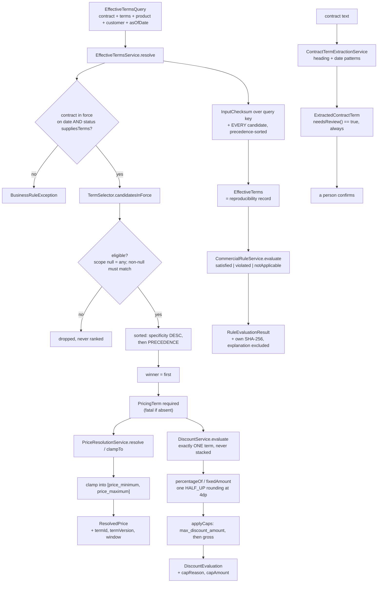
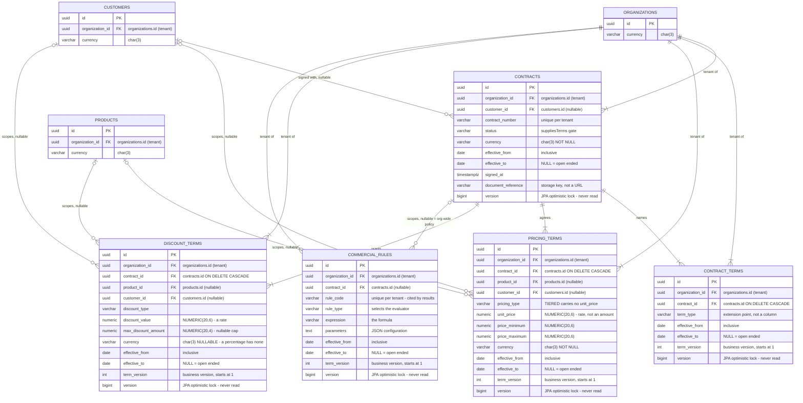

# 07 Contract — which price, which discount, on which date

> Supersedes the contract half of `02-truth-contract.md` and all of
> `12-contract-kernel-deep.md`. Every count and behavioural claim in this chapter
> was re-verified against the working tree; where those two chapters disagree with
> what is below, they are wrong and this chapter is the correction.
>
> Scope: `com.fintech.cfo.contract.**` — **55 files, 50 built, 5 stub** — plus
> `V5__create_contracts.sql` and 2 test classes. Reconcile with:
> `Get-ChildItem -Recurse src\main\java\com\fintech\cfo\contract`.
>
> The stale figures this replaces: `02-truth-contract.md` C says
> `contract/service 11 | contract/model 13 | contract/enums 8 | contract/dto 14 |
> contract/extraction 4` — 50 files, and it omits `controller` (2) and
> `repository` (3) entirely, so its table silently under-reports the module by
> five stub files. `docs/code-flow/README.md` §3 says `contract 51 (46+5STUB)`;
> the real count is 55 (50 built, 5 stub). `12-contract-kernel-deep.md` §3d
> describes a `DateRange` with a mandatory end date and a `days()` method; the
> type actually in use is `EffectiveWindow`, which permits a null end and has no
> `days()`.

---

## A. WHY this module exists

A contract does not state one price. It states a *published default* price, and
then a series of exceptions to it — a negotiated rate for one customer, a floor
and a ceiling for one product, a promotional discount that was replaced by a
better one on the first of April — and every one of those exceptions has its own
start date, its own end date and its own version. An invoice arrives stamped
with a date, and someone has to answer: **on this date, for this product, for
this customer, what did the parties agree?** Picking the wrong row does not
produce a visible error. It produces a plausible number on an invoice, and the
number is wrong in the direction that a customer will eventually notice.

The bad outcomes this module exists to make impossible:

- **A default where a negotiated rate existed.** A bespoke price silently reverts
  to list, the customer is overcharged, and the first sign is a dispute.
- **A price for a date nothing covered.** A zero is a defensible charge for a
  free item and an indefensible accident for a missing row; both render as `0.0000`.
- **A discount larger than the invoice it discounts.** The payable becomes a
  document the supplier owes money on.
- **A figure that cannot be re-derived.** A calculation run in March and
  re-checked in November must reach the same number. That is impossible if the
  resolver reads a clock, or orders on a column that an unrelated `UPDATE` moves.
- **A cross-currency number that no one can reproduce.** There is no FX component
  in this codebase. An invented rate is an unreproducible number wearing a
  currency label.

**Hard invariants.** A future change must not break any of these.

1. **The as-of date is always an argument.** No method in this module reads a
   clock. There is no `LocalDate.now()` anywhere in the 55 files.
2. **A missing price is fatal; a missing discount is not.** There is no defensible
   default for a price. Most invoices legitimately carry no discount, so a missing
   discount yields an explicit zero-with-no-term result, never an error.
3. **Specificity is ranked before version.** A negotiated rate for this customer
   beats a published default at any `term_version`.
4. **Effective windows are inclusive on both ends.** The first and last day of a
   term are both days the term is in force.
5. **`version` (the optimistic lock) is never an ordering key.** Only business
   columns decide which term wins.
6. **No FX anywhere.** A currency mismatch is refused, naming both currencies.
7. **Every result carries the term id, `term_version` and window it came from**,
   plus a SHA-256 input checksum over the canonical form of every candidate
   considered — not just the winner.
8. **Rounding happens exactly once per value, at hand-out**, `HALF_UP`, at the
   scale of the V5 column the value would persist to: `NUMERIC(20,6)` for prices,
   `NUMERIC(20,4)` for amounts.
9. **A rule expression is a closed grammar.** No `eval`, no reflection, no
   dispatch on authored text. Anything outside the grammar is refused when read.
10. **A clause read out of a document is a proposal, never a term.** Human review
    is mandatory, not optional.

---

## B. FLOW — the runtime journey

There is no entry point yet. Both controllers are stubs, so the journey below is
reached by a test or by a future caller, not by an HTTP call today.



### The pricing path, step by step

1. **Trigger** — a caller holding an `EffectiveTermsQuery` (today: a unit test;
   tomorrow: a controller or the truth engine). **Where** —
   `EffectiveTermsService.resolve(EffectiveTermsQuery)`,
   `service/EffectiveTermsService.java:68`. **What it does** — validates the
   contract, resolves every term kind, computes the input checksum. **Why** — one
   entry point means the checksum, the winners and the losers are produced
   together and cannot disagree.

2. **Trigger** — always, first thing. **Where** — `EffectiveTermResolver.requireContractInForce`,
   `service/EffectiveTermResolver.java:163`. **What it does** — two independent
   checks: the contract's own window covers the date, and
   `ContractStatus.suppliesTerms()` is true. **Why separately** — "out of date"
   and "out of standing" are different problems with different fixes, and a
   `SUSPENDED` contract sitting inside its own window is the case most likely to
   be mistaken for a valid one. `EXPIRED` is deliberately *allowed*: its terms
   genuinely did apply, and excluding it would make past figures unreproducible
   the moment a contract lapsed.

3. **Trigger** — resolution of the price line. **Where** — `TermSelector.candidatesInForce`,
   `service/TermSelector.java:52`. **What it does** — filters by effective window,
   then by product/customer eligibility, then sorts by specificity and version. **Why
   filter before rank** — a row scoped to another customer's deal is not "nearly
   applicable", it is about someone else. Dropping it outright means a version-9
   foreign row can never win.

4. **Trigger** — no candidate left. **Where** —
   `EffectiveTermsService.requirePricingTerm`, `service/EffectiveTermsService.java:113`.
   **What it does** — throws `BusinessRuleException`. **Why fatal** — there is no
   correct default price. Zero understates revenue; a remembered last price
   silently applies terms from a date nobody asked about.

5. **Trigger** — a price is needed. **Where** —
   `PriceResolutionService.resolve(term, currency, asOfDate)`,
   `service/PriceResolutionService.java:61`. **What it does** — rejects a row with
   neither a price nor bounds, normalises to 6 dp, clamps into
   `[price_minimum, price_maximum]`, returns `ResolvedPrice` carrying the
   originating `pricing_terms.id`, `term_version` and window. **Why** — the result
   is evidence, not just a number.

6. **Trigger** — a caller already has a candidate price (a negotiated or imported
   one). **Where** — `PriceResolutionService.clampTo(term, offeredPrice, currency, asOfDate)`,
   `service/PriceResolutionService.java:116`. **What it does** — refuses unless
   `PricingType.acceptsCandidatePrice()` is true *and* the offered price is in the
   contract currency, then clamps. **Why clamp rather than default** — see D.5.

7. **Trigger** — a discount is needed. **Where** —
   `DiscountService.evaluate(gross, term, asOfDate)`,
   `service/DiscountService.java:104`. **What it does** — selects exactly one term
   (never compounds), computes the grant, applies two ceilings in order, derives
   net from the *capped* grant. **Why one term** — V5 has no stacking flag, no
   compounding flag and no ordering between discount rows. "Apply all applicable
   discounts in order" would be an invention of this code, not something the data
   says.

8. **Trigger** — every resolution, always. **Where** — `EffectiveTermsService.checksum`,
   `service/EffectiveTermsService.java:129`. **What it does** — hashes the query
   key first, then every candidate row, each labelled and sorted into
   `EffectiveTermResolver.precedence()`. **Why the candidates and not the winner** —
   see D.4.

9. **Trigger** — a transaction is to be checked against contract rules. **Where** —
   `CommercialRuleService.evaluate(rules, context)`,
   `service/CommercialRuleService.java:74`. **What it does** — evaluates each rule
   in the caller's order into a three-state result. **Why three states** — a rule
   that could not run is not a rule that passed. Collapsing "no gross amount was
   supplied" into "minimum charge passed" turns an assurance gap into a false
   attestation.

10. **Trigger** — a contract document needs to become terms. **Where** —
    `ContractTermExtractionService.extract(contractId, documentText)`,
    `extraction/ContractTermExtractionService.java:97`. **What it does** — matches
    whole lines against a heading pattern and a three-format date scanner, and
    returns *proposals*. **Why** — a clause has to be a line of its own; a
    heading embedded in a sentence is not read, because a false positive becomes
    a payment term applied to the wrong dates.

### `[PLANNED]` — stages designed but not executable

- `[PLANNED]` **HTTP entry.** `controller/ContractController` and
  `controller/ContractTermController` are empty shells. See section C.
- `[PLANNED]` **Persistence.** `repository/ContractRepository`,
  `repository/ContractTermRepository` and `repository/CommercialRuleRepository`
  are empty shells. Every service takes its term collections as arguments and
  queries nothing, so persistence is an additive change.
- `[PLANNED]` **A document-interpreting extractor.** `extraction/ContractTermExtractor`
  is the port; only the deterministic regex implementation exists. A model-backed
  adapter is deliberately absent so nothing in the pricing path can depend on a
  model being reachable.

### Schema reference — V5 entity-relationship diagram

This diagram shows the five tables V5 defines, plus the two V4 tables the term
tables reference. It is reference only: every service in this module takes its
term collections as constructor arguments and queries nothing, so no runtime path
in the module reads these rows. The annotations record the deliberate
bitemporal shape (`term_version` versus `version`), the nullable specificity
columns the resolver ranks on, and the two places where scale is deliberately
not the money scale.



**How to read the diagram.** `contracts` is the root of the module: it owns four
child tables and every one of those children cascades on delete, so removing a
contract removes its commercial terms with it. The four term tables deliberately
carry **no unique constraint**. That is the central schema decision of this
module — a general discount and a product-specific discount legitimately apply to
the same contract over the same window, and the resolver layers them by
specificity in memory rather than preventing the overlap in the database. Section
D.1 is the ranking that this permissiveness depends on.

**Specificity is expressed by nullability, not by a column.** `product_id` and
`customer_id` are both nullable on `pricing_terms` and `discount_terms`, and each
row's scope is read from which of them is populated. The resolver's precedence
order is therefore reading column nullability, which is why section D.1 ranks
before it reads a value.

**Two version columns that must never be confused.** `term_version` is an `INT`
business version, starts at `1`, and is quoted verbatim in an audit answer — it
names the exact wording a stored calculation was evaluated against. `version` is
a `BIGINT` JPA optimistic-lock counter that defaults to `0` and must never be read
by business logic. Every row above annotates both for exactly this reason; section
E.15 covers the mistake of reading `version` as a business version.

**Important constraints:**

- `ck_contracts_range CHECK (effective_to IS NULL OR effective_to >= effective_from)` and the identical `ck_contract_terms_range` — a contract that expires before it starts is a data error that would silently exclude every date from every term lookup consulting it.
- `ux_contracts_org_number (organization_id, contract_number)` — contract numbering conventions are per customer, so numbers are tenant-scoped rather than globally unique.
- `ix_pricing_terms_lookup` and `ix_discount_terms_lookup` on `(organization_id, contract_id, product_id, effective_from, effective_to)` — the whole resolution predicate is in the key in predicate order, so the hot path is a single index scan rather than a scan of the contract's terms filtered in memory.
- `ux_commercial_rules_org_code (organization_id, rule_code)` — `rule_code` is what a calculation result cites when it explains which rule produced a variance, so it is unique per tenant and stable. Global uniqueness would make an identical policy in two tenants a migration.
- `ON DELETE CASCADE` on every `organization_id` FK — no orphaned tenant rows when an organization is removed.

**Scale is deliberately not uniform.** `unit_price`, `price_minimum`,
`price_maximum` and `discount_value` are `NUMERIC(20,6)`, while
`max_discount_amount` is `NUMERIC(20,4)` like every other payable amount. A unit
rate or a percentage is a rate, not a payable, and legitimately carries more
precision than the amounts computed from it. `discount_terms.currency` is
nullable — the only nullable money-adjacent currency in the schema — because a
percentage discount has no currency, and forcing one would require inventing a
currency for a rate that has none. Section D.9 covers where the currency refusal
actually happens, and why there is no FX anywhere in this module.

---

## C. FILES — every file in the module

**55 files: 50 built, 5 stub.** Counted with
`Get-ChildItem -Recurse src\main\java\com\fintech\cfo\contract`:
controller 2, dto 14, enums 8, extraction 4, model 13, repository 3, service 11.
(All 55 rows appear below, one per file. The two test files and the migration
are in the "related files outside the module" table at the end of this section,
so their `STUB` status is not part of the 5.)

| file | status | what it is for | key methods / lines |
|---|---|---|---|
| `controller/ContractController.java` | `STUB` | Empty shell. Belongs here: `GET /api/contracts/{id}`, `GET /api/contracts/{id}/terms?asOf=`, and a resolve endpoint returning `ContractResponse` + `EffectiveTerms` wrapped in `ApiResponse`. Scope must come from `SecurityContext`, never a request parameter. | class body L9-11 |
| `controller/ContractTermController.java` | `STUB` | Empty shell. Belongs here: CRUD for narrative clauses plus the extraction-confirmation endpoint that promotes an `ExtractedContractTerm` into a stored `ContractTerm` — the human step that D.8 makes mandatory. | class body L9-11 |
| `dto/CommercialEvaluationContext.java` | `BUILT` | The transaction facts a rule is checked against. Only `asOfDate` and `currency` are required; every other input is nullable *by design*, because absence is what makes a rule not-applicable rather than failed. | `isInCurrency` L82; `forInvoice` L50 |
| `dto/CommercialRuleEvaluation.java` | `BUILT` | A whole rule set evaluated against one transaction, in a fixed order so two runs compare field by field. | `isSatisfied` L30; `violations` L37; `notApplicable` L49; `requiresApproval` L60; `isViolated` L69 |
| `dto/CommercialRuleResponse.java` | `BUILT` | Wire form of a rule. Serves the authored `expression` verbatim and derives `requiredParameter`/`parameterKind` from the type so a client need not hard-code the mapping. | `from` L50, L54 |
| `dto/ContractResponse.java` | `BUILT` | Wire form of a contract. Closed sets travel as their V5 code strings, never as serialised enum objects. | `from` L41, L48 |
| `dto/ContractTermResponse.java` | `BUILT` | Wire form of a narrative clause. Exposes the window as two dates plus `openEnded` so a client need not infer the third from a null. | `from` L36, L40; `covers` L51 |
| `dto/DiscountCapReason.java` | `BUILT` | *Why* a discount was reduced: `NONE`, `MAX_DISCOUNT_AMOUNT`, `GROSS_AMOUNT_LIMIT`. The two caps mean different things to finance and must not be collapsed. | `fromCode` L69; `isCapped` L85 |
| `dto/DiscountEvaluation.java` | `BUILT` | The outcome of applying a discount. The absence of a discount is a *result* (`none`, term id null, term version 0), not an omission. | `none` L78; `hasDiscountTerm` L84; `wasCapped` L88 |
| `dto/DiscountTermResponse.java` | `BUILT` | Wire form of a discount line. `discountValue` is served raw, not rescaled into a percentage string, so the audit re-read still matches the stored row. | `from` L46, L50; `isContractWide` L58 |
| `dto/EffectiveTerms.java` | `BUILT` | The reproducibility record: the whole in-force set, not just the winners, in precedence order, plus `inputChecksum`. | `contractTerm` L62; `hasDiscountTerm` L67 |
| `dto/EffectiveTermsQuery.java` | `BUILT` | The whole question in one value, so the question and therefore the checksum have one unambiguous shape. Null collections normalise to empty. | `forContract` L54; `queryKey` L63 |
| `dto/PricingTermResponse.java` | `BUILT` | Wire form of a price line. Bounds travel with the price — a client that had to ask separately could not display whether a price was clamped. | `from` L43, L47; `publishesPrice` L59 |
| `dto/ResolvedPrice.java` | `BUILT` | What to charge *plus* what the contract published, so an investigator can see the two diverged and by how much. | `clampedAmount` L65 |
| `dto/RuleEvaluationResult.java` | `BUILT` | One rule's outcome, three-state, with a SHA-256 computed by the factory from the fields it is stored beside — so it cannot drift from what it attests to. | ctor guard L61-67; `checksum` L107 |
| `dto/package-info.java` | `BUILT` | `@NullMarked` for the package; states the money rule in prose. | L9 |
| `enums/CodedEnum.java` | `BUILT` | The contract every closed set in this package honours: one code per variant, resolution from a stored string without reflection, and a loud failure on an unknown code. | `normalise` L38; `requireColumnWidth` L54 |
| `enums/CommercialRuleType.java` | `BUILT` | Eight rule kinds. Each names the one `parameters` key it cannot be evaluated without and how that key must be read. | `all` L44; `ParameterKind` L53; `readsExpression` L136; `requiredParameter` L120 |
| `enums/ContractStatus.java` | `BUILT` | Eight lifecycle states. `suppliesTerms()` is the predicate that answers whether a date-valid contract may still price anything. | `all` L34; `fromCode` L44; `suppliesTerms` L67 |
| `enums/ContractTermType.java` | `BUILT` | Eight clause kinds for narrative obligations. Carries obligations, not money; never evaluated arithmetically. | `all` L37; `fromCode` L47 |
| `enums/DiscountType.java` | `BUILT` | `PERCENTAGE` or `FIXED_AMOUNT` — the single fact that decides the *unit* of `discount_value`, which is otherwise not self-describing. | `all` L36; `isMonetary` L61; `isPercentageValid` L72 |
| `enums/PricingType.java` | `BUILT` | Four pricing bases. Decides where the authoritative unit price comes from, which the schema cannot express. | `all` L33; `publishesItsOwnPrice` L60; `acceptsCandidatePrice` L73 |
| `enums/ReviewStatus.java` | `BUILT` | Six approval states for a *proposed* term. `isPromotable()` is true for `APPROVED` alone. | `all` L35; `isPromotable` L63 |
| `enums/package-info.java` | `BUILT` | `@NullMarked`; records that each set is sealed so adding a variant is a compile-time question. | L9 |
| `extraction/ContractTermExtractionService.java` | `BUILT` | The deterministic heuristic reader. Whole-line heading match plus a three-format date scanner, returning proposals. | constants L48-61; `extract` L97; `clause` L135; `readDates` L166 |
| `extraction/ContractTermExtractor.java` | `BUILT` | The port, declared here in the consumer. Two properties every implementation owes: nothing is trusted, nothing is silent. | `extract` L40 |
| `extraction/ExtractedContractTerm.java` | `BUILT` | A clause candidate. Separate from `ContractTerm` on purpose, because "we could not read this" and "this says nothing" must be distinguishable. | `isUsable` L64; `needsReview` L72 |
| `extraction/package-info.java` | `BUILT` | `@NullMarked`; states that extraction is a pure transformation that trusts nothing. | L9 |
| `model/CanonicalForm.java` | `BUILT` | ⚠ **Dead code.** A near-exact earlier duplicate of `CanonicalText` with **zero callers**. Kept only because this slice is documentation-only. See E.1. | `join` L66; `escape` L77 |
| `model/CanonicalText.java` | `BUILT` | The canonical, order-independent text form of a term row. Package-private: the format exists only to feed the input checksum. | `NULL` L27; `money` L63; `join` L71; `escape` L85 |
| `model/CommercialRule.java` | `BUILT` | Mirror of a `commercial_rules` row. Keeps the authored `expression` verbatim and never executes it as text. | `isOrganizationWide` L89; `compiledExpression` L104; `canonical` L119 |
| `model/CommercialRuleParameters.java` | `BUILT` | Typed view over the unstructured `parameters TEXT` column. Shape checked at parse time, applicability at evaluation time — deliberately split. | ctor L54; `parse` L91; `requireDecimal` L151; `canonical` L207 |
| `model/Contract.java` | `BUILT` | Mirror of a `contracts` row. Also the module's text-validation helper (`requireText`, `requireOptionalText`) and the home of `canSupplyTermsOn`. | `of` L76; `effectiveWindow` L82; `canSupplyTermsOn` L98; `canonical` L106 |
| `model/ContractTerm.java` | `BUILT` | Mirror of a `contract_terms` row. Carries no money, but is versioned so a calculation can name the generation it read. | `MIN_TERM_VERSION` L37; `canonical` L74 |
| `model/DiscountTerm.java` | `BUILT` | Mirror of a `discount_terms` row. The unit of `discountValue` is decided entirely by `DiscountType`; a fixed amount additionally requires a currency. | ctor guards L65-84; `fixedDiscountAmount` L109; `canonical` L117 |
| `model/EffectiveWindow.java` | `BUILT` | The `effective_from`/`effective_to` pair shared by every V5 table in as-of resolution. Inclusive on both ends; a null end is open-ended, not a sentinel. | ctor L32; `contains` L76; `intersects` L93; `canonical` L110 |
| `model/PricingTerm.java` | `BUILT` | Mirror of a `pricing_terms` row. Enforces same-currency on all three money components, `min <= max`, and non-negativity — each of which silently changes a monetary result if it slips. | ctor L53; `isContractWide` L97; `publishesPrice` L106; `canonical` L111 |
| `model/RuleExpression.java` | `BUILT` | A commercial-rule expression: a bounded, sealed tree with an exhaustive `switch` evaluator. No `eval`, no reflection, no string dispatch. | bounds L60-71; `parse` L92; `evaluate` L135; `Node` L165; `Parser` L327 |
| `model/ScopedTerm.java` | `BUILT` | A term that may be scoped to a product and/or a customer. A null scope column means "any". | L16-23 |
| `model/VersionedTerm.java` | `BUILT` | The shape every as-of-resolved row shares, so one resolver serves four tables instead of four copies that could drift. | `effectiveFrom` L32; `canonical` L46 |
| `model/package-info.java` | `BUILT` | `@NullMarked`; states that these are plain records, deliberately not JPA entities. | L9 |
| `repository/CommercialRuleRepository.java` | `STUB` | Empty shell. Belongs here: a tenant-scoped `findByContractId` / `findOrganizationWide`, each filtering `organization_id` and returning domain records, never entities. | class body L9-11 |
| `repository/ContractRepository.java` | `STUB` | Empty shell. Belongs here: tenant-scoped lookup by id and by `contractNumber`, plus an as-of-date query matching `ix_contracts_org_dates`. | class body L9-11 |
| `repository/ContractTermRepository.java` | `STUB` | Empty shell. Belongs here: `findByContractIdAndTermType` matching `ix_contract_terms_contract`. Note there is deliberately **no** `PricingTermRepository` or `DiscountTermRepository`; if the query count grows, ports belong here per rule 11. | class body L9-11 |
| `service/CommercialRuleService.java` | `BUILT` | Checks a transaction against rules in force, into three states. Exhaustive `switch` over `CommercialRuleType`. | `evaluate` L74, L92, L105; `threshold` L255; `requireCurrency` L266 |
| `service/ContractService.java` | `BUILT` | The façade a caller actually holds: select term, resolve price, apply discount, produce the reproducibility record. Stateless. | ctors L52, L62; `pricingTermInForce` L77; `resolveUnitPrice` L141 |
| `service/ContractTermService.java` | `BUILT` | Resolution of narrative clauses by type and date. ⚠ Overlaps `ContractService.contractTermInForce` — see E.2. | `contractTermInForce` L33; `contractTermsInForce` L48 |
| `service/DiscountService.java` | `BUILT` | Applies the discount in force: one term, one rounding, two ceilings. | `evaluateFor` L92; `evaluate` L104; `percentageOf` L173; `applyCaps` L207 |
| `service/EffectiveTermResolver.java` | `BUILT` | Answers "which version of a term was in force on this date?" with a total order derived only from stored business columns. | `PRECEDENCE` L65; `precedence` L87; `inForceOn` L97, L106; `requireContractInForce` L163 |
| `service/EffectiveTermsService.java` | `BUILT` | The module's one end-to-end question, and the input checksum that makes its answer provable. | `resolve` L68; `resolvePrice` L96; `requirePricingTerm` L113; `checksum` L129 |
| `service/InputChecksum.java` | `BUILT` | Builds the stable digest. Order-independent by construction; labels are part of the digest. | `of` L46; `ofValue` L65; `Group` L85; `ofTerms` L98 |
| `service/MonetaryScale.java` | `BUILT` | The single declaration of this module's scale and rounding policy, and the trade-offs behind `HALF_UP`. | `PRICE_SCALE` L42; `AMOUNT_SCALE` L48; `WORKING_PRECISION` L58; `ROUNDING_MODE` L63 |
| `service/PriceResolutionService.java` | `BUILT` | Turns "what is this worth on this date" into one number, with the reasoning attached. | `resolve` L61; `clampTo` L116; `resolveFor` L146; `resolveAll` L160; `clamp` L172 |
| `service/TermSelector.java` | `BUILT` | Chooses between rows that compete for the same contract, date, product and customer. Eligibility, then specificity, then version. | `candidatesInForce` L52; `selectInForce` L72; `bySpecificityThenVersion` L77; `specificity` L96 |
| `service/package-info.java` | `BUILT` | `@NullMarked`; states there are no Spring stereotypes, no repository and no clock. | L9 |

### Related files outside the module

| file | status | what it is for |
|---|---|---|
| `src/main/resources/db/migration/V5__create_contracts.sql` | `MIGRATION` | The five tables this module mirrors: `contracts`, `contract_terms`, `pricing_terms`, `discount_terms`, `commercial_rules`. `ck_contracts_range` and `ck_contract_terms_range` are the only range constraints. `ux_contracts_org_number` and `ux_commercial_rules_org_code` are tenant-scoped. There is deliberately **no** unique constraint on any term table, because terms legitimately overlap and the resolver layers them. |
| `src/test/java/com/fintech/cfo/contract/ContractServiceTest.java` | `TEST` | 47 tests, all passing, in 5 nested classes. |
| `src/test/java/com/fintech/cfo/contract/CommercialRuleServiceTest.java` | `STUB` | 31-line placeholder with **zero** `@Test` methods. The Javadoc states what it must cover. |

---

## D. DEEP DIVE — method by method

### D.1 The term-precedence model

#### `EffectiveTermResolver.PRECEDENCE` — `service/EffectiveTermResolver.java:65-80`

```java
private static final Comparator<VersionedTerm> PRECEDENCE = Comparator
        .comparingInt(VersionedTerm::termVersion).reversed()
        .thenComparing(term -> term.effectiveWindow().effectiveFrom(), Comparator.reverseOrder())
        .thenComparing(term -> term.effectiveWindow().effectiveTo(),
                Comparator.nullsLast(Comparator.reverseOrder()))
        .thenComparing(VersionedTerm::id);
```

**What it returns** — a total order on any `VersionedTerm`, highest precedence
first. `precedence()` (L87) re-exposes it so `TermSelector` and
`EffectiveTermsService.appendAll` apply *exactly* the same rule rather than
re-deriving it. That single expression is the module's contract with every stored
calculation: change a clause of it and every historical checksum becomes
unverifiable.

**Clause by clause, with the reason it exists:**

| # | clause | WHY |
|---|---|---|
| 1 | `comparingInt(VersionedTerm::termVersion).reversed()` | This is the business rule: a later amendment supersedes the term it amends. `reversed()` because the list is consumed first-wins and version 9 must sort *above* version 1. |
| 2 | `thenComparing(…effectiveFrom(), Comparator.reverseOrder())` | At equal version, the more recently started window is the correcting one — this is what a back-dated restatement looks like. Without it, a wide original window opened in January would keep beating the June correction that was written to fix it. |
| 3 | `thenComparing(…effectiveTo(), Comparator.nullsLast(Comparator.reverseOrder()))` | At equal version and equal start, the *narrower* window is the more specific statement, so the earliest end wins. The reversal and the `nullsLast` are both load-bearing. |
| 4 | `thenComparing(VersionedTerm::id)` | The last resort. Two rows sharing version, start and end are data corruption, not a modelling case. The resolver still returns a stable, reproducible answer rather than throwing, because a duplicated clause should reach a human as a *discrepancy*, not as an outage. Callers who want the whole picture call `inForceOn` and see both rows. |

**Why `nullsLast` is required for totality.** Clause 3 reads a nullable
`effectiveTo`. `Comparator.reverseOrder()` on its own throws
`NullPointerException` when it meets a null; `Comparator.nullsLast` wraps it so
nulls sort after every non-null and the comparator never throws, whatever the
rows. Combined with `reverseOrder`, that yields exactly the intended reading: a
bounded end sorts *ahead of* every open end, so a bounded correction displaces
the open-ended original, while two open-ended rows at equal version and start
fall through to clause 4. Without the wrapper, a single open-ended price line —
the *common* case — would make this comparator non-total on a real contract, and
two runs over the same rows could order them differently, which is precisely
what an input checksum cannot tolerate.

**Why `version` is deliberately absent.** `version` is the V5 optimistic-lock
column, a row *write* counter. It is not a commercial fact. If it were in the
comparator, then an unrelated `UPDATE` — a re-save from an admin screen, a
`@Version` bump from a no-op field write, a backfill touching `updated_at` —
would change which term a historical calculation resolves to. The stored figure
would silently change meaning while every version number still looked correct.
`term_version` is the only version column allowed to order anything, and
`VersionedTerm`'s own javadoc (L14-17) records the split.

**What breaks if you "simplify" it** — remove clause 1 and amendments stop
superseding; remove clause 2 and back-dated restatements never take effect;
remove clause 3 or replace `nullsLast` with a plain reverse and open-ended terms
throw; add `version` and a concurrent write rewrites history.

#### `inForceOn(List<T>, LocalDate)` and `inForceOn(List<T>, LocalDate, Predicate<T>)` — L97, L106

**Returns** — every term covering the date and satisfying the predicate, in
precedence order. Sorted, not merely filtered, so a caller can see the *losing*
candidates of a tie-break, and because `InputChecksum` hashes this exact
ordering.

**Step by step** (L110-121):

1. `Objects.requireNonNull` on all three arguments — a null list is a caller bug,
   not an empty commercial position.
2. `.filter(Objects::nonNull)` — nulls are dropped **before** the predicate runs,
   so a caller-supplied predicate is never handed a null and cannot NPE on a
   sparse list.
3. `.filter(term -> term.effectiveWindow().contains(asOfDate))` — the single
   definition of "in force" lives in `EffectiveWindow`, so the inclusive
   boundary rule cannot differ between entry points.
4. `.filter(candidate)` — scope eligibility.
5. `.sorted(PRECEDENCE)` then `.toList()`.

#### `findInForce` L128-135, `requireInForce` L148-151, `requireContractInForce` L163, `isInForce` L187

`findInForce` is `inForceOn(...).stream().findFirst()` — `Optional.empty()` is a
legitimate answer and is never replaced by a default. `requireInForce` wraps it in
`orElseThrow` with a `subject` string used only in the message; it is used
wherever continuing would mean inventing a commercial term. `requireContractInForce`
adds the two independent contract-level checks described in B step 2, and echoes
the window in canonical form (`EffectiveWindow.canonical()`) so an operator can
see the dates that excluded the request without re-reading the row.

#### `TermSelector.specificity` — `service/TermSelector.java:96`

```java
if (productSpecific && customerSpecific) return 3;
if (productSpecific)                  return 2;
if (customerSpecific)                 return 1;
return 0;
```

`productSpecific` is `term.productId() != null && term.productId().equals(productId)`.
A row that scored 0 by reaching here is a contract-wide default — an ineligible
row never reaches the sort at all, because `isEligibleForProduct` /
`isEligibleForCustomer` already dropped it.

**WHY `equals` and not `==` on UUID** — a UUID read from a database and a UUID
parsed from a request are different objects. Identity comparison would silently
treat a matching product as "not this product" and quietly fall back to the
published default, which is the exact failure this module exists to prevent.

**The subtlety at L126-131** — a request with a **null `customerId`** (a
contract-wide question) makes every customer-scoped row ineligible. That is
correct and deliberate: a rate negotiated with one customer is not a published
price for the tenant. It does mean `candidatesInForce(terms, product, null, date)`
and `candidatesInForce(terms, product, customer, date)` can return different
sets, which is why `queryKey()` includes both ids.

#### `TermSelector.candidatesInForce` / `selectInForce` / `bySpecificityThenVersion` — L52, L72, L77

```java
return Comparator.comparingInt((T term) -> -specificity(term, productId, customerId))
        .thenComparing(EffectiveTermResolver.precedence());
```

**WHY specificity is sorted BEFORE version — the central ordering decision.**
`Comparator.thenComparing` applies clauses left to right, and the leftmost
non-tied clause decides. Putting specificity first means a negotiated
`term_version 1` customer rate beats a published `term_version 5` default. That
is the business intent: the bespoke rate exists precisely to override the
published one. Reverse the two clauses and the moment anyone amends the default
— which is routine, and happens on the *default* row, not the bespoke one — the
negotiated price silently reverts to list, on every invoice for that customer,
with no error anywhere. The cost of this choice is that a version-1 bespoke row
outranks a version-5 *same-scope* row; but within one scope, the version
tie-break still applies, so an amended bespoke row still supersedes its own
predecessor. The trade is: scope identity is trusted more than recency, because
recency on a different-scope row is a *different* kind of edit.

The `-` on `specificity(...)` negates so that "most specific" sorts first under
an otherwise ascending comparator. Delegating the second clause to
`EffectiveTermResolver.precedence()` rather than re-implementing it is what keeps
the version tie-break identical to the one used for unscoped terms — one rule,
one place, and the checksum and the selector can never disagree.

---

### D.2 Effective dating — `model/EffectiveWindow.java`

```java
public record EffectiveWindow(LocalDate effectiveFrom, @Nullable LocalDate effectiveTo)
```

**Why this type and not `shared.domain.DateRange`.** `DateRange` rejects a null
end date. In V5 an open-ended term is both legal and the *normal* case: a price
agreed "from 1 April 2024, no end date" is `effective_to IS NULL`. A sentinel
date would have to be invented, and every invented sentinel eventually gets
compared against a real date in a report. The module chose the nullable column
over a fake bound.

#### `contains(LocalDate date)` — L76-87

**Returns** — `true` when the date is in force. `Objects.requireNonNull(date)`.

1. `date.isBefore(effectiveFrom)` → `false`. There is **no tolerance band**: a
   term that starts tomorrow does not apply today, and a grace period would be a
   business decision this type has no column for.
2. `return effectiveTo == null || !date.isAfter(effectiveTo)`.

**A null end means "open-ended from the start forward"**, i.e. it covers every
date from `effectiveFrom` onwards, forever. That is the honest reading of an
absent bound, and it is why `isOpenEnded()` exists as a first-class question:
`PricingTermResponse.openEnded` and `ContractResponse.openEnded` are both
derived from it, so a client never has to infer "never ends" from a null.

#### `intersects(EffectiveWindow other)` — L93-101

**Returns** — whether the two windows share at least one business date.

1. `if (this.effectiveTo != null && this.effectiveTo.isBefore(other.effectiveFrom)) return false;`
2. `return other.effectiveTo == null || !other.effectiveTo.isBefore(this.effectiveFrom);`

Used to *explain* an overlap, not to resolve one — resolution is the resolver's
job. It is inclusive on both sides, consistent with `contains`, so a window that
ends on the day another begins **does** intersect, on that one day.

#### Boundary-day behaviour — the rule everything else depends on

**Both ends are inclusive.** A term with `effective_to = 2026-03-31` still
applies to an invoice dated 2026-03-31. So for `EffectiveWindow.of(2026-01-01,
2026-03-31)`:

| date | in force? |
|---|---|
| 2025-12-31 | no — before the start |
| **2026-01-01** | **yes — the first day** |
| 2026-02-15 | yes |
| **2026-03-31** | **yes — the last day** |
| 2026-04-01 | no — one day past the end |

**WHY inclusive beats half-open.** The half-open convention common in accounting
systems (`[from, to)`) drops the last day of every price. That is not a small
error: it silently removes a day of validity from every price, discount and
clause the system has ever held, and a dropped day is *invisible* — there is no
row to inspect and nothing to reconcile against. The inclusive convention can
produce a duplicated day instead, when a superseding window's `effective_from`
equals its predecessor's `effective_to`; but a duplicate is **visible** — both
rows appear in `inForceOn`, and the documented `PRECEDENCE` decides between them
deterministically. A visible, decidable problem is strictly better than an
invisible one. (The half-open choice would be defensible if the schema said
"exclusive end", but V5's `ck_contracts_range` constraint is
`effective_to >= effective_from` — inclusive by construction.)

`Contract` and `ContractTerm` both enforce the same rule in their compact
constructors, so an invalid window cannot be constructed in memory either
(`Contract.java:64-66`, `ContractTerm` via `EffectiveWindow`'s own guard).

#### `canonical()` — L110-112

`effectiveFrom + ".." + (effectiveTo == null ? "open" : effectiveTo.toString())`.
Rendered here rather than delegated to `toString()` so that **improving a debug
message cannot change the checksum of a stored calculation**. The literal token
`open` is a second, narrower version of the `CanonicalText` null sentinel.

---

### D.3 Versioned immutability — `model/VersionedTerm.java` and `model/ContractTerm.java`

`VersionedTerm` (`L19-47`) is the shape every as-of-resolved row shares, so
`EffectiveTermResolver` — written once, generically over `<T extends VersionedTerm>` —
serves `contract_terms`, `pricing_terms`, `discount_terms` and `commercial_rules`
instead of four near-identical copies that could drift apart. It declares three
accessors (`id`, `effectiveWindow`, `termVersion`) and two derived members:

- `effectiveFrom()` (L32) is a `default` method reading through the window, so a
  term **cannot report a start date that disagrees with the window the resolver
  filters on**, and the comparator has exactly one accessor to read. `PricingTerm`
  and `DiscountTerm` also re-override it (L89, L99) — redundant but harmless, and
  it documents that the record's own component is the source.
- `canonical()` (L46) is the checksum input. Its contract is explicit: **derived
  from stored column values only**. Including a row's `updated_at` would make a
  no-op rewrite look like a commercial change; including a hash-ordered
  collection would make the checksum depend on iteration order.

#### `MIN_TERM_VERSION = 1` — `model/ContractTerm.java:37`

```java
public static final int MIN_TERM_VERSION = 1;
```

**WHY 0 is reserved.** V5 declares `term_version INT NOT NULL DEFAULT 1`, so 0
cannot occur in a stored row. Every term record rejects `termVersion < 1` in its
compact constructor (`ContractTerm.java:51`, `PricingTerm.java:60`,
`DiscountTerm.java:59`, `CommercialRule.java:62`). Reserving 0 keeps it available
as the **"no term applied" sentinel** — and it is used that way: a missing
discount produces `DiscountEvaluation.none(...)` with `termVersion == 0` and
`discountTermId == null` (`dto/DiscountEvaluation.java:78-82`). Without the
reservation, a caller could not tell "no term applied" from "a term at version
zero was applied", and the version column — which exists to be evidence — would
be ambiguous at exactly the point where evidence matters.

**The trade-off** — a caller who wants to express "the first version" must write
`1`, not `0`, and a zero-based counter is unavailable. The alternative (allowing
0) would force the sentinel to be something like `-1` or a UUID null-check on
every reader, and would put a value into an audit answer that the database can
never hold. V5's own comment on the column says the same thing: it "starts at 1
rather than 0 because 1 reads as 'the first version' in an audit answer".

#### Why `compiledExpression()` does not cache a parse tree inside a record

`model/CommercialRule.java:104-116`:

```java
public RuleExpression compiledExpression() {
    if (this.expression == null) {
        throw new ValidationException("rule " + this.ruleCode + " has no expression to evaluate");
    }
    return RuleExpression.parse(this.expression);
}
```

**Null is refused, not treated as an empty expression.** An absent expression on
an `EXPRESSION_THRESHOLD` rule is a misconfigured rule. Evaluating it as nothing
would yield a threshold of zero, which then *fails every transaction the rule was
written to protect* while looking like a real rule — the module's stated worst
outcome for a degraded rule (see `RuleExpression.evaluate`'s javadoc, L130-133).

**WHY no cache.** The parse runs on every call. A `RuleExpression` is a
**final class holding a mutable parse tree**, and `CommercialRule` is a
**record** whose `equals`/`hashCode` are derived from its components. Hanging a
lazily-populated memo field off a record would make `equals` and `hashCode`
depend on *parse history* — two structurally identical rules would compare
unequal if one had been evaluated and the other had not. The input checksum
(`EffectiveTermsService.checksum` → `VersionedTerm.canonical()`) and the stored
`EffectiveTerms` record both rely on value semantics, so a memo field would let a
calculation's own evidence depend on whether the object had been touched. The
trade: a few microseconds of parsing per evaluation, in exchange for a type whose
identity is purely its stored columns. A rule set is small and the cost is paid
off the pricing hot path, not per transaction.

---

### D.4 Canonical form and checksums

#### `model/CanonicalText.java` — the injectable rendering

Package-private (`L25`) on purpose: the canonical form exists only to feed the
input checksum. Exposing it on each term's public API would invite callers to
depend on a serialisation format that has no other purpose and no stability
promise.

| member | behaviour | WHY |
|---|---|---|
| `NULL = "-"` (L27) | one shared sentinel for every type | one sentinel rather than one per type keeps the rendering uniform. A value of literally `"-"` is then indistinguishable from an absent one — a **known and accepted limitation** (L35-38), and the escape step below is what keeps the collision from reaching the digest in the cases that matter. |
| `text` L40 | null **or blank** → `NULL` | a blank `description` and an absent one describe the same commercial position and must hash alike. |
| `uuid` L44, `date` L48, `instant` L52 | null → `NULL`, else `toString()` | these `toString()`s are specified by the JDK and are stable; they are not free-form text. |
| `money` L63 | `amount().toPlainString() + " " + currency.value()` — **full stored scale, no `stripTrailingZeros()`** | the scale is part of the evidence. `NUMERIC(20,6)` and `NUMERIC(20,4)` are different column contracts, and a restatement that changes only the scale is still a change worth detecting. Stripping would also make `10` and `10.000000` hash alike, hiding exactly that edit. |
| `decimal` L67 | `toPlainString()` | avoids scientific notation, which is locale- and magnitude-dependent. |
| `join` L71 | `\|` between parts, each **escaped** | see below. |
| `escape` L85 | `\`→`\\`, `\|`→`\p`, `\n`→`\n`, `\r`→`\r` | see below. |

**WHY escaping makes it a checksum rather than a decorative string.** Without
escaping, `join("a|b", "c")` and `join("a", "b|c")` both render `a|b|c` and hash
identically. A `ContractTerm.description` is free text authored by a commercial
reader and may well contain a pipe or a newline. Escaping every value before
joining makes the rendering **injective**: two different term sets cannot produce
the same string, and therefore cannot produce the same SHA-256. Without it, the
checksum would be forgeable by ordinary text — the worst possible property for
the artefact whose entire job is to prove what was evaluated.

#### `service/InputChecksum.java`

```java
public static String of(String queryKey, Group... groups)   // L46
public static String ofValue(String label, String... parts) // L65
public record Group(String label, Collection<String> canonicalValues)  // L85
```

- `of` (L46-60): requires a non-null key, prefixes `"query:" + queryKey + '\n'`
  so a query key can never be mistaken for the first group's first value,
  appends each labelled group, and returns
  `HashUtils.sha256(text.getBytes(UTF_8))` — lowercase hex, 64 characters.
  **WHY the label is inside the digest** (L54-56): moving a value from one
  labelled group to another must change the checksum even when the multiset of
  values is identical, otherwise "the same rows, relabelled" is
  indistinguishable from "the same rows".
- `Group`'s compact constructor (L87-93): null label rejected; null collection →
  empty; **nulls filtered** so "not supplied" and "supplied as null" cannot
  produce different digests for the same commercial position; values
  `sorted(Comparator.naturalOrder())` so **hash or query order cannot reach the
  digest** — a repository returning the same rows in a different order is
  describing the same commercial position, so the checksum must not move.
- `Group.ofTerms` (L98) maps each row through its own `canonical()`;
  `Group.of(label, values, renderer)` (L109) is the general form.
- `appendTo` (L114) is line-oriented: `label:`, then one value per line, then a
  terminating newline, so no two renderings can differ only by where a field
  boundary fell.

#### `EffectiveTermsService.checksum` — `service/EffectiveTermsService.java:129-157`

**WHY the query key is hashed first** (L133-135): the digest attests to *this
question over these terms*. Two runs of the identical term set on a different
date, product or customer are different questions and must not share a digest.
Hashing the key first makes that structural rather than incidental — the key is
the first line of the rendered text, so the terms cannot collide across queries
even in the astronomically unlikely event of a content collision.

**WHY the CANDIDATES and not the winner** (L136-138, and the class javadoc
L30-37). This is the module's most important checksum decision. A superseding
row that was *considered and then ignored* is a real commercial fact: it says
"at this date, on this contract, a v2 correction existed and was displaced by a
v3". Hashing only the resolved answer would let that row change nothing about
the recorded evidence — the checksum would keep matching while the data
underneath it moved, which is **precisely the failure an input checksum exists
to catch**. The decision to use the candidates is also what makes the checksum a
statement about the *decision* rather than only about the *outcome*.

Two implementation details that matter:

- `appendAll` (L149-157) sorts with `EffectiveTermResolver.precedence()` before
  hashing, so the digest depends on the commercial position rather than on the
  order the repository returned rows in.
- The `label` prefix on each line (L156) keeps the four collections from hashing
  alike when one is empty and another is not.

**Two things about this method deserve a reviewer's eye** — see E.6 and E.7.
In short: the query key is rendered twice (once into `builder`, once as
`InputChecksum.of`'s own `queryKey` argument at L146), and `contractTerms` is
hashed as the *resolved, window-filtered* list while the other three collections
are hashed as the *full supplied* lists, before scope filtering.

#### `dto/RuleEvaluationResult.checksum` — `dto/RuleEvaluationResult.java:107-126`

One field per line (`ruleCode`, `ruleType.code()`, `ruleId`, `termVersion`,
`asOfDate`, `applicable`, `satisfied`), then the parameter block, itself
line-oriented. **WHY line-oriented** — so no two renderings can differ only by
where a boundary fell, and so a parameter *value* containing a separator cannot
shift the fields after it.

**WHY the explanation is excluded from the digest** (L122-124). The explanation
is *prose derived from the fields above* — `"APPROVAL-100K: 150000.0000 vs
approval threshold 100000.0000, approval needed"`. If it were hashed, rewording
a message — a grammar fix, a currency-format change, adding the operator's name —
would change the checksum of a result that computed *identically*. That would
train reviewers to ignore checksum mismatches, and the moment a real input
change produced one they would discount it too. The digest must move only when
the *inputs or the outcome* move. The parameters *are* hashed, so the checksum
still attests to the configuration, not just the verdict.

**WHY it refuses `!applicable && !satisfied`** (L61-67). The record permits three
states and one of the four combinations is a lie: a rule that was never evaluated
cannot have been *unsatisfied*. `notApplicable(...)` (L88) always passes
`satisfied = true`, which is the coding convention that makes `satisfied` mean
"not a failure" rather than "passed". The compact constructor throws
`IllegalArgumentException` on the illegal pair, so the invariant holds no matter
which factory a caller uses. WHY it must be refused rather than tolerated:
collapsing the two states is exactly what would turn a *coverage gap* — "we could
not check this" — into a *false attestation* — "this check passed". Those have
opposite follow-ups, and only one of them is visible in a report.

`RuleEvaluationResult.of` (L76) computes the checksum **inside the factory** and
stores it as a component, so the digest cannot drift from the fields it attests
to. The `parameters` map is copied into an unmodifiable `TreeMap` (L70) so the
checksum, the wire form and any later iteration all see the same key order.

---

### D.5 Price resolution and clamping — `service/PriceResolutionService.java`

#### `resolve(PricingTerm term, CurrencyCode currency, LocalDate asOfDate)` — L61

**Returns** — the `ResolvedPrice` to charge, with `clamped` set only when a
*published* price actually moved. Throws `BusinessRuleException` when the term
publishes neither a price nor a bound.

1. `requireInForce(term, asOfDate)` (L209) — the term's own window must cover the
   date. Checked inside **every** entry point so a caller that filtered terms by
   hand cannot reach a different answer here than `resolveFor` would have given.
2. `requireCurrency(term.currency(), currency, "pricing term " + term.id())`
   (L193) — a null term currency is tolerated (the shape V5 allows); a non-null
   **mismatch is always refused**, naming both currencies. No conversion path
   exists anywhere in this module, so this is the boundary where a cross-currency
   request stops.
3. `if (unitPrice == null && priceMinimum == null && priceMaximum == null) throw`
   (L70-72) — the row publishes nothing at all. **WHY refused rather than
   resolved to zero** (L67-69): zero is a defensible charge for a free item and
   an indefensible accident for a missing row, and the two are indistinguishable
   on an invoice.
4. `MonetaryScale.price(...)` (L77-79) on the price and each bound. **WHY 6 dp
   and not 4** (L73-76): `unit_price`, `price_minimum` and `price_maximum` are
   `NUMERIC(20,6)` in V5 — a unit rate is a rate, not a payable amount, and rates
   legitimately carry more precision than the amounts computed from them. Rounding
   to 4 would make the handed-out price disagree with the stored row on re-read.
5. `offered = declared == null ? minimum : declared` (L82) — a band-only row
   clamps **against its own floor as the candidate**, so the result is at least
   the published minimum even with no offered price to judge.
6. `clamp(...)` (L83).
7. `clamped = declared != null && !clamped.equals(declared)` (L88) — **why the
   `declared != null` guard** (L84-86): a band-only row that resolves to its own
   floor is reported as *unclamped*, because the floor was the band speaking, not
   a price being overridden. Reporting it as clamped would tell a reviewer a
   published price had been moved when no price existed to move.

#### `clampTo(PricingTerm term, Money offeredPrice, CurrencyCode currency, LocalDate asOfDate)` — L116

**Returns** — the offer clamped into the term's band. Two refusals happen
**before any arithmetic** (L97-114), because both would otherwise produce a
number nobody agreed to:

1. `!term.pricingType().acceptsCandidatePrice()` → `BusinessRuleException` naming
   the type. Only `TIERED` accepts a candidate: its rate is computed elsewhere
   from a volume band, and the term supplies only the floor and ceiling that
   result must respect. A `FIXED_UNIT`, `USAGE_BASED` or `FLAT_FEE` row
   publishes an agreed price, and quietly clamping an offer against it would let
   a caller charge something the contract never agreed to.
2. `!offeredPrice.currency().equals(currency)` → `BusinessRuleException` naming
   **both** currencies. Checked here rather than left to the comparison, so a
   cross-currency offer is a refused request with a readable reason instead of an
   `IllegalArgumentException` surfacing from deep inside `Money.compareTo`.

Then: normalise the offer to price scale, normalise both bounds, `clamp`, and
report `clamped = !clamped.equals(normalised)`.

#### `clamp(@Nullable Money offered, @Nullable Money minimum, @Nullable Money maximum, UUID termId)` — L172

1. `offered == null` → `BusinessRuleException` (L177). Unreachable from
   `resolve`/`clampTo`, which always supply a candidate; kept so a future caller
   gets a reason rather than an NPE from the comparisons below.
2. Floor: `if (minimum != null && result.compareTo(minimum) < 0) result = minimum;`
3. Ceiling: `if (maximum != null && result.compareTo(maximum) > 0) result = maximum;`

**WHY `>=`/`>` — strict comparisons on a price.** A price *exactly on* a bound
was inside the band. Using `<=` / `>=` would report `clamped = true` for a price
that never moved, and `ResolvedPrice.clampedAmount()` would hand a reviewer a
variance of zero against an implied baseline that never existed. Note the
deliberate contrast with `DiscountService.applyCaps`, where the first ceiling
uses `>=` — see D.6.

**WHY floor then ceiling** (L180-181): `PricingTerm`'s constructor already
guarantees `priceMinimum <= priceMaximum` (`model/PricingTerm.java:72-74`), so
the two checks cannot fight over the result and the order is not load-bearing
today. It is written floor-first because that reads as "raise to the floor, then
cap at the ceiling".

#### Why an offered price outside the accepted range is CLAMPED, not defaulted

This is a deliberate design choice with two distinct cases:

- **A `TIERED` row's band is a floor-and-ceiling on a rate the caller computes.**
  The rate itself comes from a volume band the caller resolves; the contract row
  states only the limits. If an out-of-band rate were *rejected*, the correct
  response would be to void the invoice and go back to the supplier — a
  commercial escalation, not a calculation. If it were *defaulted* to, say, the
  midpoint or the published `unit_price`, the charge would bear no relation to
  what the parties agreed and the error would be undetectable in the output.
  Clamping applies the limit the author actually wrote, moves the smallest
  possible amount, and sets `clamped = true` so the divergence is *visible* on
  the result and in `clampedAmount()`. The trade-off: a clamped invoice is
  billable where a rejected one would not be, so a caller that must escalate has
  to check `clamped()` — which is exactly what the field is for.
- **A published `unit_price` outside its own band** is an internally inconsistent
  row. Clamping gives the contract author the benefit of the bound they wrote
  (L28-30) rather than the figure they typed, and `clamped` surfaces the
  inconsistency instead of absorbing it.

#### `resolveFor(...)` L146 and `resolveAll(...)` L160

- `resolveFor` selects and resolves in one step, throwing
  `BusinessRuleException` naming the date and product when nothing applies
  (L148-151). **Deliberately fatal** (L142-144): a missing price has no correct
  default, and guessing one invents a revenue number.
- `resolveAll` maps `candidatesInForce` through `resolve` independently, so the
  **losing candidates are each resolved, not just ranked** — this is the method
  that answers "what was the negotiated rate overriding?". It does **not** combine
  them; each `ResolvedPrice` is independent.

#### ⚠ Review — `USAGE_BASED` is priced as though it were `FIXED_UNIT`

`resolve` never checks that `pricingType().publishesItsOwnPrice()` agrees with
`unitPrice != null`. `USAGE_BASED` and `FLAT_FEE` both return `true` from
`publishesItsOwnPrice()` (`enums/PricingType.java:60-67`), so a `USAGE_BASED` row
with a `unit_price` is charged that unit price directly. In practice a
usage-based rate is usually derived from a measured quantity, and V5 gives this
module no column to express that — the derivation belongs to a consumer. The
practical effect today is that the *only* protection is the row author leaving
`unit_price` null, in which case `resolve` throws "neither a unit price nor a
bound". A row that mistakenly sets it is silently priced. This is not a
defect in the current tests, and the comment at `PricingTerm.java:32-33`
acknowledges the null case only for `TIERED`; it is a gap between
`publishesItsOwnPrice()`'s intended meaning and its use. See E.5.

---

### D.6 Discount caps and rounding — `service/DiscountService.java`

#### `evaluateFor(...)` L92 and `evaluate(Money grossAmount, @Nullable DiscountTerm term, LocalDate asOfDate)` L104

**Returns** — a `DiscountEvaluation` whose `capReason` is one of `NONE`,
`MAX_DISCOUNT_AMOUNT` or `GROSS_AMOUNT_LIMIT`. Never null, never negative.

1. `gross = MonetaryScale.amount(grossAmount)` (L107) — **normalised first**, so
   the negativity test and every cap comparison run at amount scale rather than at
   whatever scale the caller supplied. Without this, a gross at scale 6 and a
   cap at scale 4 would compare fine (`Money.compareTo` is scale-insensitive) but
   the *result* would be handed back at the caller's scale.
2. `gross.isNegative()` → `BusinessRuleException` (L111).
3. `term == null` → `DiscountEvaluation.none(gross)` (L117). **A legitimate
   answer, not an omission** (L114-116): most invoices carry no discount, and
   reporting it as an explicit zero with `DiscountCapReason.None` keeps "no
   discount term" distinguishable from "a discount of zero was granted".
4. The window is **re-checked** (L122-124) even though `TermSelector` already
   filtered on it. `evaluate` is public and can be called with a hand-picked
   term; re-checking keeps that path from reaching a different answer than
   `evaluateFor`. This is the same defence-in-depth as
   `PriceResolutionService.requireInForce`.
5. Exhaustive `switch` over `DiscountType` (L127-130) — adding a variant fails
   compilation here rather than silently defaulting to a percentage.
6. `Cap cap = applyCaps(computed, gross, term.maxDiscountAmount())` (L133) —
   capping happens **after** the full grant is computed, so `computedDiscount`
   can still answer "what did this contract entitle the customer to", separately
   from "what was charged".
7. `net = MonetaryScale.amount(gross.subtract(cap.granted()))` (L136) — **derived
   from the capped grant, never the raw one** (L134-135): a discount larger than
   the invoice must not produce a negative net.

`computedDiscount(...)` (L146) exposes step 5 alone, uncapped. `evaluateEach(...)`
(L254) applies *every* candidate independently, most specific first, and combines
none of them. `applicableTerms(...)` (L264) returns the candidate list itself.

#### `percentageOf(Money gross, DiscountTerm term)` — L173-182

```java
Money discount = gross.divide(ONE_HUNDRED, RATE_DIVISION_SCALE, MonetaryScale.ROUNDING_MODE)
        .multiply(term.discountValue(), MonetaryScale.WORKING_PRECISION)
        .withScale(MonetaryScale.AMOUNT_SCALE, MonetaryScale.ROUNDING_MODE);
return MonetaryScale.amount(discount);
```

**Three steps, one rounding.**

- **The divide by 100 is explicit, not a scale shift on the rate** (L174-175).
  Shifting `12.5` to `12.5E-2` would save a division but is far easier to get
  wrong by a factor of one hundred — the module's own Javadoc on `DiscountType`
  warns that reading the column without the type is "wrong by a factor of one
  hundred".
- **`RATE_DIVISION_SCALE = 18`** (L79). A division by 100 always terminates, so a
  scale this far above the hand-out scale makes the quotient **exact**; the
  multiply then runs at working precision; the `withScale(AMOUNT_SCALE, …)` is
  the single rounding. The value 18 is a deliberate non-default: 4 (the amount
  scale) was the original choice and it is the bug described in case study 5.
- **`WORKING_PRECISION = MathContext.DECIMAL128`** for the multiply, *not*
  unlimited. DECIMAL128 is enough that no practical discount calculation loses a
  meaningful digit, and unlike an unlimited `MathContext` it **cannot allocate
  unbounded working memory for a hostile input** — a hostile multiplier is one of
  the few things an attacker controls in this path.

#### `MonetaryScale` — `service/MonetaryScale.java`

The single declaration of the module's scale and rounding policy.

| constant | value | why |
|---|---|---|
| `PRICE_SCALE` | 6 | `NUMERIC(20,6)` price columns: `unit_price`, `price_minimum`, `price_maximum`. |
| `AMOUNT_SCALE` | 4 | `NUMERIC(20,4)` amount columns: gross, discount, net, `max_discount_amount`, and monetary rule parameters. |
| `WORKING_PRECISION` | `DECIMAL128` | see above. |
| `ROUNDING_MODE` | `HALF_UP` | see below. |

**WHY `HALF_UP`, and what the alternatives cost** (L18-31):

- `HALF_EVEN` is unbiased *in aggregate*, which sounds ideal. But it rounds an
  exact half downwards, so it **systematically favours the customer over the
  supplier on every half unit**. For output that becomes billed amounts, that is
  the wrong direction — a systematic bias toward one counterparty, however small
  per transaction.
- `FLOOR` and `CEILING` keep the half unit but move the whole sub-unit remainder,
  which **biases the discount path towards over-charging in aggregate** — a much
  larger systematic effect than HALF_UP's per-value bias.
- `UNNECESSARY` is not available for money: it throws, and **a calculation must
  not fail because of a rounding artifact**.

The governing rule (L32-35): rounding happens **exactly once per value, at the
end of the arithmetic**; intermediates are kept at working precision, so a
hand-out rounding is never preceded by a hidden second one. That single sentence
is what case study 5 violated.

`price(Money)` and `amount(Money)` are one-line normalisers; each requires
non-null. Self-evident once the policy above is understood — no further
justification needed.

#### `fixedAmount(Money gross, DiscountTerm term)` — L189-199

`fixed == null` → `BusinessRuleException` ("has no currency"); currency mismatch
→ `BusinessRuleException` naming both currencies; otherwise normalise to amount
scale. **WHY not refused when it exceeds the gross** (L185-187): it is *capped*,
not refused, so the reported `capReason` says which bound bound it. Refusing
would hide the fact that the contract entitled more than the invoice can carry.

#### `applyCaps(Money computed, Money gross, @Nullable Money maxDiscountAmount)` — L207-247

**The two ceilings, in order:**

| # | ceiling | source | test | reason set |
|---|---|---|---|---|
| 1 | `max_discount_amount` | the contract author wrote it down | `granted.compareTo(ceiling) >= 0` | `MAX_DISCOUNT_AMOUNT` |
| 2 | the gross amount itself | a property of the arithmetic no contract needed to state | `granted.compareTo(gross) > 0` | `GROSS_AMOUNT_LIMIT` |

**WHY `>=` on the first.** A grant *exactly equal* to the ceiling **has reached
it** (L220-223). The grant did not shrink by a single unit, so this is not
"reporting a cap that never bound" — the grant sits exactly on the limit the
author wrote, and a reviewer investigating an over-generous discount needs to see
that the contractual limit is now the binding constraint. The rule is also what
makes `capAmount` non-null whenever a cap is reported: `capAmount` is set in the
same branch that sets `reason`, so the two can never disagree. With `>` the
`MAX_DISCOUNT_AMOUNT` reason would be reported only when a reduction occurred,
and the on-the-bound case would report `NONE` — which reads as "no cap exists".

**WHY the second OVERWRITES rather than combines** (L230-233). Only one reason
is reported, and it is **the one that actually bound the final figure**. If a
cap of 5000 and a gross of 1000 both applied, reporting both would leave the
reader to work out which one produced the 1000 — and the answer is always the
one applied last, because the gross ceiling is applied second and can only lower
the already-capped grant. `capAmount` is overwritten in step (bound = gross),
so a compound report is unnecessary: the reported amount *is* the binding one.
The trade-off: the reviewer loses the information that a contractual cap also
existed. That is acceptable because `term.maxDiscountAmount()` is carried on the
term record and is visible in the candidate set, whereas "which ceiling produced
this number" is not recoverable any other way.

**WHY the second is `>` and the first is `>=`** (L234-240). The gross ceiling
exists to stop the grant *exceeding* the invoice. A grant that already equals or
is below the invoice was never reduced by it, so reporting `GROSS_AMOUNT_LIMIT`
there — a zero discount on a zero gross, for instance — tells a reviewer a cap
was applied when no figure moved. This is the same false report the first
ceiling's `>=` avoids, and the two comparisons differ **for that reason**:
the first ceiling's purpose is "has the limit been reached" (a state), the
second's is "was the figure reduced" (an event). Case study 6 was exactly this
bug. The test `zeroGrossYieldsZeroDiscount` (`ContractServiceTest.java:622-634`)
pins it.

The `Cap` record (L273) is a private carrier for the triple, chosen over three
out-parameters.

---

### D.7 Rule safety — `model/RuleExpression.java`

`commercial_rules.expression VARCHAR(2000)` is written by a commercial reader, so
for most rules it is prose and nothing more. This type exists for the minority
that is genuinely arithmetic — `max(min_amount * 0.9, floor_amount)` — and
deliberately refuses everything else.

**The grammar** (L32-42), ASCII only, whitespace insignificant:

```
expression := product ( ('+' | '-') product )*
product   := unary ( ('*' | '/') unary )*
unary     := ('+' | '-') unary | primary
primary   := number | parameter | '(' expression ')' | function
function  := ('min' | 'max') '(' expression ',' expression ')'
            | ('abs' | 'round') '(' expression ')
parameter := [a-z][a-z0-9_]*   -- resolved from the rule's own parameters
```

**No `eval`, no reflection, no dynamic dispatch on stored text** (L24-30). The
source is tokenised once into a sealed tree of records and evaluation is an
exhaustive `switch` over that tree. There is no string-to-class lookup, no method
resolution on a name read from a column, and no operator the author can name that
the parser does not already know.

#### The bounds — and what each defends against

| bound | value | defends against |
|---|---|---|
| `MAX_SOURCE_LENGTH` | 1000 (L60) | generous next to the `VARCHAR(2000)` column but far below it: an expression of this size is a threshold formula, not a program. |
| `MAX_DEPTH` | 32 (L65) | **stack exhaustion** in this recursive-descent parser. A deeply parenthesised input is a cheap DoS against the evaluation thread. |
| `MAX_NODES` | 256 (L71) | an expression that is **cheap to parse and expensive to evaluate on every transaction** — a long operator chain, e.g. 300 additions of a parameter. |

Both are enforced during parsing (`requireDepth` L501, `countNode` L493), so a
hostile expression is refused **when it is read**, not when it is evaluated.

#### `parse(String source)` — L92-108

1. `Objects.requireNonNull(source)`.
2. `trim()`; blank → `ValidationException`.
3. `length() > MAX_SOURCE_LENGTH` → `ValidationException` naming the actual
   length.
4. `new Parser(trimmed).parseExpression(0)`, then `requireEndOfInput()` (L486) —
   trailing input is refused, which is how a second dot in `1.2.3` is caught.
5. `root.collectVariables(variables)` into a `LinkedHashSet`, stored as
   `Set.copyOf` — so `variables()` is immutable and lets a write path validate a
   rule against its stored parameters before use.
6. `new RuleExpression(trimmed, root, variables)`.

`isValid(String)` (L114) parses and returns a boolean, swallowing only
`ValidationException` — so a write path can validate a row without keeping a
parsed tree. It deliberately does **not** swallow other exceptions: a
`StackOverflowError` or an unexpected `RuntimeException` should propagate, not be
reported as "invalid".

#### The `switch` dispatch whose default arm REFUSES — L433-437

```java
return switch (name) {
    case "abs"   -> new Node.Absolute(first);
    case "round" -> new Node.Rounded(first);
    default -> throw fail("unknown function '" + name + "'");
};
```

**WHY an unrecognised operator must FAIL rather than evaluate.** This is the
whole safety story, and it is worth being precise about what would go wrong
otherwise. The expression text is a *stored column* — a commercial reader types
it into a form, and a rule can change "without a deployment" (V5's own comment
on `commercial_rules`). Three failure modes follow from "evaluate what you can
parse":

- **Silent wrong answers.** `FOO(x)` that quietly evaluated to `x` would produce a
  threshold nobody wrote. It would be a number, it would look like money, and
  nothing downstream could tell.
- **Degradation to a permissive default.** A name the parser does not know that
  evaluates to `0` becomes a threshold of zero, which *fails every transaction
  the rule was written to protect* — or, for a floor rule, *passes every
  transaction*. `CommercialRuleService`'s own class Javadoc calls this the
  mirror failure that "turns an assurance gap into a false attestation".
- **A path from a column value to arbitrary behaviour.** Any "try to evaluate,
  and on failure do something reasonable" design has a fallback branch, and the
  fallback is where an author's typos become system behaviour. A default arm that
  *throws* means there is no fallback: the set of things a stored expression can
  cause is exactly the set of things the `switch` implements, and that set is
  closed at compile time.

The same reasoning applies to arity: `min`/`max` must be followed by a comma and
a second argument (L418-427), and `abs`/`round` must be followed by the closing
parenthesis immediately (L428). `min(x)` is refused rather than treated as
`min(x, +∞)`.

#### The ASCII-only name test — L541-547

```java
private static boolean isNameStart(char value) { return value >= 'a' && value <= 'z'; }
private static boolean isNamePart(char value)  { return isNameStart(value) || isDigit(value) || value == '_'; }
```

**WHY an explicit ASCII range rather than `Character.isLetter`** (L537-540): the
grammar is *documented* as ASCII-only, and `Character.isLetter` accepts every
Unicode letter. If the accepted set were every Unicode letter, the
"parameter or function?" decision would depend on the author's **keyboard** — a
Cyrillic `а` would be scanned as a name character, and a rule authored on a
non-Latin keyboard would produce parse behaviour that no test on an ASCII machine
could reproduce. Determinism rule §4 forbids locale-sensitive behaviour; this is
the same constraint applied to character classification.

⚠ There is a related inconsistency, recorded as E.8: `parseName` (L469-477)
lower-cases the scanned name with `Locale.ROOT` and its Javadoc says this makes
"the function dispatch below a single spelling, while the stored source keeps
the author's capitalisation" — but because `isNameStart` rejects every uppercase
character, `parsePrimary` (L399) can never route an uppercase word into
`parseName` at all. An author writing `MIN(x, y)` is refused at L402 with
"unexpected character 'M'". The lower-casing is inert, and the case-insensitivity
the Javadoc implies does not exist.

#### The single-dot number scan — `parseNumber` L440-467

```java
if (isDigit(current))            this.position++;
else if (current == '.' && !seenDot) { seenDot = true; this.position++; }
else break;
```

- **At most one dot**, and the second one **stops the scan rather than being
  consumed**, so the subsequent `requireEndOfInput()` reports the remainder as
  "unexpected trailing input" — a precise, positional error rather than a
  swallowed character.
- **`.5` is accepted**: the leading dot is not required, so the scan starts on
  `'.'` at L394 (`isDigit(current) || current == '.'`).
- `isDigit` is the explicit ASCII range `value >= '0' && value <= '9'` (L533), not
  `Character.isDigit` — which accepts non-ASCII digits, and would make a
  threshold depend on the encoding it was typed in.
- Parsed with **`new BigDecimal(substring)`**, never `BigDecimal.valueOf(double)`
  (L459-460). A threshold that passed through a binary double would **not be
  reproducible**: `0.1` is not representable, and the same expression would
  evaluate differently from the decimal text a reviewer reads.
- A `NumberFormatException` becomes a `ValidationException` naming the offending
  text (L464-466) — which in practice means the pattern was widened into matching
  something else.

#### Why `*` reuses `Sum` while `/` has its own node — L361, L215, L236

```java
left = multiplicative ? new Node.Sum(left, right, false) : new Node.Quotient(left, right);
```

`Node.Sum(Node left, Node right, boolean additive)` serves both `+` (true) and `*`
(false, evaluating as `left.multiply(right, MathContext.DECIMAL128)`). **WHY the
reuse is right**: addition and multiplication are *exact* operations in
`BigDecimal` — no scale, no rounding mode, no division hazard. They differ only
in the operator, so a second node type would carry a boolean and buy nothing.
Keeping them in one node keeps the sealed hierarchy to eight kinds, which keeps
the exhaustive `switch` in every consumer genuinely exhaustive.

`Node.Quotient` is separate because **division is the only operation that must
supply an explicit scale and a rounding mode** (L232-235). It carries them
explicitly (L244: `.divide(divisor, scale, roundingMode)`) and checks
`divisor.signum() == 0` first, raising `BusinessRuleException` rather than letting
`ArithmeticException` escape (L241-243). Rule §3 requires an explicit scale and
`RoundingMode` for every division, and this is the one place in the module that
performs one.

The other nodes: `Constant` (L171), `Parameter` (L184, raising
`BusinessRuleException` on an undefined name rather than defaulting to zero),
`Negated` (L201), `Minimum`/`Maximum` (L255, L271), `Absolute` (L287), and
`Rounded` (L306) — which rounds to a whole number of currency units using the
caller's chosen mode, the only rounding the grammar exposes.

#### `evaluate(CommercialRuleParameters parameters, int scale, RoundingMode roundingMode)` — L135-139

`Objects.requireNonNull` on parameters and rounding mode (scale is an `int` and
cannot be null). Evaluates the tree, then `.setScale(scale, roundingMode)` as the
single hand-out. **Never returns a partial value** (L130-133): a threshold that
cannot be computed must not degrade to zero, because zero would fail every
transaction it was reached for while looking like a real rule.

⚠ A real consequence of this design, recorded as E.4: because `Quotient` rounds
**its own** result at the hand-out `scale`, a division anywhere inside the tree
rounds its subtree before the enclosing operations consume it. In `a / b * c`
the tree is `Sum(Quotient(a,b), c, false)`, so the quotient is rounded at scale 4
and the multiplication then works off a rounded value. That is a hidden
intermediate rounding of exactly the kind `MonetaryScale` forbids, arriving
through a different door. It also contradicts
`CommercialRuleService.expressionThreshold`'s Javadoc (L234-237), which claims
"the comparison happens on unrounded decimals on both sides" while the very call
on the next line rounds the threshold to `AMOUNT_SCALE`.

---

### D.8 Extraction — `extraction/`

`ContractTermExtractor` (L29-41) is the **port**, declared here in the consumer
per rule 11, so the deterministic implementation and any later
document-interpreting adapter are interchangeable. Two properties every
implementation owes its caller: **nothing is trusted** (a result is an
`ExtractedContractTerm`, not a stored `ContractTerm`) and **nothing is silent**
(no recognisable clause yields an empty list, never a fabricated default).
Implementations are pure — the same text always yields the same candidates, so a
re-run reproduces what was proposed.

`ContractTermExtractionService` (L43) is the deterministic implementation. A
document-interpreting adapter belongs to the AI milestone and is **deliberately
absent**: this module states the capability and satisfies it without an outbound
call, so **nothing in the pricing path can depend on a model being reachable**.

#### The confidence ladder

| constant | value | meaning |
|---|---|---|
| `CONFIDENT` | 100 (L48) | heading, window and text all recognised literally |
| `REVIEW_REQUIRED` | 70 (L56) | heading recognised, window only partially present — still extracted, because the author is better placed to confirm an open end than to supply a start date they already wrote |
| `LOW_CONFIDENCE` | 40 (L61) | identified by body text alone, no heading match, i.e. no date at all |

`clause(...)` (L135-155) computes it: `int confidence = from == null ?
LOW_CONFIDENCE : REVIEW_REQUIRED;` (L153). **Confidence is the *amount of the
clause that was matched literally*, not a probability** (L130-134, L148-150) —
which is why the reviewer can triage by confidence instead of re-reading every
clause.

#### ⚠ `CONFIDENT` (100) is unreachable from this reader, so every candidate needs review

The arithmetic in L153 has two outcomes: `LOW_CONFIDENCE` when no date was found,
`REVIEW_REQUIRED` otherwise. There is **no branch that produces `CONFIDENT`**.
`ExtractedContractTerm.needsReview()` is `confidence < 100` (L72-74), so
**every candidate this service returns has `needsReview() == true`**. The class
Javadoc states this plainly (L148-152): "CONFIDENT is reserved for a fully
literal match and is not reachable from this heuristic reader".

**WHY human review is therefore MANDATORY, not optional.** This is not a
tuning gap waiting to be closed; it is a property of the reader. The only way to
reach 100 would be for the reader to assert that a clause's heading, dates and
text were *all* read literally from the document — and the dates in particular
are read by a heuristic (see below) that the code itself declines to trust
symmetrically. A design where "no human looked at this" is a *representable
state* is a design where an unreviewed guess can reach an invoice. Once it is
there, nothing downstream can distinguish it from an agreed term. So the
pipeline must be: extract → **a person confirms or corrects** → store as a
`ContractTerm` (which enforces the invariants the proposal is allowed to
violate). `ExtractedContractTerm` exists as a *separate type* precisely so that
"we could not read this" and "this says nothing" remain distinguishable — a
`ContractTerm` cannot hold a missing description or a missing window, because
both would mean a stored row lying about itself.

#### `extract(UUID contractId, String documentText)` — L97-105

Requires both non-null, splits on `\\R` (any line break, including CRLF and the
Unicode separators — not just `\n`), and calls `extractLine` per line into an
`ArrayList`, returning `List.copyOf`. The result is immutable.

#### `extractLine` — L107-128

1. `HEADING.matcher(line).matches()` — **the whole pattern must match the whole
   line** (L108-110). A clause has to be a line of its own; a heading embedded in
   a sentence is not read, because a false positive becomes a payment term
   applied to the wrong dates. The pattern allows an optional
   `section|clause|article` prefix, an optional `(title)`, and an optional
   trailing `[:.-]`.
2. No match → `Optional.empty()`. **No candidate at all rather than an
   unrecognised one** (L112-115): an empty list and a guess must not look alike
   to the reviewer.
3. `matchClauseType(title == null ? headingText : title + " " + headingText)`
   (L119) — tried in both directions because contracts are inconsistent about
   whether the heading or the bracketed title holds the clause name (L215-218).
   The matcher tests `normalized.contains(code)` **or**
   `normalized.replace('_',' ').contains(code.replace('_',' '))`, so both
   `SERVICE LEVEL` and `SERVICE_LEVEL` match.
4. Unknown type, or a type not in `enabledClauseTypes`, → `Optional.empty()`
   (L120-122). The enabled set is a `LinkedHashSet` copy taken in the
   constructor (L91-94), so a document set can be limited to the vocabulary it
   uses without mutating a shared list.
5. Otherwise `clause(contractId, type, description, line)`.

#### `readDates(String line)` — L166-188

Tried in a fixed order — **ISO, then long form, then dotted** — and each format is
only tried if the previous found nothing, so a line mixing formats yields
whichever it matched. Each scan collects *all* matches into a list, in
document order.

- ISO: `(\d{4}-\d{2}-\d{2})` — unambiguous.
- Long form: `\b(\d{1,2})(?:st|nd|rd|th)?\s+(january|…|december)\s+(\d{4})\b`,
  reassembled as `year-month-day` (L175).
- Dotted: `\b(\d{1,2})\.(\d{1,2})\.(\d{4})\b`, read **day-first only** (L181-185).
  A month-first `01.02.2026` would yield the opposite date; the reader **refuses
  to make that judgement**, takes the day-first reading and marks the clause for
  review either way. The trade-off: a genuinely month-first document yields
  wrong dates — but they surface as a proposal with `needsReview() == true`, and
  a missed clause costs an author one confirmation.

#### `clause(...)` — L135-155, the positional window rule

```java
LocalDate from = dates.size() > 0 ? dates.get(0) : null;
LocalDate to   = dates.size() > 1 ? dates.get(1) : null;
if (from != null && to != null && to.isBefore(from)) { to = null; }
```

- **Positional** (L138-140): first date is the start, second is the end. A line
  naming one date yields an open-ended clause — the honest reading, and the one
  an author is better placed to correct than to have invented.
- **A reversed pair becomes open-ended, not a window** (L143-147): a reversed
  pair is a *misreading*, and keeping it would let a clause whose dates are
  swapped become a term that can never apply — a silently dead clause that looks
  present in every query.
- `parseDate` (L204) converts `DateTimeParseException` into
  `ValidationException`, whose Javadoc notes this "means the pattern was widened
  into matching something else" — a self-diagnosing failure.
- `monthNumber` (L190) lower-cases with `Locale.ROOT` and throws
  `IllegalArgumentException` on an unmatched month — unreachable given the
  pattern, and loud if it ever is not.

#### `ExtractedContractTerm` — `extraction/ExtractedContractTerm.java`

- Confidence is a **bounded range, not an enum** (L47-49): the extractor is one
  implementation of a port, and a later one may express confidence differently.
  The range is what every consumer relies on. Outside 0-100 →
  `IllegalArgumentException`.
- `effectiveFrom`/`effectiveTo` are **left unchecked** (L53-56): a reversed pair
  is a misreading the reader is allowed to produce, and *this* is not the place
  where a window becomes enforceable. `ContractTerm` is.
- `isUsable()` (L64) requires a non-blank description **and** a non-null
  `effectiveFrom`. A window is not optional here: a clause with no dates cannot
  be resolved as of any date, and admitting one would invite someone to guess a
  start.
- `groupKey()` (L84) is `contractId + "|" + clauseType.code()`. Explicitly
  **not a checksum input** (L80-82), because this is an unverified proposal.
- `of(...)` (L88) is a varargs list factory for tests.

---

### D.9 Currency refusal — where it happens, and why there is no FX

There is no FX component in this codebase, by rule §3. Every place a monetary
value from two sources meets, one of five guards refuses it.

| guard | file:line | what it refuses |
|---|---|---|
| `requireCurrency(termCurrency, requested, subject)` | `service/PriceResolutionService.java:193` | a term denominated in a different currency from the request. A **null** term currency is tolerated (the shape V5 allows); a non-null mismatch always throws, naming both. |
| offered-price currency check | `service/PriceResolutionService.java:127-130` | an offered price not in the contract currency, naming both currencies. This is case study 4. |
| `PricingTerm.requireSameCurrency` ×3 | `model/PricingTerm.java:66-68, 118-122` | `unitPrice`, `priceMinimum`, `priceMaximum` not in the row's own `currency`. V5 has no per-column currency, so a price line read as `Money` must be pinned or the mismatch is invisible. |
| `DiscountService.fixedAmount` | `service/DiscountService.java:194-197` | a fixed discount whose currency differs from the gross. |
| `DiscountService.applyCaps` | `service/DiscountService.java:215-218` | a `max_discount_amount` whose currency differs from the gross. |
| `CommercialRuleService.requireCurrency` / `CommercialEvaluationContext.isInCurrency` | `service/CommercialRuleService.java:266-272` / `dto/CommercialEvaluationContext.java:82-87` | a monetary context input not in the transaction's currency. `isInCurrency` returns `false` for a **null** amount, "since a missing input is not 'in' any currency" — which is what routes a missing input to *not applicable* rather than to a currency violation. |
| `CommercialRuleParameters.requireMoney` | `model/CommercialRuleParameters.java:162-179` | pins a monetary rule parameter to the *transaction's* currency rather than any currency of its own. The currency is a property of the transaction, not of the rule, so a rule never carries one. |

A **sixth, softer** behaviour deserves mention because it is the one place a
mismatch is *skipped* rather than refused:
`ContractService.pricingTermInForce` (L84-85) and
`ContractService.discountTermInForce` (L110-111) **filter candidates** by
currency and consider the next one. The reasoning (L82-84, L107-110): a term
denominated elsewhere is a well-formed row that this contract cannot use, and
letting it win the ranking would fail the whole lookup — or, worse for the
discount path, let a foreign-currency row mask a valid one ranked below it.
Skipping rather than refusing means a contract with a stray USD discount row
still prices correctly in INR, with no invented rate. The test
`foreignCurrencyDiscountIsSkippedByTheService`
(`ContractServiceTest.java:657-669`) pins exactly this.

**Why refusal rather than conversion, everywhere.** FX belongs to an explicitly,
separately audited component that does not exist yet. A converted number is
unreproducible: it depends on a rate from a date, a provider and a rounding
convention that a re-run cannot reconstruct, and it would be sitting inside a
`Money` whose `equals` claims value semantics. The refusal is loud, cheap, and
names both currencies, so the operator can fix the *data* rather than the code.

---

### D.10 Every enum in the module

All six closed sets share the same shape: a **sealed interface** extending
`CodedEnum`, one **record per variant** with a public static `INSTANCE`, a
`static all()` **method** (not a field — see case study 1), a `fromCode` that
resolves without reflection, and one or more `default` methods whose `switch` is
exhaustive over the sealed hierarchy, so adding a variant **fails the build** at
every handler instead of silently defaulting.

#### `CodedEnum` — `enums/CodedEnum.java`

| member | behaviour | WHY |
|---|---|---|
| `code()` | the value written to and read from the V5 `VARCHAR` column; always the variant's simple name | V5 stores these five columns as bare strings with no lookup table, so the code *is* the schema contract. |
| `normalise(code, typeName)` (static) | trims and `toUpperCase(Locale.ROOT)`; null/blank → `ValidationException` naming the type | `Locale.ROOT` is not a detail: under a Turkish locale, `"i".toUpperCase()` yields `"İ"` and every `*_ID` code would fail to resolve. Null/blank in a `NOT NULL` column means the row was written by something other than this module. |
| `requireColumnWidth(maxColumnLength)` (default) | `IllegalStateException` if the variant's code exceeds the column width | Called from every `fromCode`, so an over-long variant is refused **at the read boundary** rather than failing as a silent database truncation at write time. |

**WHY `fromCode` fails loudly on an unrecognised code** (`CodedEnum.java:18-22`):
a value this module does not know means the schema and the code have diverged.
Guessing — defaulting to the first variant, or returning null — would price a
transaction from the wrong commercial terms, and **that is the one failure mode
that cannot be detected downstream, because the result still looks like money.**

#### `ContractStatus` — `enums/ContractStatus.java`

Eight variants: `DRAFT`, `PENDING_APPROVAL`, `APPROVED`, `ACTIVE`, `SUSPENDED`,
`EXPIRED`, `TERMINATED`, `ARCHIVED`. `MAX_CODE_LENGTH = 32` (the V5 column).

`suppliesTerms()` (L67) — the predicate that answers whether a date-valid
contract may still price anything. True for `APPROVED`, `ACTIVE`, **`EXPIRED`**.

- **WHY `EXPIRED` is included** (L58-61): an expired contract's terms
  *genuinely did* apply while it was in force, and a historical calculation
  re-run months later must still be able to price that period. Excluding it
  would make past figures unreproducible the moment a contract lapses — a defect
  that gets *worse* with time and cannot be repaired retroactively.
- `SUSPENDED`, `TERMINATED` and the pre-approval states are excluded because no
  invoice may be justified by them, however well the invoice date falls inside
  the effective window.

#### `ContractTermType` — `enums/ContractTermType.java`

Eight variants: `DELIVERY_TERMS`, `PAYMENT_TERMS`, `SERVICE_LEVEL`, `RENEWAL`,
`LIABILITY_CAP`, `TERMINATION_NOTICE`, `DATA_RETENTION`, `OTHER`.
`MAX_CODE_LENGTH = 48`. These clauses carry **obligations rather than money**,
but are resolved per effective date like every other term, so a calculation can
prove which generation of a clause it read against. **WHY `OTHER` exists** (L136-138):
clauses captured before the taxonomy settled must stay *readable*; an unresolvable
code would make a historical row unqueryable, which is a worse outcome than an
imprecise label.

#### `PricingType` — `enums/PricingType.java`

Four variants: `FIXED_UNIT`, `TIERED`, `USAGE_BASED`, `FLAT_FEE`.
`MAX_CODE_LENGTH = 32`. The type exists to decide **where the authoritative unit
price comes from**, which is the one thing the schema cannot express:
`unit_price` is nullable, and whether that null means "this row is a bound" or
"this row is incomplete" depends entirely on the type.

- `publishesItsOwnPrice()` (L60) — true for `FIXED_UNIT`, `USAGE_BASED`,
  `FLAT_FEE`; false for `TIERED`, where the rate comes from a volume band the
  caller computes and the term supplies only the floor and ceiling.
- `acceptsCandidatePrice()` (L73) — true for **`TIERED` only**. This is the
  predicate `clampTo` enforces, and before case study 3's fix it was documented
  and unenforced.

#### `DiscountType` — `enums/DiscountType.java`

Two variants: `PERCENTAGE`, `FIXED_AMOUNT`. `MAX_CODE_LENGTH = 32`. **WHY this
enum is load-bearing** (L11-16): V5 keeps both kinds in a single
`discount_value NUMERIC(20,6)` column, so the *unit* of that number is decided by
the type alone. The column is not self-describing, and anything that reads it
without the type is wrong by a factor of one hundred.

- `isMonetary()` (L61) — true for `FIXED_AMOUNT`. Makes `discount_terms.currency`
  mandatory even though the column is nullable (V5's own comment says the same:
  forcing one on a percentage "would require inventing a currency for a rate that
  has none").
- `isPercentageValid(BigDecimal)` (L72) — a percentage must lie in `(0, 100]`,
  enforced in `DiscountTerm`'s constructor (L68-70). Above 100 the term would be
  *paying* the customer rather than discounting them. `Percentage.MAX_PERCENTAGE`
  is `new BigDecimal("100")` (L86), constructed from a **string** so it is exact.

#### `CommercialRuleType` — `enums/CommercialRuleType.java`

Eight variants: `MINIMUM_CHARGE` (`min_amount`, monetary), `PRICE_FLOOR`
(`min_unit_price`, monetary), `PRICE_CEILING` (`max_unit_price`, monetary),
`MAXIMUM_DISCOUNT` (`max_discount_amount`, monetary), `PAYMENT_TERM_DAYS`
(`days`, whole number), `APPROVAL_REQUIRED` (`threshold_amount`, monetary),
`FREE_GOODS_THRESHOLD` (`threshold_quantity`, decimal),
`EXPRESSION_THRESHOLD` (none — reads the `expression` column).
`MAX_CODE_LENGTH = 48`.

**WHY the type names the required parameter** (`L12-17`): making both the key and
its `ParameterKind` part of the type contract is what stops a stored rule from
being silently unevaluable. `requiredParameter()` (L120) and `parameterKind()`
(L127) are abstract, so **a new variant cannot be added without declaring how its
one required value is read** — and `CommercialRuleService.threshold` (L255-258)
reads the key *from the type*, never from the rule's own text, "so a stored
parameter under a different name cannot silently become the threshold".

`ParameterKind` (L53) is itself a sealed interface over three records —
`Monetary`, `Decimal`, `WholeNumber` — each with a `code()` for the wire form.
`readsExpression()` (L136) is true for `EXPRESSION_THRESHOLD` alone, and is
exhaustive over the sealed set.

`ExpressionThreshold` (L312) is the escape hatch for thresholds whose shape no
variant covers, so that every rule type's semantics stay a compile-time
exhaustiveness question rather than a runtime dispatch on a string.

#### `ReviewStatus` — `enums/ReviewStatus.java`

Six variants: `DRAFT`, `PENDING_REVIEW`, `IN_REVIEW`, `APPROVED`, `REJECTED`,
`CHANGES_REQUESTED`. `MAX_CODE_LENGTH = 32` — the **audit trail's** width, not a
V5 term-table width, because the term tables have no review column (L20-23).
This is a `CodedEnum` but is **not** in the V5 schema: it is the state of a
*proposal*, and the approval decision itself is an audit event (§8).

`isPromotable()` (L63) — true for `APPROVED` alone. **WHY only an explicit
approval** (L58-62): treating "nobody objected" as approval is how an unreviewed
draft price reaches an invoice, and once it is there nothing downstream can tell
it apart from an agreed one. This is the enforcement half of D.8's mandatory
review.

---

### D.11 ⚠ Six real production bugs found and fixed in this module

Each of these was a live defect in a green build. They are recorded here because
the *shape* of each is more instructive than the fix.

#### Case study 1 — six enums died at class-initialisation, order-dependently

**Symptom** — `ExceptionInInitializerError` wrapping a `NullPointerException` from
`List.of`, thrown on the *first* use of a variant constant, and only for some
first-uses. `ContractStatus.Active.INSTANCE` would die; `ContractStatus.Draft.INSTANCE`
would not.

**The Java initialisation-order trap, precisely.** A class's `<clinit>` runs when
the class is first actively used, and static initialisers run **in textual
declaration order**. Initialising a nested record (`Active`) *initialises the
interface it implements* (`ContractStatus`) — because the interface declares
`default` methods, and creating an instance of a class that implements an
interface with default methods requires that interface to be initialised. So:

1. Someone first touches `ContractStatus.Active.INSTANCE`.
2. JVM must initialise `Active` → which must initialise its superinterface
   `ContractStatus` → which runs `ContractStatus.<clinit>`.
3. `<clinit>` executes, in textual order: `MAX_CODE_LENGTH = 32` is a compile-time
   constant (never stored, never an issue), then
   `static final List<ContractStatus> ALL = List.of(Draft.INSTANCE, …, Active.INSTANCE, …)`.
4. But `Active.<clinit>` **has not run yet** — we are *inside* it, at the point
   where the JVM is preparing to allocate the `Active.INSTANCE` field. Reading
   `Active.INSTANCE` here returns the field's **default value, `null`**.
5. `List.of(...)` rejects null elements and throws `NullPointerException` — from
   inside `<clinit>`, which the JVM wraps in `ExceptionInInitializerError`. Every
   subsequent use of *any* `ContractStatus` member then fails with
   `NoClassDefFoundError`, because the class is now permanently marked erroneous.

The order-dependence: if `Draft.INSTANCE` were the first touch, `Draft.<clinit>`
runs first, and by the time `ContractStatus.<clinit>` reads `Draft.INSTANCE` it
is assigned. `Draft` happens to be declared first in the `all()` list, so the
first two entries were safe and everything from the third onward was a landmine.
Any other first-touch — a test constructing `ContractStatus.Active.INSTANCE`, a
`fromCode("ACTIVE")` call, an `Active` record construction elsewhere — detonated
it.

**Why this is the worst kind of bug**: it is *green on the build machine* if the
first touch happens to be safe, and it is **load-dependent in production**.

**Fix** — `static List<X> all()` as a **method** (L34-37 in each of the six
enums). A method body runs at *call* time, when every variant's `<clinit>` has
completed, so the `INSTANCE` fields are always assigned. This is the pattern
already used by `financialtruth/enums/RuleStatus#all()` (L41), which is why the
module could be pointed at a working example. The comment is repeated in all
six enums (e.g. `ContractStatus.java:28-32`) precisely so the next person does
not "simplify" it back to a field.

**The lesson**: a static field in a sealed interface with nested constant-bearing
records is a latent cycle. The *only* safe shapes are a method, or a lazily
populated holder that is itself a nested class.

#### Case study 2 — `ContractService.resolveUnitPrice(..., null)` NPE'd on a valid request

**Symptom** — `NullPointerException` from `Objects.requireNonNull(offeredPrice)`
inside `PriceResolutionService.clampTo` (L118), for the *documented* shape
"no candidate was offered".

**Cause** — `ContractService.resolveUnitPrice` passed `candidateUnitPrice`
straight through to `clampTo` without branching, while its **own Javadoc**
described null as the ordinary case for a row that publishes its own price, and
while `EffectiveTermsService.resolvePrice` (L100-103) **already branched on
exactly that condition** in the same codebase. Two entry points to the same
service disagreed about the same valid request, and the module's own Javadoc
was right about the behaviour the code did not have.

**Why it matters** — a `NullPointerException` from a framework guard is a 500 with
no actionable message, on the most common call shape in the whole module (every
`FIXED_UNIT` invoice has no candidate price). It converts "here is the agreed
price" into "here is a server error".

**Fix** — `service/ContractService.java:143-147`:
`if (candidateUnitPrice == null) return this.pricing.resolve(...); return
this.pricing.clampTo(...);`. The lesson: when two façades wrap the same
primitive, the null-handling contract belongs to *one* of them and both must
honour it.

#### Case study 3 — `PricingType.acceptsCandidatePrice()` was documented but never enforced

**Symptom** — an offered price against a `FIXED_UNIT` row was **silently
clamped** instead of refused. `clampTo` normalised the offer and handed it to
`clamp(...)`, which compared it to the band and returned the bound.

**Why this is worse than it looks** — the offer *won the band comparison* for any
`FIXED_UNIT` row that happened to have bounds. So a caller could charge a
negotiated price against a contract line that published an agreed price, and the
result looked like a legitimate resolution: a number, in the right currency,
with `clamped` accurately reporting that a clamp happened. The `acceptsCandidatePrice()`
Javadoc described a rule the code never consulted — documentation and behaviour
had diverged, which is worse than either alone.

**Fix** — `service/PriceResolutionService.java:123-126`, before any arithmetic:
`if (!term.pricingType().acceptsCandidatePrice()) throw new BusinessRuleException(…);`
Pinned by `candidateMayNotOverrideFixedPrice`
(`ContractServiceTest.java:475-486`), which asserts the message contains
`FIXED_UNIT`.

**The lesson**: a predicate on an enum is a *claim* until a `switch` or a guard
consults it. Documented, tested-by-name-but-not-enforced behaviour is the most
dangerous kind of drift, because the documentation is what reviewers trust.

#### Case study 4 — `clampTo` never validated the offered price's currency

**Symptom** — a cross-currency offer blew up as `IllegalArgumentException` from
inside `Money.compareTo` (`shared/domain/Money.java:243`), with a message about
currencies but none naming which currency was the problem or that the *request*
was wrong. A `BusinessRuleException` with both currencies named is what a
contract-level refusal looks like.

**Cause** — `clamp` called `result.compareTo(minimum)` with no prior check.
`Money.compareTo` throws on a currency mismatch, so the failure surfaced from the
innermost comparison rather than from the boundary that should have caught it.
Note that `requireCurrency` **was** called, at L122 — but it checks the *term's*
currency against the *requested* currency, not the *offered price's* currency.
The offered price had no currency check at all.

**Why it matters** — `IllegalArgumentException` is a programming error in this
codebase's error vocabulary (rule §9 requires the typed `shared.exception` types).
An unhandled `IllegalArgumentException` bypasses `GlobalExceptionHandler`'s
intent, and the message forces the reader to go and find `Money.compareTo` to
work out what happened.

**Fix** — `service/PriceResolutionService.java:127-130`:
`if (!offeredPrice.currency().equals(currency)) throw new BusinessRuleException("offered price is in " + … + " and does not match term currency " + …);`
Pinned by `candidatePriceCurrencyMismatchIsRejected`
(`ContractServiceTest.java:692-704`).

**The lesson**: a shared value type's guard protects *its own* invariants; it
cannot know the caller's contract. The boundary check is not redundant with the
inner guard — it is the one that produces a usable answer.

#### Case study 5 — `DiscountService.percentageOf` rounded TWICE

**Symptom** — a real discount vanished. A gross of `0.002` at `12.5%` — exactly
`0.00025` — collapsed to `0.0000`.

**Cause** — the method divided by 100 **at `AMOUNT_SCALE` (4)** and *then*
multiplied:

```java
// the old shape
gross.divide(ONE_HUNDRED, MonetaryScale.AMOUNT_SCALE, ROUNDING_MODE)
     .multiply(term.discountValue(), …)          // the rate factor, already rounded
     .withScale(AMount_SCALE, …)
```

`0.002 / 100 = 0.00002` — exact at scale 18, but **rounded to scale 4 it becomes
`0.0000`**. The rate factor was destroyed *before it was ever applied*, so no
amount of precision downstream could recover it. This is precisely the hidden
intermediate rounding `MonetaryScale` exists to forbid (L32-35), and it made an
entitlement disappear into a zero.

**Why it is the worst of the six** — every other bug produced a *wrong* number.
This one produced a *correct-looking* number that was wrong in the direction of
the supplier. The grant read `0.0000` on a `NUMERIC(20,4)` column, indistinguishable
from "this invoice genuinely qualified for no discount".

**Fix** — a new `RATE_DIVISION_SCALE = 18` (`service/DiscountService.java:79`)
and the current three-step shape (L178-180): divide at 18 (exact), multiply at
`DECIMAL128` (no rounding), hand out at 4 with `HALF_UP`. The single hand-out
rounding is now the only one. Pinned by `exactHalfRoundsUp`
(`ContractServiceTest.java:550-560`), which asserts `0.002` at `12.5%` yields
`0.0003` and net `0.0017` — and would yield `0.0000` under the old code.

**The lesson**: "round once, at the end" is not a style preference. Each rounding
is a *lossy* operation, and a rounding applied to a *factor* destroys the
quantity before the quantity exists.

#### Case study 6 — `applyCaps` reported a cap that never bound

**Symptom** — a **zero gross with a 100% discount** reported
`DiscountCapReason.GROSS_AMOUNT_LIMIT`. In words: "a zero discount was capped at
zero."

**Cause** — the gross test was `granted.compareTo(gross) >= 0`. With
`granted = 0` and `gross = 0`, `0 >= 0` is true, so the branch fired: `granted`
was set to `gross` (no change), `reason` was set to `GROSS_AMOUNT_LIMIT`, and
`bound` was set to `0`. So `wasCapped()` returned `true` and `capAmount()` was
`0.0000` — for **no figure having moved at all**.

**Why it matters** — `capAmount`'s own documentation says it is "null when
nothing was capped, so 'no cap' is never reported as 'capped at zero'"
(`dto/DiscountEvaluation.java:37-38`). The bug produced exactly the state the
documentation promised was impossible. And a reviewer reading it would go looking
for a reduction that never happened — a false trail in exactly the investigation
the cap reason exists to support. A 100%-discount-on-zero case is not exotic
either: a fully-credit line, a sample invoice, a zero-value adjustment.

**Fix** — `service/DiscountService.java:241`: `if (granted.compareTo(gross) > 0)`.
The Javadoc at L234-240 explains why this one is strictly greater while the
`max_discount_amount` test above is `>=`: **the first ceiling answers "has the
limit been reached" (a state), the second answers "was the figure reduced" (an
event)**. Pinned by `zeroGrossYieldsZeroDiscount`
(`ContractServiceTest.java:622-634`).

**The lesson**: the two ceilings have different *questions*, and they need
different comparisons. Copying one comparison to the other is how a
"capped" flag starts lying.

---

## E. GOTCHAS — what breaks if you get it wrong

Ranked by consequence: a rounding-mode or currency mistake that corrupts a
reported figure outranks a duplication.

### E.1 ⚠ Review — `model/CanonicalForm.java` is dead code

**Symptom** — none, today. That is the problem.

**Cause** — `CanonicalForm` (L30-90) is a near-exact earlier duplicate of
`CanonicalText` (L25-100). Every `canonical()` implementation in `Contract`,
`ContractTerm`, `PricingTerm`, `DiscountTerm` and `CommercialRule` calls
`CanonicalText`. **`CanonicalForm` has zero callers.** Its own Javadoc (L21-28)
says so and explains it is retained because the instruction for that slice was
comments-only.

**Blast radius** — two copies of a checksum format in one package, each with its
own `NULL` sentinel and `escape` table. They currently agree, so a stored
checksum is stable either way. But the divergence risk is real and silent: the
moment one gains a new escaping rule, a future author who "uses the helper that
is in this file" produces a **different digest for the same commercial
position** — and the symptom is a reproducibility verification that fails
sporadically, with no stack trace pointing at the canonicalisation.

**Fix** — delete `CanonicalForm.java` and move the "superseded" note onto
`CanonicalText`'s Javadoc. This is a code-changing decision for the module
owner, not a documentation one, so it is stated here rather than applied.

### E.2 ⚠ Review — `contractTermInForce` exists twice, with different contracts

`ContractService.contractTermInForce` (`service/ContractService.java:118-126`)
and `ContractTermService.contractTermInForce`
(`service/ContractTermService.java:33-43`) are near-duplicates with a **semantic
difference that the Javadocs describe but the signatures do not reveal**:

- `ContractService`'s version takes the list as **already narrowed** to the
  contract and applies **no `contractId` predicate** (L122-124).
- `ContractTermService`'s version also applies no predicate to
  `contractTermInForce` — but its sibling `contractTermsInForce` (L48-56) **does**
  filter by `contractId`, with the comment "a clause naming another contract is
  dropped rather than returned: that disagreement is a defect, not a near miss".

So a caller of `ContractTermService.contractTermInForce` can be handed a clause
belonging to a *different* contract, and nothing in the type system or the
signature says so. Both call `requireContractInForce` first, which validates the
*Contract*, not the *rows*.

**Blast radius** — wrong-clause attribution on a reproducibility record. Not a
money bug on its own, but a stored calculation that names the wrong generation
of the wrong clause is evidence that cannot be defended in an audit.

**Fix** — delete one. `ContractTermService` is the more coherent home (it also
has the id-filtering plural); the `ContractService` copy should delegate to it,
or vice versa. Note also that `ContractTermService` currently has **no callers at
all** — no test, no service.

### E.3 ⚠ Review — nothing in production consumes this module

Every one of the 70 `import com.fintech.cfo.contract.*` statements in
`src/main/java` is **internal to the module**. Outside
`com.fintech.cfo.contract`, the only reference to any of these types is
`ContractServiceTest`. The five stub files are consistent with that: no
controller, no repository, no wiring.

**Blast radius** — the module's correctness is not yet load-bearing, which is
the one piece of good news in this list: no production figure depends on it yet.
The corollary is that the 47 passing tests are the *entire* evidence, and
`CommercialRuleServiceTest` is a zero-test placeholder, so roughly a third of the
module (`CommercialRuleService`, `RuleExpression`, `CommercialRuleParameters`,
`CommercialEvaluationContext`, `RuleEvaluationResult` and the whole `extraction`
package) has **no test at all**. Those are claims, not guarantees.

### E.4 ⚠ Review — a rule expression rounds inside its own tree

**Symptom** — a threshold derived by a division inside a larger expression
depends on where the division sits.

**Cause** — `Node.Quotient.evaluate` (`model/RuleExpression.java:239-245`) rounds
**its own** result at the hand-out `scale`. In `a / b * c` the tree is
`Sum(Quotient(a,b), c, false)`: the quotient is rounded to scale 4, and the
multiplication then consumes a rounded value. So the "one rounding, at hand-out"
rule that `MonetaryScale` states as a module-wide invariant (`L32-35`) is
**violated inside the expression evaluator**. `Node.Rounded` (L306-318) rounds at
scale 0 in the middle of a tree for the same reason.

This also contradicts `CommercialRuleService.expressionThreshold`'s Javadoc
(L234-237), which states "the comparison happens on unrounded decimals on both
sides" while the very next line calls `evaluate(..., AMOUNT_SCALE, ...)` — which
sets the threshold's scale to 4. The same Javadoc says the transaction side is
"at amount scale", but `requireCurrency` (L266-272) returns `context.grossAmount()`
**unnormalised**, so the two sides are compared at whatever scales they arrived
with (`Money.compareTo` is scale-insensitive, so the comparison is correct; the
*description* is what is wrong).

**Blast radius** — a threshold that sits within half a unit of a transaction
amount can flip satisfied/violated because of *where* the author put a division.
The magnitude is tiny (sub-cent on a 4 dp column) but the failure is
indistinguishable from a real breach. No money is mis-stated; a compliance
verdict is.

**Fix** — either have `Quotient` and `Rounded` carry no rounding and let a single
top-level normalisation do it, or document the tree as a multi-rounding
evaluation and correct both Javadocs. The first is better; the second is honest.
Note this is *not* the same problem as case study 5, which lost an entire
entitlement rather than half a unit.

### E.5 ⚠ Review — `USAGE_BASED` and `FLAT_FEE` are priced as `FIXED_UNIT`

**Symptom** — a usage-based price line with a `unit_price` set is charged that
unit price, silently.

**Cause** — `PriceResolutionService.resolve` (L61-90) never consults
`PricingType.publishesItsOwnPrice()`. It checks only `unitPrice == null &&
minimum == null && maximum == null`. Since `USAGE_BASED` and `FLAT_FEE` both
return `true` from `publishesItsOwnPrice()` (`enums/PricingType.java:60-67`), a
`USAGE_BASED` row with a unit price resolves exactly like a `FIXED_UNIT` row —
and the rate derivation the type exists to signal never happens.

**Blast radius** — money, and the worst kind: a completely plausible charge. The
row author set `unit_price` for a rate the type says is not the authority, and
the module charges it anyway with no warning and no `clamped` flag. A
`USAGE_BASED` contract priced per-call with a single stored rate is a revenue
error on every line.

**Fix** — refuse in `resolve` when `!pricingType().publishesItsOwnPrice() &&
unitPrice != null`, mirroring the existing `acceptsCandidatePrice()` refusal in
`clampTo`. The asymmetry is the tell: the *candidate*-price rule was enforced;
the *own-price* rule was not.

### E.6 ⚠ Review — the query key is hashed twice, and `contractTerms` is hashed on a different basis

**Symptom** — none. Both are redundancies, not wrong answers — but they are the
kind that make a checksum hard to reason about.

**Cause** — in `EffectiveTermsService.checksum`
(`service/EffectiveTermsService.java:129-147`):

1. `builder.append(query.queryKey()).append('\n')` (L135) renders the key.
2. `InputChecksum.of(query.queryKey(), …)` (L146) then **prefixes the same key
   again** with `"query:"` (L51).

So the key appears twice in the hashed text. Harmless for correctness — the
digest is still a function of the query and the terms — but it means the
rendering cannot be reconstructed from the Javadoc's description, and a future
refactor that removes one of the two silently changes every stored checksum.

3. More substantively: `appendAll(builder, "contractTerms", contractTerms)`
   (L139) hashes the **resolved, window-filtered, contract-filtered** list, while
   `pricingTerms` (L143), `discountTerms` (L144) and `commercialRules` (L145)
   hash the **full supplied** collections, before scope filtering — which the
   Javadoc at L141-142 states explicitly for three of the four. So a
   `contract_terms` row that was considered and found out of window changes
   nothing about the digest, while an equivalent `pricing_terms` row changes the
   digest.

**Blast radius** — evidence. The "hash the candidates, not the winner" property
holds for three of the four term kinds and is **partially** absent for the
fourth. It does not corrupt money; it means a back-dated `contract_terms`
correction is invisible to the checksum that is supposed to prove which clauses
were read.

**Fix** — pass the full supplied `query.contractTerms()` to the checksum, keeping
only the *resolved* list on the `EffectiveTerms` record, and drop one of the two
renderings of the query key.

### E.7 ⚠ Review — `financialtruth` carries a parallel, unshared term model

**Symptom** — two modules, two `PricingTerm`s, two `DiscountTerm`s, two
`PricingType`s, two `DiscountType`s, and **no shared type** between them.

| this module | `financialtruth` |
|---|---|
| `contract/model/PricingTerm.java:38` (record, `ScopedTerm`, `termVersion`, `version`, `EffectiveWindow`, `NUMERIC(20,6)` money) | `financialtruth/model/PricingTerm.java:25` (record, `termKey`, `isEffectiveOn` L80, `asVersionedValue` L92, `toEvaluation` L98, `assertWithinDeclaredBounds` L107) |
| `contract/model/DiscountTerm.java:38` (record, `DiscountType`, `BigDecimal discountValue`, `maxDiscountAmount`) | `financialtruth/model/DiscountTerm.java:22` (record, `percentage` L71, `fixedAmount` L82, `hasUsableValue` L109) |
| `contract/enums/PricingType.java:15` (sealed interface over records) | `financialtruth/enums/PricingType.java:12` (a plain Java `enum`) |
| `contract/enums/DiscountType.java:18` (sealed interface over records) | `financialtruth/enums/DiscountType.java:7` (a plain Java `enum`) |

**Blast radius** — a correctness hazard waiting for the integration milestone.
`financialtruth` cannot import `contract` (rule §2 forbids cross-module imports),
so a value cannot cross the boundary as-is. Whoever wires these must convert, and
a converted `DiscountTerm` that loses the `termVersion` or the effective window
produces a calculation that cannot be reproduced. Worse, the two enums have
**different shapes** — a plain `enum` on one side, a sealed hierarchy on the
other — so "the same type" is not even nominally true, and a reader who assumes
`financialtruth.PricingType` is this module's `PricingType` is wrong.

**Fix** — per rule §2, the exchange happens through a **consumer-owned type or a
port interface at the integration milestone**, not by merging the models. The
consumer (`financialtruth`) should own the port it reads terms through, and
`contract` should expose the conversion at that boundary. Deciding which model
survives is an architecture decision, not a documentation one.

### E.8 ⚠ Review — `RuleExpression`'s lower-casing is inert and its Javadoc implies case-insensitivity

**Symptom** — an author writing `MIN(x, y)` or `Min_Amount` is refused with
"unexpected character 'M'".

**Cause** — `isNameStart` (`model/RuleExpression.java:541`) accepts only `a`–`z`.
`parsePrimary` (L399) routes into `parseName` **only** when `isNameStart` holds,
so an uppercase word can never reach the lower-casing at L476. The
`toLowerCase(Locale.ROOT)` and its Javadoc ("Lower-cased so the function
dispatch below is a single spelling, while the stored source keeps the author's
capitalisation for display") therefore describe behaviour that does not exist.

**Blast radius** — usability and a misleading contract, not money. The failure is
loud and positional, and the ASCII-only decision (D.7) is defensible on its own.
But the Javadoc asserts case-insensitivity, so an author who reads it will write
`MIN(...)` and be refused. Note the asymmetry with
`CommercialRuleParameters.normaliseKey` (`L230-237`), which **does**
case-fold keys — so parameters are case-insensitive while expression identifiers
are not, and nothing says so.

**Fix** — either extend `isNameStart`/`isNamePart` to accept `A`–`Z` (making the
lower-casing real and the Javadoc true) or delete the lower-casing and correct
the Javadoc. Do not leave it as is: the code says one thing and its
documentation says another.

### E.9 Rounding a percentage twice

**Symptom** — a small discount silently becomes zero. See case study 5; the
mechanism is the general one.

**Cause** — rounding at any point *before* the hand-out. The rate factor
`discountValue / 100` is the dangerous one, because it is a small number that
rounds to zero long before the amount does.

**Blast radius** — money, biased toward the supplier.

**Fix** — divide at a scale where the quotient is exact
(`RATE_DIVISION_SCALE = 18`), multiply at `DECIMAL128`, hand out once. If you add
a new arithmetic path in this module, it must follow the same three steps.

### E.10 Reading a clock anywhere in resolution

**Symptom** — a calculation re-run next month produces a different figure, and
nothing in the diff explains why.

**Cause** — an `asOfDate` defaulting to `LocalDate.now()`, or a term's window
being filtered at construction time. There is no such call in these 55 files
today; this is the rule that keeps it that way (rule §4, and
`service/package-info.java` states it).

**Blast radius** — evidence and determinism, both at once.

**Fix** — every as-of date is an argument. There is no `Clock` in the module and
none should be added; if a caller needs "today", it passes `LocalDate.now()` from
*its own* boundary and the value enters the checksum through `queryKey()`.

### E.11 Comparing prices or discounts across currencies

**Symptom** — `IllegalArgumentException` from inside `Money.compareTo`, or a
refusal naming only one currency.

**Cause** — reaching a `Money` comparison without a currency check at the
boundary. See D.9 for the full guard table, and case study 4 for what happens
when one is missing.

**Blast radius** — money, and the API contract (a 500 instead of a 4xx).

**Fix** — check at the boundary with `requireCurrency` /
`isInCurrency` / the candidate-price check, naming **both** currencies.

### E.12 Defaulting a missing price

**Symptom** — an invoice priced at `0.0000`, or at last quarter's price.

**Cause** — replacing `requirePricingTerm`'s throw with `.orElse(...)` or
`Money.zero(...)`.

**Blast radius** — money and evidence: a fabricated price is indistinguishable
from an agreed one on re-run, which is the specific reason the whole module
raises instead. Note the asymmetry that must be preserved: a missing *discount*
returns `DiscountEvaluation.none(...)` and is **not** an error, because most
invoices carry no discount.

**Fix** — leave `BusinessRuleException` in place. If a caller needs a policy for
"no price in force", that policy belongs in the caller, visibly.

### E.13 Compounding two discounts

**Symptom** — a discount that is larger than any single term on the contract.

**Cause** — iterating the candidate set and applying each in turn, or
re-basing a percentage against a net amount.

**Blast radius** — money, invented compounding with no schema support. V5 has no
stacking flag, no compounding flag and no ordering between discount rows
(`DiscountService.java:24-31`).

**Fix** — one term. If a caller *wants* compounding it must pass an
already-discounted base deliberately, and `grossAmount` on the result records
that base so the choice is visible rather than hidden.

### E.14 Ranking version before specificity

**Symptom** — a negotiated price silently reverts to the published list price.

**Cause** — the `thenComparing` clauses in
`TermSelector.bySpecificityThenVersion` (L82-83) in the wrong order, or a
`Comparator` that sorts ascending without negating `specificity`.

**Blast radius** — money, and the most common real-world trigger: someone amends
the *default* row, and every bespoke rate for every customer reverts at once.

**Fix** — specificity first, then `EffectiveTermResolver.precedence()`. Pinned by
`productScopedTermBeatsContractWideDefault`
(`ContractServiceTest.java:281-292`), which deliberately gives the bespoke row
`term_version 1` against the default's `5`.

### E.15 Reading `version` as a business version

**Symptom** — which terms a historical calculation used changes after somebody
re-saves a row.

**Cause** — `VersionedTerm::version` appearing in `PRECEDENCE` instead of
`VersionedTerm::termVersion`.

**Blast radius** — evidence, and it is *silent*: every version number still looks
right, so nothing in the data indicates that history moved.

**Fix** — `version` is a row write counter. It is a record component for
optimistic locking and a checksum input. It is never an ordering key.

### E.16 Trusting a checksum that covers only the winners

**Symptom** — a reproducibility check keeps passing while the data underneath
it has changed.

**Cause** — hashing the resolved answer rather than the candidate set.

**Blast radius** — evidence. The checksum would keep matching while a superseding
row sat in the table, considered and ignored — which is the exact failure an
input checksum exists to catch (D.4).

**Fix** — `EffectiveTermsService.checksum` hashes every candidate, each labelled
and sorted by `PRECEDENCE`. Note the partial exception in E.6.

### E.17 Rendering a canonical string without escaping

**Symptom** — two genuinely different term sets produce the same digest.

**Cause** — joining with `|` and no escaping. A `description` containing a pipe
does it.

**Blast radius** — evidence, forged by ordinary text. The checksum's entire value
is that it is injective.

**Fix** — always `CanonicalText.join(...)`, never a hand-rolled concatenation.

---

## F. TESTS — what locks this down

Two test classes. `ContractServiceTest` is **47 tests, all passing**, in five
`@Nested` classes. `CommercialRuleServiceTest` is a **31-line placeholder with
zero `@Test` methods** — the file's own Javadoc says it "is the part that is not
written". (The stale brief that described it as a second passing test class is
wrong on this point; §E.3 is the consequence.)

`ContractServiceTest` builds its collaborator graph in dependency order
(L87-91) exactly as `ContractService`'s own no-argument constructor does
(L52-60), so the tests exercise the production wiring rather than four
independently assembled objects. Fixtures derive their UUIDs deterministically
from a seed (`nameUUIDFromBytes`, L104) so repeated runs compare like with like.

### `ContractServiceTest.EffectiveTermResolution` — 16 tests

| business rule locked | test |
|---|---|
| **A window is in force on its first *and* last day** | `windowIsInclusiveOnBothEnds` L188 |
| **The day after `effective_to` is already out of force, and the service raises rather than answering null** | `dayAfterEffectiveToIsOutOfForce` L197 |
| A term starting tomorrow does not apply today (no grace band) | `dayBeforeEffectiveFromIsNotInForce` L211 |
| An open-ended window never expires — checked at 2099-12-31 | `openEndedWindowNeverExpires` L219 |
| A bounded correction displaces an open-ended original at equal version, **in either list order** | `openEndedWindowLosesToBoundedWindowAtEqualVersion` L228 |
| Highest `term_version` wins an overlap, **in either list order** | `highestTermVersionWinsOverlap` L238 |
| At equal version the latest `effective_from` wins, in either order | `latestEffectiveFromWinsAtEqualVersion` L248 |
| A full tie is broken by row id — and the fixture asserts the id ordering itself, so it cannot drift into a case decided by something else | `fullTieIsBrokenByRowId` L258 |
| **The losers of a tie-break stay visible** to the caller | `ambiguousOverlapExposesEveryCandidate` L272 |
| **A bespoke product price beats the contract-wide default at a LOWER version** — the specificity-before-version invariant, pinned with `v1` against `v5` | `productScopedTermBeatsContractWideDefault` L281 |
| **A row scoped to another product or customer is not a candidate** — the fixtures rank `term_version 9`, so a version-only comparison would have priced the invoice at `1` | `foreignScopedTermsAreExcluded` L296 |
| **A missing price raises; a missing discount is empty, not an error** | `missingTermsRaise` L315 |
| A suspended contract supplies no terms even inside its own window | `suspendedContractSuppliesNoTerms` L327 |
| **An expired contract still supplies its historical terms** — the reproducibility guarantee | `expiredContractStillSuppliesTerms` L339 |
| The contract's own window bounds every term it carries | `contractWindowBoundsItsTerms` L350 |
| A clause is selected by type as well as by date; type is a filter, not a preference | `clauseSelectedByTypeAndDate` L362 |

The two list-order assertions in `openEndedWindowLoses…`, `highestTermVersionWins…`
and `latestEffectiveFromWins…` are what prove the comparator is *total* rather
than merely working on one ordering.

### `ContractServiceTest.PriceResolutionAndClamping` — 9 tests

| business rule locked | test |
|---|---|
| A published price is handed out at `NUMERIC(20,6)`, scale asserted explicitly, unclamped, carrying its `termVersion` and `pricingTermId` | `publishedPriceIsNormalised` L401 |
| A candidate below `price_minimum` is clamped **up**, and `clampedAmount()` is `+20` | `candidateBelowFloorIsClampedUp` L420 |
| A candidate above `price_maximum` is clamped **down**, `clampedAmount()` is `-250` | `candidateAboveCeilingIsClampedDown` L434 |
| **A candidate already inside the bounds is handed back untouched** (the strict-`<` / `>` comparison) | `candidateInsideBoundsIsUntouched` L448 |
| A single-sided bound clamps only that side | `singleSidedBoundClampsOnlyThatSide` L461 |
| **A candidate may not override a published `FIXED_UNIT` price** — case study 3's regression test; asserts the message contains `FIXED_UNIT` | `candidateMayNotOverrideFixedPrice` L475 |
| A tiered term with neither a price nor bounds cannot be priced | `unpriceableTieredTermRaises` L490 |
| `priceMinimum > priceMaximum` is rejected at construction | `inconsistentBoundsAreRejected` L501 |
| Price bounds in another currency cannot be mixed into a term | `priceBoundsMustMatchTermCurrency` L509 |

### `ContractServiceTest.DiscountEvaluationBehaviour` — 12 tests

| business rule locked | test |
|---|---|
| A percentage discount is the gross scaled by the rate; net is gross − discount | `percentageDiscount` L525 |
| **A percentage is applied once and rounded once, `HALF_UP`, at 4 dp** — `999.99` at `33.33%` → `333.2967`, scale asserted | `percentageRoundingIsHalfUp` L539 |
| **An exact half rounds up, not to even** — `0.002` at `12.5%` → `0.0003`, net `0.0017`. This is case study 5's regression test; the old code produced `0.0000`. | `exactHalfRoundsUp` L550 |
| A fixed-amount discount is taken as stated | `fixedAmountDiscount` L564 |
| `max_discount_amount` caps a percentage discount, and `capAmount` names the binding bound | `maximumDiscountAmountCapsPercentage` L576 |
| A cap *above* the computed discount leaves the computed discount alone, `capAmount` null, not capped | `capBelowComputedDiscountIsIgnored` L588 |
| **A fixed discount larger than the gross is capped at the gross, not at the term cap** — the overwrite behaviour | `fixedDiscountCannotExceedGross` L599 |
| **No discount term in force yields an explicit no-discount result**: `hasDiscountTerm()` false, term id null, `termVersion` **0** — the reserved sentinel — and a `Money.zero` grant | `noDiscountTermYieldsExplicitNone` L610 |
| **A zero gross discounts to zero, never negative, and reports NO cap** — case study 6's regression test | `zeroGrossYieldsZeroDiscount` L622 |
| A percentage outside `(0, 100]` is rejected at construction | `invalidPercentageIsRejected` L638 |
| A fixed discount in another currency is refused, message names `USD` | `fixedDiscountCurrencyMismatchIsRejected` L647 |
| **A foreign-currency discount row is skipped, not allowed to mask a valid one ranked below it** | `foreignCurrencyDiscountIsSkippedByTheService` L657 |

### `ContractServiceTest.MultiCurrency` — 3 tests

| business rule locked | test |
|---|---|
| A price term in another currency is not used; the message names `INR` | `priceTermInForeignCurrencyIsNotUsed` L680 |
| **A cross-currency offer is refused with a reason naming both currencies** — case study 4's regression test; asserts the message contains "does not match term currency" | `candidatePriceCurrencyMismatchIsRejected` L692 |
| `Money` itself refuses to add two currencies | `crossCurrencyArithmeticIsRefusedByMoney` L708 |

### `ContractServiceTest.Reproducibility` — 7 tests

| business rule locked | test |
|---|---|
| The same as-of date re-derives an **identical** `ResolvedPrice` (record equality) | `sameDateReproducesIdenticalResult` L721 |
| A later as-of date picks up the later term version | `laterDatePicksUpLaterVersion` L735 |
| **The input checksum ignores list order but not content** — asserts equality for reversed input and a **64-character** digest (a real SHA-256, not a truncated hash) | `inputChecksumIsOrderIndependent` L747 |
| **Changing any input changes the checksum** — a restated price *and* a different as-of date both move the digest; the fixture is open-ended so the later-date query fails on price, not on checksum | `checksumDetectsAChangedInput` L768 |
| **The `EffectiveTerms` record carries the winners and their versions** — pricing `termVersion` 2, discount `termVersion` 3, the `PAYMENT_TERMS` clause, the rule, and a non-blank checksum | `effectiveTermsRecordCarriesItsEvidence` L794 |
| Resolving terms with no pricing term raises instead of defaulting | `effectiveTermsWithoutPricingRaise` L826 |
| **Five repetitions of a full price-then-discount calculation produce byte-identical figures** — `900` unit × `1000` units, `10%` → net `810000` exactly, so any extra rounding anywhere in the path moves it | `repeatedCalculationReproduces` L835 |

### What is NOT covered — an untested rule is a claim, not a guarantee

1. **`CommercialRuleService` — entirely untested.** Zero tests. All eight rule
   types, the three-state result, the `!applicable && !satisfied` refusal, the
   parameter-missing-is-a-failure policy, and the currency guard are unverified.
2. **`RuleExpression` — entirely untested.** The grammar, the ASCII-only name
   test, the single-dot scan, the `BigDecimal`-not-`double` parse, the depth and
   node-count bounds, and the refusing default arm are all unverified. The
   intermediate rounding in E.4 is unverified *because* of that.
3. **`CommercialRuleParameters` — untested.** The parse strictness, key
   normalisation, duplicate detection and the `canonical()` trailing-zero
   stripping are unverified.
4. **The whole `extraction` package — untested.** The confidence ladder, the
   heading matcher, all three date formats, the reversed-pair rule, and the
   `needsReview() == true` guarantee are all unverified.
5. **Every `fromCode` / `all()` on all six enums** is unverified — which is why
   case study 1 could ship: the failure was *load-dependent*, and a test class
   that happens to touch a safe variant first never sees it. A test that asserts
   `all().size()` for every enum, from a cold classloader, would have caught it.
6. **`CodedEnum.requireColumnWidth`** is unverified.
7. **The checksum's "hashes the candidates, not the winner" property** is
   asserted only indirectly (order independence and content sensitivity). No test
   adds a superseding row and asserts the digest *moves* when the winner does not.
8. **`InputChecksum.ofValue` and `Group.of(label, values, renderer)`** are
   unexercised — `EffectiveTermsService` only uses `of` and `Group.ofTerms`.
9. **`RuleEvaluationResult.checksum`'s exclusion of the explanation** — the
   property that matters most for that method — has no test asserting that
   rewording an explanation leaves the digest unchanged.
10. **`CommercialRuleEvaluation.requiresApproval()` and `isViolated(rule)`** are
    unexercised.

---

## G. WIRING — where this connects

### Consumes (inbound, today)

Only `shared`, per rule §2. Nothing else in `src/main/java` imports this module.

| dependency | used for |
|---|---|
| `shared.domain.Money` | the only amount representation. `divide` requires an explicit scale **and** `RoundingMode`; `compareTo` throws on a currency mismatch, which is why every currency check happens at a boundary first. |
| `shared.domain.CurrencyCode` | the contract's single currency; compared by value. |
| `shared.domain.OrganizationId` | the tenant key on every model record. |
| `shared.exception.BusinessRuleException` | every "no term in force" and every currency/type refusal. |
| `shared.exception.ValidationException` | every constructor invariant and every `fromCode` miss. |
| `shared.util.HashUtils#sha256(byte[])` | the one hashing primitive, so the digest is the codebase's, not a local re-implementation. |

This module reads **no clock**, holds **no repository**, and carries **no Spring
stereotype** (`service/package-info.java`).

### Designed to consume (outbound, not yet real)

Per rule §2, a module may import `shared` and `platform` only, so cross-module
exchange happens through a **consumer-owned type or a port interface** at the
integration milestone. Concretely:

| consumer | what it needs | the type it should own |
|---|---|---|
| `financialtruth` | the price and discount term in force for a line, to build a `RuleContext` and compute expected net | a **port interface it owns** — e.g. `EffectiveTermsPort` — taking the consumer's own line identity and returning the consumer's own `TermEvaluation`-shaped value. It must **not** import `contract.model.PricingTerm`. See E.7: the two modules already hold incompatible `PricingTerm`/`PricingType` models, and the port is where that is resolved rather than by merging. |
| `evidence` / `reporting` | the `inputChecksum`, the `termVersion` and the window behind a reported figure | the checksum and version are already plain `String`/`int`/`EffectiveWindow` fields on `ResolvedPrice`, `DiscountEvaluation` and `EffectiveTerms`; a consumer needs only its own record of them, so no shared type is required here. |
| `platform.web` | a tenant-scoped read API | the two stub controllers. Scope must come from `SecurityContext`, never from a request parameter (rule §6). |
| the persistence pass | rows for the five V5 tables | the three stub repositories, which must filter `organization_id` on every query and return domain records, never entities (rule §11). |
| the AI milestone | clause candidates from a document | `extraction/ContractTermExtractor` is already the port; a model-backed adapter implements it and nothing else changes. |

### What must happen before the wiring is real

1. **Decide the boundary type for terms**, and resolve E.7 as part of it. This is
   the blocking decision: until it is made, `financialtruth` cannot consume this
   module at all, and the two parallel term models are the reason why.
2. **Implement the repositories**, tenant-scoped, returning records. Every query
   filters `organization_id`; a record not found *within the caller's tenant* is
   reported not-found, never distinguished as "belongs to someone else" (§6).
3. **Implement the controllers** with `ApiResponse<T>`, springdoc annotations
   describing the *business action*, and DTOs from `dto/` — never an entity, and
   never a hand-rolled error body (§9).
4. **Map the optimistic lock.** `version` exists on every record; lock failures
   become `ConflictException` (§7). Note that `version` must be carried through
   to the write path and must **never** reach the resolver's comparator (E.15).
5. **Close the test gaps in F** before any of it is wired. Half the module —
   rules, expressions, extraction, enums — currently has no test at all, and the
   enums in particular are where the load-dependent failure lived.
6. **Wire the mandatory human review.** The `ReviewStatus` enum and
   `ExtractedContractTerm` exist for a reason the code currently only half
   enforces: extraction *cannot* produce a confident candidate, so the
   confirm-or-correct step is not an optimisation and must exist before any
   extracted clause can be stored.
7. **Record the audit events.** A term's promotion, rejection and a cap being
   reached are business events for §8, and `AuditService.record(...)` returns an
   outcome that must be checked where a missing record would be a compliance
   problem.
