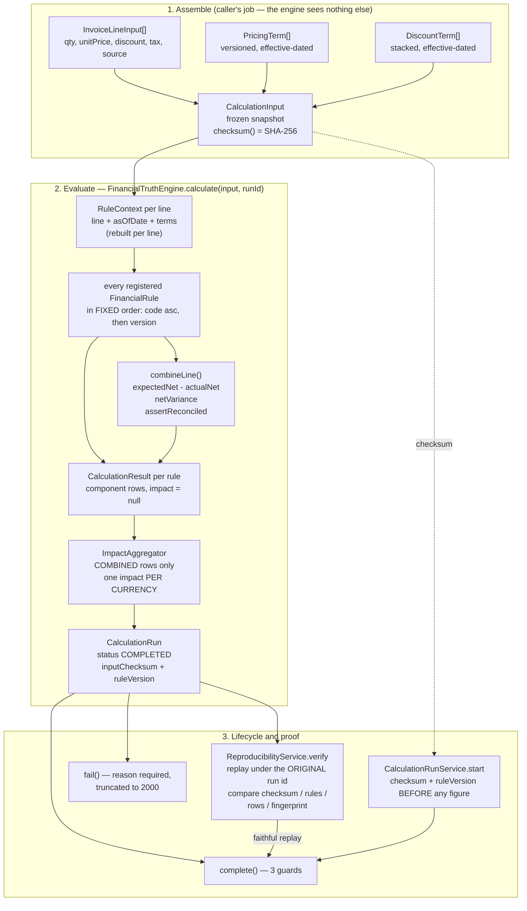
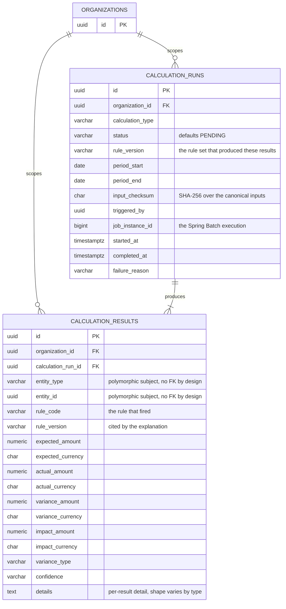
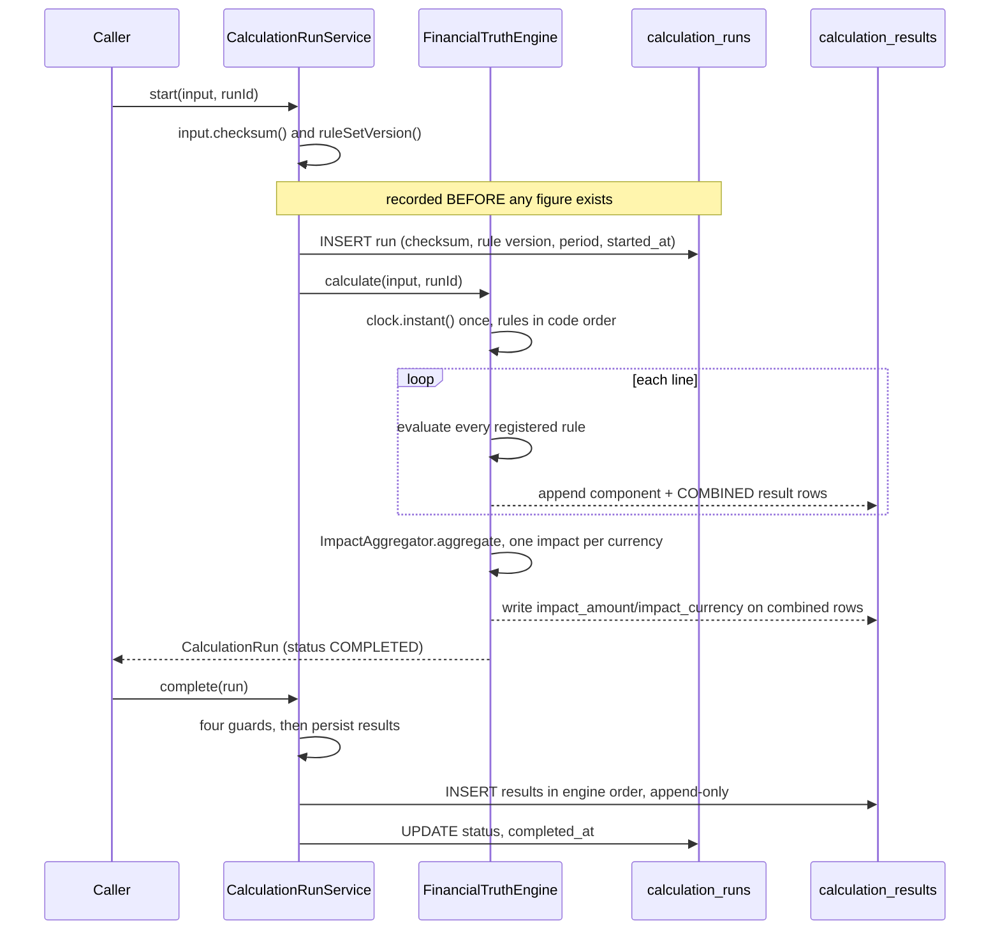

# 08 Financial Truth Engine

> The heart of the handbook. After reading section **D** you should be able to take
> an invoice and a contract, do the arithmetic by hand on paper, and land on exactly
> the same figures the engine produces — including the signs, the scales, the
> confidence level and the per-currency totals.
>
> **Supersedes** `02-truth-contract.md` and `11-truth-deep.md`, whose numbers and
> file counts are stale. Where this chapter and those two disagree, this chapter is
> correct as of the working tree.

---

## A. WHY this module exists

A finance team receives an invoice, a contract, and a question: *is this invoice
right, and if not, by how much?* Answering it wrongly in the supplier's favour
costs real money; answering it wrongly against the supplier destroys a customer
relationship and invites a dispute nobody can settle with a spreadsheet. The
danger is not that a human makes an arithmetic slip — it is that a number is
produced with no traceable derivation, so the two sides cannot agree on it and the
accounting period cannot be closed.

Without this module the alternative is either (a) manual reconciliation, which is
slow, unauditable and inconsistent between two analysts working from the same
contract, or (b) an opaque scoring model that produces a different number for the
same input every time it is asked. Neither can survive an audit. The whole point of
the Financial Truth Engine is that it is **boringly deterministic**: pure `BigDecimal`
arithmetic over a frozen snapshot, with every figure traceable to the invoice row
and the contract version that produced it, and a stored checksum that makes a
replay provable rather than merely claimed.

This is also the boundary against a tempting shortcut. Raw invoice data is
perfectly suited to a language model, and a model will happily produce a confident
number. It is not, however, capable of producing a *repeatable* number. A
probabilistic component in the path that yields a different answer for the same
input cannot be reconciled with a customer, reproduced in an audit, or attributed
to a contract clause — and those are the three things this product exists to do.
`docs/decisions/ADR-002-financial-truth-over-ai.md` states this thesis, but it is
**a TODO stub**: it records what is already enforced in code and says so, and has
not been written as a decision record. The rejected alternatives and the failure
mode being avoided live only in that stub's prose. This chapter is, in effect,
the working implementation of that decision.

### Hard invariants

A future change must not break any of these. Every one is referenced later in
this chapter.

1. **The sign convention is `variance = actual − expected`, everywhere.** A
   positive net variance always means the customer was charged *more* than the
   contract entitles.
2. **No default is ever substituted for an unknown.** A missing contract price
   raises. A discount term that cannot be read yields `IncompleteInputs`, never a
   zero entitlement. A pricing basis the module does not implement yields
   `IncompleteInputs`, never the wrong number.
3. **`NotApplicable` and `IncompleteInputs` are different findings.** "The contract
   entitles nothing here" and "I could not read the contract" must never collapse
   into a zero variance, because a zero variance reads as a *checked and clean*
   invoice.
4. **A result that carries no monetary claim carries no monetary figures.** The
   `RuleEvaluationResult` and `CalculationResult` constructors enforce this; it
   cannot be bypassed by a factory or a caller.
5. **Every amount carries its currency, everywhere, always.** A `Money` with no
   currency is not constructible; a `Variance` whose two sides are in different
   currencies raises rather than converting.
6. **Rounding happens exactly once per produced amount**, to 4 decimal places,
   `HALF_UP`. Intermediates are never rounded. Totals sum already-rounded parts
   and are never re-rounded.
7. **The only source of time is an injected `Clock`**, read once per run. No
   `LocalDate.now()`, no `Instant.now()` anywhere in the calculation path.
8. **The only source of data is the supplied `CalculationInput`.** The engine has
   no repository, no HTTP client, no ambient configuration.
9. **The run id is supplied by the caller**, never generated — entropy in the
   record whose purpose is reproducibility would defeat it.
10. **The input checksum is captured before any figure exists**, so a run that
    fails is still replayable.
11. **Evaluation order is a property of the code, not of injection order.** Rules
    sort by code; terms sort by a total-ordering comparator; per-currency impacts
    come back in currency-code order.
12. **Component rows are never summed with each other or with a combined row.**
    Only `COMBINED_VARIANCE` rows reach the aggregator, and it rejects anything
    else.
13. **Every reported figure carries its source row and the contract versions
    evaluated.** A monetary figure with no way back to its source is not shippable.

---

## B. FLOW — the runtime journey



### Numbered steps

1. **Trigger** — a client request (`CalculationController`, `STUB` today), a Spring
   Batch item (`processing.financialtruth.CalculationProcessor`, `STUB`), or a
   unit test calling the engine directly. **Where** —
   `CalculationService.calculate(input, runId)`, `service/CalculationService.java:45`.
   **What it does** — passes the caller's snapshot and run id straight through to
   the engine. **Why** — the service is deliberately infrastructure-free (no
   repository, no `AuditService`), because `AuditService.record` needs a JPA
   repository and injecting it would make the whole engine untestable without a
   database. The run id is passed through rather than generated so that the id a
   run is *stored* under is the same id a later *replay* can reconstruct.

2. **Trigger** — a snapshot is assembled. **Where** —
   `RunCalculationRequest.toInput(organizationId, triggeredBy)`,
   `dto/RunCalculationRequest.java:76`. **What it does** — converts the wire form
   (every amount a decimal `String`) into `InvoiceLineInput` / `PricingTerm` /
   `DiscountTerm` and builds the `CalculationInput`. **Why** — money must never be
   modelled as a JSON number, because it has already passed through binary
   floating point by the time it deserialises. Note that `organizationId` is a
   *parameter* of this method and not a field of the request: tenant scope comes
   from the authenticated principal, never from a request body.

3. **Trigger** — the snapshot is constructed. **Where** —
   `CalculationInput` compact constructor, `model/CalculationInput.java:70`. **What
   it does** — validates, defensively copies all three lists, and rejects an
   as-of date earlier than the invoice date and a line-less invoice. **Why** — the
   snapshot is hashed once and compared against a replay months later, so it must
   be immutable for the life of the run. A zero-line invoice is rejected because a
   total of zero from no lines is indistinguishable from a clean invoice, which is
   precisely the false assurance this module must not give.

4. **Trigger** — the engine is invoked. **Where** — `FinancialTruthEngine.calculate`,
   `calculator/FinancialTruthEngine.java:131`. **What it does** — reads the clock
   **once** (`:139`) to get `evaluatedAt`, computes the rule-set fingerprint
   (`:140`), and loops over the lines. **Why** — one instant for the whole run
   means a fixed clock makes a run byte-identical on replay; reading the clock per
   line would make the fingerprint depend on how fast the loop ran.

5. **Trigger** — per line, a context is built. **Where** —
   `FinancialTruthEngine.java:149–155`. **What it does** — builds a `RuleContext`
   closed over that line, the as-of date, the line currency, and the terms in force
   on that date. **Why** — a rule therefore *cannot see another line*, which is what
   makes per-line results independent and the whole run order-insensitive. The
   terms arrive already filtered and already ordered by `CalculationInput`, so a
   rule cannot invent a different stacking sequence from the one recorded on the
   input.

6. **Trigger** — every registered rule is evaluated. **Where** —
   `FinancialTruthEngine.java:161–172`. **What it does** — tests `appliesTo` first,
   then calls `evaluate`, records a `CalculationResult` row for *every* rule
   (including the ones that made no claim), and keeps the finding in a
   `LinkedHashMap<CalculationType, RuleEvaluationResult>`. **Why** — recording the
   non-claiming rules is what makes "a check was considered" visible instead of
   invisible. `appliesTo` is checked first so a rule that cannot possibly apply
   costs nothing. `LinkedHashMap` is used so the ordering is explicit; the real
   protection against displacement is the duplicate-code rejection at construction
   (`:311–316`).

7. **Trigger** — a line's authoritative net row is built. **Where** —
   `FinancialTruthEngine.combineLine`, `calculator/FinancialTruthEngine.java:217`.
   **What it does** — returns `null` if the pricing rule did not evaluate or the
   discount rule reported `IncompleteInputs`; otherwise composes
   `expectedNet = expectedGross − expectedDiscount + tax`, `actualNet = actualGross
   − actualDiscount + tax`, the net variance, and asserts that the net reconciles
   with `pricingVariance − discountVariance`. **Why** — returning `null` is not a
   silent omission: the aggregator counts the line as unevaluated and drops the
   run's confidence accordingly, and the component rows already on the record say
   why.

8. **Trigger** — the run is aggregated. **Where** —
   `FinancialTruthEngine.java:185` → `ImpactAggregator.aggregate`,
   `calculator/ImpactAggregator.java:76`. **What it does** — accepts only combined
   rows, buckets them by currency in a `TreeMap` under an explicit comparator, and
   emits one `FinancialImpact` per currency with its own coverage and confidence.
   **Why** — summing across currencies would need an FX conversion this module
   deliberately does not have, and inventing a rate is the single most damaging
   thing it could do.

9. **Trigger** — the run record is created. **Where** —
   `FinancialTruthEngine.java:189–191`. **What it does** — builds a
   `CalculationRun` with status `COMPLETED`, the rule version, the input checksum
   (`input.checksum()`), the period, and the *same* `evaluatedAt` in both
   `startedAt` and `completedAt`. **Why** — a run is a single evaluation, so under a
   fixed clock it must not appear to have started and finished at two different
   instants; doing so would make every replay mismatch.

10. **Trigger** — a run is opened for a caller that wants it recorded. **Where** —
    `CalculationRunService.start`, `service/CalculationRunService.java:49`. **What
    it does** — captures the checksum, the rule-set version, the period and
    `startedAt` **before any figure exists**, with empty results. **Why** — a run
    that throws half way through must still be replayable, and it can only be
    replayed if the identity of its inputs was recorded first.

11. **Trigger** — a run is closed. **Where** —
    `CalculationRunService.complete`, `service/CalculationRunService.java:64`. **What
    it does** — three guards (open status, completed evaluation, same run id, same
    input checksum) and then returns the evaluated run unchanged. **Why** — the
    service owns the *transition*, not the contents; recomputing or amending a
    figure here would desynchronise the record from its own fingerprint.

12. **Trigger** — a run fails. **Where** — `CalculationRunService.fail`,
    `service/CalculationRunService.java:91`. **What it does** — requires a cause,
    preserves the checksum and rule version, drops results and impacts, and
    truncates the reason to 2000 characters. **Why** — see section D.

13. **Trigger** — someone asks whether a stored run can be reproduced. **Where** —
    `ReproducibilityService.verify`, `service/ReproducibilityService.java:55`. **What
    it does** — replays the snapshot through the engine **under the original run
    id** and collects *every* difference into a `Verdict`. **Why** — the replay is a
    re-execution of that run, not a new run; a fresh id would make the two
    incomparable, because the fingerprint includes the run id.

### `[PLANNED]` — not implemented

- The interactive HTTP path. `controller/CalculationController.java` and
  `controller/CalculationRunController.java` are empty shells. Every collaborator
  they would call (`CalculationService`, `ReproducibilityService`, all DTOs) is
  built and unit-tested; only the web layer is missing.
- The batch path. All four `processing/financialtruth/*.java` files are empty
  shells. Their intended contracts are in section D13.
- Persistence. `repository/CalculationRunRepository.java` and
  `repository/CalculationResultRepository.java` are empty shells. The schema
  exists (`V6__create_calculations.sql`) and the domain records mirror it
  column-for-column, so the mapping is mechanical rather than a redesign.
- Tiered and list pricing. `PricingType.LIST_PRICE` and `PricingType.TIERED` are
  modelled but not evaluable; a line priced that way is reported
  `IncompleteInputs`.

### ER diagram — V6 `V6__create_calculations.sql`



The diagram is deliberately almost boring, and that is the point. V6 creates
**two** tables, and the whole reproducibility argument rests on that shape: a
`CALCULATION_RUN` is one evaluation, and every `CALCULATION_RESULT` is a row that
belongs to it and to nothing else. The run row carries the two facts that make a
result explainable months later — `rule_version` (which clause produced it) and
`input_checksum` (what was evaluated) — and the result row carries the arithmetic
itself, as three separate amount/currency pairs rather than one netted figure. The
aggregated, per-currency `FinancialImpact` that the engine returns is **not** a
table: it is `impact_amount`/`impact_currency` on the result rows that reached
aggregation, and it does not survive a restart. If you are looking for a
`financial_impacts` or `variances` table, it does not exist in V6; the in-memory
objects of those names have no schema. `organization_id` appears on both tables
directly rather than being reached through the run, so no query can cross the
tenant boundary by forgetting a join, and `entity_type`/`entity_id` is
deliberately un-referenced so the same engine can calculate over invoices, lines
and transactions alike.

#### The constraints that matter, and what each one prevents

- **`ck_calc_results_variance_currency` — `variance_amount IS NULL OR
  variance_currency IS NOT NULL`.** Prevents an uninterpretable number from ever
  existing. The dangerous direction is one-directional on purpose: a currency with
  no amount is harmless, only a bare amount is not. Without this, a variance that
  picked up a currency from a neighbouring row during a mapping change is how one
  tenant's figure is quoted in another tenant's currency.
- **`ck_calc_results_impact_currency` — the same guard on impact.** Impact is
  aggregated across results and is therefore even more exposed to acquiring a
  currency by accident. Both are `ALTER` rather than inline so the rule reads as a
  schema-wide policy rather than a property of one column.
- **`ON DELETE CASCADE` from `organizations` to both tables.** A tenant boundary
  that only the application enforces is a boundary a batch import or a hand-written
  fix can cross. The schema is the only writer that holds for every writer.
- **No update path on `calculation_results` — enforced by the absence of one.** A
  corrected calculation is a new run, so the record of what was believed at a point
  in time is never rewritten. The comment in the migration states it; nothing
  enforces it, which is why the repository Javadoc in § C lists append-only as a
  contract the persistence pass must honour.
- **`ux`-style scoping of the checksum lookup — `ix_calculation_runs_checksum
  (organization_id, input_checksum)`.** Makes "has this exact input been
  calculated before?" a lookup rather than an assertion, and leading with the
  tenant is required for it to mean anything: the same inputs for two tenants are
  different inputs.

#### Main write path



---

## C. FILES — every file in the module

**61 files: 46 built, 4 stub (controllers + repositories), 7 stub
(`processing/financialtruth`), 4 config (`package-info` in the engine root — see
the reconciliation note below), 7 test.** Precisely: 50 files under
`financialtruth/` = 40 BUILT + 4 STUB + 6 CONFIG; 4 files under
`processing/financialtruth/` = 4 STUB; 7 files under
`src/test/.../financialtruth/` = 6 TEST + 1 TEST fixture. Totals: 46 built, 8 stub,
6 config, 7 test. Verified with
`Get-ChildItem -Recurse -File C:\cfo\src\main\java\com\fintech\cfo\financialtruth`
→ 50, `...\processing\financialtruth` → 4,
`Get-ChildItem -Recurse -File C:\cfo\src\test\java\com\fintech\cfo\financialtruth`
→ 7.

### `financialtruth/calculator` — 6 files (5 BUILT, 1 CONFIG)

| file | status | what it is for | key methods / lines |
|---|---|---|---|
| `calculator/FinancialTruthEngine.java` | BUILT | Orchestrates a whole run: rule set, evaluation order, per-line rows, aggregation, run assembly. | `calculate` :131 · `combineLine` :217 · `ruleSetVersion` :110 · `confidenceFor` :295 · `sortedByCode` :308 · `lineCountsByCurrency` :201 |
| `calculator/ExpectedAmountCalculator.java` | BUILT | Turns contract terms into the amount that *should* have been charged. | `expectedGrossAmount` :66 · `expectedDiscountAmount(Money, DiscountTerm)` :100 · `expectedDiscountAmount(Money, List)` :141 · `expectedNetAmount` :159 · `clamp` :177 · `requireSameCurrency` :209 / :227 |
| `calculator/ActualAmountCalculator.java` | BUILT | Reads what was *actually* charged off an invoice line, with arithmetic deliberately identical to the expected side. | `actualGrossAmount` :55 · `actualDiscountAmount` :73 · `actualTaxAmount` :84 · `actualNetAmount` :96 |
| `calculator/VarianceCalculator.java` | BUILT | Produces variances, and holds the module to its own sign convention and decomposition identity. | `variance(Money,Money,VarianceType)` :56 · `variance(ExpectedValue,ActualValue,…)` :70 · `assertReconciled` :88 · `netFromComponents` :116 |
| `calculator/ImpactAggregator.java` | BUILT | Rolls per-line net variances into one impact **per currency**, refusing component rows and refusing to hide omitted lines. | `aggregate` :76 · `summarise` :114 · `downgradeForGaps` :151 · `requireCombinedOnly` :160 |
| `calculator/package-info.java` | CONFIG | Package contract: no Spring, no I/O; the two amount calculators together own the rounding policy. | — |

### `financialtruth/rules` — 6 files (5 BUILT, 1 CONFIG)

| file | status | what it is for | key methods / lines |
|---|---|---|---|
| `rules/FinancialRule.java` | BUILT | The dispatch contract for one versioned commercial check. No Spring annotations, deliberately. | `appliesTo` :41 · `evaluate` :44 · `versionedCode` :47 |
| `rules/RuleContext.java` | BUILT | Everything a rule may see about one line — and nothing else. | ctor :38 · `firstDiscountOfType` :87 |
| `rules/RuleEvaluationResult.java` | BUILT | What a rule concluded, with the constructor that makes "a figure for a rule that did not run" unconstructible. | ctor :42 · `evaluated` :82 · `notApplicable` :89 · `incompleteInputs` :95 · `isEvaluated` :143 |
| `rules/PricingVarianceRule.java` | BUILT | Compares invoiced unit price against contracted unit price, on the **gross** only. | `CODE` :51 · `VERSION` :53 · `appliesTo` :86 · `evaluate` :91 |
| `rules/DiscountVarianceRule.java` | BUILT | Compares the discount granted against the discount the contract entitled. | `CODE` :58 · `VERSION` :60 · `appliesTo` :95 · `evaluate` :100 |
| `rules/package-info.java` | CONFIG | Package contract: rules are pure; both shipped rules raise rather than default. | — |

### `financialtruth/model` — 13 files (12 BUILT, 1 CONFIG)

| file | status | what it is for | key methods / lines |
|---|---|---|---|
| `model/CalculationInput.java` | BUILT | The frozen snapshot of everything a calculation may read, and the owner of the input checksum. | ctor :70 · `effectivePricingTerm` :122 · `effectiveDiscountTerms` :143 · `checksum` :159 · `canonicalForm` :163 · `PRICING_PRECEDENCE` :55 · `DISCOUNT_APPLICATION_ORDER` :65 |
| `model/CalculationRun.java` | BUILT | The run record that makes a result defensible; owner of the deterministic fingerprint. | ctor :52 · `deterministicFingerprint` :100 · `combinedResults` :132 |
| `model/CalculationResult.java` | BUILT | One persisted-shaped finding: a rule's view of one line. | ctor :43 · `fromRule` :95 · `combined` :113 · `varianceAmount` :130 · `canonicalForm` :139 |
| `model/InvoiceLineInput.java` | BUILT | One normalised invoice line, with mandatory lineage and a single line currency. | ctor :29 · `currency` :58 · `hasUsableQuantity` :69 · `canonicalForm` :77 · `of` :103 |
| `model/PricingTerm.java` | BUILT | A versioned, effective-dated contract price, with its own declared bounds. | ctor :37 · `fixedUnitPrice` :67 · `isEffectiveOn` :80 · `asVersionedValue` :92 · `toEvaluation` :98 · `assertWithinDeclaredBounds` :107 |
| `model/DiscountTerm.java` | BUILT | A versioned, effective-dated discount entitlement (percentage or fixed). | ctor :35 · `percentage` :71 · `fixedAmount` :82 · `isEffectiveOn` :89 · `toEvaluation` :99 · `hasUsableValue` :109 |
| `model/RoundingPolicy.java` | BUILT | The single rounding and scale policy, plus the canonical forms the checksums are built from. | `MONETARY_SCALE` :43 · `QUANTITY_SCALE` :46 · `UNIT_PRICE_SCALE` :49 · `ROUNDING_MODE` :52 · `DISCOUNT_RATE_SCALE` :61 · `canonicalNumber` :100 · `canonicalMoney` :105 |
| `model/Variance.java` | BUILT | The signed difference, computed once and never reassigned. Owner of the sign convention. | ctor :48 · `of` :65 · `isOvercharge` :100 · `isUndercharge` :105 · `direction` :114 · `percentageOfExpected` :125 · `canonicalForm` :145 |
| `model/FinancialImpact.java` | BUILT | One currency's worth of impact, with its coverage and confidence. | ctor :31 · `of` :52 · `notEvaluated` :59 · `canonicalForm` :63 |
| `model/ExpectedValue.java` | BUILT | What the contract entitles, plus the terms and the derivation that produced it. | ctor :24 · `of` :41 · `canonicalForm` :52 |
| `model/ActualValue.java` | BUILT | What was charged, plus the source rows it came from. | ctor :17 · `of` :33 · `canonicalForm` :44 |
| `model/TermEvaluation.java` | BUILT | The lineage of a number: which term, which version, in force on which dates. | ctor :21 · `canonicalForm` :47 |
| `model/package-info.java` | CONFIG | Package contract: all money is `BigDecimal` via `Money`; no `double` or `float` anywhere. | — |

### `financialtruth/enums` — 10 files (9 BUILT, 1 CONFIG)

| file | status | what it is for | key methods / lines |
|---|---|---|---|
| `enums/CalculationType.java` | BUILT | Which calculation a result row belongs to. `PRICING_VARIANCE`, `DISCOUNT_VARIANCE`, `COMBINED_VARIANCE`. | — |
| `enums/CalculationStatus.java` | BUILT | Sealed run lifecycle: `PENDING` / `RUNNING` / `COMPLETED` / `FAILED`. | `all` · `fromCode` · `isAuthoritative` |
| `enums/RuleStatus.java` | BUILT | Sealed rule outcome: `EVALUATED` / `NOT_APPLICABLE` / `INCOMPLETE_INPUTS`. | `all` · `fromCode` · `carriesMonetaryClaim` |
| `enums/VarianceType.java` | BUILT | Sealed variance taxonomy: `PRICING` / `DISCOUNT` / `COMBINED`. | `all` · `fromCode` · `admitsNonZeroAmount` |
| `enums/CalculationConfidence.java` | BUILT | How much weight a figure deserves: `HIGH` / `MEDIUM` / `LOW`, ordered explicitly. | `isLessConfidentThan` |
| `enums/ImpactDirection.java` | BUILT | Which way the money moved, derived from the sign, never supplied. | `of(BigDecimal)` |
| `enums/PricingType.java` | BUILT | How a pricing term expresses its price. Only `FIXED_UNIT_PRICE` is evaluable today. | — |
| `enums/DiscountType.java` | BUILT | How a discount term expresses its value. | — |
| `enums/CodedEnum.java` | BUILT | Shared contract: one stable persisted code per variant, strict `fromCode`, `Locale.ROOT` normalisation. | `code` · `normalise` · `requireColumnWidth` |
| `enums/package-info.java` | CONFIG | Package contract: which sets are sealed, which are enums, and why. | — |

### `financialtruth/service` — 4 files (3 BUILT, 1 CONFIG)

| file | status | what it is for | key methods / lines |
|---|---|---|---|
| `service/CalculationService.java` | BUILT | The application-facing entry point, and the query helpers. Infrastructure-free. | `calculate` :45 · `netResults` :66 · `netResultForLine` :71 · `netVarianceIn` :90 |
| `service/CalculationRunService.java` | BUILT | Owns the run lifecycle: open, close, fail, and the second reproducibility gate. | `start` :49 · `complete` :64 · `fail` :91 · `requireReproducible` :112 · `truncate` :157 |
| `service/ReproducibilityService.java` | BUILT | Turns "we believe it is reproducible" into "we have checked", and reports the differences. | `verify` :55 · `requireReproducible` :102 · `compareResults` :116 · `Verdict` :143 |
| `service/package-info.java` | CONFIG | Package contract: no Spring, no I/O; a `Clock` where time is needed. | — |

### `financialtruth/dto` — 7 files (6 BUILT, 1 CONFIG)

| file | status | what it is for | key methods / lines |
|---|---|---|---|
| `dto/RunCalculationRequest.java` | BUILT | The wire request, with money as decimal strings and **no** organization field. | `toInput` :76 · `InvoiceLineRequest.toLineInput` · `PricingTermRequest.toTerm` · `DiscountTermRequest.toTerm` |
| `dto/AmountResponse.java` | BUILT | An amount plus its currency as separate fields; `null` for "no figure established". | `from` :30 |
| `dto/VarianceResponse.java` | BUILT | A variance with its direction and a nullable `percentageOfExpected`. | `from` :50 · `percentage` :62 |
| `dto/FinancialImpactResponse.java` | BUILT | One currency's impact, with its rationale. | `from` :28 |
| `dto/CalculationResponse.java` | BUILT | One result row as reported to a client; `null` amounts for a row carrying no claim. | `from` :49 |
| `dto/CalculationRunResponse.java` | BUILT | A run with its checksum, rule version and fingerprint — the client cannot reproduce without them. | `from` :45 |
| `dto/package-info.java` | CONFIG | Package contract: transport only, never computes; nullable is a real answer. | — |

### `financialtruth/controller` — 2 files (2 STUB)

| file | status | what it is for | key methods / lines |
|---|---|---|---|
| `controller/CalculationController.java` | STUB | Synchronous single-invoice reconciliation. Belongs: tenant scope from the principal, DTO mapping, `ApiResponse`, springdoc, typed exceptions. | Javadoc contract :9–38; no methods |
| `controller/CalculationRunController.java` | STUB | Audit-facing: fetch a stored run, ask whether it reproduces. Belongs: serve only authoritative runs, return the `Verdict` as data, never recompute over a stored figure. | Javadoc contract :9–35; no methods |

### `financialtruth/repository` — 2 files (2 STUB)

| file | status | what it is for | key methods / lines |
|---|---|---|---|
| `repository/CalculationRunRepository.java` | STUB | Persists the `calculation_runs` row. Belongs: lookup by `(organization_id, run_id)`, checksum stored verbatim and never re-derived, `failure_reason` bounded at 2000, results append-only. | Javadoc contract :8–34; no methods |
| `repository/CalculationResultRepository.java` | STUB | Persists `calculation_results` for one run. Belongs: reads scoped by `(organization_id, run_id)` and **ordered** `line_number`-first, nullable money columns stay null, amount/currency pairs written together, append-only. | Javadoc contract :8–33; no methods |

### `processing/financialtruth` — 4 files (4 STUB)

| file | status | what it is for | key methods / lines |
|---|---|---|---|
| `processing/financialtruth/CalculationJobConfiguration.java` | STUB | The Spring Batch `Job`/`Step` definition, its reader/processor/writer wiring, and the `JobParameters` contract (`asOfDate` + tenant filter). | Javadoc contract :9–33; no methods |
| `processing/financialtruth/CalculationJobLauncher.java` | STUB | Programmatic entry point: builds `JobParameters` and launches the job, so every path uses one parameter set. | Javadoc contract :9–31; no methods |
| `processing/financialtruth/CalculationProcessor.java` | STUB | Batch counterpart of `CalculationService`: one item = one invoice; assembles the input, invokes the engine, returns the run. Per-item failures record `FAILED` and let the chunk continue. | Javadoc contract :11–40; no methods |
| `processing/financialtruth/CalculationWriter.java` | STUB | Persists each run and its results in one transaction, in engine order, nulls kept null, idempotent by run id, never recomputing. | Javadoc contract :9–38; no methods |

### `financialtruth` tests — 7 files (7 TEST)

| file | status | what it is for | key methods / lines |
|---|---|---|---|
| `test/…/TruthEngineFixtures.java` | TEST | Shared fixed dataset: fixed clock `2024-03-16T09:30:00Z`, fixed `RUN_ID`, `AS_OF 2024-03-15`, SKU constants, factory helpers. Not a test class. | `engine()` · `pricingOnlyEngine()` · `standardInput` · `line` · `lineWithDiscount` · `lineWithTax` |
| `test/…/FinancialTruthEngineTest.java` | TEST | 38 tests: end-to-end engine behaviour, ordering, configuration, lineage, aggregation, boundaries, currencies. | `reconcilesAnOverchargeEndToEnd` · `ordersTheRuleSetFingerprintRegardlessOfInjectionOrder` · `refusesToAggregateComponentRows` · `disclosesAnUnauthorisedDiscountInsteadOfClaimingItCanDecomposeTheNet` |
| `test/…/FinancialRegressionTest.java` | TEST | 42 tests: a pinned seven-line dataset whose every figure, checksum and rule version is asserted as a literal. | `reportsTheOverchargeFromTheArchitectureDocument` · `pinsTheInputChecksum` · `pinsTheRuleSetThatProducedTheFigures` · `roundsHalfUpToFourDecimalPlacesExactlyOnce` |
| `test/…/PricingVarianceRuleTest.java` | TEST | 25 tests: the pricing rule in isolation — over/under/equal, incomplete inputs, missing and contradictory terms, currency safety, rounding, boundary dates. | `raisesRatherThanDefaultingWhenNoPricingTermIsInForce` · `reportsIncompleteInputsForAPricingTypeThisModuleCannotEvaluate` |
| `test/…/DiscountVarianceRuleTest.java` | TEST | 22 tests: the discount rule in isolation — percentages, stacking, caps and clamps, fixed amounts, applicability vs completeness, boundary dates. | `sumsStackedTermsFromTheSameBase` · `neverEntitlesMoreDiscountThanTheContractedGross` · `reportsIncompleteInputsWhenThereIsNoContractedGrossToDiscount` |
| `test/…/CalculationReproducibilityTest.java` | TEST | 31 tests: repeat runs, reloaded snapshots, conditions that must reproduce, the whole run lifecycle, verifier arguments. | `producesTheIdenticalFingerprint` · `refusesToReproduceWhenTheClockMoved` · `truncatesAFailureReasonToWhatTheColumnCanHold` |
| `test/…/MoneyTest.java` | TEST | 16 tests: the shared `Money` type the whole module rests on — currency safety, arithmetic, sign, scale. | `rejectsArithmeticAcrossCurrencies` · `divisionRequiresExplicitScaleAndRounding` |

---

## D. DEEP DIVE — method by method

### D.0 A complete worked example

This is the pinned dataset from `FinancialRegressionTest.sevenLineInvoice()`
(`FinancialRegressionTest.java:129`). Everything below is hand arithmetic; the
figures the engine produces are asserted as literals in that suite.

**The contract** (all INR, all in force 2024-01-01 → 2024-12-31, version 1):

| product | contracted unit price | discount term |
|---|---|---|
| `SKU-REG-1000` | 1 000.00 | — |
| `SKU-REG-920` | 920.00 | — |
| `SKU-REG-DISC` | 1 000.00 | 10 % (`DT-REG-DISC-10PCT`) |
| `SKU-REG-FRAC` | 33.333333 | — |
| `SKU-REG-SUB` | 0.000050 | — |
| `SKU-REG-HUGE` | 987 654 321.987654 | — |

**The invoice** (as-of and invoice date both 2024-03-15; tax is zero on every
line, which is why tax's pass-through behaviour is not visible here):

| line | product | qty | invoiced unit price | discount granted |
|---|---|---|---|---|
| 1 | `SKU-REG-920` | 10 000 | 1 000.00 | 0.00 |
| 2 | `SKU-REG-1000` | 3 | 1 000.00 | 0.00 |
| 3 | `SKU-REG-1000` | 500 | 900.00 | 0.00 |
| 4 | `SKU-REG-DISC` | 10 | 1 000.00 | 50.00 |
| 5 | `SKU-REG-FRAC` | 2.5 | 33.333400 | 0.00 |
| 6 | `SKU-REG-SUB` | 1 | 0.000040 | 0.00 |
| 7 | `SKU-REG-HUGE` | 1 000 000.000001 | 1 000 000 000.987654 | 0.00 |

**Policy, applied throughout:** normalise unit price and quantity to 6 dp, then
multiply, then round **once** to 4 dp `HALF_UP`.

#### Line 1 — a large overcharge

```
expected gross = 920.00 x 10000        = 9 200 000.0000
actual gross   = 1000.00 x 10000       = 10 000 000.0000
pricing variance = actual - expected   =     +800 000.0000
discount rule   : no term in force for SKU-REG-920 -> NOT_APPLICABLE
                  expected discount = 0.0000 (an absent entitlement, legitimately zero)
expected net    = 9 200 000 - 0 + 0   = 9 200 000.0000
actual net      = 10 000 000 - 0 + 0  = 10 000 000.0000
net variance    = 9950000 - 9200000    =     +800 000.0000   (CUSTOMER_OVERPAY)
reconciliation  : 0 (no discount component) - (nothing) = 0
                  actual discount is 0.00, so `decomposable` = true via the
                  "invoice granted nothing to decompose" branch; assertReconciled(800000, 0) is a
                  vacuous-but-harmless check because the discount component genuinely has no figure.
```

#### Line 4 — the discount shortfall, and the one deliberate sign flip

```
expected gross    = 1000.00 x 10       =     10 000.0000
actual gross      = 1000.00 x 10       =     10 000.0000
pricing variance  = 10000 - 10000      =          0.0000

entitlement       : rate = 10 / 100 at DISCOUNT_RATE_SCALE(10) = 0.1000000000
                    10 000.0000 x 0.1000000000 -> 4dp HALF_UP = 1 000.0000
                  (the rate is cut at 10 dp, NOT at 4 dp, so the rounding of the rate can never
                   decide the rounding of the money)
clamp             : term cap = null; 1000.0000 <= 10 000.0000 gross, so no clamp
expected discount =                       1 000.0000
actual discount   = invoice row         =      50.0000
discount variance = actual - expected   =     -950.0000   <- NEGATIVE

expected net      = 10 000 - 1 000 + 0  =  9 000.0000
actual net        = 10 000 -   50 + 0  =  9 950.0000
net variance      = 9 950 - 9 000      =    +950.0000   (CUSTOMER_OVERPAY)
reconciliation    : components = pricingVariance(0) - discountVariance(-950) = 0 - (-950) = +950
                    assertReconciled(+950, +950) passes
```

**Read the sign flip carefully, because it is the single place in the module where
the convention bends.** The discount component is `actual − expected = 50.00 −
1 500.00 = −1 450.00` in the stacked case below. That negative does *not* mean the
supplier is owed money — it means the invoice **withheld** discount the contract
granted. The net payable *subtracts* a discount, so a withheld discount pushes the
payable **up**; the engine therefore **subtracts** the discount component from the
net. `net = 0 − (−1 450) = +1 450`: the customer paid 9 950.00 against 8 500.00
owed, an overcharge. A report that showed the component and the net with the same
sign would tell the finance team the supplier is owed 1 450.00 on an invoice that
overcharged the customer by exactly that amount.

#### Line 5 — the fractional rounding pair

```
expected gross = 33.333333 x 2.5 = 83.3333325   -> 4dp HALF_UP -> 83.3333
actual gross   = 33.333400 x 2.5 = 83.3335000   -> 4dp HALF_UP -> 83.3335
net variance   = 83.3335 - 83.3333              =    +0.0002
```

The 0.0002 gap is `0.000067 x 2.5`. Note the scales: the product of two 6 dp
operands carries 12 dp, and it is cut to 4 **once**. Rounding the operands to 4 dp
first would have made 33.3333 × 2.5 = 83.33325 → 83.3333 and 33.3334 × 2.5 =
83.3335, i.e. the same answer here — but only by luck. A `double` cannot represent
either figure.

#### Line 6 — the half-paisa boundary

```
expected gross = 0.000050 x 1 = 0.000050 -> 4dp HALF_UP ->  0.0001   (rounds UP)
actual gross   = 0.000040 x 1 = 0.000040 -> 4dp HALF_UP ->  0.0000   (rounds DOWN)
net variance   = 0.0000 - 0.0001                               = -0.0001
```

A truncating policy would report **both** as 0.0000 and lose the entire finding —
a real undercharge of one ten-thousandth of a rupee vanishing from the report. This
single line is the argument for `HALF_UP` over `DOWN`.

#### Line 7 — beyond the reach of a double

```
expected gross = 987 654 321.987654 x 1 000 000.000001 = 987 654 321 988 641.6543 (rounded to 4 dp)
actual gross   = 1 000 000 000.987654 x 1 000 000.000001 = 1 000 000 000 988 654.0000
net variance                                                          = 12 345 679 000 012.3457
```

The result needs a denominator of ten thousand, which is not a power of two, so
`double` cannot represent it at all.

#### The run total

```
  800 000.0000
      0.0000
 -  50 000.0000
    + 950.0000
      0.0002
      -0.0001
+ 12 345 679 000 012.3457
-----------------------
= 12 345 679 750 962.3458
```

One impact, currency INR, `direction = CUSTOMER_OVERPAY`,
`evaluatedLineCount = 7`, `unevaluatedLineCount = 0`, `confidence = HIGH`.
`ruleVersion = "DISCOUNT_VARIANCE@1.0.0+PRICING_VARIANCE@1.0.0"` — note the
alphabetical code order, not the registration order. `inputChecksum =
1824ce4ae24ebd449ae7e14bdecc1365511e7a8022279e2d323c07eb6eeb5c86`, asserted as a
literal in `FinancialRegressionTest.pinsTheInputChecksum` (`:835`).

#### A line that cannot be evaluated

Take the same invoice and add a ninth line, `SKU-REG-UNTIMED`, which no contract
prices on any date. `PricingVarianceRule.evaluate` **raises**
`BusinessRuleException` (`:106`) — the whole run fails and is recorded `FAILED` with
a reason, not reported as a zero. Now instead add a line whose contract price is in
force but whose *pricing type* is `LIST_PRICE`: the rule returns
`IncompleteInputs`, `combineLine` returns `null` (`:219–222`), no combined row
exists for that line, and the INR impact reports
`evaluatedLineCount = 8, unevaluatedLineCount = 1, confidence = MEDIUM` with a
rationale that says so in words. That is the difference between a total that is a
floor and a total that is a lie.

---

### D.1 `FinancialTruthEngine` — the orchestration

#### `FinancialTruthEngine(ExpectedAmountCalculator, ActualAmountCalculator, VarianceCalculator, ImpactAggregator, List<FinancialRule>, Clock)` — `calculator/FinancialTruthEngine.java:84`

**Guards, in construction order.**

- `clock == null` → `ValidationException` (`:91`). WHY: the engine must never be
  able to reach a system clock, even by accident through a null-conditional. A
  nullable clock is a clock that will eventually be read from `Instant.now()`.
- `rules == null || rules.isEmpty()` → `ValidationException` (`:95`). WHY: a run
  with no rules produces no findings and would aggregate to an empty impact list
  that reads as "nothing to report" rather than "nothing was checked". An empty
  rule set is a wiring mistake, not a valid configuration.
- `this.rules = sortedByCode(rules)` (`:98`) → see below.

#### `private static List<FinancialRule> sortedByCode(List<FinancialRule>)` — `:308`

**Steps.** 1. Copy the list. 2. Sort by `code()` ascending, then by `version()`
ascending (`:310`). 3. Walk adjacent pairs; if two rules share a `code()`, throw
`ValidationException` (`:311–316`). 4. Return `List.copyOf`.

**WHY the sort.** Rule iteration order determines (a) the order of the result rows
inside a run, and (b) the `rule_version` string. If both depended on the order
Spring happened to inject beans in, then two runs of the identical snapshot on
identical code could produce different `rule_version` strings and different result
row orders — and the reproducibility check, which compares rows **positionally**
and fingerprints them **in list order**, would report a mismatch where none
exists. Sorting by code makes both a property of the code rather than of the
composition root. This is exactly the rule §4 of `module-implementation-rules.md`
("no hash-ordered iteration feeding a sum"), taken one step further: no
*injection*-ordered iteration at all.

**WHY the duplicate rejection.** The engine keeps one finding per
`CalculationType` in a map (`:160`, `:171`). Two rules with distinct codes but the
same `calculationType` would have the later one silently displace the earlier one's
finding, and one finding would vanish from the run with no trace. Rejecting
duplicate **codes** is the proxy the interface actually gives us — the code is the
rule's identity, and `rule_version` cannot distinguish two rules that share it
either, so a run whose `rule_version` read `PRICING_VARIANCE@1.0.0` twice would
be unexplainable months later.

**Trade-off.** Duplicate codes are rejected rather than disambiguated with a
counter suffix. A suffix would have let a misconfiguration through and produced a
`rule_version` that no one could map back to a rule in source.

#### `public String ruleSetVersion()` — `:110`

**Returns** the `versionedCode()` of every rule, joined by `+`, in the sorted
order — e.g. `DISCOUNT_VARIANCE@1.0.0+PRICING_VARIANCE@1.0.0`. Never null, never
empty (the empty rule set is rejected at construction).

**WHY this string and not a hash.** It is stored in `calculation_runs.rule_version
VARCHAR(64)`. Two rules at `code@version` of roughly 25 characters each fit; a
hash would fit too but would be unreadable in a `SELECT`. The trade-off is that the
column is length-bounded: a third substantial rule would overflow 64 characters and
have to become a digest. That has not happened yet, and it is the reason the
`CalculationResult` also carries `ruleCode`/`ruleVersion` separately on every row
(`model/CalculationResult.java:30–31`).

#### `public CalculationRun calculate(CalculationInput input, UUID runId)` — `:131`

**Guards.** `input == null` → `ValidationException`; `runId == null` →
`ValidationException` with the message *"runId must be supplied; a generated id
would defeat reproducibility"* (`:136`).

**Steps, in execution order.**

1. `Instant evaluatedAt = clock.instant()` — **once** (`:139`). WHY: a fixed clock
   then stamps an entire run with one instant; reading it per line would make the
   fingerprint depend on how long the loop took.
2. `String ruleVersion = ruleSetVersion()` (`:140`).
3. For each `InvoiceLineInput line` in `input.lines()`, in the given order:
   - Build a `RuleContext` from the line, `input.asOfDate()`, `line.currency()`,
     `input.effectivePricingTerm(line.productKey(), input.asOfDate())` and
     `input.effectiveDiscountTerms(...)` (`:149–155`).
   - For each rule in the fixed order: `rule.appliesTo(context) ? rule.evaluate(context)
     : RuleEvaluationResult.notApplicable(type, code + " does not apply to line " + n)`
     (`:164–166`). `appliesTo` is evaluated **first** so a rule that cannot apply
     costs nothing.
   - Append a `CalculationResult.fromRule(...)` row for **every** rule, with the
     confidence derived from the status (`:169`).
   - Store the finding in `byCalculation` (`:171`).
   - `combineLine(...)`; if non-null, append it to both `results` and
     `combinedResults` (`:174–180`).
4. `impactAggregator.aggregate(combinedResults, lineCountsByCurrency(input))`
   (`:185`).
5. Return a `CalculationRun` with `CalculationStatus.Completed.INSTANCE`,
   `startedAt = completedAt = evaluatedAt`, `failureReason = null` (`:189–191`).

**WHY every rule's row is recorded, including non-claiming ones.** Omitting them
would make "a check was considered and found nothing" indistinguishable from "no
check existed". For a line with no discount term, the record must show a
`DISCOUNT_VARIANCE` row reading `NOT_APPLICABLE` — that is the proof the entitlement
was checked for and found absent, as opposed to never being considered.

**WHY only combined rows are collected into `combinedResults`.** Component rows
carry `impact() == null` by construction (`model/CalculationResult.java:97–102`),
and the aggregator rejects anything that is not `COMBINED_VARIANCE`. This is a
second, independent barrier against the same rupees being counted twice: the first
is that components have no impact, the second is that the aggregator refuses them
outright.

**WHY the line counts come from the snapshot, not from the results**
(`:183–184`). The whole point is to know about the lines that produced *no* combined
row. Counting `combinedResults` would report 100 % coverage for a run in which half
the lines were skipped.

**WHY `startedAt` and `completedAt` are the same instant.** Under a fixed clock a
run is a single evaluation; giving it two different instants would make every
replay mismatch on the fingerprint for a reason that has nothing to do with the
arithmetic.

**`inputChecksum` and `deterministicFingerprint`.** `calculate` does not compute
the checksum — it *reads* `input.checksum()` (`:190`) and copies it onto the run,
and the fingerprint is not computed here either. The three moments matter:

- **Before** any figure exists, `CalculationRunService.start` captures the checksum
  and the rule version (`:59`). A run that later fails is still replayable
  precisely because these were pinned first.
- **After** evaluation, `CalculationRun.deterministicFingerprint()` (`:100`) hashes
  the finished run — status, rule version, checksum, period, both instants, every
  result's canonical form in order, every impact's canonical form.
- **After** a replay, `ReproducibilityService.verify` recomputes the fingerprint of
  both runs and compares them (`:88`).

**The fingerprint includes the run id** (`:102`, `|run=`). That is deliberate and it
changes what the fingerprint *means*: it is an **execution-identity proof**, not a
pure content proof. Two independent runs of the same invoice with identical figures
have different fingerprints, and that is reported as a difference — correctly,
because they are two different executions. To compare content you compare the
`inputChecksum` (which excludes the run id, status and timestamps) and the
individual `canonicalForm` strings, which is what `compareResults` does
(`ReproducibilityService.java:116–132`). The trade-off is real: you cannot use the
fingerprint alone to ask "is this the same answer?". You need both, which is
precisely why they are two independent mechanisms — see D.10.

**`private static CalculationConfidence confidenceFor(RuleEvaluationResult)`** —
`:295`. An exhaustive `switch` over the sealed `RuleStatus`: `Evaluated` → `HIGH`,
`NotApplicable` → `LOW`, `IncompleteInputs` → `LOW`. WHY the exhaustive switch:
adding a fourth status becomes a compile error here rather than a silent fall-through
to a wrong confidence. WHY `NOT_APPLICABLE` is `LOW`: the rule made no claim, and a
row that carries no figure must not look like one that does. Note the engine, not
the rule, grades each finding — a rule cannot grade its own work
(`model/CalculationResult.java:83–85`).

#### `private CalculationResult combineLine(...)` — `:217`

**Returns** the authoritative combined row, or `null` when the line could not be
evaluated on complete inputs.

**Steps.**

1. `pricing = byCalculation.get(PRICING_VARIANCE)`; if absent or not evaluated,
   return `null` (`:219–222`).
2. `discount = byCalculation.get(DISCOUNT_VARIANCE)`; if present with status
   `IncompleteInputs`, return `null` (`:223–227`).
3. `expectedDiscount = discount != null && discount.isEvaluated() ? discount.expected().amount()
   : Money.zero(line.currency())` (`:233–234`).
4. `tax = actualAmountCalculator.actualTaxAmount(line)`;
   `expectedNet = expectedAmountCalculator.expectedNetAmount(expectedGross, expectedDiscount, tax)`;
   `actualNet = actualAmountCalculator.actualNetAmount(line)` (`:237–239`).
5. `netVariance = varianceCalculator.variance(expectedNet, actualNet, VarianceType.Combined)`
   (`:240`).
6. Build `components` **from zero**: add `pricing.variance()`, then *subtract*
   `discount.variance()` if the entitlement was actually measured (`:245–252`).
7. `decomposable = entitlementMeasured || actualDiscountAmount(line).isZero()`;
   if decomposable, `assertReconciled(netVariance.amount(), components)` (`:249–262`).
8. Build a `FinancialImpact` with `HIGH` if decomposable, else `MEDIUM`, and an
   explanation that states the gap when not decomposable (`:264–271`).
9. Concatenate pricing's evaluated terms then discount's (`:274–277`), and return
   `CalculationResult.combined(COMBINED_RULE_CODE, …)`.

**WHY `NOT_APPLICABLE` yields a zero entitlement but `INCOMPLETE_INPUTS` does not**
(`:233–234`). This is the single most important distinction in the whole engine.
`NOT_APPLICABLE` means *the contract granted no discount here* — a positive,
truthful statement, and zero is the correct entitlement for it.
`INCOMPLETE_INPUTS` means *we could not read the contract* — an unknown, and an
unknown is not a zero. Step 2 already caught the `IncompleteInputs` case and
returned `null`, so by step 3 an unreadable entitlement can never become a zero.

**WHY tax is taken from the *actual* side and used for both.** Tax is statutory,
not contractual: the same amount is expected as was charged. The engine reads
`actualTaxAmount` once and passes it into `expectedNetAmount` (`:237–238`). It
therefore inflates the payable on both sides — the customer still owes the tax — and
cancels out of the variance entirely. If the tax were wrong on the invoice, this
engine would not detect it, by design: statutory compliance is a different module's
job, and the only way to detect it here would be to guess the rate.

**WHY components are built from zero rather than from the net** (`:245`). If the
check were `assertReconciled(netVariance, netVariance)`, it would be a tautology
that always passes. Building the expected total independently from the two component
rows and comparing is a genuine test that nothing was double-counted or dropped.

**WHY the decomposition is not always asserted** (`:253–259`). It is provable only
when the discount entitlement was actually measured (`entitlementMeasured`) or when
the invoice granted no discount at all (`actualDiscountAmount(line).isZero()`). A
line carrying a discount that no contract entitlement covers is a genuine finding
— but no `DiscountVariance` result exists to explain it, so asserting reconciliation
there would compare a figure against components that cannot produce it. Such a line
is still reported, at `MEDIUM` confidence, with the gap written into the
explanation in words (`:264–267`). The trade-off: the run does not *fail* on a real
discovery, at the cost of a total that is explicitly less than fully decomposable.
The alternative — failing the run — would discard every other correct line behind a
single unauthorised discount.

---

### D.2 `ExpectedAmountCalculator` — contract terms → entitlement

Pure, side-effect free. No clock, no repository. Constructors: the no-arg one uses
`RoundingPolicy.MONETARY_SCALE`/`ROUNDING_MODE` (`:40`); the explicit one rejects a
negative scale or a null mode with `ValidationException` (`:49–54`) — WHY: a null
mode would mean implicit rounding, and rule §3 of `module-implementation-rules.md`
requires division and rounding to be explicit.

#### `Money expectedGrossAmount(InvoiceLineInput line, PricingTerm term)` — `:66`

**Steps.** 1. `requireUsableQuantity(line)` (`:67`) — a missing or non-positive
quantity raises `BusinessRuleException` naming the line (`:199–207`). WHY: a line
with no quantity has no expected amount; reporting zero would report a free item.
2. `term == null` → `BusinessRuleException("no contract pricing term is in force;
refusing to invent an expected price")` (`:69`). 3. `term.unitPrice() == null` →
`BusinessRuleException` (`:73`). 4. `term.assertWithinDeclaredBounds()` (`:75`) — a
contract that contradicts itself is not an authority. 5. Normalise:
`RoundingPolicy.roundUnitPrice(term.unitPrice())` to 6 dp and
`RoundingPolicy.roundQuantity(line.quantity())` to 6 dp (`:79–80`). 6. Return
`Money.of(unitPrice, term.currency()).multiply(quantity).withScale(4, HALF_UP)`
(`:83`).

**WHY normalise before multiplying.** The product of two `BigDecimal`s carries the
sum of the operand scales. If a source supplied a unit price with 12 decimal places,
the product would carry 18 and the *single* final rounding would be doing more work
than intended. Normalising both operands to their storage scales first makes the
arithmetic independent of how many digits the source happened to supply — which is
the whole point of `NUMERIC(20,6)` in the schema.

**WHY exactly one rounding, at the point the amount is produced.** Nothing
downstream re-rounds, so no caller can round differently, and the amount that
reaches the database is byte-identical to the amount that was calculated.

#### `Money expectedDiscountAmount(Money gross, DiscountTerm term)` — `:100`

**Guards.** `gross == null` or `term == null` → `ValidationException`. `value == null
|| value.signum() < 0` → `BusinessRuleException` (`:108`).

**Steps.** For `PERCENTAGE` (`:112–123`): reject a rate above 100 (`:113–116`);
compute `rate = value.divide(100, DISCOUNT_RATE_SCALE=10, roundingMode)`; yield
`gross.multiply(rate).withScale(4, HALF_UP)`. For `FIXED_AMOUNT` (`:124–129`):
`requireSameCurrency(gross, term.currency(), …)` then
`Money.of(value, term.currency()).withScale(4, HALF_UP)`. Then `clamp(discount,
term, gross)` (`:131`).

**WHY the rate is divided at 10 dp, not 4 dp** (`:117–120`). `1/3` percent is a
recurring expansion. Cutting it to 4 dp first would let the rounding of the *rate*
decide the rounding of the *money* — a 4 dp rate approximation of 0.3333 % applied
to a large gross is a materially different answer from 0.3333333333 %. Ten extra
digits push the rate's error far below `MONETARY_SCALE`, so the single 4 dp
rounding is the only thing that rounds anything. Trade-off: an 11-digit multiplier
inside the arithmetic, and a checksum that would change if `DISCOUNT_RATE_SCALE`
ever moved. It is a constant, and the regression suite pins the resulting figures.

**WHY a percentage needs no currency parameter.** It inherits the currency of the
gross it reduces, so a rate cannot accidentally introduce a second currency. A
fixed credit is an amount and *does* carry a currency, which is why the
`FIXED_AMOUNT` branch is the one that needs `requireSameCurrency` (`:127`) and the
percentage branch is not.

**Why a rate above 100 raises rather than clamping** (`:113–116`). A 120 % discount
is a contract error, not an intent. Clamping it to 100 % would silently honour a
nonsense clause. The equivalent judgement lives one layer up in
`DiscountTerm.hasUsableValue()` (`:109–122`), which reports the same condition as
`IncompleteInputs` so the rule can disclose it rather than raise. The two paths
serve different callers: the rule reports, the calculator refuses.

#### `Money expectedDiscountAmount(Money gross, List<DiscountTerm> terms)` — `:141`

Folds the per-term entitlements in the order supplied, summing **already-rounded**
values, then applies a final `withScale` that is explicitly a settle, not a second
rounding (`:150`).

**WHY each term is clamped against the same gross rather than against the running
total** (`:145–147`). Clamping a percentage against a progressively shrinking
running total would make the sequence of terms change the per-term entitlements
themselves, and the order of `CalculationInput.discountTerms` is a business
decision (earliest window first). Clamping against the same gross keeps each
entitlement a function of (term, gross) alone.

**WHY all terms are applied rather than only the winner.** Stacked discounts are a
real commercial arrangement; collapsing them to one would understate the
entitlement and report a false shortfall.

#### `Money expectedNetAmount(Money gross, Money discount, Money tax)` — `:159`

```
net = gross.subtract(discount)      // currency-checked
if (tax == null) return net
return net.add(tax).withScale(4, HALF_UP)
```

Subtract the discount **first**, then add tax. WHY that order: the discount reduces
the taxable base in every jurisdiction that taxes after discount, so this ordering
also states the assumption the module makes about how the tax figure was produced.
The rounding is applied only on the tax branch; the no-tax branch returns the
already-rounded subtraction, which `BigDecimal` performs exactly.

#### `private Money clamp(Money discount, DiscountTerm term, Money gross)` — `:177`

Applies the term's own `maxDiscountAmount` (rejecting a negative cap at `:182`),
then the hard ceiling that a discount cannot exceed the gross (`:189`). Re-applies
`withScale` on the way out so the returned scale matches every other component
whichever branch produced the value (`:194–196`).

**WHY clamp rather than fail.** Contracts routinely promise a credit greater than a
particular line, and the payable still has to be arithmetically sound. Failing would
mean one over-generous clause blocks reconciliation of the whole invoice. The
trade-off: a contract that intends a 50 000.00 credit on a 10 000.00 line is
honoured as a 10 000.00 credit, and the *finding* that the contract asked for more
than the line carried is disclosed in the rule's explanation instead
(`DiscountVarianceRule.java:160–161`) — so the clamp is visible, not silent.

#### The two `requireSameCurrency` overloads — `:209` / `:227`

One takes two `Money`s (used for the discount and tax components), one takes a
`Money` and a bare `CurrencyCode` (used for a term that *names* a currency). Both
raise `BusinessRuleException` naming both currencies, with the suffix *"this module
never converts between currencies"*. WHY raise rather than convert: there is no FX
component in this codebase, and inventing a rate would be the most damaging thing
the module could do. `Money` itself also refuses to add or subtract across
currencies; these guards exist so the failure arrives with a *field-level* message
at the boundary rather than deep inside an arithmetic call.

---

### D.3 `ActualAmountCalculator` — the invoice line → billed amount

Deliberately symmetric with `ExpectedAmountCalculator`: same normalisation, same
single rounding step, same scale. **WHY symmetry** — the two sides of a comparison
must differ only because the underlying figures differ, never because of a
difference in *method*. An asymmetry in rounding between the sides would be
indistinguishable from a real variance.

- `actualGrossAmount(line)` `:55` — `roundUnitPrice(line.unitPrice().amount()) x
  roundQuantity(line.quantity())`, then one `withScale(4, HALF_UP)`. Raises
  `BusinessRuleException` naming the line if the quantity is unusable (`:107–113`).
- `actualDiscountAmount(line)` `:73` — read straight from the invoice row, never
  re-derived from pricing terms. WHY: this is the figure the supplier actually
  applied; re-deriving it would compare the contract with itself.
- `actualTaxAmount(line)` `:84` — read straight from the line.
- `actualNetAmount(line)` `:96` — `gross − discount + tax`, then one
  `withScale`. The identity `quantity x unitPrice - discount + tax` is the same one
  the database enforces on `invoice_lines` with `ck_invoice_lines_total` (see
  `V4__create_financial_data.sql`); mirroring it means the engine and the schema
  cannot disagree about what a line total is.

The three read-only accessors call `requireLine` only (`:101`); they do **not**
require a usable quantity, because a discount or tax figure is readable regardless.
A line with no quantity is unusable for a *net*, not for a component.

---

### D.4 `VarianceCalculator` — the sign convention, enforced

#### `Variance variance(Money expected, Money actual, VarianceType type)` — `:56`

Thin delegation to `Variance.of`, which is where the convention actually lives. No
WHY paragraph needed beyond the following.

#### `Variance variance(ExpectedValue expected, ActualValue actual, VarianceType type)` — `:70`

Builds a variance from the two value carriers. Raises `ValidationException` if
either is absent — a variance cannot be stated from one figure.

> ⚠ **Review — unused overload.** This method, and the type-carrying value carriers
> it exists for, have no call site in `src/main` or `src/test`. Both shipped rules
> measure their two sides separately and call the `Money`-based overload at `:56`.
> The method is correct and documented; it is simply unexercised, so its null-guard
> and its claim about "lineage travels with it" are assertions rather than
> guarantees.

#### `void assertReconciled(Money netVariance, Money components)` — `:88`

**Guards.** Either side null → `ValidationException`. Currencies differ →
`IllegalStateException` naming both (`:92–97`) — checked *before* the amounts,
because a cross-currency comparison would be meaningless. Amounts not equal by
value → `IllegalStateException` (`:99–103`).

**WHY `compareTo` and not `equals`** (`:98`). `100.0000` and `100` are the same
money. `BigDecimal.equals` compares scale as well as unscaled value, so using it
would fail a perfectly correct reconciliation whenever the two sides happened to
arrive at different scales.

**WHY `IllegalStateException` and not a `BusinessRuleException`.** A reconciliation
failure is not a business rule being violated; it is the engine having contradicted
itself, and it means there is a defect in the code rather than in the data. The
trade-off: an unchecked exception escaping a pure calculation, so a caller that
catches only the typed business exceptions will not see it. In practice the run
fails loudly, which is the intent.

**WHY a hard failure.** For an audit product, a net figure that cannot be explained
by its components is unrecoverable. Publishing it would put a number in a finance
report that no one can defend in a dispute.

#### `Money netFromComponents(List<Variance> pricingVariances, List<Variance> discountVariances, CurrencyCode currency)` — `:116`

Folds disjoint component variances into the net figure. Pricing components are
**summed**; discount components are **subtracted** (`:127–132`) — this is the one
sign flip in the module, and the comment says so in as many words. The result is
rounded once, after the fold (`:133–135`), which only settles the addition because
the components were each already rounded. `currency == null` →
`ValidationException` (*"a total without a currency is a bug"*).

**WHY subtract the discount component.** The net payable already removed the
discount, so a positive discount variance (too much discount granted) *reduces* the
amount recoverable from the supplier. Adding it would report a grant of 1 500.00
against a 1 000.00 entitlement as a 500.00 loss to the customer rather than a
500.00 gain.

> ⚠ **Review — the sign flip is documented in a method the engine does not call.**
> `netFromComponents` has no call site in `src/main` or `src/test`. The engine
> performs the identical fold inline in `combineLine` at
> `FinancialTruthEngine.java:245–252`, and correctness of that fold is protected by
> `assertReconciled`, which fails the run if the inline arithmetic ever diverged.
> So the invariant holds today — but the module's single most important sign rule
> lives in a method nothing exercises, while a second copy of it lives in the
> engine. A future change to either copy would not be caught by the other. This is
> duplication, not a defect: both copies are tested indirectly, and the engine's
> copy is validated against its own output on every single run.

---

### D.5 `ImpactAggregator` — one impact per currency

#### `List<FinancialImpact> aggregate(List<CalculationResult> netResults, Map<CurrencyCode, Integer> lineCountByCurrency)` — `:76`

**Guards.** `lineCountByCurrency == null` → `ValidationException` (`:81–82`):
required rather than defaulted, because a total that cannot say how many lines it
was given cannot disclose the lines it left out. Any null key, null value or
negative count → `ValidationException` (`:84–88`).

**Steps.** 1. `requireCombinedOnly(netResults)` (`:89`). 2. Bucket each result
under its `varianceAmount().currency()` in a `TreeMap<>(CURRENCY_ORDER)` (`:93`).
3. For each entry, `summarise(...)` (`:99–101`). 4. Return an immutable list.

**WHY only combined rows** (`requireCombinedOnly`, `:160–183`). Component rows
exist to *explain* a deviation; summing them with each other or with a combined row
would count the same rupees twice — the 8,00,000 in D.0's line 1 would appear
once as a pricing component and once inside the combined row. The method does not
filter, it **rejects** (`:171–175`), so a caller cannot misread "no complaint" as
"nothing to worry about". Null entries are skipped rather than rejected (`:164–167`),
so a caller assembling a filtered list does not have to compact it first. Rows that
carry no figure are dropped (`:178–180`): a combined row with no variance is a line
with nothing established, not a zero to add.

**WHY one impact per currency rather than a sum** (`:93`). A cross-currency total
requires an FX rate. There is none in this module, and inventing one would be the
single most damaging thing it could do: a plausible, silently wrong recovery figure
in a board pack. So a total is only ever produced for a currency that every
contributing amount shares. `CalculationService.netVarianceIn` (`:90–111`) reinforces
this at the query level: a multi-currency run raises rather than picking one or
summing them.

**`TreeMap` under an explicit comparator** rather than relying on `CurrencyCode`'s
own ordering (`:44`, `:93`). The sequence of returned impacts is part of the
reproducibility surface — `FinancialRegressionTest` reads `impacts().get(0)` and
`get(1)` positionally — so the order must be a stated property (`INR` before `USD`),
not a side effect of a `hashCode`.

**`private FinancialImpact summarise(CurrencyCode, List<CalculationResult>, Map)`** —
`:114`

- Sorts rows by `lineNumber` before summing (`:119–120`). Summing already-rounded
  components is exact whatever the order, so this is not about arithmetic; it makes
  the method independent of how the caller assembled its list.
- `CalculationConfidence worst = HIGH`, downgraded per row via
  `isLessConfidentThan` (`:126–133`). **WHY the *weakest*, not the strongest or
  the most common:** one unreadable line among twenty makes the twenty-line total a
  statement about nineteen lines. A total that outranks its own weakest input is not
  a total.
- `unevaluated = max(0, lineCountByCurrency.getOrDefault(currency, 0) − ordered.size())`
  (`:138`). **WHY only this currency's own line count is consulted:** dividing by a
  currency-blind count would make the INR total of a two-currency invoice claim
  that the USD line had been excluded from it. That is a false statement in a
  document a finance team acts on, and it would also downgrade a fully evaluated
  invoice for no reason. The `max(0, …)` floors the disclosure so it can never
  state a negative number of exclusions.
- Builds a rationale that names both the contributing count and the excluded count
  in words (`:139–141`) and returns the impact at the run's monetary scale.

**`private static CalculationConfidence downgradeForGaps(CalculationConfidence worst, int unevaluated)`** — `:151`

`LOW` stays `LOW` (nothing can lower the floor). Otherwise any omitted line costs
exactly one step: `HIGH` → `MEDIUM`, `MEDIUM` unchanged. A total that omits lines is
a floor, not the whole truth, and must not be presented at the highest confidence
however exact the figures it does contain are.

---

### D.6 `RoundingPolicy` — the rounding discipline

`model/RoundingPolicy.java`. The policy is three rules, stated in the class Javadoc
and enforced by the four constants.

| constant | value | why this value, and what the alternative would have cost |
|---|---|---|
| `MONETARY_SCALE` | `4` (`:43`) | Matches `NUMERIC(20,4)` on every money column in `V6__create_calculations.sql`. A figure computed at another scale is silently changed on the way into the database, and the stored value stops being the value that was calculated. The alternative — computing at, say, 8 dp and storing at 4 — makes the stored figure an approximation of the calculated one, which breaks the claim that a re-run reproduces what was reported. |
| `QUANTITY_SCALE` | `6` (`:46`) | Matches `NUMERIC(20,6)`. A quantity normalised to 4 dp would silently round a 0.0000005 unit order to nothing. |
| `UNIT_PRICE_SCALE` | `6` (`:49`) | Matches `NUMERIC(20,6)` in `V4` and `V5`. Same reasoning: the normalisation must not change the figure the source stated. |
| `ROUNDING_MODE` | `HALF_UP` (`:52`) | The commercial norm, symmetric about zero and independent of magnitude. `CEILING` would introduce a systematic upward drift (every rounded amount biased in the payer's favour, cumulatively across millions of lines); `DOWN` would bias downward. `HALF_EVEN` is statistically tidier but breaks the convention most contracts are written against. See D.0 line 6: under `DOWN`, the 0.000050 entitlement would become 0.0000 and the entire finding would vanish. |
| `DISCOUNT_RATE_SCALE` | `10` (`:61`) | Guard digits for percentage rates, which are recurring expansions. See D.2. Ten digits put the rate's error far below `MONETARY_SCALE`, so the rate can never decide the rounding of the money. The cost: an 11-digit multiplier inside the arithmetic, and a `rule_version`-adjacent compatibility concern if the constant ever moves. |

**Where rounding happens: exactly once per hand-out, at the point the amount is
produced.** `expectedGrossAmount` rounds its product; `expectedDiscountAmount`
rounds its rate-adjusted result; `expectedNetAmount` rounds only on the tax branch;
`actualGrossAmount` and `actualNetAmount` likewise. `ImpactAggregator.summarise`
applies a `setScale` after summing, but the components it sums are already at 4 dp,
so this settles the scale without changing any digit.

**Why an intermediate must never be rounded.** Rounding is not associative.
`(a + b) + c ≠ a + (b + c)` once you round between the additions, and the difference
grows with the number of terms. For an invoice with fifty lines the discrepancy is
not a sub-paisa curiosity: it makes the total depend on the order the lines were
presented in, and a total whose value depends on row order cannot be reproduced
from a stored snapshot. `FinancialRegressionTest.keepsTotalsFreeOfTheOrderTheLinesWerePresentedIn`
(`:474`) pins this with two lines whose total is 0.0001 in either order.

**The canonical forms** (`:100–122`) exist for checksums, not for money. They strip
trailing zeros and use `toPlainString()` rather than `toString()`, so
`920.0` and `920.00` hash identically and no exponent notation (`1E+3`) ever reaches
a digest. `ABSENT = "-"` (`:71`) is one token for both `null` and blank, deliberately
a non-digit so an absent value can never collide with a numeric field.

> **Note.** `RoundingPolicy.round(Money)` (`:77`) has no call site in `src/main` or
> `src/test`. The calculators apply `withScale` directly with their own configured
> scale and mode, so this convenience wrapper is currently unexercised. Harmless,
> but worth knowing before relying on it.

---

### D.7 The rules — dispatch, statuses, and what each rule does

#### `FinancialRule` — `rules/FinancialRule.java`

Five members: `code()`, `version()`, `calculationType()`, `appliesTo(context)`,
`evaluate(context)`, plus a default `versionedCode()` returning `code@version`
(`:47`). **No Spring annotations on purpose:** rules are plain objects with
constructor-injected collaborators, so a test can instantiate and exercise one with
no container, no database and no clock. The contract for implementors, stated in the
Javadoc: pure (no clock, no randomness, no I/O, no locale-sensitive formatting, no
`HashMap` iteration feeding a sum); `version()` changes whenever the arithmetic
changes; missing inputs go through `incompleteInputs`, never a default; a contract
that does not support the conclusion raises `BusinessRuleException` rather than
returning a number nobody agreed to.

#### `RuleContext` — `rules/RuleContext.java`

The closed world a rule sees for one line: `line()`, `asOfDate()`, `currency()`,
`pricingTerm()` (nullable — "the contract said nothing"), `discountTerms()` (already
filtered to the as-of date, already in the fixed application order), and
`firstDiscountOfType(DiscountType)` (`:87`).

**WHY the split in the constructor** (`:42–51`): `Objects.requireNonNull` for the
structural fields (a null line is a programming mistake) and `ValidationException`
for `asOfDate` (a null as-of date is *not* a programming mistake — it is an attempt
to evaluate terms against no date at all, which is a business error worth a proper
message). `discountTerms` is `List.copyOf`-ed (`:51`) so a rule cannot mutate or
reorder the caller's snapshot mid-run.

#### `RuleEvaluationResult` — `rules/RuleEvaluationResult.java`

Three named constructors: `evaluated(type, expected, actual, variance, terms,
explanation)` `:82`; `notApplicable(type, explanation)` `:89`; `incompleteInputs(type,
explanation)` `:95`. The private constructor (`:42–71`) is the enforcement point:

- `explanation` is mandatory and must be non-blank (`:50–53`). WHY: a result nobody
  can explain is a result nobody can rely on. This is the reason the type exists
  partly — the `explanation` is written by the rule at the moment it decides, not
  reconstructed later.
- If `status.carriesMonetaryClaim()` then `expected`, `actual` and `variance` must
  all be present (`:54–59`).
- **Otherwise all three must be absent** (`:60–63`) — *"absence of evidence is not
  zero variance"*. This makes it impossible to construct a result that reports a
  figure for a rule that did not run, or could not run.

`isEvaluated()` (`:143`) delegates to the status rather than checking the fields, so
the answer is a property of the variant and cannot disagree with what the
constructor allowed.

**The three statuses, and why they must stay three** (`RuleStatus`):

| status | meaning | carries money? | confidence the engine assigns |
|---|---|---|---|
| `EVALUATED` | the rule ran and produced expected, actual and variance | yes | `HIGH` |
| `NOT_APPLICABLE` | the contract entitles nothing here — a *true* statement | no | `LOW` |
| `INCOMPLETE_INPUTS` | the rule could not read the contract — an *unknown*, always with a reason recorded | no | `LOW` |

Collapsing either of the last two into a zero variance would let an unreadable
contract pass as a clean invoice. `RuleStatus` is a sealed interface of records, so
every `switch` over it is compile-time exhaustive and a new outcome cannot be added
without deciding how it maps to confidence, impact and disclosure.

> ⚠ **Schema gap (stated by the code itself, `enums/RuleStatus.java:32–36`).** V6
> gives `calculation_results` **no column** for this status — only `variance_type`
> and `confidence`. The distinction this type exists to protect is therefore carried
> in `explanation` and in the run's canonical form, not in a column of its own. A
> consumer querying the database cannot filter on "this row was never evaluated"
> without parsing prose. This is a gap in the migration, not in the module.

#### `PricingVarianceRule` — `rules/PricingVarianceRule.java`

`CODE = "PRICING_VARIANCE"`, `VERSION = "1.0.0"`, `calculationType() =
PRICING_VARIANCE`. **Scope: the gross only** (`quantity x unit price`). Discounts
are measured by the other rule; keeping the two disjoint is what stops a deviation
being counted twice.

`appliesTo(context)` (`:86`) — `context != null && context.line() != null`. A
contract price either applies or it does not; there is no configuration in which
this rule is irrelevant to a priced line, so there is no `NOT_APPLICABLE` path
through `evaluate`.

`evaluate(context)` (`:91`) — guard order is deliberate: **input usability, then
contract authority, then contract shape**, so each early return names the specific
reason and the recorded row says which of the three it was.

1. `!line.hasUsableQuantity()` → `incompleteInputs("Line N has no usable quantity,
   so no expected price can be applied to it")` (`:96–99`).
2. `term == null` → **raises** `BusinessRuleException` naming the line, the product,
   the as-of date, and the words *"Refusing to reconcile against an invoiced price of
   zero"* (`:101–109`). WHY raise, not return: there is no defensible expected
   amount without a contract price, and a zero variance here would report an
   invoice as clean when nothing was ever checked against anything.
3. Term currency ≠ line currency → **raises**, suffix *"This module never converts
   between currencies"* (`:110–116`).
4. `term.pricingType() != FIXED_UNIT_PRICE` → `incompleteInputs` (`:117–122`). NOT a
   raise: the contract may be perfectly valid and simply outside the basis this
   module implements. The distinction is the module's whole thesis — *the contract
   says nothing* is an error; *we cannot evaluate what the contract says* is a
   disclosure.
5. Measure both sides with their own calculator, each rounded once (`:126–127`),
   and take `variance = actualGross − expectedGross` (`:129`).
6. Build an `ExpectedValue` carrying the term's `TermEvaluation` and a derivation
   naming the price, the term id, the version and the quantity (`:131–134`); an
   `ActualValue` carrying `line.source()` (`:135–137`); and a capitalised
   explanation (`:138–140`).

#### `DiscountVarianceRule` — `rules/DiscountVarianceRule.java`

`CODE = "DISCOUNT_VARIANCE"`, `VERSION = "1.0.0"`. **Scope: the discount component**,
disjoint from pricing. A positive figure *here* means the customer received **more**
discount than contracted, so it works against the supplier; the engine negates it
when folding into the net, which keeps the module-wide convention intact.

`appliesTo(context)` (`:95`) — requires a non-empty `discountTerms()`. An empty term
list makes this rule genuinely irrelevant rather than zero-valued, which is why
`NOT_APPLICABLE` is the correct outcome there.

`evaluate(context)` (`:100`):

1. Re-checks `appliesTo` (`:104–108`) and returns
   `notApplicable("No discount term was in force for this product on <date>, so the
   contract entitles no discount")`. WHY re-check when the engine already tested it:
   so the rule is correct when invoked directly, by a unit test or by a future
   caller that does not pre-filter.
2. `!line.hasUsableQuantity()` → `incompleteInputs` (`:114–117`).
3. **`context.pricingTerm() == null` → `incompleteInputs`**, with the message:

   > *"No contract pricing term was in force on <date>, so there is no contracted
   > gross to take a discount entitlement against"* (`:121–122`)

   WHY `incompleteInputs` and not a raise here, when `PricingVarianceRule` raises
   for the identical condition: **the base is missing, not the entitlement.** A
   percentage has nothing to take a percentage of, and a rule that cannot measure
   its own component should disclose that rather than abort the run. In a full
   engine run the ordering makes the distinction moot — because rules are sorted by
   code, `DISCOUNT_VARIANCE` evaluates *first*, so this `INCOMPLETE_INPUTS` row is
   recorded and then `PRICING_VARIANCE` raises on the next rule and the run fails
   anyway. The `incompleteInputs` path is what a caller invoking this rule alone
   gets, and it is directly tested
   (`DiscountVarianceRuleTest.reportsIncompleteInputsWhenThereIsNoContractedGrossToDiscount`).
4. Validates **every** term before applying any (`:127–132`). WHY: a partial stack
   would produce an entitlement that is neither what the contract says nor zero.
5. Recomputes the base from the pricing term (`:137`) — see the review note below.
6. `expectedDiscount = expectedDiscountAmount(base, terms)` (`:138`);
   `actualDiscount = actualDiscountAmount(line)` (`:139`);
   `variance = actual − expected` (`:142`).
7. Records every term's `TermEvaluation` in application order (`:144–147`) and
   discloses a clamp in the explanation when the entitlement exactly equals a
   non-zero base (`:160–161`) — a reader seeing an entitlement equal to the gross
   needs to know the contract asked for more and the ceiling bound it. Guarded on
   non-zero so a genuine zero entitlement is not described as a cap.

> ⚠ **Review — the contracted gross is re-derived, duplicating the pricing rule's
> arithmetic.** `DiscountVarianceRule.evaluate` recomputes the base with
> `expectedAmountCalculator.expectedGrossAmount(line, context.pricingTerm())` at
> `:137` rather than reading `expected()` off the `PricingVarianceRule` result. (For
> precision: this is the **discount** rule, not the pricing rule — the pricing rule
> is the one that *produces* the contracted gross.) Re-deriving is *correct*: the
> engine invokes each rule independently, `RuleContext` deliberately does not carry
> the other rule's output, and a percentage applied to the **invoiced** gross would
> compare the invoice against itself. But the arithmetic is now expressed twice, and
> the base the discount rule used is not provably the same object as the base the
> engine later reads from the pricing result. Today they are identical, because
> both call the same pure method on the same inputs; the reconciliation assertion
> at `FinancialTruthEngine.java:261` would catch a divergence immediately, since a
> mismatched base would make `netVariance ≠ pricingVariance − discountVariance`.
> The cost of the current design is duplicated arithmetic; the alternative —
> threading the pricing result through the `RuleContext` — would couple the two
> rules and let one rule's output silently become another's input.

#### Rule explanations vs exception messages — the casing convention

**The dominant, and deliberate, pattern** is:

- **Explanations and status reasons** — the strings stored in
  `calculation_results.explanation` and read by humans — are **capitalised
  sentences**. Every one of them is: *"Line 3 has no usable quantity, so no expected
  price can be applied to it"*, *"No discount term was in force for this product on
  2024-03-15, so the contract entitles no discount"*, *"Invoiced gross 10 000 000.0000
  INR against contracted gross 9 200 000.0000 INR"*.
- **Exception messages** from the calculators and the guards — which are rendered
  by `GlobalExceptionHandler` and read in a log or an error body — are **lowercase,
  clause-like**: *"no contract pricing term is in force; refusing to invent an
  expected price"*, *"line 4 has no usable quantity; an expected amount cannot be
  derived from it"*, *"clock must not be null; the engine never reads the system
  clock directly"*.

WHY the split: an explanation is a *sentence about a business finding*, quoted
whole into a report, and starting with a capital makes it read as prose there. An
exception message is a *fragment* about a code path, frequently concatenated after a
caller has prefixed it (`"calculation run " + id + " did not reproduce: " + …`), and
a lowercase fragment does not produce a mid-sentence capital.

A third, smaller pattern holds inside the explanations themselves: an appended
clause after a semicolon is **lowercase**, because it continues the sentence. See
`FinancialTruthEngine.java:264–267` (*"; the invoice granted a discount of 50.0000
INR that no contract entitlement covers, so this total cannot be split into its
components"*) and `ImpactAggregator.java:139–141` (*"Sum of 3 combined line
variance(s) in INR; 1 line(s) in INR could not be evaluated and are excluded from
this total"*).

> ⚠ **Review — two rules break the exception-message convention.** The two
> `BusinessRuleException`s raised by `PricingVarianceRule` (`:106–108` and
> `:113–115`) are **capitalised full sentences with full stops**, unlike every other
> exception message in the module (*"Line 1 product SKU-X: no contract pricing term
> was in force on 2024-03-15. Refusing to reconcile against an invoiced price of
> zero."*). They read as if they were explanations, which is what makes them
> conspicuous and easy to find — but a caller that concatenates a rule message after
> its own prefix will produce a sentence with a capital in the middle. Either the
> two rules are the exceptions to the rule, or the calculators are; the codebase has
> not decided, and the inconsistency should be resolved deliberately rather than
> left to whichever file was written last.

---

### D.8 `FinancialImpact` and the confidence ladder

#### `record FinancialImpact(Money totalImpact, ImpactDirection direction, CalculationConfidence confidence, int evaluatedLineCount, int unevaluatedLineCount, String rationale)` — `model/FinancialImpact.java:23`

`totalImpact` **always carries its currency** — it is a `Money`, and a null one is
rejected (`:32–34`). WHY: a total without a currency is the failure mode this module
exists to prevent. The type is a record, so a `FinancialImpact` cannot be
constructed with an amount and no currency; the currency *is* the amount's own.

`direction` is **derived, never supplied** — `of(...)` computes it from the sign
(`:52–56`). WHY: a supplied direction can disagree with the number it describes, and
a report that says "recoverable from the supplier" beside a negative total is worse
than one that says nothing.

`confidence` reflects input completeness, never whether a number is positive.

**`canonicalForm()`** (`:63–72`) deliberately **omits the rationale**. WHY: the
rationale is prose assembled from counts; including it would make the fingerprint
sensitive to *wording* rather than to the figure, so a harmless edit to a sentence
would make every historical run look unreproducible. The counts the rationale is
derived from *are* hashed.

`notEvaluated(currency, rationale)` (`:59`) is the explicit "nothing could be
established" factory. **It has no call site in `src/main` or `src/test`.** Today the
aggregator returns an *empty* impact list when nothing could be evaluated, which
`FinancialTruthEngineTest.reportsNoImpactAtAllWhenNothingCouldBeEvaluated` and
`FinancialRegressionTest.reportsNoTotalAtAllWhenNothingCouldBeEvaluated` both pin.
Empty and explicit are two defensible answers to the same question and the module
currently takes the first; the second is available.

#### `ImpactDirection` — `enums/ImpactDirection.java`

`CUSTOMER_OVERPAY` / `CUSTOMER_UNDERPAY` / `NEUTRAL`, derived by
`ImpactDirection.of(BigDecimal)` (`:16–22`). `null` and zero both map to `NEUTRAL`,
and `signum` is used rather than `equalsTo(ZERO)` so `0.0000` and `0` are both
recognised. WHY `null → NEUTRAL`: no claim is being made, so no direction is
asserted.

#### `CalculationConfidence` — `enums/CalculationConfidence.java`

`HIGH` / `MEDIUM` / `LOW`, ordered by `isLessConfidentThan` (`:38–44`), **not** by
`Enum.ordinal()`. WHY: an ordinal comparison is correct today only because `LOW` is
declared last. Reordering the constants for readability would silently invert the
rule and cause a run to inherit the *strongest* confidence of its rows — reporting
an optimistic total from a partially unreadable invoice. The explicit relation is
`HIGH → false`, `MEDIUM → other == HIGH`, `LOW → true`.

**How confidence degrades, end to end:**

| step | what happened | confidence |
|---|---|---|
| a rule evaluated | expected, actual and variance all present | `HIGH` |
| a rule reported `NOT_APPLICABLE` or `INCOMPLETE_INPUTS` | no figure at all | `LOW` on that row |
| a combined line whose decomposition is not provable | net reported, components cannot explain it | `MEDIUM` |
| the per-currency total | inherits the **weakest** row's confidence | `LOW`/`MEDIUM`/`HIGH` |
| a total with ≥ 1 omitted line | one step down, unless already `LOW` | `MEDIUM` |

---

### D.9 `CalculationRunService` — the run lifecycle

#### `CalculationRun start(CalculationInput input, UUID runId)` — `:49`

Captures `startedAt` from the injected clock, the rule-set version **from the
engine**, the period, the input checksum, `triggeredBy` — and no results.
`input == null` or `runId == null` → `ValidationException`.

**WHY the checksum and rule version are captured *before* any figure exists.** A
run that throws half way through must still be replayable, and it can only be
replayed if the identity of its inputs was recorded first. If the checksum were
taken at completion, a failed run would have no record of what it was attempting and
no way to re-drive it. The test that pins this is
`CalculationReproducibilityTest.recordsTheChecksumAndRuleSetBeforeAnyFigureExists`.

**WHY the rule version comes from `engine.ruleSetVersion()` rather than being
passed in.** The rules actually registered in the engine are the rules that will
produce the results. A caller-supplied version string could disagree with the
runtime rule set, which would make every replay comparison vacuous.

#### `CalculationRun complete(CalculationRun running, CalculationRun evaluated)` — `:64`

Three guards, in order (`:68–74`):

1. `running` must be `RUNNING` — `ValidationException` otherwise. A closed run
   cannot be reopened.
2. `evaluated.status()` must be `COMPLETED` — *"only a completed evaluation may
   close a run; got …"*.
3. `requireSameRun` — the run ids must be equal (`:141`).
4. `requireSameInputs` — the input checksums must be equal (`:148`).

Then `return evaluated` — the evaluated run unchanged.

> ⚠ **Review — `complete()` is a pure guard with no observable effect.** It returns
> the run it was given, having validated four preconditions. The `RUNNING` state is
> never persisted (there is no repository yet) and no `COMPLETED` state is written,
> so the transition is a check, not a change. That is defensible today — the
> service owns the *policy*, and the store does the writing — but the method name
> implies a state change that does not occur, and a caller could reasonably believe
> the returned run had been closed. The Javadoc at `:75–77` is explicit that this is
> intentional ("the evaluated run is returned as-is… recomputing or amending a
> figure here would desynchronise the record from its own fingerprint"), so this is
> a naming/intent mismatch rather than a defect. The consequence to watch: because
> `complete()` returns the *evaluated* run, the `running` record's `startedAt` and
> the evaluated record's `completedAt` both end up being the engine's single
> `evaluatedAt`, which is what makes the fingerprint stable.

#### `CalculationRun fail(CalculationRun running, Throwable cause)` — `:91`

- `running` must be `RUNNING`.
- `cause == null` → `ValidationException`: *"a failed run must record why it
  failed"*.
- **Results and impacts are dropped, not partially retained** (`:96–98`). WHY: a
  half-written set of rows alongside a `FAILED` status would invite a reader to sum
  figures the engine never finished producing.
- The checksum, rule version, `startedAt` and period are **preserved** (`:101–104`),
  so the failure can be re-driven later from the same snapshot and compared against
  the same fingerprint.
- `completedAt = clock.instant()`; the message is truncated.

**WHY truncation is essential, not cosmetic** (`:157–164`). `calculation_runs.failure_reason`
is `VARCHAR(2000)`. An over-long exception message would be rejected by the
database at INSERT time, and because the INSERT is the thing that records the
failure, the failure record itself would be lost — the run would be neither
`COMPLETED` nor `FAILED`, and an operator would have no record that anything had
been attempted. Cutting the tail of a stack message is a small price for keeping
the failure. The trade-off: the message is silently shorter than the exception
says, with no marker that truncation occurred. A null or blank message is replaced
with the literal `"unspecified failure"` (`:160`) — a `FAILED` run with an empty
reason is indistinguishable from one that was never attempted.

`startOr` / `endOr` (`:173–180`) fall back to the UTC date of the run's own
`startedAt` when the period is absent. WHY UTC: the date must not shift with the
server's zone, or a run opened in one timezone could close with a different period
than it started with.

#### `void requireReproducible(CalculationRun original, CalculationRun replay)` — `:112`

A **second, lifecycle-level** reproducibility gate, separate from
`ReproducibilityService`. Both sides must already be `COMPLETED` (`:116–117`) —
comparing against a `RUNNING` or `FAILED` run would report a difference that is
only a lifecycle state. Then, in diagnostic order: checksum, rule version,
fingerprint (`:121–132`).

WHY three separate messages rather than one boolean: a changed checksum explains
itself ("the replay did not use the same inputs"), a changed rule version explains
itself ("a replay must use the identical rule set"), and only a caller who got past
both needs to look at the results themselves.

---

### D.10 `ReproducibilityService` — the proof

#### `Verdict verify(CalculationRun original, CalculationInput reloadedInput)` — `:55`

**Guards.** `original == null` or `reloadedInput == null` → `ValidationException`.
**Never throws on a mismatch** — a mismatch is data, not a crash, so a caller can
report it.

**Steps.**

1. `replay = engine.calculate(reloadedInput, original.runId())` (`:64`).
2. Collect **every** difference, never short-circuiting (`:69`):
   - `original.inputChecksum() != reloadedInput.checksum()` → *"reloaded input
     checksum … differs from the original …"* (`:70–75`). Checked **first** because
     it is the cheapest and most explanatory: if the inputs read from storage
     differ, every downstream difference is a consequence of that.
   - `original.inputChecksum() != replay.inputChecksum()` (`:76–78`).
   - `original.ruleVersion() != replay.ruleVersion()` (`:79–81`).
   - result **count** mismatch, reported separately so the positional comparison
     cannot silently skip rows only one side has (`:82–86`).
   - `compareResults(original.results(), replay.results())` (`:87`).
   - `original.deterministicFingerprint() != replay.deterministicFingerprint()`
     (`:88–91`).
3. Return `new Verdict(runId, originalChecksum, replayedChecksum, originalFingerprint,
   replayedFingerprint, differences, replay)`.

**WHY the replay reuses the original run id** (`:63–64`). The replay is a
re-execution of that run, not a new run. A fresh id would guarantee a fingerprint
mismatch, because the fingerprint includes the run id — every verdict would report
a failure and the check would be worthless.

**Why `Clock` is deliberately *not* a constructor argument here** (`:32–37`). The
clock that matters belongs to the `FinancialTruthEngine` doing the replay. Passing
a second one in would invite a caller to prove reproducibility under conditions the
original run never had — for example to "fix" a mismatch by advancing the clock.

#### `private static List<String> compareResults(List, List)` — `:116`

Positional, over the shorter length (`:120–131`). Each pair is compared on
`CalculationResult.canonicalForm()`, **not** on object equality, because the
canonical form includes the rule code and version, the evaluated terms, the money
with its currency, the impact, the confidence and the instant — so any drift in the
*lineage* shows up, not only in the amounts. The size mismatch is reported
separately (`:82–86`), so nothing beyond the shorter list is silently dropped.

**WHY diff reporting is part of the contract, not a convenience.** A single
mismatch report sends a reader looking for a second run of the diagnosis. Every
difference is named, and the `Verdict` also carries the *replayed run* so a caller
can inspect what actually differed rather than only being told that something did
(`:143–150`).

#### `void requireReproducible(CalculationRun original, CalculationInput reloadedInput)` — `:102`

Calls `verify`, and if `!verdict.reproduced()` throws
`BusinessRuleException("calculation run … did not reproduce: " + String.join("; ",
differences))` — every difference in one message (`:107–108`). On success it then
calls `runService.requireReproducible(original, verdict.replayedRun())` (`:113`).

WHY the second, lifecycle-level check after the arithmetic already agreed (`:110–112`):
`verify` compares the arithmetic; this compares the run record a caller is about to
*close* against the replay, and it is what stops an unreproducible run being
persisted as authoritative. It is a belt-and-braces gate: two checks on the same
facts, from two independently-written code paths, at the two points where a
non-reproducible run could actually be committed.

#### The two independent mechanisms, and why they must stay independent

| mechanism | computed from | answers |
|---|---|---|
| `inputChecksum` (`CalculationInput.checksum()`, `:159`) | the canonical form of every input read — org, type, invoice number, both dates, the triggering user, every line, and every term **with its financial value**, sorted | *were the inputs the same?* |
| `deterministicFingerprint` (`CalculationRun.deterministicFingerprint()`, `:100`) | run id, type, status, rule version, checksum, period, both instants, every result's canonical form in order, every impact's canonical form | *did the same inputs come out the same way?* |

They are independent because they are computed from **disjoint** facts and fail
independently. The three cases:

- **Both agree.** The inputs read from storage were identical, the rule set was
  identical, and every amount, term version, explanation and instant came out
  identical. The answer was re-derived. This is the only case that means
  "reproducible".
- **The checksums differ.** The inputs changed, so there is nothing to compare. Any
  amount difference is a *consequence*, not a finding about determinism. Reported as
  an input change, and `verify` checks it first precisely so it is not mistaken for
  a reproducibility failure.
- **The checksums match but the fingerprints do not.** The inputs were the same and
  the answers were not. This is the serious case, and it is the only one that
  indicates a defect: an undated term, a clock read, a rounding change, a rule
  reordering, or tampering with a stored figure.

**Why collapsing the cases would be catastrophic.** If a checksum mismatch were
reported as simply "did not reproduce", then *a clock change* (different
`evaluatedAt`, which is inside the fingerprint) and *someone editing a stored
amount* would both present as "did not reproduce" — and the two have nothing in
common. A clock change is benign and explainable; an edited figure is fraud. If
they were instead both reported as "inputs changed, nothing to compare", then a
tampered figure would be waved through as a re-run on newer data. Only by keeping
the checks independent and naming which one moved can the service distinguish
"the world moved" from "someone moved the number". The same ordering is repeated
in `CalculationRunService.requireReproducible` (`:121–132`).

---

### D.11 The enums in full

| enum / sealed type | variants | persisted as | column in V6 | notes |
|---|---|---|---|---|
| `CalculationType` | `PRICING_VARIANCE`, `DISCOUNT_VARIANCE`, `COMBINED_VARIANCE` | `VARCHAR(48)` | `calculation_runs.calculation_type`, `calculation_results.calculation_type` | the first two are components, never summed; the third is the authoritative figure and the only one the aggregator accepts |
| `CalculationStatus` (sealed) | `PENDING`, `RUNNING`, `COMPLETED`, `FAILED` | `VARCHAR(32)` | `calculation_runs.status` (default `'PENDING'`) | `isAuthoritative()` is true for `COMPLETED` only |
| `RuleStatus` (sealed) | `EVALUATED`, `NOT_APPLICABLE`, `INCOMPLETE_INPUTS` | *no column exists* | — | see the schema gap in D.7; carried in `explanation` only |
| `VarianceType` (sealed) | `PRICING`, `DISCOUNT`, `COMBINED` | `VARCHAR(32)` | `calculation_results.variance_type` | the type travels on the stored result and must stay stable; a report written against `PRICING` must mean the same thing years later |
| `CalculationConfidence` | `HIGH`, `MEDIUM`, `LOW` | `VARCHAR(16)` (default `'HIGH'`) | `calculation_results.confidence` | ordered by `isLessConfidentThan`, **never** by ordinal |
| `ImpactDirection` | `CUSTOMER_OVERPAY`, `CUSTOMER_UNDERPAY`, `NEUTRAL` | derived, not stored | — | computed from the sign |
| `PricingType` | `FIXED_UNIT_PRICE`, `LIST_PRICE`, `TIERED` | `VARCHAR` | `pricing_terms.pricing_type` (contract module) | only `FIXED_UNIT_PRICE` is evaluable; the other two are modelled so an unsupported term is *reported*, not silently read as a fixed price |
| `DiscountType` | `PERCENTAGE`, `FIXED_AMOUNT` | `VARCHAR` | `discount_terms.discount_type` (contract module) | a percentage carries no currency; a fixed amount must |
| `CodedEnum` | — (interface) | supplies `code()` / `normalise()` / `requireColumnWidth()` | — | see below |

**`VarianceType` has deliberately no `NONE` variant** (`enums/VarianceType.java:22–29`).
An earlier draft declared one for "the amounts matched exactly"; nothing ever
produced it — a matching rule emits a zero `Pricing` variance, and "could not be
evaluated" is already carried losslessly by `RuleStatus`. A documented constant no
code path can reach reads as a contract that is not enforced.

**`CodedEnum` is the reason the persisted string and the hashed string cannot
drift** (`:37`). V6 stores `status`, `result_type` and `variance_type` as bare
strings with no lookup table, and the run's canonical form is hashed into its
fingerprint. Each set therefore publishes exactly one stable code per variant —
always equal to the variant's simple name, so a column written by hand and a column
written by this module agree. `normalise` (`:29–39`) trims and upper-cases with
**`Locale.ROOT`**: a Turkish-locale JVM lower-cases `"I"` to a dotless `ı` and
would make every stored code unresolvable on that host alone. `fromCode` on each
sealed type fails loudly on an unknown value: an unrecognised code means the schema
and the code have diverged, and guessing would report a variance whose provenance
cannot be reconstructed — the one failure that cannot be caught downstream, because
the number still looks like money. `requireColumnWidth` (`:52–57`) is called from
each `fromCode`, so an over-long variant is refused at the boundary rather than
failing later as a silent truncation at write time.

**Why `all()` is a method and not a static field** (e.g. `RuleStatus.java:38–43`).
Initialising a nested record initialises the interface it implements, because the
interface declares default methods — so a `static` field holding nested `INSTANCE`
references would read fields that are not yet assigned and die with an
`NullPointerException` from `List.of`. A method body runs at call time, when the
variants exist.

**`CodedEnum` is a deliberate local duplicate** of the identical contract in
`contract.enums` (`:24–28`). `financialtruth` must not depend on the contract
module, and the alternative — a shared constant — is a dependency this pure engine
has no reason to carry. The trade-off is real: a change to the shared contract must
be made in two places, and nothing enforces that. It is bounded by the fact that
the two sets are independent and neither is consumed by the other at runtime.

---

### D.12 The 4 `processing/financialtruth` stubs, as contract

All four are empty shells whose Javadoc states the contract. They are recorded here
because their intended role and invariants are part of the module's design, not
because anything runs.

**`CalculationJobConfiguration`** — the Spring Batch `Job` with a single chunk-oriented
`Step`, plus the `JobParameters` contract (an `asOfDate` and a tenant filter) that
makes a re-run of the same date select exactly the same invoices. Invariants it owns:
chunk size **is** a transaction boundary, trading throughput against how much work a
single failure repeats; job parameters are the reproducibility handle, since the batch
path has no request body to carry an as-of date; a rerunnable restart policy, so a
restart after a partial failure resumes rather than duplicating.

**`CalculationJobLauncher`** — builds `JobParameters` and launches the job
programmatically, so an operator, a month-end orchestrator or a re-run tool all use
one parameter set. Invariants: parameters are explicit and complete, and a job
started without an as-of date could not select contract terms deterministically;
**no business logic** — deciding which invoices need recalculating belongs in the
reader, and deciding what a variance means belongs in the engine; one launch per
parameter set, which is the supported way to resume.

**`CalculationProcessor`** — the batch counterpart of `CalculationService`. One item
= one invoice. Invariants: run ids come from the job parameters and the invoice and
are **stable**, so a restart re-derives the same id instead of generating fresh
entropy into a record whose purpose is reproducibility; the as-of date is a job
parameter, never `today()`, because reading the system clock here would make a
rerun of yesterday's job select a different contract version; one item is one
invoice, and an invoice must not be split across chunk boundaries, which would leave
a total covering only part of the lines it claims; **failures are per-item, not
fatal** — an invoice with a missing contract price is recorded `FAILED` with a reason
and the chunk continues, because aborting would discard every already-computed
finding behind one bad invoice; the clock is the same injected `Clock` the engine
holds, so timestamps cannot disagree with it.

**`CalculationWriter`** — persists each run and its results. Invariants: **one
transaction per run**, because a `COMPLETED` run with only some lines stored is a
total no one can decompose and would make the status column a lie; order is fixed
(run row first, then results in engine order) because the reproducibility comparison
is positional; **nulls stay null** — an amount for a row whose status carries no
monetary claim is written as null, never zero, because "no entitlement was
established" is not "zero variance"; idempotent by run id, so a restart after a crash
does not double-count an invoice's variance; and **no recomputation** — the writer
stores exactly what the engine produced, because a stored figure that looks wrong is
a finding to report, never a number to quietly correct in place.

---

## E. GOTCHAS — what breaks if you get it wrong

Ranked by consequence. The top four corrupt a reported figure; everything below
corrupts evidence, determinism or operability.

### E.1 Treating a missing or unreadable contract term as zero

- **Symptom** — an invoice with no contract price is reported as a clean invoice:
  variance `0.0000`, confidence `HIGH`, and a run total that looks like a
  reconciliation.
- **Cause** — `ExpectedAmountCalculator.expectedGrossAmount` returning
  `Money.zero(currency)` when `term == null` (`:69` is where it raises instead), or
  `combineLine`'s `expectedDiscount` defaulting `IncompleteInputs` to zero
  (`FinancialTruthEngine.java:233` is where it does *not*).
- **Blast radius** — money, evidence, and every downstream consumer. This is the
  single defect the whole module exists to prevent. A finance team acts on the
  report; a supplier disputes it; the figure cannot be reproduced because there was
  never an authority behind it.
- **Fix** — never. The current behaviour is correct: raise for a missing pricing
  term, return `IncompleteInputs` for an unreadable discount, and let the aggregator
  disclose the omission in the impact's rationale. The real risk is a "simplifying"
  change that makes the guard return zero.

### E.2 Rounding an intermediate, or re-rounding a total

- **Symptom** — a total that changes when the invoice lines are presented in a
  different order; a one-in-a-million difference between a report and its own
  fingerprint.
- **Cause** — a `setScale` between the gross and the net, or a re-round inside
  `ImpactAggregator.summarise` after summing.
- **Blast radius** — money (sub-paisa, but real and cumulative) and determinism
  (a total that depends on row order cannot be reproduced from a stored snapshot).
- **Fix** — round exactly once per produced amount, at the point it is produced
  (`RoundingPolicy`, `MONETARY_SCALE = 4`, `HALF_UP`). Sum already-rounded parts;
  never re-round a sum. Pinned by
  `FinancialRegressionTest.keepsTotalsFreeOfTheOrderTheLinesWerePresentedIn`.

### E.3 Aggregating component rows alongside combined rows

- **Symptom** — a run total roughly double the real deviation, with no visible
  cause.
- **Cause** — passing `run.results()` to `ImpactAggregator.aggregate` instead of the
  combined rows. It would not actually succeed: `requireCombinedOnly` (`:171`)
  throws `ValidationException`. That is the point — the guard is there precisely
  because the mistake is easy to make and hard to spot in output.
- **Blast radius** — money, immediately and visibly.
- **Fix** — use `run.combinedResults()` (`CalculationRun.java:132`) or
  `CalculationService.netResults` (`:66`). Component rows carry
  `impact() == null` by construction, which is the first barrier; the aggregator's
  rejection is the second.

### E.4 Summed across currencies

- **Symptom** — a single "total exposure" figure that is arithmetically meaningless.
- **Cause** — adding `INR` and `USD` impacts together, or reporting a combined
  total for a multi-currency invoice.
- **Blast radius** — money, and the credibility of the entire product. There is no
  FX component in this codebase; any cross-currency total would be a fabricated
  number.
- **Fix** — report one impact per currency, in currency-code order. At the query
  level, `CalculationService.netVarianceIn` (`:90`) raises on a multi-currency run
  rather than picking one.

### E.5 Reading the system clock in the calculation path

- **Symptom** — a replay that "does not reproduce" for no visible reason, or a
  contract term selected differently on a second run.
- **Cause** — `LocalDate.now()` / `Instant.now()` / `OffsetDateTime.now()` in a
  calculator, a rule, or the batch processor. Note that `CalculationInput` and
  every rule require an explicit as-of date for exactly this reason.
- **Blast radius** — determinism first, money second: a term selected from the wrong
  window produces a confidently wrong expected amount.
- **Fix** — inject `DateTimeUtils` or a `java.time.Clock`. The engine takes a
  `Clock` in its constructor and rejects a null one (`:91`); the batch job
  configuration must carry `asOfDate` as a job parameter.

### E.6 Changing the canonical form or a contract value

- **Symptom** — every historical run becomes unreproducible, with no code change to
  point at.
- **Cause** — editing `CalculationInput.canonicalForm`, `RoundingPolicy`'s canonical
  helpers, `TermEvaluation.canonicalForm`, or any field of the pinned contract
  dataset.
- **Blast radius** — evidence, and the `ix_calculation_runs_checksum` index becomes
  useless for its stated purpose.
- **Fix** — treat the canonical form as a versioned wire format. It already is: it
  is prefixed `calculationInput/v1` (`CalculationInput.java:167`) and
  `calculationRun/v1` / `result[...]` so a future layout cannot silently collide
  with this one. A layout change must bump the prefix and be handled as a migration
  over stored runs, not as a refactor.

### E.7 A rule that reads more than its `RuleContext`

- **Symptom** — a rule whose result depends on another line, or on when it ran.
- **Cause** — a rule reaching for a repository, a clock, or a static cache; or the
  `RuleContext` being widened to carry the other rules' outputs.
- **Blast radius** — determinism, and the per-line independence the engine's
  order-insensitivity depends on.
- **Fix** — everything a rule needs arrives in the rebuilt-per-line context
  (`FinancialTruthEngine.java:149–155`). Note that the ⚠ Review in D.7 recommends
  *against* the obvious fix of threading the pricing result through the context.

### E.8 Ordering rules by injection order

- **Symptom** — a `rule_version` string that differs between two runs of the same
  snapshot, and a reproducibility failure with no amount difference anywhere.
- **Cause** — removing the `sortedByCode` call at `FinancialTruthEngine.java:98`,
  or comparing rules by `@Order`/`ordinal`.
- **Blast radius** — determinism and evidence. The `rule_version` recorded on a
  historical run would no longer identify a rule set.
- **Fix** — keep the sort, and keep the duplicate-code rejection with it. Pinned by
  `FinancialTruthEngineTest.ordersTheRuleSetFingerprintRegardlessOfInjectionOrder`
  and `rejectsTwoRulesSharingACode`.

### E.9 Relying on a hash or ordinal order for anything that reaches a sum

- **Symptom** — a total that differs between two JVM runs of identical input.
- **Cause** — iterating a `HashMap`/`HashSet` to build a sum or a canonical string;
  or using `Enum.ordinal()` to order `CalculationConfidence`.
- **Blast radius** — determinism.
- **Fix** — every such site in the module already uses a `TreeMap` with an explicit
  comparator or a stated total-ordering comparator
  (`CURRENCY_ORDER`, `PRICING_PRECEDENCE`, `DISCOUNT_APPLICATION_ORDER`,
  `isLessConfidentThan`). Keep it that way when adding a rule or a term kind.

### E.10 Re-summarising "the input changed" as "it did not reproduce"

- **Symptom** — a genuine tampering incident dismissed as a clock change, or a benign
  clock change escalated as tampering.
- **Cause** — a verification path that reports only a boolean, or that checks the
  fingerprint without first reporting a checksum difference.
- **Blast radius** — evidence and security. This is the failure the two-independent-
  mechanisms design exists to prevent.
- **Fix** — always check and report the checksum first, and keep both mechanisms in
  the verdict (`ReproducibilityService.verify`, `:70–91`).

### E.11 Over-long failure reason

- **Symptom** — a run that failed with no `FAILED` row anywhere; the operator sees
  nothing and cannot tell whether the job ran.
- **Cause** — writing an exception message longer than 2000 characters straight into
  `failure_reason VARCHAR(2000)`. The INSERT fails, and because the INSERT is what
  records the failure, the failure record is lost entirely.
- **Blast radius** — evidence and operability.
- **Fix** — `CalculationRunService.truncate` (`:157`) already cuts at 2000 before
  handing the value over. If a future repository also truncates, that is harmless;
  what must never happen is truncating *only* in the repository, on the path that
  matters.

### E.12 Reporting a percentage against a zero expected amount

- **Symptom** — `"0.0%"` on a variance of 5 000.00 against an expected of 0.00,
  which reads as "no material deviation" on a total overcharge.
- **Cause** — collapsing `Variance.percentageOfExpected()`'s `Optional.empty()` to
  zero at the transport boundary. The domain is correct: `Variance.percentageOfExpected`
  (`:125`) returns empty when the expected signum is zero, and
  `VarianceResponse.from` (`:50`) carries that as `null`.
- **Blast radius** — money, via a reader who trusts the percentage.
- **Fix** — carry the `null`/`Optional.empty()` all the way to the report. Pinned by
  `FinancialRegressionTest.neverReportsAPercentageForAVarianceAgainstAZeroExpectedAmount`.

### E.13 Currency of a line that does not match its components

- **Symptom** — a `ValidationException` at the boundary naming `discountAmount` or
  `taxAmount`, naming the field rather than the line.
- **Cause** — `InvoiceLineInput`'s compact constructor (`:48–49`) comparing each
  amount's currency against `unitPrice`'s.
- **Blast radius** — money, caught early. This is the guard working as intended: the
  alternative is a mixed-currency line reaching an arithmetic operation and failing
  later with a much worse message.
- **Fix** — none needed. If you are constructing lines, fix the data, not the
  constructor.

---

## F. TESTS — what locks this down

Seven files, **174 passing tests**, no Spring context, no database, no container.
Every rule, calculator and enum in the module is exercised; the classes instantiate
their collaborators directly through `TruthEngineFixtures`.

| class | tests | the business rule it protects |
|---|---|---|
| `FinancialRegressionTest` | 42 | "A given invoice and contract always produce these exact figures, and any change to the inputs is a deliberate, visible change." It pins the seven-line dataset's input checksum, its rule set, every line's expected/actual/variance, the exact per-line scale of 4, and the total `12345679750962.3458`. |
| `FinancialTruthEngineTest` | 38 | "The engine reports what it checked, discloses what it could not, and never counts a rupee twice." |
| `CalculationReproducibilityTest` | 31 | "A stored run can be re-derived from its recorded inputs, or the difference is named in full." |
| `PricingVarianceRuleTest` | 25 | "A unit price is compared only against a contract price that was in force, in the right currency, on a basis this module implements — otherwise the line is disclosed, never guessed." |
| `DiscountVarianceRuleTest` | 22 | "An entitlement is measured against the contracted gross, stacked in a fixed order, capped at the gross — and an unreadable term is never an entitlement of zero." |
| `MoneyTest` | 16 | "Money never mixes currencies, never loses precision, and never rounds without being told how." |
| `TruthEngineFixtures` | — | The fixed dataset itself: clock `2024-03-16T09:30:00Z`, `AS_OF 2024-03-15`, `RUN_ID 1a2b3c4d-2222-4b3c-8d4e-6f708192a3b4`, and the SKU constants. `FinancialRegressionTest.documentsTheFixedDataset` asserts the dataset's own content, so an edited contract price cannot silently invalidate the pinned figures. |

**Highest-value individual cases** — the ones that would fail if an invariant
regressed:

- `FinancialRegressionTest.reportsTheOverchargeFromTheArchitectureDocument` — the
  8,00,000 overcharge end to end, with the currency asserted on the variance.
- `FinancialRegressionTest.pinsTheInputChecksum` — asserts
  `1824ce4a…5c86` as a **literal**, never recomputed from the code under test. A
  change here is a checksum-format change, and it is deliberately loud.
- `FinancialRegressionTest.roundsUpAtAHalfPaisaRatherThanTruncating` — 0.000050 →
  0.0001. Under `DOWN` the finding disappears entirely.
- `FinancialRegressionTest.isExactWhereADoubleWouldLoseTheMinorUnits` — a variance
  of `12345679000012.3457` that a `double` cannot represent.
- `FinancialRegressionTest.reportsAnOverdiscountedInvoiceAsANegativeNetEvenThoughItsDiscountComponentIsPositive`
  — the sign flip, asserted from both sides: the discount component is `+500.0000`
  and the net is `−500.0000`.
- `FinancialRegressionTest.refusesToReportASingleTotalWithoutAnExchangeRate` — a
  multi-currency run raises rather than inventing a rate.
- `FinancialTruthEngineTest.refusesToAggregateComponentRows` — the double-counting
  guard raises.
- `FinancialTruthEngineTest.disclosesAnUnauthorisedDiscountInsteadOfClaimingItCanDecomposeTheNet`
  — the `MEDIUM`/`decomposable == false` path.
- `FinancialTruthEngineTest.rejectsTwoRulesSharingACode` and `rejectsAnEmptyRuleSet`
  — the engine configuration guards.
- `CalculationReproducibilityTest.refusesToReproduceWhenTheClockMoved` — the
  independent-mechanism distinction (checksum matches, fingerprint does not).
- `CalculationReproducibilityTest.reportsEveryDifferenceItFoundRatherThanTheFirst`
  — diff reporting is part of the contract.
- `CalculationReproducibilityTest.truncatesAFailureReasonToWhatTheColumnCanHold` and
  `recordsAPlaceholderWhenAFailureCarriedNoMessage` — the 2000-char boundary.
- `PricingVarianceRuleTest.reportsIncompleteInputsForAPricingTypeThisModuleCannotEvaluate`
  and `raisesRatherThanDefaultingWhenNoPricingTermIsInForce` — the raise/report
  distinction.
- `DiscountVarianceRuleTest.reportsIncompleteInputsWhenThereIsNoContractedGrossToDiscount`
  — the exact `IncompleteInputs` message, pinned.
- `DiscountVarianceRuleTest.producesTheSameTotalWhateverOrderStackedTermsArriveIn`
  — stacking is order-independent.

**What is NOT covered — read this as a set of claims, not guarantees.**

1. **Persistence.** Both repositories are stubs. Nothing tests that the domain
   records actually map onto the V6 columns, that tenant scope is applied to every
   query, that nullable money columns stay null, or that `failure_reason` truncation
   actually fits. Every claim about the store in section C is a contract, not a
   guarantee.
2. **The HTTP layer.** Both controllers are stubs. No test covers tenant scope from
   a principal, the `String`-money wire format, or the `ApiResponse`/exception
   rendering.
3. **The batch path.** All four `processing/financialtruth` files are stubs. No test
   covers chunk-boundary atomicity, per-item failure isolation, idempotency by run
   id, or the as-of-date job parameter.
4. **Spring wiring.** Nothing instantiates these classes in a container, so bean
   wiring, rule registration order, and the `Clock` bean's definition are entirely
   unexercised. The engine is tested only through hand-built constructors.
5. **Multi-tenancy.** No test constructs two organizations and proves isolation.
   The tenancy invariant is enforced by convention (`RunCalculationRequest` has no
   organization field) and by the repository contracts that do not exist yet.
6. **Audit.** No `AuditService` call is made or tested, so "a monetary result is
   traceable" is satisfied by the `SourceReference` on each result row and by
   nothing else.
7. **Concurrency.** Nothing tests concurrent runs, or that a `Clock` swap mid-run
   is impossible. The engine reads the clock once (`:139`), which makes it safe by
   construction, but that is an argument, not a test.
8. **The five unreferenced public methods** listed in the ⚠ Review notes above
   (`VarianceCalculator.netFromComponents`, `VarianceCalculator.variance(ExpectedValue,…)`,
   `FinancialImpact.notEvaluated`, `RoundingPolicy.round`, and — untested in
   isolation — `RuleContext.firstDiscountOfType`) have no test. Their invariants are
   argued in this chapter and, in three cases, protected indirectly by the
   reconciliation assertion; they are not guarantees.

---

## G. WIRING — where this connects

### Consumes today

| from | what | why it is legal |
|---|---|---|
| `shared.domain.Money` | the only amount representation; throws on cross-currency arithmetic | `shared` is importable by every module |
| `shared.domain.CurrencyCode` | the currency value object; `value()` is the code written to `CHAR(3)` columns | as above |
| `shared.domain.OrganizationId`, `UserId` | tenant scope and run attribution | as above |
| `shared.domain.SourceReference` | mandatory lineage on every result — module-implementation-rules §5 | as above |
| `shared.domain.DateRange`, `VersionedValue` | the run period; a versioned contract value | as above |
| `shared.exception.{ValidationException, BusinessRuleException, NotFoundException}` | typed failures per module-implementation-rules §9 | as above |
| `shared.util.HashUtils` | SHA-256 for the input checksum and the run fingerprint | as above |
| `java.time.Clock` | the injected time source per module-implementation-rules §4 | JDK |

This is a **pure** module: no Spring, no JPA, no HTTP, no repository, no ambient
configuration. `financialtruth` imports `shared` only — no `platform`. That is what
makes all 174 tests runnable with no container and no database.

### Designed to consume, not yet wired

| from | what it would provide | boundary rule |
|---|---|---|
| `ingestion` | normalised invoice lines (`InvoiceLineInput`), with a `SourceReference` back to the uploaded file and row | `financialtruth` must not import `ingestion`. Exchange happens through the **consumer-owned** `InvoiceLineInput`/`SourceReference` types, or a port interface this module declares. |
| `contract` | the versioned, effective-dated terms (`PricingTerm`, `DiscountTerm`) | same rule. Note `CodedEnum` is already duplicated rather than imported (§D.11) — the module has already made this trade once, deliberately. |
| `platform.audit.AuditService` | the business/security event record every run should write | `CalculationService` deliberately does **not** inject it today: `record(...)` needs a JPA repository, and injecting it would make the engine untestable without a database. The wiring belongs to the runtime composition root. |
| `processing` (Spring Batch) | the scheduled path | `CalculationProcessor` is a stub; the reader is where `ingestion` data would arrive. |
| `reporting` | the per-currency impacts | `FinancialImpact` and the `*Response` DTOs are the consumer-owned surface. |

### Before the wiring is real

1. **A composition root must register the rules and the `Clock`.** The engine takes
   `List<FinancialRule>` and a `Clock`; nothing in this module defines them as
   beans. The `Clock` must be a single bean shared by the engine and
   `CalculationRunService` — two clocks would let a run's `startedAt` and
   `evaluatedAt` come from different instants, which is exactly the reproducibility
   failure the design prevents.
2. **Rule registration order must not be relied upon.** Whatever order Spring
   produces, `sortedByCode` (`:308`) normalises it. Adding a rule means adding a
   distinct `code()` and bumping its `version()` if the arithmetic changes.
3. **The repositories must honour their stated query semantics** — tenant-scoped
   predicates, `line_number`-first ordering, null money columns, amount/currency
   pairs written together, append-only, and the 2000-char `failure_reason`. Every
   one of those is currently an unverified contract (see section F).
4. **`RuleStatus` needs a column in V6, or the distinction is lost on read-back.**
   Today `EVALUATED` / `NOT_APPLICABLE` / `INCOMPLETE_INPUTS` survives only in
   `explanation` prose and in the run's canonical form. A consumer cannot query
   "rows we could not evaluate" without parsing English. This is a migration change
   (`V13` or later), not a code change, and it must not repurpose the existing
   `variance_type` or `confidence` columns to carry it.
5. **The tenant boundary must be established before the first HTTP route exists.**
   `RunCalculationRequest` has no `organizationId` field and `toInput` takes it as a
   parameter from the caller that holds the principal. Whoever implements
   `CalculationController` must pass the principal's organization, never one from
   the request — the DTO is already shaped to make the safe path the only path.
6. **Batch idempotency must be established before the job is scheduled.**
   `CalculationWriter`'s contract is idempotent by run id and one-transaction-per-run.
   A job launched twice on the same parameters must resume, not double-count.
