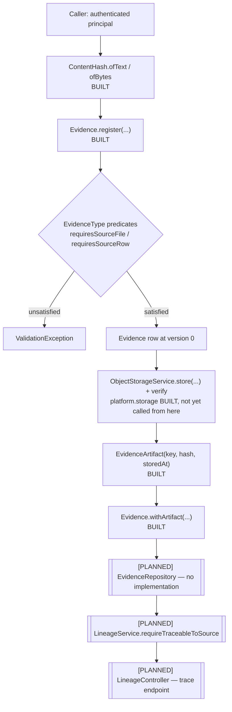
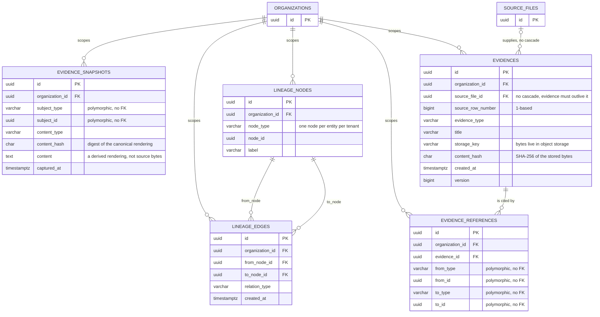
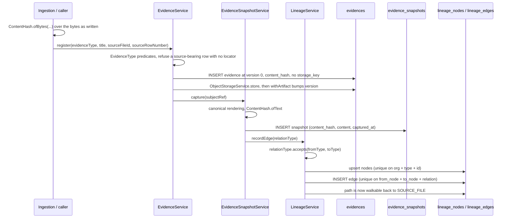

# 09 — Evidence & Lineage

Module: `com.fintech.cfo.evidence`
Tables (V7): `evidences`, `evidence_references`, `evidence_snapshots`, `lineage_nodes`, `lineage_edges`

---

## A. WHY this module exists

When a finance team is asked "where did this €412,000 number come from?", the only
defensible answer is a chain that ends at a row of a file somebody uploaded. Without
this module, the system holds the number and the upload, and nothing that binds them:
the figure is re-typed into a report, the file is overwritten by a later upload of the
same name, and the audit trail is a claim about a claim. The unsafe outcome is not a
crash — it is a figure that is still arithmetically correct and no longer defensible,
which is the failure a regulator accepts as evidence of a control that never existed.
This module exists to make that chain explicit, and to make it impossible to silently
re-point a citation after the fact.

Its hard invariants, restated everywhere below:

- **No bytes in a business row.** Artifacts are a storage key plus a digest
  (`EvidenceArtifact`); the payload lives in object storage. The one exception is a
  snapshot's *rendering*, which is derived, not source.
- **A claim's identity is frozen at registration.** `evidence_type` and the source
  locator never change; only the storage pointer (attach once, clear once) and the
  restated digest may move, and each move bumps `version`.
- **A source-bearing evidence row must be locatable.** `EvidenceType` decides which
  source columns become mandatory, and the compact constructor refuses the rest.
- **Row numbers are 1-based everywhere.** A zero-based coordinate beside a 1-based
  parser sends a reviewer to the wrong line and looks correct.
- **An unrecognised code is an error, never a default.** Resolution failures throw.
- **Nothing here validates tenancy or existence.** Those need a query, not a value;
  they belong to the persistence and traversal passes.

## B. FLOW — the runtime journey

Only the value layer runs today. The graph, the traversal, the HTTP surface and the
persistence are all placeholders, so the journey below is a walk of the *design*; each
step states plainly whether it executes.

1. **Trigger** — a caller that has just parsed or received a figure. **Where** —
   `ContentHash.ofText` / `ofBytes` (`ContentHash.java:110`, `:133`). **What** — pins
   the charset or takes the bytes as written. **Why** — the digest must be reproducible
   on any machine that later re-verifies it, so nothing about the environment may leak
   into the value.
2. **Trigger** — the same caller registering the claim. **Where** —
   `Evidence.register` (`Evidence.java:160`). **What** — assembles the row at
   version 0 with no storage key. **Why** — the caller supplies the id and the
   instant, so a batch of registrations is reproducible and cross-module references
   are stable.
3. **Trigger** — construction. **Where** — the compact constructor
   (`Evidence.java:99`), driven by `EvidenceType.requiresSourceFile()` /
   `requiresSourceRow()` (`EvidenceType.java:126`, `:148`). **What** — refuses a
   source-bearing row with no file, or no row. **Why** — an unverifiable claim stored
   as evidence is worse than a missing claim, because a reviewer will trust it.
4. **Trigger** — the document is available for storage. **Where** —
   `platform.storage.ObjectStorageService.store` / `verify`
   (`ObjectStorageService.java:60`, `:76`) — `[PLANNED]` *from this module*: the
   service is built and used elsewhere, but no evidence code calls it. **What** —
   writes under a tenant-prefixed key and hashes the stream. **Why** — tenant
   prefixing in the key is what stops one tenant's key reaching another's evidence,
   and hashing at the port is what makes an integrity claim possible at all.
5. **Trigger** — the write succeeds. **Where** — `EvidenceArtifact` constructor
   (`EvidenceArtifact.java:42`) → `Evidence.withArtifact` (`Evidence.java:233`).
   **What** — attaches the pointer once, bumping the version. **Why** — the
   immutability rule lives in exactly one place; re-pointing an evidence row would
   leave a reviewer holding a digest of content the row no longer refers to.
6. **Trigger** — a reviewer asks where a number came from. **Where** —
   `LineageService`, `LineageController`, `LineageRepository` — `[PLANNED]`, all
   three are placeholders. **What** — nothing runs. **Why** — the traversal needs
   `lineage_nodes` and `lineage_edges` to exist, and neither has a type yet.
7. **Trigger** — same question, evidence-only. **Where** —
   `SourceLocation.matches` (`SourceLocation.java:90`) — **BUILT** and callable
   today. **What** — confirms a locator and a canonical `SourceReference` name the
   same file and row. **Why** — it is the check that closes the gap between the
   evidence row and the financial record it claims to be about.

### ER diagram — V7 `V7__create_evidence_lineage.sql`

The diagram shows two representations of provenance, kept apart on purpose.
`EVIDENCES` and `EVIDENCE_REFERENCES` are the *direct, typed* one: an evidence row
plus a typed link from some object to it, and the link is polymorphic at both ends
because evidence is captured about entities across every module. `LINEAGE_NODES`
and `LINEAGE_EDGES` are the *general* one: a graph whose node identity is the
entity itself, so a derived object (a calculation, a normalised record) that is not
evidence in its own right can still sit on the chain. Collapsing the two would force
every direct reference to be described in the vocabulary of the graph.
`EVIDENCE_SNAPSHOTS` is deliberately *not* joined to anything — it is a frozen
rendering of a subject, held inline because it is a derived view rather than source
bytes, and it is a citation target rather than a node in the walk.
`SOURCE_FILES` points at `EVIDENCES` with **no** `ON DELETE CASCADE`, and that
single choice is the difference between a deletion cascade that can withdraw the
proof and one that cannot. Note the names: V7 creates `evidences` (plural) and
`evidence_snapshots`; there is no `evidence` table and no `evidence_artifacts`
table — the artifact is `storage_key` plus `content_hash` on `EVIDENCES` itself,
which is why no bytes live in a business row.

#### The constraints that matter, and what each one prevents

- **`ux_evidence_snapshots_subject_hash (organization_id, subject_type, subject_id,
  content_hash)`.** Re-capturing identical content for the same subject is a no-op
  rather than a new row, which is what stops a nightly job growing the table without
  adding evidence. Scoped per tenant, so two tenants may legitimately hold the same
  content independently.
- **`ux_evidence_references_edge (from_type, from_id, to_type, to_id)` — note it has
  no `organization_id`.** Recording the same reference twice is impossible, and the
  same edge must not exist twice even if reached from two tenants' contexts; the
  endpoints are UUIDs, so the key is already unambiguous.
- **`ux_lineage_edges_edge (from_node_id, to_node_id, relation_type)`.** Makes the
  lineage builder idempotent, and the same pair may legitimately carry two
  different relation types. The absence of `organization_id` here is not an
  oversight — node ids are tenant-scoped already.
- **`ON DELETE CASCADE` on both `lineage_edges` endpoints.** Deleting a node removes
  its edges rather than leaving edges that point at nothing, which would make a
  traversal silently incomplete — the worst failure mode for an audit answer,
  because the walk returns a short chain rather than an error.
- **`evidences.source_file_id` with no cascade.** Evidence must outlive the
  ingestion run that produced it and certainly the file record itself. Retaining
  raw uploads cannot be allowed to withdraw the proof.
- **`ux_lineage_nodes_node (organization_id, node_type, node_id)`.** One node per
  entity per tenant, so a traversal that crosses module boundaries joins on a
  unique key rather than fanning out across duplicate registrations of the same
  entity.

#### Main write path

## C. FILES — every file in the module

**26 files: 11 built, 15 stub.**

| file | status | purpose | key types / lines |
|---|---|---|---|
| `model/ContentHash.java` | BUILT | Validated 64-hex SHA-256 digest | `of:70`, `ofText:110`, `ofBytes:133` |
| `model/Evidence.java` | BUILT | One `evidences` row | `register:160`, `withArtifact:233` |
| `model/EvidenceArtifact.java` | BUILT | Pointer to a stored object | ctor `:42`, `pointsAtSameObject:83` |
| `model/SourceLocation.java` | BUILT | File + 1-based row pair | `matches:90`, `describe:112` |
| `model/SubjectRef.java` | BUILT | Typed pointer at any subject | `wellKnownType:47` |
| `model/package-info.java` | BUILT | Column-by-column contract | invariants `:13`, snapshot exception `:43` |
| `enums/CodedEnum.java` | BUILT | Shared coded-set contract | `normalise:50`, `requireColumnWidth:71` |
| `enums/EvidenceType.java` | BUILT | Closed proof vocabulary | `requiresSourceFile:126`, `isDerived:168` |
| `enums/LineageRelationType.java` | BUILT | Edge meaning + direction | `accepts:165`, `traceabilityChain:185` |
| `enums/SourceType.java` | BUILT | Open subject vocabulary | `of:101`, `isSourceLevel:194` |
| `enums/package-info.java` | BUILT | Why enums, why not for `SourceType` | forward refs `:32` |
| `model/LineageNode.java` | STUB | One vertex of the provenance graph | contract only |
| `model/LineageEdge.java` | STUB | One directed, typed hop | contract only |
| `model/EvidenceSnapshot.java` | STUB | Frozen rendering of a subject | contract only |
| `model/EvidenceReference.java` | STUB | Evidence ↔ subject edge | contract only |
| `service/EvidenceService.java` | STUB | Registration + attach orchestration | contract only |
| `service/EvidenceSnapshotService.java` | STUB | Capture and freeze a subject state | contract only |
| `service/LineageService.java` | STUB | Graph walk and traceability verdict | contract only |
| `repository/EvidenceRepository.java` | STUB | `evidences` access | contract only |
| `repository/EvidenceReferenceRepository.java` | STUB | `evidence_references` access | contract only |
| `repository/LineageRepository.java` | STUB | nodes and edges access | contract only |
| `controller/EvidenceController.java` | STUB | Evidence HTTP surface | contract only |
| `controller/LineageController.java` | STUB | Trace HTTP surface | contract only |
| `dto/EvidenceResponse.java` | STUB | List projection | contract only |
| `dto/EvidenceDetailResponse.java` | STUB | Detail projection | contract only |
| `dto/LineageResponse.java` | STUB | Graph projection | contract only |

`STUB` here means an empty class body carrying a generator `TODO`. Everything this
chapter says about a stub is a contract, never observed behaviour.

## D. DEEP DIVE

### `model/ContentHash.java` — the integrity claim

**`public static ContentHash of(String hexDigest)`** — wraps a digest that already
exists. Returns the normalised digest; throws `ValidationException` when the value is
null, blank, not 64 characters after trimming, or contains a non-hex character.

Step by step: reject null/blank → `trim().toLowerCase(Locale.ROOT)` → length check →
per-character alphabet check → construct. The trim comes first because `CHAR(64)`
*pads* rather than truncates, and padding must not reach the comparison. The
`Locale.ROOT` is not decoration: a default-locale lower-case maps `I` differently in
several locales, and this value is compared against a replay taken months later on a
differently configured server, so the defect would appear intermittently and only in
production. The alphabet scan is what stops a 64-character non-digest from being
accepted — such a value would match nothing and deduplicate nothing, and would fail
silently for the life of the table.

**Why a content hash at all, rather than length or timestamp.** Length cannot detect
a change that preserves size, which is the common case for a corrupted or substituted
document. A timestamp records when, not what: a restore from backup, a copy-forward by
the storage vendor, or an edit that preserves mtime all leave it untouched. Only a
digest over the content answers the only question audit cares about — *is this the same
object I registered?* The type exists to make that answer a first-class, shape-checked
value rather than a bare `String`, because the columns holding it are
`CHAR(64) NOT NULL` and a padded or 60-character value read back would look like a
valid hash and deduplicate nothing.

**The verification path.** `ofBytes` is the ingestion side: the exact bytes handed to
`platform.storage.ObjectStorageService.store`. `ObjectStorageService.verify`
(`ObjectStorageService.java:76`) re-hashes the retrieved stream and compares against
`StorageObject.checksum()`. The digest that closes the audit claim is the one in
`evidences.content_hash`, produced from the same bytes and compared by the same
`HashUtils.sha256` — which is why the algorithm is chosen once, in `HashUtils`, and no
caller picks its own.

**Why a hash over re-serialised bytes is the failure that matters.** `ofText`
(`:110`) is for canonical *renderings*; `ofBytes` (`:133`) is for documents. If an
uploaded PDF were decoded, parsed and re-encoded before hashing, the digest would
describe a document that was never stored. Verification would then report a mismatch
on a file nobody altered — a false tamper signal that trains reviewers to ignore
tamper signals, which is strictly worse than having no integrity check at all, because
the one alarm the system owns becomes noise. This is why `ofBytes` takes the bytes as
written and `ofText` pins UTF-8 rather than deferring to the platform charset.

**A collision.** SHA-256 over adversarial input is not known to be broken, and the
digest is deliberately unsalted because a checksum nobody can recompute is not a
checksum (`ContentHash.java:20`). The real audit risk is therefore not collision but
*substitution of a legitimately different document*: an attacker who can write the
object store can also recompute the digest. The hash proves the object is the one that
was registered; it does not prove the registration was honest. That is what the source
locator and the lineage chain are for, and the two defences failing independently is
why neither is described as sufficient.

**Design choices worth naming.** The constructor is private, so no instance exists
outside the three factories: the difference between `of` (a caller asserting a digest)
and the two hashing factories (this module computing one) is the difference between a
verified and an unverified value, and collapsing them would let an asserted digest
claim the same authority as a computed one (`:44`). `ofText`/`ofBytes` construct
directly rather than calling `of`, because re-scanning the alphabet on every snapshot
would cost a pass for no additional guarantee (`:114`). Final class, not a record: the
only state is the digest, and all behaviour is deriving or checking one.

### `model/Evidence.java` — one claim, and what "immutable" means here

**`public static Evidence register(...)`** — the factory for a new claim. All nine
parameters pass through to the compact constructor with `storageKey = null` and
`version = 0`. The id is caller-supplied because other modules' records reference it;
generating one here would make a batch of registrations non-reproducible for no
benefit (`:145`). The `organizationId` comes from the caller, which the contract says
is the authenticated principal and never a request body (`:148`) — that is a stated
obligation of the caller, not something the value can enforce. `now` is supplied for
determinism. Version 0 matches the V7 `DEFAULT`, so an in-memory row and one read
back from the database compare equal before any update (`:168`).

⚠ **Review — stale Javadoc on `register`.** The one-line Javadoc at `Evidence.java:144`
reads "A newly registered row with no stored artifact and no source locator yet", but
the factory passes `sourceFileId` and `sourceRowNumber` straight through at `:169`, and
the inline comment at `:163` reinterprets the sentence as being about the *artifact*
side only. For a `SOURCE_ROW` — the common case — the row is registered already
pointing at the row it was read from. The behaviour is right; the summary line is
wrong, and a reader who trusts it will assume every evidence row starts unanchored and
write code that re-derives a locator that is already there.

**Immutability, precisely.** Not "frozen". `storageKey` may be attached once and
cleared once; `contentHash` may be restated. What never changes after registration is
`evidenceType` and the source locator (`:40`) — the two columns that define *what was
claimed and where it came from*. The rule exists so a figure cited from this row can
never be silently re-pointed at different data while keeping its old citation
(`:45`).

**`public Evidence withArtifact(EvidenceArtifact artifact, Instant now)`** — attaches
the stored pointer, or re-attaches the identical one. Throws on a null artifact, and
on a *different* key than the row already holds (`:243`). Returns a new row at
`version + 1` with `createdAt` carried over, so an update is visibly a later state of
the same row rather than a replacement (`:247`).

The WHY is one sentence at `:238`: re-pointing would leave a reviewer holding a digest
of content that is no longer what the row refers to — *a record that verifies and is
wrong*, which is the one state worse than no record at all. Re-attaching the *same* key
is allowed because re-uploading identical bytes under one key is the same evidence,
not a new claim.

**`withoutStorage(Instant now)`** (`:266`) — clears the pointer, keeps the digest. The
digest is what lets a later re-upload of the same bytes be recognised as the same
content rather than a new proof, and it preserves the record of *what the object was*
after the object is gone under retention. Idempotent: returns `this` when there was no
key, rather than a copy with a bumped version, because a second call that looks like
an edit would train callers to expect a version conflict where none occurred (`:268`).

**`withContentHash(ContentHash newHash, Instant now)`** (`:278`) — restates the digest
on re-verification. Deliberately *not* conditional on whether the value changed: a
re-verification that finds a difference must be able to record the observed digest even
when the row is about to be flagged as tampered, and suppressing the bump for a no-op
would hide that a check ran (`:282`).

**Derived accessors.** `sourceLocator()` (`:183`) reads the two columns together
rather than holding a copy as its own field, because a second copy could drift from
the columns it mirrors. `isStoredExternally()` (`:203`) is a plain null check —
`storageKey` is normalised to null rather than `""` by the constructor, so it cannot be
fooled by whitespace. `isIndependentlyVerifiable()` (`:215`) delegates to the type and
is explicitly *not* the same question as `isStoredExternally`: a `CONTRACT_TERM` is
verifiable and stored nowhere, a `SNAPSHOT` may be stored and not verifiable by anyone
outside this system, and letting a report substitute one for the other would let it
present a stored opinion as a checkable proof (`:196`).

⚠ **Review — broken Javadoc link.** The paragraph at `:36` links
`{@link #withStorageKey}`, a method that does not exist; the transition it describes is
`withArtifact`. The stale link is acknowledged in prose at `:56` and is recorded here
rather than silently corrected. Same class of defect as the `register` line above:
documentation that describes a different lifecycle from the code.

**`auditDetail()`** (`:301`) — a pipe-delimited `key=value` line carrying type, id,
version, source and stored flag, assembled from `sourceLocator()` so the audit line
cannot disagree with the domain view of the same row (`:293`). It carries identifiers
and coordinates only, never money, because this is rendered in audit detail where a
figure would be quoted back as if it were the evidence.

**Referential integrity is deliberately absent.** `sourceFileId` is a plain `UUID`, not
a reference to an ingestion type, because `evidences.source_file_id` is a foreign key
onto a table another module owns. The cost is that this type cannot prove the file
exists or belongs to the same tenant; that check belongs to the persistence pass
because it needs the query, not the value (`:48`). `version` exists for the same
reason: a repository needs a column it can put in a `WHERE` clause, and a value object
cannot conjure one (`:53`).

### `model/EvidenceArtifact.java` — the pointer, and what it deliberately omits

**Compact constructor** (`:42`) — three refusals, no defaults. A blank `storageKey`
means an unaddressable object that still renders as "stored evidence" (`:43`); a null
`contentHash` means bytes that can never be re-proven (`:51`); a null `storedAt` is
refused because a snapshot of *when* an object was written is part of a provenance
claim, and a re-verification months later has to say whether it saw the original
upload or a restore from backup (`:55`). `storedAt` is the caller's instant, never
`Instant.now()`. The key is trimmed *after* the width check so the check measures what
would actually be persisted — a key that only fits thanks to padding would pass here
and be truncated by the column, leaving the stored pointer different from the
in-memory one (`:62`).

**`pointsAtSameObject(EvidenceArtifact other)`** (`:83`) — compares the key alone.
It deliberately ignores `contentHash` and `storedAt` (`:75`): a differing digest under
the same key is a *tampering signal to be reported*, not a difference of identity, and
folding the hash into this method would turn a detection into a silent refusal. That
distinction is the whole reason the method exists separately from `withArtifact`'s
conflict check.

⚠ **Review — `model/package-info.java:26` misdescribes this type.** It says artifacts
are held as "a storage key, a content type, a length and a checksum". The actual
record is `EvidenceArtifact(String storageKey, ContentHash contentHash, Instant
storedAt)` (`:29`). Content type and length live in
`platform.storage.StorageObject` (`StorageObject.java:29`), which also carries a
`sizeHuman` display string that must never be parsed. The no-bytes argument the
paragraph makes is sound; its inventory of the fields is wrong, and a reader who
trusted it would look for `contentType` on the artifact and find nothing.

### `model/SourceLocation.java` — the other end of `matches(...)`

**Compact constructor** (`:42`) — a null file is refused outright; the row number
stays optional on purpose, because evidence about a whole uploaded file legitimately
has no single row, but a non-positive number is refused everywhere (`:37`). This
duplicates the check in `Evidence`'s constructor on purpose: both types can be built
independently, and a 0-based coordinate stored beside a 1-based parser points a
reviewer at the wrong line while looking entirely correct.

**`matches(SourceReference reference)`** (`:90`) — the other end is
`shared.domain.SourceReference` (`SourceReference.java:17`), the type the canonical
financial records use. Returns true only when *both* sides name the same file and the
same 1-based row; false whenever any component is missing on the reference side
(`:94`). A partial match is the dangerous outcome and is refused deliberately: it would
confirm a row actually read from a different upload of the same file name (`:92`).

Two implementation notes carry real decisions. The file id is compared on string
forms (`sourceFileId.toString().equals(reference.sourceFileId())`) because the two
types disagree on spelling it — `SourceReference` carries its file id as text,
inherited from the boundary where records arrive from upstream, and normalising to a
string keeps this type free of a parsing dependency it needs only to answer yes/no
(`:82`). The row is compared with `longValue()` on both sides because one side may be
boxed from a parser, and unboxing by identity comparison would fail above the `Long`
cache — a failure that would appear on large row numbers only (`:97`).

**`describe()`** (`:112`) — omits the row segment entirely when there is none, so a
file-level reference does not render as `row=null` in a log a reviewer is expected to
read (`:106`).

`SourceLocation` is deliberately *not* a `SourceReference`. The evidence row does not
record which upstream system or which record inside the file a row came from, because
V7 has no columns for it; inventing those fields would create a second,
partially-populated spelling of provenance that could disagree with the canonical one
(`SourceLocation.java:14`). `matches` is what closes that gap without duplicating it.

### The graph model: `SubjectRef`, `LineageNode`, `LineageEdge`

**`SubjectRef(SourceType subjectType, UUID subjectId)`** (`:28`) — the typed pair V7
stores as `from_type`/`from_id` in `evidence_references` and `subject_type`/
`subject_id` in `evidence_snapshots`. Wrapping it once means a lookup can never mix a
subject id with the wrong subject type, which is the mistake that turns "the evidence
for this invoice" into "some evidence, found by id" (`:15`).

Compact constructor requires both halves; there is deliberately **no tenancy check**
(`:32`) — a `SubjectRef` names a subject, not a row, and whether that subject exists
and belongs to the caller is a question only a tenant-scoped query can answer. Tenancy
is carried by the enclosing row.

`wellKnownType()` (`:47`) returns the `SourceType` or null, not a boolean: a caller
that has already resolved the type does not pay for a second lookup, and the
transition from "unknown subject" to "known subject" stays visible in the type instead
of being flattened into a flag. `toString()` (`:60`) yields `TYPE:id`, which carries no
attribute of the subject itself and is therefore safe to log.

**`LineageNode`** and **`LineageEdge`** are `STUB` — empty classes with a generator
`TODO`. The contract, from `model/package-info.java:20`: a `LineageNode` at source
level **must** carry a `SourceReference`, using the same type the financial records
use so one chain shape serves both and no second spelling of "where did this come from"
can drift out of step. The obligation is stated on the *node type*, not on whichever
module owns the row, because the node type is the only place that knows the full set
of hops and an owning module cannot be trusted to remember for its own types
(`SourceType.java:168`). `LineageEdge` will carry a `LineageRelationType`, whose
`accepts(SourceType)` (`:165`) validates the `to` side and whose `Direction` decides
which walk may follow it. Neither can be checked today — the package doc says so
explicitly (`package-info.java:31`).

### `model/EvidenceSnapshot.java` and `model/EvidenceReference.java`

Both `STUB`. Their contract is worth stating because the snapshot is the one place
where this module's central rule bends.

`EvidenceSnapshot` must be immutable — a snapshot that a later update can rewrite
provides no frozen state at all — and its `content_hash` is the digest of the canonical
rendering it stores inline, computed through `ContentHash.ofText`. That inline
`TEXT` column (`evidence_snapshots.content TEXT NOT NULL`) is **consistent with the
no-bytes rule rather than an exception to it**, because a snapshot holds a *derived
view* — the state of a subject at the moment a claim was made — and never the source
document it was derived from (`package-info.java:43`). The original bytes stay
addressable through the `SourceLocation` chain, so nothing becomes unverifiable by
being frozen. A snapshot is therefore a citation target, not a provenance target.

`EvidenceReference` is the edge between a subject (`SubjectRef`) and the evidence
supporting it, shaped as `from`/`to` with a `LineageRelationType` —
`SUPPORTED_BY_EVIDENCE` and `SUPPORTED_BY_SNAPSHOT` are the two variants that apply
(`LineageRelationType.java:42`, `:45`).

### `enums/SourceType.java` — two predicates that look identical

**Open vocabulary as a final class.** V7 stores these columns as free text with no
lookup table, and subjects owned by other modules legitimately appear in them — an
investigation must be able to say "this snapshot is about an investigation". A closed
enum would make that impossible without editing this module every time another module
grows a subject, which is exactly the coupling the module boundary exists to prevent
(`:19`). The five hops of the chain are fixed as named constants;
`of(String)` (`:101`) accepts any other well-formed code, upper-cased, trimmed and
bounded to the V7 `VARCHAR(64)` width, refusing only empty. The type says a code is
well formed; it cannot say the investigation it names exists, and inventing a foreign
key check here would be a lie about what the module guarantees (`:25`).

**Interning is correctness, not optimisation** (`:93`): the walk compares subject
types for equality thousands of times per trace and must not depend on how many times
`of` was called. `of` normalises *before* the width check so a well-known code returns
the interned constant regardless of casing, and only a non-well-known code is
width-checked (`:106`). Note that `belongsTo` (`:222`) compares by *code*, not by
identity, precisely because a hand-built instance from a raw row has the same code and
a different identity — `==` there would silently report a source row as not
source-level.

⚠ **Review — `bearsSourceCoordinates()` and `isSourceLevel()` are byte-identical.**
`SourceType.java:176` and `:194` both return
`belongsTo(CANONICAL_RECORD, SOURCE_ROW, SOURCE_FILE)`. That is deliberate, and the
code says so at `:177`: one states an *obligation on construction*, the other
*classifies a position in the walk*. Merging them would make a future type that is
source-level without bearing coordinates impossible to express. They are kept apart so
that "well formed" and "terminal for traversal" can diverge when the vocabulary grows
— for example, a `SOURCE_FILE` reachable by checksum alone. Kept as-is; a reviewer
seeing two identical methods should read the comment, not "simplify" it.

`isClaimLevel()` (`:207`) is the third axis: opportunities, calculation runs and
calculation results are where a monetary claim is made. Everything between the claim
and the source is intermediate and contributes no claim of its own, which is why an
intermediate node can never be the answer to "where did this number come from".

### `enums/EvidenceType.java` and `enums/LineageRelationType.java`

`EvidenceType` is a closed enum because the type *decides what a row must point at*
(`:11`). All four predicates are exhaustive `switch` expressions with every constant
listed and no `default` (`:131`, `:149`, `:172`, `:192`) — an omitted constant would
compile, and the omission would read as "this new proof type needs no source file",
which is exactly the claim the method exists to force someone to make on purpose
(`:127`). `fromCode` (`:85`) has no fallback variant: an unrecognised code means the
column and the enum have drifted, and resolving it to something plausible would
mis-attribute a proof to the wrong kind of claim (`:100`).

`isDerived()` and `isIndependentlyVerifiable()` are two axes, not one.
`INTEGRITY_ATTESTATION` is derived in spirit but machine-checkable, because a reviewer
can re-hash the stored object and compare; treating "derived" and "unverifiable" as one
axis would put a cryptographic proof in the same bucket as a reviewer's opinion
(`:184`). `INVOICE_LINE` is deliberately *not* derived: it is a normalisation of a file
row, and its addressability to the upload is what makes it source-bearing evidence
(`:169`).

`LineageRelationType` (`:24`) makes the chain shape checkable: each of the ten
variants declares the `SourceType` it may point at and a `Direction`, asserted at
construction so an unusable variant fails at class-load (`:68`, `:73`).
`traceabilityChain()` (`:185`) names the four required hops in order —
`DERIVED_FROM`, `RECONCILED_WITH`, `SOURCED_FROM`, `BELONGS_TO_FILE` — exposed so the
walk and the tests cannot disagree about what "traceable" means. `Direction` has three
values, not two, because calculation-directed edges run *upward* out of a claim and
are not part of the source walk; keeping them in the same closed set means no edge
ever defaults to "toward source" (`:197`). `isTowardSource()` (`:151`) is the single
predicate a trace filters on, and because it is a property of the relation rather than
of the edge row, a graph mixing evidence-directed edges into the source chain cannot
send a trace sideways or revisit a node — which is what bounds the walk.

`CodedEnum` (`:27`) is the shared contract, with `normalise` (`:50`) pinning
`Locale.ROOT` for the same Turkish-`i` reason as `ContentHash`, and
`requireColumnWidth` (`:71`) re-checking the width on the *read* path so a
hand-written value cannot slip past. It is a local copy of the identical contract in
`contract.enums` and `financialtruth.enums` — a business module must not depend on
another business module, and a shared constant package would be a dependency this pure
module has no reason to carry (`:22`).

### The remaining stubs — contract only

Nothing below executes. Each is an empty class body; this is the obligation the
migration's table implies and the rest of the module already assumes.

- **`service/EvidenceService`** — orchestrate register → store → attach → audit.
  Invariants: registration validates before any write; attachment happens once; every
  state change bumps `version`; `EVIDENCE_ATTACHED` is emitted with
  `Evidence.auditDetail()` as the detail; a failed store leaves the row unregistered
  rather than pointing at nothing.
- **`service/EvidenceSnapshotService`** — capture a subject's state at the moment a
  claim is made. Invariants: the rendering is canonical and deterministic (same input,
  same `ContentHash.ofText` digest, on every machine); the snapshot carries its
  `SubjectRef`; a snapshot never captures source bytes.
- **`service/LineageService`** — the walk, and the traceability verdict. Invariants:
  only `isTowardSource()` edges are followed; each hop's `to` side must satisfy
  `accepts()`; a walk terminates on a source-level node or fails; a derived evidence
  row is admissible only alongside the source-bearing evidence beneath it
  (`EvidenceType.isDerived()`, `:160`).
- **`repository/EvidenceRepository`** — `evidences` access. Invariants: every query is
  `organization_id`-scoped; updates carry `version` in the `WHERE` clause; hash
  equality is by `content_hash` for dedup, not by id.
- **`repository/EvidenceReferenceRepository`** — `evidence_references` access, keyed by
  `(from_type, from_id)`. Invariant: lookups always supply both halves of the
  `SubjectRef`, never the id alone.
- **`repository/LineageRepository`** — `lineage_nodes` and `lineage_edges` access.
  Invariants: edge insertion validates `accepts()` before write; node insertion
  validates that a source-level node carries its `SourceReference`.
- **`controller/EvidenceController`**, **`controller/LineageController`** — HTTP
  surface. Invariants: the tenant comes from the principal, never a body parameter;
  error responses do not disclose whether another tenant's object exists (the pattern
  `ObjectStorageService.requireTenantPrefix` already follows at `:107`).
- **`dto/EvidenceResponse`**, **`dto/EvidenceDetailResponse`**, **`dto/LineageResponse`**
  — projections. Invariants: no `content` field on any response; digests and storage
  keys may be shown, bytes may not; `LineageResponse` is a graph, not a list, and must
  preserve edge direction so a client cannot reorder the chain.

⚠ **Review — two `@link` targets do not exist.**
`LineageRelationType.java:14` links `com.fintech.cfo.evidence.model.LineageStep`, and
`EvidenceType.java:161` links
`LineageService#requireTraceableToSource`. Neither type nor method is present. Both are
deliberate forward references to the contract the traversal pass must satisfy, recorded
as such in `enums/package-info.java:32` and left in place because deleting the
statement of an invariant is not a way to make it true. Documented here so a reader
does not file them as typos and "fix" them by deleting the sentence.

### The lineage walk: from a computed number back to source rows and files

Four hops, declared by `traceabilityChain()` and typed by `LineageRelationType`. The
walk is designed end to end; only the vocabulary and one verification check exist.

| hop | relation | from → to | status |
|---|---|---|---|
| 1 | `DERIVED_FROM` | `CALCULATION` → `AFFECTED_TRANSACTION` | `[PLANNED]` |
| 2 | `RECONCILED_WITH` | `AFFECTED_TRANSACTION` → `CANONICAL_RECORD` | `[PLANNED]` |
| 3 | `SOURCED_FROM` | `CANONICAL_RECORD` → `SOURCE_ROW` | `[PLANNED]` |
| 4 | `BELONGS_TO_FILE` | `SOURCE_ROW` → `SOURCE_FILE` | `[PLANNED]` |
| check | — | `SourceLocation.matches(SourceReference)` | **BUILT** |

What is genuinely executable today: the four predicates that define the walk
(`isTowardSource`, `accepts`, `bearsSourceCoordinates`, `isSourceLevel`) and
`SourceLocation.matches` (`SourceLocation.java:90`), which is how hop 3's
reconstructed row is confirmed to be the row an `Evidence` row already claims rather
than a row that merely looks similar. Everything that *traverses* — the node store,
the edge store, the recursion, the controller endpoint — is `[PLANNED]`, and
`LineageService.requireTraceableToSource`, the method `EvidenceType.isDerived()` is
written against, does not exist.

Off the required chain, `SUPPORTED_BY_EVIDENCE` and `SUPPORTED_BY_SNAPSHOT` point
toward evidence and `QUANTIFIED_BY` / `PRODUCED_BY` / `COMPUTED_FROM` point upward
toward the calculation. They are traversed by different questions — what can be shown
to a reviewer, and how the figure was computed — and mixing them into the source walk
is what the `Direction` separation prevents.

## E. GOTCHAS — what breaks if you get it wrong

Ranked by consequence. The first two are audit-severity; neither throws.

**1. A snapshot that is not immutable**

- **Symptom** — two reviews of the same opportunity produce two different "as at"
  figures, and nobody can say which was shown to the approver.
- **Cause** — `EvidenceSnapshot` is a `STUB`; when it is written, an update path that
  re-renders and overwrites `content TEXT` instead of inserting a new row. The digest
  column is what makes this visible only if the writer also refuses to restate it.
- **Blast radius** — evidence. A snapshot is a *citation target*: it is what a decision
  was taken on. If it can change, every decision citing it inherits the change, and
  the audit trail records a timestamp with no stable referent.
- **Fix** — insert-only. A new state is a new snapshot row with a new digest; the old
  row is never touched. `ContentHash.ofText` over a canonical rendering makes a
  rewritten snapshot detectable by digest even if a bug allows the write.

**2. A hash taken over re-serialised bytes**

- **Symptom** — verification reports a mismatch on a document nobody altered, or,
  worse, reports a match for a document that was.
- **Cause** — `ContentHash.ofText` used on a decoded-and-re-encoded document instead
  of `ofBytes` on the bytes as written (`ContentHash.java:123`); or `StorageObject.sizeHuman`
  treated as authoritative instead of `contentLength` (`StorageObject.java:20`).
- **Blast radius** — evidence and, downstream, every tamper alert. A false positive
  here is the more damaging direction: a reviewer who is told twice that an intact file
  is corrupt stops believing the check, and the real alteration is then waved through.
- **Fix** — hash the stream at the port boundary
  (`ObjectStorageService.verify`, `:76`) and compare against the digest registered from
  the same stream. Never re-encode a stored object to check it.

**3. Evidence attached to a subject that later moves**

- **Symptom** — a trace resolves to a subject id that no longer exists, or to a
  *different* subject that now carries the id after a merge.
- **Cause** — `SubjectRef` names a subject by `(type, id)` with no tenancy check
  (`SubjectRef.java:32`) and no snapshot of its state. `LineageRelationType.SUPERSEDES`
  exists for canonical-record replacement but nothing consumes it yet.
- **Blast radius** — evidence, and tenancy where the id is reused across organizations
  without a scoped query. "The evidence for this invoice" silently becomes "some
  evidence, found by id".
- **Fix** — always resolve a subject through an `organization_id`-scoped query, and
  point citations at an `EVIDENCE_SNAPSHOT` rather than at a live subject row. The
  snapshot is exactly the mitigation this module already designed for; the failure is
  citing the live row instead.

**4. Source bytes stored inside a business entity**

- **Symptom** — a document lives in two places, one of which no retention job can
  reach.
- **Cause** — adding a `content` or `document` field to `evidences`, to a canonical
  record, or to a snapshot because the V7 `TEXT` column made it look permissible. The
  rule is that only a *derived rendering* may be inline (`model/package-info.java:43`).
- **Blast radius** — evidence, retention, and storage. An inline copy can neither be
  independently re-read against the source system nor independently deleted when
  retention expires, and it silently defeats `ObjectStorageService`'s tenant prefixing
  because the bytes are no longer addressable through a key.
- **Fix** — store `EvidenceArtifact` (key + digest + instant) and let the payload live
  in object storage. If a rendering is needed, treat it as a snapshot and give it its
  own digest.

## F. TESTS — what locks this down

No test class in `src/test` currently covers this module; the built types are
unexercised. The rules below are claims, not guarantees, and the highest-value cases
are named so the gap is actionable.

- **`ContentHashTest`** — *a digest is comparable only if it is well formed.*
  Cases: `of` accepts mixed case and `CHAR(64)` padding; rejects 63 and 65 characters;
  rejects `g` at any position; `ofText` is stable across repeated calls and equals
  `ofBytes` of the same text's UTF-8 encoding; `ofText` on Turkish-defaulted locale
  still matches `ofBytes` (the `Locale.ROOT` guard at `ContentHash.java:79`).
- **`EvidenceTest`** — *a source-bearing claim must be locatable, and a stored claim
  must stay pointed at the same object.* Cases: `SOURCE_ROW` without a file throws;
  without a row throws; row `0` throws; `CONTRACT_TERM` with a file and no row
  succeeds; `withArtifact` on a fresh row bumps the version; `withArtifact` with a
  different key throws; with the same key succeeds; `withoutStorage` twice returns
  the same instance; `withoutStorage` keeps the digest; `withContentHash` bumps the
  version even when the hash is unchanged.
- **`SourceLocationTest`** — *a partial match is a false match.* Cases: `matches`
  returns false when the reference has no file or no row; true only when both agree;
  a row number above the `Long` cache compares by value, not identity (`:97`).
- **`EvidenceTypeTest` / `LineageRelationTypeTest` / `SourceTypeTest`** — *an unknown
  code is an error, and every variant has been classified on purpose.* Cases:
  `fromCode` throws on unknown and blank; `requireColumnWidth` fires on a hand-typed
  over-long code; `SourceType.of("Invoice_Line ")` returns the interned constant;
  `of` on a 65-character code throws; `traceabilityChain()` has four members, all
  `isTowardSource()`; each relation's `accepts()` matches its declared target.
- **`EvidenceSnapshotTest`** *(after implementation)* — *a frozen state never
  changes.* Cases: re-rendering identical canonical text yields an identical digest; a
  second capture inserts rather than updates.

Not covered and not enforceable yet: tenancy isolation, foreign-key existence, the
traversal itself, and cycle bounding. All four depend on the stubs.

## G. WIRING — where this connects

**Today, nothing imports `com.fintech.cfo.evidence.**`.** The module is a leaf: it
imports only `shared` (`OrganizationId`, `SourceReference`, `ValidationException`,
`Preconditions`, `HashUtils`). No controller, service or repository in the codebase
calls it. Everything below is intended wiring, not present wiring.

Consumes (allowed today, by the module-boundary rule):

- `platform.storage.ObjectStoragePort` / `StorageObject` — where the bytes live.
  `StorageObject` carries `contentLength`, `contentType` and `checksum`; the evidence
  row carries only the key and the digest, because a `StorageObject` is a request-path
  handle and pulling one into `evidences` would duplicate the digest in a
  second, independently-writable place.
- `platform.storage.ObjectStorageService` — tenant prefixing, streaming SHA-256, and
  `verify`. Its `NotFoundException` on a foreign-prefix key (`:107`) is the pattern an
  evidence read endpoint must copy.
- `shared.domain.SourceReference` — the other end of
  `SourceLocation.matches` (`:90`).

Designed to consume it, named explicitly:

- `platform.audit.AuditEventType.EVIDENCE_ATTACHED` and `LINEAGE_RECORDED`
  (`AuditEventType.java:71`) — the two events reserved for this module, with
  `Evidence.auditDetail()` as the detail string.
- `opportunity.model.EvidenceReference` — **consumer-owned**, not this module's type.
  Its `locator` is documented as "the evidence module's storage key", so the
  integration is a string agreement on a key produced by
  `ObjectStorageService.buildKey` and validated against `evidences.storage_key`. The
  name collision with `evidence.model.EvidenceReference` is real and deliberate: two
  modules own their own edge type rather than importing each other's.
- The `financial` canonical records — the subjects at hops 2 and 3, each carrying a
  `SourceReference`; `SourceLocation.matches` is the join that confirms the evidence
  row and the record describe the same file and row.
- `contract` for `CONTRACT_TERM` evidence, and the calculation engine for
  `CALCULATION_RUN` / `CALCULATION_RESULT`, both via `SourceType` codes rather than
  imports — the open vocabulary is what makes those references possible without a
  dependency.

What must happen before the wiring is real: the three services and three repositories
must exist, `LineageStep` and `LineageService#requireTraceableToSource` must resolve
the two forward references, and a tenancy-scoped repository must replace the value
layer's stated inability to check existence. Until then the two linked-but-missing
Javadoc targets, the misdescribed `package-info` field list, and the `register`
Javadoc line are documentation defects on a module that no runtime path reaches —
contained, but they will be read as fact by the first person to wire it up.

