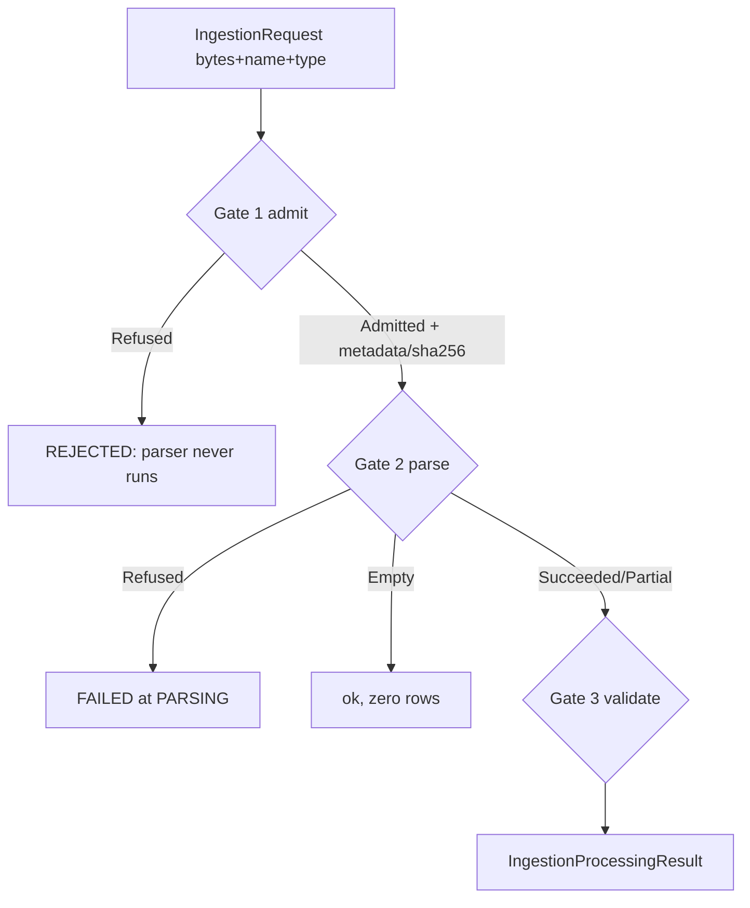

# Ingestion: from upload bytes to trusted rows

## 1. WHY
Supplier files are hostile input: wrong type, too big,
booby-trapped names, mixed currencies. This module refuses
garbage BEFORE parsing, salvages what is readable, and
accounts every row: accepted + rejected + skipped == total.

## 2. HOW (the 3 gates)

## 3. FUNCTION-BY-FUNCTION

### 3a. IngestionService.ingest(request) — the conductor
File: src/main/java/com/fintech/cfo/ingestion/service/IngestionService.java

Signature: `ingest(IngestionRequest) -> IngestionProcessingResult`.
Never returns null, never throws for bad FILES (only for
null request or non-UUID file id = caller bug).

- [L68-71] Create empty result builder, stamp ids
  (run/org/file), status=RUNNING, stage=
  FILE_SECURITY_VALIDATION. Why: every exit path below
  fills this same builder, so no path forgets ids.
- [L73] `admit(request)` = Gate 1. Returns sealed
  Admission: Admitted(metadata) or Refused(reason+findings).
- [L74-84] If Refused: return REJECTED + same stage +
  reason + findings. NOTE: zero rows reported, parser
  never touched. This is what stops a zip-bomb from
  reaching POI/commons-csv.
- [L86-87] If Admitted: unwrap metadata (sha256, size,
  types), record it, advance stage to PARSING.
- [L89-90] `orchestrator.parse(request, metadata)` =
  Gate 2. Picks Csv vs Excel by content-type. Record
  parseStatus on builder (preserved to the end).
- [L92-97] Switch on sealed ParseOutcome (compiler forces
  all 4): Refused->refusedAtParse, Empty->emptyRun,
  Succeeded/Partial->validated. Partial keeps its rows
  AND its failureReason (never claims full file seen).

Example: 100-row CSV, 3 bad rows, 1 blank row ->
validated() returns accepted=96, rejected=3, skipped=1,
status=COMPLETED_WITH_REJECTIONS (derived in build(),
not chosen by caller).

### 3b. FileSecurityService.admit(request) — Gate 1
File: .../ingestion/service/FileSecurityService.java

Signature: `admit(IngestionRequest) -> Admission`.

Order matters (cheapest check first):

1. [L~83-89] Authorization: may this caller upload for
   this org? No -> Refused ACCESS_DENIED (not a file
   problem, so audit can tell them apart).
2. [L69-70 via screen()] screen bytes: size<=25MB,
   extension vs declared vs sniffed bytes agree,
   dangerous signatures (macros, formulas) refuted,
   filename traversal refused (not stripped).
3. [L99-102] On pass: sha256(content) HERE (not re-read
   later, stream may change), build UploadMetadata
   (ids, names, types, length, checksum, PASSED,
   uploadedAt, sourceSystem).

Why sealed Admitted/Refused [L117]: caller CANNOT treat
refusal as pass (type error, not if-forgotten).

### 3c. ParseOutcome — Gate 2 result type
File: .../ingestion/parser/ParseOutcome.java

`sealed interface permits Succeeded, PartiallyRead,
Empty, Refused` [L33-34]. Why not an enum? Enum lets a
caller treat PARTIAL as SUCCESS by accident. Sealed
forces `switch` to handle each shape with its own data:
Succeeded(result with rows), PartiallyRead(result with
rows + failureReason), Empty(result, rows()=empty),
Refused(rejection only, no rows).

- `of(FileParseResult)` [L62-70]: maps parser's status
  enum to the type. No re-deciding.
- `rejectionOf()` [L77-85]: reuses parser's first error
  finding as the FileRejection, else CORRUPT_FILE. Never
  invents a new reason (DB ingestion_errors must match).
- `refusal()` [L51-56] default: Optional present ONLY
  for Refused. Callers cannot read a reason off success.

### 3d. validated() + refusedAtParse() + emptyRun()
Same IngestionService file.

- validated(builder, request, parse) [L108-126]:
  FileValidationService.validate(parse, schema, asOfDate,
  limits) checks header vs schema, per-row types, date<=
  asOf, currency allowlist, 200k cap. If parse was
  PARTIAL, carry parse.failureReason forward [L113-118].
  Then acceptAll+rejectAll+findings+skipRows+stage=
  DATA_QUALITY_VALIDATION+build(). build() derives
  COMPLETED vs COMPLETED_WITH_REJECTIONS from row lists.
- refusedAtParse [L132-139]: status FAILED, stage
  PARSING, reason = reader's own "reason: detail"
  (reader and run can never disagree), plus a
  file-level finding for the errors table.
- emptyRun [L146-150]: NOT a failure. Readable file,
  zero rows. Distinct reason string so operators tell
  "nothing there" from "corrupt".

## 4. WHAT BREAKS IF YOU CHANGE IT
- Letting parser run before admit = security hole.
- Treating Empty as FAILED = false alarms on legit
  empty exports. Treating Partial as Succeeded = silent
  data loss. Treating Incomplete discount as zero (in
  truth module) = invented money.
- fileIdOf [L167-176]: sourceFileId String MUST parse
  as UUID (V3 column type). Non-UUID throws
  IllegalArgumentException = caller bug, never null.

Next: financial normalize (same chapter, part 2) ->
contract price resolve (02) -> truth engine (02).
