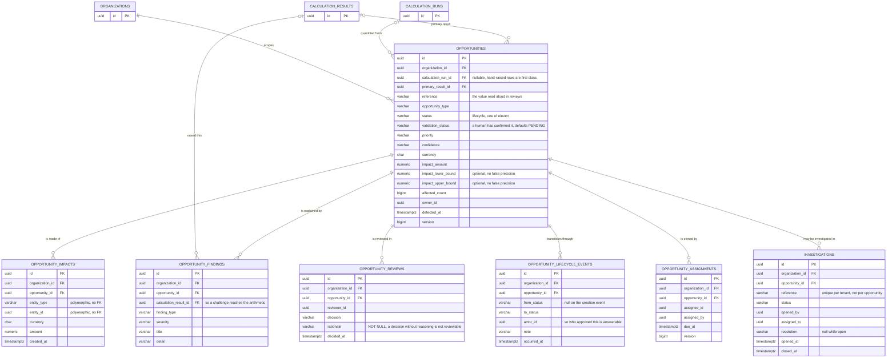
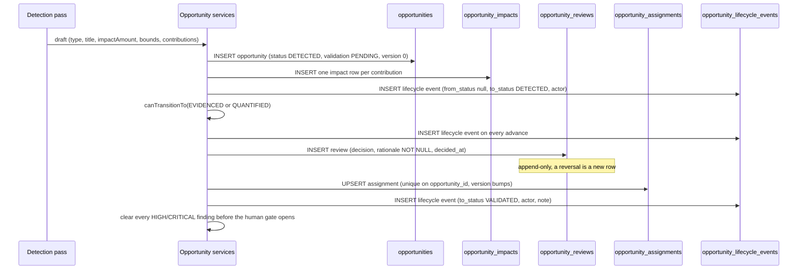

# 10 Opportunity — the Economic Opportunity Record and its lifecycle

> Scope: `src/main/java/com/fintech/cfo/opportunity/**` and
> `src/test/java/com/fintech/cfo/opportunity/**`.
> **40 main files: 18 built, 22 stub. 3 test classes, all placeholders.**
> Schema: `V8__create_opportunities.sql` (another chapter covers it in depth;
> this one cites the columns the code actually depends on).
> This chapter **replaces** the opportunity half of the now-deleted
> `03-opportunity-value-evidence.md`, whose counts
> and lifecycle are stale. Corrections are listed in **§ C, "What chapter 03 got
> wrong"**.

---

## A. WHY this module exists

A finance team receives thousands of computed price and discount deviations every
month. The dangerous part is not that they exist — it is acting on them. If an
engine decides a £40,000 overpayment is recoverable and nobody with authority ever
looked at it, the platform has laundered a guess into an instruction. The bad
outcome is a claim the organisation cannot defend: no named human agreed to it, no
evidence sits behind it, and the figure cannot be re-derived months later when the
supplier disputes it. The opposite failure is quieter and just as expensive — an
opportunity that is closed without a reason, because the number was wrong and
nobody recorded *that* it was wrong. Both failures destroy the same thing: the
ability to answer "who decided this money was recoverable, and on what basis".

This module is the place where a computed number stops being arithmetic and becomes
a claim somebody owns. It holds one record — the Economic Opportunity Record — and
everything that makes the claim defensible: the lifecycle, the per-transaction
impact rows the headline figure is made of, the findings that explain and qualify
it, the pointer to the calculation that produced it, the evidence digests, the
next action, and the human decision that stands behind all of it.

The hard invariants, which every rest of this chapter refers back to:

- **A monetary claim is never made without a human.** `OpportunityStatus.carriesMonetaryClaim()`
  is false for `DETECTED` and `EVIDENCED`; an unquantified finding cannot carry an
  amount into a report.
- **The headline figure must be reconstructable from the rows under it.** Contributions
  to one opportunity must partition the net impact exactly; a rounding residual is
  attributed to a row, never left over.
- **A stored amount is re-derivable, not merely recorded.** `CalculationReference`
  refuses to exist without rule code, rule version and input checksum.
- **A lifecycle move is legal only if the graph says so.** `legalSuccessors()` is
  the single authority; backward moves are narrow, pre-commitment only, and
  (per its contract) require a written reason.
- **The module owns tenancy.** `organizationId` is never supplied by a detector or
  a request; `OpportunityImpact.from` is the only factory, and it takes tenancy as
  a parameter this module supplies.
- **Evidence is a pointer and a digest, never a document.**
- **No `double`, no `float`, no FX.** All money is `shared.domain.Money`, which
  throws on a currency mismatch rather than converting.

---

## B. FLOW — the runtime journey

The implemented truth today: **only the leaf value types and the lifecycle graph
exist.** Everything that would move a record between states is a stub. The diagram
below is the design as the stubs' names and the enums' Javadoc commit to it; every
`[PLANNED]` step is contract, not behaviour.

```mermaid
flowchart TD
  Engine["financialtruth: Variance<br/>actual - expected"] -->|"[PLANNED]"| Det["OpportunityDetectionService"]
  Det --> Draft["FindingDraft<br/>(caller-supplied finding)"]
  Det --> Ref["AffectedTransactionRef<br/>(caller-supplied contribution)"]
  Draft -.->|"[PLANNED] Missing:<br/>OpportunityFinding#from"| Fnd["OpportunityFinding"]
  Ref -->|"OpportunityImpact.from<br/>BUILT: assigns id/tenant/time"| Imp["OpportunityImpact"]
  Engine --> Calc["CalculationReference<br/>BUILT: run+rule+version+checksum"]
  Imp -->|"[PLANNED]"| Econ["EconomicOpportunity<br/>STUB: empty shell"]
  Calc --> Econ
  Fnd --> Econ
  Econ -->|"[PLANNED]"| Life["OpportunityLifecycleService"]
  Life --> Guard{"canTransitionTo<br/>legalSuccessors()"}
  Guard -->|"illegal"||"BusinessRuleException / ValidationException"|
  Guard -->|"legal"| VRev["[PLANNED] OpportunityReviewService"]
  VRev -->|"[PLANNED]"| Ctl["OpportunityController<br/>OpportunityReviewController<br/>OpportunityAssignmentController"]
  Econ -->|"[PLANNED]"| Val["OpportunityValidationService"]
```

### Numbered steps

1. **Trigger** — a detection pass finishes over computed variances.
   **Where** — `service/OpportunityDetectionService.java` (STUB, `STUB`).
   **What it would do** — convert engine output into candidate opportunities.
   **Why it does it that way** — `[PLANNED]`. The class is an empty class with a
   `TODO`. Its intended contract is written down in the test's Javadoc
   (`OpportunityDetectionTest`): the impact must survive *exactly*, with its
   currency, and every opportunity must keep the reference back to the
   calculation and its evidence. Deduplication is the other named behaviour.

2. **Trigger** — detection describes a finding.
   **Where** — `model/FindingDraft.java:27`.
   **What it does** — carries `findingType`, `severity`, `title`, `detail`,
   `calculationResultId` and *nothing else* — no id, no tenant, no timestamp.
   **Why** — those three are the module's to assign. Keeping them out of the
   caller's hands is what stops a detection pass from writing rows into a tenant it
   was not asked about (`FindingDraft.java:14-19`).

3. **Trigger** — detection produces a contribution.
   **Where** — `model/AffectedTransactionRef.java:42`.
   **What it does** — holds entity type/id, a signed `Money` share, an optional
   external reference and an optional `SourceReference`.
   **Why** — same reason as step 2. This is the *input* form;
   `OpportunityImpact` is the *stored* form, and only the module bridges them.

4. **Trigger** — a contribution is promoted to a stored row.
   **Where** — `model/OpportunityImpact.java:95` `from(AffectedTransactionRef, UUID, OrganizationId, UUID, Instant)`.
   **What it does** — copies entity type, entity id, contribution, external
   reference and source out of the caller's record, and takes identity, tenancy and
   `createdAt` as explicit parameters.
   **Why** — this is the single place the module asserts authority over the
   identity and tenancy columns of `opportunity_impacts`. A caller cannot name the
   tenant for a contribution it detected, which is the same reasoning that keeps an
   organization id out of request bodies (module rules §6).

5. **Trigger** — an amount is attached to a record.
   **Where** — `model/CalculationReference.java:37`.
   **What it does** — refuses construction unless `calculationRunId`, `ruleCode`,
   `ruleVersion`, `inputChecksum` and `evaluatedAt` are all present.
   **Why** — a variance is only defensible if the same rule can be re-run over the
   same inputs. The run id alone says a figure was produced; the triple says it can
   be *proved*.

6. **Trigger** — anything asks whether a record may move.
   **Where** — `enums/OpportunityStatus.java:96` `legalSuccessors()`, reached via
   `canTransitionTo(...)` at `:131`.
   **What it does** — one exhaustive `switch` over the sealed hierarchy, returning
   the reachable states.
   **Why** — the rule lives in the type so that adding a state is a compile error
   until somebody states what may follow it. The alternative — guard clauses in a
   service, or a boolean per edge — is the shape that produces records which
   reached `ACTED` without ever being `APPROVED`, because nobody remembered to add
   the new edge (`OpportunityStatus.java:18-26`).

7. **Trigger** — a reviewer concludes.
   **Where** — `enums/ReviewDecision.java:20` + `service/OpportunityReviewService.java`
   (STUB) + `model/OpportunityReview.java` (STUB).
   **What it would do** — append an `opportunity_reviews` row and move the record.
   **Why** — `[PLANNED]`. The decision vocabulary and its obligations are built;
   the service and the row are not.

8. **Trigger** — a lifecycle move succeeds.
   **Where** — `[PLANNED]` `service/OpportunityLifecycleService.java`, which must
   also write `model/OpportunityLifecycleEvent.java` (STUB) and call
   `platform.audit.AuditService` (module rules §8: auditing is not a substitute for
   domain history — a transition must be visible in *both*).

9. **Trigger** — a client reads or changes a record.
   **Where** — `[PLANNED]` the three controllers and seven DTOs (all STUB).
   **Why** — `[PLANNED]`. Nothing is served today; see § C for the contract each
   must honour.

### ER diagram — V8 `V8__create_opportunities.sql`



Seven tables hang off one aggregate. `OPPORTUNITIES` is the only mutable,
versioned row; every other table is either append-only history
(`OPPORTUNITY_FINDINGS`, `OPPORTUNITY_REVIEWS`, `OPPORTUNITY_LIFECYCLE_EVENTS`) or
a current-state projection (`OPPORTUNITY_ASSIGNMENTS`), and that split is the
diagram's real content. `OPPORTUNITY_IMPACTS` is the third kind: the rows the
headline `impact_amount` is *made of*, each independently addressable because
evidence attaches to it and a transaction is cited by it. The two nullable arrows
into `CALCULATION_RUNS` and `CALCULATION_RESULTS` are the provenance back to the
engine, and they are nullable on purpose so an opportunity raised by hand from an
investigation is a first-class row rather than a second-class one — while a
*quantified* record still needs the reference. `INVESTIGATIONS` is a child here
only because it depends on nothing beyond `opportunities`; an opportunity may be
investigated more than once, so the one-to-many is correct and
`ux_investigations_org_reference` is the tenant-scoped guard on its human-readable
reference.

#### The constraints that matter, and what each one prevents

- **`ux_opportunity_assignments_opp (opportunity_id)` — the key does *not* include
  `assignee_id`.** This is the point of the table: exactly one current assignee. Had
  the key included the assignee, reassignment would insert a second row and "who
  owns this" would have two answers. The previous owner survives in
  `OPPORTUNITY_LIFECYCLE_EVENTS`, so nothing is lost by replacing the row.
- **`ux_opportunities_org_reference (organization_id, reference)`.** The reference
  is the value quoted aloud in reviews and reports; the UUID is meaningless read
  aloud, which is why the two are separate columns. Tenant-scoped uniqueness means
  the number spoken in a meeting identifies exactly one opportunity.
- **`opportunity_reviews.rationale VARCHAR(4000) NOT NULL`.** The schema's decision,
  not the service's: a decision without its reasoning is not reviewable, and the
  reasoning is the part a later reader needs. `ReviewDecision.requiresWrittenRationale()`
  is true for all four decisions precisely because this column says so.
- **`opportunity_lifecycle_events.from_status` is nullable while `to_status` is
  `NOT NULL`.** Nullability is a semantic distinction, not an oversight — the
  creation event has no prior state. The actor column is what makes "who approved
  this" answerable without inferring it from `audit_events`.
- **The child tables are append-only, enforced only by the absence of an update
  path.** Reviews and lifecycle events are history: if a decision is reversed, the
  reversal is a *new* row. Collapsing them into one mutable row would erase the
  fact that the opportunity's quality changed over time — and, for a rejection,
  the fact that detection was ever wrong. This is a contract the three STUB
  repositories in § C must honour; nothing in the DDL prevents the other outcome.
- **`opportunities.status` and `opportunities.validation_status` are separate
  columns.** A detected opportunity can be `OPEN` while still `PENDING` validation,
  and conflating them would make "what is in flight" unanswerable — the only honest
  measure of how much of what was detected has actually been verified.

#### Main write path



---

## C. FILES — every file in the module

**40 files: 18 built, 22 stub.** Reconciles against `Get-ChildItem` over
`opportunity/**`. The 22 stubs are 3 controller + 7 dto + 3 repository + 5 service +
4 model; the 18 built are 9 enums + 2 `package-info` + 7 model records.

### `enums/` — 10 files (9 built + `package-info`)

| file | status | what it is for | key methods / lines |
|---|---|---|---|
| `enums/OpportunityStatus.java` | BUILT | The 11-state lifecycle graph; the single authority on which move is legal. | `legalSuccessors()` :96, `canTransitionTo()` :131, `isTerminal()` :146, `carriesMonetaryClaim()` :178, `all()` :54, `fromCode()` :65 |
| `enums/OpportunityType.java` | BUILT | The three provable deviation classes; no `OTHER` bucket by design. | `isComponentOfPayableDeviation()` :75, `all()` :43, `fromCode()` :52 |
| `enums/ValidationStatus.java` | BUILT | Whether a human has stood behind the figure, kept deliberately separate from lifecycle status. | `isTerminal()` :69, `isConfirmed()` :91, `isOpenlyDisputed()` :103, `fromCode()` :48 |
| `enums/ReviewDecision.java` | BUILT | The four things a reviewer can conclude, and which of them close the record. | `requiresWrittenRationale()` :63, `isAdverse()` :81, `closesRecord()` :100 |
| `enums/FindingType.java` | BUILT | What kind of explanation a finding gives; which kinds cap confidence. | `limitsConfidence()` :66, `fromCode()` :44 |
| `enums/FindingSeverity.java` | BUILT | Ordinal-free severity ladder over trust, not magnitude. | `isAtLeast()` :39, `blocksValidation()` :58, `mostSevere()` :72 |
| `enums/OpportunityConfidence.java` | BUILT | Evidence-completeness scale; worst-wins for aggregates. | `isLessConfidentThan()` :42, `leastOf()` :58 |
| `enums/OpportunityPriority.java` | BUILT | Triage urgency, independent of confidence. | `isAtLeast()` :37, `moreUrgent()` :55 |
| `enums/CodedEnum.java` | BUILT | The persisted-code contract shared by the five sealed sets: `code()`, `normalise()`, `requireColumnWidth()`. | `normalise()` :48, `requireColumnWidth()` :68 |
| `enums/package-info.java` | BUILT | Why five sets are sealed records and three are enums; declares `@NullMarked`. | — |

### `model/` — 12 files (7 built, 4 stub, 1 `package-info`)

| file | status | what it is for | key methods / lines |
|---|---|---|---|
| `model/OpportunityImpact.java` | BUILT | One affected transaction and this opportunity's claim against it, in stored form. | ctor :48, `from(...)` :95, `isFavourable()` :103, `requireText()` :114 |
| `model/OpportunityFinding.java` | BUILT | One explanation of why the record should be believed. Never carries an amount. | ctor :54, `blocksValidation()` :94, `limitsConfidence()` :104, constants :49-52 |
| `model/FindingDraft.java` | BUILT | A finding as supplied by a caller, before it has an identity or a tenant. | ctor :34, `of(...)` :57 |
| `model/CalculationReference.java` | BUILT | Rule, rule version, input checksum and run behind a stored amount. | ctor :46, `isReDerivable()` :70 |
| `model/EvidenceReference.java` | BUILT | Locator + digest for one piece of supporting evidence. | ctor :47, `hasSourceLineage()` :71, `MAX_EVIDENCE_TYPE_LENGTH` :45 |
| `model/AffectedTransactionRef.java` | BUILT | The detector-supplied input form of a contribution. | ctor :52, `MAX_ENTITY_TYPE_LENGTH` :50 |
| `model/NextAction.java` | BUILT | Structured advice: what to do, by when, and whether it needs someone else's authority. | ctor :32, `hasDueDate()` :44, `MAX_ACTION_LENGTH` :30 |
| `model/EconomicOpportunity.java` | **STUB** | The central aggregate. `public class EconomicOpportunity {}` — see the contract below. | — |
| `model/OpportunityReview.java` | **STUB** | One append-only human decision row. | — |
| `model/OpportunityAssignment.java` | **STUB** | The single current owner of a record; mutable, versioned. | — |
| `model/OpportunityLifecycleEvent.java` | **STUB** | The domain's own transition history (from, to, actor, note, when). | — |
| `model/package-info.java` | BUILT | States the three invariants `EconomicOpportunity` should own — two of which nothing currently enforces. | — |

### `service/` — 5 files, all STUB

| file | status | what it is for | key methods / lines |
|---|---|---|---|
| `service/OpportunityDetectionService.java` | **STUB** | Engine output → opportunities. Owns the threshold filter and the deduplication rule. | — |
| `service/OpportunityValidationService.java` | **STUB** | The finance decision: confirm, challenge, reject, and the confidence ceiling applied on confirmation. | — |
| `service/OpportunityLifecycleService.java` | **STUB** | The transition guard. Reads `canTransitionTo`, requires a written reason on every backward move, writes a lifecycle event, audits. | — |
| `service/OpportunityReviewService.java` | **STUB** | Appends `opportunity_reviews` rows and applies the effect of a `ReviewDecision` to the record. | — |
| `service/OpportunityService.java` | **STUB** | Read facade over the record: list, detail, "my opportunities", review queue. | — |

### `controller/` — 3 files, all STUB

| file | status | what it is for | key methods / lines |
|---|---|---|---|
| `controller/OpportunityController.java` | **STUB** | List and detail, and the state-changing entry points. | — |
| `controller/OpportunityReviewController.java` | **STUB** | Submit a review decision; read review history. | — |
| `controller/OpportunityAssignmentController.java` | **STUB** | Assign / reassign an owner. | — |

### `dto/` — 7 files, all STUB

| file | status | what it is for | key methods / lines |
|---|---|---|---|
| `dto/OpportunitySummaryResponse.java` | **STUB** | List row: reference, title, type, status, amount *with currency*, priority, confidence. | — |
| `dto/OpportunityResponse.java` | **STUB** | Standard read model, one level fuller than the summary. | — |
| `dto/OpportunityDetailResponse.java` | **STUB** | Everything: impacts, findings, evidence, calculation reference, next action, review history. | — |
| `dto/ValidateOpportunityRequest.java` | **STUB** | Body of a confirmation: rationale, and whether impact is being accepted as stated. | — |
| `dto/ChallengeOpportunityRequest.java` | **STUB** | Body of a challenge: rationale plus what would change the conclusion. | — |
| `dto/RejectOpportunityRequest.java` | **STUB** | Body of a rejection: rationale. No amount — a rejection claims nothing. | — |
| `dto/AssignOpportunityRequest.java` | **STUB** | Body of an assignment: assignee, optional due date. | — |

### `repository/` — 3 files, all STUB

| file | status | what it is for | key methods / lines |
|---|---|---|---|
| `repository/OpportunityRepository.java` | **STUB** | Read/write `opportunities`; every method tenant-scoped; optimistic `version` → `ConflictException`. | — |
| `repository/OpportunityReviewRepository.java` | **STUB** | Append-only `opportunity_reviews`; never updates a row (a reversal is a new row). | — |
| `repository/OpportunityLifecycleRepository.java` | **STUB** | Append-only `opportunity_lifecycle_events`; timeline query for one record. | — |

### `tests/` — 3 files, all placeholders

| file | status | what it is for | key methods / lines |
|---|---|---|---|
| `test/.../opportunity/OpportunityDetectionTest.java` | TEST (placeholder) | Locking that impact survives translation exactly, with its currency, and that duplicate lines merge. | — |
| `test/.../opportunity/OpportunityLifecycleTest.java` | TEST (placeholder) | Enumerate every transition and assert the illegal ones raise and leave the record untouched. | — |
| `test/.../opportunity/OpportunityValidationTest.java` | TEST (placeholder) | That a decision is attributed to an authenticated user with a reason, and only a validated record may be actioned. | — |

### What chapter 03 got wrong

`03-opportunity-value-evidence.md:25` says **"opportunity 40 PH"** and describes the
module as placeholder throughout. Corrected: **40 files, 18 built, 22 stub** — every
enum and seven model records are real, working code, and they are the most
opinionated code in the module.

Its lifecycle claim (`:14`, `:34-35`) — `OPEN -> IN_REVIEW -> APPROVED ->
ACTIONED -> REALIZED (+ REJECTED/EXPIRED)` — **does not exist**. The implemented
enum has 11 states with different names and there is no `EXPIRED`. Expiry is
absorbed by `REJECTED`, which is terminal. The code wins; the older doc is stale.
`03`'s per-package counts (`model 12`, `dto 7`, `ctrl 3`, `repo 3`, `enums 10`)
are all correct as totals; only the built/stub split and the lifecycle were stale.

---

## D. DEEP DIVE — method by method

### D.1 `enums/OpportunityStatus.java` — the state machine

This is the most important file in the module and the reason this chapter exists.
It is a `sealed interface` permitting 11 singleton `record` variants, each carrying
a `public static final INSTANCE` and a `code()`.

`all()` (`:54`) — `static List<OpportunityStatus>`
Returns the 11 variants in the order the lifecycle is walked. It is a **method,
not a static field**, and the Javadoc at `:50-53` explains why: a static field
holding nested `INSTANCE` references cannot initialise, because the nested classes
are subclasses of the interface being initialised. A circular static-init failure
at class-load time is a genuinely hard bug to diagnose, and the cost of a method is
one call.

⚠ The order puts `REJECTED` between `APPROVED` and `ACTED` (`:56-57`) — it is
listed where the sealed `permits` clause and the narrative place it, not on the
forward spine. Anything that renders "progress" by walking `all()` will therefore
render a rejected record as though it were 5 steps from the end. If a progress bar
is ever built from this list, it must branch on `isTerminal()` rather than compute
an index.

`fromCode(String)` (`:65`)
1. `CodedEnum.normalise(code, "OpportunityStatus")` — rejects null/blank, trims,
   upper-cases with `Locale.ROOT`.
2. Linear scan over `all()` for an exact code match.
3. On match: `requireColumnWidth(32)` then return.
4. No match: `throw new ValidationException("unknown opportunity status code: " + code)`.

**WHY it fails loudly.** A stored status this module cannot resolve means the
schema and the code have diverged. The alternative — returning a default, or
`null` — would report an opportunity in a state nobody decided on, and that is the
one failure a downstream consumer cannot catch, because the money still looks like
money (`CodedEnum.java:20-24`). The width check runs *on resolution*, not on write,
so an over-long variant surfaces at the boundary that owns the schema contract
(`CodedEnum.java:70-71`).

`legalSuccessors()` (`:96`) — the graph, and nothing else
A single exhaustive `switch` over the sealed hierarchy returning an immutable
`Set<OpportunityStatus>`. The design boundary is stated at `:79-83`: **this method
owns the *shape* of the lifecycle; preconditions on individual moves are the
service's job** and are reported as business-rule failures, because they are about
the record's *contents* rather than the shape of the workflow. That split is what
keeps a rule like "a quantified record needs a calculation reference" out of a
graph that should not know about calculation references.

`canTransitionTo(OpportunityStatus)` (`:131`)
A membership test on `legalSuccessors()`. **WHY not a second table:** the Javadoc
at `:124-127` is explicit that it is a membership test precisely so the guard and
the documented graph cannot drift apart. A hand-maintained `TRANSITIONS` map beside
`legalSuccessors()` would be two sources of truth, and the second would be the one
consulted at runtime.

`isTerminal()` (`:146`) — true for `REJECTED` and `REALIZED` only
Both terminal states return an empty successor set, so the two facts are consistent
by construction. **WHY a rejected record can never be reopened:** the Javadoc at
`:136-142` gives the reason — *the rejection is the finding*. Someone decided this
money is not recoverable; a later report showing it as live again, without a new
record, would misstate that decision. "How much did we look at and throw away, and
why" only stays answerable while the rejections exist to be counted (same argument
at `:266-272`).

`carriesMonetaryClaim()` (`:178`) — false only for `DETECTED` and `EVIDENCED`
**WHY separate from `isTerminal()`:** the two answer different questions. Terminal
is "is the record finished"; this is "may an amount legitimately exist yet". The
subtle case is `REJECTED`, which returns `true` — it is reachable both from
`detected` (nothing was quantified) and from `validated` (something was), and the
invariant only constrains the *false* cases, so no inconsistency can arise
(`:170-173`).

⚠ **Review** — the Javadoc at `:165-169` says `EconomicOpportunity` "refuses to
hold a non-zero impact without contributions and a calculation reference in these
states". **Nothing enforces that today.** `EconomicOpportunity` is an empty shell
(see D.5). The predicate is correct and the guarantee is currently a claim only.

### The transition table

Every edge, with the gate that guards it and the failure it exists to prevent.
"Gates" marked `[PLANNED]` are contracts the stubs must honour; none is executable.

| from | to | gate | why the edge exists / what it stops |
|---|---|---|---|
| `DETECTED` | `EVIDENCED` | machine; no human | A detection with no source rows attached is a claim with no lineage. Requires at least one `SourceReference` on an impact row. |
| `DETECTED` | `QUANTIFIED` | machine; no human (shortcut) | A single-pass detector holds evidence and a figure at the same instant. Forcing two writes to record that would be ceremony, not accuracy (`:98-100`). |
| `DETECTED` | `REJECTED` | **human** + written rationale | The earliest human kill. Nothing was quantified, so the record carries no amount and closing it is cheap. The rationale is still mandatory — a rejection with no reason cannot be learned from. |
| `EVIDENCED` | `QUANTIFIED` | machine | The figure is produced from the attached evidence. This is the normal spine edge. |
| `EVIDENCED` | `REJECTED` | **human** + written rationale | Evidence exists and proves no deviation — the common false positive. |
| `QUANTIFIED` | `EVIDENCED` | **backward**; written reason required `[PLANNED]` | Newly attached evidence can invalidate the figure (`:103`). Stops a record from sitting on a number that later evidence has already disproved. |
| `QUANTIFIED` | `VALIDATED` | **human gate** — reviewer; `ValidationStatus.isConfirmed()`; no unresolved `HIGH`/`CRITICAL` finding (`FindingSeverity.blocksValidation()`) | The single most important gate. Stops an unverified figure from becoming something an organisation acts on. An auto-approved large claim is exactly the failure this edge exists to prevent. |
| `QUANTIFIED` | `REJECTED` | **human** + written rationale | The figure was right and the conclusion was not. |
| `VALIDATED` | `RECOMMENDED` | **human** — a `NextAction` with a named owner | Converts verified money into a proposed action. An unowned recommendation is a wish; requiring an owner is what makes it work. |
| `VALIDATED` | `QUANTIFIED` | **backward**; written reason required `[PLANNED]` | A challenge re-opens *quantification*, not validation — the disagreement is about method, not about whether the money exists (`:105-106`). Keeps the validated figure in history while the work product is reworked. |
| `VALIDATED` | `REJECTED` | **human** + written rationale | The last pre-commitment exit. A human who no longer believes the number can still stop it here. |
| `RECOMMENDED` | `APPROVED` | **human** — a named authoriser; `NextAction.requiresApprovalBeforeExecution()` is what makes this a gate rather than a formality | Money is about to be committed. This is the point of no return for the claim. |
| `RECOMMENDED` | `VALIDATED` | **backward**; written reason required `[PLANNED]` | The recommendation is withdrawn before any commitment is made (`:107`). A validated-but-wrong action is recoverable precisely because no money has moved. |
| `RECOMMENDED` | `REJECTED` | **human** + written rationale | The action is withdrawn rather than the record — the finding survives as a rejected opportunity. |
| `APPROVED` | `ACTED` | execution outcome; **no human gate** — it is a fact, not a decision | Money has been committed, so the only honest remaining moves are forward. |
| `APPROVED` | *(anything else)* | **refused** | `legalSuccessors()` returns `{ACTED}` and nothing else (`:109-111`). This is the "silently closed opportunity" defence: once approved, the record cannot be deleted, rejected or rewound. |
| `ACTED` | `MEASURED` | evidence of effect in the ledger | The action having been taken is not the same as it having worked. |
| `MEASURED` | `ATTRIBUTED` | attribution sums to the measured total | Stops double-counting: one recovered pound cannot be attributed to two opportunities. |
| `ATTRIBUTED` | `REALIZED` | final | The only state that may be counted as realised value (`:321-324`). |
| `REJECTED` | *(nothing)* | terminal | See `isTerminal()` above. |
| `REALIZED` | *(nothing)* | terminal | Realised value is not revised in place. |

### The human-in-the-loop gates, summarised

Five edges are genuine human decisions, and each blocks a specific bad outcome:

| gate | who | what they must supply | what it prevents |
|---|---|---|---|
| `→ VALIDATED` | finance reviewer | `ValidationStatus.Confirmed`, a `rationale` (V8 makes it `NOT NULL`), and clearance of every `HIGH`/`CRITICAL` finding | A computed number becoming an instruction with no human in the chain |
| `→ RECOMMENDED` | owner of the work | A `NextAction` with prose, a named owner, and `requiresApprovalBeforeExecution` set truthfully | A recommendation that quietly needs an authority nobody has to grant |
| `→ APPROVED` | authoriser | The authorisation itself, recorded as an `opportunity_reviews` row | Committing money on a recommendation that was never authorised |
| `→ REJECTED` (from any pre-commit state) | any reviewer with authority | A written rationale, always — `ReviewDecision.requiresWrittenRationale()` is true for **all four** decisions because V8 makes `rationale` `NOT NULL` (`ReviewDecision.java:12-14`) | A silently closed opportunity: the only way out of the queue, and the one that erases the most information if it is unrecorded |
| any backward edge | the challenger | A written reason (`OpportunityStatus.java:34-36`) | A backward move that quietly erases a validated figure or an approved recommendation |

Two properties make the gates real rather than decorative:

- **The three backward edges are confined to pre-commitment states.** Once work has
  started (`APPROVED` onward) the record cannot be quietly rewound, because
  `legalSuccessors()` on those states contains no backward edge at all. The
  trade-off: a genuinely mistaken approval cannot be corrected in place — the
  correction is a *new* opportunity with a cross-referencing note. The alternative
  (allowing `APPROVED → QUANTIFIED`) would let a committed claim dissolve, which is
  worse than a duplicated one.
- **`REJECTED` is a first-class state, not a deleted row** (`:266-272`). Deleting
  an opportunity destroys the only record that detection was ever wrong, and with
  it the ability to tune detection.

### D.2 `enums/CodedEnum.java` — the persisted-code contract

`code()` (`:39`) — the value written to and read from the V8 `VARCHAR` column.
Documented at `:32-38` as always equal to the variant's simple name, so a column
written by hand and one written by this module agree. Every one of the five sealed
sets honours this: `PRICING_VARIANCE`, `COMBINED_VARIANCE`, `PENDING`,
`DISPUTED`, `VARIANCE_COMPONENT`, `APPROVE`, `DETECTED`, …

`normalise(String code, String typeName)` (`:48`) — `static`
1. `Objects.requireNonNull(typeName)`.
2. Null or blank `code` → `ValidationException(typeName + " code must not be blank")`.
3. Return `code.trim().toUpperCase(Locale.ROOT)`.

**WHY `Locale.ROOT` and not the default locale.** Stated at `:53-55`: case mapping
is locale-sensitive, and a record read on a differently configured node must
resolve to the same variant it was written as everywhere else. The canonical
failure is the Turkish dotless-i: under a Turkish default locale, `"title"`.
toUpperCase() yields `TİTLE` and the lookup silently misses. Module rules §4 names
this exact rule. The alternative — case-sensitive comparison — would reject a
hand-edited `pending` in the database instead of accepting it, trading a harmless
leniency for a hard failure on data a DBA may have fixed by hand.

`requireColumnWidth(int maxColumnLength)` (`:68`)
Throws `IllegalStateException` when `code().length() > maxColumnLength`. **WHY on
resolution rather than on write** (`:60-63`): a silent truncation at write time
would store `EVIDENCED` as something unreadable, and the *whole record* would then
fail to resolve. A loud `IllegalStateException` at the read boundary names the
variant and the width. Note it is an `IllegalStateException`, not a
`ValidationException` — it signals a *programming* error in this module (an
over-long constant), not bad user input, so it must not be rendered as a 400.

The widths, each verified against V8:

| set | constant | V8 column | match |
|---|---|---|---|
| `OpportunityStatus` | `MAX_CODE_LENGTH = 32` | `opportunities.status VARCHAR(32)` | yes |
| `OpportunityType` | `MAX_CODE_LENGTH = 48` | `opportunities.opportunity_type VARCHAR(48)` | yes |
| `ValidationStatus` | `MAX_CODE_LENGTH = 32` | `opportunities.validation_status VARCHAR(32)` | yes |
| `ReviewDecision` | `MAX_CODE_LENGTH = 24` | `opportunity_reviews.decision VARCHAR(24)` | yes |
| `FindingType` | `MAX_CODE_LENGTH = 48` | `opportunity_findings.finding_type VARCHAR(48)` | yes |

⚠ **Review** — the three plain enums (`OpportunityConfidence`, `OpportunityPriority`,
`FindingSeverity`) are stored in `VARCHAR(16)` columns but do **not** implement
`CodedEnum` and carry **no width guard**. Their longest constants
(`CRITICAL` = 8) fit today, so there is no live defect, but nothing stops a future
`requiresSeparateSignOff()` from being added to an enum with no way to detect that
it can no longer be persisted. The inconsistency is worth noting because it is
invisible until the write fails in production.

### D.3 The remaining sealed enums

`OpportunityType` (`:30`) — three variants, no `OTHER`. The Javadoc at `:22-28`
argues this at length: a catch-all bucket is the easiest value to add and the most
expensive to keep, because it silently absorbs every leakage class discovered
later, so a report grouped by type would keep reporting a growing share of money
under a heading that says nothing about it. Naming a new category costs one line
and buys a report that can be trusted.

`isComponentOfPayableDeviation()` (`:75`) — exhaustive `switch`, true for
`PricingVariance` and `DiscountVariance`, false for `CombinedVariance`. **WHY a
switch:** a new variant must declare whether it reports on the payable amount or on
one of its components before the module will build; getting it wrong would let a
component deviation be added into a total of payable deviations and **double-count
the same money**.

⚠ **Review** — this method has **no callers anywhere in the codebase.** The rule it
exists to make checkable ("a portfolio total may only sum records of this type",
`:114-118`) is therefore **unenforced**. Any aggregator that sums
`PRICING_VARIANCE` rows into a headline figure will silently double-count against
`COMBINED_VARIANCE`. Whoever builds `OpportunityService` or the reporting module
must call this predicate, or the stated guarantee is decorative.

Note the related asymmetry documented in `financialtruth.model.Variance:28-34`:
`DiscountVariance` is measured on the discount itself, so a positive discount
component *reduces* the net variance. `pricingVariance - discountVariance` is the
net figure, and only the net figure keeps the customer-facing sign convention.

`ValidationStatus` (`:24`) — five variants, deliberately **not** the same axis as
lifecycle status. The Javadoc at `:13-19` gives the two ways they come apart: a
record can be `OpportunityStatus.Rejected` with validation `Disputed` (a challenge
is outstanding), and can be `OpportunityStatus.Quantified` with validation
`Confirmed` (the figure survived review and is waiting to be quantified).
Collapsing them would lose the ability to ask "how much of what we detected has
actually been verified" — the only honest measure of whether the product works.

- `isTerminal()` (`:69`) — true for `Confirmed` and `Rejected`. **WHY `Disputed` is
  *not* terminal** (`:75-77`): a challenge is work in progress, so the record stays
  eligible for a later confirmation. `Confirmed` is terminal *for validation*, not
  for the record.
- `isConfirmed()` (`:91`) — identity against `Confirmed.INSTANCE`, not `equals()`.
  The comment at `:92-95` explains: these are stateless records, so a second
  instance of `Confirmed` could only ever be a bug, and identity makes that bug
  visible rather than masking it.
- `isOpenlyDisputed()` (`:103`) — identity against `Disputed.INSTANCE`.

⚠ A readability trap worth naming: `ValidationStatus.Rejected` and
`OpportunityStatus.Rejected` are **different facts** that can both be true on one
row. A reader seeing "REJECTED" in two adjacent columns must not assume they say
the same thing. The DTOs built later should name them distinctly.

`ReviewDecision` (`:20`) — `Approve` / `Reject` / `Challenge` / `Defer`.

- `requiresWrittenRationale()` (`:63`) — true for **all four**. The Javadoc at
  `:55-58` explains why a method rather than a constant: the schema already decided
  it (V8: `rationale VARCHAR(4000) NOT NULL`), and assuming it in the service would
  let a future variant slip through without anyone re-examining that.
- `isAdverse()` (`:81`) — true for `Reject` and `Challenge`; `Defer` is **not**
  adverse, because a defer is a request for more evidence rather than a verdict
  against the record (`:76-79`). A challenge is adverse because it "has to be
  answerable, which means it must say what would change the conclusion" — the
  stronger justification this drives is a service concern, not a schema one.
- `closesRecord()` (`:100`) — true only for `Reject`. A challenge re-opens
  quantification, a defer changes nothing, an approval advances.

`FindingType` (`:22`) — `VarianceComponent` / `DataQuality` / `TermGap`.

`limitsConfidence()` (`:66`) — true for `DataQuality` and `TermGap`, false for
`VarianceComponent`. **WHY the distinction** (`:56-61`): a record explained by
data-quality limits may be real and correctly quantified and still not be `HIGH`
confidence. "The arithmetic is right" and "the inputs were complete" are
independent questions, and collapsing them is how a well-computed figure from an
incomplete input set gets presented as certain. The confidence ceiling this drives
belongs to `OpportunityValidationService`, which is a stub — so the ceiling is
specified and not applied.

The Javadoc at `:17-19` also rules out a generic `NOTE` variant, for the same
reason `OpportunityType` rules out `OTHER`: a bucket everything lands in is how
"3 unexplained findings" becomes the normal state without anyone noticing.

### D.4 The three ordering enums

All three avoid `Enum#ordinal()` for the same stated reason: *a declaration reorder
must not be able to change which value wins* — a refactor that silently reports an
optimistic total. Each spells out the trade-off: ordinal comparison happens to be
correct today only by accident of declaration order, and that is precisely the kind
of coincidence that survives a refactor (`OpportunityConfidence.java:12-16`).

`FindingSeverity` — `INFO < LOW < MEDIUM < HIGH < CRITICAL`.
- `isAtLeast(FindingSeverity)` (`:39`) — an explicit `switch`, no shared constant,
  so a new level forces the compiler to ask what it compares against.
- `blocksValidation()` (`:58`) — `isAtLeast(HIGH)`. Stated in terms of the ordering
  rather than by listing the two constants, so raising the bar later is a single
  edit here (`:59-61`).
- `mostSevere(Iterable<FindingSeverity>)` (`:72`) — worst-wins, seeded with `INFO`.
  **Steps:** seed `worst = INFO`, `any = false`; skip nulls; set `any = true`; if
  `severity.isAtLeast(worst)` then `worst = severity`; if `!any` throw
  `IllegalArgumentException("at least one severity is required")`; return `worst`.
  **WHY the throw** (`:68-70`): "no findings" and "no severity" must not collapse
  into an implicit `INFO`. A record with no findings has no severity; giving it
  `INFO` would state a finding-level opinion nobody made. **WHY `INFO` never
  displaces the seed** (`:73-75`): `INFO.isAtLeast(x)` is `false` for every `x`, so
  it is the floor, not an improvement on anything. Nulls are skipped rather than
  counted, so one missing input does not become a vote.

`OpportunityConfidence` — `HIGH > MEDIUM > LOW`, inverted for comparison.
- `isLessConfidentThan(other)` (`:42`) — deliberately expressed in the
  *degrading* direction, because "the direction a combined confidence always moves
  in" (`:39-40`) is the only direction that matters when aggregating.
- `leastOf(Iterable<OpportunityConfidence>)` (`:58`) — worst-wins, seeded `HIGH`.
  **WHY seeding from the optimistic end** (`:59-61`): a single `LOW` among `HIGH`
  rows must dominate, and starting low would make `HIGH` rows unable to raise it.
  Nulls are skipped with the comment *"a null level is a caller with no view, not a
  vote"* — one missing input must not silently become a `HIGH`. An all-null
  iterable throws rather than returning `HIGH`.

`OpportunityPriority` — `CRITICAL > HIGH > MEDIUM > LOW`.
- `isAtLeast(other)` (`:37`) — same ordinal-free shape.
- `moreUrgent(left, right)` (`:55`) — null-tolerant: null on one side resolves to
  the other, null on **both** sides returns `MEDIUM`, matching the V8 column
  default. **WHY `MEDIUM` for the both-null case:** the two callers that can arrive
  here without an opinion are a record read before triage and a record created by
  a policy rule; `MEDIUM` is the schema's own default, so the fallback is the same
  value the database would have used. Any other choice (notably `HIGH`) would
  invent urgency nobody expressed.
- `OpportunityPriority` is **independent of** `OpportunityConfidence` (`:7-11`): a
  large well-evidenced opportunity and a large poorly-evidenced one can carry the
  same priority, because priority answers "what do we look at next", not "can we
  trust this". A report that sorted by confidence and called it a priority queue
  would starve exactly the large uncertain items that most need a human.

### D.5 `model/EconomicOpportunity.java` — the empty centre

The file is:

```java
public class EconomicOpportunity {
    // TODO: Implement EconomicOpportunity.
}
```

An empty, non-final class. `model/package-info.java:5-10` describes it as *"the
central product object … a `final class` rather than a record because it owns
invariants a record's canonical constructor cannot express: the affected count must
match the number of contributions, every contribution must be in the record's own
currency, and a record that cannot yet carry a monetary claim must not hold one."*

⚠ **Review** — the Javadoc and the file disagree on all three points: the class is
not `final`, it is not a record, and it owns **none** of the three named
invariants. The three invariants it is documented to own are the same three that
`OpportunityStatus.carriesMonetaryClaim()` (`OpportunityStatus.java:165-169`) and
`AffectedTransactionRef` (`:24-27`) point at and that nothing enforces. **Any reader
who trusts the package Javadoc will believe a guarantee the code does not provide.**
Per module rules §7 the fix is not to edit the Javadoc into a smaller promise
silently: the aggregate is genuinely needed, and it should be built as a `final`
class with a private constructor plus these three guards, or the three Javadoc
paragraphs should be corrected to say where the invariants actually live.

**The contract it must honour** (V8 `opportunities` + the rules above):

| field | V8 column | constraint |
|---|---|---|
| `id` | `id UUID PK` | required |
| `organizationId` | `organization_id UUID NOT NULL` | required; **never** from a request body or query param (module rules §6) |
| `reference` | `reference VARCHAR(64) NOT NULL` | required; unique per `(organization_id, reference)` — the value read aloud in reviews |
| `opportunityType` | `opportunity_type VARCHAR(48) NOT NULL` | required, one of three |
| `title` / `description` | `VARCHAR(500)` / `VARCHAR(4000)` | title non-blank and ≤ 500 |
| `status` | `status VARCHAR(32) NOT NULL` | one of 11 |
| `validationStatus` | `validation_status VARCHAR(32) NOT NULL DEFAULT 'PENDING'` | defaults `PENDING`; **never auto-`CONFIRMED`** |
| `priority` / `confidence` | `VARCHAR(16) NOT NULL`, defaults `MEDIUM` / `HIGH` | see D.4 |
| `impactAmount` | `currency CHAR(3) NOT NULL`, `impact_amount NUMERIC(20,4) NOT NULL DEFAULT 0` | `Money`, currency always written with the amount — *"a variance without a currency is a bug"* (module rules §3) |
| `impactLowerBound` / `impactUpperBound` | `NUMERIC(20,4)` nullable | optional because not every type is quantified from a sample; absent bounds mean no false claim of precision, so **do not default them to the point estimate** |
| `affectedCount` | `affected_count BIGINT NOT NULL DEFAULT 0` | must equal the number of contributions |
| `calculationRunId` / `primaryResultId` | nullable FKs | nullable so a hand-raised opportunity from an investigation is a first-class row; but *quantified* records need the reference |
| `ownerId` | `owner_id UUID` | nullable; `ix_opportunities_org_owner` serves "my opportunities" |
| `businessContext` | `TEXT` | free-form, may hold JSON |
| `nextAction` | `recommended_action VARCHAR(2000)` | the `NextAction` record; null means "no recommendation yet", which is a legitimate state before `RECOMMENDED` |
| `detectedAt` / `validatedAt` / `realizedAt` | `TIMESTAMPTZ` | only `detected_at` is `NOT NULL`; the other two are stamped on the transition that earns them |
| `version` | `version BIGINT NOT NULL DEFAULT 0` | optimistic locking; a lock failure becomes `ConflictException` (module rules §7) |

Three guards it must enforce that V8 cannot: the currency of every contribution
equals the record's own currency (a `Money` mismatch must fail at construction,
not at sum time); `affectedCount` equals the contribution count; and
`!status.carriesMonetaryClaim()` implies a non-zero impact is refused, which is
what `OpportunityImpact.java:49-51` gestures at when it says a missing amount
"would silently count as zero in an aggregate".

### D.6 `model/OpportunityImpact.java` — the affected-transaction row

`from(AffectedTransactionRef, UUID, OrganizationId, UUID, Instant)` (`:95`)
1. `Objects.requireNonNull(reference)` → `NullPointerException`.
2. Delegates to the canonical constructor, copying `entityType`, `entityId`,
   `contribution`, `externalReference`, `source` from the caller's record and
   taking `id`, `organizationId`, `opportunityId`, `createdAt` as parameters.

**Why the factory exists at all** (`:83-88`): it turns a detector's contribution
into a stored row while *assigning* the identity, tenancy and timestamp this
module owns rather than accepting them from a caller. This is the only place a
caller-supplied contribution becomes a stored row, so the tenancy column can never
be supplied by a caller.

**Constructor invariants** (`:48-81`), each with a stated reason:

| guard | exception | why |
|---|---|---|
| `id != null` | `ValidationException` | A row with no identity cannot be updated or referenced. |
| `organizationId != null` | `ValidationException` | *"a contribution row missing its tenancy cannot be detected later"* (`:49-51`) — and a row in the wrong tenant is a **disclosure**, not a data-quality problem. |
| `opportunityId != null` | `ValidationException` | An orphan contribution is unattributable money. |
| `entityType` trimmed, non-blank, ≤ 64 | `ValidationException` | Reuses `AffectedTransactionRef.MAX_ENTITY_TYPE_LENGTH`, which is `VARCHAR(64)` in V8. Trimming is *"normalisation, not leniency"* (`:115-116`): a value typed with surrounding whitespace is stored once and compares equal everywhere. |
| `entityId != null` | `ValidationException` | V8 `entity_id UUID NOT NULL`; polymorphic, no FK — the union of entity types belongs to other modules. |
| `amount != null` | `ValidationException` | *"a missing amount would silently count as zero in an aggregate"* (`:50-51`). **This is the no-silent-zeros rule, and it is the single most important guard in the file.** |
| `externalReference` null **or** non-blank | `ValidationException` | *"an empty string would be stored as a reference that resolves to nothing"* (`:70-71`) |
| `createdAt != null` | `ValidationException` | Carried but **not derived** — it comes from the caller's clock, so a detection re-run over the same inputs produces the same rows (`:22-25`). This is the determinism rule (module rules §4): no `Instant.now()` in the record itself. |

`isFavourable()` (`:103`) — ⚠ **Review: the polarity, stated explicitly**

```java
public boolean isFavourable() {
    return this.amount.isNegative();
}
```

The comment at `:104-111` is unusually careful and should be read in full, because
the predicate is correct *relative to a convention it states itself* and reads as
backwards against the rest of the codebase.

- `financialtruth.model.Variance:14-26` fixes the codebase-wide convention:
  **variance = actual − expected**; **positive means the customer was overcharged**
  and the money is recoverable; negative means an undercharge, *"favourable to the
  customer"* (`Variance.java:23-24`). `Variance.isOvercharge()` is
  `amount.isPositive()` and `isUndercharge()` is `amount.isNegative()`
  (`Variance.java:100-107`).
- `OpportunityImpact.isFavourable()` returns `isNegative()` — i.e. it selects the
  **undercharge** direction, which `financialtruth` explicitly labels *favourable
  to the customer* and which is **not** the recoverable-money direction.
- The file's own comment (`:104-110`) states the same thing: *"a positive amount is
  money the customer overpaid and is recoverable. This predicate therefore selects
  the negative direction."*

**So: the predicate names the undercharge direction, while the codebase's
recoverable-money direction is positive.** The Javadoc on the method
(`:102`) — *"whether this contribution carries the money in the same direction as
the record"* — does not resolve it, because the record's own direction is not a
constructor parameter, so "the same direction as the record" is not something this
method can compare against.

**This must be settled before detection is implemented**, because it decides
whether a variance is claimed as *recoverable money* or as an *amount owed*:

- If the platform is recovering overpayments for the customer, the predicate
  should be `isPositive()` (or be renamed `isRecoverableOverpayment()`), and the
  current body is a **sign flip** that would turn a recoverable overpayment into
  an undercharge claim.
- If "favourable" is deliberately relative to the *supplier* (undercharge =
  good for them), the name is right and the Javadoc must say so explicitly and
  stop borrowing the word "direction" ambiguously.

Whoever writes `OpportunityDetectionService` must confirm the polarity against
`financialtruth` in a test that asserts a **known-signed** variance, because the
current body and the Javadoc disagree about which sign is money coming back, and
there is no test in the module that would catch it. This is a money-direction
defect, which is why it is ranked first in § E.

**Other properties of this record:**
- It maps column-for-column onto `opportunity_impacts` **plus** `external_reference`
  and a source pointer (`:17-20`).
- ⚠ **Review — the schema does not have those columns.** V8 `opportunity_impacts`
  is exactly `id, organization_id, opportunity_id, entity_type, entity_id,
  currency, amount, created_at`. There is no `external_reference` column and no
  source pointer column. The record carries two fields the table cannot store, so
  either V8 is missing two columns or the record is over-modelled. Per module
  rules §7 the resolution is to raise it, not to quietly drop the fields or to
  edit the migration. **This matters for evidence**: §5 of the rules requires every
  monetary result to be traceable to the row that produced it, and the impact row
  is where a reader would look first. `AffectedTransactionRef.source` and
  `OpportunityFinding.calculationResultId` are the lineage paths that *do* have
  columns.
- Also note `opportunity_impacts.currency CHAR(3) NOT NULL` is written from
  `Money.currency()`, never independently — a persistence-pass obligation, not a
  code one.
- `ix_opportunity_impacts_entity (entity_type, entity_id)` exists because the
  reverse question ("which opportunities involve this transaction?") is asked
  during an investigation and is not answerable from the opportunity-keyed index.
  That query is the design reason `entityType` is polymorphic and stored as a
  string rather than a foreign key.

### D.7 `model/OpportunityFinding.java` and `model/FindingDraft.java`

⚠ **Review — a dangling factory reference.** `FindingDraft.java:16-19` says:

> Those three are the module's to assign in `{@link OpportunityFinding#from}`, and
> keeping them out of the caller's hands is what stops a detection pass from writing
> rows into a tenant it was not asked about.

**`OpportunityFinding` has no `from` factory.** Its only public members are the
canonical constructor, `blocksValidation()`, `limitsConfidence()` and the two width
constants. `OpportunityImpact` *does* have its `from(AffectedTransactionRef, ...)`
at `:95`; `OpportunityFinding` has no equivalent. `model/package-info.java:12-16`
correctly names only `OpportunityImpact#from` as the factory — so the package
Javadoc and the `FindingDraft` Javadoc contradict each other, and the method both
reference does not exist.

**The gap is real and consequential, not merely documentation:** a `FindingDraft`
cannot currently become an `OpportunityFinding` without the caller supplying the
`id`, `organizationId` and `createdAt` itself — the exact authority leak the split
was designed to prevent. The missing factory is
`static OpportunityFinding from(FindingDraft draft, UUID id, OrganizationId
organizationId, UUID opportunityId, Instant createdAt)`, mirroring
`OpportunityImpact.from` and the `package-info` description.

`OpportunityFinding` constructor invariants (`:54-86`):

| guard | exception | why |
|---|---|---|
| `id`, `organizationId` non-null | `ValidationException` | *"a finding written into the wrong tenant is a disclosure, not a data-quality problem"* (`:55-57`) |
| `findingType`, `severity` non-null | `ValidationException` | V8 `NOT NULL` on both |
| `title` trimmed, non-blank, ≤ 500 | `ValidationException` | `MAX_TITLE_LENGTH = 500` = V8 `title VARCHAR(500)` |
| `detail` null or non-blank, ≤ 2000 | `ValidationException` | `MAX_DETAIL_LENGTH = 2000` = V8 `detail VARCHAR(2000)`. *"an empty explanation is worse than none, because a reader cannot tell it apart from a finding whose detail was dropped in transit"* (`:72-73`) |
| `createdAt` non-null | `ValidationException` | caller-supplied, so a re-run is reproducible |
| `opportunityId` | **not checked** | It is `@Nullable`-free in the record signature but there is no null guard for it, unlike the other three identity fields. Minor inconsistency; harmless only because every `UUID` here is non-null in practice — but the guard is missing and the record would accept `null`. |

**This record never carries an amount** (`:18-21`), and that is the point: *"a
finding that could state a figure would be a second, unaudited money column
competing with `opportunities.impact_amount`"*. V8 agrees — `opportunity_findings`
has no money column.

- `blocksValidation()` (`:94`) — delegates to `severity.blocksValidation()`. This is
  the gate the `QUANTIFIED → VALIDATED` edge depends on.
- `limitsConfidence()` (`:104`) — delegates to `findingType.limitsConfidence()`. The
  confidence ceiling it drives is specified but **not applied** anywhere yet
  (`OpportunityValidationService` is a stub).

`FindingDraft` constructor (`:34-45`) is **deliberately shallow**: it checks the two
enums and `requireNonNull(title)`, and nothing else — no width, no blank check on
the title, no `detail` rule. The comment at `:35-37` gives the reason: *"The width
and blank checks belong to `OpportunityFinding`, which owns the column definitions;
repeating them here would give two places to change when a column width does."*
That is a good trade (one owner per column width) with one cost: a draft with a
blank title or a 5,000-character title constructs happily and only fails at
promotion. The cost is acceptable precisely *because* the promotion path is
supposed to run through `OpportunityFinding#from` — which does not exist (§ D.7
above). Until it does, the shallow draft's failure arrives at a hand-written
constructor call in a caller.

`FindingDraft.of(FindingType, FindingSeverity, String, @Nullable String)` (`:57`)
Static factory for the common case where no calculation result sits behind the
finding — a reviewer raising something the engine did not calculate, or a
data-quality rule firing. It passes `null` for `calculationResultId`. Its Javadoc
names the two sources that need it, which is the useful part: it is the call site
for human-originated findings, and therefore the boundary at which a *person's*
observation joins a machine's arithmetic.

### D.8 `model/CalculationReference.java` — reproducibility, enforced at construction

Constructor invariants (`:46-62`):

| guard | exception | why |
|---|---|---|
| `calculationRunId != null` | `ValidationException` | *"a figure with no run behind it cannot be re-executed, only believed"* (`:48-50`). The only V8 foreign key made mandatory here — `primary_result_id` stays nullable because it is optional until a combined figure exists. |
| `ruleCode`, `ruleVersion`, `inputChecksum` all non-blank, trimmed | `ValidationException` | *"the reproducibility triple: dropping any one of them makes a later re-run unable to prove it evaluated the same inputs under the same rule"* (`:53-55`). Each `requireText` call is separate rather than a loop so the thrown message names the exact field that was missing. |
| `evaluatedAt != null` | `ValidationException` | freshness comparison |
| `effectiveDate` | optional | *"the business date the terms were read as at, when one applies"* — nullable because not every rule is term-sensitive |

**WHY the checksum is required rather than optional** (`:20-25`): a locator says
*where* something was, not *what* was there. With rule code, rule version and input
checksum, a reported variance is defensible months later when neither the rule nor
the data may still be as they were. A reference with a missing checksum would be
indistinguishable from an unreproducible figure. This is module rules §4 in object
form: *"An input hash/checksum must be computed for any calculation that claims to
be reproducible."*

`isReDerivable()` (`:70`) — `primaryResultId != null`
The Javadoc draws the distinction this method exists to name: *"the difference
between re-derivable and merely recorded"* (`:67-68`). A hand-raised opportunity
from an investigation has a run but no authoritative result row, so it is
recorded, not re-derivable — and a report that presented the two identically would
overstate the evidence for one of them.

**Determinism note:** `evaluatedAt` is a constructor parameter, never
`Instant.now()`. That is why this record can satisfy module rules §4 without a
`Clock`.

### D.9 `model/EvidenceReference.java` — pointer and digest, never content

Constructor invariants (`:47-63`):

| guard | bound | exception | why |
|---|---|---|---|
| `evidenceId != null` | — | `ValidationException` | identity of the stored artefact |
| `evidenceType` non-blank | 48 | `ValidationException` | ⚠ see below |
| `locator` non-blank | 1024 | `ValidationException` | Not persisted here — it is the evidence module's storage key — but bounded *"so an unbounded string cannot be written into an opportunity row as if it were a document"* (`:55-57`) |
| `checksum` non-blank | 128 | `ValidationException` | *"a locator alone is not evidence: it says where something was, not what was there"* (`:48-50`) |
| `capturedAt != null` | — | `ValidationException` | freshness comparison |
| `calculationResultId`, `source` | — | nullable | lineage is optional; `hasSourceLineage()` reports which |

⚠ **Review — three defects in this file, all small, one of them a wrong comment
that will mislead.**

1. **The width constant's comment is wrong.** Line 44 reads *"Width of
   `opportunity_findings.title` in V8, the longest evidence text"*, with
   `MAX_EVIDENCE_TYPE_LENGTH = 48`. But `opportunity_findings.title` is
   **`VARCHAR(500)`** (see `OpportunityFinding.MAX_TITLE_LENGTH = 500`, which is
   correct and matches V8). **48 is the width of `opportunity_findings.finding_type`
   — a different column, on a different table, in a different subject area.**
   `evidenceType` here is a free-text descriptor in the *evidence* module's terms,
   not a `FindingType`. So the number may well be the right bound; the stated
   justification is definitely the wrong one, and it asserts a false fact about the
   schema to anyone checking it.
2. **The constant is package-private inside a public record** —
   `static final int MAX_EVIDENCE_TYPE_LENGTH` at `:45`, with no modifier. Every
   comparable constant in this package is `public static final`
   (`AffectedTransactionRef.MAX_ENTITY_TYPE_LENGTH`, `NextAction.MAX_ACTION_LENGTH`,
   `OpportunityFinding.MAX_TITLE_LENGTH`). The asymmetry is unexplained. A
   consumer that needs to size a buffer for an evidence type cannot see the bound.
3. **There is no V8 table for this record at all.** `opportunity_findings` has no
   locator column, no checksum column and no `evidence_id` column. So
   `EvidenceReference` is currently an in-memory value with nowhere to persist,
   and its persistence design is an open question for the evidence module
   (`evidenceType` "in the owning module's terms", per `:28`, implies a
   consumer-owned port interface — see § G).

`hasSourceLineage()` (`:71`) — `source != null`
True when the artefact can be traced all the way back to an ingested row; false
when it stands alone. The distinction is the difference between "we saw a document"
and "we saw a document *about this transaction*", and only the second can support
a specific monetary claim.

The class Javadoc (`:15-19`) states the central rule well: this record holds *a
locator and a digest, never the artefact*, because keeping a copy would mean two
systems could disagree about what was seen, and *"a disagreement about an artefact
is indistinguishable from a disagreement about money"*. This is module rules §5
("Never store a full source document inside a business entity") made concrete.

### D.10 `model/AffectedTransactionRef.java` — the caller-supplied input form

Constructor invariants (`:52-71`):

| guard | bound | exception | why |
|---|---|---|---|
| `entityType` trimmed, non-blank | 64 (`MAX_ENTITY_TYPE_LENGTH`) | `ValidationException` | *"a detector that names an entity type longer than the column is rejected at the point it is described, not by a truncation at write time"* (`:53-55`) |
| `entityId != null` | — | `ValidationException` | V8 `NOT NULL` |
| `contribution != null` | — | `ValidationException` | the no-silent-zero guard, one layer earlier than `OpportunityImpact`'s |
| `externalReference` null or non-blank | — | `ValidationException` | *"a blank reference reads as a reference that was lost in transit"* (`:63-64`) |

Three design decisions worth naming:

- **No identity, no tenancy, no timestamp** (`:16-18`): *"It carries no identity,
  tenancy or creation time, because those are not the detector's to decide."* This
  is the input/stored split, and it is the reason `OpportunityImpact.from` exists.
- **No currency field** (`:29-32`): *"A contribution is denominated in the
  opportunity's currency, and `Money` enforces that on every operation, so a
  mixed-currency detection cannot silently add like amounts together — it fails at
  the first subtraction instead."* This is the strongest argument in the module
  for using `Money` and is why the aggregation can be written as a plain `sum`.
- **The partitioning requirement** (`:24-27`): the contributions of one detection
  must partition the net impact *exactly*. *"Allowing a residual would mean the
  stored total and the sum of its rows could differ by an amount nobody attributed,
  which is the shape of every unexplained-variance balance ever reported. A
  rounding residual must therefore be attributed to one row rather than left over."*
  The check belongs to `OpportunityDetectionService`, which is a stub — so the rule
  is written down and unimplemented. It is the most consequential unimplemented
  invariant in the module, because it is the one that makes the headline figure
  reconstructable (invariant 2 in § A).

### D.11 `model/NextAction.java` — advice that cannot mislead by omission

Constructor invariants (`:32-37`): only `action` is validated — trimmed, non-blank,
≤ `MAX_ACTION_LENGTH` (2000 = V8 `opportunities.recommended_action VARCHAR(2000)`).
`dueBy` and `requiresApprovalBeforeExecution` are left as supplied, with the
reason at `:33-35`: *"Whether a due date or an approval requirement was supplied is
a fact about the recommendation, not a correctness question."*

**WHY structured rather than a string** (`:14-18`): two properties of the advice
matter and neither can be read off prose — whether a due date was attached, and
whether acting needs someone else's authority. *"A recommendation that quietly
requires an approval nobody has to grant is not a recommendation, it is a trap — so
the requirement is stated on the record instead of being left to the sentence."*
That flag is precisely what makes `RECOMMENDED → APPROVED` a real human gate rather
than a formality: when `requiresApprovalBeforeExecution` is true, the approval must
come from someone with authority, not from the person who wrote the action.

`hasDueDate()` (`:44`) — `dueBy != null`. A trivial accessor, but it is the field
the review queue sorts by when triaging.

**Boundary note:** `recommended_action` is nullable in V8, so `NextAction` being
non-null is a *state* fact, not a schema one: it should be present at or after
`RECOMMENDED` and absent before. That is a `EconomicOpportunity` invariant, not
one this record can enforce.

### D.12 The 22 stubs — contract, not behaviour

Nothing in this subsection describes running code. Every one of the 22 is
`public class X { // TODO: Implement X. }` with the same
"Architecture placeholder generated by create_cfo_architecture_mega.py" Javadoc.
What follows is what each must honour when it is written.

**`EconomicOpportunity`** — the aggregate and the only place the three § D.5
invariants can live. Must be `final` with a private constructor and a factory, per
its own package Javadoc.

**`OpportunityReview`** — one append-only decision. V8 `opportunity_reviews` has
`reviewer_id` nullable, `decision VARCHAR(24) NOT NULL`, **`rationale VARCHAR(4000)
NOT NULL`**, `decided_at`. Three obligations: the decision is one of four
`ReviewDecision` values; `requiresWrittenRationale()` is true for all four so the
`NOT NULL` is a domain rule and not a schema quirk; and **the row is never
updated** — *"if a decision is reversed, the reversal is a new row"* (V8 comment).
A `rationale` over 4,000 characters must be refused, not truncated.

**`OpportunityAssignment`** — V8 `opportunity_assignments` is the one mutable,
versioned child table: `assignee_id NOT NULL`, `assigned_by` nullable, `due_at`
nullable, `version BIGINT`. The unique index is on `opportunity_id` **alone**, and
V8 says why: *"exactly one current assignee. If the key included assignee_id,
reassignment would insert a second row and 'who owns this' would have two answers.
The previous owner survives in `opportunity_lifecycle_events`."* So reassignment is
an **update**, guarded by `version` → `ConflictException` on a lost race. It is
also the only child table whose history is *not* self-contained, which is why the
lifecycle event must be written on reassignment.

**`OpportunityLifecycleEvent`** — the domain history that `AuditService` cannot
replace (module rules §8). `from_status` is **nullable and that is semantic**: it
is null on the creation event, where there is no prior state (V8 comment). The
record must therefore permit a null from-status *only* when `to_status` is
`DETECTED`, which is an invariant worth stating explicitly rather than leaving
loose. `note VARCHAR(2000)` is where the **written reason on every backward move**
goes — that is the one place it can live, and `OpportunityStatus.java:34-36`
depends on it.

**`OpportunityLifecycleService`** — the transition guard, and the most important of
the five. It must:
1. Refuse any move not in `canTransitionTo(...)`, with a **typed** exception from
   `shared.exception` — `BusinessRuleException` for a shape failure, not a raw
   `IllegalArgumentException` (module rules §9).
2. Enforce the **preconditions the graph deliberately does not hold**
   (`OpportunityStatus.java:79-83`): a `QUANTIFIED` record needs a
   `CalculationReference`; a `VALIDATED` record needs
   `ValidationStatus.isConfirmed()` and no unresolved `HIGH`/`CRITICAL` finding; a
   `RECOMMENDED` record needs a `NextAction` with an owner.
3. Require a **written reason on every backward edge** — the three edges in § D.1.
4. Write an `OpportunityLifecycleEvent` for every accepted move, including the
   creation event with a null `from_status`.
5. Call `AuditService.record(...)` and check `outcome.recorded()` where a missing
   record would be a compliance problem (module rules §8).
6. On `APPROVED` / `REALIZED`, stamp `validated_at` / `realized_at`.
7. Never move a record out of a terminal state; a rejected record stays queryable
   with its evidence.
8. Translate an optimistic-lock failure into `ConflictException`.

**`OpportunityValidationService`** — the finance decision. Must resolve
`ValidationStatus` *and* `OpportunityStatus` together, apply the confidence ceiling
implied by `FindingType.limitsConfidence()` on confirmation (specified, not
implemented), refuse confirmation while any finding has
`blocksValidation() == true`, and record every outcome as an append-only
`OpportunityReview`. `OpportunityValidationTest`'s Javadoc adds two rules worth
quoting: validating records the financial impact **as it stood at that moment**,
not as recomputed later; and a rejected opportunity stays queryable and keeps its
evidence.

**`OpportunityReviewService`** — appends the review row and applies the decision's
effect. The effect is an exhaustive `switch` over `ReviewDecision` (that is why it
is a sealed set): `Approve` → validation `Confirmed` and lifecycle
`QUANTIFIED → VALIDATED`; `Reject` → lifecycle `→ REJECTED`; `Challenge` →
validation `Disputed` and lifecycle `VALIDATED → QUANTIFIED` (the backward edge);
`Defer` → validation stays, lifecycle does not move. For `isAdverse()` decisions
the rationale must state what would change the conclusion.

**`OpportunityDetectionService`** — engine output → opportunities. Owns: the
`OpportunityType` classification; the threshold filter; the
**exact-partition check** on contributions; the deduplication rule that decides when
two line-level variances merge and when they stay separate (ADR-003 names this as
the decision still open — see § G); construction of `CalculationReference` with a
real checksum; and construction of `FindingDraft`s. It must **confirm the
`isFavourable()` polarity** before shipping (§ D.6).

**`OpportunityService`** — the read facade. Every query tenant-scoped from the
`SecurityPrincipal`, never from a request parameter (module rules §6); a record not
found in the caller's tenant reports not-found, never "belongs to someone else";
returns DTOs, never entities (module rules §9). When building a portfolio total it
must filter on `!type.isComponentOfPayableDeviation()` to avoid the double-count
that predicate exists to prevent (§ D.3).

**The three controllers** — thin adapters. `OpportunityController` exposes list and
detail; `OpportunityReviewController` the decision endpoints; the
`OpportunityAssignmentController` assignment. All must: return
`ApiResponse<T>`; let `GlobalExceptionHandler` render failures; inject the tenant
from `SecurityContext`, never accept an `organizationId` in a body or query
string; document endpoints with springdoc annotations phrased as business actions;
and never return an entity.

**The seven DTOs** — all records (`AssignOpportunityRequest`,
`ChallengeOpportunityRequest`, `OpportunityDetailResponse`, `OpportunityResponse`,
`OpportunitySummaryResponse`, `RejectOpportunityRequest`,
`ValidateOpportunityRequest`). Every response that carries an amount must carry
its **currency** — *"Report variance with its currency. A variance without a
currency is a bug"* (module rules §3). `OpportunityDetailResponse` is the one that
must include impacts, findings, evidence references, the calculation reference and
review history, because those are the five things that make a claim defensible. The
three request records need validation annotations: `ChallengeOpportunityRequest`
must require the "what would change the conclusion" text, because that is what
makes a challenge answerable.

---

## E. GOTCHAS — what breaks if you get it wrong

Ranked by consequence.

### 1 ! The favourable/recoverable sign is inverted relative to the codebase

- **Symptom** — the platform raises a €40,000 *opportunity* for money it is
  **owed by its own customers** (an undercharge), and reports a real overpayment as
  an unfavourable line. Portfolio totals point the wrong way.
- **Cause** — `OpportunityImpact.isFavourable()` at `:103` returns
  `amount.isNegative()`, while `financialtruth.model.Variance` defines variance as
  `actual − expected` with **positive = overcharge = recoverable**
  (`Variance.java:19-24`, `isOvercharge()` at `:100`). See § D.6.
- **Blast radius** — **money, in the worst direction**: an unpayable claim chased
  from customers, and a genuinely recoverable overpayment buried. Nothing in the
  test suite would catch it, because there is no test in the module.
- **Fix** — before detection ships, settle the intended reading and either flip the
  body to `isPositive()` or rename the method to say whose interest "favourable"
  serves, then pin it with a test over a **known-signed** `Variance`. Do not leave
  the name and the codebase convention in opposition.

### 2 ! Backward moves with no reason erase the audit trail

- **Symptom** — a validated €90,000 claim silently reverts to `EVIDENCED`, and the
  report shows a smaller number with no indication that anyone had previously
  signed off the larger one.
- **Cause** — `legalSuccessors()` permits three backward edges
  (`OpportunityStatus.java:104`, `:106`, `:108`) and
  `OpportunityLifecycleEvent` is a **stub**, so the `note` field that
  `OpportunityStatus.java:34-36` requires is not written by anything.
- **Blast radius** — evidence, and the audit story. A challenger who quietly
  re-quantifies destroys the only record that a validated figure once existed.
- **Fix** — in `OpportunityLifecycleService`, reject any backward move whose reason
  is null or blank, before any write. Treat the reason as part of the move, not as
  a comment on it.

### 3 ! Component variances summed into a portfolio total

- **Symptom** — a total that is larger than any single opportunity, and larger than
  the real recoverable amount.
- **Cause** — `OpportunityType.isComponentOfPayableDeviation()` (`:75`) has **no
  callers**. `COMBINED_VARIANCE` is the authoritative net figure; adding
  `PRICING_VARIANCE` and `DISCOUNT_VARIANCE` on top counts the same money twice.
- **Blast radius** — money, and credibility. The stated rule (*"a portfolio total
  may only sum records of this type"*, `:114-118`) is unenforced.
- **Fix** — every aggregate must filter `!type.isComponentOfPayableDeviation()`
  before summing, in one shared place, and the money must be summed **per currency**
  (module rules §3).

### 4 ! Unenforced monetary-claim invariant

- **Symptom** — a `DETECTED` record carrying a non-zero `impact_amount`, shown on
  the board before any figure was ever calculated.
- **Cause** — `carriesMonetaryClaim()` is correct but nothing consumes it, and
  `EconomicOpportunity` (which its Javadoc names as the enforcer) is an empty class
  (§ D.5, § D.7).
- **Blast radius** — money presentation. An unquantified finding appears to claim
  money, which is the product's core promise broken.
- **Fix** — enforce it in the aggregate's constructor, and again at the DTO
  boundary: a summary response for a status that cannot carry a claim must send
  `null` impact, never `0`.

### 5 ! Contributions that do not partition the total

- **Symptom** — an "unexplained variance balance" on the report: the headline
  amount does not equal the sum of the impact rows, and nothing accounts for the
  difference.
- **Cause** — `AffectedTransactionRef.java:24-27` states the exact-partition rule;
  the check belongs to `OpportunityDetectionService`, which is a stub.
- **Blast radius** — money and evidence. A residual is money nobody attributed, and
  it is indistinguishable from a calculation bug in the report.
- **Fix** — sum contributions in the opportunity's currency and require exact
  equality; if a rounding residual exists, **attribute it to a named row** rather
  than leaving it over.

### 6 ! `FindingDraft` bypasses the module's authority

- **Symptom** — findings written with a caller-chosen `organizationId` or a
  caller-chosen `createdAt`, so a re-run produces different rows.
- **Cause** — `OpportunityFinding#from` does not exist (§ D.7), so the only way to
  promote a draft today is the canonical constructor, which accepts all of them.
- **Blast radius** — **tenancy** and determinism. This is the exact leak the
  draft/stored split exists to prevent.
- **Fix** — add the factory, mirroring `OpportunityImpact.from`.

### 7 ! Schema divergence on `opportunity_impacts`

- **Symptom** — a persistence pass that either fails to map `externalReference` /
  `source` (with `unmappedTargetPolicy=ERROR` on MapStruct, that is a **build
  failure**) or silently drops lineage.
- **Cause** — `OpportunityImpact.java:17-20` claims both columns; V8 has neither.
- **Blast radius** — evidence, and the build.
- **Fix** — raise it as a schema question (module rules §7). Do not edit the
  migration to suit the record, and do not add `@Transient`-by-omission fields that
  make lineage unrecoverable.

### 8 ! Progress rendered from `all()` misplaces a rejected record

- **Symptom** — a rejected opportunity shown as ~50% complete on a progress bar.
- **Cause** — `all()` at `:54-58` lists `REJECTED` between `APPROVED` and `ACTED`.
- **Blast radius** — presentation only, but it directly contradicts the purpose of
  making rejection first-class.
- **Fix** — branch on `isTerminal()` before computing progress; do not use list
  index as a position.

### 9 ! Reopening a rejection to "fix" a mistake

- **Symptom** — a rejected opportunity reappearing as live, with no new record and
  no reviewer.
- **Cause** — `Rejected.legalSuccessors()` is empty (`:113`) and
  `isTerminal()` is true (`:154`), so the graph refuses it — but a human with
  database access or a future "undo rejection" feature can still do it.
- **Blast radius** — the record of what was decided, which is the module's reason
  for existing.
- **Fix** — a reversal is a **new** opportunity that cross-references the rejected
  one, exactly as V8 states for reviews and assignments.

### 10 ! Locale-sensitive code resolution on a differently configured node

- **Symptom** — a `pending` row that resolves on one node throws
  `ValidationException: unknown validation status code` on another.
- **Cause** — only if a future edit drops `Locale.ROOT` from
  `CodedEnum.normalise()` (`:56`).
- **Blast radius** — availability, and the whole record (the exception aborts the
  resolution, not just the field).
- **Fix** — keep `Locale.ROOT`; the Turkish-locale dotless-i case is the canonical
  example and is why the constant is spelled out at `:53-55`.

### 11 ! Reusing `ValidationStatus.Rejected` where `OpportunityStatus.Rejected` was meant

- **Symptom** — a query for "opportunities a reviewer refused" returns records the
  engine had already thrown away, or vice versa.
- **Cause** — two distinct enums share a variant name; both can be `REJECTED` on the
  same row.
- **Blast radius** — reporting correctness; a rejection rate computed over the wrong
  axis is a number leadership will act on.
- **Fix** — name them distinctly in DTOs and queries.

---

## F. TESTS — what locks this down

**There are three test classes and all three are placeholders.** Each is an empty
`public class` whose Javadoc states its *intended scope* and marks itself
`<b>Status.</b> Placeholder.` So: **nothing in this module is under test.** The
329 passing tests in the build do not cover a single line of the 18 built files.
Every invariant in § A is currently a claim, not a guarantee.

| class | the business rule it must protect | highest-value cases |
|---|---|---|
| `OpportunityLifecycleTest` | *A record may only move where the lifecycle graph allows, and a refused move leaves the record exactly as it was.* | Enumerate all 11 states × their successors and assert `canTransitionTo` agrees with `legalSuccessors()`. Assert each of the **three backward edges** is legal and each non-edge is not — in particular `APPROVED → REJECTED` and `REJECTED → DETECTED`. Assert `REJECTED` and `REALIZED` are terminal and every other state is not. Assert `carriesMonetaryClaim()` is false only for `DETECTED` and `EVIDENCED`. |
| `OpportunityValidationTest` | *A human decision is attributable to an authenticated person, with a reason, and only a validated record may be actioned.* | A decision is recorded with `reviewer_id` and a non-blank rationale, and `ReviewDecision.requiresWrittenRationale()` is true for all four variants. `isConfirmed()` is false for `PENDING`/`IN_REVIEW`/`DISPUTED`/`REJECTED`. A record with an unresolved `HIGH` finding cannot be confirmed. A `Challenge` moves `VALIDATED → QUANTIFIED` and sets validation to `Disputed` — not to `REJECTED`. A rejected record stays queryable **with its evidence**. Validating records the impact *as it stood*, not a recomputed figure. |
| `OpportunityDetectionTest` | *The engine's impact survives translation exactly, with its currency, and the reference back to the calculation survives with it.* | A known-signed `Variance` produces an `OpportunityImpact` with the **same** sign and the **same** currency — this is the test that catches the `isFavourable()` polarity (§ E.1). Contributions summing exactly to the net; a one-cent residual is refused (or attributed to a named row). A `CalculationReference` cannot be built without checksum, rule code or rule version. Two lines producing the same economic fact merge into one opportunity with two impact rows. `AffectedTransactionRef` → `OpportunityImpact` assigns tenancy and never takes it from the caller. |

**What is not covered at all** (the full list, because an untested rule is a claim):

- Every constructor guard in all seven built model records — null identity, null
  tenancy, blank title, over-width text, blank-but-present optional.
- `CodedEnum.normalise` and `requireColumnWidth` — including the
  `Locale.ROOT`/Turkish-locale case and the `IllegalStateException` over-width path.
- Every `fromCode` unknown-code path. **This matters most**: the loud-failure
  behaviour is the module's defence against schema drift, and nothing asserts it.
- `mostSevere` / `leastOf` / `moreUrgent` — the all-empty throw, the null-skip, and
  the worst-wins direction.
- `isAtLeast` / `isLessConfidentThan` — specifically that no declaration reorder
  changes the answer.
- `AffectedTransactionRef.MAX_ENTITY_TYPE_LENGTH` / `OpportunityFinding`
  `MAX_TITLE_LENGTH` / `MAX_DETAIL_LENGTH` / `NextAction.MAX_ACTION_LENGTH` /
  `EvidenceReference` bounds — whether they still match V8. **Every one of these is
  a duplicated schema fact with no test pinning it to the migration.**

The one test that would be worth writing first is the polarity test in
`OpportunityDetectionTest`, because it is the only defect in this module that turns
a correct system into an incorrect one silently.

---

## G. WIRING — where this connects

**Consumes today (built, real imports):**

| type | from | used for |
|---|---|---|
| `Money` | `shared.domain` | the only amount representation; throws on currency mismatch (module rules §3) |
| `OrganizationId` | `shared.domain` | the tenant key on `OpportunityImpact` and `OpportunityFinding` |
| `SourceReference` | `shared.domain` | the lineage pointer on `OpportunityImpact` and `EvidenceReference` |
| `ValidationException` | `shared.exception` | every construction failure — the module speaks only in typed exceptions (module rules §9) |

That is the whole real dependency set: three shared value types and one exception.
The module currently imports **no** other business module, which is exactly what
`ModuleBoundaryTest` / `DependencyRuleTest` in
`src/test/java/com/fintech/cfo/architecture/` enforce (module rules §2), and it
means the built code is boundary-clean today.

**Designed to consume, blocked on the stubs:**

| upstream | via | blocked by |
|---|---|---|
| `financialtruth` — `Variance`, `CalculationRun`, `CalculationResult` | a port interface owned by *this* module, returning domain results not framework types (module rules §11) | `OpportunityDetectionService` is a stub; the port does not exist |
| `contract` — the terms behind a deviation | not directly; arrives already priced inside the `financialtruth` result | — |
| `ingestion` — the ingested row behind a transaction | `SourceReference` values arriving via the `financialtruth` result, never a direct import | — |
| `evidence` | a consumer-owned port; `EvidenceReference` is the consumer-side type, and its `evidenceType` is explicitly *"in the owning module's terms"* (`:28`) | the port interface and the persistence design (there is no V8 table — § D.9) |
| `platform.audit.AuditService` | direct call, per module rules §8 | `OpportunityLifecycleService` is a stub |
| `identity` — `SecurityPrincipal` | via `platform` `SecurityContext`/`ScopedValue` | all three controllers are stubs |
| `value` — actions, outcomes, attribution | downstream consumer; a consumer-owned type, **not** an import | module rules §2 |
| `reporting` | reads opportunity totals; must group by currency and filter `!isComponentOfPayableDeviation()` | `EconomicOpportunity` and `OpportunityService` are stubs |

**What must happen before any of that wiring is real:**

1. **`EconomicOpportunity` must exist** and own its three invariants (§ D.5).
   Everything else aggregates over a type that is currently an empty class.
2. **`OpportunityFinding#from` must be added** (§ D.7) or the draft/stored split is
   unenforceable.
3. **The favourable/recoverable polarity must be settled and tested** (§ E.1). This
   is a money-direction decision, not a naming preference, and every consumer
   downstream of the detection service inherits whichever answer is chosen.
4. **The port interfaces must be declared, not implemented** (module rules §11):
   narrow interfaces in `opportunity` returning domain results, with the
   implementations left to the persistence/integration pass.
5. **A deduplication rule must be written down** — ADR-003 identifies it as the
   decision still open: *what decides when two detected line-level variances merge
   into one opportunity and when they stay separate*. Until that is settled,
   `OpportunityDetectionService` cannot be implemented at all, because every count
   and total depends on it.
6. **The V8 divergences must be resolved or raised** — the two `opportunity_impacts`
   columns the record needs and the table has not got, and the missing persistence
   home for `EvidenceReference` (§ E.7, § D.9).

**On ADR-003** (`docs/decisions/ADR-003-economic-opportunity-record.md`): it is a
**stub**. It carries a `TODO: Add documentation content.` line and a placeholder
comment that is honest about being one. It does, however, record three things worth
keeping: the *reason* the record exists rather than a per-detection alert
(*"an alert cannot hold a chain"*); the field list the architecture fixes; and the
lifecycle `detected → evidenced → quantified → validated → recommended →
approved/rejected → acted → measured → attributed → realized`, which **matches the
implemented `OpportunityStatus` exactly** — unlike chapter 03's `OPEN → IN_REVIEW →
…` chain, which matches nothing in the code. What it still owes is the ADR itself:
the deduplication rule above, and the decision on whether the three
pre-commitment backward edges are permanent.
