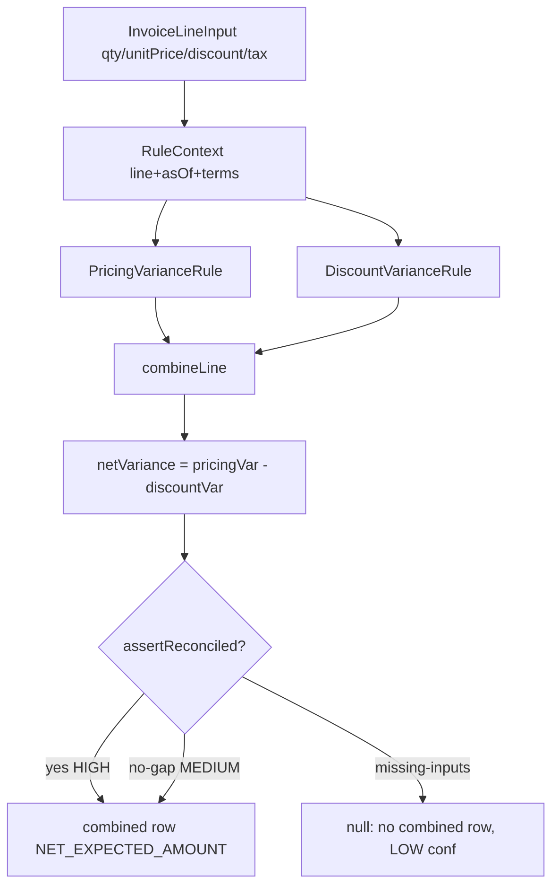

# Truth engine: how one invoice line becomes a variance

## 1. WHY
Every rupee the customer disputes must trace to:
contract said X, invoice charged Y, difference Z, and Z
must equal its parts. Engine is deterministic: same input
+ same rules = byte-identical output months later. No AI,
no clock reads, no DB inside.

## 2. HOW

Sign rule (lives in Variance, enforced by
VarianceCalculator): variance = actual - expected.
Positive = customer overcharged.

## 3. FUNCTION-BY-FUNCTION

### 3a. FinancialTruthEngine.calculate(input, runId)
File: .../financialtruth/calculator/FinancialTruthEngine.java

- [L134-136] evaluatedAt = clock.instant() ONCE.
  Fixed clock => whole run shares one timestamp =>
  replay identical. ruleVersion = sorted codes joined
  with '+' (order-independent fingerprint).
- [L141-148] Per line: build RuleContext (line,
  asOfDate, currency, pricingTerm for product+date,
  discountTerms). Missing pricing term is FATAL later
  (no invented expected).
- [L151-160] Per rule: appliesTo(ctx)? evaluate(ctx) :
  notApplicable. Results collected per CalculationType
  (PRICING_VARIANCE, DISCOUNT_VARIANCE) + component rows.
- combineLine() per line (below). Collect combined rows.
- [L167-170] aggregate(combined, countsPerCurrency) ->
  FinancialImpact per currency (total + confidence +
  coverage evaluated/total) -> Completed CalculationRun.

### 3b. combineLine(input, line, byCalc, version, at)
[L196-258] — the most important 60 lines in the repo.

1. [L198-201] pricing missing/not-Evaluated => return
   null. No price = no expected = no combined row.
   (Run discloses omission via confidence, never
   substitutes zero.)
2. [L202-206] discount INCOMPLETE_INPUTS => return null.
   Unknown entitlement is NOT zero entitlement.
3. [L208-215] expectedGross (from pricing rule),
   expectedDiscount (or zero if none evaluated),
   tax = actualTax (pass-through: same both sides,
   cancels in variance, stays in payable),
   expectedNet = gross - discount + tax,
   actualNet likewise from invoice.
4. [L216] netVariance = actualNet - expectedNet
   (Combined type).
5. [L221-228] components = pricingVar - discountVar
   (built from ZERO, not from net, so the check is real,
   not tautology; discount SUBTRACTED because net
   payable already removed it — the one sign flip).
6. [L235] decomposable = entitlementMeasured OR
   actualDiscount==0. Only then assertReconciled(net,
   components) [VarianceCalculator L88-104: currency
   equal + compareTo equal, scale-insensitive].
   Else: still report total but confidence MEDIUM +
   note "invoice granted X no entitlement covers".
7. [L244-257] Build combined CalculationResult
   (rule NET_EXPECTED_AMOUNT, terms evaluated,
   source pointer, human sentence "Expected ... actual
   ... for invoice ...").

### 3c. VarianceCalculator (the guardrails)
File: .../calculator/VarianceCalculator.java

- variance(expected, actual, type) [L56-58]: thin wrap
  Variance.of (which does actual-expected).
- variance(ExpectedValue, ActualValue, type) [L70-75]:
  null either side => ValidationException (cannot state
  variance from one figure).
- assertReconciled(net, components) [L88-104]:
  null=>Validation; currency mismatch=>IllegalState
  (checked BEFORE amounts); compareTo!=0=>IllegalState
  "refusing to publish total that cannot be decomposed".
- netFromComponents(pricing[], discount[], ccy) [L116]:
  sum pricing, SUBTRACT discount, round once at
  MONETARY_SCALE. Single sign flip lives here.

### 3d. Run lifecycle + reproducibility
- CalculationService: thin facade. netResults() returns
  ONLY combined rows (prevents double-sum bug).
  netVarianceIn() single-currency else throws (no FX).
- CalculationRunService.start(): Running + checksum +
  ruleVersion + period + triggeredBy + startedAt.
  complete(): requires Running->Completed, same runId +
  checksum. fail(): preserves checksum/version,
  truncates cause to VARCHAR(2000).
- ReproducibilityService.verify(): re-run same runId,
  diff list = checksum vs reloaded, replay checksum,
  ruleVersion, row count, per-row canonicalForm,
  fingerprint. reproduced = diffs empty.

## 4. WHAT BREAKS
- Reading system clock per line => replay differs.
- Defaulting missing price to zero => fake expected.
- Adding (not subtracting) discount var => sign flip bug.
- Summing component rows + combined rows in a report =>
  double count. Always use combinedResults().

Next: contract term selection (below) feeds terms in.
