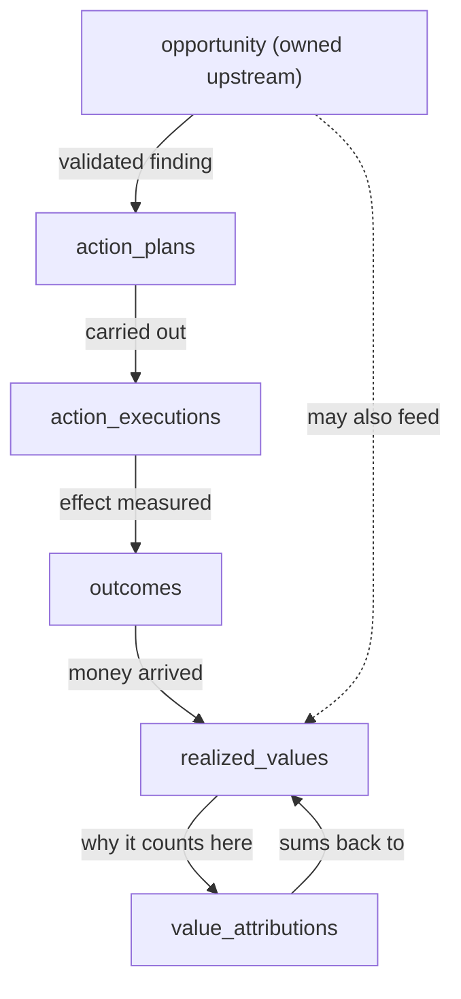
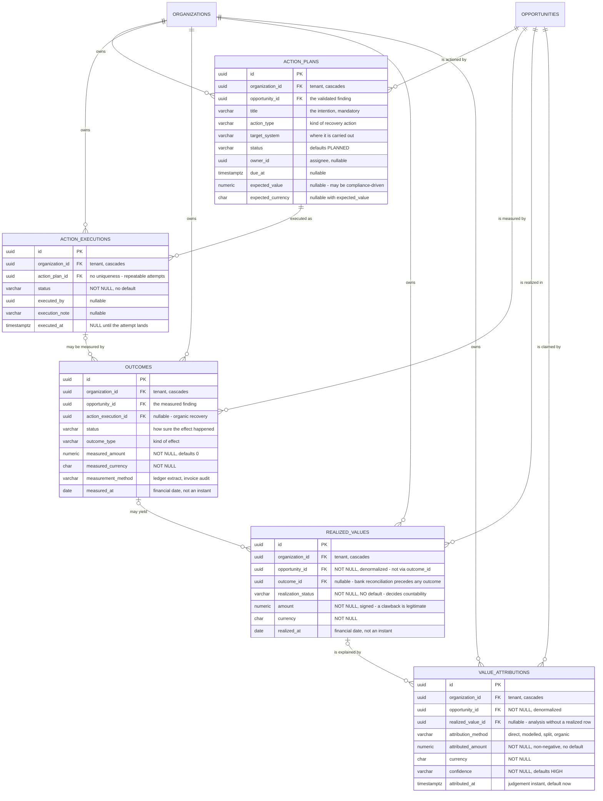
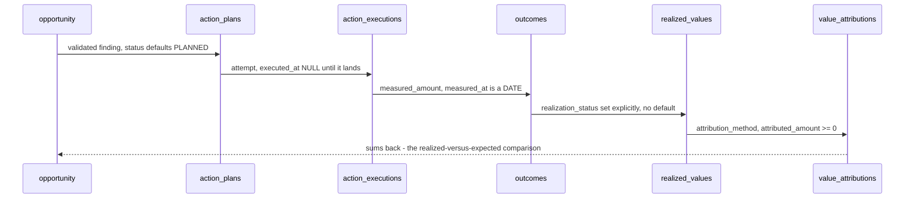

# Chapter 11 — Value realization

> ⚠ **Status note.** This chapter documents a contract encoded in
> `V9__create_value_tracking.sql`, NOT a path that runs today. Of the 24 source
> files under `com.fintech.cfo.value`, exactly one — `enums/CodedEnum.java` — is
> built; the other 23 are empty generator stubs carrying JSDoc-style contracts
> but no behaviour. Every flow described below is `[PLANNED]`. Treat this chapter
> as the design that the empty files exist to satisfy.

---

## A. WHY this module exists

V8 detects that money was left on the table — an opportunity where expected
recovery exceeded measured recovery. Without this module the business has no way
to answer the only question a CFO ultimately asks of a finding: *did it pay for
itself?* The danger of leaving value tracking out is not theoretical: a detection
engine that can neither close a loop nor prove a recovery becomes a cost centre
whose output is trusted on faith, not evidence. Finance cannot sign off on a
recovery program whose denominator is invisible.

The module's hard invariants — the rules a future change must not break:

- **Realized amounts are non-negative by construction.** A recovery is a
  magnitude; direction lives on the opportunity impact and on `outcomes.measured_amount`.
- **No double-counting.** The sum of `value_attributions.attributed_amount` for a
  realized value MUST equal that value's `amount`. This is THE highest-weight
  invariant. It is *not* database-enforced; it is entirely the module's
  responsibility.
- **Money is always paired.** Every `amount` carries its `currency`; a realized
  value or attribution with no currency is a bug, not a default.
- **The four steps stay separate.** A plan may be recorded and never executed; an
  execution may yield no measurable outcome; a realized value may precede any
  outcome (bank reconciliation). Collapsing the tables erases those routine cases.
- **The ledger is append-only.** `amount`, `realized_at`, and `realization_status`
  on a realized value are never overwritten; a reversal is a new row with
  `REVERSED` status, never a mutation of the original.

---

## B. FLOW — the runtime journey

The numbered journey is the four distinct records called out in the migration
header: *a plan is an intention, an execution is the attempt, an outcome is the
measurement, and a realized value is the money.*

1. **Trigger** — an opportunity is validated upstream, and a reviewer decides a
   recovery action is warranted.
   **Where** — `[PLANNED]` `ActionService.createPlan(CreateActionRequest)` →
   `ActionRepository.save(ActionPlan)`.
   **What it does** — writes one `action_plans` row, defaulting `status` to
   `PLANNED`, carrying an optional `expected_value`/`expected_currency`.
   **Why** — the plan is an intention, and `status` defaulting to `PLANNED` is the
   signal that "this has not run yet". A non-default status would falsely claim
   progress. `expected_currency` is nullable, because a plan may be justified on
   compliance grounds rather than a recoverable figure.

2. **Trigger** — the action is actually carried out (a credit note is issued, a
   creditors' call is run).
   **Where** — `[PLANNED]` `ActionService.executeAction(...)` →
   `ActionRepository.save(ActionExecution)`; `action_executions.status` is set on
   the execution attempt.
   **What it does** — writes `action_executions`, one row per attempt, with an
   `executed_at` timestamp that is NULL until the attempt lands.
   **Why** — a plan may be executed more than once (partial recovery, a retried
   credit note), so there is no uniqueness on `action_plan_id`; the index
   `ix_action_executions_plan (action_plan_id, status)` is what answers "is this
   plan done or does it need another attempt".

3. **Trigger** — the effect of the action is measured against a financial date.
   **Where** — `[PLANNED]` `OutcomeService.recordOutcome(RecordOutcomeRequest)` →
   `OutcomeRepository.save(Outcome)`.
   **What it does** — writes `outcomes`, defaulting `measured_amount` to 0 when the
   recovery was nil.
   **Why** — an outcome that recovered nothing is a real, important result;
   defaulting the amount to 0 (rather than NULL) forces an explicit record of
   "we looked and found nothing" instead of letting absence masquerade as data.
   `measured_at` is a `DATE`, deliberately not a `TIMESTAMPTZ`: a realized amount is
   measured at a financial date, and an instant would invite the false precision of
   knowing the minute a ledger posting landed.

4. **Trigger** — money is observed to have arrived (a bank reconciliation, a ledger
   posting).
   **Where** — `[PLANNED]` `RealizedValueService.record(...)` →
   `RealizedValueRepository.save(RealizedValue)`.
   **What it does** — writes `realized_values`, setting `realization_status`,
   `amount`, `currency`, and `realized_at` (a `DATE`).
   **What it represents** — the money itself, distinct from the measurement of it.
   One measurement can yield more than one realized amount (a settlement covering
   two priced items); one realized amount may be recorded before any outcome
   exists (bank reconciliation). `realization_status` has NO default, because
   `amount` is `NOT NULL` — a defaulted status would attach a countable figure to
   an unstated reasoning, and the error would surface as an inflated recovery figure
   rather than as a rejected write. See `RealizationStatus`.

5. **Trigger** — a realized amount must be explained against the opportunity that
   predicted it.
   **Where** — `[PLANNED]` `ValueAttributionService.attribute(...)` →
   `ValueAttributionRepository.save(ValueAttribution)`.
   **What it does** — writes `value_attributions`, one row per claim, with
   `attribution_method`, `attributed_amount`, `currency`, and `confidence`.
   **What it represents** — *why this money counts against this opportunity*. The
   link back to the opportunity is what converts a measurement into evidence about a
   model.

6. **Reconciliation** — `[PLANNED]` `ValueAttributionService.reconcile(opportunityId)`.
   **What it does** — sums `attributed_amount` for each realized value and checks it
   equals that value's `amount`.
   **Why** — this is the no-double-counting guard. It is the module's single
   highest-weight invariant, and nothing in the schema enforces it. A drift here
   means the same recovery is being claimed by two opportunities, and the failure
   mode is indistinguishable from real money.

---

## B.1 SCHEMA MAP — the five V9 tables as an ER diagram

Drawn directly from `V9__create_value_tracking.sql`. `PK` marks a primary key,
`FK` a foreign key.

The diagram shows one tenant-owned chain, with `opportunities` (owned upstream by
the `opportunity` module) entering at every step. The spine is
`ACTION_PLANS ||--o{ ACTION_EXECUTIONS ||--o{ OUTCOMES ||--o{ REALIZED_VALUES ||--o{ VALUE_ATTRIBUTIONS`:
an intention, an attempt, a measurement, the money, and the explanation of why the
money counts. The three links drawn `o|` are the ones that are deliberately
nullable — an outcome may be observed with no execution (organic recovery), a
realized value may precede any outcome (bank reconciliation), and an attribution
may exist with no realized row (analysis). Every table also carries its own
`opportunity_id` rather than deriving it, so the worklist reads never depend on an
optional upstream link. `OUTCOMES` is drawn as an optional child of
`ACTION_EXECUTIONS`, and `ORGANIZATIONS`/`OPPORTUNITIES` are shown as context
entities because they are referenced but not defined in V9.

### B.1.1 The constraints that carry the design

- **`ck_value_attributions_non_negative CHECK (attributed_amount >= 0)` — the
  ONLY database constraint in all of V9.** Five tables, four indexes, one CHECK,
  added by `ALTER` to mirror the policy-style additions in V6. It prevents an
  attribution from netting an unrelated magnitude off an opportunity's realized
  total: a negative attribution would mean credit given back against a recovered
  amount, which belongs in `realized_values` as a negative `amount` with
  `REVERSED` status. It does **not** prevent double-counting — a 100 realized
  value split 70/50 passes every DB rule — so no-double-counting remains
  entirely the module's responsibility.
- **`value_attributions.confidence` defaults to `'HIGH'`.** Anything that omits
  the column receives the strongest possible claim, so a modelled estimate and a
  traced ledger row can carry identical weight in a total without saying so. This
  prevents nothing by itself; it is a guard the service layer must not lean on.
  `ValueAttributionService.attribute` must require `confidence` explicitly.
- **`realization_status` has NO default, while `action_plans.status` defaults to
  `'PLANNED'`.** These look like the same pattern and are deliberate opposites. A
  plan's default attaches no countable figure (its `expected_value` is nullable);
  a realized value's `amount` is `NOT NULL`, so a defaulted status would attach a
  countable number to an unstated reasoning, and the failure would surface as an
  inflated recovery figure rather than as a rejected write.
- **`realized_values.opportunity_id` is NOT NULL and denormalised, though
  `outcome_id` implies it.** `outcome_id` is nullable, so deriving the opportunity
  through it would silently drop every bank-reconciliation row from the
  realized-versus-expected comparison. The denormalisation trades drift for read
  certainty; a drifted row is auditable, a dropped row is invisible.
- **`measured_at` / `realized_at` are `DATE`; `attributed_at` is `TIMESTAMPTZ`.**
  The first two are financial dates — an instant would imply false precision about
  the minute a ledger posting landed. The third is a judgement made after the
  recovery is observed, so it is a clock stamp and is ordered by it in
  `ix_value_attributions_opp`. The type difference is the schema saying "this is
  a business date, that is a moment of reasoning".

### B.1.2 The write path

---

## C. FILES

24 files: 1 built, 23 stub.

| file | status | what it is for | key methods / lines |
|---|---|---|---|
| `enums/CodedEnum.java` | BUILT | shared contract for V9 string columns: `code()`, `normalise()`, width guard. | `code()` :37, `normalise` :46, `requireColumnWidth` :63 |
| `enums/RealizationStatus.java` | STUB | gate at the end of the journey; decides whether a realized amount is countable. | contract only, no methods |
| `enums/OutcomeStatus.java` | STUB | how sure we are the effect happened (vs. how much counts). | contract only |
| `enums/AttributionMethod.java` | STUB | the four ways a realized amount is linked back to an opportunity. | contract only |
| `enums/ActionStatus.java` | STUB | lifecycle states of an action plan/execution. | contract only |
| `model/ValueAttribution.java` | STUB | the "why it counts" row; holds the double-counting guard contract. | contract only |
| `model/RealizedValue.java` | STUB | the money itself; paired amount+currency, append-only. | contract only |
| `model/Outcome.java` | STUB | the measurement; date-valued, zero-default amount. | contract only |
| `model/ActionPlan.java` | STUB | the intention; PLANNED default, nullable expected currency. | contract only |
| `model/ActionExecution.java` | STUB | the attempt; executed_at NULL until it lands. | contract only |
| `dto/CreateActionRequest.java` | STUB | inbound request for step 1. | contract only |
| `dto/ActionResponse.java` | STUB | outbound view of a plan/execution. | contract only |
| `dto/RecordOutcomeRequest.java` | STUB | inbound request for step 3. | contract only |
| `dto/OutcomeResponse.java` | STUB | outbound view of an outcome. | contract only |
| `dto/RealizedValueResponse.java` | STUB | outbound view of a realized value. | contract only |
| `repository/ActionRepository.java` | STUB | persistence port for plans/executions. | contract only |
| `repository/OutcomeRepository.java` | STUB | persistence port for outcomes. | contract only |
| `repository/RealizedValueRepository.java` | STUB | persistence port for realized values. | contract only |
| `service/ActionService.java` | STUB | owns steps 1–2; plan creation vs. execution. | contract only |
| `service/OutcomeService.java` | STUB | owns step 3; records the measurement. | contract only |
| `service/RealizedValueService.java` | STUB | owns step 4; records the money. | contract only |
| `service/ValueAttributionService.java` | STUB | owns steps 5–6; attributes money and reconciles the sum. | contract only |
| `controller/ActionController.java` | STUB | HTTP surface for steps 1–2. | contract only |
| `controller/OutcomeController.java` | STUB | HTTP surface for step 3. | contract only |

---

## D. DEEP DIVE — method by method

### D.1 The realization chain

**approved opportunity → action plan → action execution → realized value → recorded outcome**

These are five distinct row types because collapsing them destroys routine
business states.

- **`action_plans`** is the *intention*. It exists even when nothing is ever
  executed. The migration header states this explicitly: collapsing a plan into an
  execution "would make it impossible to record a plan that was never executed".
  `status` defaults to `PLANNED` so the absence of progress is a first-class state,
  not a NULL. `expected_value`/`expected_currency` are nullable: a compliance-driven
  plan has no recoverable figure, so forcing one would manufacture a phantom.
- **`action_executions`** is the *attempt*. One plan may be executed more than
  once (partial recovery, a retried credit note), so there is no uniqueness on
  `action_plan_id`. `executed_at` is NULL until the attempt lands, and that NULL is
  the record of "this plan is not yet done" — the opposite of a default timestamp.
- **`outcomes`** is the *measurement*. Split from realized values because one
  measurement can yield more than one realized amount (a settlement covering two
  priced items), and one realized amount can be recorded before any outcome
  exists (a bank reconciliation). `action_execution_id` is nullable for the same
  reason: value can be observed from the ledger with no action through this system.
  `measured_amount` defaults to 0, never NULL — "nothing recovered" is a finding
  worth keeping, not a row to be inferred from absence.
- **`realized_values`** is *the money*. `realization_status` decides whether the
  amount is countable. `amount` is `NOT NULL` and `currency` is `NOT NULL`; a
  realized value without a currency is a bug, not a default.
- **`value_attributions`** is *the explanation*. Where realized values answer
  "money arrived", this answers "why it counts against this opportunity".

**Why they are separate types** — each one carries a status whose meaning would be
corrupted by the others. A plan that was never executed still has `PLANNED`; an
execution that could not be measured still has its `executed_at`; a realized value
with no outcome still has `REALIZED`; an attribution that cannot be traced still
has its `attribution_method`. Merge the tables and the NULLs become unrecoverable
ambiguities.

### D.2 The attribution model

`AttributionMethod` (the enum that populates
`value_attributions.attribution_method VARCHAR(32)`) names how an expected value
becomes a realized value. Expected value lives on `action_plans.expected_value`;
realized value lives on `realized_values.amount`. Attribution is the bridge that
decides what share of the realized amount belongs to that plan's opportunity.

The invariant the schema *cannot* express and the module must enforce:

> **The sum of `attributed_amount` across all attributions for a realized value
> MUST equal that realized value's `amount`.**

This is not database-enforced. `ck_value_attributions_non_negative` only checks
that a single attribution is not negative; it says nothing about the sum. A
realization could be split into two attributions of 70 and 50 against a 100
realized amount and pass every DB rule. The module's
`ValueAttributionService.reconcile(...)` is the only thing that catches it.

**Why no-double-counting is the highest-weight invariant** — an over-attribution
is indistinguishable from money that does not exist. The CFO's question ("did it
pay for itself") is only answerable if the denominator is exact. A single
double-counted recovery flattens the reported ROI and, worse, the error survives
as a plausible number: it looks like money. That is the failure mode the
`CodedEnum` comment at :20–:23 describes as the one failure that "cannot be caught
downstream, because the number still looks like money."

### D.3 Schema-derived decisions, with reasoning

**`realized_values.opportunity_id` is NOT NULL and denormalized, though `outcome_id`
implies it.**

The join path from an attribution to an opportunity *could* be
`value_attributions → realized_values → outcomes → opportunities`. But it is not,
because a realized value may have no `outcome_id` (a bank reconciliation records
money before any outcome exists). If `opportunity_id` were derived through
`outcome_id`, those rows would be silently dropped from any "group by opportunity"
query — exactly the read that produces the realized-versus-expected comparison.

The denormalization is therefore a read-vs-drift trade-off chosen in favour of
read certainty: the index `ix_realized_values_opp (opportunity_id, realized_at DESC)`
serves the worklist a reviewer actually walks, and no join is required for it. The
cost is drift: `realized_values.opportunity_id` could disagree with the
opportunity reached through `outcome_id`. The choice is justified because the
schema author explicitly calls the drift the smaller risk — a dropped row silently
understates recovery, while a drifted row is at least present and auditable.

**`realized_values.realization_status` has NO default, while
`action_plans.status` defaults to `PLANNED`.**

These look like the same pattern but are deliberate opposites. A plan's default of
`PLANNED` attaches no countable figure to the row — it is a state label, and `amount`
on a plan is nullable. A realized value's `amount` is `NOT NULL`, so a defaulted
`realization_status` would attach a countable number to an unstated reasoning, and
the mistake would surface as an inflated recovery figure rather than as a rejected
write. The `RealizationStatus` stub comment (:15–:18) spells this out: "a defaulted
status would attach a countable number to an unstated reasoning." This is an
excellent, deliberate choice, and it is the reason `RealizationStatus` carries
exactly four members rather than inheriting `OutcomeStatus`.

**`measured_at`/`realized_at` are DATE; `attributed_at` is TIMESTAMPTZ.**

A realized amount is measured at a financial date (`measured_at`, `realized_at`),
and an instant there would invite the false precision of knowing the minute a
ledger posting landed — the migration comment at `outcomes.measured_at` (:68–:70)
states this directly. An attribution, by contrast, is a *judgement* made after the
recovery is observed — a moment of reasoning, not a business event — so it is
stamped with `now()` as a `TIMESTAMPTZ` and ordered by it in
`ix_value_attributions_opp`. The type difference is the schema's way of saying
"this is a financial date, that is a clock stamp", and the module must preserve it.

**The ONLY DB constraint in V9 is
`ck_value_attributions_non_negative`.**

Five tables, four indexes, one CHECK. The CHECK is on attribution only, because
attribution is the one money column where a negative value has no interpretation:
it would mean credit given back against a recovered amount, which belongs in
`realized_values` as a negative `amount` with `REVERSED` status. Every other amount
column is signed, because a reversal or a refund is a legitimate negative. The
constraint is added by ALTER specifically to "mirror the policy-style additions in
V6, so the rule reads as a schema-wide invariant rather than as a property of one
column" (migration comment :148–:153). The absence of any other constraint is the
single biggest fact this chapter documents: **no-double-counting is entirely the
module's responsibility.**

### D.4 The enums

- **`CodedEnum`** (`enums/CodedEnum.java:30`) — the BUILT file. It is an
  interface, not a base enum: `code()` returns the variant's simple name (so a
  hand-written column and a module-written column agree); `normalise()` uppercases
  and rejects null/blank with a `ValidationException` — a blank in a `NOT NULL`
  column means the row was written by something other than this module;
  `requireColumnWidth(int)` refuses an over-long variant at the boundary so a
  truncated status is never silently read back as unknown. It deliberately does
  *not* extend the `financialtruth.enums` copy, because value must not depend on
  the financial-truth module.

- **`RealizationStatus`** (`enums/RealizationStatus.java:66`) — the four members,
  carried in `realized_values.realization_status VARCHAR(32)` with no default:

  | code | countable? | meaning |
  |---|---|---|
  | `REALIZED` | yes | full amount recovered; the only member that may contribute unconditionally |
  | `PARTIALLY_REALIZED` | yes, at recorded amount only | never grossed up to the measured amount — the gap is the finding |
  | `NOT_REALIZED` | no | observed but no money; retained so "measured but never collected" stays answerable |
  | `REVERSED` | subtracts | a prior recovery was clawed back; a new row, never a mutation |

  The stub comment (:15–:18) is explicit: no default is a deliberate guard, because
  `amount` is `NOT NULL` and a defaulted status would fabricate a countable claim.
  Reversal is a state on the row, never a decrement of the original amount.

- **`OutcomeStatus`** — the counterpart to `RealizationStatus`, carried in
  `outcomes.status VARCHAR(32)`. It answers *how sure we are the effect happened*,
  not *how much counts*. The stub documentation warns the two must not be
  conflated: a `CONFIRMED` outcome may be only partly realized (part still in
  dispute elsewhere), and a fully realized amount may sit on a `PENDING` outcome
  (settlement cleared first). Conflating them as one enum would force a plan to be
  either fully trusted or fully ignored.

- **`AttributionMethod`** — the four methods in
  `value_attributions.attribution_method VARCHAR(32)`, mandatory, no default (the
  method *is* the content of an attribution). The exact members are stub-only, but
  the `ValueAttribution` contract names them by role: a direct trace, a modelled
  estimate, a proportional split of a shared recovery, and an organic recovery. A
  modelled estimate and a traced ledger row must not carry equal weight in a total,
  and the method is the discriminator.

- **`ActionStatus`** — the lifecycle states of a plan/execution, carried in
  `action_plans.status VARCHAR(32)` (default `PLANNED`) and
  `action_executions.status VARCHAR(32)` (no default). The asymmetry is the point:
  a plan starts in `PLANNED`; an execution either was attempted or was not, and the
  status must state which.

### D.5 Each stub, intended role and contract

For each of the 23 stubs: the role it would own, the invariants it must protect,
and the contract it is generated against. All are STUB — "contract only".

- **`model/ActionPlan`** — maps `action_plans`. Invariants: `organization_id` and
  `opportunity_id` NOT NULL; `title` NOT NULL; `action_type` NOT NULL; `status`
  defaults to `PLANNED`; `expected_value`/`expected_currency` nullable. Must
  validate against `ActionStatus` width (`VARCHAR(32)`).
- **`model/ActionExecution`** — maps `action_executions`. Invariants:
  `action_plan_id` NOT NULL; `status` NOT NULL; `executed_at` NULL until attempt
  lands; no uniqueness on `action_plan_id` (repeatable attempts). Must validate
  against `ActionStatus`.
- **`model/Outcome`** — maps `outcomes`. Invariants:
  `opportunity_id` NOT NULL; `action_execution_id` nullable (organic recovery);
  `measured_amount` NOT NULL default 0; `measured_currency` NOT NULL;
  `measured_at` DATE NOT NULL. Must validate against `OutcomeStatus` and widths
  (`outcome_type VARCHAR(48)`, `measurement_method VARCHAR(64)`).
- **`model/RealizedValue`** — maps `realized_values`. Invariants:
  `opportunity_id` NOT NULL (denormalized); `outcome_id` nullable;
  `realization_status` NOT NULL, NO default; `amount` NOT NULL; `currency` NOT NULL;
  `realized_at` DATE NOT NULL. Must validate against `RealizationStatus`
  (`VARCHAR(32)`). Reversal is a new row, never a mutation.

  ⚠ **Review** — the stub comment in `RealizationStatus.java` (:49–:54) states that
  realized amounts are "non-negative by construction" and that V9 enforces this only
  on `value_attributions.attributed_amount`. There is in fact no CHECK on
  `realized_values.amount`. A negative amount on a realized value is not
  prohibited by the database; the non-negativity of this column is the module's
  responsibility to state and test, exactly as the comment says — but a future
  implementer reading only the schema would assume the column is free to go
  negative. The discipline is documented, not enforced.

- **`model/ValueAttribution`** — maps `value_attributions`. Invariants:
  `opportunity_id` NOT NULL (denormalized); `realized_value_id` nullable (analysis
  may attribute without a single realized row); `attribution_method` NOT NULL, no
  default; `attributed_amount` NOT NULL (no default — "an attribution with no amount
  says nothing", migration :132–:134); `currency` NOT NULL;
  `confidence VARCHAR(16)` NOT NULL default `HIGH` — see review below;
  `attributed_at` TIMESTAMPTZ NOT NULL default `now()`. Carries the
  no-double-counting guard: sum of `attributed_amount` per realized value must equal
  the value's `amount`.

  ⚠ **Review — `confidence` defaults to `HIGH`.** The schema sets
  `confidence VARCHAR(16) NOT NULL DEFAULT 'HIGH'` (migration :136). Any
  attribution that omits the column therefore carries the STRONGEST possible claim
  by default. The service layer MUST set it explicitly; anything that relies on the
  default is emitting a decorated number, not a measured confidence. A model that
  rarely states its confidence has lost the meaning of stating it at all.

- **`dto/CreateActionRequest`** — inbound for step 1. Must carry the plan's
  mutable fields and allow `expected_value`/`expected_currency` to be null.
- **`dto/ActionResponse`** — outbound view of a plan and its execution history.
- **`dto/RecordOutcomeRequest`** — inbound for step 3. Must carry
  `measured_amount`, `measured_currency`, `measured_at` (DATE), `measurement_method`,
  and the optional `action_execution_id`; must allow a null execution for organic
  recovery.
- **`dto/OutcomeResponse`** — outbound view of an outcome.
- **`dto/RealizedValueResponse`** — outbound view of a realized value. Must expose
  `realization_status`, `amount`, `currency`, `realized_at`, and the attribution
  totals so a reader can see the reconciliation.
- **`repository/ActionRepository`** — persistence port for plans/executions.
  Invariant: must support the two V9 indexes — by `(opportunity_id, status)` and by
  `(organization_id, owner_id, status)`.
- **`repository/OutcomeRepository`** — persistence port for outcomes. Invariant:
  must support `(opportunity_id, measured_at DESC)` and
  `(organization_id, measured_at DESC)`.
- **`repository/RealizedValueRepository`** — persistence port for realized values.
  Invariant: must support `(opportunity_id, realized_at DESC)`.
- **`service/ActionService`** — owns steps 1–2. Invariants: a plan may be executed
  more than once; `executed_at` must be NULL until the attempt lands; status
  transitions go through `ActionStatus`.
- **`service/OutcomeService`** — owns step 3. Invariant: `measured_amount` default 0
  must never be NULL on the read side; `measured_at` is a DATE, not an instant.
- **`service/RealizedValueService`** — owns step 4. Invariants: `realization_status`
  has no default and must be set explicitly per `RealizationStatus`; the row is
  append-only; reversal is a new row with `REVERSED`.
- **`service/ValueAttributionService`** — owns steps 5–6 and the
  no-double-counting guard. Invariants: `attributed_amount` non-negative (the DB
  CHECK enforces the single-row case; the service enforces the sum); the service
  must reconcile per realized value and fail hard when the sum drifts; `confidence`
  must be set explicitly, never defaulted.
- **`controller/ActionController`** — HTTP surface for steps 1–2.
- **`controller/OutcomeController`** — HTTP surface for step 3.

### D.6 Money: currency is mandatory, not decorative

Every amount column is paired with a `CHAR(3)` currency:
`expected_currency`, `measured_currency`, `currency` on `realized_values`,
`currency` on `value_attributions`. There is no single "amount" column without one.
A realized value without a currency is a bug — mixing currencies in a realized total
would make the figure meaningless. The model stubs (`RealizedValue`,
`Outcome`, `ValueAttribution`) are expected to wrap amounts in a `Money` type so the
pairing is structurally enforced, not merely documented. The reconciliation in
`ValueAttributionService.reconcile` must compare sums within the same currency; a
currency mismatch is a data-integrity failure, not a rounding tolerance.

---

## E. GOTCHAS — what breaks if you get it wrong

Ranked by consequence.

1. **Double-counting through two attributions.**
   - **Symptom** — the CFO's realized-versus-expected report shows a recovery that
     never happened; two opportunities both claim the same realized amount.
   - **Cause** — `value_attributions` has no constraint that the per-realized-value
     sum equals `realized_values.amount` (migration :124–:142, no SUM CHECK). Only
     `ck_value_attributions_non_negative` exists, and it checks a single row.
   - **Blast radius** — money, tenancy, evidence. The number still looks like money,
     so the error survives as a plausible figure downstream.
   - **Fix** — `ValueAttributionService.reconcile` must run on every write path and
     the write must be rejected when the sum drifts. Never make this a warning.

2. **A realized value with no `measured_at` / `realized_at`.**
   - **Symptom** — the value disappears from the `measured_at DESC` worklist and from
     period-based reporting; the recovery is "recorded" but invisible to the date it
     matters.
   - **Cause** — `realized_at DATE NOT NULL` (migration :113) is enforced, but the
     application layer could pass a NULL through a nullable parameter and rely on
     the column to catch it.
   - **Blast radius** — evidence. A recovery not pinned to a date cannot be tied to
     a period, so it cannot be closed out.
   - **Fix** — validate before write; never let the DB exception be the first
     signal.

3. **Overwriting a realized amount in place.**
   - **Symptom** — the audit trail no longer shows that money was counted and later
     withdrawn; a reversal silently looks like a correction.
   - **Cause** — treating `realized_values` as mutable. The migration comment
     (:119–:120) and the `REVERSED` member both forbid this.
   - **Blast radius** — evidence, determinism. The ledger must be append-only.
   - **Fix** — a reversal is a new row with `REVERSED` status and a negative or
     zero amount; the original row is never touched.

4. **`confidence` defaulting to `HIGH`.**
   - **Symptom** — every attribution that did not explicitly set confidence is
     treated as a precisely traced recovery in a weighted total.
   - **Cause** — `confidence VARCHAR(16) NOT NULL DEFAULT 'HIGH'`
     (migration :136); the service omits the column.
   - **Blast radius** — evidence. A model estimate and a ledger trace carry equal
     weight because both say `HIGH`.
   - **Fix** — `ValueAttributionService.attribute` must require `confidence`
     explicitly; the schema default must never be the path of least resistance.

5. **Defaulting `realization_status`.**
   - **Symptom** — a realized value written without a status is summed into
     "what we actually got back" by accident.
   - **Cause** — `realization_status VARCHAR(32) NOT NULL` has no default
     (migration :110), which is the safeguard; adding one would reintroduce the
     defect the absence prevents.
   - **Blast radius** — money. An uninformed status inflates the recovery figure.
   - **Fix** — do not add a default; require `RealizationStatus` on every write.

6. **Currencies mixed in a realized total.**
   - **Symptom** — a portfolio figure that adds USD to EUR with no conversion.
   - **Cause** — aggregating `amount` without grouping by `currency`.
   - **Blast radius** — money.
   - **Fix** — the model type must be `Money`, and the aggregation must be
     per-currency, failing fast on a mismatch.

7. **A truncated status being read back as unknown.**
   - **Symptom** — a valid status is refused at read time because it was silently
     truncated at write time.
   - **Cause** — an enum variant whose `code()` exceeds the column width.
   - **Blast radius** — evidence. A `CodedEnum.requireColumnWidth` guard exists
     (:63) to refuse this at the boundary instead.
   - **Fix** — never bypass `requireColumnWidth`; treat a width violation as a
     compile-time failure, not a write-time surprise.

---

## F. TESTS — what locks this down

This is a contract-only chapter. There is no test code in the module today — every
test class is a future artifact. What follows is the invariant each planned test
class must protect, stated as a business rule so it survives implementation.

- **`ValueAttributionServiceTest`** — protects
  *no-double-counting*: for each realized value, the sum of
  `value_attributions.attributed_amount` equals `realized_values.amount`.
  High-value cases: (a) a 100 realized value split 60/40 must pass; (b) a 100
  realized value split 70/50 must fail the write; (c) a negative attribution must be
  refused (DB CHECK aside, the service must reject before write).

  ⚠ **Not covered today** — there is no test, and no production code, to enforce
  the sum invariant. The claim "sum == realized amount" is a design statement until
  the service exists.

- **`RealizedValueServiceTest`** — protects
  *append-only / reversal-by-row*: updating `amount` in place is rejected; a
  reversal produces a `REVERSED` row and leaves the original untouched.

- **`OutcomeServiceTest`** — protects *zero-default amount* and
  *date-as-financial-date*: a nil recovery is recorded as `measured_amount = 0`,
  never NULL; `measured_at` is a date, and the service never substitutes a
  TIMESTAMPTZ.

- **`CodedEnumTest`** — protects *width guard* and *loud failure*:
  `requireColumnWidth` refuses an over-long variant; `normalise` throws
  `ValidationException` on a blank code (a blank in a NOT NULL column means
  out-of-module write).

- **`RealizationStatusTest`** — protects *no-default status*: a realized value
  without an explicit `RealizationStatus` cannot be persisted.

What is NOT covered: any test of the end-to-end chain, because none of the service
stubs are built. An untested rule is a claim, not a guarantee — and here, nearly
every rule is a claim.

---

## G. WIRING — where this connects

Module boundary: `com.fintech.cfo.value` may import `shared` and `platform` only.
Cross-module exchange happens through consumer-owned types or port interfaces at
the integration milestone.

- **Imports (inbound dependency).** `value` imports only `com.fintech.cfo.shared`
  — confirmed by `CodedEnum.java:6`, which references
  `com.fintech.cfo.shared.exception.ValidationException`. Nothing in `value`
  imports any other `fintech.cfo` module.

- **Consumed (upstream).** The chain starts at an *approved opportunity*. That
  type lives in `com.fintech.cfo.opportunity` — outside this module, and not
  imported here. The foreign key
  `action_plans.opportunity_id REFERENCES opportunities(id)` and
  `outcomes.opportunity_id REFERENCES opportunities(id)` and
  `realized_values.opportunity_id REFERENCES opportunities(id)` are
  database-level links only; the Java layer has no opportunity import. The
  integration milestone must supply the opportunity projection through a port
  interface owned by `opportunity`, not by `value`.

  ⚠ **Review** — there is no Java type in `value` representing an opportunity. If
  the service layer materializes an opportunity by ID without a port, it will
  couple to a foreign module's internals. The contract does not name the
  opportunity type because `value` is not permitted to import it.

- **Downstream (would consume this).** `reporting` (the realized-versus-expected
  comparison) and `processing` (the worklist a reviewer walks), both referenced by
  the V9 indexes (`ix_realized_values_opp`, `ix_outcomes_org_date`,
  `ix_value_attributions_opp`). Neither is present in the workspace today; both
  are stub. They must consume `value` through the DTOs
  (`RealizedValueResponse`, `OutcomeResponse`, `ActionResponse`), never through the
  model types.

- **Before wiring is real.** (1) The four enums must become real `enum` types
  implementing `CodedEnum`, each with a `fromCode` resolver and a `requireColumnWidth`
  check matching its V9 column width; (2) the 5 model stubs must become JPA/JOOQ
  mappings of the five tables, enforcing NOT NULL, defaults, and the non-negativity
  of `attributed_amount`; (3) the 4 service stubs must implement the FLOW steps,
  including the `reconcile` no-double-counting guard; (4) the 5 repository stubs
  must expose the four V9 indexes as query methods; (5) the 4 DTO stubs must be
  populated and the 2 controller stubs must bind the HTTP surface. Until then, the
  only compile path is `CodedEnum` — and it is, today, unreachable because nothing
  calls `code()`, `normalise()`, or `requireColumnWidth()`.

The wiring is therefore complete as a schema contract and empty as a runtime path.
