# 14 — Database Schema (V1–V10)

> This chapter supersedes the ER/FAQ fragment in `06-appendices.md`. Its row/column
> counts and index list are stale there; this chapter is correct against the
> working tree as of the migrations in `src/main/resources/db/migration/`.

This is the schema reference, not a module chapter. The migrations are the
single source of truth for the database; the Java model records that follow are
**shadows** of them. The rule in `docs/architecture/module-implementation-rules.md`
§7 is explicit and is the spine of everything below: *map entities to the exact
table and column names; do not edit a migration to suit an entity; no `ddl-auto`
creates or alters columns in production.*

---

## A. WHY this schema exists

A financial platform lives or dies on three things: money that is exactly what it
claims, a tenant boundary that no query can cross, and a chain of evidence from
any reported figure back to the row a supplier actually submitted. This schema
exists to make all three enforceable in the database, so the rule holds for every
writer — including a hand-written fix or a batch import — not just the application
code.

### Hard invariants (must not be broken)

- **The migration set owns the schema.** `spring.jpa.hibernate.ddl-auto` is
  `validate` (`application.yml:50`); nothing in this codebase writes, alters, or
  drops a column. Migrations V1–V10 are the only schema author.
- **Money is `NUMERIC(20,4)`; quantities and unit prices are `NUMERIC(20,6)`**
  (§3). No `double`/`float` for money, anywhere. A money amount without a
  `CHAR(3)` currency column is unrepresentable by construction — amounts are
  never summed across currencies.
- **`organization_id` is the tenant boundary.** Every tenant-owned table carries
  it directly (§6), and every unique constraint on such a table includes it.
- **`version BIGINT` is the optimistic-lock counter** on versioned, tenant-scoped
  entities; a lock failure is a `ConflictException` (409) — never a silent
  last-write-wins overwrite.
- **The `CHECK` constraints encode the module's arithmetic**, most notably
  `ck_invoice_lines_total`, which states a line total is *derived*, not an input.
- **Evidence must outlive its source.** Deletion of a supplier file or a retired
  contract never cascades into the financial or audit records that referenced it.

---

## B. FLOW — how the schema is laid down and checked

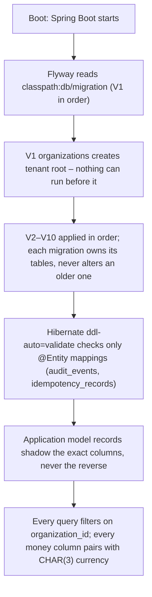

1. **Trigger** — `CfoApplication` (`/cfo/src/main/java/com/fintech/cfo/CfoApplication.java`),
   Spring Boot starts with `spring.jpa.hibernate.ddl-auto: validate`
   (`application.yml:50`, restated at `application-prod.yml:19`,
   `application-test.yml:14`).
2. **Where** — `spring.flyway.locations=classpath:db/migration` (`application.yml:72`).
   **What** — applies V1..V10 in version order; each file is the only writer for
   its tables. **Why** — a tenant root (`organizations`) must exist before any
   table can reference it, which is why V1 is first by necessity, not convention.
3. **Where** — `application.yml:46-50` (`ddl-auto: validate`).
   **What** — Hibernate compares only `@Entity`-annotated classes against the
   migration-built DDL. **Why** — drift between the ORM and the migration must
   fail the boot rather than be silently repaired in production. This is a
   *check*, not an *author*: only two classes carry `@Entity`.
4. **Where** — the plain `record` models (`financial/model/*`, etc.).
   **What** — they shadow the exact table/column names. **Why** — the persistence
   pass must be mechanical; a migration is never edited to suit a model
   (`module-implementation-rules.md` §7).
5. **Where** — `TenantContext` / `SecurityContext` (§6) and every repository
   query. **What** — every tenant-scoped query filters on `organization_id`.
   **Why** — denormalising the tenant onto every business table removes the join
   through which a missed filter becomes a cross-tenant leak.

---

## C. FILES — every migration

**10 migrations: V1–V10, one per concern, applied strictly in order.** No
rollback scripts; migrations are append-only history and are never edited after
they have run (see §E).

| migration | owning module | tables created | purpose | invariants enforced |
|---|---|---|---|---|
| `V1__create_organizations.sql` | `identity` (`com.fintech.cfo.identity`) — cross-cutting tenant infra | `organizations` | Tenant root. Everything references this table, so it is first. | UUID PK (client-assignable, cross-referenceable before insert); tenant-scoped uniqueness on `registration_number` via a `WHERE ... IS NOT NULL` partial index (statutory id, global); `active` flag (no row deletion) |
| `V2__create_users_roles.sql` | `identity` | `users`, `roles`, `permissions`, `role_permissions`, `memberships` | Identity + authorization. User is global; membership is tenant-scoped. | Case-insensitive unique email (`lower(email)`); role code unique; permission code unique; one membership per (user, org, role); edge tables are pure joins with no `version` (replaced wholesale, not mutated) |
| `V3__create_ingestion.sql` | `ingestion` (`com.fintech.cfo.ingestion`) | `source_files`, `ingestion_runs`, `source_records`, `ingestion_errors` | Immutable admission: trusted bytes + run observability. Nothing is updated in place. | Content-address dedup per tenant (`organization_id, checksum_sha256`); one row per (file, position); same file may be uploaded to multiple tenants (unique scoped, not global) |
| `V4__create_financial_data.sql` | `financial` (`com.fintech.cfo.financial`) | `customers`, `products`, `accounting_periods`, `invoices`, `invoice_lines`, `financial_transactions` | Canonical, source-independent internal truth about money. | Money = `NUMERIC(20,4)`, qty/unit price = `NUMERIC(20,6)`; idempotency on (`org, source_system, external_key`); `ck_accounting_periods_range` (end ≥ start); `ck_invoice_lines_total` (line total is derived, not input) |
| `V5__create_contracts.sql` | `contract` (`com.fintech.cfo.contract`) | `contracts`, `contract_terms`, `pricing_terms`, `discount_terms`, `commercial_rules` | Commercial terms: "what should this have cost?" vs V4's "what did it cost?" | Bitemporal terms (`effective_from`+`nullable effective_to`); `term_version` (business) distinct from `version` (JPA lock); date-range CHECKs on contracts and contract_terms; term resolver index is the hot path (`V9–V1` |
| `V6__create_calculations.sql` | `financialtruth` (`com.fintech.cfo.financialtruth`) | `calculation_runs`, `calculation_results` | Deterministic variance engine. Reproducible by design. | `input_checksum` (CHAR(64)) reproducible-lookup; currency-amount pairing CHECKs (`variance_amount` ⇒ `variance_currency`, same for `impact`); polymorphic `entity_type/entity_id` FK by intent only |
| `V7__create_evidence_lineage.sql` | `evidence` (`com.fintech.cfo.evidence`) | `evidence_snapshots`, `evidences`, `evidence_references`, `lineage_nodes`, `lineage_edges` | Walk a number back to the supplier's file. Content-addressed provenance. | `content_hash` dedup; snapshot uniqueness per (org,subject,hash); edge uniqueness by endpoints; lineage edges cascade-delete with their nodes |
| `V8__create_opportunities.sql` | `opportunity` (`com.fintech.cfo.opportunity`); `investigations` belongs to `investigation` | `opportunities`, `opportunity_impacts`, `opportunity_findings`, `opportunity_reviews`, `opportunity_lifecycle_events`, `opportunity_assignments`, `investigations` | The central product object: the validated finding the business pursues. | One current owner per opportunity (`ux_opportunity_assignments_opp` on `opportunity_id` alone); append-only reviews/events/findings/impact; `status` (lifecycle) distinct from `validation_status` (human confirmed) |
| `V9__create_value_tracking.sql` | `value` (`com.fintech.cfo.value`) | `action_plans`, `action_executions`, `outcomes`, `realized_values`, `value_attributions` | Close the loop: was the money actually recovered? | Four-step chain (plan→execution→outcome→realized); `measured_at`/`realized_at` are `DATE` (financial date, no false instant precision); `attributed_amount` non-negative (`ck_value_attributions_non_negative`) |
| `V10__create_audit.sql` | `platform` (`com.fintech.cfo.platform`) | `audit_events`, `idempotency_records` | Append-only audit trail + global idempotency. Depends on, constrains by, nothing. | Audit rows unconstrained by any FK (must survive deletion of the audited subject); idempotency key globally unique (deliberate — see §D); only `version` counter; `request_fingerprint CHAR(64)` |

**Table count: 42.** `1 + 5 + 4 + 6 + 5 + 2 + 5 + 7 + 5 + 2`.

---

## D. DEEP DIVE — the schema reference

### D.1 Type-selection legend (read once)

Every type below is deliberate. The rationale is stated in the migration comments;
this legend is the translation key.

| SQL type | used for | why |
|---|---|---|
| `UUID` | every PK and tenant FK | Client-assignable: a calculation run, its result, and the opportunity it produces can all be named in the same transaction and cross-referenced by an audit row written afterwards. A sequence would force a flush between each write. |
| `CHAR(3)` | `currency`, `base_currency` | Fixed ISO-4217 width; cheaper to store/validate than varchar and signals "exactly three" to every reader. |
| `CHAR(64)` | `checksum_sha256`, `content_hash`, `input_checksum`, `request_fingerprint` | Fixed-width SHA-256 hex. A fixed width can never be truncated into a different-but-valid-looking hash, which is the entire point of a fingerprint. On entities, `@JdbcTypeCode(SqlTypes.CHAR)` + `columnDefinition="char(64)"` makes Hibernate's validator expect `bpchar` (`IdempotencyRecord.java:94-96`); plain `@Column(length=64)` on a `String` implies `varchar` and fails validation. |
| `NUMERIC(20,4)` | money amounts | §3. 16 integer digits + 4 scale; enough for any realistic currency value at cent/sen/paisa precision. `BigDecimal` on the Java side. |
| `NUMERIC(20,6)` | `quantity`, `unit_price`, rate/disount values | §3. 14 integer + 6 scale. Finer than money scale because a rate is a rate; the product is rounded to 4 once before storage. |
| `TIMESTAMPTZ` | `created_at`, `updated_at`, `occurred_at`, `uploaded_at`, etc. | An instant with a timezone, stored in UTC (`hibernate.jdbc.time_zone: UTC`, `application.yml:57`). `TIMESTAMP` without a zone would record an ambiguous instant. |
| `DATE` | `start_date`, `end_date`, `invoice_date`, `measured_at`, `realized_at`, `effective_from/to` | A calendar business date, deliberately *not* an instant. A realized amount is measured at a financial date; an instant would imply false precision about the minute a ledger posting landed. |
| `VARCHAR(n)` | names, descriptors, codes, free text, `entity_type` | Bounded where the content is structural; unbounded via `TEXT` only for verbatim source (`raw_payload`) or structured before/after (`details`). |
| `BIGINT` | `version`, row counts, `job_instance_id` | A counter that must change on *every* write (two writes in the same instant would not). |
| `BOOLEAN` | `active`, `valid` | Genuinely boolean, not a tri-state. |

Per-tenant scoping rule (§6): a tenant-owned table's PK is still a bare UUID —
uniqueness across the whole table is *not* the contract; uniqueness *within a
tenant* is. That is why every `UNIQUE` index on a tenant-owned table is prefixed
with `organization_id`, and why exactly two constraints in this schema are
deliberately **not**: `registration_number` (statutory) and `idempotency_key`
(global). Both are called out in §D.4.

---

### D.2 Per-table reference

Tables are grouped by the migration that owns them. Column order is source order.
`null?` is `Y/N`; `default` is blank when none.

#### V1 — `organizations` (identity, tenant root)

`src/main/resources/db/migration/V1__create_organizations.sql:29`

Purpose: the tenant root. Every other table references `organizations.id`; this is
first by necessity.

| column | type | null? | default | why |
|---|---|---|---|---|
| id | UUID PK | N | — | Client-assignable PK (see legend) |
| name | VARCHAR(255) | N | — | Human label, unbounded length beyond 255 not useful |
| legal_name | VARCHAR(255) | Y | — | Nullable: onboarding may precede legal identity |
| registration_number | VARCHAR(120) | Y | — | Variable-length statutory id; nullable for the same reason |
| base_currency | CHAR(3) | N | `'INR'` | Tenant's reporting currency floor (§3, legend) |
| timezone | VARCHAR(64) | N | `'UTC'` | Per-tenant display zone for date interpretation |
| active | BOOLEAN | N | `TRUE` | Flag, not deletion: a deactivated tenant's rows stay readable |
| created_at | TIMESTAMPTZ | N | `now()` | Audit instant, UTC |
| updated_at | TIMESTAMPTZ | N | `now()` | Audit instant, UTC |
| version | BIGINT | N | `0` | Optimistic lock; a lost org edit would change a tenant's reporting currency |

**Indexes**
- `ux_organizations_registration_number` `(registration_number) WHERE registration_number IS NOT NULL` — enforces "the same company may not register twice"; `WHERE … IS NOT NULL` is required because PostgreSQL treats NULLs as distinct, so without it onboarding-incomplete tenants would all be distinct. Not tenant-scoped by design (statutory).
- `ix_organizations_active` `(active)` — serves "which tenants are live" on every authentication; low cardinality, tiny table.

**Constraints:** none (the unique is index-backed, above).

---

#### V2 — identity

`src/main/resources/db/migration/V2__create_users_roles.sql`

**Purpose:** turn the tenant root into an enforceable boundary; make
"who may act where" a stored fact rather than a token claim.

##### `users` (V2:17)

A person who authenticates. Global — not tenant-scoped — because one analyst may
serve several customers; the membership grants scope.

| column | type | null? | default | why |
|---|---|---|---|---|
| id | UUID PK | N | — | Client-assignable PK |
| email | VARCHAR(320) | N | — | RFC 5321 maximum length |
| display_name | VARCHAR(255) | N | — | Human label |
| password_hash | VARCHAR(255) | Y | — | Nullable; the system federates to OIDC and holds no password |
| status | VARCHAR(32) | N | `'ACTIVE'` | Lifecycle gate on auth |
| last_login_at | TIMESTAMPTZ | Y | — | Instant, UTC |
| created_at/updated_at | TIMESTAMPTZ | N | `now()` | Audit pair |
| version | BIGINT | N | `0` | Optimistic lock |

**Indexes:** `ux_users_email` `(lower(email))` — case-insensitive unique; a plain unique index would admit `Alice@x` and `alice@x`, a duplicate-account takeover.

##### `roles` (V2:41)

Tenant-scoped collection of permissions. Data, not a Java enum, so a new role needs no migration.

| column | type | null? | default | why |
|---|---|---|---|---|
| id | UUID PK | N | — | Client-assignable PK |
| code | VARCHAR(64) | N | — | Authorization key in policy expressions; unique |
| name | VARCHAR(255) | N | — | Display label, free to change |
| description | VARCHAR(1000) | Y | — | Human text |
| system_role | BOOLEAN | N | `FALSE` | Marks roles the app depends on (admin/auditor) — renamable, not deletable |
| created_at/updated_at | TIMESTAMPTZ | N | `now()` | Audit pair |
| version | BIGINT | N | `0` | Optimistic lock |

**Indexes:** `ux_roles_code` `(code)`.

##### `permissions` (V2:61)

Global permission catalogue.

| column | type | null? | default | why |
|---|---|---|---|---|
| id | UUID PK | N | — | |
| code | VARCHAR(120) | N | — | Stable authorization string |
| description | VARCHAR(500) | Y | — | |
| created_at | TIMESTAMPTZ | N | `now()` | Audit (no `updated_at`: catalogue entries are not edited) |

**Indexes:** `ux_permissions_code` `(code)`.

##### `role_permissions` (V2:73)

Pure join edge. Both FKs `ON DELETE CASCADE`; no `version` (replaced wholesale).

| column | type | null? | default | why |
|---|---|---|---|---|
| role_id | UUID | N | — | → `roles.id` CASCADE |
| permission_id | UUID | N | — | → `permissions.id` CASCADE |

**Constraint:** PK `(role_id, permission_id)` — composite PK so a duplicate grant is unrepresentable, not merely discouraged.

##### `memberships` (V2:82)

The tenant authorization boundary: one user's role within one organization.

| column | type | null? | default | why |
|---|---|---|---|---|
| id | UUID PK | N | — | |
| organization_id | UUID | N | — | → `organizations.id` CASCADE |
| user_id | UUID | N | — | → `users.id` CASCADE |
| role_id | UUID | N | — | → `roles.id` — **no cascade** (deleting a role must not revoke access silently) |
| status | VARCHAR(32) | N | `'ACTIVE'` | |
| created_at/updated_at | TIMESTAMPTZ | N | `now()` | Audit pair |
| version | BIGINT | N | `0` | Optimistic lock |

**Indexes:** `ux_memberships_user_org_role` `(user_id, organization_id, role_id)` — unique (one active membership per user+org+role; the three columns express the combination); `ix_memberships_org` `(organization_id, status)` — "who can act in this tenant"; `ix_memberships_user` `(user_id, status)` — "what does this principal hold in this tenant". Both tenant-scoped with `status` second.

---

#### V3 — `financial` ingestion

`src/main/resources/db/migration/V3__create_ingestion.sql`

**Purpose:** where untrusted data becomes trustworthy. Immutable raw records so
nothing downstream must be trusted after the fact.

##### `source_files` (V3:17)

| column | type | null? | default | why |
|---|---|---|---|---|
| id | UUID PK | N | — | |
| organization_id | UUID | N | — | tenant boundary, → `organizations.id` CASCADE |
| original_filename | VARCHAR(512) | N | — | Client claim; never used as a path |
| content_type | VARCHAR(255) | Y | — | Declared type; paired with detected |
| storage_key | VARCHAR(1024) | N | — | Opaque storage key, not a path (no traversal) |
| size_bytes | BIGINT | N | — | |
| checksum_sha256 | CHAR(64) | N | — | Content-addressed dedup |
| declared_file_type | VARCHAR(32) | N | — | Declared; paired with detected as a security signal |
| detected_file_type | VARCHAR(32) | Y | — | |
| security_status | VARCHAR(32) | N | `'PENDING'` | A file is never parsed while PENDING |
| uploaded_by | UUID | Y | — | No FK to users: audit must survive principal deletion |
| uploaded_at | TIMESTAMPTZ | N | `now()` | Instant, UTC |
| created_at | TIMESTAMPTZ | N | `now()` | |

**Indexes:** `ux_source_files_org_checksum` `(organization_id, checksum_sha256)` — content dedup per tenant (same bytes legitimately belong to two tenants); `ix_source_files_org` `(organization_id, uploaded_at DESC)` — upload list, newest first.

##### `ingestion_runs` (V3:60)

Reprocess unit + observability.

| column | type | null? | default | why |
|---|---|---|---|---|
| id | UUID PK | N | — | |
| organization_id | UUID | N | — | → `organizations.id` CASCADE |
| source_file_id | UUID | N | — | → `source_files.id` CASCADE |
| status | VARCHAR(32) | N | `'PENDING'` | Operator outcome |
| stage | VARCHAR(32) | N | `'UPLOAD'` | Finer position in pipeline |
| source_system | VARCHAR(64) | Y | — | |
| total_rows/accepted_rows/rejected_rows | BIGINT | Y | — | Stored, not recomputed (accepted+rejected=total) |
| job_instance_id | BIGINT | Y | — | Link to **Spring Batch** (`BATCH_JOB_INSTANCE`), which this repo does **not** create — see ⚠ Review #5 |
| started_at/completed_at | TIMESTAMPTZ | Y | — | Instants |
| failure_reason | VARCHAR(2000) | Y | — | Bounded: a stack trace does not belong here |
| created_at/updated_at | TIMESTAMPTZ | N | `now()` | Audit pair |
| version | BIGINT | N | `0` | Optimistic lock |

**Indexes:** `ix_ingestion_runs_org` `(organization_id, created_at DESC)` — run list; `ix_ingestion_runs_file` `(source_file_id)` — "everything this file produced".

##### `source_records` (V3:93)

Raw parsed row, preserved verbatim.

| column | type | null? | default | why |
|---|---|---|---|---|
| id | UUID PK | N | — | |
| organization_id | UUID | N | — | → `organizations.id` CASCADE |
| source_file_id | UUID | N | — | → `source_files.id` CASCADE |
| ingestion_run_id | UUID | N | — | → `ingestion_runs.id` CASCADE |
| row_number | BIGINT | N | — | 1-based; identity for replay |
| raw_payload | TEXT | N | — | Verbatim, including a number that later failed to parse |
| valid | BOOLEAN | N | `TRUE` | |
| validation_errors | TEXT | Y | — | |
| created_at | TIMESTAMPTZ | N | `now()` | |

**Indexes:** `ix_source_records_run` `(ingestion_run_id, valid)` — "how many rejected, which ones", leading with run.
**Constraint:** `UNIQUE (source_file_id, row_number)` — one row per position; without it a retry doubles the row count and every derived total.

##### `ingestion_errors` (V3:120)

Rejections kept, not discarded — they are the evidence for what was excluded.

| column | type | null? | default | why |
|---|---|---|---|---|
| id | UUID PK | N | — | |
| organization_id | UUID | N | — | → `organizations.id` CASCADE |
| ingestion_run_id | UUID | N | — | → `ingestion_runs.id` CASCADE |
| error_type | VARCHAR(32) | N | — | |
| severity | VARCHAR(16) | N | — | |
| row_number | BIGINT | Y | — | Nullable: a file-level failure has no row |
| field_name | VARCHAR(255) | Y | — | |
| message | VARCHAR(2000) | N | — | Bounded: a stack trace belongs in logs |
| created_at | TIMESTAMPTZ | N | `now()` | |

**Indexes:** `ix_ingestion_errors_run` `(ingestion_run_id, severity)` — severity second because the dominant query is "this run's errors", usually filtered to blocking ones.

---

#### V4 — `financial` canonical data

`src/main/resources/db/migration/V4__create_financial_data.sql`

**Purpose:** the normalized internal truth, source-independent. Everything
downstream reads these tables, never the raw ingestion tables.

##### `customers` (V4:20)

| column | type | null? | default | why |
|---|---|---|---|---|
| id | UUID PK | N | — | |
| organization_id | UUID | N | — | → `organizations.id` CASCADE |
| external_key | VARCHAR(255) | Y | — | Supplier id; nullable for hand-created |
| name | VARCHAR(255) | N | — | |
| email | VARCHAR(320) | Y | — | RFC 5321 max |
| tax_identifier | VARCHAR(120) | Y | — | |
| currency | CHAR(3) | N | — | NOT NULL with no default: defaulting to the tenant base currency would silently assume money |
| source_system | VARCHAR(64) | N | — | Idempotency component |
| created_at/updated_at | TIMESTAMPTZ | N | `now()` | Audit pair |
| version | BIGINT | N | `0` | Optimistic lock |

**Indexes:** `ux_customers_org_source_key` `(organization_id, source_system, external_key) WHERE external_key IS NOT NULL` — idempotency; scoped per tenant+system so two tenants may use the same external id, and manually created NULL rows coexist; `ix_customers_org_name` `(organization_id, name)` — customer picker/search.

##### `products` (V4:51)

| column | type | null? | default | why |
|---|---|---|---|---|
| id | UUID PK | N | — | |
| organization_id | UUID | N | — | → `organizations.id` CASCADE |
| external_key | VARCHAR(255) | Y | — | Idempotency component |
| sku | VARCHAR(120) | Y | — | Price resolution key |
| name | VARCHAR(255) | N | — | |
| description | VARCHAR(2000) | Y | — | |
| unit_of_measure | VARCHAR(32) | Y | — | |
| currency | CHAR(3) | N | — | No default for the same reason as customers |
| source_system | VARCHAR(64) | N | — | Idempotency component |
| created_at/updated_at | TIMESTAMPTZ | N | `now()` | Audit pair |
| version | BIGINT | N | `0` | Optimistic lock |

**Indexes:** `ux_products_org_source_key` (idempotency, same shape as customers); `ix_products_org_sku` `(organization_id, sku)` — SKU lookup.

##### `accounting_periods` (V4:76)

A tenant's reporting bucket; closed periods are immutable.

| column | type | null? | default | why |
|---|---|---|---|---|
| id | UUID PK | N | — | |
| organization_id | UUID | N | — | → `organizations.id` CASCADE |
| code | VARCHAR(32) | N | — | Tenant's own label (FY25-Q1) |
| start_date | DATE | N | — | Business date, not instant |
| end_date | DATE | N | — | Business date |
| status | VARCHAR(32) | N | `'OPEN'` | |
| created_at/updated_at | TIMESTAMPTZ | N | `now()` | Audit pair |
| version | BIGINT | N | `0` | Optimistic lock |

**Indexes:** `ux_accounting_periods_org_code` `(organization_id, code)` — code is tenant-scoped (not global).
**Constraint:** `ck_accounting_periods_range CHECK (end_date >= start_date)` — a period ending before it starts is always a defect, refused by the DB for every writer.

##### `invoices` (V4:98)

The header. Stored totals are source facts, not recomputed (the supplier's
arithmetic is itself evidence).

| column | type | null? | default | why |
|---|---|---|---|---|
| id | UUID PK | N | — | |
| organization_id | UUID | N | — | → `organizations.id` CASCADE |
| customer_id | UUID | N | — | → `customers.id` — no cascade (deleting a customer must not delete invoices) |
| accounting_period_id | UUID | Y | — | → `accounting_periods.id` — no cascade |
| invoice_number | VARCHAR(120) | N | — | |
| invoice_date | DATE | N | — | Business date |
| due_date | DATE | Y | — | |
| status | VARCHAR(32) | N | — | |
| currency | CHAR(3) | N | — | |
| subtotal_amount/tax_amount/total_amount | NUMERIC(20,4) | N | `0` | Money scale (§3) |
| external_key | VARCHAR(255) | Y | — | Idempotency |
| source_system | VARCHAR(64) | N | — | Idempotency |
| source_file_id | UUID | Y | — | → `source_files.id` — no cascade (invoice survives source purge) |
| created_at/updated_at | TIMESTAMPTZ | N | `now()` | Audit pair |
| version | BIGINT | N | `0` | Optimistic lock |

**Indexes:** `ux_invoices_org_source_number` `(organization_id, source_system, invoice_number)` — invoice numbers are per-source-system, not global; `ix_invoices_org_date` `(organization_id, invoice_date DESC)` — period/aging; `ix_invoices_customer` `(customer_id, invoice_date DESC)` — customer statement.

##### `invoice_lines` (V4:141)  ⚠ Review #1, #2

The schema's most consequential table/constraint.

| column | type | null? | default | why |
|---|---|---|---|---|
| id | UUID PK | N | — | |
| organization_id | UUID | N | — | → `organizations.id` CASCADE |
| invoice_id | UUID | N | — | → `invoices.id` CASCADE |
| product_id | UUID | Y | — | → `products.id` — no cascade; unmapped line still billed |
| line_number | INT | N | — | 1-based; identity (no external key) |
| description | VARCHAR(1000) | Y | — | |
| quantity | NUMERIC(20,6) | N | — | 6dp (§3) — the scale that creates the rounding question |
| unit_price | NUMERIC(20,6) | N | — | 6dp rate (§3) |
| discount_amount | NUMERIC(20,4) | N | `0` | Money scale |
| tax_amount | NUMERIC(20,4) | N | `0` | Money scale |
| line_total | NUMERIC(20,4) | N | `0` | Money scale — **see constraint** |
| currency | CHAR(3) | N | — | |
| source_row_number | BIGINT | Y | — | Direct pointer to the source row |
| created_at/updated_at | TIMESTAMPTZ | N | `now()` | Audit pair |
| version | BIGINT | N | `0` | **See ⚠ Review #2: column exists, but `InvoiceLine` carries no `version` component** |

**Indexes:** `ux_invoice_lines_invoice_line` `(invoice_id, line_number)` — re-import replaces lines by position (organization_id omitted: the invoice already fixes the tenant); `ix_invoice_lines_product` `(product_id)` — revenue/variance by product.
**Constraint:** `ck_invoice_lines_total CHECK (line_total = (quantity * unit_price) - discount_amount + tax_amount)` (V4:172).
> ⚠ Review #1 — `ck_invoice_lines_total` is **unsatisfiable** for 6-dp quantities.
> `quantity × unit_price` at `NUMERIC(20,6)`×`NUMERIC(20,6)` yields up to 12 decimal places, but `line_total` is `NUMERIC(20,4)`; the residual is at most half a smallest stored unit. As written, V4 cannot store such a line. `InvoiceLine` documents this at length — `policyLineTotal()` (`InvoiceLine.java:159`, rounds the gross to 4dp HALF_UP before discount/tax), `exactCheckLineTotal()` (`:189`, the unrounded literal expression), `schemaCheckVariance()` (`:174`, the residual), and `satisfiesSchemaCheck()` (`:203`) — and states the schema CHECK must be relaxed to a rounded comparison. No such migration exists. This is a live schema-vs-model defect.

##### `financial_transactions` (V4:186)

Cash/journal movement; deliberately more permissive than invoices (may exist
without an invoice or customer — a bank charge, an accrual).

| column | type | null? | default | why |
|---|---|---|---|---|
| id | UUID PK | N | — | |
| organization_id | UUID | N | — | → `organizations.id` CASCADE |
| invoice_id | UUID | Y | — | → `invoices.id` — no cascade |
| customer_id | UUID | Y | — | → `customers.id` — no cascade |
| accounting_period_id | UUID | Y | — | → `accounting_periods.id` — no cascade |
| transaction_date | DATE | N | — | Business date |
| transaction_type | VARCHAR(32) | N | — | |
| amount | NUMERIC(20,4) | N | — | Money scale; signed (a reversal is negative) |
| currency | CHAR(3) | N | — | |
| description | VARCHAR(1000) | Y | — | |
| external_key | VARCHAR(255) | Y | — | Idempotency |
| source_system | VARCHAR(64) | N | — | |
| source_file_id | UUID | Y | — | → `source_files.id` — no cascade |
| source_row_number | BIGINT | Y | — | |
| created_at/updated_at | TIMESTAMPTZ | N | `now()` | Audit pair |
| version | BIGINT | N | `0` | Optimistic lock |

**Indexes:** `ux_financial_tx_org_source_key` `(organization_id, source_system, external_key) WHERE external_key IS NOT NULL` — airtight idempotency (transactions are the most re-run path); `ix_financial_tx_org_date` `(organization_id, transaction_date DESC)` — ledger; `ix_financial_tx_invoice` `(invoice_id)` — settles an invoice.

---

#### V5 — `contract`

`src/main/resources/db/migration/V5__create_contracts.sql`

**Purpose:** the input side of the truth engine — "what should this have cost?"
Terms are bitemporal (`effective_from` + nullable `effective_to`); supersession
is a new row, never an update, so a stored calculation always points at one row.
`term_version` (business, int) and `version` (JPA lock, bigint) are deliberately
both present and deliberately distinct.

##### `contracts` (V5:21)

| column | type | null? | default | why |
|---|---|---|---|---|
| id | UUID PK | N | — | |
| organization_id | UUID | N | — | → `organizations.id` CASCADE |
| customer_id | UUID | Y | — | → `customers.id` — no cascade (contract survives a missing customer) |
| contract_number | VARCHAR(120) | N | — | Tenant-scoped |
| title | VARCHAR(500) | Y | — | |
| status | VARCHAR(32) | N | — | |
| currency | CHAR(3) | N | — | |
| effective_from | DATE | N | — | Business date |
| effective_to | DATE | Y | — | Nullable = "open ended" |
| signed_at | TIMESTAMPTZ | Y | — | Instant |
| document_reference | VARCHAR(1024) | Y | — | Storage key, not a path |
| created_at/updated_at | TIMESTAMPTZ | N | `now()` | Audit pair |
| version | BIGINT | N | `0` | Optimistic lock |

**Indexes:** `ux_contracts_org_number` `(organization_id, contract_number)` — numbers are per-tenant; `ix_contracts_org_dates` `(organization_id, effective_from, effective_to)` — serves "which contract was in force on date X"; both range columns are in the key so the range predicate is index-served.
**Constraint:** `ck_contracts_range CHECK (effective_to IS NULL OR effective_to >= effective_from)`.

##### `contract_terms` (V5:57)

Named commercial provisions held as data (new term kinds need no migration).

| column | type | null? | default | why |
|---|---|---|---|---|
| id | UUID PK | N | — | |
| organization_id | UUID | N | — | → `organizations.id` CASCADE |
| contract_id | UUID | N | — | → `contracts.id` CASCADE |
| term_type | VARCHAR(48) | N | — | Selects the evaluator |
| description | VARCHAR(2000) | Y | — | |
| effective_from | DATE | N | — | |
| effective_to | DATE | Y | — | |
| term_version | INT | N | `1` | Business versioning; starts at 1 ("first version") |
| created_at/updated_at | TIMESTAMPTZ | N | `now()` | Audit pair |
| version | BIGINT | N | `0` | Optimistic lock |

**Indexes:** `ix_contract_terms_contract` `(contract_id, term_type, effective_from)` — the resolver query. No unique (terms legitimately overlap).
**Constraint:** `ck_contract_terms_range` (same shape as contracts).

##### `pricing_terms` (V5:83)

The agreed price. `product_id`/`customer_id` nullable — null = contract-level term; together they express specificity, the resolver prefers the most specific.

| column | type | null? | default | why |
|---|---|---|---|---|
| id | UUID PK | N | — | |
| organization_id | UUID | N | — | → `organizations.id` CASCADE |
| contract_id | UUID | N | — | → `contracts.id` CASCADE |
| product_id | UUID | Y | — | → `products.id` — no cascade |
| customer_id | UUID | Y | — | → `customers.id` — no cascade |
| pricing_type | VARCHAR(32) | N | — | |
| unit_price | NUMERIC(20,6) | Y | — | 6dp: a rate carries more precision than the amounts computed from it; nullable (TIERED bands live in `commercial_rules`) |
| price_minimum/price_maximum | NUMERIC(20,6) | Y | — | Tier/floor bounds, as a rate |
| currency | CHAR(3) | N | — | |
| effective_from | DATE | N | — | |
| effective_to | DATE | Y | — | |
| term_version | INT | N | `1` | Business versioning |
| created_at/updated_at | TIMESTAMPTZ | N | `now()` | Audit pair |
| version | BIGINT | N | `0` | Optimistic lock |

**Indexes:** `ix_pricing_terms_lookup` `(organization_id, contract_id, product_id, effective_from, effective_to)` — the hot path of the whole system ("given a contract/product/date, find the price"); every predicate column is a key column in predicate order, so the lookup is one index scan.

##### `discount_terms` (V5:114)

| column | type | null? | default | why |
|---|---|---|---|---|
| id | UUID PK | N | — | |
| organization_id | UUID | N | — | → `organizations.id` CASCADE |
| contract_id | UUID | N | — | → `contracts.id` CASCADE |
| product_id | UUID | Y | — | → `products.id` — no cascade |
| customer_id | UUID | Y | — | → `customers.id` — no cascade |
| discount_type | VARCHAR(32) | N | — | |
| discount_value | NUMERIC(20,6) | N | — | 6dp: a percentage/rate is not an amount |
| max_discount_amount | NUMERIC(20,4) | Y | — | Optional money cap |
| currency | CHAR(3) | Y | — | Nullable: a percentage discount has no currency |
| effective_from | DATE | N | — | |
| effective_to | DATE | Y | — | |
| term_version | INT | N | `1` | Business versioning |
| created_at/updated_at | TIMESTAMPTZ | N | `now()` | Audit pair |
| version | BIGINT | N | `0` | Optimistic lock |

**Indexes:** `ix_discount_terms_lookup` `(organization_id, contract_id, product_id, effective_from, effective_to)` — same shape as pricing terms so the resolver compares specificity across both tables without a scan.

##### `commercial_rules` (V5:144)

Machine-evaluable rules. `expression`/`parameters` are text so a rule can change
without a deploy. `contract_id` nullable (org-wide policies).

| column | type | null? | default | why |
|---|---|---|---|---|
| id | UUID PK | N | — | |
| organization_id | UUID | N | — | → `organizations.id` CASCADE |
| contract_id | UUID | Y | — | → `contracts.id` CASCADE |
| rule_code | VARCHAR(64) | N | — | Cited by a result's explanation |
| rule_type | VARCHAR(48) | N | — | Selects the evaluator |
| expression | VARCHAR(2000) | Y | — | Formula text |
| parameters | TEXT | Y | — | JSON config |
| effective_from | DATE | N | — | |
| effective_to | DATE | Y | — | |
| term_version | INT | N | `1` | Business versioning |
| created_at/updated_at | TIMESTAMPTZ | N | `now()` | Audit pair |
| version | BIGINT | N | `0` | Optimistic lock |

**Indexes:** `ux_commercial_rules_org_code` `(organization_id, rule_code)` — code is the identifier a result cites, so it's unique per tenant and stable; `ix_commercial_rules_contract` `(contract_id, effective_from)`.

---

#### V6 — `financialtruth`

`src/main/resources/db/migration/V6__create_calculations.sql`

**Purpose:** the deterministic variance engine. Reproducibility is a schema
requirement: `rule_version` + `input_checksum` pin what was evaluated, so a result
stands alone with no need for inputs to survive unchanged. Results are never
updated after insert — a correction is a new run.

##### `calculation_runs` (V6:21)

| column | type | null? | default | why |
|---|---|---|---|---|
| id | UUID PK | N | — | |
| organization_id | UUID | N | — | → `organizations.id` CASCADE |
| calculation_type | VARCHAR(48) | N | — | |
| status | VARCHAR(32) | N | `'PENDING'` | |
| rule_version | VARCHAR(64) | N | — | So a result can be explained after rules change |
| period_start/period_end | DATE | Y | — | Business dates |
| input_checksum | CHAR(64) | N | — | SHA-256; reproducibility check is a lookup |
| triggered_by | UUID | Y | — | |
| job_instance_id | BIGINT | Y | — | Link to **Spring Batch** (`BATCH_JOB_INSTANCE`) — see ⚠ Review #5 |
| started_at/completed_at | TIMESTAMPTZ | Y | — | Instants |
| failure_reason | VARCHAR(2000) | Y | — | Bounded |
| created_at/updated_at | TIMESTAMPTZ | N | `now()` | Audit pair |
| version | BIGINT | N | `0` | Optimistic lock |

**Indexes:** `ix_calculation_runs_org` `(organization_id, created_at DESC)` — run list; `ix_calculation_runs_checksum` `(organization_id, input_checksum)` — "has this exact input been calculated before?"; tenant-scoped so the same inputs for two tenants are different inputs.

##### `calculation_results` (V6:58)

One row per evaluated entity per run. `entity_type`/`entity_id` is a polymorphic
reference, deliberately no FK.

| column | type | null? | default | why |
|---|---|---|---|---|
| id | UUID PK | N | — | |
| organization_id | UUID | N | — | → `organizations.id` CASCADE |
| calculation_run_id | UUID | N | — | → `calculation_runs.id` CASCADE |
| entity_type | VARCHAR(64) | N | — | Polymorphic subject, no FK by design |
| entity_id | UUID | N | — | |
| calculation_type | VARCHAR(48) | N | — | |
| rule_code | VARCHAR(64) | N | — | Cited in the explanation |
| rule_version | VARCHAR(64) | N | — | |
| expected_amount | NUMERIC(20,4) | Y | — | Money scale |
| expected_currency | CHAR(3) | Y | — | |
| actual_amount | NUMERIC(20,4) | Y | — | Money scale |
| actual_currency | CHAR(3) | Y | — | |
| variance_amount | NUMERIC(20,4) | Y | — | Kept distinct (signed, audited), not computed at read |
| variance_currency | CHAR(3) | Y | — | |
| impact_amount | NUMERIC(20,4) | Y | — | |
| impact_currency | CHAR(3) | Y | — | |
| variance_type | VARCHAR(32) | Y | — | |
| confidence | VARCHAR(16) | N | `'HIGH'` | |
| explanation | VARCHAR(2000) | Y | — | |
| details | TEXT | Y | — | Per-result evidence, unbounded |
| calculated_at/created_at | TIMESTAMPTZ | N | `now()` | Instants |

**Indexes:** `ix_calculation_results_run` `(calculation_run_id)` — read as a whole run; `ix_calculation_results_entity` `(organization_id, entity_type, entity_id)` — "everything calculated about this invoice".
**Constraints** (added by `ALTER` to read as schema-wide policy):
- `ck_calc_results_variance_currency CHECK (variance_amount IS NULL OR variance_currency IS NOT NULL)` (V6:104-106) — an amount with no currency is un interpretable; one-directional because a currency with no amount is harmless.
- `ck_calc_results_impact_currency CHECK (impact_amount IS NULL OR impact_currency IS NOT NULL)` (V6:111-113) — same guard for the aggregated impact.

---

#### V7 — `evidence`

`src/main/resources/db/migration/V7__create_evidence_lineage.sql`

**Purpose:** make the chain Calculation → transaction → canonical row → source row
→ source file traversable. Evidence is content-addressed; two representations of
provenance are kept separate on purpose (typed edges vs a general graph).

##### `evidence_snapshots` (V7:20)

| column | type | null? | default | why |
|---|---|---|---|---|
| id | UUID PK | N | — | |
| organization_id | UUID | N | — | → `organizations.id` CASCADE |
| subject_type | VARCHAR(64) | N | — | Polymorphic subject |
| subject_id | UUID | N | — | |
| content_type | VARCHAR(128) | N | — | |
| content_hash | CHAR(64) | N | — | SHA-256; recomputable from content |
| content | TEXT | N | — | Verbatim |
| captured_at | TIMESTAMPTZ | N | `now()` | |
| created_at | TIMESTAMPTZ | N | `now()` | |

**Indexes:** `ux_evidence_snapshots_subject_hash` `(organization_id, subject_type, subject_id, content_hash)` — re-capture of identical content is a no-op; `ix_evidence_snapshots_subject` `(subject_type, subject_id)` — "everything we know about this invoice" (cannot use the hash-leading index).

##### `evidences` (V7:46)

A discrete artifact whose bytes live in object storage (`storage_key`), not inline.

| column | type | null? | default | why |
|---|---|---|---|---|
| id | UUID PK | N | — | |
| organization_id | UUID | N | — | → `organizations.id` CASCADE |
| evidence_type | VARCHAR(32) | N | — | |
| title | VARCHAR(500) | N | — | |
| description | VARCHAR(2000) | Y | — | |
| source_file_id | UUID | Y | — | → `source_files.id` — **no cascade** (evidence outlives its source file) |
| source_row_number | BIGINT | Y | — | Turns "the file" into "row 4,317" |
| storage_key | VARCHAR(1024) | Y | — | Bytes live in object storage |
| content_hash | CHAR(64) | N | — | Verified at capture before attaching |
| created_at/updated_at | TIMESTAMPTZ | N | `now()` | Audit pair |
| version | BIGINT | N | `0` | Optimistic lock |

**Indexes:** `ix_evidences_org` `(organization_id, evidence_type)` — evidence panel; `ix_evidences_source_file` `(source_file_id, source_row_number)` — reverse trace from a disputed source row.

##### `evidence_references` (V7:77)

Typed edge between two objects. Endpoints carry type+id; no FK so evidence can be
captured about entities across every module.

| column | type | null? | default | why |
|---|---|---|---|---|
| id | UUID PK | N | — | |
| organization_id | UUID | N | — | → `organizations.id` CASCADE |
| evidence_id | UUID | N | — | → `evidences.id` CASCADE |
| from_type | VARCHAR(64) | N | — | |
| from_id | UUID | N | — | |
| to_type | VARCHAR(64) | N | — | |
| to_id | UUID | N | — | |
| created_at | TIMESTAMPTZ | N | `now()` | |

**Indexes:** `ux_evidence_references_edge` `(from_type, from_id, to_type, to_id)` — **no organization_id** here (see §D.4): the same edge must not exist twice even across tenants, and endpoints alone are unambiguous; `ix_evidence_references_reverse` `(to_type, to_id)` — "what references this".

##### `lineage_nodes` / `lineage_edges` (V7:102 / V7:115)

A general-purpose provenance graph, separate from typed edges so it can represent
derived objects (a calculation, a normalized row) that are not evidence in their
own right.

`lineage_nodes`: `(id, organization_id, node_type, node_id, label, created_at)`.
**Index:** `ux_lineage_nodes_node` `(organization_id, node_type, node_id)` — one node per entity per tenant.
`lineage_edges`: `(id, organization_id, from_node_id, to_node_id, relation_type, created_at)`. Both endpoints `→ lineage_nodes.id ON DELETE CASCADE`.
**Indexes:** `ux_lineage_edges_edge` `(from_node_id, to_node_id, relation_type)`; `ix_lineage_edges_to` `(to_node_id)` — lineage is read backwards ("what fed this?").

---

#### V8 — `opportunity` (+ `investigation`)

`src/main/resources/db/migration/V8__create_opportunities.sql`

**Purpose:** the central product object. Everything upstream produces these rows;
everything downstream (action, outcome, review) hangs off them. `status` (lifecycle)
and `validation_status` (human confirmed) are separate.

##### `opportunities` (V8:20)

| column | type | null? | default | why |
|---|---|---|---|---|
| id | UUID PK | N | — | |
| organization_id | UUID | N | — | → `organizations.id` CASCADE |
| reference | VARCHAR(64) | N | — | Human-quoted id (UUID is unpronounceable) |
| opportunity_type | VARCHAR(48) | N | — | |
| title | VARCHAR(500) | N | — | |
| description | VARCHAR(4000) | Y | — | |
| status | VARCHAR(32) | N | — | Lifecycle |
| validation_status | VARCHAR(32) | N | `'PENDING'` | Human confirmation |
| priority | VARCHAR(16) | N | `'MEDIUM'` | |
| confidence | VARCHAR(16) | N | `'HIGH'` | |
| currency | CHAR(3) | N | — | |
| impact_amount | NUMERIC(20,4) | N | `0` | Point estimate |
| impact_lower_bound | NUMERIC(20,4) | Y | — | Honest range when sampled |
| impact_upper_bound | NUMERIC(20,4) | Y | — | |
| affected_count | BIGINT | N | `0` | |
| calculation_run_id | UUID | Y | — | → `calculation_runs.id` — no cascade |
| primary_result_id | UUID | Y | — | → `calculation_results.id` — no cascade |
| owner_id | UUID | Y | — | |
| business_context | TEXT | Y | — | Structured JSON or prose |
| recommended_action | VARCHAR(2000) | Y | — | |
| detected_at/validated_at/realized_at | TIMESTAMPTZ | —/`—`/`—` | `now()`/null/null | Lifecycle instants |
| created_at/updated_at | TIMESTAMPTZ | N | `now()` | Audit pair |
| version | BIGINT | N | `0` | Optimistic lock |

**Indexes:** `ux_opportunities_org_reference` `(organization_id, reference)`; `ix_opportunities_org_status` `(organization_id, status, impact_amount DESC)`; `ix_opportunities_org_owner` `(organization_id, owner_id)`; `ix_opportunities_validation` `(organization_id, validation_status)` (review queue, pending-only).

##### Opportunity children (V8)

`opportunity_impacts` (V8:76): `(organization_id → organizations CASCADE, opportunity_id → opportunities CASCADE, entity_type, entity_id, currency CHAR(3), amount NUMERIC(20,4), created_at)`. Polymorphic affected entity, no FK. Indexes: `ix_opportunity_impacts_opp (opportunity_id)`, `ix_opportunity_impacts_entity (entity_type, entity_id)` (reverse: "which opportunities involve this transaction?").

`opportunity_findings` (V8:99): append-only. `(organization_id → organizations CASCADE, opportunity_id → opportunities CASCADE, finding_type, severity, title, detail, calculation_result_id → calculation_results — no cascade, created_at)`. Index: `ix_opportunity_findings_opp (opportunity_id, severity)` — most serious first.

`opportunity_reviews` (V8:119): append-only, never updated (a reversal is a new row). `(organization_id → organizations CASCADE, opportunity_id → opportunities CASCADE, reviewer_id, decision VARCHAR(24) NOT NULL, rationale VARCHAR(4000) NOT NULL, decided_at/created_at TIMESTAMPTZ)`. Index: `ix_opportunity_reviews_opp (opportunity_id, decided_at DESC)`.

`opportunity_lifecycle_events` (V8:137): append-only lifecycle log. `(organization_id → organizations CASCADE, opportunity_id → opportunities CASCADE, from_status VARCHAR(32) NULL [null=creation], to_status VARCHAR(32) NOT NULL, actor_id, note, occurred_at TIMESTAMPTZ DEFAULT now())`. Index: `ix_opportunity_lifecycle_opp (opportunity_id, occurred_at)`.

##### `opportunity_assignments` (V8:155)

The single owner. Versioned + mutable (reassignment replaces the row). `from_status` null on creation is the semantic distinction.

| column | type | null? | default | why |
|---|---|---|---|---|
| id | UUID PK | N | — | |
| organization_id | UUID | N | — | → `organizations.id` CASCADE |
| opportunity_id | UUID | N | — | → `opportunities.id` CASCADE |
| assignee_id | UUID | N | — | |
| assigned_by | UUID | Y | — | |
| due_at | TIMESTAMPTZ | Y | — | |
| created_at/updated_at | TIMESTAMPTZ | N | `now()` | Audit pair |
| version | BIGINT | N | `0` | Optimistic lock |

**Indexes:** `ux_opportunity_assignments_opp` `(opportunity_id)` — **exactly one current assignee**; the key is opportunity_id alone so a second assignment would collide, and the previous owner survives in lifecycle events.

##### `investigations` (V8:174)

The deep-dive that follows a disputed opportunity. Not unique per opportunity
(re-openings are real).

| column | type | null? | default | why |
|---|---|---|---|---|
| id | UUID PK | N | — | |
| organization_id | UUID | N | — | → `organizations.id` CASCADE |
| opportunity_id | UUID | N | — | → `opportunities.id` CASCADE |
| reference | VARCHAR(64) | N | — | Tenant-scoped |
| status | VARCHAR(32) | N | — | |
| opened_by/assigned_to | UUID | Y | — | |
| summary | VARCHAR(2000) | Y | — | |
| resolution | VARCHAR(4000) | Y | — | Null while open; closing with no finding is legitimate |
| opened_at | TIMESTAMPTZ | N | `now()` | |
| closed_at | TIMESTAMPTZ | Y | — | |
| created_at/updated_at | TIMESTAMPTZ | N | `now()` | Audit pair |
| version | BIGINT | N | `0` | Optimistic lock |

**Indexes:** `ux_investigations_org_reference` `(organization_id, reference)`; `ix_investigations_opp` `(opportunity_id, status)` — open list per opportunity.

---

#### V9 — `value`

`src/main/resources/db/migration/V9__create_value_tracking.sql`

**Purpose:** close the loop — "did it pay for itself?" A four-step chain
(plan → execution → outcome → realized value); collapsing them would make a plan
that was never executed, or an execution whose effect could not be measured,
unrepresentable. Both are routine.

##### `action_plans` (V9:18)

| column | type | null? | default | why |
|---|---|---|---|---|
| id | UUID PK | N | — | |
| organization_id | UUID | N | — | → `organizations.id` CASCADE |
| opportunity_id | UUID | N | — | → `opportunities.id` CASCADE |
| title | VARCHAR(500) | N | — | |
| description | VARCHAR(4000) | Y | — | |
| action_type | VARCHAR(48) | N | — | |
| target_system | VARCHAR(128) | Y | — | Free text; owned outside this system |
| status | VARCHAR(32) | N | `'PLANNED'` | |
| owner_id | UUID | Y | — | |
| due_at | TIMESTAMPTZ | Y | — | |
| expected_value | NUMERIC(20,4) | Y | — | Nullable: a plan may be justified on non-monetary grounds |
| expected_currency | CHAR(3) | Y | — | Nullable for the same reason |
| created_at/updated_at | TIMESTAMPTZ | N | `now()` | Audit pair |
| version | BIGINT | N | `0` | Optimistic lock |

**Indexes:** `ix_action_plans_opp` `(opportunity_id, status)` — plans for an opportunity by state; `ix_action_plans_owner` `(organization_id, owner_id, status)` — "my actions across the tenant".

##### `action_executions` (V9:48)

A plan may be executed more than once (partial recovery, retried credit note) — no unique on `action_plan_id`.

| column | type | null? | default | why |
|---|---|---|---|---|
| id | UUID PK | N | — | |
| organization_id | UUID | N | — | → `organizations.id` CASCADE |
| action_plan_id | UUID | N | — | → `action_plans.id` CASCADE |
| status | VARCHAR(32) | N | — | |
| executed_by | UUID | Y | — | |
| execution_note | VARCHAR(4000) | Y | — | |
| executed_at | TIMESTAMPTZ | Y | — | Null = not yet executed |
| created_at/updated_at | TIMESTAMPTZ | N | `now()` | Audit pair |
| version | BIGINT | N | `0` | Optimistic lock |

**Index:** `ix_action_executions_plan` `(action_plan_id, status)` — execution history by state.

##### `outcomes` (V9:71)

| column | type | null? | default | why |
|---|---|---|---|---|
| id | UUID PK | N | — | |
| organization_id | UUID | N | — | → `organizations.id` CASCADE |
| opportunity_id | UUID | N | — | → `opportunities.id` CASCADE |
| action_execution_id | UUID | Y | — | → `action_executions.id` — no cascade |
| status | VARCHAR(32) | N | — | |
| outcome_type | VARCHAR(48) | N | — | |
| measured_amount | NUMERIC(20,4) | N | `0` | Defaults to zero (a no-recovery outcome is real) |
| measured_currency | CHAR(3) | N | — | |
| measurement_method | VARCHAR(64) | Y | — | Ledger extract / invoice audit |
| measured_at | DATE | N | — | A financial date, not an instant — no false precision |
| notes | VARCHAR(4000) | Y | — | |
| created_at/updated_at | TIMESTAMPTZ | N | `now()` | Audit pair |
| version | BIGINT | N | `0` | Optimistic lock |

**Indexes:** `ix_outcomes_opp` `(opportunity_id, measured_at DESC)`; `ix_outcomes_org_date` `(organization_id, measured_at DESC)` — tenant realized-value reporting.

##### `realized_values` (V9:105)

The money itself, separate from the measurement of it (one measurement can yield
several amounts; one amount can predate any outcome).

| column | type | null? | default | why |
|---|---|---|---|---|
| id | UUID PK | N | — | |
| organization_id | UUID | N | — | → `organizations.id` CASCADE |
| opportunity_id | UUID | N | — | → `opportunities.id` CASCADE |
| outcome_id | UUID | Y | — | → `outcomes.id` — no cascade |
| realization_status | VARCHAR(32) | N | — | |
| amount | NUMERIC(20,4) | N | — | Money scale; signed (clawback is negative) |
| currency | CHAR(3) | N | — | |
| realized_at | DATE | N | — | Financial date |
| created_at/updated_at | TIMESTAMPTZ | N | `now()` | Audit pair |
| version | BIGINT | N | `0` | Optimistic lock |

**Index:** `ix_realized_values_opp` `(opportunity_id, realized_at DESC)` — no non-negativity CHECK here (unlike `value_attributions`): a clawback is a legitimate negative.

##### `value_attributions` (V9:124)

Links a realized amount back to the opportunity that predicted it.

| column | type | null? | default | why |
|---|---|---|---|---|
| id | UUID PK | N | — | |
| organization_id | UUID | N | — | → `organizations.id` CASCADE |
| opportunity_id | UUID | N | — | → `opportunities.id` CASCADE |
| realized_value_id | UUID | Y | — | → `realized_values.id` — no cascade |
| attribution_method | VARCHAR(32) | N | — | |
| attributed_amount | NUMERIC(20,4) | N | — | Non-negative by constraint (below) |
| currency | CHAR(3) | N | — | |
| confidence | VARCHAR(16) | N | `'HIGH'` | |
| notes | VARCHAR(2000) | Y | — | |
| attributed_at/created_at/updated_at | TIMESTAMPTZ | N | `now()`/`now()`/`now()` | Audit triple |
| version | BIGINT | N | `0` | Optimistic lock |

**Index:** `ix_value_attributions_opp` `(opportunity_id, attributed_at DESC)`.
**Constraint:** `ck_value_attributions_non_negative CHECK (attributed_amount >= 0)` (V9:154-155) — added by `ALTER` so it reads as a schema-wide invariant.

---

#### V10 — `platform`

`src/main/resources/db/migration/V10__create_audit.sql`

**Purpose:** the audit trail and idempotency. Depends on nothing, is depended on
by nothing — it observes every other table without being constrained by any of
them. Placed last so the business schema is complete before the record of it.

##### `audit_events` (V10:16)

Append-only, never updated, no FK to business tables (must survive the deletion
of the audited subject).

| column | type | null? | default | why |
|---|---|---|---|---|
| id | UUID PK | N | — | Assigned by caller (shared trace id) |
| organization_id | UUID | Y | — | Nullable: audit survives org deletion |
| actor_id | UUID | Y | — | Nullable: system work has no actor |
| event_type | VARCHAR(64) | N | — | |
| entity_type | VARCHAR(64) | N | — | Text, not FK, by design |
| entity_id | UUID | Y | — | |
| correlation_id | VARCHAR(64) | Y | — | Back to the logs (the "looked wrong on Tuesday" id) |
| request_id | VARCHAR(64) | Y | — | |
| data_source | VARCHAR(64) | Y | — | |
| calculation_run_id | UUID | Y | — | Pins a quoted figure to the run |
| opportunity_id | UUID | Y | — | |
| outcome | VARCHAR(1000) | Y | — | Bounded |
| details | TEXT | Y | — | Unbounded; holds no customer payloads by convention |
| ip_address | VARCHAR(45) | Y | — | Max IPv6 textual length |
| user_agent | VARCHAR(512) | Y | — | User-controlled, never trusted |
| occurred_at | TIMESTAMPTZ | N | `now()` | Ordering column; immutable |

**Indexes:** `ix_audit_events_org_time` `(organization_id, occurred_at DESC)` — compliance query ("what did this tenant do in a period"); `ix_audit_events_entity` `(entity_type, entity_id, occurred_at DESC)` — "what happened to this record"; `ix_audit_events_correlation` `(correlation_id)` — log correlation; `ix_audit_events_actor` `(actor_id, occurred_at DESC)` — "what did this person do". Leading columns chosen for selectivity, because a column only late in the key cannot narrow the scan.
> ⚠ Review #4 — `AuditEventEntity` (`AuditEventEntity.java:55-59`) redeclares the
> migration's indexes with a *different* definition: it declares `ix_audit_events_org_time`
> on `(organization_id, occurred_at)` **without** the migration's `DESC`
> (`V10__create_audit.sql:53`), and likewise drops `DESC` from
> `ix_audit_events_entity` (`V10:57`); and it **omits `ix_audit_events_actor`
> entirely** (`V10:65`). It is harmless under `validate` (Hibernate does not yet
> fail on index direction or on a missing index that the code never issues a
> query through), but under `update` it would emit a divergent index and a
> silently-less-selective actor scan. This is the entity redeclaring the migration
> it is supposed to merely mirror.

##### `idempotency_records` (V10:70)

The one mutable table in the schema: IN_PROGRESS → COMPLETED/FAILED/EXPIRED.

| column | type | null? | default | why |
|---|---|---|---|---|
| id | UUID PK | N | — | |
| idempotency_key | VARCHAR(255) | N | — | **Globally** unique (by design — see §D.4) |
| organization_id | UUID | Y | — | Nullable: keying may resolve a tenant otherwise |
| request_fingerprint | CHAR(64) | N | — | SHA-256 of the request body, so a reused key cannot serve a stale response |
| response_status | INT | Y | — | Stored HTTP status |
| response_body | TEXT | Y | — | Stored as raw text for byte-for-byte replay |
| state | VARCHAR(32) | N | `'IN_PROGRESS'` | EnumType.STRING (ordinal would be positional) |
| created_at | TIMESTAMPTZ | N | `now()` | |
| expires_at | TIMESTAMPTZ | N | — | Swept in bulk |
| updated_at | TIMESTAMPTZ | N | `now()` | |
| version | BIGINT | N | `0` | Optimistic lock (`@Version`) |

**Indexes:** `ux_idempotency_key` `(idempotency_key)` UNIQUE — the replay logic's anchor; `ix_idempotency_expiry` `(expires_at)` — the sweep.
> ⚠ Review #2 (cross-check) — the entity and migration here *agree*: `IdempotencyRecord`
> (`IdempotencyRecord.java:155`) uses `@Version` and the Javadoc
> (`IdempotencyRecord.java:146`) correctly names the lock-failure surface. Note
> the JDBC type reconciliation: `@Column(columnDefinition="char(64)")` +
> `@JdbcTypeCode(SqlTypes.CHAR)` (`IdempotencyRecord.java:94-96`) is required
> because plain `length=64` would imply `varchar` and fail `validate` against the
> migration's `CHAR(64)`.

---

### D.3 Tenancy of uniqueness: the two deliberate exceptions

A unique constraint on a tenant-owned table enforces uniqueness *within a
tenant*. The common way to do that is to lead the key with `organization_id`;
a few instead fix the tenant *by transit* — the rest of the key is a FK that is
itself tenant-scoped, so adding `organization_id` would only lengthen the key.
Both forms are tenant-scoped; they differ only in *how* the tenant is reached.

Tenant-scoped uniques (leading with `organization_id`):

`ux_customers_org_source_key`, `ux_products_org_source_key`,
`ux_accounting_periods_org_code`, `ux_invoices_org_source_number`,
`ux_financial_tx_org_source_key`, `ux_contracts_org_number`,
`ux_commercial_rules_org_code`, `ux_evidence_snapshots_subject_hash`,
`ux_lineage_nodes_node`, `ux_opportunities_org_reference`,
`ux_investigations_org_reference`.

(Plus `ux_memberships_user_org_role`, which includes `organization_id` but leads
with `user_id` because the governing query is "what does this principal hold", and
`ux_users_email`/`ux_roles_code`/`ux_permissions_code`, which are on
tenant-**independent** tables — users, roles and the permission catalogue are
global by design, so their uniques are global by table nature.)

Tenant-scoped uniques that reach the tenant *by transit* (no leading
`organization_id`, but the remaining key is tenant-scoped):

- `ux_invoice_lines_invoice_line` `(invoice_id, line_number)` — `invoice_id`
  already fixes the tenant, so the column is redundant (`V4:175-178`).
- `ux_opportunity_assignments_opp` `(opportunity_id)` — `opportunity_id` already
  fixes the tenant, and the *point* of the constraint is "exactly one current
  owner" (`V8:167-170`).

Edge-led uniques (endpoints are UUIDs, so the pair is already unambiguous across
tenants): `ux_evidence_references_edge` `(from_type, from_id, to_type, to_id)` —
`V7:88-93`; `ux_lineage_edges_edge` `(from_node_id, to_node_id, relation_type)` —
`V7:126-129`.

Exactly **two** unique constraints in the whole schema are deliberately
**not** tenant-prefixed *and* not tenant-scoped by transit — they are
deliberately **global**, and the reason for each is documented in its migration:

1. **`ux_organizations_registration_number`** (`V1__create_organizations.sql:49`) — on `(registration_number) WHERE registration_number IS NOT NULL`.
   This is a **statutory identifier**, not a tenant-local one: the same company
   registering twice is a data-quality defect worth refusing, regardless of
   tenant. Two tenants genuinely are two registrations; a per-tenant unique would
   let a duplicate register under a different tenant and pass.

2. **`ux_idempotency_key`** (`V10__create_organizations.sql:100`) — on `(idempotency_key)`.
   This is **deliberately global** so that a tenant-scoping bug fails loudly. A
   per-tenant key would let two organizations use the same string, and a bug in
   tenant scoping would then be *invisible* — the duplicate insert would succeed
   — rather than caught by a constraint violation. The global key is the
   conservative choice: better to fail one request than to silently serve a
   cross-tenant replay. `IdempotencyRepository.findByIdempotencyKey` is
   consequently *not* tenant-scoped (`IdempotencyRepository.java:39`) on the same
   reasoning; the service compares organizations on the returned record.

The edge uniquenesses that carry no `organization_id` are `ux_evidence_references_edge`
(`V7:92`) and `ux_lineage_edges_edge` (`V7:128`): an edge is identified by its
endpoints (which are UUIDs, unambiguous across tenants), and recording the same
edge twice from two tenants' contexts is still a duplicate — so the tenant id is
correctly absent from *these* keys.

---

### D.4 Optimistic locking and the `version` columns

`version BIGINT NOT NULL DEFAULT 0` is the §7 optimistic-lock counter. It appears
on every mutable, versioned, tenant-scoped entity. Per §7 the design intent is:
a concurrent update loses its predicate match, the persistence exception is
translated to `ConflictException`, and `GlobalExceptionHandler` renders 409
(`GlobalExceptionHandler.java:150-154`, `ConflictException.java:6`). The closed
enum `ConflictException` code `RESOURCE_CONFLICT` maps to HTTP 409
(`ConflictException.java:11`), the status the idempotency filter returns to a
client whose key is still in progress (`IdempotencyFilter.java:176`).

Tables carrying `version`: `organizations`, `users`, `roles`, `memberships`,
`ingestion_runs`, `customers`, `products`, `accounting_periods`, `invoices`,
`invoice_lines`, `financial_transactions`, `contracts`, `contract_terms`,
`pricing_terms`, `discount_terms`, `commercial_rules`, `calculation_runs`,
`evidences`, `opportunity_assignments`, `action_plans`, `action_executions`,
`outcomes`, `realized_values`, `value_attributions`, `investigations`,
`idempotency_records`.

Tables deliberately **without** `version` — because their rows are immutable or
append-only, where a version counter would protect a concurrency case that cannot
arise: `permissions` (data catalogue), `role_permissions` (edge, replaced
wholesale), `source_files` (immutable raw bytes), `source_records` (immutable
verbatim parse), `ingestion_errors` (append-only), `evidence_snapshots`
(content-addressed), `evidence_references` (edge), `lineage_nodes`,
`lineage_edges` (graph edges), `opportunity_impacts`, `opportunity_findings`,
`opportunity_reviews`, `opportunity_lifecycle_events` (append-only history),
`audit_events`.

> ⚠ Review #2 (version on InvoiceLine) — `invoice_lines.version` exists
> (`V4__create_financial_data.sql:163`), and `InvoiceLineResponse` declares
> `long version` (`InvoiceLineResponse.java:54`), but `InvoiceLine` is a
> version-less record: its compact constructor (`InvoiceLine.java:43-55`) has no
> `version` component. `InvoiceMapper` therefore maps it to nothing — the
> generated mapper would otherwise fail build due to `unmappedTargetPolicy=ERROR`
> (`module-implementation-rules.md` §1) — and ignores it
> (`@Mapping(target = "version", ignore = true)` at `InvoiceMapper.java:120`).
> The consequence: every `InvoiceLineResponse.version` serialises as `0`, so an
> optimistic lock on a line can never be represented to a client. The schema
> column is otherwise unused.

On `@Version`: the only entity to actually bear `@Version` is `IdempotencyRecord`
(`IdempotencyRecord.java:155`), whose Javadoc notes JPA throws
`OptimisticLockException` when the `UPDATE` predicate matches no row. In practice
`IdempotencyService` resolves the *double-claim* race through the global unique
constraint (`DataIntegrityViolationException` caught at `IdempotencyService.java:79`)
rather than through the version counter, so the `@Version` column is the
backstop, not the primary guard.

---

### D.5 The foreign-key graph and deletion policy

There is no single cascade policy — deletion is selective, by row meaning:

- **Tenant-rooted cascade.** Every business table's `organization_id` references
  `organizations (id) ON DELETE CASCADE`. There is no higher-order parent, and
  the migration comment (`V1:13-14`) is explicit: an organization is the root of
  the tenant tree and deleting one is an explicit, deliberate operation, not a
  cascade triggered from elsewhere. In practice this means a tenant offboarding
  deletes `organizations` and the DB walks every tenant-owned table for that id.
- **Aggregate cascade.** Within an aggregate, detail rows cascade off their
  parent so a deleted invoice removes its lines, a deleted contract removes its
  terms, a deleted opportunity removes its impacts/findings/reviews/lifecycle/
  assignments, a deleted action plan removes its executions, a deleted run
  removes its results.
- **Cross-aggregate: NO cascade.** `customers`, `products`, `accounting_periods`,
  `source_files`, `contracts`, `opportunities`, `calculation_runs`,
  `calculation_results`, `action_executions`, `outcomes`, `realized_values` are
  all referenced *without* `ON DELETE CASCADE` when used as the target of a
  foreign key. Deleting a customer must not delete invoices; deleting a source
  file must not delete invoices, transactions, *or* evidence; deleting a
  calculation result must not delete the opportunity that cites it. These are
  evidence-retention links, and the foreign keys are deliberately non-cascading so
  a purge cannot silently rewrite financial history.
- **Edges.** `role_permissions`, `lineage_edges` cascade both ends (a deleted
  role/node removes its grants/edges). `evidence_references` cascades on
  `evidences.id` (a deleted piece of evidence withdraws its references) but not on
  any business entity (it has no FK to them).
- **V10 — no FKs at all.** `audit_events` and `idempotency_records` reference no
  business table. An audit row about a deleted invoice must remain readable; an
  idempotency replay must survive the deletion of whatever it wrapped. The
  foreign-key graph is therefore intentionally *incomplete*: audit and idempotency
  hang off the tenant root by `organization_id` alone (audit) or not at all
  (idempotency is keyed on the global `idempotency_key`).

The deletion policy in one line: **cascade only along a tenant boundary or an
aggregate boundary; never across an evidence boundary.** A second, equally
important consequence: because the business tables reference `organizations`
with `ON DELETE CASCADE`, the *only* deletion that reaches most tables is a
tenant-level one — there is no per-row "soft delete" pattern in the schema, so
removal of a single invoice/customer/contract is an application-level decision
the database will not take for you (no row is ever silently lost to a stray
`DELETE`).

---

### D.6 The foreign-key graph (mermaid)

```mermaid
erDiagram
    ORGANIZATIONS ||--o{ SOURCE_FILES : owns
    ORGANIZATIONS ||--o{ INGESTION_RUNS : owns
    ORGANIZATIONS ||--o{ SOURCE_RECORDS : owns
    ORGANIZATIONS ||--o{ INGESTION_ERRORS : owns
    ORGANIZATIONS ||--o{ CUSTOMERS : owns
    ORGANIZATIONS ||--o{ PRODUCTS : owns
    ORGANIZATIONS ||--o{ ACCOUNTING_PERIODS : owns
    ORGANIZATIONS ||--o{ INVOICES : owns
    ORGANIZATIONS ||--o{ INVOICE_LINES : owns
    ORGANIZATIONS ||--o{ FINANCIAL_TRANSACTIONS : owns
    ORGANIZATIONS ||--o{ CONTRACTS : owns
    ORGANIZATIONS ||--o{ CONTRACT_TERMS : owns
    ORGANIZATIONS ||--o{ PRICING_TERMS : owns
    ORGANIZATIONS ||--o{ DISCOUNT_TERMS : owns
    ORGANIZATIONS ||--o{ COMMERCIAL_RULES : owns
    ORGANIZATIONS ||--o{ CALCULATION_RUNS : owns
    ORGANIZATIONS ||--o{ CALCULATION_RESULTS : owns
    ORGANIZATIONS ||--o{ EVIDENCE_SNAPSHOTS : owns
    ORGANIZATIONS ||--o{ EVIDENCES : owns
    ORGANIZATIONS ||--o{ EVIDENCE_REFERENCES : owns
    ORGANIZATIONS ||--o{ LINEAGE_NODES : owns
    ORGANIZATIONS ||--o{ LINEAGE_EDGES : owns
    ORGANIZATIONS ||--o{ OPPORTUNITIES : owns
    ORGANIZATIONS ||--o{ OPPORTUNITY_IMPACTS : owns
    ORGANIZATIONS ||--o{ OPPORTUNITY_FINDINGS : owns
    ORGANIZATIONS ||--o{ OPPORTUNITY_REVIEWS : owns
    ORGANIZATIONS ||--o{ OPPORTUNITY_LIFECYCLE_EVENTS : owns
    ORGANIZATIONS ||--o{ OPPORTUNITY_ASSIGNMENTS : owns
    ORGANIZATIONS ||--o{ INVESTIGATIONS : owns
    ORGANIZATIONS ||--o{ ACTION_PLANS : owns
    ORGANIZATIONS ||--o{ ACTION_EXECUTIONS : owns
    ORGANIZATIONS ||--o{ OUTCOMES : owns
    ORGANIZATIONS ||--o{ REALIZED_VALUES : owns
    ORGANIZATIONS ||--o{ VALUE_ATTRIBUTIONS : owns
    ORGANIZATIONS ||--o{ AUDIT_EVENTS : owns
    ORGANIZATIONS ||--o{ IDEMPOTENCY_RECORDS : owns
    USERS ||--o{ MEMBERSHIPS : authenticates
    ROLES ||--o{ MEMBERSHIPS : grants
    ROLE_PERMISSIONS }|--|| ROLES : maps
    PERMISSIONS ||--o{ ROLE_PERMISSIONS : granted
    SOURCE_FILES ||--o{ INGESTION_RUNS : source
    SOURCE_FILES ||--o{ SOURCE_RECORDS : yields
    SOURCE_FILES ||--o{ INVOICES : source
    SOURCE_FILES ||--o{ FINANCIAL_TRANSACTIONS : source
    SOURCE_FILES ||--o{ EVIDENCES : source_file
    INGESTION_RUNS ||--o{ SOURCE_RECORDS : parsed_in
    INGESTION_RUNS ||--o{ INGESTION_ERRORS : errors_for
    CUSTOMERS ||--o{ INVOICES : issued_to
    CUSTOMERS }|--o{ CONTRACTS : contracted
    CUSTOMERS ||--o{ INVOICE_LINES : line
    PRODUCTS ||--o{ INVOICE_LINES : line
    PRODUCTS ||--o{ PRICING_TERMS : pricing
    PRODUCTS ||--o{ DISCOUNT_TERMS : discount
    ACCOUNTING_PERIODS ||--o{ INVOICES : period
    ACCOUNTING_PERIODS ||--o{ FINANCIAL_TRANSACTIONS : period
    INVOICES ||--o{ INVOICE_LINES : contains
    INVOICES ||--o{ FINANCIAL_TRANSACTIONS : settles
    CONTRACTS ||--o{ CONTRACT_TERMS : has
    CONTRACTS ||--o{ PRICING_TERMS : has
    CONTRACTS ||--o{ DISCOUNT_TERMS : has
    CONTRACTS ||--o{ COMMERCIAL_RULES : has
    CALCULATION_RUNS ||--o{ CALCULATION_RESULTS : produces
    CALCULATION_RUNS ||--o{ OPPORTUNITIES : triggers
    CALCULATION_RESULTS ||--o{ OPPORTUNITIES : primary
    CALCULATION_RESULTS ||--o{ OPPORTUNITY_FINDINGS : finding
    EVIDENCES ||--o{ EVIDENCE_REFERENCES : evidence
    LINEAGE_NODES }|--o{ LINEAGE_EDGES : from
    LINEAGE_NODES }|--o{ LINEAGE_EDGES : to
    OPPORTUNITIES ||--o{ OPPORTUNITY_IMPACTS : aggregates
    OPPORTUNITIES ||--o{ OPPORTUNITY_FINDINGS : finds
    OPPORTUNITIES ||--o{ OPPORTUNITY_REVIEWS : reviewed_by
    OPPORTUNITIES ||--o{ OPPORTUNITY_LIFECYCLE_EVENTS : lifecycle
    OPPORTUNITIES ||--o{ OPPORTUNITY_ASSIGNMENTS : assigned
    OPPORTUNITIES ||--o{ INVESTIGATIONS : investigated_by
    OPPORTUNITIES ||--o{ ACTION_PLANS : plans_for
    OPPORTUNITIES ||--o{ OUTCOMES : outcomes_for
    OPPORTUNITIES ||--o{ REALIZED_VALUES : values_for
    OPPORTUNITIES ||--o{ VALUE_ATTRIBUTIONS : attributions
    ACTION_EXECUTIONS ||--o{ OUTCOMES : measured_by
    REALIZED_VALUES ||--o{ VALUE_ATTRIBUTIONS : attributed_from
```

Legend: `||--o{` = one (PK) to many (FK); `}|--o{` = many to many; the
`organization_id` → `ORGANIZATIONS` edge exists (not drawn) on **every** tenant
table; `AUDIT_EVENTS`/`IDEMPOTENCY_RECORDS` carry no FK to business tables by
design (append-only / durable).

---

### D.7 ⚠ Review — verified schema/model mismatches

Six defects, each verified against the working tree. Documentation only; no SQL
is edited.

1. **`ck_invoice_lines_total` is unsatisfiable for 6-dp quantities.**
   `quantity NUMERIC(20,6) × unit_price NUMERIC(20,6)` yields up to 12 decimal
   places, but `line_total` is `NUMERIC(20,4)` (`V4__create_financial_data.sql:152,153,156,172`). The CHECK compares the stored 4-dp total against the exact 12-dp product, so it fails by up to half a smallest stored unit whenever the product is not exact at four places. `InvoiceLine` documents this exhaustively —
   `policyLineTotal()` (`InvoiceLine.java:159`, rounds the gross to 4dp `HALF_UP`
   before discount/tax), `exactCheckLineTotal()` (`:189`, the literal expression),
   `schemaCheckVariance()` (`:174`, the residual), and `satisfiesSchemaCheck()` (`:203`) —
   and states explicitly that the persistence pass must relax the CHECK to a
   rounded comparison (`InvoiceLine.java:174-176`, `:198-200`, `:126-129`).
   **Consequence:** no such migration exists; as written, V4 cannot store a line
   whose quantity×price has more than 4 decimal places without violating its own
   CHECK. The persistence pass must add a rounded comparison before any line is
   written.

2. **`InvoiceLine` has no `version` component, but the column and the DTO do.**
   `invoice_lines.version` exists (`V4:163`); `InvoiceLineResponse` declares
   `long version` (`InvoiceLineResponse.java:54`); `InvoiceLine` is a version-less
   record — its component list (`InvoiceLine.java:43-55`) has no `version`.
   `InvoiceMapper` therefore ignores it
   (`@Mapping(target = "version", ignore = true)` at `InvoiceMapper.java:120`,
   with the comment "InvoiceLine is a version-less value record (no version
   component)"). **Consequence:** every `InvoiceLineResponse.version` serialises as
   `0`, so an optimistic lock on a line can never be represented to a client, and
   the `version` column on the table is otherwise dead.

3. **`ddl-auto: validate` validates only 2 of 42 tables.** `@Entity` appears only
   in `AuditEventEntity` (`AuditEventEntity.java:54`) and `IdempotencyRecord`
   (`IdempotencyRecord.java:27`); every other model is a plain `record`
   (e.g. `InvoiceLine.java:43`, `Organization.java`). `ddl-auto: validate` is set
   in `application.yml:50`, `application-prod.yml:19`, `application-test.yml:14`.
   **Consequence:** the guarantee implied by the key name — "the schema matches
   the entities" — covers only `audit_events` and `idempotency_records`. A drift
   between a migration and a plain-record model (e.g. a renamed column on
   `invoice_lines`) is not caught at boot; it is caught, if anywhere, by a test or
   not at all.

4. **`AuditEventEntity` redeclares V10's indexes with a different definition.**
   The migration declares `ix_audit_events_org_time ON audit_events
   (organization_id, occurred_at DESC)` (`V10:53`) and
   `ix_audit_events_entity ON audit_events (entity_type, entity_id,
   occurred_at DESC)` (`V10:57`), plus `ix_audit_events_actor ON audit_events
   (actor_id, occurred_at DESC)` (`V10:65`). The entity declares
   `ix_audit_events_org_time` on `(organization_id,occurred_at)` **without** `DESC`
   (`AuditEventEntity.java:56`), drops `DESC` from `ix_audit_events_entity` too
   (`AuditEventEntity.java:57`), and **omits `ix_audit_events_actor`
   entirely** (`AuditEventEntity.java:55-59`). **Consequence:** harmless under
   `validate` (Hibernate does not yet fail on index direction or on a missing
   index the code never queries through); dangerous under `update`, which would
   emit a divergent index and a silently-less-selective actor scan. The entity is
   supposed to mirror the migration, not redefine it.

5. **No persistence for `reporting` or `processing`.** No migration creates a
   `reporting` or `processing` table — the ten files V1–V10 cover only `identity`,
   `ingestion`, `financial`, `contract`, `financialtruth`, `evidence`,
   `opportunity`, `value`, and `platform`. `Report`
   (`com/fintech/cfo/reporting/model/Report.java:9`) and `ReportArtifact`
   (`com/fintech/cfo/reporting/model/ReportArtifact.java:9`) are empty stubs with
   `TODO: Implement` and no `@Entity`, no column mapping, no repository. Meanwhile
   `job_instance_id` is a bare `BIGINT` with no foreign key in `ingestion_runs`
   (`V3:76`) and `calculation_runs` (`V6:38`). `spring-boot-starter-batch` is on
   the `pom.xml`, so the intended referent is Spring Batch's `BATCH_JOB_INSTANCE`,
   but **no migration creates the `BATCH_*` tables** and no
   `spring.batch.jdbc.initialize-schema=always` is configured anywhere
   (`application.yml`, `application-{dev,prod,test}.yml` all omit it; Boot's
   default is `NEVER` for a non-embedded DB). **Consequence:** the two
   `job_instance_id` columns point at a Spring Batch schema this repo never
   creates, so any join or foreign-key enforcement against them would return empty
   in every environment.

6. **No `staging` profile exists, although `ApplicationProperties.Environment`
   declares `STAGING`.** `Environment.STAGING` is a real constant
   (`ApplicationProperties.java:62`, enum `ApplicationProperties.java:50-65`) and
   `cfo.application.environment` is bound from `CFO_ENVIRONMENT`
   (`application.yml:151`). The profile files that exist are
   `application.yml`, `application-dev.yml`, `application-prod.yml`,
   `application-test.yml` — there is **no `application-staging.yml`**
   (`Get-ChildItem` over `src/main/resources` confirms it). **Consequence:** a
   staging deployment that sets `CFO_ENVIRONMENT=staging` activates no overlay and
   runs on the `local`-defaulted base config, silently dropping the production
   safety settings (statement logging, show-sql behaviour, error-detail policy)
   that a pre-prod environment should mirror.

---

### D.8 Migration build order (V1 → V10)

Each migration is the sole writer for its own tables and never alters an older one,
so the order below is a *dependency* order, not a convention: every arrow points at
a table that must already exist for the reference to resolve.

```mermaid
flowchart TD
    V1["V1 create_organizations<br/>identity<br/>organizations"]
    V2["V2 create_users_roles<br/>identity<br/>users, roles, permissions,<br/>role_permissions, memberships"]
    V3["V3 create_ingestion<br/>ingestion<br/>source_files, ingestion_runs,<br/>source_records, ingestion_errors"]
    V4["V4 create_financial_data<br/>financial<br/>customers, products, accounting_periods,<br/>invoices, invoice_lines, financial_transactions"]
    V5["V5 create_contracts<br/>contract<br/>contracts, contract_terms, pricing_terms,<br/>discount_terms, commercial_rules"]
    V6["V6 create_calculations<br/>financialtruth<br/>calculation_runs, calculation_results"]
    V7["V7 create_evidence_lineage<br/>evidence<br/>evidence_snapshots, evidences,<br/>evidence_references, lineage_nodes, lineage_edges"]
    V8["V8 create_opportunities<br/>opportunity + investigation<br/>opportunities, impacts, findings, reviews,<br/>lifecycle_events, assignments, investigations"]
    V9["V9 create_value_tracking<br/>value<br/>action_plans, action_executions, outcomes,<br/>realized_values, value_attributions"]
    V10["V10 create_audit<br/>platform<br/>audit_events, idempotency_records"]

    V1 -->|"V2 needs organizations.id"| V2
    V2 -->|"V3 needs organizations.id"| V3
    V3 -->|"V4 FKs source_files.id"| V4
    V4 -->|"V5 FKs customers.id, products.id"| V5
    V5 -->|"V6 evaluates the V5 terms"| V6
    V6 -->|"V7 walks results back"| V7
    V7 -->|"V8 FKs calculation_runs/results"| V8
    V8 -->|"V9 FKs opportunities.id"| V9
    V9 -.->|"V10 depends on nothing;<br/>last so the business schema is reviewable"| V10
```

Three order facts the diagram makes legible:

- **V1 is first by necessity.** Every later migration's `organization_id` column
  references `organizations (id)`; there is no table to create before the tenant
  root exists.
- **V4 and V5 are coupled in one direction only.** V5 references V4's `customers`
  and `products`; V4 never references V5. Contract terms are the *input* to the
  engine, not the output of normalization.
- **V10 is last because it constrains nothing.** `audit_events` and
  `idempotency_records` carry no foreign key to any business table, so it could be
  applied at any point; it is placed last so the record of the schema is written
  after the schema it records.

---

### D.9 Per-migration ER diagrams (V1–V10)

One small diagram per migration, covering **only that migration's tables**. These
are the same facts as §D.2 and §D.6, broken down so each migration can be read on
its own; §D.6 remains the consolidated view. Types are abbreviated to single
words (`numeric` stands for `NUMERIC(20,4)` for money and `NUMERIC(20,6)` for
quantities/rates — see §D.1) and every column is as declared in the migration.

#### D.9.1 V1 — `identity` (tenant root, 1 table)

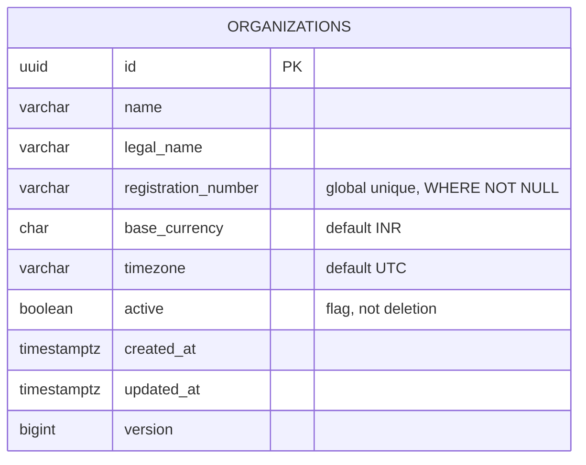

No relationship is drawn because V1 references nothing: `organizations` is the
root of the FK graph, and every edge in §D.6 points *at* this table.

#### D.9.2 V2 — `identity` (identity + authorization, 5 tables)

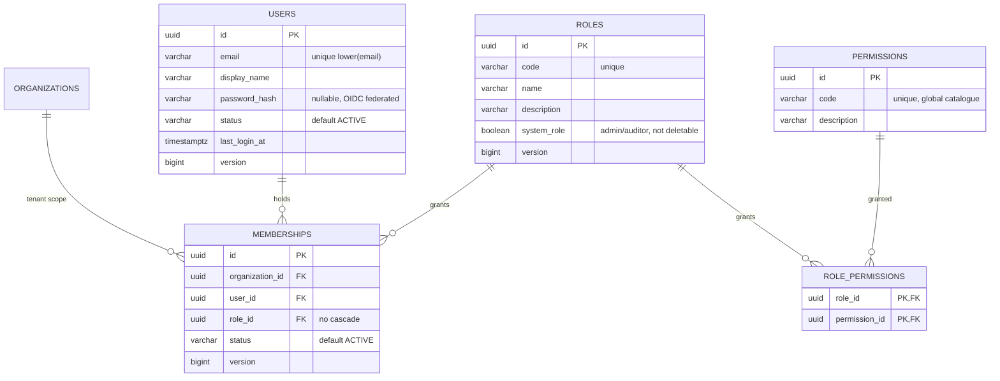

`ORGANIZATIONS` appears as a target only — it is created by V1 and is not part of
V2's table set. `role_permissions` has no `version`: it is a pure edge replaced
wholesale (§D.4).

#### D.9.3 V3 — `ingestion` (immutable admission, 4 tables)

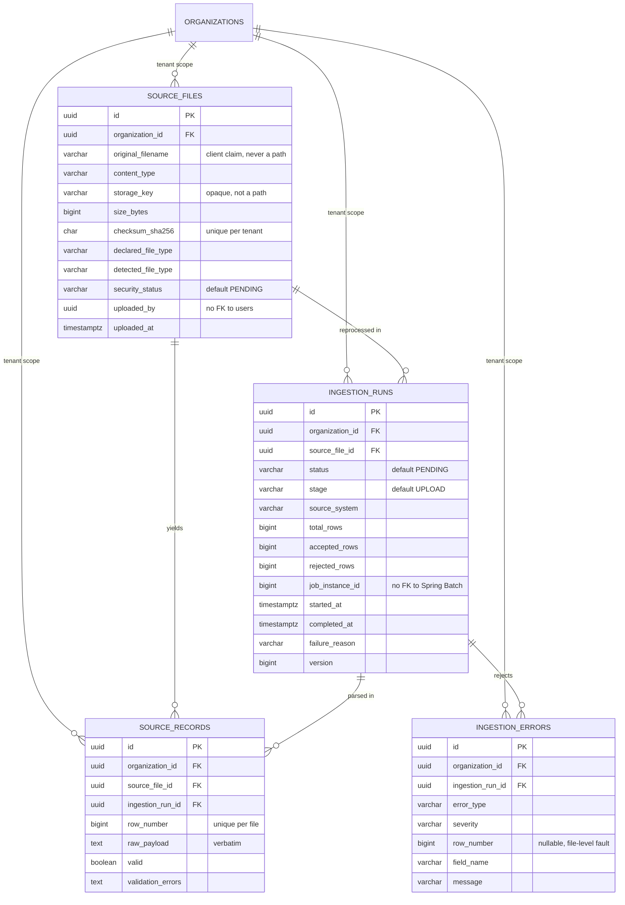

No `version` on `source_files`, `source_records` or `ingestion_errors`: nothing
here is updated in place (§D.4). `job_instance_id` points at a Spring Batch
table this repository never creates (⚠ Review #5).

#### D.9.4 V4 — `financial` (canonical money, 6 tables)

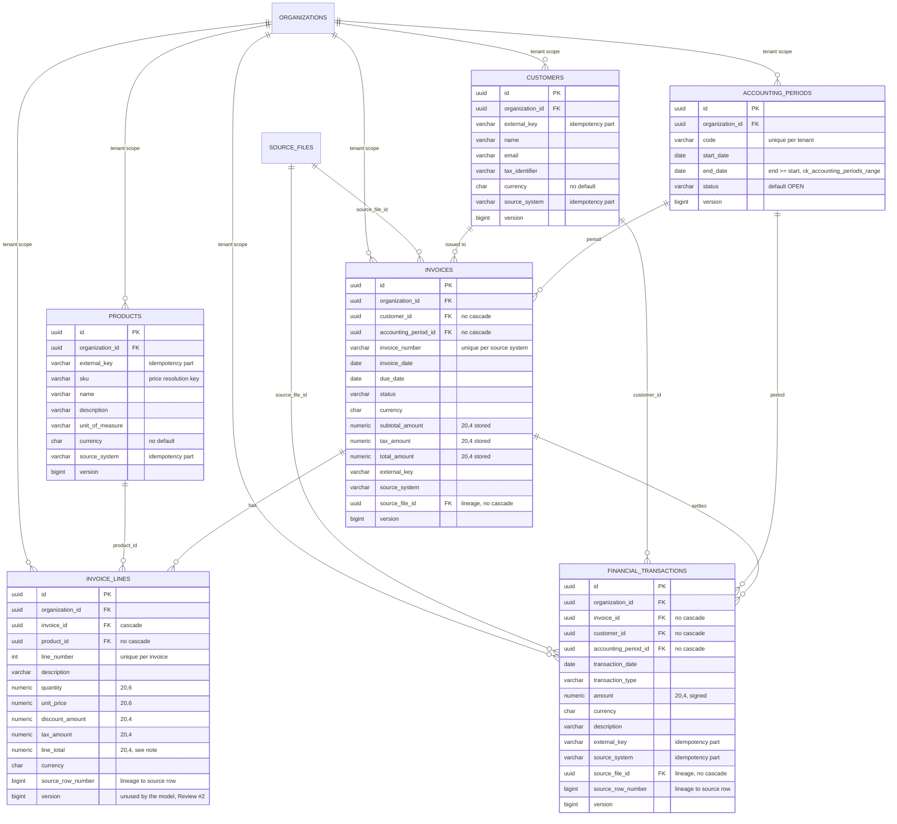

> ⚠ `ck_invoice_lines_total` (V4:172) is **unsatisfiable as written**, and
> `invoice_lines` is where it bites. The constraint is
> `line_total = (quantity * unit_price) - discount_amount + tax_amount`, but
> `quantity` and `unit_price` are `NUMERIC(20,6)` — their product carries up to 12
> decimal places — while `line_total` is `NUMERIC(20,4)`. Whenever the product is
> not exact at four places the CHECK fails by up to half the smallest stored unit,
> so **V4 as committed cannot store such a line at all**. The column pair above is
> drawn faithfully, defect included; `InvoiceLine.java:159-203` documents the fix
> (`ROUND(..., 4)` comparison) and no migration applies it yet. See §D.7 #1 and
> Gotcha #1. There is deliberately **no** non-negativity CHECK on
> `invoice_lines.amount` columns: a credit note legitimately carries negative
> amounts.

#### D.9.5 V5 — `contract` (commercial terms, 5 tables)

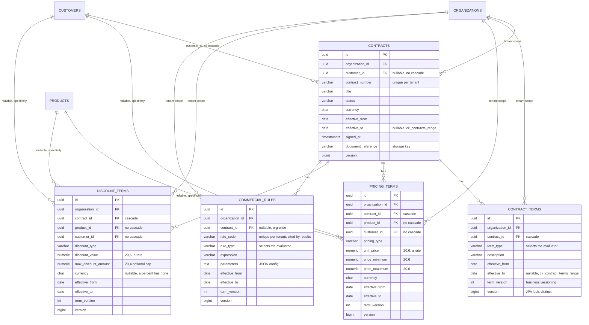

`CUSTOMERS` and `PRODUCTS` are V4 tables, drawn as targets only. `term_version`
(business) and `version` (optimistic lock) are two different columns with two
different meanings; both are deliberately present on every term table.

#### D.9.6 V6 — `financialtruth` (deterministic variance, 2 tables)

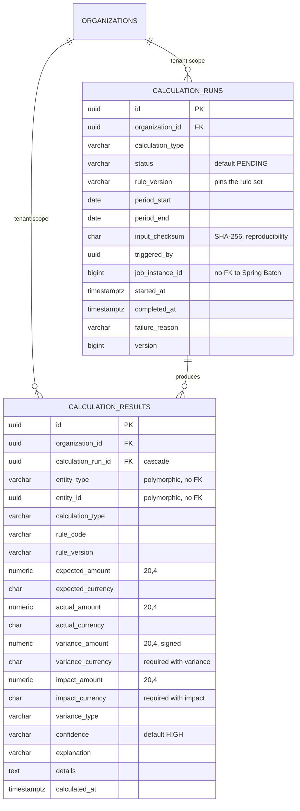

`ck_calc_results_variance_currency` and `ck_calc_results_impact_currency`
(one-directional: amount ⇒ currency, never the reverse) are noted in the column
comments; both are added by `ALTER` so they read as schema-wide policy. There is
no `version` on `calculation_results` — results are never updated after insert.

#### D.9.7 V7 — `evidence` (provenance, 5 tables)

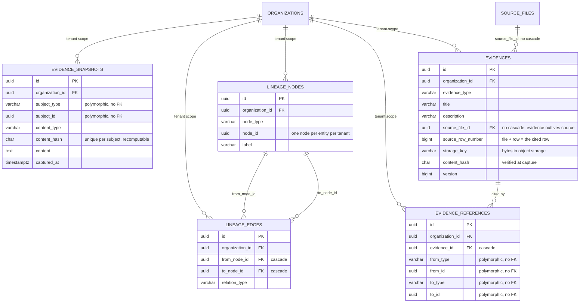

The `source_file_id` + `source_row_number` pair on `evidences` is the schema's
direct lineage join: it turns "the supplier's file" into "row 4,317". No `version`
column on the four append-only/graph tables (§D.4).

#### D.9.8 V8 — `opportunity` + `investigation` (the central object, 7 tables)

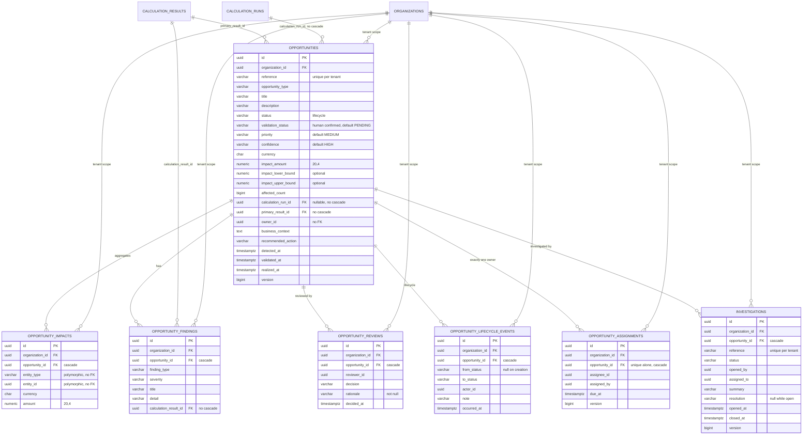

`CALCULATION_RUNS`/`CALCULATION_RESULTS` are V6 tables drawn as targets only —
these are the two cross-module edges out of `financialtruth`.

#### D.9.9 V9 — `value` (action → realization, 5 tables)

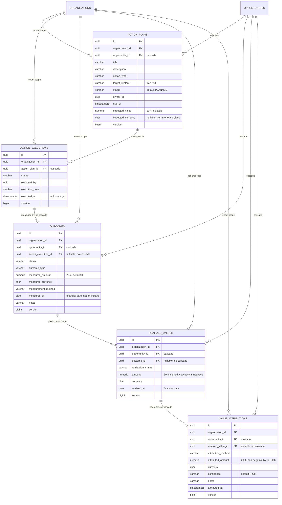

`OPPORTUNITIES` is a V8 table drawn as a target. `ck_value_attributions_non_negative`
is noted on `attributed_amount` — the one money column in the schema where a
negative has no interpretation; `realized_values.amount` is signed and has no such
CHECK, because a clawback is legitimate.

#### D.9.10 V10 — `platform` (audit + idempotency, 2 tables)

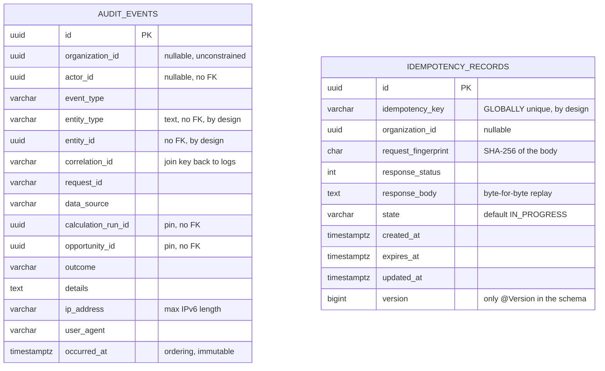

**No relationship line is drawn, and that is the point.** V10 is the only migration
whose tables reference nothing: `audit_events.entity_type`/`entity_id` and
`calculation_run_id`/`opportunity_id` are plain text and bare UUIDs, so an audit
row outlives the record it describes (§D.5). `idempotency_records` is keyed on the
deliberately global `idempotency_key` (§D.3 #2). `idempotency_records` is also the
only table in the schema with a legitimate update path, and the only one carrying
an actual `@Version` lock.

---

### D.10 Tenancy fan-out — the tenant boundary made visible

This is the integrity property §A names as non-negotiable: **every tenant-owned
table carries `organization_id` directly**, and every unique constraint on such a
table includes it (§D.3). Because the tenant key is denormalised onto each row, no
query has to join through a parent to establish tenancy — and a query that forgets
the filter cannot accidentally traverse into another tenant's data.

Below: one root, and every table it reaches. Subgraphs group the tables by the
module that owns the migration; the edge is always the same single column,
`organization_id → organizations (id) ON DELETE CASCADE`.

```mermaid
flowchart TD
    ORG["organizations<br/>V1 — tenant root"]

    subgraph M_ID["identity — V2"]
        MEMBERSHIPS["memberships"]
    end

    subgraph M_ING["ingestion — V3"]
        SOURCE_FILES["source_files"]
        INGESTION_RUNS["ingestion_runs"]
        SOURCE_RECORDS["source_records"]
        INGESTION_ERRORS["ingestion_errors"]
    end

    subgraph M_FIN["financial — V4"]
        CUSTOMERS["customers"]
        PRODUCTS["products"]
        ACCOUNTING_PERIODS["accounting_periods"]
        INVOICES["invoices"]
        INVOICE_LINES["invoice_lines"]
        FINANCIAL_TRANSACTIONS["financial_transactions"]
    end

    subgraph M_CTR["contract — V5"]
        CONTRACTS["contracts"]
        CONTRACT_TERMS["contract_terms"]
        PRICING_TERMS["pricing_terms"]
        DISCOUNT_TERMS["discount_terms"]
        COMMERCIAL_RULES["commercial_rules"]
    end

    subgraph M_TRU["financialtruth — V6"]
        CALCULATION_RUNS["calculation_runs"]
        CALCULATION_RESULTS["calculation_results"]
    end

    subgraph M_EVI["evidence — V7"]
        EVIDENCE_SNAPSHOTS["evidence_snapshots"]
        EVIDENCES["evidences"]
        EVIDENCE_REFERENCES["evidence_references"]
        LINEAGE_NODES["lineage_nodes"]
        LINEAGE_EDGES["lineage_edges"]
    end

    subgraph M_OPP["opportunity + investigation — V8"]
        OPPORTUNITIES["opportunities"]
        OPPORTUNITY_IMPACTS["opportunity_impacts"]
        OPPORTUNITY_FINDINGS["opportunity_findings"]
        OPPORTUNITY_REVIEWS["opportunity_reviews"]
        OPPORTUNITY_LIFECYCLE_EVENTS["opportunity_lifecycle_events"]
        OPPORTUNITY_ASSIGNMENTS["opportunity_assignments"]
        INVESTIGATIONS["investigations"]
    end

    subgraph M_VAL["value — V9"]
        ACTION_PLANS["action_plans"]
        ACTION_EXECUTIONS["action_executions"]
        OUTCOMES["outcomes"]
        REALIZED_VALUES["realized_values"]
        VALUE_ATTRIBUTIONS["value_attributions"]
    end

    subgraph M_PLAT["platform — V10 (nullable, unconstrained)"]
        AUDIT_EVENTS["audit_events"]
        IDEMPOTENCY_RECORDS["idempotency_records"]
    end

    ORG -->|"organization_id"| MEMBERSHIPS
    ORG -->|"organization_id"| SOURCE_FILES
    ORG -->|"organization_id"| INGESTION_RUNS
    ORG -->|"organization_id"| SOURCE_RECORDS
    ORG -->|"organization_id"| INGESTION_ERRORS
    ORG -->|"organization_id"| CUSTOMERS
    ORG -->|"organization_id"| PRODUCTS
    ORG -->|"organization_id"| ACCOUNTING_PERIODS
    ORG -->|"organization_id"| INVOICES
    ORG -->|"organization_id"| INVOICE_LINES
    ORG -->|"organization_id"| FINANCIAL_TRANSACTIONS
    ORG -->|"organization_id"| CONTRACTS
    ORG -->|"organization_id"| CONTRACT_TERMS
    ORG -->|"organization_id"| PRICING_TERMS
    ORG -->|"organization_id"| DISCOUNT_TERMS
    ORG -->|"organization_id"| COMMERCIAL_RULES
    ORG -->|"organization_id"| CALCULATION_RUNS
    ORG -->|"organization_id"| CALCULATION_RESULTS
    ORG -->|"organization_id"| EVIDENCE_SNAPSHOTS
    ORG -->|"organization_id"| EVIDENCES
    ORG -->|"organization_id"| EVIDENCE_REFERENCES
    ORG -->|"organization_id"| LINEAGE_NODES
    ORG -->|"organization_id"| LINEAGE_EDGES
    ORG -->|"organization_id"| OPPORTUNITIES
    ORG -->|"organization_id"| OPPORTUNITY_IMPACTS
    ORG -->|"organization_id"| OPPORTUNITY_FINDINGS
    ORG -->|"organization_id"| OPPORTUNITY_REVIEWS
    ORG -->|"organization_id"| OPPORTUNITY_LIFECYCLE_EVENTS
    ORG -->|"organization_id"| OPPORTUNITY_ASSIGNMENTS
    ORG -->|"organization_id"| INVESTIGATIONS
    ORG -->|"organization_id"| ACTION_PLANS
    ORG -->|"organization_id"| ACTION_EXECUTIONS
    ORG -->|"organization_id"| OUTCOMES
    ORG -->|"organization_id"| REALIZED_VALUES
    ORG -->|"organization_id"| VALUE_ATTRIBUTIONS
    ORG -.->|"organization_id, nullable"| AUDIT_EVENTS
    ORG -.->|"organization_id, nullable"| IDEMPOTENCY_RECORDS
```

Reading the fan-out:

- **35 tables carry `organization_id` as a `NOT NULL` foreign key**, one per
  business table in the schema. The four tables that do not are `users`, `roles`,
  `permissions` and `role_permissions` — the global identity catalogue, global by
  design (§D.3) — and they are reachable only *through* `memberships`, which is
  itself tenant-scoped.
- **Two edges are dashed and nullable**: `audit_events.organization_id` and
  `idempotency_records.organization_id` have no foreign key at all (V10
  deliberately references nothing). An audit row must survive the deletion of the
  organization it describes, and an idempotency record must survive the deletion
  of whatever it wrapped — so neither can be constrained, and both tolerate a
  null tenant for system-level work.
- **Because the only reach is a single column, the cascade is a single decision.**
  Deleting an `organizations` row is the one deletion that reaches every module
  (§D.5); there is no per-row soft delete anywhere in the schema, which is why
  removing one invoice or contract is an application-level choice the database will
  not make for you.

---

---

## E. GOTCHAS — what breaks if you get it wrong

Ranked by consequence: money corruption and tenancy leakage outrank convenience.

| # | Symptom | Cause | Blast radius | Fix |
|---|---|---|---|---|
| 1 | An invoice line cannot be stored, or is stored with a total that disagrees with its own components by up to 0.00005 | `ck_invoice_lines_total` (`V4:172`) compares `NUMERIC(20,4)` `line_total` against the exact product of two `NUMERIC(20,6)` values; the residual is unrepresentable | Money · evidence · determinism | Add a rounded comparison (`ROUND(...,4) = line_total`) replacing the current CHECK, as `InvoiceLine` already forecasts (`InvoiceLine.java:174-176`) |
| 2 | One tenant's data is returned to another | A query omits `organization_id`, or reads it from a request body/claim instead of `SecurityPrincipal` (§6) | Tenancy · money · evidence — undetectable after the fact | Filter every query on the scoped `organization_id`; source scope from `SecurityContext`, never the request |
| 3 | `application update` silently alters a live schema | Switching `ddl-auto` from `validate` to `update` lets Hibernate rewrite columns (it would also "fix" the AuditEventEntity index drift of ⚠ Review #4) | Money · evidence · tenancy — the schema silently diverges from the migrations | Keep `ddl-auto: validate` (`application.yml:50`); the migration set is the only writer |
| 4 | An idempotency key replays a *different* request's response to caller A | Dropping the `request_fingerprint` check; or making the key per-tenant (it is deliberately global, `V10:100`/`IdempotencyRepository.java:39`) | Money · integrity — wrong result reported as success | Keep the global unique key and verify `request_fingerprint` matches (`IdempotencyService.java:137`) |
| 5 | An audit event about a deleted invoice vanishes | Adding an FK from `audit_events` to a business table with `ON DELETE CASCADE` to gain validation | Evidence · compliance — the trail becomes the least durable thing | Leave `audit_events` unconstrained (`V10:16-47`); an audit row must outlive every subject it describes |
| 6 | A money figure is quoted in the wrong tenant's currency | Summing amounts across `CHAR(3)` currencies, or attaching a currency to the wrong amount | Money — every aggregated total is wrong | Never sum across currencies; the schema pairs currency to every amount and the `ck_calc_*_currency` CHECKs (`V6:104-113`) refuse the dangerous direction |
| 7 | A `CHAR(64)` hash column silently accepts a 63-char string that still parses | Storing a fingerprint in a `VARCHAR(64)` (plain `@Column(length=64)`) instead of `CHAR(64)` with the JDBC type code (`IdempotencyRecord.java:94-96`) | Integrity — two distinct payloads hash-collide in the wrong width | Keep `CHAR(64)` + `@JdbcTypeCode(SqlTypes.CHAR) + columnDefinition`; the type reconciliation is what makes `validate` pass |
| 8 | A `DATE` financial fact loses a time-zone boundary, or an instant is ambiguous | Using `TIMESTAMP` for `invoice_date`/`measured_at` (loses zone), or reading `TIMESTAMPTZ` without `hibernate.jdbc.time_zone: UTC` (`application.yml:57`) | Money · evidence · determinism — the same stored value means different instants on different machines | `TIMESTAMPTZ` + `time_zone: UTC` for instants; `DATE` for calendar facts; per-tenant display zone is `organizations.timezone` (`V1:35`), applied in the view, never the store |
| 9 | A migration is edited after it has run, and a later environment silently replays an old checksum | Editing `V4__create_financial_data.sql` in place instead of adding `V4_2`/repair scripts | Integrity — Flyway rejects the checksum mismatch and the deployment hangs | Never touch a committed migration; write `V11`, `V12`, …; `baseline-on-migrate: true` (`application.yml:69`) only adopts a pre-existing *external* history |
| 10 | A `registration_number` unique succeeds once and then silently blocks onboarding | Forgetting the `WHERE registration_number IS NOT NULL` predicate on `ux_organizations_registration_number` (`V1:49`) | Tenancy — NULLs count as distinct, so the "one company" rule only holds once two exist | Keep the partial index predicate; test the NULL case explicitly |

---

## F. TESTS — what locks this down

There is **no schema-level test** in the repo. Flyway's `validate` runs at boot
(`application.yml:50`) but only compares it against the two `@Entity` mappings
(§D.7 #3), so 40 of 42 tables are *not* asserted by the boot check.

| test file | status | invariant it is meant to protect | state |
|---|---|---|---|
| `architecture/ModuleBoundaryTest.java` | STUB | Modules may import only `shared`+`platform`; no cross-business imports | Placeholder (`src/test/.../architecture/ModuleBoundaryTest.java:4`) |
| `financial/FinancialDataServiceTest.java` | STUB | Every query filters on `organization_id`; money is `BigDecimal` at the persistence boundary; optimistic-lock ⇒ conflict | Placeholder (`FinancialDataServiceTest.java:25`), states the money + lock intent but runs nothing |
| `platform/audit/*` | none | `AuditEventEntity`/`IdempotencyRecord` mapping matches `audit_events`/`idempotency_records` | No test files present |
| integration schema tests | none | `ck_invoice_lines_total`, tenant-scoped uniques, FK existence | None exist |

**Not covered (stated plainly):**
- The exact CHECK/UNIQUE invariant on `invoice_lines`, `calculation_results`,
  `value_attributions`, and the date-range CHECKs.
- The tenant-scoped vs global uniqueness distinction (§D.3): nothing proves the
  `registration_number` and `idempotency_key` exceptions are intentional and
  not typos.
- Any FK or deletion-policy assertion: the CASCADE/no-CASCADE split is enforced
  by migration comments alone.
- `ddl-auto: validate` drift for the 40 non-`@Entity` tables (§D.7 #3): a column
  rename in a migration is not caught until an integration run hits it.

Because the persistence layer is stubbed (`module-implementation-rules.md` §11 —
`*/repository/` left untouched), these are design-time claims, not verified
properties. The single real assertion of the schema is Flyway's checksum over the
migration files themselves, which catches editing a committed migration (Gotcha
#9) but nothing about the model matching it.

---

## G. WIRING — where this connects

**The migration set is the owner; all consumers point at it.**

| this schema is consumed by | via | contract |
|---|---|---|
| `financialtruth` engine | reads `invoices`, `invoice_lines`, `calculation_runs/results`, `contracts/terms` | §6 tenancy filter on every query; `NUMERIC(20,4)/(20,6)` precision |
| `evidence` module | reads `source_files`, `evidences`, `lineage_nodes/edges`, `evidence_references` | content-hash dedup; graph traversal by `organization_id` |
| `opportunity` module | reads `calculation_results`, `opportunities`, and writes `opportunity_*` | one current owner per opportunity; append-only findings/reviews |
| `value` module | reads `opportunities`, writes `action_plans/executions`, `outcomes`, `realized_values`, `value_attributions` | `DATE` measurement semantics; non-negative attribution |
| `platform.audit` | writes `audit_events` | append-only; no FK to business tables |
| `platform.idempotency` | writes `idempotency_records` | global key; `@Version` lock |

**What consumes the schema and must not change it:** nothing in the Java model is
allowed to rename or retype a column to match itself — the migration is canonical
(`module-implementation-rules.md` §7). The `@Entity` mapping (`AuditEventEntity`,
`IdempotencyRecord`) must be kept in lock-step with V10 by the owner of the
platform module, not by editing the migration.

**What must happen before the wiring is real:**
1. The persistence pass adds the remaining `@Entity`/repository mappings, at
   which point `ddl-auto: validate` stops guaranteeing only two tables. ⚠ Review
   #3 then becomes a live risk, not a stub artifact — each new `@Entity` must
   already match its migration exactly.
2. The `ck_invoice_lines_total` CHECK must be relaxed to a rounded comparison
   (§D.7 #1) before any `invoice_lines` row whose quantity×price has 5–12 decimal
   places is inserted.
3. `AuditEventEntity`'s index declarations must be reconciled with V10
   (§D.7 #4) before any profile is allowed `update`.
4. A `staging` profile (`application-staging.yml`) must be added, mirroring
   `prod` minus the production-only dials, before a staging deployment is
   configured (§D.7 #6).

---

*Generated for the AI_CFO handbook. Word count: see file properties. See
`_TEMPLATE.md` for the seven-section contract; chapter count is `14-*` in the
`docs/code-flow/` catalog.*
