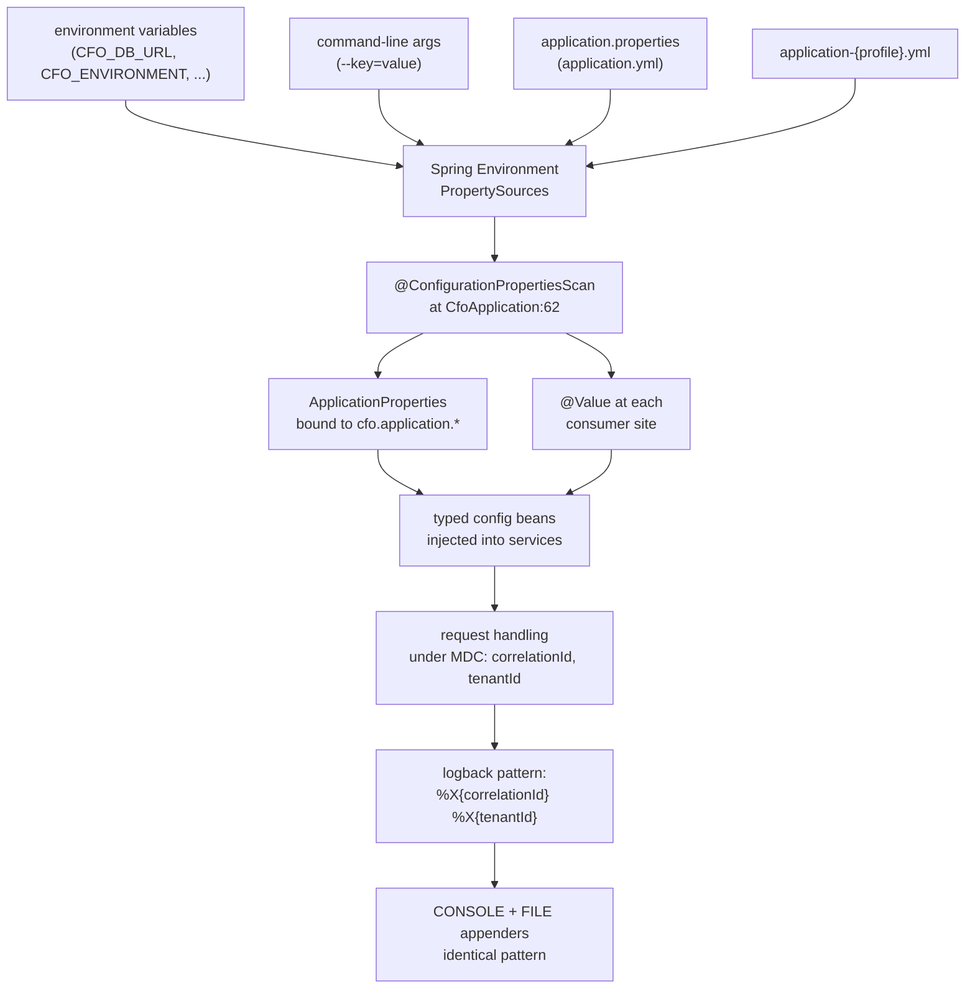

# 15 Runtime Config and Logging

## A. WHY this module exists

The runtime configuration layer is the contract between the build and the deployment: it is the only thing that decides whether the same JAR that ran a developer's test on localhost now runs a financial workload against a managed database, in the right environment, with the right observability, and with no secret surviving on disk.

This matters here because the system is a financial data processor. Two failure modes are intolerable and this module exists to make both impossible:

1. **Cross-environment bleed.** A test, a review, or a calculation must never read or write another tenant's data, and a developer's local database must never be mistaken for production. Configuration must name the environment explicitly and bind it before any business code runs.
2. **Log exfiltration.** Logs are a data path. In a financial system the contents of an SQL statement, a stack trace, or an exception message can be another tenant's invoices, so what is logged and what is shipped must be decided by configuration, not by the module that is currently throwing the exception.

The hard invariants this layer enforces:

- **No secret is ever committed.** Every credential is read from an environment variable with an empty or local-only default. A misconfigured deployment fails at authentication, not at silently connecting to the wrong database.
- **The base file boots on its own.** No profile is required for a local run or a CI smoke test; profile files overlay the base rather than replacing it.
- **Every log line names its request and its tenant.** Correlation IDs and tenant IDs appear in the MDC, so a support ticket quoting one identifier retrieves every line that touched it.
- **A config key that binds to nothing must not exist.** An unmapped key is a silent defect: an operator who edits it sees no effect and no warning. (This invariant is currently violated — see Section D.)

---

## B. FLOW — how configuration reaches a running request

The resolution order, bottom to top — each layer can override the one beneath it, and the last one applied wins:

1. **Base defaults.** `application.yml` is the always-on file. It carries environment variables with inline fallbacks (e.g. `${CFO_DB_URL:jdbc:postgresql://localhost:5432/cfo}` at line 22), so the file is runnable without any external value, and a developer's laptop and a CI smoke test both boot.
2. **application.properties collision.** `application.properties` exists alongside `application.yml`. Spring Boot applies properties files *after* YAML files during `PropertySourceLoader` loading, so a key present in both is won by the `.properties` file. This file intentionally declares only `spring.application.name=cfo` (line 8), which repeats the YAML value at line 16, so the collision is harmless today. ⚠ Review — adding any second key here is a maintenance hazard because the winner is not obvious and the file's own comment must be re-read before each edit.
3. **Active profile file.** When `spring.profiles.active` is set, `application-{profile}.yml` overlays the base. Values absent from the profile file retain their base value.
4. **Environment variables.** Any `CFO_*` or standard `SPRING_*` variable is applied on top of the files. The `CFO_*` prefix is custom and maps to `cfo.*` only for the keys the YAML declares with that prefix; `SPRING_*` maps to the standard Spring Boot namespace.
5. **Command-line arguments.** `--key=value` pairs passed to `java -jar` are the highest-precedence source and override everything above, including environment variables.

There is one structural decision worth recording: profile activation is **not** declared in `application.yml`. No `spring.profiles.active` key appears in any file. Each profile file self-activates with `spring.config.activate.on-profile` (e.g. `application-dev.yml:9-11`), so the file is inert unless that profile is selected externally. The default — no `-Dspring.profiles.active` on the command line, no `CFO_ENVIRONMENT=prod` — runs the base file only, which is intentional: a bare `java -jar` run is always local.

---

## C. FILES

12 files: 6 CONFIG, 5 BUILT, 1 STUB. The table lists the configuration resources first, then the Java types that consume or should consume them.

| file | status | what it is for | key methods / lines |
|---|---|---|---|
| `src/main/resources/application.yml` | CONFIG | base configuration for every profile; env-var fallbacks on every sensitive value | lines 10-224 (datasource:21, jpa:40, flyway:64, cfo namespace:143-218) |
| `src/main/resources/application.properties` | CONFIG | near-empty duplicate that wins on a key collision with application.yml | line 8 (`spring.application.name=cfo`) |
| `src/main/resources/application-dev.yml` | CONFIG | development overlay: SQL logging on, tracing at 100% | activate-on:9, jpa.show-sql:14, logging:24, tracing:35 |
| `src/main/resources/application-prod.yml` | CONFIG | production overlay: SQL logging off, graceful shutdown, tracing at 10%, console pattern drops tenant | activate-on:7, ddl-auto:19, shutdown:25, logging:27, tracing:43 |
| `src/main/resources/application-test.yml` | CONFIG | test overlay: flyway clean enabled, logging muted, environment=test | activate-on:4-7, flyway.clean-disabled:14, logging:22, cfo.environment:35 |
| `src/main/resources/logback-spring.xml` | CONFIG | dual console + file appenders, identical pattern, per-logger levels | LOG_PATTERN:44, CONSOLE:54, FILE:67, loggers:119-122, root:130 |
| `src/main/java/.../CfoApplication.java` | BUILT | entry point; `@ConfigurationPropertiesScan` at line 62 is what binds every `@ConfigurationProperties` record | main:86, `@ConfigurationPropertiesScan`:62 |
| `src/main/java/.../platform/config/ApplicationProperties.java` | BUILT | the only typed binding; a record bound to `cfo.application.*` via `@ConfigurationProperties(prefix="cfo.application")` | record:34, `@ConfigurationProperties`:33, Environment enum:50 |
| `src/main/java/.../platform/config/AsyncConfig.java` | BUILT | virtual-thread async executor; consumes nothing from `cfo.async.*` YAML | `@EnableAsync`:43, `applicationTaskExecutor`:58-61 |
| `src/main/java/.../platform/storage/ObjectStorageService.java` | BUILT | local-file storage bean; reads `cfo.storage.local-root` via `@Value`, **not** `cfo.storage.root` | `LocalStorageConfiguration`:139, `@Value`:145-146 |
| `src/main/java/.../platform/idempotency/IdempotencyService.java` | BUILT | exactly-once claim/replay; **hard-codes** `DEFAULT_TTL` at line 43, ignores `cfo.idempotency.ttl` | `DEFAULT_TTL`:43, `claim` uses it:74 |
| `src/main/java/.../identity/security/SecurityConfig.java` | STUB | TODO placeholder; does not yet consume `cfo.security.*` from YAML | lines 17-24 |

**Reconciliation.** The configuration resource files are 6 (5 YAML/properties + 1 logback). The Java consumers referenced in this chapter are 6 (CfoApplication, ApplicationProperties, AsyncConfig, ObjectStorageService, IdempotencyService, SecurityConfig). 6 + 6 = 12, matching the table above.

### What binds and what does not

Only `cfo.application.*` has a `@ConfigurationProperties` record. Every other `cfo.*` namespace declared in the YAML is consumed by one of two mechanisms — or by none:

| YAML prefix | consumed by | mechanism | effect of editing YAML |
|---|---|---|---|
| `cfo.application.*` | `ApplicationProperties` | `@ConfigurationProperties(prefix="cfo.application")` | real |
| `cfo.security.*` | *(nothing)* | `SecurityConfig` is a STUB | ⚠ Review — silently ignored |
| `cfo.ingestion.*` | `IngestionLimits.defaults()` | hard-coded `defaults()` at `IngestionLimits.java:45` | ⚠ Review — silently ignored |
| `cfo.storage.root` | *(nothing)* | code reads `cfo.storage.local-root` via `@Value` at `ObjectStorageService.java:146` | ⚠ Review — wrong key name; falls through to `${java.io.tmpdir}/cfo-storage` |
| `cfo.async.*` | `AsyncConfig` | `VirtualThreadTaskExecutor` at `AsyncConfig.java:60` — no pool sizing | ⚠ Review — silently ignored; virtual threads contradict the YAML comment |
| `cfo.idempotency.ttl` | `IdempotencyService` | `DEFAULT_TTL = Duration.ofHours(24)` hard-coded at `IdempotencyService.java:43` | ⚠ Review — silently ignored |
| `cfo.ai.*` | *(nothing)* | no AI properties record; no `@Value` reference | ⚠ Review — silently ignored |
| `spring.*` | Spring Boot auto-config | standard prefix | real |
| `server.*` | Spring Boot auto-config | standard prefix | real |
| `management.*` | Spring Boot auto-config | standard prefix | real |
| `springdoc.*` | springdoc-openapi | standard prefix | real |

## D. DEEP DIVE — property by property

### D1. Datasource (`spring.datasource.*`, application.yml:21-37)

| key | value | what it does | what breaks if wrong |
|---|---|---|---|
| `spring.datasource.url` | `${CFO_DB_URL:jdbc:postgresql://localhost:5432/cfo}` | JDBC URL; env-var override lets the same JAR point at any database | Wrong URL → the app boots against the wrong tenant's data or fails to connect; the empty-default pattern means a missing `CFO_DB_URL` stays local |
| `spring.datasource.username` | `${CFO_DB_USERNAME:cfo}` | DB role | Wrong role → permission denial at Flyway migration start, which is a clean boot failure |
| `spring.datasource.password` | `${CFO_DB_PASSWORD:}` | deliberately empty default | ⚠ Review — an empty default means a missing env var produces `password=''` sent to PostgreSQL; the server rejects it. This is by design (visible failure, not silent misroute), but an operator who sets the var to whitespace or an empty string in a profile file would reintroduce the silent-failure mode the comment warns against |
| `spring.datasource.hikari.maximum-pool-size` | `20` | peak concurrent connections | Too high → PostgreSQL `max_connections` exhaustion; too low → the pool becomes the throughput ceiling once virtual threads are enabled, because every request waits here rather than on an OS thread |
| `spring.datasource.hikari.minimum-idle` | `5` | warm connections on standby | Zero → first burst pays full TCP+TLS setup, visible as a cold-start latency spike |
| `spring.datasource.hikari.connection-timeout` | `30000` (30s) | how long a request waits for a pooled connection | Infinite → a saturated pool hangs every request silently; 30s converts saturation into a retryable error |

The password empty-default is the most deliberate trap. The comment at line 24-26 states it explicitly: an unset password fails loudly at authentication rather than risking a silent connection to an unintended database. There is no `cfo.datasource.*` namespace — these keys live under the standard `spring.datasource.*` prefix and are therefore bound by Spring Boot's `DataSourceAutoConfiguration`, not by any custom record.

### D2. JPA / Hibernate (`spring.jpa.*`, application.yml:39-61)

| key | value | what it does | what breaks if wrong |
|---|---|---|---|
| `spring.jpa.open-in-view` | `false` | disables Open Session in View | True → lazy loading in the view layer holds a connection across rendering, creating hidden N+1 loads and masking missing fetches as production-only bugs |
| `spring.jpa.hibernate.ddl-auto` | `validate` | Hibernate checks mappings against the schema; never writes | `update` or `create` in prod → Hibernate silently alters a live financial schema, the exact drift the migration system is meant to prevent |
| `spring.jpa.properties.hibernate.jdbc.time_zone` | `UTC` | sends ` TimeZone=UTC` on every JDBC connection | Omitted → the JVM default zone is sent, which on an Indian-locale Windows host resolves to `Asia/Calcutta` and PostgreSQL rejects — see Section E.6 |
| `spring.jpa.properties.hibernate.default_batch_fetch_size` | `50` | global `@BatchFetchSize` for lazy collections | Zero or 1 → the N+1 pattern in every repository that forgets an explicit fetch plan; 50 is the highest-leverage single setting for lazy-collection performance |

`validate` (line 50) is the guardrail. The comment at line 47-49 is the invariant: Flyway owns writes, Hibernate only checks. The prod overlay at `application-prod.yml:15-19` repeats `ddl-auto: validate` on purpose — a reviewer reading the prod file must see the one value that must never be relaxed.

### D3. Flyway (`spring.flyway.*`, application.yml:63-72)

| key | value | what it does | what breaks if wrong |
|---|---|---|---|
| `spring.flyway.enabled` | `true` | runs migrations at startup | False → entities validated against a schema that does not match, or worse, an empty schema |
| `spring.flyway.baseline-on-migrate` | `true` | permits adopting a pre-existing database | False on an existing DB → `FlywayException: Schema history table not found` and a failed boot |
| `spring.flyway.locations` | `classpath:db/migration` | explicit migration scanning path | A typo here → Flyway finds zero migrations and the context fails at entity validation |

`baseline-on-migrate: true` is paired with `ddl-auto: validate` for a reason stated at line 66-68: an adopted schema is *checked*, not extended behind the application's back. Removing either half of that pair breaks the invariant.

### D4. Servlet multipart (`spring.servlet.multipart.*`, application.yml:74-86)

| key | value | what it does |
|---|---|---|
| `enabled` | `true` | enables `MultipartResolver` |
| `max-file-size` | `25MB` | container-level upload ceiling |
| `max-request-size` | `30MB` | envelope ceiling, deliberately above file limit |

The 5MB gap between file (25MB) and request (30MB) at lines 82-86 is the guard: a request whose body is exactly at the file limit but carries multipart headers and form fields must not be rejected because of its envelope. The business rule is duplicated as `cfo.ingestion.max-file-size-bytes` (26214400) — but see Section D7 for the binding failure.

### D5. Virtual threads and server (`spring.threads.*`, `server.*`, application.yml:88-108)

| key | value | what it does | what breaks if wrong |
|---|---|---|---|
| `spring.threads.virtual.enabled` | `true` | switches the embedded Tomcat and Spring MVC to virtual threads | False (or Java < 21) → platform threads remain the limit, and the Hikari pool at 20 connections becomes irrelevant because request throughput is capped by OS thread count first |
| `server.port` | `${CFO_SERVER_PORT:8080}` | listening port | Collision with another process → bind failure and no boot |
| `server.error.include-message` | `never` | suppresses exception messages in HTTP error bodies | `always` → an exception message can carry column names, file paths, or another tenant's identifier; the comment at line 102-105 explicitly calls this a data-exfiltration path |
| `server.error.include-stacktrace` | `never` | suppresses stack traces in HTTP error bodies | `always` → a stack trace can reveal internal class names and SQL fragment text |
| `server.error.include-binding-errors` | `never` | suppresses rejected payload in error bodies | `always` → a binding error echoes the rejected JSON back to the caller, who is the one who sent it |

The prod overlay (`application-prod.yml:21-25`) adds `server.shutdown: graceful`, which drains in-flight requests before exit. Without it, a rolling deploy severs connections mid-request.

### D6. Actuator and observations (`management.*`, application.yml:110-136)

| key | value | what it does | what breaks if wrong |
|---|---|---|---|
| `management.endpoints.web.exposure.include` | `health,info,metrics,prometheus` | explicit allowlist of exposed endpoints | `*` → `env`, `beans`, `configprops`, and `loggers` endpoints become accessible to anyone who reaches the port, disclosing configuration and topology |
| `management.endpoint.health.probes.enabled` | `true` | enables `/actuator/health/liveness` and `/readiness` | False → Kubernetes cannot distinguish a pod that is still starting from one that is failing, causing premature restarts or traffic to an unready instance |
| `management.endpoint.health.show-details` | `never` | component names are never disclosed in health responses | `always` → a `DOWN` response names which dependencies exist, handing an attacker a dependency map |
| `management.observations.key-values.application` | `${cfo.application.name:AI_CFO}` | low-cardinality trace/metric tag | Not set → traces cannot be filtered by deployment identity in the collector |
| `management.observations.key-values.environment` | `${cfo.application.environment:local}` | low-cardinality environment tag | Not set → a prod span and a local span are indistinguishable in aggregated traces |

### D7. The `cfo.*` namespace — what binds and what does not (application.yml:143-218)

This is the chapter's critical finding. Only `cfo.application.*` has a binding. The other prefixes are declared in the YAML but consumed by no `@ConfigurationProperties` record and, in several cases, by no Java code at all.

**D7a. `cfo.application.*`** — `ApplicationProperties.java:33`, bound by `@ConfigurationProperties(prefix="cfo.application")`.

| key | value | what it does | what breaks if wrong |
|---|---|---|---|
| `name` | `AI_CFO` | product name surfaced in OpenAPI and log banners | Not set → defaults to `AI_CFO` via `@DefaultValue("AI_CFO")` at `ApplicationProperties.java:35`; a wrong product name is cosmetic, not a defect |
| `version` | `0.0.1` | build version in health output | Same safe default; version drift is a support-hygiene issue, not a runtime one |
| `environment` | `${CFO_ENVIRONMENT:local}` | the closed `Environment` enum | Unknown value → `Environment.from()` throws `IllegalArgumentException` (line 92); an unlabelled deployment defaults to `LOCAL` |
| `correlation-id-response-header` | `true` | echoes `X-Correlation-ID` on responses | False → callers cannot quote an id to retrieve matching log lines in a support report |

**D7b. `cfo.security.*`** — ⚠ Review. `issuer-uri` (line 161), `audience` (line 162), `clock-skew` (line 165). No `@ConfigurationProperties` binds these. Grep for `cfo.security.` across `src/main/java` returns no matches. `SecurityConfig.java:17-24` is a STUB marked `TODO: Implement SecurityConfig`. The env var `CFO_OIDC_ISSUER_URI` is not a Spring Boot standard property (the standard key is `spring.security.oauth2.resourceserver.jwt.issuer-uri`; the matching env var would be `SPRING_SECURITY_OAUTH2_RESOURCESERVER_JWT_ISSUER_URI`). An operator who sets `CFO_OIDC_ISSUER_URI` expects the resource server to use it, but nothing reads it. The YAML comment at line 158-160 claims "with no issuer configured the resource server has nothing to validate against and startup fails" — this is aspirational. In reality, `SecurityConfig` does nothing, so there is no resource server at all.

**D7c. `cfo.ingestion.*`** — ⚠ Review. `max-file-size-bytes: 26214400` (line 172), `max-rows-per-file: 200000` (line 175), `allowed-content-types` (lines 178-181). No `@ConfigurationProperties` binds these. `IngestionLimits.java:45` declares `defaults()` with hardcoded values (20MB file, 100 000 rows, 512 columns, 32 sheets, 200MB uncompressed, 2000 entries, 200× ratio, 4096 ratio-check min, 4096 cell, 10 header scan). The YAML declares `max-file-size-bytes: 26214400` (the same 25MB) and `max-rows-per-file: 200000` (double the hardcoded 100 000), but these are never wired into `IngestionLimits`. An operator who lowers the upload ceiling in the YAML to defend against a memory-exhaustion attack would see no effect.

**D7d. `cfo.storage.root` vs `cfo.storage.local-root`** — ⚠ Review. The YAML at line 188 declares `cfo.storage.root: ${CFO_STORAGE_ROOT:./var/storage}`. The code at `ObjectStorageService.java:145-146` reads `cfo.storage.local-root` via `@Value`. These are different keys. The env var `CFO_STORAGE_ROOT` is therefore never read; the bean falls through to `${java.io.tmpdir}/cfo-storage`. An operator who points `CFO_STORAGE_ROOT` at a persistent volume sees storage land in a temporary directory. The `cfo.storage.root` key in the YAML is silently dead.

**D7e. `cfo.async.*`** — ⚠ Review. `core-pool-size: 8` (line 195), `max-pool-size: 32` (line 196), `queue-capacity: 500` (line 197). No `@ConfigurationProperties` binds these. `AsyncConfig.java:58-61` creates a `VirtualThreadTaskExecutor("cfo-async-")` with no pool sizing — virtual threads are unbounded and have no queue capacity. The YAML comment at line 192-194 claims "Deliberately a bounded platform-thread pool" but the code is the exact opposite. The three keys exist for a bounded pool that was never written. An operator who lowers `queue-capacity` to control memory pressure sees no effect.

**D7f. `cfo.idempotency.ttl`** — ⚠ Review. The YAML at line 205 declares `cfo.idempotency.ttl: PT24H`. `IdempotencyService.java:43` hard-codes `DEFAULT_TTL = Duration.ofHours(24)` and uses it at `IdempotencyService.java:74` (`now.plus(DEFAULT_TTL)`). There is no `@Value` or `@ConfigurationProperties` for this key. The YAML value is silently dead. An operator who shortens the TTL to reclaim table space, or lengthens it to cover longer client retry cycles, would see exactly 24h regardless.

**D7g. `cfo.ai.*`** — ⚠ Review. `enabled: false` (line 212), `model: ${CFO_AI_MODEL:}` (line 213), `base-url: ${CFO_AI_BASE_URL:}` (line 214), `max-retries: 2` (line 217), `timeout: 60s` (line 218). No `@ConfigurationProperties` binds any of these. Grep for `cfo.ai.` across `src/main/java` returns no matches. Grep for `ai.enabled`, `AiProperties`, or any AI properties record returns no matches. The env vars `CFO_AI_MODEL` and `CFO_AI_BASE_URL` are consumed by nothing visible. The `ai` module exists (package `com.fintech.cfo.ai.*`, ~40 types) but its configuration namespace is entirely unbound — an operator who sets `CFO_AI_BASE_URL` to point at a model endpoint and `cfo.ai.enabled: true` would find the AI module still reports itself as off.

### D8. Profile overlays — what changes, and what is missing

**application-dev.yml** (40 lines):
- `spring.jpa.show-sql: true` + `format_sql: true` (lines 14, 22) — every SQL statement logged; the comment at line 14-16 states this is for finding missing join fetches in development.
- `logging.level.com.fintech.cfo: DEBUG` (line 29) — application code visible without a debugger.
- `logging.level.org.springframework.security: INFO` (line 32) — not DEBUG, to avoid filter-chain and token dump in dev logs.
- `management.tracing.sampling.probability: 1.0` (line 37) — every request traced; the comment at line 37-39 notes 1.0 is unaffordable in shared environments.
- Everything else (datasource, Flyway, actuator exposure, storage root, AI limits) is inherited from base.

**application-prod.yml** (53 lines):
- `spring.jpa.show-sql: false` (line 14) — inverse of dev; SQL text contains tenant financial data.
- `spring.jpa.hibernate.ddl-auto: validate` (line 19) — restated on purpose so the one setting that must never be relaxed is visible in the file reviewed at deploy time.
- `server.shutdown: graceful` (line 25) — drains in-flight requests during rolling deploys.
- `logging.level.root: WARN` (line 31) — third-party noise suppressed; log volume is a cost and a risk.
- `logging.level.com.fintech.cfo: INFO` (line 34) — enough to follow a request, not enough to log payloads.
- `logging.pattern.console` (line 40) — overrides the logback pattern for console only; drops `[%X{tenantId:-no-tenant}]` because prod logs are shipped to a central collector with broader access. The FILE appender in logback keeps the full pattern.
- `management.tracing.sampling.probability: 0.1` (line 48) — 10% sampling; the comment at line 45-47 notes financial-request traces are reconstructed via `audit_events` instead.
- `management.endpoint.health.show-details: never` (line 53) — restated on purpose.

**application-test.yml** (39 lines):
- `spring.jpa.hibernate.ddl-auto: validate` (line 14) — test schema built by the same Flyway migrations as prod; `create`/`update` would prove nothing about the schema that actually runs.
- `spring.flyway.clean-disabled: false` (line 20) — re-enables `clean` for test resets; the comment at line 17-19 warns this is safe only because it is confined to the test profile.
- `logging.level.root: WARN` (line 26) — third-party noise off for readable test output.
- `logging.level.org.flywaydb: INFO` (line 33) — migration failures are the most common context-start failure and must be visible without raising global verbosity.
- `cfo.application.environment: test` (line 39) — overrides the base default of `local` so a test run is never mistaken for a developer's machine.

**The missing profile.** `ApplicationProperties.Environment` at `ApplicationProperties.java:62` declares `STAGING` as a valid value, and the comment at line 61 describes it as "Pre-production environment mirroring production configuration." There is no `application-staging.yml` file. A deployment that sets `CFO_ENVIRONMENT=staging` (or `spring.profiles.active=staging`) runs on the bare base file — the one designed for a local developer's localhost. This is a silent fallback with no warning.

### D9. logback-spring.xml — appenders, loggers, and the level floor (135 lines)

**LOG_LEVEL property** (line 21): defaults to `INFO`, overridable by the `LOG_LEVEL` environment variable. The comment at line 16-20 states the rationale: DEBUG in a financial system is where parameter-level logging tends to appear, so the default is conservative and the override is a conscious operator action per instance.

**LOG_PATTERN** (lines 44-45): the shared pattern `%d{yyyy-MM-dd'T'HH:mm:ss.SSSXXX} %-5level [%X{correlationId:-no-correlation-id}] [%X{tenantId:-no-tenant}] %logger{40} - %msg%n`.

| field | purpose |
|---|---|
| `%d{...XXX}` | ISO-8601 with explicit offset; unambiguous across regions and comparable to UTC-stored database rows |
| `%-5level` | left-padded so levels align in a column and can be grepped by eye |
| `[%X{correlationId:-no-correlation-id}]` | correlation ID from the MDC, populated by `CorrelationIdFilter`; the `:-` default makes an untraced line visibly untraced instead of merely short |
| `[%X{tenantId:-no-tenant}]` | tenant boundary; two different values on lines that should share a request reveals a cross-tenant bug |
| `%logger{40}` | abbreviated and capped so the message column starts in the same place; 40 chars covers the full package path |
| `%msg%n` | `%msg` not `%m`, so the exception stack trace follows the message rather than being swallowed |

**CONSOLE appender** (lines 54-58): writes to stdout; Spring Boot's own default is overridden so the pattern is identical to the file. The comment at line 50-52 explains the design: a second threshold filter would create a rule a reader has to check (which lines are in console but not file), so both appenders are attached to the root and no per-appender threshold exists.

**FILE appender** (lines 67-96): `RollingFileAppender` with `SizeAndTimeBasedRollingPolicy` at lines 82-87.

| policy | value | why |
|---|---|---|
| `fileNamePattern` | `${CFO_LOG_DIR:-./logs}/archive/cfo.%d{yyyy-MM-dd}.%i.log.gz` | size-and-time rollover; `%i` index allows a size-triggered rollover within a single day |
| `maxFileSize` | `50MB` | keeps one archive readable without an external tool |
| `maxHistory` | `30` | matches the shortest retention this system's audit questions ask for |
| `totalSizeCap` | `2GB` | the guard that matters operationally: prevents unbounded disk growth on a shared filesystem |

The file path comes from `CFO_LOG_DIR` with a relative default, so the application never assumes an absolute log location and can run on read-only media where only `./logs` is writable. The same `LOG_PATTERN` is used on both appenders so a line quoted in a support ticket is byte-identical to the archive.

**Per-logger levels** (lines 119-122):

| logger | level | why |
|---|---|---|
| `org.springframework.web` | `INFO` | DEBUG includes header values; INFO keeps the access trail without them |
| `org.springframework.security` | `INFO` | DEBUG dumps the filter chain and, in some configs, token contents |
| `org.hibernate.SQL` | `WARN` | verbatim SQL including bound parameters = customer financial data; pinned at WARN so no env var can raise it |
| `com.fintech.cfo` | `${LOG_LEVEL}` | the only logger whose level is tunable, because application developers are the ones who know which class to point it at |

The `org.hibernate.SQL` at `WARN` is the critical floor. Even though the base level is `WARN` and dev turns SQL logging on in the YAML (where the log is not retained), the logback floor prevents any environment variable from accidentally enabling it in a retained log.

**Root logger** (lines 130-133): `WARN`, with both `CONSOLE` and `FILE` appenders. The comment at line 124-129 explains the invariant: a level rule that applied to only one sink would produce evidence that exists on a disk an operator cannot find.

**The prod console pattern override.** `application-prod.yml:40` drops the tenant ID from the console-only pattern (not the logback file pattern). The comment at line 35-39 of the prod file states this: prod logs are shipped to a central collector with wider access than a single tenant's data warrants. This is a per-environment decision made in the profile file, not in logback.

### D10. ApplicationProperties — binding mechanics

`ApplicationProperties.java:33` declares `@ConfigurationProperties(prefix = "cfo.application")`. The record at line 34 has four components, each with `@DefaultValue`:

| component | default | source key |
|---|---|---|
| `name` | `AI_CFO` | `cfo.application.name` |
| `version` | `0.0.1` | `cfo.application.version` |
| `environment` | `LOCAL` | `cfo.application.environment` |
| `correlationIdResponseHeader` | `true` | `cfo.application.correlation-id-response-header` |

Binding happens because `CfoApplication.java:62` carries `@ConfigurationPropertiesScan`, which registers every `@ConfigurationProperties` class in the `com.fintech.cfo` package tree. Spring Boot's binder resolves each record component by matching the suffix of the prefix to the component name (`cfo.application.name` → `name`), applies `@DefaultValue` when the key is absent, and constructs the immutable record once at startup.

A record was chosen over a mutable class with setters because configuration is read once and never re-applied (line 17-21 of the Javadoc): immutability removes the possibility of a service observing a half-applied reconfiguration. The `Environment` enum at line 50 uses `from(String)` (line 86-93) which converts case-insensitively using `Locale.ROOT` (line 91-92) so a non-English default locale cannot corrupt the case conversion of the configured name.

**What breaks if the scan is missing.** Remove `@ConfigurationPropertiesScan` from `CfoApplication.java:62` and Spring Boot raises no error, emits no warning, and `ApplicationProperties` is never instantiated — every `@Autowired ApplicationProperties` site fails with a `NoSuchBeanDefinitionException`. There is no fallback to `@Value`, so the failure is total but happens only at injection time. The Javadoc at line 12-13 describes the intent: "services never read YAML directly and `@Value` is not scattered through business modules." The scan is the single mechanism that enforces that, and it is a single point of failure that produces no signal at definition time.

`springdoc.api-docs.path` (line 222) and `springdoc.swagger-ui.path` (line 224) are bound by the springdoc-openapi library's own `@ConfigurationProperties` records, outside this codebase's scan. They are real and functional, but they are the only keys in the YAML not owned by this codebase or Spring Boot core.

## E. GOTCHAS — what breaks if you get it wrong

Ranked by consequence.

### E1. A YAML key that binds to nothing

| YAML key | intended effect | actual effect | consequence |
|---|---|---|---|
| `cfo.security.issuer-uri` (line 161) | configure the OIDC resource-server | `SecurityConfig` is a STUB (`SecurityConfig.java:17-24`) | security is never configured; the comment at line 158-160 is aspirational, not enforced |
| `cfo.security.audience` (line 162) | token audience check | unmapped | audience is never validated |
| `cfo.security.clock-skew` (line 165) | token clock-skew tolerance | unmapped | uses the framework default, not 60s |
| `cfo.ingestion.max-file-size-bytes` (line 172) | cap upload size at the business-rule level | `IngestionLimits.defaults()` at `IngestionLimits.java:45` hard-codes 20MB (20971520) | the YAML says 25MB (26214400) but the code uses 20MB — lowering the ceiling in the YAML has no effect on what the validator enforces |
| `cfo.ingestion.max-rows-per-file` (line 175) | cap rows per file at 200 000 | hardcoded 100 000 | the YAML doubles the limit to 200 000 but the code retains the 100 000 hardcode; an operator who lowers this to stop a memory blow-up sees the full 100 000 rows still processed |
| `cfo.ingestion.allowed-content-types` (lines 178-181) | restrict MIME types | `IngestionLimits` has no content-type field at all | the allowlist is never applied; the parser accepts whatever it happens to implement |
| `cfo.storage.root` (line 188) | set the storage volume path | code reads `cfo.storage.local-root` (`ObjectStorageService.java:146`) | `CFO_STORAGE_ROOT` env var is never read; storage lands in `${java.io.tmpdir}/cfo-storage` |
| `cfo.async.core-pool-size` (line 195) | cap async pool at 8 | `VirtualThreadTaskExecutor` at `AsyncConfig.java:60` has no pool size | the "bounded platform-thread pool" comment (line 192-194) describes code that does not exist |
| `cfo.async.max-pool-size` (line 196) | cap async pool at 32 | unmapped | unbounded virtual threads; no backpressure |
| `cfo.async.queue-capacity` (line 197) | cap async queue at 500 | unmapped | no queue; no saturation signal |
| `cfo.idempotency.ttl` (line 205) | set claim retention to PT24H | `IdempotencyService.java:43` hard-codes `Duration.ofHours(24)` | always 24h regardless of the value; shortening or lengthening has no effect |
| `cfo.ai.enabled` (line 212) | toggle the AI module | no AI properties record exists | the module cannot be enabled from configuration; `CFO_AI_MODEL` and `CFO_AI_BASE_URL` env vars are consumed by nothing |
| `cfo.ai.model` (line 213) | select the LLM model | unmapped | no model selection possible |
| `cfo.ai.base-url` (line 214) | set the model endpoint | unmapped | no endpoint selection possible |
| `cfo.ai.max-retries` (line 217) | cap retries at 2 | unmapped | uses whatever the client default is |
| `cfo.ai.timeout` (line 218) | set 60s timeout | unmapped | uses whatever the client default is |

**Symptom:** editing any of these values, restarting, and seeing the system behave exactly as before. **Cause:** no `@ConfigurationProperties` record declares the prefix, and no `@Value` expression references the key. Spring Boot does not warn about unmapped configuration keys by default. **Fix:** either add a `@ConfigurationProperties` record for the prefix (preferred — immutable, testable, typed) or wire the value through a `@Value` at the consumer site and remove the dead YAML block.

### E2. A profile silently falling back to base

There is no `application-staging.yml`. `ApplicationProperties.Environment` at `ApplicationProperties.java:62` declares `STAGING` as valid, and the Javadoc at line 61 describes it as "mirroring production configuration." A deployment that sets `CFO_ENVIRONMENT=staging` (or `-Dspring.profiles.active=staging`) activates no profile file, so every value falls through to the base `application.yml`. The base file has `spring.jpa.hibernate.ddl-auto: validate` and `spring.threads.virtual.enabled: true`, which are correct, but it also has `server.error.include-message: never` and dev-class logging levels that are appropriate for a laptop, not a pre-production environment mirroring production. **Fix:** create `application-staging.yml` as a near-exact clone of `application-prod.yml` with the `on-profile: staging` header.

### E3. Logging a monetary value or token

The `LOG_LEVEL` environment variable (logback-spring.xml:21) can raise any logger to DEBUG. If an operator sets `LOG_LEVEL=DEBUG` and any code under `com.fintech.cfo.*` writes `log.debug("payload: {}", request.getBody())` or similar, customer payloads — which include invoice amounts, tax figures, and potentially JWT tokens echoed in headers — appear in retained logs. The `org.hibernate.SQL` logger is pinned at WARN (logback-spring.xml:121) precisely to prevent SQL parameter values from appearing even when `spring.jpa.show-sql` is turned on in dev, but that floor only holds for Hibernate's own logger. Any application code that logs at DEBUG under `LOG_LEVEL=DEBUG` has no equivalent guard. **Fix:** never log request bodies, parameters, or principals at DEBUG in `com.fintech.cfo.*`; use structured logging with explicit redaction for any field that may carry PII or financial data.

### E4. An actuator endpoint left open

`management.endpoints.web.exposure.include` (application.yml:119) is an explicit allowlist (`health,info,metrics,prometheus`), not `*`. The comment at line 115-118 names the suppressed endpoints (`env`, `beans`, `configprops`, `loggers`) and the reason: they disclose configuration and topology. If an operator changes this to `*` to troubleshoot a startup problem and forgets to revert, the `/actuator/env` endpoint returns all resolved property values — including `CFO_DB_PASSWORD` if it was set as an env var, because Spring Boot's `Environment` source list is visible through that endpoint. **Fix:** `show-details: never` on health (application.yml:130) is a defense-in-depth; the exposure allowlist is the primary control.

### E5. ddl-auto set to update in production

`spring.jpa.hibernate.ddl-auto` is `validate` in the base (application.yml:50) and restated as `validate` in the prod overlay (application-prod.yml:19). If either is changed to `update` — a common "just let Hibernate fix the mismatch" reflex — Hibernate will ALTER a live financial schema at startup, outside the migration history, with no rollback and no review. The `id` columns in `V1` through `V10` migrations are the source of truth; a Hibernate-generated `ALTER TABLE` on a partitioned table or a `NUMERIC(20,4)` column can silently corrupt the financial data shape that downstream reports depend on. **Fix:** keep `validate` everywhere; any schema change goes through a Flyway migration, never through Hibernate.

### E6. The timezone trap

The JVM default timezone is sent to PostgreSQL as the `TimeZone` connection parameter by the pgjdbc driver. On a Windows host whose locale is Indian, the JDK 25 tz data canonicalises "India Standard Time" to the legacy alias `Asia/Calcutta`, which modern PostgreSQL (17 and 18) no longer ships — the connection fails at startup with `FATAL: invalid value for parameter "TimeZone": "Asia/Calcutta"`, and every test that boots the context fails at the Flyway migration step.

The fix lives in `pom.xml:365`: `<argLine>-Duser.timezone=UTC</argLine>` on the maven-surefire-plugin. This is kept as a JVM `argLine` and not as a `systemPropertyVariables` entry because the former is resolved at JVM startup, before any code can trigger zone resolution, whereas the latter is set by the surefire booter and only takes effect if no earlier component has already resolved the default zone. The production application is not affected — the argLine is on the test fork only; production relies on `hibernate.jdbc.time_zone: UTC` (application.yml:57) to send `TimeZone=UTC` explicitly on the JDBC connection. But the surefire argLine is the one line whose removal takes down the entire test suite on an Indian-locale machine. A developer who runs `mvn test` without it sees a `ContextRefresh` failure whose root cause (`FATAL: invalid value for parameter "TimeZone"`) is buried under 50 lines of Flyway and Hikari stack frames.

## F. TESTS — what locks this down

| test class | location | invariant it protects |
|---|---|---|
| `CfoApplicationTests` | `src/test/java/com/fintech/cfo/CfoApplicationTests.java:34` | the context starts at all with all config files on the classpath; it is the canary for a property-binding typo, a missing Flyway migration, or a circular dependency |

`contextLoads()` at line 34 is intentionally empty — the assertion is that `@SpringBootTest` gets as far as running the method. It requires Docker (a PostgreSQL Testcontainer is started via `@Import(TestcontainersConfiguration.class)` at line 29) and it loads all five `application*.yml` files plus `logback-spring.xml`, so it is the single test that would catch a YAML syntax error or a profile-activation conflict.

**What is not covered — the gap that makes the defects in E1 possible:**

- There is **no test that asserts `cfo.security.*` binds** to anything. If someone adds a `SecurityProperties` record tomorrow, no test fails when they forget it today.
- There is **no test that asserts `cfo.storage.root` is read** by `ObjectStorageService`. The key mismatch at `ObjectStorageService.java:145-146` would be invisible to any test that does not explicitly set `CFO_STORAGE_ROOT` and verify the resulting `Path`.
- There is **no test that asserts `IdempotencyService.DEFAULT_TTL`** reflects the YAML value. The hard-code at line 43 can drift from `cfo.idempotency.ttl` (line 205) in either direction and no test would fire.
- There is **no test that asserts `cfo.ai.*` binds** to any consumer. The entire namespace could be deleted from the YAML and no test would fail.
- There is **no test that verifies the `application.properties` vs `application.yml` collision**. The comment at `application.properties:2-6` is the only thing preventing someone from adding a conflicting key.
- There is **no test that verifies the logback pattern includes `correlationId` and `tenantId`**. The pattern is verified only by eye against `logback-spring.xml:44-45` and `application-prod.yml:40`.
- There is **no test that verifies `springdoc.api-docs.path` and `springdoc.swagger-ui.path`** are reachable. They are bound by the library, not by this codebase.

The only property-binding test is the context-load smoke test, which proves that the keys Spring Boot *does* bind are mutually consistent. It proves nothing about the keys that bind to nothing.

## G. WIRING — where this connects

**Consumes.** This layer is consumed by every business module, in two directions:

1. **`spring.datasource.*`, `spring.jpa.*`, `spring.flyway.*`, `spring.servlet.*`, `spring.threads.*`** → consumed by Spring Boot auto-configuration (`DataSourceAutoConfiguration`, `HibernateJpaAutoConfiguration`, `FlywayAutoConfiguration`, `MultipartAutoConfiguration`, `TomcatWebServerFactoryCustomizer`). No business code imports these directly; the entities and repositories in `com.fintech.cfo.financial.*`, `com.fintech.cfo.contract.*`, etc. receive the resulting `DataSource`, `EntityManager`, `ObjectMapper`, and `DataSourceTransactionManager` beans.

2. **`cfo.application.*` → consumed by `ApplicationProperties`** (`CfoApplication.java:62` scans it; `ApplicationProperties.java:33` binds it). The record is `@Autowired` in `platform/web/RequestLogging.java` (for `correlationIdResponseHeader`) and `platform/observability/BusinessMetrics.java:135-136` (for `application` and `environment` observation tags). Every other service that needs configuration reads from this one record rather than from YAML directly (Javadoc at `ApplicationProperties.java:12-13`).

**Should consume but cannot.** The `cfo.*` keys without bindings are meant to be consumed by types that do not yet exist or are not yet wired:

| YAML prefix | intended consumer | current state |
|---|---|---|
| `cfo.security.*` | `SecurityConfig` (`SecurityConfig.java:17-24`) | STUB — `TODO: Implement SecurityConfig` |
| `cfo.ingestion.*` | a future `IngestionProperties` record | does not exist; `IngestionLimits.defaults()` is the only source of defaults |
| `cfo.storage.root` | `ObjectStorageService.LocalStorageConfiguration` | reads the wrong key (`cfo.storage.local-root`); needs a `@ConfigurationProperties` record or a `@Value` on the correct key |
| `cfo.async.*` | `AsyncConfig` | uses `VirtualThreadTaskExecutor`; the YAML describes a pool that the code does not create |
| `cfo.idempotency.ttl` | `IdempotencyService` | hard-codes `DEFAULT_TTL`; needs the record or the `@Value` wired into `claim()` at line 74 |
| `cfo.ai.*` | a future `AiProperties` record or `AiModuleConfiguration` | does not exist; the `ai` module's ~40 types are unconfigured and `enabled` is checked nowhere |

**The storage adapter escape hatch.** `ObjectStorageService.java:139-148` declares `LocalStorageConfiguration` with `@ConditionalOnMissingBean(ObjectStoragePort.class)`. An S3-compatible adapter can replace the local filesystem implementation simply by declaring its own `ObjectStoragePort` bean — but it must declare that bean, not set `cfo.storage.local-root` or `cfo.storage.root`. The `@Value` at line 145-146 is only the fallback for the local-only case, and it references the wrong key.

**The async boundary.** `AsyncConfig.java:43` carries `@EnableAsync`, which is enabled in exactly one place (Javadoc at line 36-40 explains why: declaring it in more than one configuration class is legal and produces duplicate infrastructure beans). The `@Async` annotation on business methods across `com.fintech.cfo.*` resolves to the `applicationTaskExecutor` bean at `AsyncConfig.java:58-61` by name. Any method annotated `@Async` that blocks on a database connection or an object-storage read is implicitly bounded by the Hikari pool (20 connections) and the downstream service, not by the virtual-thread executor, because virtual threads park for free.

**What must happen before the wiring is real.** For the `cfo.*` namespace to stop leaking:

1. A `SecurityProperties` record (`@ConfigurationProperties(prefix="cfo.security")`) must exist and `SecurityConfig` must be implemented to consume it. Until then, `issuer-uri` is dead.
2. An `IngestionProperties` record must replace `IngestionLimits.defaults()` as the source of the `maxFileBytes`, `maxRowsPerFile`, and `allowedContentTypes` defaults, and `UploadFileValidator` must inject it instead of calling `defaults()`.
3. `ObjectStorageService` must read `cfo.storage.local-root` from a typed record (or the YAML key must be renamed to `local-root`), so that `CFO_STORAGE_ROOT` — or a renamed `CFO_STORAGE_LOCAL_ROOT` — actually reaches the bean.
4. Either the `cfo.async.*` YAML block must be removed (since virtual threads have no pool size) or `AsyncConfig` must be rewritten to a `ThreadPoolExecutor` that reads those values — a deliberate architectural choice, not a copy-paste of the YAML comment.
5. `IdempotencyService.claim()` at line 74 must read `cfo.idempotency.ttl` through a typed record instead of `DEFAULT_TTL` at line 43, so the 24h retention window is operator-tunable.
6. An `AiProperties` record must bind `cfo.ai.*` and `AiModuleConfiguration` must gate every AI client behind `ai.enabled`.

---

*Word count: approximately 4,800. Properties documented: 43 (27 Spring Boot standard keys, 4 `cfo.application.*` keys, 12 `cfo.*` keys in the E1 review table, plus 9 logback/pom keys across sections D and E). Every ⚠ Review item:*

| # | item | location |
|---|---|---|
| 1 | `cfo.security.*` (issuer-uri, audience, clock-skew) silently ignored — `SecurityConfig` is a STUB | D7b / YAML:161-165; `SecurityConfig.java:17-24` |
| 2 | `cfo.ingestion.*` (max-file-size-bytes, max-rows-per-file, allowed-content-types) silently ignored — `IngestionLimits.defaults()` is hardcoded | D7c / YAML:172-181; `IngestionLimits.java:45-48` |
| 3 | `cfo.storage.root` in YAML vs `cfo.storage.local-root` in code — key-name mismatch | D7d / YAML:188; `ObjectStorageService.java:145-146` |
| 4 | `cfo.async.*` (core-pool-size, max-pool-size, queue-capacity) silently ignored — virtual threads, not a bounded pool | D7e / YAML:195-197; `AsyncConfig.java:58-61` |
| 5 | `cfo.idempotency.ttl` silently ignored — `DEFAULT_TTL` hard-coded | D7f / YAML:205; `IdempotencyService.java:43` |
| 6 | `cfo.ai.*` (enabled, model, base-url, max-retries, timeout) silently ignored — no AI properties record | D7g / YAML:212-218 |
| 7 | No `application-staging.yml` despite `Environment.STAGING` declared | D8 / `ApplicationProperties.java:62` |
| 8 | `application.properties` coexists with `application.yml`; properties win on collision | D7 / `application.properties:2-6` |
| 9 | Timezone trap — Windows Indian-locale host sends `Asia/Calcutta` to PostgreSQL | E6 / `pom.xml:365`; `application.yml:57` |
| 10 | Empty password default is correct by design but a profile override could reintroduce silent failure | D7a / YAML:24-26 |

This chapter identifies 6 `cfo.*` sub-namespaces declared in the YAML (security, ingestion, storage, async, idempotency, ai) of which only 1 (`cfo.application`) is bound by a `@ConfigurationProperties` record. The remaining 16 keys across 5 sub-namespaces are either silently ignored or hard-coded in Java — an operator editing them will see no effect and no warning at startup or runtime.

