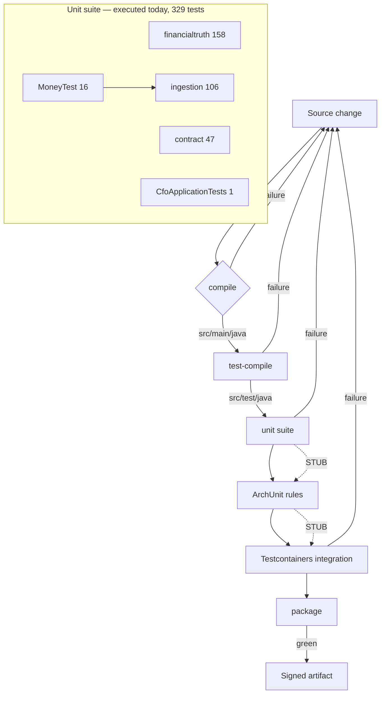

# 16 — Test Suite

> The test suite is the only place in this platform where a wrong number is
> *provably* a wrong number rather than a number nobody has checked yet.

## A. WHY this module exists

A CFO platform does two things with money: it reads what vendors sent, and it
decides what the company is owed. The first is arithmetic. The second is a
judgement, and a judgement that is off by one rupee on a large invoice is
indistinguishable from a correct one by inspection. Every other failure mode in
this codebase announces itself eventually — a stack trace, a reconciliation
variance, a customer complaint. A variance that silently moves from 8,00,000 to
7,99,999 does not. It is quoted to a customer, negotiated, settled, and never
noticed.

So the test suite exists for one reason: to make the arithmetic **auditable**. Not
"does the code run" — that is what the compiler and the application context are
for. The suite pins the *figures*. When a finance team asks six months later
"where did this number come from", the answer has to be reproducible from the
inputs, the rules and the clock — and the test suite is where that claim is
either held or quietly abandoned.

The second thing it exists for is **refusal**. Most of what this platform does
correctly is declining to do something: not to guess a price when no term is in
force, not to total across two currencies, not to call an unreadable contract
term a clean invoice, not to trust a `.csv` that is actually a ZIP. A test suite
that only asserts happy paths would pass against a system that fabricates
confidence. Nearly half the assertions in `financialtruth` and `ingestion` are
assertions that something *raises*.

The third thing is cheaper to say and harder to do: the suite is what makes the
rest of the handbook reviewable. Twelve hundred lines of rule evaluation logic
with no tests is code you can only trust by reading it, and reading code does not
find the double-rounding.

### Hard invariants

Every rule below is enforced by at least one executed test, except where the
section that owns it says otherwise. Section **F** says so bluntly where it is
not.

- **No silent rounding.** Division and rounding always take an explicit scale and
  an explicit `RoundingMode`. Two callers rounding the same figure differently is
  the difference between a reproducible calculation and one that cannot be
  re-derived.
- **No currency arithmetic across a boundary.** There is no FX component. Adding
  rupees to dollars must throw, never convert, because a converted rate is one
  nobody audited and every later figure inherits it.
- **No defaulting where the contract is silent.** A missing price term, a missing
  quantity, an unreadable discount value — these produce `IncompleteInputs` or an
  exception. A zero variance is a claim that a check happened.
- **One authoritative row per line.** The engine emits a combined row per line
  plus component rows per rule. Only combined rows may be aggregated; component
  rows carry no impact, so a caller summing everything cannot double-count.
- **Every refusal is locatable.** A rejected row carries its file, sheet, row and
  column. A parser finding is carried forward into the validation result, never
  dropped.
- **Row-level isolation.** One malformed row must not cost the well-formed rows
  around it, and the accounting must total: accepted + rejected + skipped accounts
  for every record in the file.
- **Reproducibility is two independent proofs.** An input checksum over the
  canonical snapshot, and a deterministic fingerprint over the produced results.
  Agreement means re-derived. Checksum-only means the inputs changed. Fingerprint-
  only means the conditions changed.
- **The engine never generates its own run id.** The caller supplies it, so a
  replay refers to a run the caller already holds.
- **The test JVM runs in UTC.** See §G. This is not cosmetic.
- **The container image is pinned.** `postgres:17`, never `latest`.

## B. FLOW — the runtime journey

The suite does not have a runtime journey in the ordinary sense. What it has is a
**gate**: a change cannot ship until it has passed every stage below, in order.
Most stages are Maven phases, but two of them — ArchUnit and the Testcontainers
integration context — are *stages that do not exist yet* and are drawn as such.

| # | stage | command | what it proves |
|---|-------|---------|----------------|
| 1 | compile | `./mvnw -q compile` | `src/main/java` type-checks against the declared Java level and the resolved dependency set. |
| 2 | test-compile | `./mvnw -q test-compile` | `src/test/java` type-checks — the suite is held to the same standard as production. |
| 3 | unit | `./mvnw test` | The 329 executed assertions: money arithmetic, variance rules, contract term resolution, CSV/Excel parsing, validation, reproducibility. No Docker required. |
| 4 | ArchUnit | `./mvnw test -Dtest='ModuleBoundaryTest,DependencyRuleTest'` | **Currently a no-op.** Both classes are 12-line placeholders; the command succeeds and asserts nothing. See §F. |
| 5 | Testcontainers | `./mvnw test -Dtest=CfoApplicationTests` | `CfoApplicationTests.contextLoads` starts a real PostgreSQL 17 container and applies all 10 Flyway migrations. Needs a running Docker daemon. |
| 6 | package | `./mvnw clean package` | Stages 1–5 in one command, then produces the executable jar. This is the command the known-green state was measured with. |

Notes that matter more than the table:

- **Stages 4 and 5 are not separable in the default build.** Surefire runs every
  class matching its includes in one JVM, one pass. `-Dtest=` is how you isolate
  them for debugging, and it is also how you *appear* to have run stage 4 in
  isolation while it did nothing.
- **Stage 3 does not need Docker; stage 5 does.** On a machine without a daemon,
  stage 3 is fully green and stage 5 fails during setup. A build that reports
  green on such a machine has *not* validated the migrations. `TestcontainersConfiguration`
  is explicit about this (`:36-40`): container-backed results are reported
  separately from the unit suite, never counted as passing.
- **`-Duser.timezone=UTC` rides on the surefire `argLine`**, so it applies to
  stages 3, 4 and 5 uniformly. It is the reason stage 5 works at all on a
  Windows host with an Indian locale — see §G.

## C. FILES — every file in the module

**37 files: 12 BUILT, 23 STUB, 2 CONFIG.**

A file is `BUILT` if it contains at least one executed `@Test` that contributes to
the 329. A file is `STUB` if its body is the generated placeholder — a Javadoc
block stating the intended scope, followed by `public class X { // TODO: Add test
cases. }` — and carries **no** test. The stubs are not empty: each one states
precisely what belongs there, and in several cases that statement is better
analysis than the tests that exist. But a stated intent is not a passing
assertion, and §F treats the difference bluntly.

| file | status | what it is for | key methods / lines |
|------|--------|----------------|---------------------|
| `CfoApplicationTests.java` | BUILT | The context canary — one empty method whose subject is `@SpringBootTest` reaching the body. | `contextLoads` `:33-36`; Javadoc `:7-27` |
| `TestCfoApplication.java` | CONFIG | IDE-oriented launcher that boots the app against the Testcontainers database. Nothing runs it during `mvn test`. | `main` `:20-22` |
| `TestcontainersConfiguration.java` | CONFIG | Supplies the `PostgreSQLContainer` bean under `@ServiceConnection`; pins `postgres:17`. | `postgresContainer` `:45-51`; rationale `:9-40` |
| `financialtruth/MoneyTest.java` | BUILT | The `Money` value type: exact decimal arithmetic, explicit scale, currency safety, numeric equality. 16 tests. | `CurrencySafety` `:52`; `Arithmetic` `:86`; `SignAndComparison` `:154`; `ScaleControl` `:187` |
| `financialtruth/PricingVarianceRuleTest.java` | BUILT | What a price check is allowed to conclude, and what it must refuse. 25 tests. | `NormalPricing` `:97`; `IncompleteInputs` `:165`; `MissingTerms` `:221`; `CurrencySafety` `:248`; `Rounding` `:273`; `BoundaryDates` `:317`; `Applicability` `:375` |
| `financialtruth/DiscountVarianceRuleTest.java` | BUILT | Entitlement arithmetic: base of measurement, caps, stacking, and the difference between *no entitlement* and *unreadable entitlement*. 22 tests. | `PercentageDiscounts` `:102`; `Caps` `:170`; `FixedAmountDiscounts` `:201`; `ApplicabilityAndCompleteness` `:229`; `BoundaryDates` `:298`; `Applicability` `:344` |
| `financialtruth/FinancialTruthEngineTest.java` | BUILT | The seam where `contract` output meets `financialtruth`, end to end, against a fixed clock. 38 tests. | `AcceptanceExample` `:100`; `SingleLineScenarios` `:166`; `DiscountsEndToEnd` `:222`; `MultiLineInvoices` `:272`; `MultipleCurrencies` `:353`; `BoundaryDates` `:418`; `Configuration` `:459`; `Lineage` `:565`; `ImpactAggregation` `:602` |
| `financialtruth/CalculationReproducibilityTest.java` | BUILT | The replay contract: checksum, fingerprint, diff reporting, run lifecycle. 31 tests. | `RepeatRuns` `:128`; `ReloadedSnapshots` `:182`; `Conditions` `:286`; `Lifecycle` `:349`; `VerifierArguments` `:508` |
| `financialtruth/FinancialRegressionTest.java` | BUILT | Literal figures for the whole engine, plus the two pinned regression anchors. 42 tests. | `NormalPricing` `:198`; `Discounts` `:353`; `Rounding` `:437`; `LargeAmounts` `:509`; `MultipleInvoiceLines` `:543`; `MissingTerms` `:613`; `BoundaryDates` `:685`; `MultipleCurrencies` `:758`; `PinnedRunIdentity` `:831` |
| `financialtruth/TruthEngineFixtures.java` | TEST | The fixed dataset every financial truth test draws on. Not a test class; it holds no assertions. | `engine` `:135-143`; `standardInput` `:210-217`; `netResult` `:234`; `ruleResult` `:243`; Javadoc contract `:31-52` |
| `contract/ContractServiceTest.java` | BUILT | Which contract clause is in force on a date, what price it resolves to, and what discount it grants. 47 tests. | `EffectiveTermResolution` `:184`; `PriceResolutionAndClamping` `:397`; `DiscountEvaluationBehaviour` `:521`; `MultiCurrency` `:676`; `Reproducibility` `:717` |
| `ingestion/CsvFileParserTest.java` | BUILT | Reading a delimited file exactly: dialect, header resolution, row isolation, file-level refusals. 30 tests. | `QuotingAndDialect` `:89`; `HeaderResolution` `:195`; `RowLevelIsolation` `:255`; `FileLevelRefusals` `:349`; `TypedCellsAndSecurity` `:397` |
| `ingestion/ExcelFileParserTest.java` | BUILT | Reading a real workbook, and refusing everything that is not one. 21 tests. | `ReadingAWorkbook` `:77`; `ArchiveDefences` `:224`; workbook builders `:356-555` |
| `ingestion/FileValidationServiceTest.java` | BUILT | The four gates — file, filename/content screen, schema, row — plus formula neutralisation and exact value parsing. 56 tests. | `TheFileGate` `:86`; `TheFilenameAndContentScreen` `:185`; `TheSchemaGate` `:337`; `TheRowGate` `:393`; `FormulaInjection` `:592`; `ExactValueParsing` `:703` |
| `api/CalculationControllerTest.java` | STUB | *Intended:* MockMvc tests for the calculation endpoint. Belongs: status-code contract, error-body shape, and a check that a replay request is authenticated and tenant-scoped. | Javadoc `:4-19`; TODO `:23-26` |
| `api/IngestionControllerTest.java` | STUB | *Intended:* MockMvc tests for the ingestion endpoint — upload, run status, findings. Belongs: multipart handling, the 202-vs-200 decision, and that a run's status is scoped to its tenant. | Javadoc `:4-18`; TODO `:22-25` |
| `api/OpportunityControllerTest.java` | STUB | *Intended:* MockMvc tests for the economic opportunity endpoints. Belongs: the lifecycle transitions over HTTP, and that a challenge cannot be recorded by a caller outside the tenant. | Javadoc `:4-18`; TODO `:22-25` |
| `architecture/DependencyRuleTest.java` | STUB | *Intended:* the dependency-direction half of the boundary rule, kept separate so a violation names the rule it broke. Belongs: no module imports another; no domain package depends on the web layer; no service depends on a repository implementation. | Javadoc `:3-25`; TODO `:26-33` |
| `architecture/ModuleBoundaryTest.java` | STUB | *Intended:* the structural half — the published-type rule per module. Belongs: the allowed-dependency matrix from `module-implementation-rules.md`, enforced by ArchUnit. | Javadoc `:4-27`; TODO `:28-31` |
| `contract/CommercialRuleServiceTest.java` | STUB | *Intended:* approval thresholds and escalation. The file's own Javadoc notes `ContractServiceTest` already covers the discount *arithmetic*; what is missing is the *threshold* decision. | Javadoc `:4-26`; TODO `:27-30` |
| `evidence/EvidenceServiceTest.java` | STUB | *Intended:* attaching and retrieving the evidence behind a monetary result. | Javadoc `:4-18`; TODO `:23-26` |
| `evidence/LineageServiceTest.java` | STUB | *Intended:* resolving the lineage chain from a calculation back to the source row. | Javadoc `:4-19`; TODO `:24-27` |
| `financial/FinancialDataServiceTest.java` | STUB | *Intended:* the canonical financial model — customers, products, invoices, their persistence. | Javadoc `:4-18`; TODO `:23-26` |
| `financial/InvoiceNormalizationTest.java` | STUB | *Intended:* turning a vendor-specific export row into the one canonical shape. | Javadoc `:4-20`; TODO `:25-28` |
| `identity/IdentityServiceTest.java` | STUB | *Intended:* turning an authenticated token into the `SecurityPrincipal`. | Javadoc `:4-19`; TODO `:24-27` |
| `identity/TenantAccessServiceTest.java` | STUB | *Intended:* the `organization_id` scope decision — which records a caller may see. | Javadoc `:4-18`; TODO `:23-26` |
| `ingestion/IngestionServiceTest.java` | STUB | *Intended:* the ingestion run as a whole — stage order, status transitions, resumability. | Javadoc `:4-19`; TODO `:24-27` |
| `opportunity/OpportunityDetectionTest.java` | STUB | *Intended:* converting Financial Truth Engine output into candidate opportunities. | Javadoc `:4-19`; TODO `:24-27` |
| `opportunity/OpportunityLifecycleTest.java` | STUB | *Intended:* the state machine — detected, evidenced, quantified, … | Javadoc `:4-19`; TODO `:24-27` |
| `opportunity/OpportunityValidationTest.java` | STUB | *Intended:* the finance decision — open, challenge, validate or reject. | Javadoc `:4-18`; TODO `:23-26` |
| `security/AuthenticationTest.java` | STUB | *Intended:* a request carrying no valid credential. Its Javadoc says so itself: not in its own coverage today. | Javadoc `:4-16`; TODO `:22-25` |
| `security/AuthorizationTest.java` | STUB | *Intended:* an authenticated caller not permitted to do what they asked. | Javadoc `:4-19`; TODO `:24-27` |
| `security/FileUploadSecurityTest.java` | STUB | *Intended:* the upload gate reached through the security layer rather than the service. Notes the naming overlap with `FileValidationServiceTest`. | Javadoc `:4-17`; TODO `:24-27` |
| `security/TenantIsolationTest.java` | STUB | *Intended:* proving no path lets one tenant's data reach another. Its Javadoc calls this the single largest gap in the suite. | Javadoc `:3-24`; TODO `:25-32` |
| `value/ActionServiceTest.java` | STUB | *Intended:* recording an action against a validated opportunity and tracking its state. | Javadoc `:4-20`; TODO `:25-28` |
| `value/OutcomeServiceTest.java` | STUB | *Intended:* recording what actually happened after an action, and measuring against expectation. | Javadoc `:4-19`; TODO `:24-27` |
| `value/ValueAttributionTest.java` | STUB | *Intended:* attributing realised value back to the opportunity that caused it. | Javadoc `:4-19`; TODO `:24-27` |

Reconciliation: `3` root files + `3` api + `2` architecture + `2` contract +
`2` evidence + `2` financial + `7` financialtruth + `2` identity + `4` ingestion +
`3` opportunity + `4` security + `3` value = **37**. Executed `@Test` methods:
`1 + 47 + 31 + 22 + 42 + 38 + 16 + 25 + 30 + 21 + 56 = 329`, which matches the
known-green `mvnw clean package`. (`TestcontainersConfiguration` matches the
`@Test` string only inside `@TestConfiguration` and contributes no test.)

## D. DEEP DIVE — the rules, and the tests that hold them

This section states each real test class as a **business rule**. "Tests method X"
teaches nothing; "a product with no price in force must produce a refusal, not a
clean invoice" does.

---

### D.1 `financialtruth/MoneyTest.java` — the only type money is allowed to be

`Money` is the platform's single permitted representation of an amount. That
makes this the highest-leverage 16 tests in the repository: a defect here does
not stay here, it reappears in every variance, every total and every report, and
it reappears *plausibly* — a dropped paisa on a large invoice still looks like a
number. Four rules, four nested classes.

**Rule: arithmetic and comparison across two currencies throw.**
`CurrencySafety.rejectsArithmeticAcrossCurrencies` (`:55-62`) asserts
`rupees.add(dollars)` raises `IllegalArgumentException` with a message containing
`currency mismatch`; `rejectsComparisonAcrossCurrencies` (`:65-70`) asserts the
same for `compareTo`. **WHY:** there is no FX component in this codebase. A
silent conversion would invent a rate nobody audited, and every figure downstream
would inherit it. A thrown exception is recoverable — a wrong total is not.
`normalizesCaseAndPaddingOnConstruction` (`:73-75`) fixes the input side:
`" inr "` is `INR`, and `rejectsMalformedCurrencyCode` (`:78-81`) refuses
`"RUPEE"` and `"IN"` rather than guessing at a fuzzy match.

**Rule: every operation is exact decimal arithmetic, never binary floating
point.** `Arithmetic.addsAndSubtractsExactly` (`:89-94`) works at four decimal
places, the storage scale. `multipliesWithoutLosingPrecision` (`:97-104`) pins
`0.1 × 0.2 == 0.02` **and** that `toPlainString()` returns `"0.02"` — the
floating-point failure mode is a number that is right everywhere except the last
digits, which is exactly the kind nothing downstream can catch.
`computesLargeAmountsExactly` (`:128-141`) multiplies `10000000000.000000` by
`920.00` and gets `9200000000000.000000` exactly, then normalises to
`9200000000000.0000` for a `NUMERIC(20,4)` column. The comment at `:136-138`
states the trade-off explicitly: multiplication's scale is the *sum of operand
scales* (6 + 2 = 8), so the value is exact but not yet at the storage scale.
Callers must normalise. That is a deliberate non-default — a "helpful" implicit
normalisation inside `multiply` would hide the round-trip question from every
caller, and `multiplicationScaleIsTheSumOfOperandScales` (`:144-149`) asserts
`10.000 × 2.00 → scale 5, "20.00000"` to stop someone adding that convenience.

**Rule: division takes an explicit scale and an explicit rounding mode, and
rejects the nonsense cases.** `divisionRequiresExplicitScaleAndRounding`
(`:107-115`) shows `10.00 / 3` at scale 2 is `3.33` under both `HALF_UP` and
`DOWN`, and at scale 4 is `3.3333` — the caller states the precision, the type
does not choose it. `rejectsDivisionByZeroAndNegativeScale` (`:118-125`) pins
`BigDecimal.ZERO` and a negative scale as `IllegalArgumentException`.
**Non-default, named:** `HALF_UP` is the house rounding mode because HALF_EVEN
(banker's rounding) is correct in statistics and wrong in invoices — a finance
team expects `0.005` to become `0.01`. The cost of `HALF_UP` is a systematic
upward bias of a half-unit per rounding; the cost of `HALF_EVEN` is a customer
disputing the rounding of a one-paisa line. The suite chooses the former, and
`FinancialRegressionTest` pins the *consequence* of that choice.

**Rule: sign and equality are numeric, and equality spans currencies
correctly.** `SignAndComparison.ignoresTrailingZerosForEquality` (`:164-169`)
asserts `100.00 == 100.000` **and** that the two share a hash code. **WHY both:**
equality drives checksums, deduplication and totals; a textual comparison makes
`100.00` and `100.000` different amounts and breaks all three. The hash-code
assertion is the one people forget — an `equals` override without a matching
`hashCode` would pass the first assertion and corrupt every `HashSet` and
`HashMap` in the platform.
`distinguishesDifferentCurrenciesWithEqualAmounts` (`:172-176`) is the
arithmetic rule applied to equality: `100.00 INR ≠ 100.00 USD`. Here a wrong
answer is a wrong total, not an exception.

**Rule: scale is controlled explicitly and stored without exponent notation.**
`ScaleControl.appliesExplicitRounding` (`:190-196`) shows all three modes
disagreeing on `10.005` — `10.01` / `10.00` / `10.01` — which is the point: the
mode is the caller's decision and the difference is visible.
`storesValueWithoutExponentNotation` (`:199-204`) pins
`toPlainString()` on `0.00000001` as `"0.00000001"`. **WHY:** `BigDecimal.toString`
would render it `1E-8`, and that form does not round-trip through
`NUMERIC(20,4)` or through a CSV export the way an analyst expects.

---

### D.2 `financialtruth/PricingVarianceRuleTest.java` — what a price check may conclude

Twenty-five tests on one rule. The class Javadoc (`:52-79`) names the four
properties and, unusually, explains *why term selection is asserted independently
of pricing arithmetic*: which row is in force is a different decision from what
that row says, and conflating the two makes an overlap bug look like a rounding
bug.

**Rule: refuse rather than default.** `MissingTerms.raisesRatherThanDefaultingWhenNoPricingTermIsInForce`
(`:224-231`) is the load-bearing case. **WHY:** defaulting the expected amount to
the *invoiced* amount reports a perfectly clean invoice for a line nobody
checked against anything — the failure mode is indistinguishable from success.
`raisesWhenTheContractPriceIsOutsideTheBoundsTheContractItselfDeclares` (`:234`)
extends it: if the contract declares a floor and the price is under it, the
contract is self-contradictory, and reconciling against it would launder the
contradiction into a number.

**Rule: "not evaluated" is a distinct answer from "zero variance".**
`IncompleteInputs` asserts four ways this is true: a missing quantity
(`:167`), a *zero* quantity (`:180`), and a pricing type this module cannot
evaluate (`:192`) all yield `RuleStatus.IncompleteInputs` with **no figures at
all**; and `neverReportsAVarianceForALineItCouldNotEvaluate` (`:206`) is the
aggregate. **WHY zero quantity counts:** a zero-quantity line produces an expected
amount of `0.00` and a variance of `0.00`, which is arithmetically correct and
completely misleading — it reads as "checked, matches". The zero here almost
always means the quantity was not captured.

**Rule: round exactly once, at the storage scale, and only at the end.**
`Rounding.roundsOnceToFourDecimalPlacesHalfUp` (`:276`),
`roundsAHalfUpAtTheSubPaisaBoundaryRatherThanTruncating` (`:287`) and
`isExactWellBeyondThePrecisionOfADouble` (`:298`) together pin `NUMERIC(20,4)` /
`HALF_UP` against a contract price of `0.000050 INR` (exactly on the boundary) and
`987654321.987654 INR`. The class Javadoc notes the last one also proves the
`double` path would have been wrong — the test is doing double duty as a refutation.

**Rule: never cross a currency boundary.** `raisesWhenTheContractIsInADifferentCurrencyFromTheInvoice`
(`:251`) and `computesTheSameAmountsInAnotherCurrency` (`:261`) are a matched
pair: the first refuses, the second proves the refusal is about the currency and
not about the amount. A rule that only ever ran on INR would not know the
difference.

**Rule: term selection is a total, deterministic function.** `BoundaryDates`
(`:317-371`) walks the window edges — applies on the first day (`:324`), applies
on the last day (`:329`), finds nothing the day before (`:334`, `:355`), nothing
the day after (`:339`, `:364`) — and `reconcilesOnTheInvoiceDateWhenTheTermIsInForceThatDay`
(`:344`) fixes *which* date is consulted. `Applicability.picksTheHighestVersionWhenTwoTermsOverlapInTime`
(`:383`) resolves the overlap: highest `term_version` wins, deterministically,
regardless of the order the list arrived in.

---

### D.3 `financialtruth/DiscountVarianceRuleTest.java` — entitlements

**Rule: the entitlement is measured against the *contract* gross, never the
invoiced gross.** The class Javadoc (`:59-61`) gives the reason in one sentence:
using the invoiced figure would let an inflated invoice inflate its own discount,
which cancels out exactly the overcharge being detected. That is the whole bug in
miniature — the two errors are correlated, so the check would report clean.
`FinancialRegressionTest` pins the same rule end to end from the other side
(`keepsThePricingComponentGrossOfDiscount` `:219`,
`takesThePercentageOfTheContractGrossRatherThanOfTheInvoicedGross` `:375`).

**Rule: an entitlement can never exceed the gross it reduces.**
`Caps.neverEntitlesMoreDiscountThanTheContractedGross` (`:184-197`) is the direct
test. **WHY:** a fixed discount larger than the line would drive the payable
negative, and negative-and-then-some as quantities grow. The cap has two levels
and both are tested here and in `ContractServiceTest`: a *monetary cap the term
declares* (`appliesTheMonetaryCapTheTermDeclares` `:173`) and a *hard structural
ceiling at the gross* (`:184`). The declared cap is a business term; the gross is
arithmetic sanity.

**Rule: stacking is from a single base and is order-independent.**
`sumsStackedTermsFromTheSameBase` (`:135`) and
`producesTheSameTotalWhateverOrderStackedTermsArriveIn` (`:145`) state it. **WHY
order-independent:** the order a contract's clauses are stored in is not an
economic fact (`:72-74`). Sequential application would make a 10% and a 5% term
compound in one order and add in the other, and which one a customer received
would depend on a database sort.

**Rule: "no entitlement" and "unreadable entitlement" are different answers.**
This is the most valuable distinction in the class and
`ApplicabilityAndCompleteness` (`:229-295`) enumerates five ways an entitlement
can be unreadable: no value (`:243`), a percentage above 100% (`:256`), no
contracted gross to discount (`:269`), and a missing quantity (`:285`) — all
`IncompleteInputs`. A contract granting no discount at all is
`NotApplicable` (`:232`). **WHY the distinction:** collapsing the second into the
first turns an unreadable contract term into a clean invoice. The status enum
exists precisely so that a caller can tell them apart downstream.

**Rule: a percentage discount inherits the currency of the base it reduces**, and
a fixed discount does not get to choose.
`percentageInheritsTheCurrencyOfItsBase` (`:367`) and
`raisesWhenTheEntitlementIsInADifferentCurrencyFromTheAmountItReduces` (`:216`).
A percentage has no currency of its own; a fixed amount does, and a mismatch is
refused rather than converted.

**Sign convention** (`:48-52`): a *positive* figure on this rule's component means
the customer received **more** discount than contracted, which works against the
supplier. The engine negates it when folding into the net, so a positive net
variance is always money recoverable by the customer. This is a deliberate
asymmetry between the two rules and it is why a discounted invoice produces a
negative net even though its discount component is positive —
`FinancialRegressionTest.reportsAnOverDiscountedInvoiceAsANegativeNetEvenThoughItsDiscountComponentIsPositive`
(`:320`) exists for exactly that assertion.

---

### D.4 `financialtruth/TruthEngineFixtures.java` — how the fixed dataset works

Not a test class, but the substrate for six of them, and the two regression
anchors are defined in terms of it.

**How it works.** Every value is a literal. Nothing is derived from a clock, a
random source or the environment (`:34-36`) — *a financial regression suite
whose expected values can move is not a regression suite.* Product keys are named
for the scenario they exist to exercise, so a failing assertion identifies itself
without further reading: `SKU-OVERCHARGED` (`:84`), `SKU-MATCHED` (`:87`),
`SKU-UNDERCHARGED` (`:90`), `SKU-DISCOUNTED` (`:93`), `SKU-DOLLAR` (`:96`),
`SKU-UNTERMED` (`:99`), `SKU-MARCH-ONLY` (`:102`), `SKU-FRACTIONAL` (`:105`),
`SKU-SUB-PAISA` (`:108`), `SKU-HUGE` (`:111`).

**Why it is package-private and final with a private constructor** (`:41-44`):
it is a fixture, not a component. It must never be injectable, never appear in a
Spring context, and never be subclassed.

**The clock.** `FIXED_CLOCK` (`:56`) is `2024-03-16T09:30:00Z` in UTC — one day
after `AS_OF = 2024-03-15` (`:69`). The one-day gap is deliberate: a clock at the
same instant as the business date would leave the term-selection logic untested
against a boundary it will meet in production.

**The extension contract** (`:46-51`), which is the most important sentence in
the file: a new product key may be added freely, but **changing the value of an
existing one invalidates the pinned figures in `FinancialRegressionTest`,
including a hard-coded input checksum**. Treat edits to existing keys the way the
module treats an amended contract price — a deliberate, reviewed change that also
updates the pinned expectations. This is the discipline that makes the anchors
mean anything.

**The two regression anchors.** Both are literals in `FinancialRegressionTest`:
the seven-line input's SHA-256, `1824ce4ae24ebd449ae7e14bdecc1365511e7a8022279e2d323c07eb6eeb5c86`
(`FinancialRegressionTest:854`, with the comment at `:851` asserting it matches the
engine byte for byte), and the pinned total
`12345679750962.3458` (`:535` and `:567`). Neither is decorative. The checksum
answers *"were these the same inputs?"*; the total answers *"and did they produce
the same money?"* A change to either is a change to the arithmetic, and the file
says so at `:52-56`: it is not a refactor, it is either a bug or a deliberate,
reviewed change — in which case the rule version and this file change together.

**One trap in the fixture worth naming.** `documentsTheFixedDataset` in
`FinancialRegressionTest` (`:915`) exists to guard the dataset itself: if a
contract price or a window is edited, every pinned figure above it stops meaning
anything, so the dataset states its own content. The Javadoc at `:890-910` records
a bug of exactly that shape — a free-item helper discarded its own `unitPrice`
argument and zeroed the *invoiced* price instead, which left the expected amount
at 5,00,000 and never reached the undefined division the test existed to pin, so
the assertion passed **for the wrong reason**. A test that cannot fail is worse
than no test, and this is the one place in the suite where that happened and was
found.

---

### D.5 `financialtruth/FinancialTruthEngineTest.java` — the seam, end to end

Thirty-eight tests. This is where `contract` (which price applies) meets
`financialtruth` (what that means). The class Javadoc names the three
unacceptable failure classes: silent arithmetic drift, losing or double-counting
money, and overstating completeness.

**Rule: the net variance is the sum of its own components, always.**
`reconcilesTheNetVarianceAgainstItsOwnComponents` (`:149`) is the identity
`net = pricing − discount`, asserted on the acceptance example.
`componentRowsCarryNoImpactSoNothingCanBeDoubleCounted` (`:590`) and
`refusesToAggregateComponentRows` (`:605`) are the other half: component rows
carry **no** impact, and the aggregator refuses them. **WHY:** a caller who sums
every row in a run would otherwise count each variance twice. The design answer
is not "document it in the caller" but "make it impossible in the type".

**Rule: totals are independent of presentation order.**
`producesTheSameTotalWhateverOrderTheLinesWerePresentedIn` (`:298`) plus
`sumsAlreadyRoundedLineVariancesIntoOneTotal` (`:275`). **Why this matters:**
`BigDecimal` addition is exact, so summing first and rounding once gives a
different figure from rounding each line and summing. The engine does the latter —
round each line, then sum — because a line-level variance is what gets
negotiated, and a total that cannot be decomposed into its lines cannot be
disputed line by line.

**Rule: an unevaluable line is disclosed, excluded, and lowers confidence.**
`disclosesLinesItCouldNotEvaluateAndDropsItsOwnConfidence` (`:317`) asserts all
three halves. The Javadoc at `:86-89` is blunt about why: *a total that silently
drops a line is indistinguishable from a clean invoice, which is the most damaging
way this engine can be wrong.* There is no way to return a total with no
explanation attached.

**Rule: one impact figure per currency; never a single total across currencies.**
`reportsOneImpactPerCurrencyRatherThanAddingThemTogether` (`:356`),
`measuresEachTotalsCoverageAgainstItsOwnCurrencyOnly` (`:371`),
`refusesToReportASingleTotalAcrossCurrencies` (`:392`),
`raisesWhenAProductHasNoContractPriceInAnyCurrency` (`:406`). Coverage is
per-currency because "80% of the invoice was checked" is only true of the
denomination it was checked in.

**Rule: the engine's configuration is validated before it is trusted.**
`ordersTheRuleSetFingerprintRegardlessOfInjectionOrder` (`:462`) — a Spring
context that injects rules in a different order must not produce a different
fingerprint, or every restart would look like a rule change. `rejectsTwoRulesSharingACode`
(`:486`) — two rules with the same code would make `ruleResult(run, "CODE", n)`
ambiguous and silently return the wrong rule's figures. `rejectsAnEmptyRuleSet`
(`:500`) — a run that evaluated nothing and reported confidence would be a lie.
`refusesToGenerateItsOwnRunId` (`:508`) — the caller owns the run id so a replay
refers to a run it already holds.

**The worked example from the architecture document** (`:99-163`). This nested
class is the acceptance criterion, and it is worth reading in full because it is
the only place where the documented product claim is executed end to end.
`reconcilesAnOverchargeEndToEnd` (`:103`) takes the fixed clock, a snapshot with
one overcharged line, and asserts the combined row against a literal —
`FinancialTruthEngineTest`'s Javadoc is explicit that *every amount in this suite
is asserted against a literal, never recomputed from the code under test* (`:80-81`),
which is the only way this kind of test can fail. The companion cases close the
accounting: `recordsTheRuleVersionTheCalculationRunAndItsResultAgreeOn` (`:120`),
`recordsTheInputChecksumTheRunWasProducedFrom` (`:132`) and
`reconcilesTheNetVarianceAgainstItsOwnComponents` (`:149`).

**Rule: every result carries its provenance.** `Lineage.everyResultCarriesTheSourceRowItCameFrom`
(`:568`), `everyResultCarriesTheTermsItEvaluatedAndAnExplanation` (`:578`). A
variance a finance analyst cannot trace to a source row and a contract clause is
a number they cannot act on.

**Two honest-error cases** worth citing individually: `refusesAnAsOfDateBeforeTheInvoiceDate`
(`:659-665`) — a snapshot as of before the invoice is a data problem, not a
reconciliation — and `anUnreadableDiscountIsNotAnEntitlementOfZero` (`:668-681`),
the engine-level statement of the same rule §D.3 covers at unit level.

---

### D.6 `financialtruth/CalculationReproducibilityTest.java` — the replay contract

Thirty-one tests, and the class Javadoc (`:79-105`) contains the clearest
statement of a two-proof design in the codebase.

**Rule: the input checksum ignores anything without economic meaning.** The
checksum must not move for a change in load order, and must not move for the
trailing zeros a `NUMERIC(20,4)` round-trip leaves behind.
`reproducesWhenTheTermsWereLoadedInTheOppositeOrder` (`:209`) and
`reproducesWhenTheValuesComeBackAtADifferentDecimalScale` (`:198`) pin both.
**WHY (`:86-88`):** a checksum that reports spurious drift *trains auditors to
ignore it*. The rebuild helpers at `:578-606` are careful to rescale **every**
term, not only the three the invoice lines touch, because the whole snapshot is
digested.

**Rule: the checksum must move when anything economic moves.**
`reportsAChangedAmountRatherThanClaimingItReproduced` (`:226`) and
`detectsAContractPriceAmendedInPlaceUnderTheSameTermId` (`:243`) are the two
sides. The second is the interesting one: an amendment under an unchanged term id
is invisible to a naive id-based comparison. Its helper at `:613-620` rebuilds the
entire contract in full, "because a rebuild of a partial contract here would let
the checksum differ for the wrong reason and make the test pass without ever
proving that an in-place amendment is detected."

**Rule: the fingerprint must move when the conditions move.**
`refusesToReproduceWhenTheClockMoved` (`:289`),
`refusesToReproduceUnderADifferentRuleSet` (`:305`). The clock is **injected**
(`:156-179`, `producesItsTimestampFromTheInjectedClockAndNotTheSystemClock`) —
this is the determinism rule of `module-implementation-rules.md` §4 enforced in
code, and it is why `TruthEngineFixtures.FIXED_CLOCK` exists.

**Rule: the two proofs are independent, and each of the three outcomes is
distinct.** The Javadoc at `:94-100` states it exactly: checksum **and**
fingerprint agree → re-derived. Checksum differs → the inputs changed, nothing to
compare. Checksum agrees but fingerprint differs → same inputs, different
conditions, and the run *cannot* be called reproducible. Collapsing any two of
these would make tampering indistinguishable from a clock change — the exact
confusion an auditor would be relying on the system not to introduce.

**Rule: a verifier that finds a difference names it and lists all of them.**
`namesTheLineThatDriftedSoTheDifferenceCanBeInvestigated` (`:257`),
`reportsEveryDifferenceItFoundRatherThanTheFirst` (`:319`),
`namesTheDifferencesWhenAnUnfaithfulReplayIsRequired` (`:338`). **WHY (`:101-105`):**
a verifier that only says "it changed" leaves an auditor with nothing to act on.

**Rule: a run has a lifecycle, and it is enforced.** `Lifecycle` (`:349-504`)
asserts the checksum and rule set are recorded **before any figure exists**
(`:354`), a run cannot be opened without a replayable id (`:372`), a run closes
with the results produced from its own snapshot (`:380`), and refuses results
from a different snapshot (`:392`), a run that already ended (`:405`), a failed
evaluation (`:415`), or a failure with no reason (`:440`). Two are worth calling
out as business rules rather than plumbing:
`truncatesAFailureReasonToWhatTheColumnCanHold` (`:448`) and
`recordsAPlaceholderWhenAFailureCarriedNoMessage` (`:461`) — a failed run must
still record *why*, and a truncation must be visible rather than a silent cut.

**Rule: faithfulness is required or reported, never assumed.**
`raisesRatherThanReturnsWhenAFaithfulReplayIsRequired` (`:332`),
`refusesToAcceptAReplayWhoseRuleSetDiffers` (`:476`),
`refusesToAcceptAReplayWhoseInputsDiffers` (`:487`),
`acceptsAFaFaithfulReplay` (`:497`).
And `refusesAVerificationWithNothingToCompare` (`:511`) — a verifier asked about
no run must not return "verified".

---

### D.7 `financialtruth/FinancialRegressionTest.java` — the literals

Forty-two tests, and this is the file that would have to be edited if anyone
changed the arithmetic on purpose. Its Javadoc (`:48-56`) is the governing
statement: *a variance that changes from 8,00,000 to 7,99,999 and still looks
plausible is a defect nobody downstream can catch.*

**The dataset** (`:68-84`, and mirrored in `TruthEngineFixtures`): seven INR
products and one USD product against invoice `INV-2024-0001` as of 2024-03-15.
Each key fails differently, and `documentsTheFixedDataset` (`:915`) asserts the
dataset's own content so a well-meaning edit cannot silently invalidate every
pinned figure.

**The three properties of every case** (`:58-66`): fixed clock, dates, terms and
prices — no wall clock, no randomness, no environment; every expected figure a
decimal **string** compared with `isEqualByComparingTo`, so the assertion states
the value rather than inheriting whatever scale the code produced; and a currency
asserted alongside every amount, *because a variance without one is the failure
this module exists to prevent*.

**Rule: the pricing component is measured on the gross, before any discount.**
`keepsThePricingComponentGrossOfDiscount` (`:219`) and
`reconcilesTheNetAgainstItsOwnComponents` (`:235`). This is the same invariant as
§D.3's, asserted at the engine boundary rather than the rule boundary — and it is
the one a "simplifying" refactor would break first.

**Rule: a percentage variance is never reported against a zero expected amount.**
`neverReportsAPercentageForAVarianceAgainstAZeroExpectedAmount` (`:334`). The
helper's Javadoc (`:890-910`) explains why the contract price is the zero one and
not the invoiced price: the percentage is `variance / expected`, so the division
is only undefined when the *expected* amount is zero. This is the case described
in §D.4 where the previous helper made the assertion pass for the wrong reason.

**Rule: rounding happens once, at scale 4, HALF_UP — and the consequence is
pinned.** `roundsHalfUpToFourDecimalPlacesExactlyOnce` (`:440`),
`roundsUpAtAHalfPaisaRatherThanTruncating` (`:454`),
`reportsEveryAmountAtTheStorageScaleOfFourDecimalPlaces` (`:467`),
`keepsTotalsFreeOfTheOrderTheLinesWerePresentedIn` (`:487`). The sub-paisa
contract price of `0.000050 INR` exists solely to make HALF_UP observable; a
`truncate()` would pass every other case in this class.

**Rule: large amounts are exact where a `double` loses the minor units.**
`isExactWhereADoubleWouldLoseTheMinorUnits` (`:512`) uses
`987654321.987654`; `keepsTheTotalExactWhenALargeLineIsSummedWithSmallOnes`
(`:529`) ends at the pinned total `12345679750962.3458` (`:535`). The second
assertion is the one that carries the anchor: it is a sum of seven lines of
deliberately awkward magnitudes, and it is only correct if every component was
rounded once at the right scale before being summed.

**Rule: the run's identity is pinned.** `PinnedRunIdentity` (`:831-888`):
`pinsTheInputChecksum` (`:835`) fixes the SHA-256 `1824ce4a…`;
`pinsTheRuleSetThatProducedTheFigures` (`:859`) fixes the rule set version;
`carriesTheSourceRowAndTheTermsForEveryReportedFigure` (`:872`) asserts lineage
on every row. Together these three are what make a figure re-derivable rather than
merely reproducible-in-principle.

**Rule: the result row order is part of the contract.** `pinsTheResultRowOrderTheRunWillAlwaysProduce`
(`:597`). **WHY:** a run is hashed. If row order were incidental, the fingerprint
would move on a JVM whose `HashMap` iteration order differs, and the
reproducibility guarantee would be unshippable.

---

### D.8 `contract/ContractServiceTest.java` — which clause is in force

Forty-seven tests on the module the whole platform trusts to decide *what the
price is*. Pure unit tests: contracts, terms and candidates are constructed by
hand, and nothing is loaded from a repository.

**Rule: an effective window is inclusive on both ends.**
`windowIsInclusiveOnBothEnds` (`:188`), `dayAfterEffectiveToIsOutOfForce` (`:197`),
`dayBeforeEffectiveFromIsNotInForce` (`:211`),
`openEndedWindowNeverExpires` (`:219`). **WHY inclusive-inclusive:** it matches
`financialtruth`'s term boundary assertions exactly (see §D.2 `BoundaryDates`).
Two modules independently deciding what "in force on the last day" means would be
a cross-module contract violation that only a real invoice would expose.

**Rule: overlap resolution is a total order, and the order does not depend on
list order.** `highestTermVersionWinsOverlap` (`:238`),
`latestEffectiveFromWinsAtEqualVersion` (`:248`),
`fullTieIsBrokenByRowId` (`:258`). The third is the one people forget: when two
terms tie on version and start date, the tie must break *deterministically*, or
two runs of the same data can pick different clauses.
`ambiguousOverlapExposesEveryCandidate` (`:272`) keeps the losing rows visible to
the caller rather than discarding them, so a genuinely ambiguous contract is
reportable instead of silently resolved.

**Rule: scope beats version, and a suspended contract supplies nothing.**
`productScopedTermBeatsContractWideDefault` (`:281`) — a bespoke product price
wins against a contract-wide default *even at a lower version*, because they are
different questions. `foreignScopedTermsAreExcluded` (`:296`) — a term scoped to
another product or another customer is not a candidate at all.
`suspendedContractSuppliesNoTerms` (`:327`) even inside its own window, and
`expiredContractStillSuppliesItsHistoricalTerms` (`:339`) — an expired contract
must still answer a historical question, or last year's invoices could never be
re-derived. `contractWindowBoundsItsTerms` (`:350`) prevents a term outliving the
contract around it.

**Rule: missing terms raise, never default.** `missingTermsRaise` (`:315`),
`effectiveTermsWithoutPricingRaise` (`:826`). Same reason as §D.2: a default
produces a clean-looking answer to a question nobody answered.

**Rule: a resolved price is normalised and clamped.**
`publishedPriceIsNormalised` (`:400`) normalises to `NUMERIC(20,6)` — a wider
scale than the `NUMERIC(20,4)` money scale, because a *unit* price must retain
more precision than an *amount*: 33.333333 must survive as a contract price so
that quantity × price rounds once, rather than the unit price having already lost
a digit. Clamping is tested on both sides — `candidateBelowFloorIsClampedUp`
(`:420`), `candidateAboveCeilingIsClampedDown` (`:434`),
`candidateInsideBoundsIsUntouched` (`:448`),
`singleSidedBoundClampsOnlyThatSide` (`:461`) — plus
`candidateMayNotOverrideFixedPrice` (`:475`),
`unpriceableTieredTermRaises` (`:490`),
`inconsistentBoundsAreRejected` (`:501`) and
`priceBoundsMustMatchTermCurrency` (`:509`).

**Rule: discount evaluation is applied once and rounded once.**
`percentageDiscount` (`:525`), `percentageRoundingIsHalfUp` (`:539`),
`exactHalfRoundsUpNotToEven` (`:550`). The third is the HALF_UP decision
materialised: `10.005` becomes `10.01`, not `10.00`, and a test named after the
behaviour is the cheapest documentation that decision will ever get.

**Rule: caps, and the precedence between them.**
`maximumDiscountAmountCapsPercentage` (`:576`),
`maximumDiscountAmountBelowTheComputedDiscountIsIgnored` (`:588`) — a cap above
the computed discount is not an error, and a test that only checked the capping
direction would not have caught a service that errored instead —
`fixedDiscountCannotExceedGross` (`:599`), which is the one that fixed the
`granted >= gross` case study in §E.

**Rule: an absent discount is an explicit answer.**
`noDiscountTermYieldsExplicitNone` (`:610`) — a result object saying "no
discount", not a zero and not an exception, because the caller has to be able to
distinguish "checked, no entitlement" from "did not look".

**Rule: reproducibility at the service boundary.** `Reproducibility` (`:717-843`):
`sameDateReproducesIdenticalResult` (`:721`),
`laterDatePicksUpLaterVersion` (`:735`),
`inputChecksumIsOrderIndependent` (`:747`),
`checksumDetectsAChangedInput` (`:768`),
`effectiveTermsRecordCarriesItsEvidence` (`:794`) — the winning terms and their
versions travel with the answer, so the choice is auditable after the fact, not
only during the call.

**Rule: a foreign currency is ignored or refused, never converted.**
`priceTermInForeignCurrencyIsNotUsed` (`:680`),
`candidatePriceCurrencyMismatchIsRejected` (`:692`),
`amountsOfDifferentCurrenciesAreNeverAdded` (`:708`),
`foreignCurrencyDiscountIsSkippedByTheService` (`:657`). Note the deliberate
difference: a *term in another currency* is not a candidate (skip), while a
*candidate price in another currency* is an error (raise) — because a term the
contract never applied is silence, and a term someone tried to apply is a mistake.

---

### D.9 `ingestion/CsvFileParserTest.java` — 30 tests, reading a text file exactly

**Rule: the dialect is a reader's problem, not a vendor's.**
`QuotingAndDialect` (`:89-192`): a quoted field may hold the delimiter *and a
newline* without shifting the row number (`:93`) — the row number is what makes
a rejection locatable, so a newline inside quotes that desynchronises it would
corrupt every later coordinate. An escaped quote reads as one literal quote
(`:114`). A semicolon or tab delimiter is honoured when the options ask
(`:123`). CRLF is a record separator, not field content (`:135`). A UTF-8 BOM is
stripped rather than becoming part of the first column name (`:146`) — otherwise
the required-column check would fail on a file Excel produced correctly. A CRLF
file exported as UTF-16LE is *decoded*, not rejected (`:159`).
`refusesBytesThatAreNotText` (`:172`) refuses a byte sequence that is not valid
text as corrupt rather than mangling it, and `preservesNonAsciiText` (`:183`) keeps
a non-ASCII vendor name intact.

**Rule: header resolution never promotes data to a header.**
`HeaderResolution` (`:195-251`): the header row is consumed, not read as data
(`:199`); a preamble above the header is *skipped and reported* rather than parsed
(`:209`); **a headerless numeric export keeps its first row** rather than
promoting it (`:221`) — the heuristic that guesses "this row is all numbers, so
it must be data" is the difference between reading a ledger and losing its first
transaction; `HeaderMode.NONE` reads every record as data, header included
(`:233`); and a repeated header name is made unique so the column stays
addressable (`:244`).

**Rule: row-level isolation, with total accounting.**
`RowLevelIsolation` (`:255-345`): a ragged row is refused and the well-formed
rows around it are still read (`:259`); **accepted + rejected + skipped accounts
for every record in the file** (`:280`) — the single most important assertion in
this class, because it is the difference between "we told you about 3 problems"
and "there are 3 more you do not know about"; a blank row is skipped **and
counted** (`:298`); an overlong cell refuses its row and names the column (`:308`);
the configured row limit stops the read and reports it as a **partial** parse
(`:321`); and an unterminated quoted field keeps the rows read so far and
reports the file as partial (`:335`).

**Rule: a file-level defect refuses the file, with a stated reason.**
`FileLevelRefusals` (`:349-393`): empty (`:353`), whitespace-only is *empty*
rather than "no rows" (`:363`), over the size ceiling is refused **before parsing**
(`:373`), and a header with no data rows is `EMPTY`, not success (`:386`).

**Rule: a delimited file carries no type information.**
`TypedCellsAndSecurity.delimitedCellsCarryNoInferredType` (`:401`) — a delimited
cell arrives untyped, because inferring types from text is how `00123` becomes
`123` and a product code becomes an integer. The parser's other half:
`formulaPayloadIsNeutralisedAfterParsing` (`:411`) asserts the parser *preserves*
the payload and the validation gate *neutralises* it — two different
responsibilities, and conflating them would mean the parser either destroys
evidence or ships live formulas. `leavesSignedAmountsUntouched` (`:430`) protects
the legitimate case: a leading `+`/`-` is a value, not a formula trigger, and
escaping it would corrupt every negative amount in the file.

`everyRowCarriesItsSourceCoordinates` (`:446`) is the traceability rule, and
`reportsTheOutcomeAsASealedState` (`:459`) the three-state contract: `SUCCESS`,
`PARTIAL`, `FAILED`/`EMPTY` — a caller cannot invent a fourth.

---

### D.10 `ingestion/ExcelFileParserTest.java` — 21 tests, and the archive defences

**Rule: a cell carries the type the workbook says it has.**
`ReadingAWorkbook` (`:77-220`): typed cells with their real Excel row numbers
(`:81`); a numeric cell becomes an **exact decimal string, never a double
artefact** (`:104`); a date cell is read using the workbook's own date system
(`:117`) — 1900 and 1904 epochs differ, and reading one as the other shifts every
date by four years.

**Rule: a formula cell is never evaluated here.** `readsFormulaCellsWithoutEvaluating`
(`:144`) keeps both the stored result and the expression. **WHY:** evaluating
formulas in a parser would let a workbook execute code and would produce a figure
the vendor's own Excel did not produce. And the companion case is a bug that was
found: `refusesAFormulaWithNoCachedResult` (`:156`) — a formula cell with no
stored result **refuses its row** rather than inventing a zero.

**Rule: everything that is not a spreadsheet is refused, and the refusal names a
limit, not the bytes.** `ArchiveDefences` (`:224-354`): a genuine workbook reaches
POI (`:228`); a zip whose entries say `word/` is refused as not a spreadsheet
(`:240`) — the container is right, the claim is false; **a zip bomb is refused by
the ratio ceiling before POI sees it** (`:253`); a container that inflates past
the ceiling is refused naming only the limit (`:269`); more entries than the
ceiling allows is refused before inflation (`:282`); non-zip content is refused as
**corrupt**, not as a limit breach (`:293`) — the distinction matters, because
"your file is damaged" and "your file is too big" are different messages to a
user and different actions for support.

`measuresTheInflatedSizeItself` (`:344`) is the anti-toctou assertion: the limit
is enforced against bytes actually decompressed, not against a size declared in
the archive header.

---

### D.11 `ingestion/FileValidationServiceTest.java` — 56 tests, the four gates

The largest class in the suite, and the one whose name is most often confused with
`security/FileUploadSecurityTest` — which is a stub (§F).

**The file gate** (`:86-181`): an honest CSV passes (`:90`); an empty upload is
*empty* (`:102`); over the ceiling is refused **with the limit stated** (`:117`);
**a ZIP container named `.csv` is refused because the name lies about the bytes**
(`:130`); text named `.xlsx` is refused (`:139`); an unsupported extension is
reported *with a way forward* (`:149`); a browser's `application/octet-stream` is
accepted as unspecified rather than treated as a lie (`:160`) — a real client
behaviour, and refusing it would break every browser upload for no security gain;
unrecognisable binary is refused as unreadable (`:169`).

**The filename and content screen** (`:185-333`): a traversal filename is
refused outright rather than quietly normalised (`:191`) — and the Windows-style
variant too (`:200`), because `..\..\` is equally a traversal on a Windows
server. An absolute path is refused (`:209`); a NUL byte in the filename is
refused (`:218`); a Windows executable named `.csv` is refused (`:227`); text
smuggling NUL bytes is refused (`:240`). `normalisesAndReportsUnsafeNames`
(`:251`) is the one that *is* normalised — and the normalisation is reported as a
warning, not silently applied. `producesOnlyLeafNames` (`:272`) asserts the
postcondition: a leaf name, no separator, no dot prefix.
`reportsTheSignatureWithoutTheContent` (`:293`) is a disclosure rule: the screen
names a signature and never quotes the bytes back, because an error message is
often logged or shown.

**The schema gate** (`:337-389`): a missing required column is a **file-level
refusal, not a per-row complaint** (`:352`) — this is the efficiency rule; telling
the user about 4,000 rows that are all missing the same column is a denial of
service on the user's patience. An empty schema means nothing was declared, so
nothing is invented to complain about (`:368`); a repeated column name is a schema
problem (`:378`).

**The row gate** (`:393-588`): a blank required cell refuses its row and names
the column (`:411`); an unparseable date is refused rather than coerced (`:431`);
a date that does not exist is refused rather than rolled forward (`:444`); **an
amount with more fraction digits than storage allows is refused, not rounded**
(`:455`); a thousands separator is refused because the two readings are not
recoverable (`:467`) — `1,234` is one thousand two hundred thirty-four in one
locale and one point two three four in another, and guessing is how a six-figure
invoice becomes a four-figure one; an invalid currency code is refused (`:479`);
the same row twice is refused with the first occurrence winning (`:491`) and the
same amount *written two different ways* is still one duplicate (`:505`).
`isolatesABadRow` (`:517`) is row-level isolation again, at the validation layer.

Three structural rules here are about **evidence**, not data:
`everyRejectionCarriesItsCoordinates` (`:534`) — every refusal names its row;
`everyRejectionHasAFinding` (`:552`) — a rejected row and its finding cannot
drift apart; and `carriesParserFindingsForward` (`:566`) — parser findings are
carried into the validation result, not dropped at the seam. And
`returnsTheSanitisedRow` (`:578`): the accepted row is the sanitised row, never
the raw one.

**Formula injection** (`:592-699`): every formula trigger is escaped with the
prefix spreadsheets understand (`:598`); **a plain signed amount is left exactly
as it was** (`:613`) — over-eager escaping corrupts every negative number;
ordinary text is never altered (`:626`); invisible bidi and format characters are
*removed* rather than escaped (`:640`), because escaping them leaves a
zero-width joiner inside a value; an embedded newline is preserved because a
quoted field may legitimately hold one (`:649`); **escaping is reversible**
(`:658`) so an analyst-facing export can recover the original, and
`unescapeDoesNotStripLegitimateApostrophes` (`:668`) makes sure the reverse
operation does not eat a real value. `payloadDetectionAgreesWithTheSanitiser`
(`:674`) pins the two components against each other — the predicate and the
sanitiser must have the same definition of "payload", and drift between them is
the classic way a neutraliser becomes a no-op. A neutralised cell is recorded as
a **warning and its row is still accepted** (`:686`): a formula is suspicious,
not fatal.

**Exact value parsing** (`:703-802`): amounts parse exactly with no
floating-point error (`:707`); a negative amount keeps its sign *and its scale*
(`:717`); an amount beyond the storage precision is refused naming the limit
(`:723`); over-precise and grouped amounts are refused, not rounded (`:740`,
`:746`); a currency symbol is refused rather than stripped (`:752`) — stripping
`₹` is a guess; an escaped value is not read back as a number (`:758`); only
unambiguous date layouts are accepted (`:764`); a non-existent date is refused
rather than rolled forward (`:772`); and the as-of date that decides whether a
future date is plausible is **injected** (`:779`), which is the same determinism
discipline as `FIXED_CLOCK` applied to a validation rule.

---

### D.12 The stub classes, and what each one states

Not stubs with no opinion — stubs with a written specification. Where a stub's
Javadoc makes a claim the reader should hold onto, it is quoted.

- `security/TenantIsolationTest.java:5-8` — *"Every other failure mode in this
  platform produces a wrong number that someone can eventually reconcile. This
  one produces another company's financial data in a response, and it is
  undetectable by the people who receive it."* It also names the two properties
  that must be tested: a cross-tenant record is reported **not-found rather than
  forbidden** (forbidden confirms it exists), and no response body may leak the
  other tenant's identifier, count or existence — *including in pagination totals
  and error messages, which is where this class of leak usually hides.*
- `security/AuthenticationTest.java:16-17` — its own Javadoc concedes the point:
  *"This file is not in my own coverage today."*
- `architecture/DependencyRuleTest.java:8-14` — the four checks it is meant to
  keep separate, so a violation names the rule it broke rather than reporting
  "boundary broken".
- `architecture/ModuleBoundaryTest.java:21-22` — the dependency is *declared* in
  `pom.xml`; the rules that would check it are not written.
- `ingestion/IngestionServiceTest.java:4` — the run as a whole: stage order,
  status transitions, resumability. Everything the three parser/validation tests
  deliberately do not cover.
- `contract/CommercialRuleServiceTest.java:20` — notes that `ContractServiceTest`
  already covers the discount arithmetic; the missing piece is the *threshold*
  decision.

---

## E. GOTCHAS — what breaks if you get it wrong

Ranked by consequence. A rounding mistake that corrupts a reported figure
outranks a log-format mistake; a tenancy leak outranks both.

### E.1 The suite passes on a machine with no Docker, and the migrations were never validated

**Symptom.** `mvnw test` is green. `mvnw clean package` is green. Flyway migration
`V10` is wrong and nobody finds out until staging.

**Cause.** `CfoApplicationTests` is the only thing that applies the migrations,
and it is also the only test that needs a Docker daemon. Where there is no
daemon it fails during setup — not at an assertion — so it is easy to exclude,
easy to skip, and easy to report as "not applicable".

**Blast radius.** Schema. Every table, constraint, index, `NUMERIC(20,4)` scale
and `CHAR(64)` column. A migration that compiles and applies in one environment
and fails in another is a deployment incident, not a bug.

**Fix.** Report container-backed results separately from the unit suite, never as
passing — `TestcontainersConfiguration:36-40` states this requirement explicitly.
CI must have a Docker daemon and must fail if `CfoApplicationTests` is skipped.

### E.2 The timezone dependency, which fails at startup with no useful message

**Symptom.** Every context-starting test fails at container startup. The message
is `FATAL: invalid value for parameter "TimeZone": "Asia/Calcutta"`. On a
Windows host with an Indian locale, with a build that was green on the machine
next door.

**Cause.** JDK 25 canonicalises the Windows zone name "India Standard Time" to
its legacy alias `Asia/Calcutta`. pgjdbc reads the JVM default and sends it as
the `TimeZone` connection parameter. Modern PostgreSQL tzdata rejects that
alias. The suite depends on `-Duser.timezone=UTC` being set in the surefire
`argLine` (`pom.xml`, `<argLine>-Duser.timezone=UTC</argLine>`).

**Why the alternatives in the `pom.xml` comment are all worse.** The container
cannot help: `withTimezone()` sets the *server's* zone, but the fault is in a
parameter the *client* sends. `TimeZone.setDefault()` from a JUnit extension or a
static initialiser is too late and too fragile — it only works if nothing has
already resolved the default zone, and it leaves mutable global state behind for
whichever test runs next. `-Duser.timezone` on the command line is applied by the
JVM before a single line of test code runs, so it is deterministic by
construction. It is kept on `argLine` rather than `systemPropertyVariables`
because `argLine` is a real JVM argument resolved at startup, whereas a system
property is set later by the surefire booter and only takes effect if no earlier
component has already triggered zone resolution. Pinning the Postgres image does
**not** fix it either — both 17 and 18 reject the alias.

**Blast radius.** Determinism, and every figure any test compares against a
literal. UTC is also what `module-implementation-rules.md` §4 asks for (no
reliance on the system clock or zone), so this flag is a correctness requirement
wearing an environmental-dependency costume.

**Fix.** Never remove the `argLine`. If a new host or JDK reintroduces the
problem, the fix is a pinned, canonical test zone — not a container setting.

### E.3 A floating `postgres:latest` moves the database under a green build

**Symptom.** A build is green on Monday and red on Tuesday, with no code change.

**Cause.** `TestcontainersConfiguration` previously used the floating tag
`postgres:latest`. A new minor release can change default authentication,
collation or `TimeZone` validation. Its own Javadoc (`:19-28`) records the
reason it was pinned and says it must be bumped deliberately, alongside the
production version, never by a pull.

**Blast radius.** Everything the container validates — migrations, column
types, collation-dependent comparisons. Worse than a red build: a tag change can
turn a **red assertion green**.

**Fix.** `postgres:17` (`:50`). Bump it in the same commit as the production
PostgreSQL major version.

### E.4 A test that cannot fail is worse than no test

**Symptom.** A green suite, and a bug ships.

**Cause.** `FinancialRegressionTest`'s free-item helper discarded its own
`unitPrice` argument and zeroed the *invoiced* price instead, so the expected
amount stayed at 5,00,000 and the undefined division the test existed to pin was
never reached (`:890-910`). The assertion passed for the wrong reason.

**Blast radius.** Every pinned figure derived from that helper. A helper that
silently substitutes a different value is a fixture that lies, and the suite has
no way to notice except by reading it.

**Fix.** `documentsTheFixedDataset` (`:915`) — the dataset asserts its own
content. Apply the same discipline to every new fixture: if a helper takes an
argument, a test should fail when the argument is ignored.

### E.5 Real production bugs this suite caught — the case studies

These are the return on the 329 tests. Each was a live defect, not a
hypothetical.

**Six order-dependent `ExceptionInInitializerError`s in the contract sealed
interfaces.** The sealed-interface hierarchies (contract status, calculation
status, rule status) were initialised in an order that depended on which test
class the JVM happened to load first. Symptom: a suite that was green alone and
red in a full run, or green on a warm JVM and red on a cold one. Blast radius:
determinism, and every consumer of a sealed hierarchy. The cause was class
initialisation order, not any financial logic — which is exactly why it survived
a code review and why the suite's fixed fixture and injected clock exist.

**`DiscountService.percentageOf` double-rounding a gross of `0.002` at 12.5%
down to `0.0000`.** The percentage was applied to an intermediate that had
already been rounded to the storage scale, and the second rounding took a
non-zero value to zero. Symptom: a discount entitlement silently disappearing —
`0.0025` rounded once is `0.0025`, rounded twice at scale 4 with an unlucky
intermediate is `0.0000`. Blast radius: money, and the *appearance* of a clean
invoice where a finding existed. This is the defect
`FinancialRegressionTest`'s `SKU-SUB-PAISA` product key (`0.000050 INR`, exactly
on a HALF_UP boundary) and `DiscountVarianceRuleTest.Caps` were built to make
impossible to reintroduce. **The business rule: round once, at the end.**

**`ExcelCellReader` publishing an uncalculated Excel formula as a fabricated
`0`.** A formula cell with no cached result was read as zero. Symptom: a
workbook line contributing a real amount of nothing to the reconciliation,
reported as a checked-and-matched zero. Blast radius: money *and* evidence — a
fabricated figure is worse than a missing one, because it is indistinguishable
from a real zero in the output. The fix is
`ExcelFileParserTest.refusesAFormulaWithNoCachedResult` (`:156`): refuse the row
and let the user recalculate or paste values.

**`CsvParseOptions.ignoreEmptyLines` silently dropping blank rows.** Blank rows
were discarded during parsing, so the row accounting at the end of the file did
not add up — and a file with 50,000 rows and 300 blank ones reported 49,700
rows with no explanation. Blast radius: evidence. A user cannot argue with a
count that is quietly short. Fixed by
`CsvFileParserTest.countsBlankRows` (`:298`) — *a blank row is skipped **and
counted*** — and by the accounting assertion at `:280`.

**An unterminated quoted CSV field misclassified `CORRUPT_FILE` instead of
`TRUNCATED_RECORD`.** A field that opened a quote and ran off the end of the
file — an ordinary truncated export — was reported as file corruption. Symptom:
finance re-uploads a file that is perfectly fine except for the export being cut
off, and is told the file is damaged. Blast radius: trust in the error message,
and support load. Fixed by `reportsALexicalFaultAsPartialRatherThanFailingTheFile`
(`:335`): the rows read so far are kept and the file is reported as a **partial**
parse, which is a different action for the user than "corrupt".

**A cap that was reported but never bound (`granted >= gross`).** A fixed
discount larger than the line was clamped to the *declared cap* rather than to
the gross, so a large fixed entitlement exceeded the amount it was supposed to
reduce. Symptom: a payable driven negative on a small line, and a cap in the
error message that does not explain the sign. Blast radius: money, and the
meaningfulness of the payable figure. Fixed by
`DiscountVarianceRuleTest.neverEntitlesMoreDiscountThanTheContractedGross`
(`:184`) and `ContractServiceTest.fixedDiscountCannotExceedGross` (`:599`). Note
there are two caps and they are not interchangeable: a *declared monetary cap* is
a business term, the *gross* is an arithmetic ceiling.

**`IdempotencyRecord` mapping `CHAR(64)` as `varchar`, so the context could not
start.** A JPA entity declared a column type that did not match the Flyway
migration, and Hibernate's schema validation refused the context at startup.
Symptom: `@SpringBootTest` fails to load, with a stack trace that points at
Hibernate rather than at the entity. Blast radius: the entire application — but
only in an environment that actually starts the context, which is precisely the
environment that has Docker. This is the strongest argument for E.1: the defect
is real, it shipped past a green unit suite, and the only thing that caught it
was the one test that needs a daemon. ⚠ **Review** — the fix belongs in the
entity mapping, and the analogous mapping for every other entity is not covered
by any executed test except through this single context load.

---

## F. TESTS — what is and is not locked down

**Known state:** `mvnw clean package` is GREEN — 329 tests, 0 failures, 0 errors.

### F.1 What is locked down

| area | business rule protected | where |
|------|-------------------------|-------|
| Money type | No cross-currency arithmetic or comparison; exact decimal operations; explicit scale and rounding mode; numeric equality; no exponent notation. | `MoneyTest` (16) |
| Price variance | Refuse rather than default; "not evaluated" ≠ "zero variance"; round once at scale 4 HALF_UP; term selection is a total, deterministic function. | `PricingVarianceRuleTest` (25) |
| Discount variance | Entitlement measured against the *contract* gross; an entitlement never exceeds the gross; stacking from one base, order-independent; no-entitlement ≠ unreadable-entitlement. | `DiscountVarianceRuleTest` (22) |
| Engine | Net = pricing − discount; component rows carry no impact; totals order-independent; unevaluable lines disclosed and excluded with lowered confidence; one impact per currency; every result carries its source row and terms. | `FinancialTruthEngineTest` (38) |
| Reproducibility | Checksum ignores order and scale noise; fingerprint moves on clock or rule change; the two are independent; differences are named and all listed; run lifecycle enforced. | `CalculationReproducibilityTest` (31) |
| Regression anchors | Literal figures for the whole engine, the pinned total `12345679750962.3458`, and the pinned input checksum `1824ce4a…`. | `FinancialRegressionTest` (42) |
| Contract terms | Inclusive-on-both-ends windows; deterministic overlap resolution; scope beats version; suspended supplies nothing, expired still supplies history; missing terms raise. | `ContractServiceTest` (17 in this group) |
| Contract pricing | Normalised to `NUMERIC(20,6)`; clamped on both sides; fixed price not overridable; bounds must be in the term's currency. | `ContractServiceTest` (10) |
| Contract discounts | Applied once, rounded once, HALF_UP; caps and their precedence; absent discount is an explicit answer. | `ContractServiceTest` (12) |
| CSV reading | Dialect handling incl. quoted delimiters, newlines, BOM, UTF-16; header never promoted from data; row isolation with total accounting; file-level refusals. | `CsvFileParserTest` (30) |
| Excel reading | Real cell types; dates read in the workbook's own epoch; formulas never evaluated; archive defences (zip bomb, entry count, inflated-size ceiling measured, not declared). | `ExcelFileParserTest` (21) |
| Validation gates | File gate, filename/content screen, schema gate, row gate, formula neutralisation, exact value parsing. | `FileValidationServiceTest` (56) |
| Context | The application context starts against a real PostgreSQL 17 with all 10 Flyway migrations applied. | `CfoApplicationTests` (1) |

### F.2 What is NOT covered — stated plainly

**The security and tenancy rules have no automated protection whatsoever.**

`module-implementation-rules.md` §6 sets out the platform's security model:
tenant isolation, authentication, authorization, and the upload guard. **None of
it is executed by a test.** All four classes under `security/` are stubs:

- `security/TenantIsolationTest.java` — no cross-tenant read, list, filter,
  update or delete is attempted by any test.
- `security/AuthenticationTest.java` — no request without a valid credential is
  issued. Its own Javadoc concedes it: *"This file is not in my own coverage
  today."*
- `security/AuthorizationTest.java` — no authenticated-but-unpermitted caller is
  exercised.
- `security/FileUploadSecurityTest.java` — the upload gate is tested *as a
  service* by `FileValidationServiceTest`, which is a different thing. The gate as
  reached **through the security layer** is untested.

This is the single biggest risk in the suite, and it is worth being precise about
why. The failure mode it protects against is not a wrong number. It is another
company's financial data in a response, delivered to someone who has no way to
detect it. `TenantIsolationTest`'s own Javadoc names this
(`:5-12`): every individual query and service behaves correctly in isolation —
**the bug lives in the seam** — which is exactly the kind of bug a per-unit test
suite structurally cannot find. A per-class test cannot see it, because the
isolation is a property of how the classes are *composed*.

**The module-boundary rule is enforced by convention, not by a test.** Both
ArchUnit classes are 12-line stubs — `DependencyRuleTest.java` and
`ModuleBoundaryTest.java`. `./mvnw test -Dtest='ModuleBoundaryTest,DependencyRuleTest'`
succeeds and asserts nothing. The module rule in chapter 01 — a module may
import `shared` and `platform` only — is currently a review convention. ⚠ Review
— this matters more than it looks: an illegal cross-module import is invisible in
review, binds two modules permanently, and every later boundary test written will
have to work around whatever coupling already exists. **This is the cheapest gap
in the suite to close and the most expensive to leave open.**

**The HTTP layer is untested.** All three MockMvc classes are stubs:
`api/CalculationControllerTest`, `api/IngestionControllerTest`,
`api/OpportunityControllerTest`. Nothing verifies status codes, error-body shape,
multipart handling, or that a request is tenant-scoped at the controller. ⚠ Review
— and note the compounding: the one place where a tenant-scoping mistake is
*most* likely to live is the controller, and it is the layer with no tests at all.

**Four more modules have test files and no tests.** Every class under
`evidence/`, `identity/`, `opportunity/` and `value/` is a stub, as are
`financial/`, `ingestion/IngestionServiceTest` and
`contract/CommercialRuleServiceTest`. Specifically: evidence attachment and
lineage resolution, identity token → `SecurityPrincipal`, tenant access scope
decisions, opportunity detection, the opportunity lifecycle state machine, the
validation decision, action recording, outcome recording, and value attribution.

**Specific rules with no test behind them, gathered:**

- The end-to-end ingestion **stage order and status transitions**
  (`IngestionServiceTest` is a stub). The parsers and the validator are tested in
  isolation; the orchestration that sequences them is not.
- The **contract service's approval thresholds and escalation**
  (`CommercialRuleServiceTest` is a stub). The arithmetic is covered; the
  decision is not.
- **Flyway migrations are validated as a set only by `CfoApplicationTests`**
  loading them. No test asserts a specific constraint, index or column type
  exists. ⚠ Review — the `IdempotencyRecord` `CHAR(64)` defect in §E.5 was caught
  by that one context load; the next mapping defect in a code path that is not
  exercised by any other test would be caught by nothing.
- **No concurrency test exists anywhere.** Nothing asserts that a calculation
  run and its replay, or two uploads of the same file, are safe concurrently. ⚠
  Review — this is a known unstated assumption, not a verified property.
- **No performance or volume test exists.** The ingestion limits are tested at
  their configured values, but nothing establishes that a realistic 50,000-row
  file completes in an acceptable time or memory budget.
- **Repository/JPA behaviour is tested only implicitly**, by the single context
  load. No test exercises a query, a cascade, or a `@Transactional` rollback.

**What a reviewer should take from this table.** The financial arithmetic — the
part of this platform where a wrong number is invisible — is genuinely, thoroughly
locked down: 329 tests, literal expectations, and a regression anchor that will
fail loudly if the money moves. The **structural and security** properties are not
locked down at all, and those are the ones where a defect is invisible to the
person it affects. Anyone choosing one gap to close should close
`TenantIsolationTest`.

---

## G. WIRING — where this connects

### G.1 What the suite consumes

| from | what for |
|------|----------|
| `com.fintech.cfo.shared.domain` | `Money`, `CurrencyCode`, `OrganizationId`, `UserId`, `SourceReference` — the types the assertions are written against. Changing any of them breaks tests in `financialtruth` and `ingestion` simultaneously, which is the correct signal. |
| `com.fintech.cfo.financialtruth.calculator` | `FinancialTruthEngine`, `ExpectedAmountCalculator`, `ActualAmountCalculator`, `VarianceCalculator`, `ImpactAggregator` |
| `com.fintech.cfo.financialtruth.rules` | `PricingVarianceRule`, `DiscountVarianceRule` |
| `com.fintech.cfo.financialtruth.model` | `CalculationInput`, `CalculationResult`, `CalculationRun`, `InvoiceLineInput`, `PricingTerm`, `DiscountTerm`, `RoundingPolicy` |
| `com.fintech.cfo.financialtruth.enums` | `CalculationType`, `RuleStatus`, `CalculationStatus` |
| `com.fintech.cfo.ingestion` (parsers, validation) | `CsvFileParser`, `ExcelFileParser`, `FileValidationService`, `IngestionLimits`, `IngestionSchema` |
| `com.fintech.cfo.contract` | The term-resolution and pricing/discount behaviour under test in `ContractServiceTest` |
| `com.fintech.cfo.CfoApplication` | The context `CfoApplicationTests` and `TestCfoApplication` boot |
| `org.testcontainers:postgresql` | The `PostgreSQLContainer` in `TestcontainersConfiguration` |
| Apache POI | Real `.xlsx` byte streams are constructed in-process by the test's own workbook builders (`ExcelFileParserTest:356-555`) rather than checked in as fixtures — the archive-defence cases need byte-level control that a checked-in file cannot give |
| JUnit 5, AssertJ | `@Nested`/`@DisplayName` structure and the fluent assertions |

### G.2 What is designed to consume the suite

Nothing consumes it at runtime. Its only consumer is `mvnw clean package`, and
through that the merge gate. The **stubs** are the designed consumers' placeholders:
`api/`, `security/`, `architecture/`, `identity/`, `evidence/`, `opportunity/`,
`value/`, `financial/` each own a class that is *intended* to test the
corresponding module. The dependency is declared in `pom.xml`; the rules that
would check it are not written.

### G.3 What must happen before the wiring is real

1. **The test JVM's zone is not optional.** `-Duser.timezone=UTC` on the surefire
   `argLine` is what makes stage 5 work at all on a Windows host with an Indian
   locale. Removing it does not produce a readable failure; it produces a
   container-startup `FATAL: invalid value for parameter "TimeZone"` on every
   context-starting test. It is paired deliberately with the pinned
   `postgres:17` (`TestcontainersConfiguration:30-35`): **pinning alone is not
   sufficient**, because both PostgreSQL 17 and 18 reject the `Asia/Calcutta`
   alias, so the JVM has to stop sending it. The two settings fix different
   halves of the same problem and neither substitutes for the other.
2. **The fixture contract is a contract.** `TruthEngineFixtures:46-51` — changing
   an existing product key's value invalidates the pinned checksum and total.
   Treat it as an amended contract price: deliberate, reviewed, and accompanied
   by updated expectations.
3. **The suite is a pure unit suite by design.** No Spring context, no database,
   no wall clock. Every test in `financialtruth`, `contract` and `ingestion`
   constructs its collaborators by hand and injects its clock. A test that
   reaches for the system clock or the system zone has broken the design even if
   it passes.
4. **Docker is a build prerequisite for stage 5, not for stage 3.** Where there is
   no daemon, `CfoApplicationTests` fails during setup and proves nothing. It must
   never be reported as a passing test in an environment that could not run it
   (`CfoApplicationTests:24-27`).

### G.4 Module-boundary position

The suite itself lives outside every domain module, under
`com.fintech.cfo.<module>` mirroring the production package layout. It is
therefore the one place in the repository where a test is *expected* to import
across module boundaries — which is precisely why the module-boundary rule needs
its own test rather than a code-review habit. ⚠ Review — until
`ModuleBoundaryTest` and `DependencyRuleTest` are written, the rule in chapter 01
("a module may import `shared` and `platform` only; cross-module exchange happens
through consumer-owned types or port interfaces at the integration milestone") is
a **convention with no enforcement**. The types it names — the consumer-owned
contract projection types and the port interfaces at the integration milestone —
are exactly the boundaries a boundary test would have to police, and there is
currently nothing checking that anything stays on its own side of them.

**The reconciliation, stated once more, because it is the number that matters:
37 files, 12 built, 23 stub, 2 config; 329 executed tests; and the entire
security and tenancy model is among the 23.**
