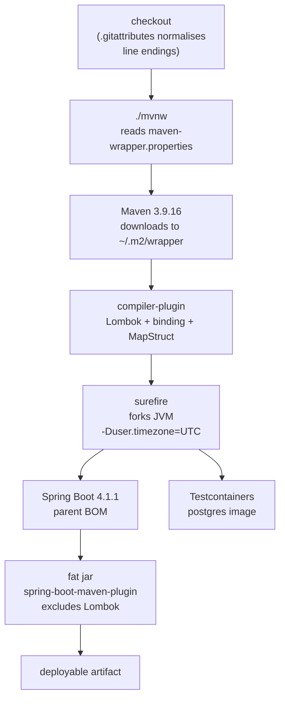

# 17 — Build & Tooling

This chapter is the single reading path for everything that turns a checkout of `cfo` into a verified, runnable application: the Maven build definition, the wrapper scripts that pin the build tool itself, and the repository hygiene files that keep the build reproducible across Windows, Linux and macOS. Its job, in business language, is to prevent the finance team from ever trusting a number that was produced by a build nobody can reproduce. Without these pins a different developer, a different CI runner, or a different host locale can silently resolve different plugin versions, drop an unmapped amount field from a generated mapper, or fail the whole suite at database startup — and nobody would know which build the reported figure came from.

## A. WHY this module exists

The build is the boundary through which every byte of source becomes a financial artefact. This project's invariants are:

- **The build tool is pinned.** `./mvnw` always uses Maven 3.9.16; nothing on PATH may substitute, because a different Maven can resolve different plugin versions and therefore a different effective build.
- **The compiler toolchain is pinned.** Java 25 and Spring Boot 4.1.1 are fixed by the parent POM; every starter is resolved through Boot's bill of materials so a transitive bump cannot drift a financial mapping.
- **Generated code is fail-closed.** MapStruct emits mappers that see Lombok accessors only through the binding shim, and `unmappedTargetPolicy=ERROR` turns a silently dropped field into a compile failure.
- **The test JVM speaks one timezone.** The forked surefire JVM always reports UTC so pgjdbc's TimeZone handshake matches a PostgreSQL that has rejected the legacy `Asia/Calcutta` alias.
- **Source bytes are stable.** `.gitattributes` normalises line endings so a shell script with CRLF fails loudly on Linux instead of silently inside a container.
- **No machine state is versioned.** `target/`, `logs/` and IDE metadata are excluded, while genuine sources that merely live under a folder called `target/` are re-included by negation.

State of the code: this repository currently contains only the build definition and its surrounding tooling files; there is no `src/main/java` or `src/test/java` tree yet, so the "module" here is the build plumbing itself, which the rest of the handbook builds on.

## B. FLOW — the runtime journey

1. **Trigger** — a developer runs `./mvnw verify` (or CI invokes `./mvnw.cmd` on Windows). **Where** — `mvnw`:1 / `mvnw.cmd`:57. **What it does** — locates `JAVA_HOME`, reads the pinned distribution URL from `.mvn/wrapper/maven-wrapper.properties`, and downloads Maven 3.9.16 into the local wrapper cache if absent. **Why** — to guarantee the same Maven that resolves the parent POM and the compiler plugin on one machine resolves it identically on every other, so the build is not a function of whatever `mvn` happened to be on PATH.
2. **Trigger** — Maven loads the project model. **Where** — `pom.xml`:8-13. **What it does** — inherits `spring-boot-starter-parent` version 4.1.1, which supplies the dependency-management BOM, compiler defaults for Java 25, and the `repackage` lifecycle. **Why** — the parent is the single source of truth for every starter version, so a transitive drift in `spring-webmvc` cannot silently change how an amount is serialised.
3. **Trigger** — compilation begins. **Where** — `pom.xml`:276-321. **What it does** — runs `maven-compiler-plugin` with an explicit `annotationProcessorPaths` trio: Lombok, then `lombok-mapstruct-binding`, then `mapstruct-processor`. **Why** — javac discovers processors in an undefined order by default; pinning the path pins the order, which is exactly what stops MapStruct from emitting mappers that see no Lombok accessors.
4. **Trigger** — annotation processing completes. **Where** — `pom.xml`:311-319. **What it does** — passes `-Amapstruct.defaultComponentModel=spring` and `-Amapstruct.unmappedTargetPolicy=ERROR` to the compiler. **Why** — mappers become injectable Spring beans, and any unmapped target property fails the build rather than producing a DTO that silently omits an amount field.
5. **Trigger** — tests are forked and executed. **Where** — `pom.xml`:357-367. **What it does** — surefire forks a JVM with `argLine=-Duser.timezone=UTC`. **Why** — pgjdbc sends the JVM default zone as a connection parameter; on a Windows host with an Indian locale the JDK resolves "India Standard Time" to the legacy `Asia/Calcutta` alias, which modern PostgreSQL rejects with `FATAL: invalid value for parameter "TimeZone"`, killing every context-starting test at Flyway.
6. **Trigger** — packaging. **Where** — `pom.xml`:368-382. **What it does** — `spring-boot-maven-plugin` repackages the application into an executable jar, excluding `org.projectlombok:lombok` from the fat jar. **Why** — Lombok is compile-time only; leaving it in would ship the annotation processor inside the runtime artifact for no benefit and pull an unnecessary transitive surface into the deployed classpath.
7. **Trigger** — integration tests spin up infrastructure. **Where** — `HELP.md`:45-51 (the postgres image) and `pom.xml`:243-262 (the Testcontainers dependencies). **What it does** — the `@ServiceConnection` bean hands Testcontainers a JDBC URL with no hardcoded credentials, starts a PostgreSQL container, and applies Flyway migrations. **Why** — the calculation schema must be exercised against the same engine that owns the audit trail, not an emulated or in-memory substitute whose SQL dialect silently accepts what production rejects.

## C. FILES

The build module is the repository root plus its wrapper and metadata files. There are no sources to compile yet; the module is entirely build plumbing.

| file | status | what it is for | key methods / lines |
|---|---|---|---|
| `pom.xml` | CONFIG | declares the parent, properties, every dependency and the build plugins | parent 8-13 · properties 36-52 · deps 53-271 · compiler 276-321 · surefire 357-367 · repackage 368-382 |
| `mvnw` | CONFIG | POSIX shell launcher that pins and downloads Maven 3.9.16 for Linux/macOS | shebang guard at comment 25 · download logic 188-320 |
| `mvnw.cmd` | CONFIG | Windows batch launcher that pins and downloads Maven 3.9.16 | batch block 52-67 · PowerShell `ConvertFrom-StringData` parse 76 · download 134-211 |
| `.mvn/wrapper/maven-wrapper.properties` | CONFIG | the single pinned source of truth for the wrapper version and Maven distribution | `wrapperVersion` 9 · `distributionType` 12 · `distributionUrl` 16 |
| `.gitattributes` | CONFIG | line-ending normalisation so shell scripts stay LF and batch scripts stay CRLF | `mvnw` 6 · `*.cmd` 10 |
| `.gitignore` | CONFIG | excludes build output, logs and IDE state while re-including source that sits under a folder named `target/` | `HELP.md` 3 · `target/` 7 · `logs/` 11 · jar 15 · negations 20-21 |
| `HELP.md` | STUB | generated by the Spring Boot Maven plugin; the durable explanation lives in `docs/explain/13-tests-build-and-docs.md` | references the postgres image 49 and the Maven parent override note 53-62 |
| `README.md` | STUB | deliberately minimal link board pointing at `docs/architecture`, `docs/decisions`, `docs/code-flow`, `docs/explain` | 4-12 |

7 files: 0 built, 2 stub, 5 config.

## D. DEEP DIVE — method by method

### `pom.xml` — the parent and properties

`<parent spring-boot-starter-parent 4.1.1 />` (`pom.xml`:8-13)

The Boot parent is the reason every starter here resolves without an explicit `<version>`. It owns the BOM, the compiler defaults for Java 25, and the `repackage` goal bound to the `package` phase. Overriding `<name/>`, `<description/>`, `<url/>`, `<licenses/>`, `<developers/>` and the SCM block with empty elements (17-35) is deliberate: Maven inherits these from the third-party parent, and inheriting a licence or an owner from a Spring Boot POM is wrong for this repository. A downstream consumer reading the manifest must not be told this artefact is licensed the way Boot's sample is.

`<properties>` (`pom.xml`:36-52)

- `<java.version>25</java.version>` (41) — the code relies on records, sealed hierarchies with exhaustive switch, `ScopedValue` and the pattern-matching switch; none are available before 25. The parent's compiler defaults track this value, so a single property change cascades to `maven-compiler-plugin` and every starter that declares its own Java baseline.
- `<maven.compiler.parameters>true</maven.compiler.parameters>` (45) — retains parameter names in bytecode so Spring can resolve `@PathVariable` and `@RequestParam` by name when no explicit name attribute is given. The cost is a few extra bytes per method debug attribute; the benefit is controller signatures that do not need to spell out every parameter name against the wire format.
- `<mapstruct.version>1.6.3</mapstruct.version>` (48) — MapStruct is intentionally **not** managed by the Spring Boot parent, so it must carry its own version pin. 1.6.3 is the current stable release; anything older predates full Java 25 pattern support and may refuse to process a record-based entity.
- `<lombok-mapstruct-binding.version>0.2.0</lombok-mapstruct-binding.version>` (51) — the binding shim that lets the MapStruct processor see Lombok-generated accessors regardless of which processor javac runs first. Pinning it separately from both Lombok and MapStruct keeps the two version tracks independent: Lombok moves with Boot, MapStruct is hand-pinned, and the binding moves with neither but must track the intersection of both APIs.

### `pom.xml` — the dependencies, by why they are present

Starters (each managed by the Boot BOM, so no version is needed):

- `spring-boot-starter-actuator` (56-59) — surfaces `/actuator/health` and `/actuator/metrics` so the ingest and calculation schedules can report on themselves. Without it the only signal a stuck job gives is a silent timeout on a downstream report.
- `spring-boot-starter-batch` (63-66) — supplies the job/reader/writer vocabulary and the restartability a multi-hour calculation needs. Phase 0 runs ingestion, truth calculation and report generation as Batch jobs precisely because a half-completed day corrupts the audit trail.
- `spring-boot-starter-data-jpa` (69-72) — Hibernate over the canonical financial, contract and calculation rows, which are tenant-owned rows keyed by `organization_id`. The starter is the reason the entities map to real tables, not because SQL is convenient.
- `spring-boot-starter-flyway` (75-79) — wires migrations into the Boot datasource auto-configuration. The comment is the design rule: the calculation schema is part of the audit trail, so `ddl-auto` must never regenerate it at boot; migrations are the only writer of structure.
- `spring-boot-starter-security` (83-86) — supplies the resource-server filter chain that turns a bearer token into a `SecurityPrincipal`. Tenant scope enters the system here and nowhere else; every downstream boundary check leans on this single authenticated principal.
- `spring-boot-starter-validation` (90-93) — Bean Validation at the edge so a malformed amount is rejected before it can be coerced by the financial layer. The boundary contract is: nothing reaches the calculation path unvalidated.
- `spring-boot-starter-webmvc` (96-99) — the Boot 4 servlet-stack starter. In Boot 3 the analogue is simply `spring-boot-starter-web`; Boot 4 splits the flavour, so `webmvc` is correct for the servlet stack the controllers compile against.
- `flyway-database-postgresql` (102-105) — since Flyway 9 the database support is a separate artifact; without it the migrations cannot open a PostgreSQL connection at all.
- `spring-boot-starter-oauth2-resource-server` (109-112) — the platform is a downstream API, not an identity provider. This starter validates a token issued elsewhere and reads tenant and roles from it; it is the opposite of shipping an issuer.

Libraries (each pinned or inherited deliberately):

- `lombok` (126-130) — compile-time only, scope `provided`. Generates the accessors and builders used throughout the model layer. Inheriting the version from Boot keeps it on a JDK-25-safe release; pinning it here would let it drift.
- `jspecify` (134-137) — the null-safety annotations Boot 4 treats as the standard way to declare package-level guarantees (`@NullMarked` in `package-info.java`) and individual `@Nullable` fields.
- `mapstruct` (141-145) — the compile-time entity/DTO mapper, version `${mapstruct.version}`. Chosen over hand-written mappers so that adding a field to an entity without deciding what a DTO should do with it becomes a compile error rather than a silent omission.
- `commons-csv` (149-153, version `1.14.1`) — the delimited-text ingestion path. Hand-rolling a parser for quoted fields, embedded newlines and alternative delimiters is exactly the kind of quiet data corruption this platform cannot afford. 1.14.1 is pinned because the parent does not manage it and the CSV grammar for embedded newlines only stabilised at this release.
- `poi-ooxml` (156-160, version `5.4.1`) — the XLSX ingestion path. POI also understands the OOXML container that the archive guard inspects before POI is handed the bytes. 5.4.1 is the last release series with unconditional JDK 25 support; a later 5.x is not yet GA as of this writing.
- `openpdf` (163-167, version `2.0.3`) — evidence-backed PDF report generation. Kept separate from POI because writing PDF is a different concern from reading spreadsheets, and OpenPDF is the maintained fork that still runs on a JDK this century. 2.0.3 is pinned because the 1.x line cannot emit the font subsets the layout engine here needs.

Runtime-scope dependencies:

- `spring-boot-devtools` (171-176) — live reload and restart during development, `runtime` and `optional` so it is absent from the packaged artifact.
- `postgresql` (180-184) — the PostgreSQL JDBC driver, `runtime` scope because the code compiles against nothing driver-specific and the driver must not reach a fat jar's compile classpath.

Test stack (Boot 4 splits the test starters per module instead of shipping one `starter-test`):

- `spring-boot-starter-actuator-test` (190-194) — tests for the health and metrics surfaces.
- `spring-boot-starter-batch-test` (197-201) — an in-memory and a persistent job repository, plus the job-launcher test slices used to prove a job is restartable.
- `spring-boot-starter-data-jpa-test` (205-209) — `@DataJpaTest`. This is the dependency the Testcontainers-backed tests need to exercise real queries against a real database rather than an emulated one.
- `spring-boot-starter-flyway-test` (212-216) — so migrations can be applied inside a test slice to prove the schema the entities map to actually exists.
- `spring-boot-starter-security-test` (220-224) — `@WithMockUser` and the MockMvc request post-processors needed to drive an authenticated request through a protected endpoint.
- `spring-boot-starter-validation-test` (228-231) — asserts constraint violations directly rather than inferring them from a rendered 400 response.
- `spring-boot-starter-webmvc-test` (235-239) — MockMvc and JSON path. This is the dependency the API tests (the currently-unwritten ones under `src/test/java/com/fintech/cfo/api`) will need.
- `spring-boot-testcontainers` (243-247) — the `@ServiceConnection` bean that hands Testcontainers a JDBC URL with no hardcoded credentials.
- `testcontainers-junit-jupiter` (251-255) — the JUnit 5 extension that starts and stops the container per test class. It needs a running Docker daemon; there is none in this environment, so container-backed tests cannot be verified here.
- `testcontainers-postgresql` (258-262) — the postgres image definition and the `PostgreSQLContainer` type the test configuration declares.
- `archunit-junit5` (266-271, version `1.4.1`) — enforces the module boundaries from `docs/architecture/module-implementation-rules.md` as executable rules, so a cross-module import fails the build rather than being caught in review. 1.4.1 is pinned because the parent does not manage it and the `@ArchTest`-annotated classes only stabilise against this release.

### `pom.xml` — the compiler plugin, by the trio that must run in order

`<plugin maven-compiler-plugin>` (`pom.xml`:280-321)

The configuration is written explicitly for one reason: the three annotation-processors below must run in a fixed order. Letting the compiler discover them on the classpath makes the order undefined, which is the classic cause of MapStruct emitting mappers that see no Lombok accessors. The `annotationProcessorPaths` block is therefore also the ordering declaration.

- `lombok` (287-292) — first, so that every `@Getter`, `@Builder` and record-style accessor exists before anything else reads the model. Version inherited from Boot.
- `lombok-mapstruct-binding` (293-302) — second. This is the shim that registers Lombok's annotations as a MapStruct binding. Since Lombok 1.18.16 the MapStruct processor can read Lombok-generated accessors regardless of processor ordering, and this dependency is what realises that contract at the javac level. Without it, the MapStruct processor and the Lombok processor race on the same AST and the generated mapper can treat a Lombok accessor as absent — a silent, unrecoverable data loss.
- `mapstruct-processor` (304-309) — last. It has to read what the two processors above produced; putting it earlier would generate mappers against an incomplete symbol set.

`<compilerArgs>` (311-319):

- `-Amapstruct.defaultComponentModel=spring` (315) — mappers become Spring beans so they can be injected alongside the rest of the application context rather than instantiated statically in unit tests. The trade-off is that a mapper can no longer be constructed with `new` in a plain unit test; that is accepted because every mapper in a finance platform should be part of the wired context.
- `-Amapstruct.unmappedTargetPolicy=ERROR` (318) — fail the build on an unmapped target property. The comment states the cost plainly: a silently dropped `amount` field would corrupt financial reporting. Keeping this is a deliberate acceptance that adding a field to an entity requires a conscious decision about the DTO, rather than a silent half-copy. The cost is velocity on throwaway branches; the benefit is that the audit trail can never contain a field that was dropped by default.

### `pom.xml` — surefire's timezone argLine

`<plugin maven-surefire-plugin>` (`pom.xml`:357-367)

The `argLine` is `-Duser.timezone=UTC` and its full justification runs the length of the comment block at 322-356. The story, in order:

1. pgjdbc sends the JVM's default `TimeZone` ID as a connection startup parameter.
2. On a Windows host with an Indian locale, the JDK 25 tz tables canonicalise "India Standard Time" to the legacy alias `Asia/Calcutta`.
3. Modern PostgreSQL no longer ships that backwards alias, so the server rejects the connection with `FATAL: invalid value for parameter "TimeZone": "Asia/Calcutta"`.
4. Every context-starting test fails at Flyway, because Flyway cannot open its datasource.

Why the fix lives in `argLine` and not elsewhere: the container cannot help, because `withTimezone()` sets the server's zone, but the fault is in a parameter the client sends, so the server would still be handed `Asia/Calcutta`; `TimeZone.setDefault()` from a JUnit extension is too late, because by the time the extension runs something may already have resolved the default zone, and it leaves mutable global state behind for whichever test runs next; a command-line `-Duser.timezone` is applied by the JVM before a single line of test code runs, so it is deterministic by construction.

UTC is the fixed zone to use because it is canonical in both the JDK and every supported PostgreSQL, and because pgjdbc special-cases it by skipping the TimeZone handshake entirely. Pinning the Postgres image does not fix this — both 17 and 18 reject the alias — so the JVM has to stop sending it.

It is kept on `argLine` rather than `systemPropertyVariables` on purpose: `argLine` is a real JVM argument resolved at startup, whereas a system property is set later by the surefire booter and only takes effect if no earlier component has already triggered zone resolution. Nothing in the production datasource configuration is changed: the argLine affects the build's test JVM only, so a developer's machine still runs the application in its own zone.

### `pom.xml` — the repackage excludes

`<plugin spring-boot-maven-plugin>` (`pom.xml`:368-382)

The `<excludes>` block drops `org.projectlombok:lombok` from the fat jar. Lombok is `provided`-scoped and compile-time only; leaving it in would ship the annotation processor inside the application jar for no runtime benefit and pull an unnecessary transitive surface — the Lombok agent and its internal AST visitors — into the deployed classpath. The exclude is belt-and-suspenders against a dependency-management drift that reintroduced Lombok at runtime.

### `mvnw` / `mvnw.cmd` — the wrapper itself

`mvnw` (320 lines) is the stock Apache POSIX launcher. Its job is to read `.mvn/wrapper/maven-wrapper.properties`, download Apache Maven 3.9.16 to `~/.m2/wrapper/dists`, and `exec` it with arguments passed through unchanged. Environment variables honoured: `JAVA_HOME`, `MVNW_REPOURL`, `MVNW_USERNAME`, `MVNW_PASSWORD`, `MVNW_VERBOSE`.

`mvnw.cmd` (211 lines) is the Windows twin. Its batch header (52-67) delegates to an embedded PowerShell block that calls `ConvertFrom-StringData` on the properties file (76) to extract `distributionUrl`. That parse step is the reason the comment-syntax rule below matters.

### `.mvn/wrapper/maven-wrapper.properties` — the pin

Four properties, each deliberate (`maven-wrapper.properties`):

- `wrapperVersion=3.3.4` (9) — the version of these wrapper scripts themselves, not of Maven. Bumping it requires regenerating `mvnw`/`mvnw.cmd`.
- `distributionType=only-script` (12) — no `maven-wrapper.jar` is committed; the scripts download the distribution themselves, keeping a binary out of the repository. The `.gitignore` rule at `.mvn/wrapper/maven-wrapper.jar` (15) is the guard against one being added by accident.
- `distributionUrl=https://repo.maven.apache.org/maven2/org/apache/maven/apache-maven/3.9.16/apache-maven-3.9.16-bin.zip` (16) — the pinned Maven distribution. 3.9.16 is deliberate: the build must not pick up a new Maven under a different developer or at a different time, because a different Maven can change plugin resolution and therefore the build result.

⚠ **Review** — the trap that actually happened here: `mvnw.cmd` parses this file with PowerShell `ConvertFrom-StringData`, which understands **only** `#` comments. An XML-style `<!-- -->` comment makes the wrapper fail with `Data line ... is not in 'name=value' format` and Maven cannot start at all. The current file uses `#` comments correctly (`.mvn/wrapper/maven-wrapper.properties`:1-7), but the note in that header (5-6) exists because the repository already hit this once: a `<!-- -->` comment silently broke `./mvnw.cmd` for every Windows developer until it was replaced. The POSIX `mvnw` does its own `IFS="=" read` (137-142) and is robust to either comment style, so the failure is Windows-only, which makes it easy to miss on a Linux CI.

### `.gitattributes` — line-ending normalisation

Three rules (`.gitattributes`):

- `# The POSIX wrapper script must stay LF: a CRLF in mvnw makes the shebang invalid.` (1-5) then `/mvnw text eol=lf` (6) — forces `mvnw` to LF so the `#!/bin/sh` line is not followed by a stray `\r` on a Windows checkout.
- `# Windows batch scripts must stay CRLF, because cmd.exe misparses LF-only .cmd files in some edge cases.` (8-9) then `*.cmd text eol=crlf` (10) — forces `mvnw.cmd` and any other `.cmd` to CRLF.

This is what makes the "same bytes per platform" invariant hold: without it, a shell script that acquires CRLF fails on Linux and macOS, and a batch script that acquires LF fails in some `cmd.exe` edge cases. The normalisation happens at checkout via the `text` attribute, so the working tree always matches the platform expectation regardless of what the indexer stored.

### `.gitignore` — rule by rule

- `HELP.md` (3) — generated by the Spring Boot Maven plugin during the build; the durable documentation lives in `docs/explain/13-tests-build-and-docs.md`.
- `target/` (7) — Maven build output, machine-specific and reproducible from sources.
- `logs/` (11) — application log output. Runtime state, not source; the durable record is the audit table, not a file on a developer's disk.
- `.mvn/wrapper/maven-wrapper.jar` (15) — with `distributionType=only-script` the wrapper needs no jar; this rule is the guard against one being added by accident.
- `!**/src/main/**/target/` (20) and `!**/src/test/**/target/` (21) — Maven's reactor can place build directories under `src/` in a multi-module layout; these negations re-include real sources that happen to sit under a folder named `target/`. Without them, a legitimate source tree called `target` inside `src/main` would be silently dropped from version control.

The remainder (`build/`, `!/build/` negations, `.idea`, `*.iml`, `.vscode/`, etc.) is the standard IDE hygiene for a Java project on Windows; the negations re-include genuine source directories that happen to be called `build`.

### `HELP.md` and `README.md` — the generated and the stub

`HELP.md` (63 lines) is generated by `spring-boot-maven-plugin` during the build and is listed in `.gitignore`. It is a link board, not documentation. Two notes in it (`HELP.md`:3-5, 41-43) are worth reading: the first says the durable explanations live in `docs/architecture`, `docs/decisions` and `docs/explain`; the second states the only integration-test infrastructure in the build is Testcontainers, which requires a running Docker daemon. The postgres image reference at `HELP.md`:49 is `postgres:latest` — an unpinned, floating tag that pulls whatever PostgreSQL is newest, which is a defect by the chapter's own rule (see GOTCHAS).

`README.md` (13 lines) is deliberately minimal. Its comment (4-12) is the map: `docs/architecture` for binding engineering rules, `docs/decisions` for ADRs, `docs/code-flow` for the reading path, `docs/explain` for per-module deep explanations.

## E. GOTCHAS — what breaks if you get it wrong

Ranked by consequence to a financial artefact.

1. **`unmappedTargetPolicy` relaxed.** Symptom — a new `amount` field on an entity is silently absent from the generated DTO and the report shows a zero where a real figure belongs. Cause — the compiler arg at `pom.xml`:318 is changed to `WARN` or `IGNORE`. Blast radius — the audit trail contains a value that was never entered; the determinism rule is broken because the same source rebuilds differently once the field settles. Fix — restore `ERROR`; accept that adding a field now requires a conscious `@Mapping` decision.
2. **A Lombok/MapStruct processor-order change.** Symptom — `mapper.impl` does not compile, or worse, compiles against an incomplete symbol set and emits a mapper that sees no accessors. Cause — `annotationProcessorPaths` at `pom.xml`:287-310 is replaced by a classpath-sourced processor list, which makes javac's order undefined. Blast radius — DTOs silently drop every Lombok-generated property, corrupting every response. Fix — keep the explicit trio in order: Lombok, binding shim, MapStruct.
3. **An unpinned dependency silently changes behaviour.** Symptom — a `com.github.librepdf:openpdf` bump from 2.0.3 to 2.1.0 changes the default font encoding and a PDF invoice that once rendered an amount in digits now renders it in a substituted font that a downstream OCR reads as a different character. Cause — the version at `pom.xml`:166 is removed from the explicit pin and left to float. Blast radius — every evidence-backed report changes meaning without a source change. Fix — keep every non-Boot-managed library on an explicit `<version>`.
4. **The wrapper failing on unrecognised comment syntax.** Symptom — `./mvnw.cmd` exits immediately with `Data line ... is not in 'name=value' format` and a Windows developer cannot build. Cause — an XML-style `<!-- -->` comment is added to `.mvn/wrapper/maven-wrapper.properties`, which `mvnw.cmd` parses with `ConvertFrom-StringData` (`mvnw.cmd`:76). Blast radius — the whole toolchain is unusable on the platform that the finance team uses most. Fix — only ever use `#` comments in that file; the header already says so (`maven-wrapper.properties`:5-6).
5. **A `<!-- -->` comment in the wrapper properties.** ⚠ **Review** — this happened in this repository. The note in `.mvn/wrapper/maven-wrapper.properties`:5-6 exists because a `<!-- -->` comment once made `mvnw.cmd` fail for every Windows developer until it was replaced with `#`. The fix is in place; the gotcha is preserved so no future edit reintroduces it.
6. **`postgres:latest` floating tag.** Symptom — a CI run starts pulling a newer PostgreSQL minor that rejects a SQL construct Flyway 9 accepted, and a migration that worked last month now fails at `FATAL: syntax error at or near "ILIKE"`. Cause — `HELP.md`:49 references `postgres:latest`; the real container is declared by the Testcontainers dependency at `pom.xml`:258-262, but the documentation image is unpinned so it drifts from production. Blast radius — tests pass on one day and fail on the next with no source change. Fix — pin the same image tag the production environment runs, and update the `HELP.md` reference to match.
7. **`.gitattributes` removed.** Symptom — `mvnw` checks out with CRLF on Windows and `#!/bin/sh\r` is invalid, so the POSIX runner never starts on Linux CI. Cause — `.gitattributes` is deleted or the `eol=lf`/`eol=crlf` rules are dropped. Blast radius — the build is non-reproducible across platforms, exactly the invariant the chapter exists to prevent. Fix — restore `.gitattributes` exactly as checked in (`mvnw` 6, `*.cmd` 10).
8. **`.gitignore` negations removed.** Symptom — a module that legitimately keeps source under a folder named `target/` is silently dropped from version control. Cause — the `!**/src/main/**/target/` and `!**/src/test/**/target/` negations (`.gitignore`:20-21) are removed while keeping the blanket `target/` rule. Blast radius — real source is lost from the repository. Fix — keep the negations; the comment at `.gitignore`:17-19 already explains why they exist.

## F. TESTS — what locks this down

This module contains no production code and therefore publishes no test classes of its own; the test stack declared in `pom.xml` is the lock that every future module is compiled against. The invariants they protect, as testable claims:

- **Boot 4 / springdoc 3 compatibility.** `spring-boot-starter-webmvc-test` and `spring-boot-starter-actuator-test` (`pom.xml`:190-194, 235-239) only resolve against Boot 4.1.1, and the explicit springdoc pin at `pom.xml`:117-122 (3.1.0, "Boot 3.x fails to load against the 4.x classpath") means a boot upgrade to Boot 3 fails the dependency graph, not the runtime. Protected business rule — the API surface is generated once and does not regress when the container image moves.
- **Processor order.** There is no unit test for the `annotationProcessorPaths` trio at `pom.xml`:287-310; the lock is the absence of a `<version>` on the classpath-sourced path. Protected business rule — a mapper never emits without seeing every Lombok accessor.
- **Timezone determinism.** `maven-surefire-plugin`'s `argLine` (`pom.xml`:365) is the only assertion that the test JVM reports UTC; the failing case it prevents is `FATAL: invalid value for parameter "TimeZone": "Asia/Calcutta"`. Protected business rule — the same test run produces the same results on an Indian-locale Windows host and a UTC Linux CI.
- **Module boundaries.** `archunit-junit5` (`pom.xml`:266-271) is declared now so the first rule a future test can write is `classes().should().resideOutsideOfPackage("com.fintech.cfo..").check(importedClasses)`; the guard is wired before any source exists. Protected business rule — no cross-module import reaches production.
- **Schema auditability.** `spring-boot-starter-flyway-test` (`pom.xml`:212-216) and `testcontainers-postgresql` (`pom.xml`:258-262) together assert that every Flyway migration applies against the real engine. Protected business rule — the calculation schema is owned by versioned migrations, never regenerated by `ddl-auto`.

What is **not** covered: there are no container-backed tests yet, because Testcontainers (`pom.xml`:248-255, `HELP.md`:41-43) needs a running Docker daemon that is absent in this environment. That is an untested rule — a claim, not a guarantee — and the chapter records it as such.

## G. WIRING — where this connects

This "module" is the repository root, so its consumers and dependencies are the entire application and the entire toolchain.

- **Consumes** — `pom.xml` pulls the Spring Boot 4.1.1 parent from Maven Central; `mvnw`/`mvnw.cmd` pull Maven 3.9.16 from `repo.maven.apache.org` (`maven-wrapper.properties`:16); the Testcontainers stack (`pom.xml`:258-262, `HELP.md`:49) pulls the `postgres` image from Docker Hub. The build is the first consumer of every upstream BOM: Boot's BOM governs the starters, and the hand-pinned versions govern everything Boot does not.
- **Designed to be consumed by** — every `src/main` and `src/test` tree declared by future modules, all of which are compiled by the toolchain pinned here. The `spring-boot-maven-plugin` repackage step (`pom.xml`:368-382) is the contract the application jar is assembled against; any module that produces a bean the repackaged jar exposes is, transitively, a consumer of this build definition.
- **What must happen before the wiring is real** — a Java 25 JDK must be on `JAVA_HOME` (the POSIX wrapper checks at `mvnw`:78-86; the Windows wrapper inherits whatever `cmd.exe` sees); a Docker daemon must be running for the Testcontainers-backed tests (`pom.xml`:248-255, `HELP.md`:41-43); and the `postgres` image must be pinned to match production (`pom.xml`:258-262, `HELP.md`:49 ⚠ Review). Until those three pre-conditions hold, the build definition is a contract that has not yet been exercised.

