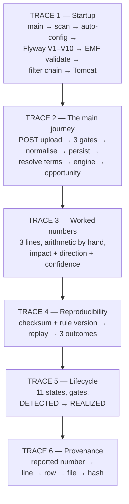

# 18 End-to-end traces — the six paths through the whole system

> The chapter that ties the handbook together. Every other chapter explains one
> module in isolation; this one walks the **paths** — what actually runs, in what
> order, calling which method, and — critically — **where each path stops today**.
>
> Read this after 01 (boot and boundaries), 10-ingestion-deep, 12-contract-kernel-deep,
> 08 (truth engine) and 10-opportunity. It assumes their vocabulary; it does not
> repeat their arithmetic.
>
> Scope: no single module owns this chapter. The traces span `platform`, `ingestion`,
> `financial`, `contract`, `financialtruth`, `opportunity` and `evidence`. Line
> numbers refer to the working tree at the time of writing.

---

## A. WHY this module exists

A finance director's question is never "what does the parser do". It is *we were
overcharged 4.2 lakhs on the March supplier invoice — show me exactly which line, which
contract clause, and prove you can arrive at the same number again in six months*. Every
module in this system is a component of one answer to that question, and a component
that is not connected is worse than one that is missing, because a reader who has seen
one honest trace and one silence knows something is wrong.

This chapter therefore exists to do three things no per-module chapter can:

1. **Show the wiring that is real, in the order it happens**, with `file:method` at
   every step so a reader can jump to the code rather than trust the prose.
2. **Mark every seam honestly.** A trace that reads as continuous when it is three
   islands and a `[PLANNED]` is a lie told with good intentions. The rule this chapter
   follows without exception: *never describe unimplemented behaviour as though it
   runs.*
3. **Give a reader a number they can reproduce by hand** (Trace 3), because a
   "deterministic engine" nobody can check on paper is just an assertion.

**Hard invariants these six traces depend on:**

- **The stage order is the security property.** No parser may see unrefuted bytes, and
  no row may be trusted before it was validated. Every trace below respects that order
  even where the later stages are `[PLANNED]`.
- **A run's identity is its inputs, not its clock.** `inputChecksum` and `ruleVersion`
  are captured before any figure exists (`CalculationRunService.start`), so even a
  *failed* run is replayable.
- **Every reported figure names its source row and the contract versions evaluated.**
  A monetary figure with no way back to the bytes that produced it is not shippable.
- **A monetary claim is never made without a human.** `OpportunityStatus
  .carriesMonetaryClaim()` is false for `DETECTED` and `EVIDENCED` only.
- **The account of an upload is total**: `accepted + rejected + skipped == total`, and
  the status (`COMPLETED` vs `COMPLETED_WITH_REJECTIONS`) is *derived* from those
  lists, never chosen by a caller (`IngestionService.java:120-125`).
- **The boundary rule holds**: no business module imports another business module.
  Cross-module exchange is through shared value types and consumer-owned ports.

---

## B. FLOW — the six traces at a glance



Read them in order: Trace 1 is the room the process lives in, Trace 2 is the spine,
Trace 3 is the proof the spine produces the right number, Traces 4–6 are the three
questions an auditor will ask about any number that spine produces.

---

## TRACE 1 — Startup: from `main` to a listening port

**Trigger** — `java -jar cfo.jar --spring.profiles.active=prod`.

1. **JVM entry → `CfoApplication.main(String[] args)`** — `CfoApplication.java:86`.
   **What** — forwards `args` to `SpringApplication.run` and *discards* the returned
   context. **Why** — in a servlet application the running context **is** the JVM's
   lifetime; holding a static reference would only expose a `close()` hook that could
   fire while a request is in flight. Keeping `args` is what lets `--spring.profiles.active`
   and `CFO_DB_URL` reach the `Environment` before any bean is built.

2. **Scan root fixed by the class's own package** — `@SpringBootApplication`,
   `CfoApplication.java:61`. **What** — `@ComponentScan` discovers every
   `@Component`/`@Service`/`@Repository`/`@RestController`/`@Configuration` under
   `com.fintech.cfo`. **Why** — the annotated class's package *is* the scan root, so
   the directory layout is the module layout and "add a module" is "add a package".
   ⚠ Stub controllers register as inert beans: `IngestionController.java:24-26` is an
   empty class, so the *web entry point* for Trace 2 does not exist even though every
   stage beneath it does.

3. **Typed configuration bound once, at refresh** —
   `@ConfigurationPropertiesScan`, `CfoApplication.java:62` →
   `platform.config.ApplicationProperties:33` (prefix `cfo.application`).
   **Why here** — binding at refresh rather than `@Value` at the point of use is what
   stops a config change rippling into a service and a half-applied value from going
   unobserved. ⚠ It is the *only* binder: `cfo.ingestion.*`, `cfo.storage.*`,
   `cfo.idempotency.ttl` and `cfo.async.*` are declared in `application.yml` and read
   by nothing (`IdempotencyService` hard-codes `DEFAULT_TTL = 24h`).

4. **Auto-configuration contributes infrastructure** — conditional on classpath and on
   the app not supplying its own bean: HikariCP `DataSource` (pool 20/5, 30 s timeout),
   Flyway (`classpath:db/migration`, `baseline-on-migrate=true`), JPA
   `EntityManagerFactory` (`ddl-auto: validate`, `time_zone: UTC`), Jackson
   (`USE_BIG_DECIMAL_FOR_FLOATS`, `JacksonConfig.java:38`), the actuator endpoints,
   Spring Security's auto-configured chain, and embedded Tomcat.

5. **Flyway runs V1 → V10, in order, before Hibernate looks at anything** —
   `db/migration/`, ten files:
   `V1__create_organizations` (tenant root), `V2__create_users_roles`,
   `V3__create_ingestion`, `V4__create_financial_data`, `V5__create_contracts`,
   `V6__create_calculations`, `V7__create_evidence_lineage`, `V8__create_opportunities`,
   `V9__create_value_tracking`, `V10__create_audit`.
   **Why the order matters** — the schema is owned by SQL, not by objects. Flyway
   creates; Hibernate only validates. A migration that drifts from an entity therefore
   fails the *boot*, not a quarter-end close.

6. **EntityManagerFactory validation** — every `@Entity` is compared against the
   migrated schema. There are exactly two: `platform.audit.AuditEventEntity` and
   `platform.idempotency.IdempotencyRecord` (V10). The canonical drift guard is
   `IdempotencyRecord.requestFingerprint` — V10 declares it `CHAR(64)`, so the entity
   must say `@JdbcTypeCode(SqlTypes.CHAR)` **and** `columnDefinition = "char(64)"`
   (`IdempotencyRecord.java:94-95`) or the context refuses to start with *found
   [bpchar], but expecting [varchar(64)]*.
   **Why this is a boot gate, not a test** — the entity/migration pair is the only
   proof surface the schema has, and the only two entities in the system are proof that
   the discipline holds.

7. **Bean post-processors wire the cross-cutting advisors** — `@EnableAsync`
   (`AsyncConfig.java:42`) installs a `VirtualThreadTaskExecutor`;
   `@EnableTransactionManagement` (`TransactionConfig.java:18`);
   `@EnableJpaAuditing` (`JpaConfiguration.java:39`), whose auditor yields the
   authenticated caller id or *empty* for scheduled work (`JpaConfiguration.java:53-61`).

8. **Filter chain order — the four ordered values, and why each is where it is:**

   | # | filter | order value | why here |
   |---|---|---|---|
   | 1 | `CorrelationIdFilter` | `@Order(Ordered.HIGHEST_PRECEDENCE)` = `Integer.MIN_VALUE` (`CorrelationIdFilter.java:61`) | Must mint/validate the id before anything can log it, and must stamp the response header on **every** path including error and security rejections. It resolves from `X-Correlation-ID` only if it matches `^[A-Za-z0-9._-]+$` and is ≤ 64 chars (`CorrelationIdFilter.java:83-95`); anything else is replaced rather than trusted — a caller-supplied string ends up in the MDC and in logs. |
   | 2 | `RequestLoggingFilter` | `@Order(Ordered.HIGHEST_PRECEDENCE + 1)` = `MIN_VALUE + 1` (`RequestLoggingFilter.java:52`) | Reads the MDC the previous filter wrote, times the whole request, and logs once in `finally` — one line per request, always paired with its correlation id. `MIN_VALUE + 1` (not `MIN_VALUE + 2`) because nothing else claims the slot and leaving a gap invites a filter to be inserted *above* the logger, which is how a request gets logged with no id. |
   | 3 | Spring Security `SecurityFilterChain` | `-100` (`SecurityProperties.DEFAULT_FILTER_ORDER`) | Runs after the id exists so an authentication failure is still traceable, and before anything that reads the principal. ⚠ **There is no application-defined chain**: `identity` is 30/30 stub with no `SecurityConfig` and no `TenantContextFilter`, so Boot's *default* auto-configured chain applies and `CFO_OIDC_ISSUER_URI` defaults to empty — **tenant scope is not actually resolved from a verified JWT today.** |
   | 4 | `IdempotencyFilter` | **no `@Order`** (`IdempotencyFilter.java:42-43`) → Boot's default `Ordered.LOWEST_PRECEDENCE` | It must run *after* security, because an idempotency key is only meaningful inside a tenant and a replayed body must be stored against a resolved principal. ⚠ That ordering is **accidental, not declared**: it holds only because `LOWEST_PRECEDENCE` is a large number. An explicit `@Order(SecurityProperties.DEFAULT_FILTER_ORDER + 1)` would make the intent survive a future filter that also defaults low. Its `shouldNotFilter` skips safe methods and keyless requests (`IdempotencyFilter.java:96`), so the response is buffered only when a key was supplied. |

   The MDC entry is removed in a `finally` (`CorrelationIdFilter.java:128-131`) — servlet
   threads are pooled and would otherwise inherit the previous caller's id.

9. **Tomcat binds the port and serves on virtual threads** —
   `server.port` defaults to `${CFO_SERVER_PORT:8080}`; with
   `spring.threads.virtual.enabled=true` the real concurrency ceiling is the Hikari
   pool (20), not a thread count. ⚠ A `synchronized` hot path pins virtual threads to a
   carrier; keep critical sections lock-free.

10. **Readiness before traffic** — `/actuator/health/liveness` and `/readiness` report
    `DOWN` until Flyway and EMF validation complete, so a pod is not routed to until its
    schema and mappings agree. `show-details: never` keeps a failing component from
    naming the dependency that is down.

**What stops here:** nothing. Trace 1 is genuinely complete — with the two ⚠ above
(identity chain, unbound config blocks) being real gaps rather than missing stages.

---

## TRACE 2 — The main journey: CSV upload → filed opportunity

This is the spine. It is 14 stages; **four of them are `[PLANNED]` and the trace
therefore does not reach a filed opportunity today.** Each stage states where the path
stops and why.

1. **HTTP POST `/api/v1/ingestions`** — **Trigger:** a multipart upload.
   **Where:** `[PLANNED]` `ingestion.controller.IngestionController` — the file is 26
   lines: a Javadoc contract and `// TODO: Implement IngestionController.`
   (`IngestionController.java:19-26`). **What it would do:** map `MultipartFile` to
   `IngestionRequest`, resolve the tenant from the authenticated principal, wrap the
   result in `platform.web.ApiResponse`. **Why `[PLANNED]`** — nothing in the module
   carries a Spring annotation, so the whole flow below is reachable only from a test
   or a batch job today. This is seam #1.

2. **Correlation id** — **Where:** `CorrelationIdFilter.doFilterInternal`,
   `CorrelationIdFilter.java:115`. **What:** validates or mints `X-Correlation-ID`,
   puts it in the request attribute, the MDC and the response header.
   **Why first** — every later stage's log line, and any error the client is shown,
   must be findable by one id. An idempotent retry must *reuse* the id, not mint a new
   one, or the retry cannot be told from the original.

3. **Upload authorisation** — **Where:** `FileSecurityService.admit`,
   `FileSecurityService.java:81`, delegating to
   `UploadAuthorizationService.isAuthorized`, `UploadAuthorizationService.java:42`.
   **What:** checks the caller holds `ingestion:upload` **and** that
   `principal.organizationId().equals(targetOrganization)`.
   **Why two checks and not one** — passing the authority without the tenant match is
   the classic cross-tenant leak (`UploadAuthorizationService.java:12-16`). The gate
   reports `ACCESS_DENIED` rather than a file problem, so an audit can tell "this user
   may not upload" from "this file is bad". ⚠ The principal it reads comes from
   `shared.security.SecurityPrincipal`, which at runtime is empty because the JWT chain
   is a stub — so this stage is *correct and inert* today.

4. **Malware / dangerous-signature screen** — **Where:**
   `FileUploadSecurityService.screen`, `FileUploadSecurityService.java:50`, calling
   `MalwareScanService.scan`, `MalwareScanService.java:47`.
   **What:** refuses PE (`MZ`), ELF, Mach-O, Java class, OLE2, PDF, `#!` shebang, and
   any file with a NUL byte in the first 4 KB. **Why before parsing** — this is the
   check that stops a renamed payload reaching POI or commons-csv. ⚠ It is explicitly
   **not antivirus** (class Javadoc `:10-15`): no signature database, no engine, no
   network. It closes the "renamed payload" path and no more. Findings name the
   signature only; the bytes are never echoed into a log.

5. **Filename sanitise** — **Where:** `FilenameSanitiser.sanitise` (278 lines), called
   at `FileUploadSecurityService.java:66`. **What:** traversal is *refused*, not
   stripped, by `containsTraversal` (`FileUploadSecurityService.java:92-109`: NUL byte,
   leading `/`, a `://` scheme, or any `..` segment). **Why refuse rather than strip** —
   a genuine browser upload is a leaf name; a name with a directory component is an
   attempt to influence where bytes land, and the attempt is worth recording. What
   survives is a `SanitisedFilename`, and the raw string never leaves the class as
   anything but an audit string. A *normalised* (not refused) name raises a
   `WARNING` finding and the file still passes.

6. **Content sniff and the four-claim agreement gate** — **Where:**
   `UploadFileValidator.validate`, `UploadFileValidator.java:27`, calling
   `ContentSniffer.sniff`, `ContentSniffer.java:57`. **What:** compares extension,
   declared content type, sniffed bytes and size, and requires the first three to agree.
   **Why** — a file named `ledger.csv` whose first two bytes are `PK` is a ZIP archive,
   not a ledger. Three deliberate leniencies: `application/octet-stream` is treated as
   *unspecified* rather than as a lie (browsers send it for honest uploads,
   `UploadFileValidator.java:20-23`); a ZIP is only accepted when the name already
   claims XLSX, so the sniff confirms rather than overrides (`:64-69`); and the
   plausibility scan tolerates 1 % stray control characters
   (`ContentSniffer.java:139-141`) rather than refusing a whole export over one.

7. **Checksum captured here** — **Where:** `FileSecurityService.java:101`,
   `FileChecksum.sha256(content)`, recorded into `UploadMetadata` as
   `FileSecurityStatus.PASSED`. **Why here and not later** — it must be the digest of
   the bytes that *passed*, not of a re-read of a stream that may since have changed
   (`FileSecurityService.java:40-43`). This is the same class of commitment as the
   calculation input checksum, three stages later.

8. **Gate 1 outcome** — **Where:** `IngestionService.ingest`, `IngestionService.java:73-84`.
   **What:** a refusal returns `REJECTED` at stage `FILE_SECURITY_VALIDATION` with
   **zero rows explicitly reported**, and the parser is never constructed.
   **Why** — a refused upload must not be able to look like a run that read a file and
   found nothing in it. The `Admission` result is a `sealed interface permits Admitted,
   Refused` (`FileSecurityService.java:117`) precisely so a caller cannot treat a
   refusal as a pass by forgetting an `if`.

9. **Parse** — **Where:** `IngestionOrchestrator.parse`, `IngestionOrchestrator.java:72`
   → `CsvFileParser.parse`, `CsvFileParser.java:89`. **What:** reads the stream, decodes
   it (`TextDecoding`), tokenises, locates the header within `limits.headerScanWindow()`
   (`resolveHeaderIndex`, `:247`), records the **raw** header *before*
   `HeaderDetector.normalise` rewrites repeats to `name_2` (`:147-148`), then walks
   rows. **Why the raw header is kept** — the schema gate must still be able to see that
   a column was labelled twice. Parser selection is an `EnumMap<FileType, FileParser>`
   built at construction (`:50-59`), so no parser can be reached for a type it did not
   claim, and two parsers claiming one type fail at construction rather than in
   production. Row accounting is closed here: blank → `skipRows(1)`, over the 200 k cap →
   `PARTIAL` with a `LIMIT_EXCEEDED` finding and a stated reason (`:183-189`), bad row →
   `RejectedRow`. **Nothing vanishes**: `materialise` (`:217`) returns *exactly one* of
   a row or a rejection.
   `[PLANNED]` — the result is **never persisted**: `IngestionRepository`,
   `SourceFileRepository` and `IngestionErrorRepository` are all 20-line stubs, and
   `ingestion.model.SourceFile` / `SourceRecord` are 64- and 52-line records with no
   writer. Seam #2.

10. **Schema gate** — **Where:** `FileValidationService.validateSchema`,
    `FileValidationService.java:103` → `SchemaValidator.validate`,
    `SchemaValidator.java:30`. **What:** reports `MISSING_REQUIRED_COLUMN` per missing
    required column and `DUPLICATE_COLUMN` per repeated header cell, all as
    *file-level* findings. **Why file-level** — if a required column is absent, every
    row lacks it; refusing 200 000 rows with the same message hides the one fact the
    operator needs. Rows are still validated after a schema failure
    (`FileValidationService.java:173-176`) so an analyst sees everything wrong in one
    pass rather than one problem per retry.

11. **Row gate** — **Where:** `FileValidationService.validateRows`,
    `FileValidationService.java:118`. **What, per row:** formula-injection sanitise
    (`FormulaInjectionSanitiser`, plus bidirectional/format-character removal), then
    `RequiredFieldValidator`, `DataTypeValidator`, `DataQualityValidator` (including
    `date <= asOfDate`, currency allowlist, limits); first blocking finding → reject;
    then entirely-blank → reject as `BLANK_ROW`; then `DuplicateValidator.check` → reject;
    else accept. **Why the row that is accepted is the *sanitised* row** — the raw one
    never leaves `sanitise` (`:182-206`), which is why the sanitised rows travel inside
    the `ValidationResult` rather than being recomputed by the caller.

12. **Accounting closes** — **Where:** `IngestionService.validated`,
    `IngestionService.java:108-126`. **What:** `acceptAll` + `rejectAll` + `skipRows`,
    and `IngestionProcessingResult.build()` *derives* `COMPLETED` vs
    `COMPLETED_WITH_REJECTIONS` from the two lists. **Why derived, not chosen** — a
    caller that could pick the status could pick `COMPLETED` over a run that threw away
    40 % of its rows. A `PARTIAL` parse keeps its rows **and** its `failureReason`
    (`:113-118`): rows recovered from a partly-read file are usable, but the run must
    not claim the file was seen in full.

    **⬛ THE TRACE STOPS HERE.** `acceptedRows` is a list of `ParsedRow` in memory.
    Nothing normalises them into `financial`, nothing resolves a customer, nothing is
    written. The next four stages are `[PLANNED]`.

13. **Dedupe / normalise / persist rows** — `[PLANNED]`. **Where it would be:**
    `financial.normalization.FinancialDataNormalizer` (`:47`, an empty class whose
    Javadoc at `:18-35` already specifies the order), then
    `financial.service.InvoiceService` (`:43`, also empty). **What is built and
    reusable today:** `EntityResolutionKey` (`financial/normalization/
    EntityResolutionKey.java:27-65`) — `(organizationId, sourceSystem, externalId)`
    with a `of(...)` factory that rejects blank components; the four per-entity
    normalizers (`CustomerNormalizer`, `ProductNormalizer`, `InvoiceNormalizer`); the
    MapStruct mappers (`InvoiceMapper.java:24`, which already carry `sourceFileId`,
    `sourceRowNumber` and `sourceRecordId` through from `invoice.source` —
    `InvoiceMapper.java:85-87`, `:113-117` — this is the lineage Trace 6 walks); and
    the `financial` model records (`Invoice.java`, `InvoiceLine.java`, `Customer.java`,
    `Product.java`) and enums. **What is missing:** the facade, the service, the five
    repositories, and the three controllers — all stubs. **Why the identity decision
    must come first** — the facade's contract requires the customer's
    `EntityResolutionKey` to be resolved *before* its invoices, so a line is never
    charged to a customer that may turn out to be a duplicate; and why it must hold no
    state across calls — a partially failed import that influenced the next batch's
    identity decision would permanently mis-assign the rows it did write.

14. **Resolve contract terms for the invoice date** — `[PLANNED]` as a *call*; the
    resolution logic itself is **BUILT** and unit-tested. **Where:**
    `contract.service.ContractService.pricingTermInForce`,
    `ContractService.java:77` → `EffectiveTermResolver.inForceOn`,
    `EffectiveTermResolver.java:97` → `TermSelector.selectInForce`,
    `TermSelector.java:72`; and `ContractService.discountTermInForce:102` →
    `DiscountService.evaluate`, `DiscountService.java:104`. **What it does:** filters
    terms to those whose `EffectiveWindow.contains(invoiceDate)`, ranks candidates by
    *specificity then version* (`TermSelector.java:77-96` — a product-scoped term
    beats a customer-scoped one beats a contract-wide one, and a higher `termVersion`
    wins at equal specificity), and re-checks the window in `evaluate` even though the
    selector already filtered on it (`DiscountService.java:119-124`) because `evaluate`
    is public and can be called with a hand-picked term. **Why currency filtering is
    per-candidate and not per-lookup** — a fixed-amount discount denominated
    elsewhere would need an FX rate this module does not have, so it is *skipped* and
    the next candidate considered rather than failing the whole lookup
    (`ContractService.java:107-112`). **What is missing:** all four
    `contract/repository/*` files are 10-line stubs, and the three
    `contract/controller/*` files are 10-line stubs. The engine needs a *list* of terms
    in force; nothing fetches that list from storage. Seam #3.

15. **Run the financial truth engine** — **BUILT**, callable today from a
    `CalculationService` call or a unit test. **Where:**
    `CalculationService.calculate`, `service/CalculationService.java:45` →
    `FinancialTruthEngine.calculate`, `calculator/FinancialTruthEngine.java:131`.
    **What:** reads the clock **once** (`:139`), computes the rule-set fingerprint
    (`:140`), loops the lines building a per-line `RuleContext` (`:149-155`) closed
    over that line, the as-of date, the line currency and the terms in force, evaluates
    every registered rule, records a `CalculationResult` row for **every** rule
    including the non-claiming ones, then `combineLine` (`:217`) and
    `ImpactAggregator.aggregate` (`:185` → `ImpactAggregator.java:76`).
    **Why the context is per-line** — a rule therefore cannot see another line, which
    is what makes per-line results independent and the whole run order-insensitive.
    **Why non-claiming rules are recorded** — omitting them makes "checked and found
    nothing" indistinguishable from "never checked". The input it consumes is
    `financialtruth.model.InvoiceLineInput` (`:20`), a **consumer-owned DTO** — which
    is how the module-boundary rule is honoured: `financialtruth` never names
    `financial`'s `InvoiceLine`. The assembler that maps `financial.InvoiceLine` →
    `InvoiceLineInput` is exactly what the integration milestone must supply. Seam #4.

16. **Classify the variance** — **BUILT**: the sign convention and the direction are
    computed, not supplied. `VarianceCalculator.variance`,
    `calculator/VarianceCalculator.java:56` produces `actual − expected` (positive = the
    customer was overcharged), and `ImpactDirection.of(BigDecimal)` derives the
    direction from the sign. `VarianceCalculator.assertReconciled:88` proves
    `netVariance == pricingVariance − discountVariance` whenever the decomposition is
    provable. **Why the direction is derived** — a supplied direction is a supplied
    opinion, and a sign convention that can be set by the caller is not a convention.

17. **Raise an opportunity** — `[PLANNED]`, and the seam is the widest in the system.
    **What is built:** `FindingDraft` (`model/FindingDraft.java:27`) and
    `AffectedTransactionRef` (`model/AffectedTransactionRef.java:42`) — the two
    *caller-supplied input forms*, carrying no id, no tenant and no timestamp, precisely
    so a detection pass cannot write rows into a tenant it was not asked about;
    `OpportunityImpact.from(ref, id, organizationId, opportunityId, createdAt)`
    (`model/OpportunityImpact.java:95`) — the one place identity and tenancy are
    *assigned* by the module; `CalculationReference` (`model/CalculationReference.java:46`)
    — refuses to exist without run id, rule code, rule version, input checksum and
    evaluated-at; and the 11-state graph. **What is missing:** `EconomicOpportunity`
    itself is an empty class (`model/EconomicOpportunity.java`), and
    `OpportunityDetectionService`, `OpportunityValidationService`,
    `OpportunityLifecycleService`, `OpportunityReviewService`, `OpportunityService`,
    all three repositories and all three controllers are stubs. The detection service
    must call `OpportunityType.isComponentOfPayableDeviation()`
    (`enums/OpportunityType.java:75`) before summing anything into a headline — and
    today **that method has no callers at all**, so the rule it exists to make
    checkable (a portfolio total may only sum payable-deviation records) is unenforced.
    Seam #5.

**Where the spine ends today, in one sentence:** bytes are admitted, parsed and
validated in memory with a full, defensible audit trail; and a `CalculationInput` can
be built, run and replayed with a full, defensible proof — but **no code connects the
two halves**. There is no `ParsedRow → InvoiceLineInput` assembler, no repository that
reads contract terms out of V5, and no detector that turns a `FinancialImpact` into an
opportunity. Four of the six seams are a handful of consumer-owned DTO mappings each;
the reason the trace is broken is that the integration milestone has not been written,
not that any individual piece is missing.

---

## TRACE 3 — A worked numeric example, end to end

The single most useful thing in this handbook: a reader should be able to reproduce the
engine's answer with a pencil.

**The contract** (INR, in force 2024-01-01 → 2024-12-31, `termVersion` 1):

| product | pricing term | discount term |
|---|---|---|
| `SKU-A` | fixed unit price **100.00** (`PT-A`) | — |
| `SKU-B` | fixed unit price **50.00** (`PT-B`) | — |
| `SKU-C` | fixed unit price **200.00** (`PT-C`) | **10 %** (`DT-C-10`) |

**The invoice** — invoice date = as-of date = **2024-03-15**. Tax is 0.00 on every line,
which is deliberate: tax is a pass-through read from the *actual* side and used for both
(`FinancialTruthEngine.java:237-239`), so it cancels out of the variance and would only
obscure the arithmetic here.

| line | product | qty | invoiced unit price | discount granted |
|---|---|---|---|---|
| 1 | `SKU-A` | 100 | **110.00** | 0.00 |
| 2 | `SKU-B` | 40 | 50.00 | 0.00 |
| 3 | `SKU-C` | 10 | 200.00 | **0.00** |

**The policy, applied at every step** (`model/RoundingPolicy.java:43-61`):
quantity and unit price are normalised to **6 dp**; the multiply is performed in
`BigDecimal` (so it carries up to 12 dp) and cut to **4 dp `HALF_UP` exactly once**
(`roundUnitPrice:87`, `roundQuantity:82`, `round:77`). A percentage rate is divided by
100 to **10 dp** (`DISCOUNT_RATE_SCALE`), *not* to 4 dp, and the multiply is rounded once
at the end (`ExpectedAmountCalculator.java:117-122`).

### Line 1 — an overcharge against a fixed unit price

```
expected gross = round4(100.000000 x 100.000000) = round4(10 000.000000) =  10 000.0000
actual gross   = round4(110.000000 x 100.000000) = round4(11 000.000000) =  11 000.0000
pricing variance = actual - expected                                   =  + 1 000.0000
discount rule   : appliesTo == false (no discount term in force for SKU-A on 2024-03-15)
                  -> row recorded NOT_APPLICABLE, expected discount =       0.0000
expected net    = 10 000.0000 -      0.0000 + 0.0000              =   10 000.0000
actual net      = 11 000.0000 -      0.0000 + 0.0000              =   11 000.0000
net variance    = 11 000.0000 - 10 000.0000                      =  + 1 000.0000
reconciliation  : components = pricing(+1 000.0000)               =  + 1 000.0000
                  (no discount component, because entitlementMeasured == false AND
                   actualDiscount(0.00).isZero() == true, so decomposable == true)
                  assertReconciled(+1 000.0000, +1 000.0000)  PASSES
impact          : confidence HIGH
```

**Why the zero discount is a positive statement.** `NOT_APPLICABLE` means *the contract
entitled no discount here*, so zero is the correct entitlement. Compare
`INCOMPLETE_INPUTS`, which means *we could not read the contract* — there,
`combineLine` returns `null` (`FinancialTruthEngine.java:223-227`) and the line counts
as unevaluated. A zero earned by reading the contract and a zero earned by failing to
read it must never look alike: the first is a clean invoice, the second is an unchecked
one (`FinancialTruthEngine.java:233-234`).

### Line 2 — the line that matches

```
expected gross = round4( 50.000000 x  40.000000) =   2 000.0000
actual gross   = round4( 50.000000 x  40.000000) =   2 000.0000
pricing variance                                             0.0000
discount     : NOT_APPLICABLE, expected discount             0.0000
expected net  = 2 000.0000 - 0.0000 + 0.0000   =   2 000.0000
actual net    = 2 000.0000 - 0.0000 + 0.0000   =   2 000.0000
net variance                                             0.0000
impact        : confidence HIGH
```

This line is in the example for a reason: **a report that cannot show a zero cannot show
that a check was run.** The row exists, it reads `PRICING_VARIANCE / EVALUATED /
variance 0.0000`, and it is included in `evaluatedLineCount`.

### Line 3 — a 10 % discount entitlement that was not granted

```
expected gross = round4(200.000000 x 10.000000) = round4(2 000.000000) =  2 000.0000
actual gross   = round4(200.000000 x 10.000000) = round4(2 000.000000) =  2 000.0000
pricing variance = 2 000.0000 - 2 000.0000                          =        0.0000

entitlement:
  rate  = 10 / 100 at DISCOUNT_RATE_SCALE(10)                       =  0.1000000000
  base  = the CONTRACTED gross, recomputed from the same pricing term
          the pricing rule used (DiscountVarianceRule.java:134-137)  =  2 000.0000
  grant = round4(2 000.0000 x 0.1000000000) = round4(200.0000000000) =  200.0000
  clamp : term.maxDiscountAmount == null; and 200.0000 <= 2 000.0000,
          so no cap binds (ExpectedAmountCalculator.java:177-193)   =  200.0000
actual discount = the invoice row                                   =        0.0000
discount variance = actual - expected = 0.0000 - 200.0000           =   -200.0000

expected net  = 2 000.0000 - 200.0000 + 0.0000                      =  1 800.0000
actual net    = 2 000.0000 -   0.0000 + 0.0000                      =  2 000.0000
net variance  = 2 000.0000 - 1 800.0000                             =  +200.0000
reconciliation: components = pricing(0.0000) - discount(-200.0000)   =  +200.0000
                assertReconciled(+200.0000, +200.0000)  PASSES
impact        : confidence HIGH (entitlementMeasured == true)
```

**Why the discount base is the contracted gross, not the invoiced gross.** A percentage
discount applied to what the supplier actually charged would compare the invoice against
itself and always find agreement. The base is recomputed from the same `PricingTerm` the
pricing rule used (`DiscountVarianceRule.java:137`), so a line that was both overcharged
*and* short-discounted cannot have the two findings cancel.

**The sign flip — the one place the convention bends.** The discount component is
measured `actual − expected = 0.00 − 200.00 = −200.00`, i.e. **negative**, which reads
like money owed *to* the supplier. It is not. The invoice *withheld* a discount the
contract granted, and because the net payable **subtracts** a discount, a withheld
discount pushes the payable **up**. The engine therefore **subtracts** the discount
component from the net (`FinancialTruthEngine.java:245-252`):
`net = 0 − (−200) = +200`. A report that showed the component and the net with the same
sign would tell the finance team the supplier is owed 200.00 on an invoice that
overcharged the customer by exactly 200.00.

### The run

```
  +1 000.0000
        0.0000
   +  200.0000
  -----------
  = +1 200.0000   INR
```

- **Impact** — one `FinancialImpact`, currency INR, total **+1 200.0000**
  (`model/FinancialImpact.java:23`).
- **Direction** — `ImpactDirection.CUSTOMER_OVERPAY`. Positive `variance = actual −
  expected` always means the customer was charged more than the contract entitles, and
  the direction is *derived from the sign*, never supplied.
- **Coverage** — `evaluatedLineCount = 3`, `unevaluatedLineCount = 0`, taken from the
  **snapshot's** line counts rather than from `combinedResults` (`FinancialTruthEngine.java:183-184`),
  because counting the results would report 100 % coverage for a run in which half the
  lines were skipped.
- **Confidence** — **HIGH**. It would be MEDIUM if any line were not fully decomposable
  and would carry the shortfall in words rather than as a smaller number.
- **Rule version** — `"DISCOUNT_VARIANCE@1.0.0+PRICING_VARIANCE@1.0.0"`
  (`ruleSetVersion`, `FinancialTruthEngine.java:110`). **Alphabetical by code, not
  registration order** — that ordering is a property of the code
  (`sortedByCode:308`), because a `rule_version` that depended on Spring's injection
  order would differ between two runs of identical code and every reproducibility check
  would report a mismatch where none exists.
- **Result rows per line** — 3 each: `PRICING_VARIANCE`, `DISCOUNT_VARIANCE`
  (or a `NOT_APPLICABLE` row), `COMBINED_VARIANCE`. **Twelve rows for three lines**, and
  that redundancy is the point: each row names the rule, its version, the contract
  version evaluated and the source row.

### The one thing to take away from the arithmetic

If a line's price is wrong, the finding is on the **gross**; if a line's discount is
wrong, the finding is on the **discount**; and the number a finance team acts on is the
**net**. Three facts, three different amounts, one sign convention, one rounding
policy, and an assertion that proves the three add up to the fourth.

---

## TRACE 4 — Reproducibility: can this number be produced again?

An auditor's question is not "was it right" but "would you get the same answer". The
system answers that with **three independent artifacts** and one verifier.

1. **Run the calculation** — **Where:** `CalculationRunService.start`,
   `service/CalculationRunService.java:49`, then
   `FinancialTruthEngine.calculate(..., runId)`, `:131`.
   **What:** `start` captures `inputChecksum = input.checksum()`,
   `ruleVersion = engine.ruleSetVersion()`, the period and `startedAt` — **with an
   empty result list** — before a single figure exists.
   **Why so early** — a run that throws half way through must still be *replayable*, and
   it can only be replayed if the identity of its inputs was pinned first. This is the
   run-level twin of `FileSecurityService.java:101` capturing the file checksum before
   the parser reads a byte.

2. **The input checksum** — **Where:** `CalculationInput.checksum`,
   `model/CalculationInput.java:159`, over `canonicalForm()` (`:163`).
   **What it hashes:** every line's canonical form, every pricing term and discount
   term with its version and window, the as-of date, the period, the currency set and
   the trigger. The canonical forms are built by `RoundingPolicy.canonicalNumber:100`,
   which **strips trailing zeros** and uses `toPlainString()`.
   **Why strip trailing zeros** — a checksum that changed because a value was re-read
   from the database as `920.0` instead of `920.00` would report a spurious input
   change and break every reproducibility proof for no reason. An absent value is a
   single `-` token, deliberately not a digit, so a null can never collide with a number
   (`:71`). Money is canonically `amount currency` in that fixed order, so two money
   fields cannot be rearranged into a digest collision (`:105-111`).
   **What the checksum deliberately excludes:** the run id, the status and the
   timestamps. It is a *content* proof.

3. **The rule version** — `"DISCOUNT_VARIANCE@1.0.0+PRICING_VARIANCE@1.0.0"`, stored
   in `calculation_runs.rule_version VARCHAR(64)`.
   **Why a string and not a hash** — two rules at ~25 characters each fit, and a hash
   would be unreadable in a `SELECT`. The trade-off: a third substantial rule would
   overflow 64 characters and have to become a digest. It has not happened yet, which
   is why every `CalculationResult` *also* carries `ruleCode`/`ruleVersion` separately.

4. **The deterministic fingerprint** — **Where:** `CalculationRun
   .deterministicFingerprint`, `model/CalculationRun.java:100`, computed **after**
   evaluation. **What it covers:** status, rule version, checksum, period, both instants,
   every result's canonical form **in list order**, every impact's canonical form.
   **⚠ It includes the run id** (`:102`, `|run=`). That changes what it *means*: it is an
   **execution-identity** proof, not a pure content proof. Two independent runs of the
   same invoice with identical figures have *different* fingerprints, and that is
   reported as a difference — correctly, because they are two different executions. This
   is exactly why the checksum exists alongside it.

5. **Months later, re-read the snapshot** — `[PLANNED]` at the persistence layer: the
   repositories are stubs, so today a caller must hold the `CalculationInput` in memory
   (or a test fixture) rather than rehydrate it from `V6` + `V4` + `V5`. The verifier
   itself is `BUILT`.

6. **Replay** — **Where:** `ReproducibilityService.verify`,
   `service/ReproducibilityService.java:55`. **What:** `engine.calculate(reloadedInput,
   original.runId())` — **under the original run id** (`:64`).
   **Why the original id** — the replay is a *re-execution* of that run, not a new run;
   a fresh id would make the two incomparable, because the fingerprint includes the run
   id. **Why there is no `Clock` argument to this class** (`:32-37`) — the clock that
   matters belongs to the engine doing the replay, and passing a second one in would
   invite a caller to prove reproducibility under conditions the original run never had.

7. **Compare, collecting every difference** — `:70-91` and `compareResults:116`.
   **What is compared, in this order:** the *reloaded* checksum vs the original (checked
   first, `:70`, because it is the cheapest and most explanatory — if the inputs read
   from storage differ, every downstream difference is a consequence); the *replayed*
   checksum; the rule version; the result **count** (checked separately so positional
   comparison cannot silently skip rows only one side has); every result's
   `canonicalForm()` **positionally**; then the fingerprint.
   **Why canonical form and not object equality** — the canonical form includes the rule
   version, the evaluated terms and the instant, so drift in the *lineage* shows up, not
   only in the amounts (`:123-125`).
   **Why collect rather than short-circuit** — a single mismatch sends whoever has to
   diagnose it looking for a second run of the diagnosis (`:67-68`).
   **Return:** a `Verdict` record (`:143`) — never an exception, so a caller can report
   a mismatch as *data*. `Verdict.reproduced()` is `differences.isEmpty()`.

8. **The second, lifecycle-level gate** — `ReproducibilityService.requireReproducible:102`
   then calls `runService.requireReproducible(original, replayedRun)`
   (`CalculationRunService.java:112`). **Why two gates** — `verify` compares the
   *arithmetic*; this compares the *run record a caller is about to close* against the
   replay, which is what stops an unreproducible run being persisted as authoritative.
   A failure names every difference in one message (`:107-108`).

### The three possible outcomes, and what each means to an auditor

| # | outcome | what `Verdict` shows | what it means | what the auditor concludes |
|---|---|---|---|---|
| 1 | **Inputs changed** | `reloaded input checksum … differs from the original …` and, almost certainly, a result-row and fingerprint difference | the *data* moved. The invoice was re-read and something is genuinely different — a corrected amount, a new line, a re-sent file, a term added or retired | **"The original figure was right for the data that existed then, and the data has since changed."** The stored run is not wrong; it is stale. The action is to re-run and compare, and to say *which* input differs. This is the only outcome where the *source of the change* is upstream of the system. |
| 2 | **Conditions changed** | `inputChecksum` matches on both sides, but `rule version A vs B`, or `result[i] … vs …`, or the fingerprint differs | the *inputs* are identical and the *evaluation* is not. A rule was version-bumped, a rounding policy changed, a term's precedence comparator was altered, or a default changed | **"The same facts were scored by different code, and the platform would now answer differently."** This is the outcome that matters most to a regulator: it says a number that was once defensible is no longer what the system produces. It is why every run pins its `rule_version` — without it you cannot tell this case from case 1. |
| 3 | **Re-derived** | `differences` is empty; both fingerprints equal | the whole chain held: the same bytes, the same rules, the same order, the same clock reading | **"The figure is reproducible."** This is the only outcome a finance team is permitted to quote as proven, and the only one that survives an audit without a caveat. |

The trade-off the design makes, stated plainly: because the fingerprint embeds the run
id, the fingerprint alone **cannot** answer "is this the same answer?" — you need the
checksum and the per-row canonical forms as well. That is why there are two independent
mechanisms rather than one clever one.

---

## TRACE 5 — The opportunity lifecycle and its human gates

The record is a `sealed interface` permitting **11** singleton record variants
(`opportunity/enums/OpportunityStatus.java:38`). `all()` (`:54`) is a *method*, not a
static field, because a static field holding nested `INSTANCE` references cannot
initialise — the nested classes are subtypes of the interface being initialised, and a
circular static-init failure at class-load time is a genuinely hard bug to diagnose
(`:50-53`).

⚠ **Review — the state names in most product documents do not exist in the code.**
`DRAFT`, `UNDER_REVIEW`, `ASSIGNED`, `IN_PROGRESS` are **not** states of this enum. The
implemented spine is `DETECTED → EVIDENCED → QUANTIFIED → VALIDATED → RECOMMENDED →
APPROVED → ACTED → MEASURED → ATTRIBUTED → REALIZED`, plus the terminal `REJECTED`. The
mapping a reader needs:

| commonly-assumed name | real state | what actually carries that meaning |
|---|---|---|
| `DRAFT` | `DETECTED` | a record exists; nothing quantified (`carriesMonetaryClaim() == false`, `:178-192`) |
| `UNDER_REVIEW` | *(no equivalent)* | there is no "in review" state. Review is the **edge** `QUANTIFIED → VALIDATED`; a challenge re-opens quantification, not validation (`:105-106`) |
| `ASSIGNED` | *(no equivalent)* | ownership is not a state. It lives in `opportunities.owner_id` (V8) and in a `NextAction` with a named owner (`model/NextAction.java:32`) — a *precondition* on the `VALIDATED → RECOMMENDED` edge, not a node |
| `IN_PROGRESS` | `ACTED` | money has been committed; the only honest remaining moves are forward |
| `FILED` | `REALIZED` | the only state that may be counted as realised value |

### Every legal transition, and what guards it

All of these come from the single exhaustive `switch` in `legalSuccessors()`
(`:96-119`). Preconditions on individual moves are the *service's* job, and every one of
them is `[PLANNED]` — the services are stubs.

| from | to | who | gate | what it stops |
|---|---|---|---|---|
| `DETECTED` | `EVIDENCED` | machine | ≥ 1 `SourceReference` on an impact row | a detection with no lineage — a claim that cannot be walked back to a row |
| `DETECTED` | `QUANTIFIED` | machine | shortcut, deliberately allowed (`:98-100`) | nothing; forcing two writes to record that a single-pass detector held evidence and a figure at the same instant would be ceremony, not accuracy |
| `DETECTED` | `REJECTED` | **human** | written rationale | the earliest human kill; nothing was quantified so the record carries no amount, but the rationale is still mandatory |
| `EVIDENCED` | `QUANTIFIED` | machine | a `CalculationReference` exists | a figure with no re-derivable rule set behind it |
| `EVIDENCED` | `REJECTED` | **human** | written rationale | the common false positive: evidence exists and proves no deviation |
| `QUANTIFIED` | `EVIDENCED` | **backward** | written reason `[PLANNED]` | a record sitting on a figure that newly attached evidence has already disproved (`:103`) |
| `QUANTIFIED` | `VALIDATED` | **human gate** | `ValidationStatus.isConfirmed()`; no unresolved `HIGH`/`CRITICAL` finding (`FindingSeverity.blocksValidation()`) | **the most important edge in the system**: a computed number becoming something an organisation acts on with no human in the chain |
| `QUANTIFIED` | `REJECTED` | **human** | written rationale | the figure was right and the conclusion was not |
| `VALIDATED` | `RECOMMENDED` | **human** | a `NextAction` with prose, a named owner, and `requiresApprovalBeforeExecution` set truthfully | an unowned recommendation, which is a wish rather than a plan |
| `VALIDATED` | `QUANTIFIED` | **backward** | written reason `[PLANNED]` | a challenge re-opening quantification (the disagreement is about *method*, not about whether the money exists) (`:105-106`) |
| `VALIDATED` | `REJECTED` | **human** | written rationale | the last pre-commitment exit: a human who no longer believes the number can still stop it |
| `RECOMMENDED` | `APPROVED` | **human** | a named authoriser, recorded as an `opportunity_reviews` row | committing money on a recommendation nobody authorised |
| `RECOMMENDED` | `VALIDATED` | **backward** | written reason `[PLANNED]` | a recommendation withdrawn before any commitment (`:107`) — recoverable precisely because no money has moved |
| `RECOMMENDED` | `REJECTED` | **human** | written rationale | the action is withdrawn rather than the record; the finding survives as a rejected opportunity |
| `APPROVED` | `ACTED` | **execution outcome, no human gate** | — | it is a fact, not a decision. Note `legalSuccessors()` on `APPROVED` returns `{ACTED}` **and nothing else** (`:109-111`): once approved, the record cannot be deleted, rejected or rewound. This is the "silently closed opportunity" defence. |
| `ACTED` | `MEASURED` | evidence of effect in the ledger | — | treating "the action was taken" as "it worked" |
| `MEASURED` | `ATTRIBUTED` | attribution sums to the measured total | — | double-counting one recovered pound against two opportunities |
| `ATTRIBUTED` | `REALIZED` | final | — | — |
| `REJECTED` | *(none)* | terminal (`:113`, `isTerminal():146`) | — | quietly reopening a rejection. **The rejection is the finding**: someone decided this money is not recoverable, and a later report showing it live again without a new record would misstate that decision. It is also the only way "how much did we look at and throw away, and why" stays answerable. |
| `REALIZED` | *(none)* | terminal (`:117`) | — | realised value is not revised in place |

**The two structural properties that make the gates real rather than decorative:**

- **Every backward edge is confined to pre-commitment states.** From `APPROVED` onward
  the graph contains no backward edge at all. The trade-off is explicit: a genuinely
  mistaken approval cannot be corrected in place — the correction is a *new*
  opportunity with a cross-referencing note. The alternative (`APPROVED → QUANTIFIED`)
  would let a committed claim dissolve, which is worse than a duplicated one.
- **`REJECTED` is a first-class state, not a deleted row.** Deleting an opportunity
  destroys the only record that detection was ever wrong, and with it the ability to
  tune detection.

### The same variance travelling the spine

Take the **+1 200.0000 INR** impact from Trace 3. One variance, one record, ten moves:

| # | move | what happens to the record | what a reader can now ask |
|---|---|---|---|
| 1 | — | `DETECTED` created by `OpportunityDetectionService.detect` `[PLANNED]`. `opportunities.status = 'DETECTED'`, `validation_status = 'PENDING'`, `impact_amount` may be 0 — `carriesMonetaryClaim()` is false, so no amount may yet be claimed. `detected_at` is stamped. | "did we see this?" |
| 2 | `DETECTED → EVIDENCED` | `opportunity_impacts` rows written via `OpportunityImpact.from(ref, id, organizationId, opportunityId, createdAt)`, each carrying `entity_type`, `entity_id` and a `SourceReference` naming `source_file_id` + `source_row_number`. | "which exact rows are we claiming about?" |
| 3 | `EVIDENCED → QUANTIFIED` | `impact_amount = 1200.0000`, `currency = 'INR'`, `affected_count` = number of impact rows, and `calculation_run_id` / `primary_result_id` are set from the `CalculationReference` (run id + rule code + rule version + input checksum). | "on what arithmetic, and can it be re-run?" |
| 4 | `QUANTIFIED → VALIDATED` | **human gate.** A reviewer appends an `opportunity_reviews` row with `decision = 'APPROVE'`, a `rationale` (V8 `NOT NULL`, 4000 chars — `ReviewDecision.requiresWrittenRationale()` is true for **all four** decisions, `ReviewDecision.java:63`), and every `HIGH`/`CRITICAL` finding is cleared. `validated_at` is stamped. | "who stood behind this number, and in writing?" |
| 5 | `VALIDATED → RECOMMENDED` | a `NextAction` is written with prose, a named owner and a due date; `requiresApprovalBeforeExecution` is set truthfully. `owner_id` is set. | "what do we do, who does it, and does it need someone else's authority?" |
| 6 | `RECOMMENDED → APPROVED` | a **second** human — the authoriser — appends their own `opportunity_reviews` row. This is the point of no return for the claim. | "who authorised spending the effort/money?" |
| 7 | `APPROVED → ACTED` | an `action_executions` row (V9) records the execution. **No human gate** — it is a fact, and from here the graph refuses every move except forward. | "did it actually happen?" |
| 8 | `ACTED → MEASURED` | an `outcomes` row (V9) records evidence of effect in the ledger. | "did it work?" |
| 9 | `MEASURED → ATTRIBUTED` | `value_attributions` (V9) allocates the measured recovery to this opportunity. V9's only non-negativity check lives here, and the gate is that the attribution sums to the measured total. | "was this the right share of the recovery?" |
| 10 | `ATTRIBUTED → REALIZED` | `realized_values` (V9) is written; `realized_at` is stamped. | "how much did we actually get back?" |

**⚠ Reality check on this trace:** steps 1–3 are the *only* steps with any
implementable code behind them today, and even step 1 has no service.
`OpportunityDetectionService`, `OpportunityValidationService`,
`OpportunityLifecycleService`, `OpportunityReviewService`, `OpportunityService`, all
three repositories, all seven DTOs and all three controllers are stubs. What is real
today is the **graph** (`OpportunityStatus`), the **persistence-shaped records**
(`OpportunityImpact`, `OpportunityFinding`, `CalculationReference`,
`EvidenceReference`, `NextAction`, `AffectedTransactionRef`, `FindingDraft`) and the
**vocabulary** (`OpportunityType`, `ValidationStatus`, `ReviewDecision`, `FindingType`,
`FindingSeverity`, `OpportunityConfidence`, `OpportunityPriority`). The lifecycle is
designed, load-bearing, and unexecuted. Steps 7–10 additionally depend on the whole
`value` module, which is 23/24 stub.

**⚠ The polarity defect that must be settled before step 1 is written.**
`OpportunityImpact.isFavourable()` returns `amount.isNegative()`
(`model/OpportunityImpact.java:103`) — i.e. it selects the **undercharge** direction,
which `financialtruth` explicitly labels *favourable to the customer*
(`Variance.java:23-24`), and which is **not** the recoverable-money direction. If the
platform recovers overpayments, the body should be `isPositive()` or the method should be
renamed: as written, a recoverable overpayment would be recorded as a favourable
contribution. Whoever writes `OpportunityDetectionService` must pin this with a test
that asserts a **known-signed** variance, because no test in the module would catch it
today.

---

## TRACE 6 — Provenance: from a reported number back to the byte that caused it

Every step below is a **hop a reader must be able to take**. The system's rule is
absolute: *a monetary result is traceable to the row that produced it* (module rules §5).
This trace marks each hop `BUILT` or `[PLANNED]` — and the honest answer is that the
value types are built but the storage that would let them be walked is not.

**Hop 1 — the reported number → the impact.** `BUILT` as a value type.
`financialtruth.model.FinancialImpact` (`:23`) carries `totalImpact`, `confidence`,
`evaluatedLineCount`, `unevaluatedLineCount` and a rationale string, one instance **per
currency** (`ImpactAggregator.aggregate`, `calculator/ImpactAggregator.java:76`, buckets
by currency in a `TreeMap` under an explicit comparator so the order is currency-code
order, never hash order).
**⚠ [PLANNED] to go *up* from here:** no reporting module exists. `reporting` is 10/10
stub, so nothing today renders this impact for a human — there is no controller, no DTO
and no PDF path. The first hop is only traversable by a test.

**Hop 2 — impact → the calculation result that produced it.** `BUILT` as a value type,
`[PLANNED]` as storage.
`model.CalculationResult` (`:43`) holds the rule code + version, the `expected` and
`actual` values *with their evaluated terms*, the variance, the source row, and
`impact()` — which is `null` for component rows **by construction** (`:97-102`) and
non-null only for `COMBINED_VARIANCE`. `CalculationReference`
(`opportunity/model/CalculationReference.java:46`) refuses construction unless run id,
rule code, rule version, input checksum and `evaluated_at` are all present.
**⚠ [PLANNED]:** `repository/CalculationResultRepository.java` is a stub and
`opportunity/repository/OpportunityRepository.java` is a stub, so the join between an
impact row and its `calculation_result_id` cannot be executed. The column exists in V8;
nothing reads it.

**Hop 3 — calculation result → the invoice line.** `BUILT` in the model layer.
`InvoiceLineInput` (`:20`) makes source lineage **mandatory** in its constructor — the
line cannot exist without naming its source, and `canonicalForm()` (`:77`) includes it,
so the source reference is *inside the checksum*. That is the whole defence against a
figure that cannot be traced: you cannot hash a line into an auditable run without
hashing where it came from.
The financial side carries the same triple in its mapper: `InvoiceMapper.java:85-87`
(`sourceFileId`, `sourceRecordId`, `sourceRowNumber` from `invoice.source`) and
`:113-117` for the line. **⚠ [PLANNED]:** `financial.service.InvoiceService` is an empty
class, so no `InvoiceLine` is ever created. The lineage columns are mapped but
unreachable.

**Hop 4 — invoice line → source file and row number.** `BUILT` as a coordinate.
`ingestion.model.RowCoordinate` (`:46`) is constructed at parse time with
`(sourceFileId, fileName, rowNumber)` — `CsvFileParser.java:191` — and it is embedded in
`ParsedRow`, in every `RejectedRow`, and in field-scoped findings, so a rejection at
row 41 932 names the row it came from. `evidence.model.SourceLocation` (`:31`) is the
evidence module's version of the same idea: `ofRow(sourceFileId, rowNumber)` (`:57`),
`isRowLevel()` (`:70`), `matches(SourceReference)` (`:90`) and `describe()` (`:112`).
**Why two types and not one** — `ingestion` and `evidence` may not import each other
(module boundary rule), so each owns its consumer-facing coordinate; the exchange will
happen through a port at the integration milestone.
**⚠ [PLANNED]:** `ingestion/repository/SourceFileRepository.java` and
`IngestionRepository.java` are stubs, so nothing writes `source_files` or `source_records`
(V3) — the raw, immutable row store that would let an auditor re-read the original
bytes. `evidence/model/EvidenceSnapshot.java` is a 10-line stub for the same reason.

**Hop 5 — source file → the bytes, and the proof they are the same bytes.** `BUILT` as
types; `[PLANNED]` as storage.
- `ingestion.model.FileChecksum` (`:65`), computed at `FileSecurityService.java:101` over
  the bytes that passed the gate — not over a re-read.
- `evidence.model.ContentHash` (`:36`) — `ofText` (`:110`), `ofBytes` (`:133`),
  `of(String hexDigest)` (`:70`), with **no public `String` constructor** (`:46`) so a
  hash can only enter the system through a derivation that was actually checked.
  `LENGTH = 64` (`:39`) and `equals`/`hashCode` (`:161`, `:169`) make it usable as a map
  key for "has this exact artefact been seen before?".
- `opportunity/model/EvidenceReference` (`:35`) — deliberately a **locator and a digest,
  never the artefact** (`:15`), with `hasSourceLineage()` (`:71`).
**⚠ [PLANNED]:** `evidence/service/EvidenceService.java`, `EvidenceSnapshotService.java`
and `LineageService.java` are all 10-line stubs, as are `EvidenceRepository`,
`EvidenceReferenceRepository` and `LineageRepository`. Nothing writes `evidence_snapshots`,
`evidences`, `evidence_references`, `lineage_nodes` or `lineage_edges` (V7), so **the
lineage graph cannot be traversed today in any direction.**

**Hop 6 — the graph itself.** `[PLANNED]`, but the vocabulary is real:
`evidence.enums.EvidenceType` (176 lines), `SourceType` (218), `LineageRelationType`
(190) and `CodedEnum` (74) are all `BUILT` sealed sets with persisted codes and column
widths; `model.Evidence` (290) and `model.EvidenceArtifact` (79) are built records;
`model.LineageNode`, `model.LineageEdge`, `model.EvidenceSnapshot` and
`model.EvidenceReference` are stubs. **A lineage relation that has never been written
cannot be walked**, however well-designed its enum is.

**The honest summary of this trace:** the two hops an auditor will actually ask about —
impact → result, and line → coordinate — are *types* whose persistence is unwritten.
Every step of the walk is either `BUILT` in a value type or `[PLANNED]` in a repository.
**Provenance is a designed chain with no linked links.**

---

## C. FILES — the traces themselves

This chapter is about paths, so section C is the trace table rather than a file
inventory. The status column reports the status of the *link*, not of the class:

| trace | runs through | BUILT | `[PLANNED]` | the single blocking gap |
|---|---|---|---|---|
| **1 Startup** | `CfoApplication`, `AsyncConfig`, `TransactionConfig`, `JpaConfiguration`, `JacksonConfig`, Flyway V1–V10, `CorrelationIdFilter`, `RequestLoggingFilter`, `IdempotencyFilter` | everything on the path | nothing | none — but the `identity` security chain is a stub, so "startup complete" ≠ "tenant resolved" |
| **2 Main journey** | `IngestionController` → `CorrelationIdFilter` → `UploadAuthorizationService` → `MalwareScanService` → `FilenameSanitiser` → `UploadFileValidator`/`ContentSniffer` → `IngestionService` → `IngestionOrchestrator` → `CsvFileParser`/`ExcelFileParser` → `SchemaValidator` → `FileValidationService` → `[persistence]` → `[normalisation]` → `ContractService`/`EffectiveTermResolver`/`TermSelector`/`DiscountService` → `FinancialTruthEngine` → `[detection]` | the 3 gates, parse, the schema and row gates, term-resolution logic, the engine, the variance classification | the HTTP entry point, ingestion persistence, normalisation, contract repositories, detection | **`ParsedRow → InvoiceLineInput` has no assembler.** Four BUILT islands, five missing links. |
| **3 Arithmetic** | `RoundingPolicy`, `PricingVarianceRule`, `DiscountVarianceRule`, `ExpectedAmountCalculator`, `ActualAmountCalculator`, `VarianceCalculator`, `ImpactAggregator`, `FinancialTruthEngine` | 100 % — fully executable today from a `CalculationInput` | nothing | none |
| **4 Reproducibility** | `CalculationRunService.start`, `CalculationInput.checksum`, `CalculationRun.deterministicFingerprint`, `ReproducibilityService.verify` | all of it, unit-tested | rehydration of the snapshot from V4/V5/V6 (repositories are stubs) | no `CalculationRunRepository`, so a "months later" replay needs the original input in memory |
| **5 Lifecycle** | `OpportunityStatus`, `CodedEnum`, `ValidationStatus`, `ReviewDecision`, `FindingSeverity`, `OpportunityConfidence`, `OpportunityPriority`, `OpportunityType`, `OpportunityImpact`, `OpportunityFinding`, `FindingDraft`, `CalculationReference`, `NextAction` | the graph and every value record | all 5 services, all 3 repositories, all 3 controllers, all 7 DTOs, and `EconomicOpportunity` itself | `EconomicOpportunity` is an empty class — the aggregate the graph is about does not exist |
| **6 Provenance** | `CalculationResult`, `InvoiceLineInput`, `CalculationReference`, `RowCoordinate`, `SourceLocation`, `FileChecksum`, `ContentHash`, `Evidence`, `EvidenceType`/`SourceType`/`LineageRelationType` | every value type and three sealed enums | all 5 evidence services/repositories, 4 of 7 evidence models, all ingestion + financial repositories | no repository writes V3 `source_records` or V7 lineage — **the chain has no links** |

---

## D. DEEP DIVE — the five methods the traces turn on

The per-module chapters own the full method-by-method treatment. These five are the ones
a trace reader actually needs, because every hop above passes through one of them.

### D.1 `IngestionService.ingest(IngestionRequest) -> IngestionProcessingResult`
`ingestion/service/IngestionService.java:65`

**Returns** the terminal result of the whole flow — never `null`, never throwing for bad
*files*. It throws only for a null request or a non-UUID `sourceFileId`
(`fileIdOf:167-176`), which is a **caller defect**, not bad input.

**Steps.** 1. Seed the builder with run/org/file ids, status `RUNNING`, stage
`FILE_SECURITY_VALIDATION` (`:68-71`) — *why seed first*: every exit path below fills the
same builder, so no path can forget an id. 2. `fileSecurity.admit(request)` (`:73`).
3. On `Refused`: return `REJECTED` with zero rows explicitly reported (`:74-84`) —
*why*: a refused upload must not look like a run that read a file and found nothing.
4. On `Admitted`: unwrap metadata, advance the stage to `PARSING` (`:86-87`). 5.
`orchestrator.parse(...)` (`:89`). 6. **Exhaustive `switch` over the sealed
`ParseOutcome`** (`:92-97`) — *why a sealed type*: it makes the compiler refuse to forget
a shape, and it prevents the specific mistake an enum would invite, treating `PARTIAL` as
`SUCCEEDED`. `PartiallyRead` and `Succeeded` both route to `validated`, which preserves
the parse status rather than resetting it (`:113-118`).

**WHY the sequencing is the design.** The class Javadoc at `:23-28` states it: parsing
happens strictly after the gate admits the upload and strictly before any row is
trusted, so there is no path that reaches a parser with unrefuted bytes and no path that
accepts an unvalidated row. Each stage owns its own failures, which is why a corrupt
workbook stops the run (`FAILED` at `PARSING`, `:132-139`) without discarding the way a
CSV with three bad rows kept going (`COMPLETED_WITH_REJECTIONS`).

**Trade-off.** This class is `final` and carries no Spring annotation, and no clock is
read — `uploadedAt` and `asOfDate` are injected (`:37-39`). The cost is that the web
layer must build that `IngestionRequest` itself; the benefit is that the entire three-gate
flow is exercised as a unit test with no container, which is why the ingestion tests are
the real ones in a suite that is 23/37 placeholders.

### D.2 `FinancialTruthEngine.calculate(CalculationInput, UUID) -> CalculationRun`
`financialtruth/calculator/FinancialTruthEngine.java:131`

**Guards.** `input == null` and `runId == null` → `ValidationException`; the `runId` one
carries the message *"a generated id would defeat reproducibility"* (`:136`).
**Why the run id is a parameter** — entropy in the record whose entire purpose is
reproducibility would defeat it, and the replay in Trace 4 must re-derive under the
*original* id.

**Steps.** Read `clock.instant()` **once** (`:139`). Compute `ruleSetVersion()` (`:140`).
Per line: build the `RuleContext` (`:149-155`); for each rule in the fixed order test
`appliesTo` then `evaluate` (`:164-166`); record a row for **every** rule (`:169`);
`combineLine` (`:217`) and append non-null combined rows (`:174-180`). Then
`impactAggregator.aggregate(...)` (`:185`) and assemble the run with
`startedAt = completedAt = evaluatedAt` (`:189-191`).

**Three WHYs that are not obvious:**
- **Why `appliesTo` first** — a rule that cannot possibly apply costs nothing, and the
  result row still records that it was considered and did not apply.
- **Why line counts come from the snapshot, not from the results** (`:183-184`) — the
  point is to know about the lines that produced *no* combined row; counting the results
  would report 100 % coverage for a run in which half the lines were skipped.
- **Why `startedAt == completedAt`** — under a fixed clock a run is a single evaluation;
  two different instants would make every replay mismatch for a reason unrelated to the
  arithmetic.

**Deliberate non-default.** Rule ordering is by `code()` then `version()`, and adjacent
equal codes are rejected at construction (`sortedByCode:308-316`). A counter suffix would
have let a misconfiguration through and produced a `rule_version` nobody could map back
to a rule in source.

### D.3 `ExpectedAmountCalculator.expectedDiscountAmount(Money, List<DiscountTerm>) -> Money`
`financialtruth/calculator/ExpectedAmountCalculator.java:141`

**Returns** the summed entitlement in the gross's currency, applied in the order the
snapshot supplies, folding **already-rounded** per-term amounts; the final `withScale` is a
settle, not a second rounding (summing 4 dp values yields at most 4 dp).

**Step by step.** For each term: validate a usable non-negative value (`:107-110`);
`PERCENTAGE` → refuse a rate > 100 % (`:113-116`), divide the rate by 100 to
`DISCOUNT_RATE_SCALE` = **10 dp** (`:120`), multiply, `withScale(4, HALF_UP)` once
(`:122`); `FIXED_AMOUNT` → require the same currency as the gross (`:127`) and take the
amount exactly as contracted. Then `clamp(discount, term, gross)` (`:131`, `:177`): the
term's own `maxDiscountAmount`, then the hard ceiling that a discount cannot exceed the
gross (`:189-193`).

**⚠ The most valuable single comment in the engine** is at `:117-119`: *"Divided to
DISCOUNT_RATE_SCALE, not to monetary scale. A rate such as 1/3 percent is a recurring
expansion; cutting it to 4dp first would let the rounding of the rate decide the
rounding of the money."* If the rate were cut to 4 dp, a ⅓ % rate becomes 0.0033 instead
of 0.003333…, and a 6 000 gross would grant 19.80 instead of 20.00 — a 20-rupee error
created entirely by rounding a rate. `contract.service.DiscountService.percentageOf:173-182`
documents the same bug from the other side of the codebase: it divides at
`RATE_DIVISION_SCALE = 18` and keeps working precision, because *"this method used to"*
round the quotient to the amount scale first and *"made a real discount vanish"*.

**WHY clamping rather than failing** (`:170-176`) — contracts routinely promise a credit
greater than a particular line, and the payable still has to be arithmetically sound. The
clamp is recorded in the derivation so a reader sees the contract asked for more than the
line carried.

### D.4 `OpportunityStatus.legalSuccessors() -> Set<OpportunityStatus>`
`opportunity/enums/OpportunityStatus.java:96`

**Returns** the states reachable in one step; empty for a terminal state. One exhaustive
`switch` over the sealed hierarchy — so adding a state is a **compile error** until
somebody states what may follow it.

**WHY the rule lives in the type.** The alternative is guard clauses in a service, or a
boolean per edge. Both are the shape that produces records which reached `ACTED` without
ever having been `APPROVED`, because nobody remembered to add the new edge (`:18-26`).
And why `canTransitionTo:131` is a *membership test* on this method rather than a second
hand-maintained table: a second table is a second source of truth, and the second one is
the one consulted at runtime (`:124-127`).

**The stated design boundary** (`:79-83`): this method owns the **shape** of the
lifecycle. Preconditions on individual moves — "a quantified record needs a calculation
reference" — are the *service's* job, reported as business-rule failures, because they are
about the record's *contents* rather than the shape of the workflow. That split is what
keeps the graph from needing to know what a calculation reference is.

### D.5 `ReproducibilityService.verify(CalculationRun, CalculationInput) -> Verdict`
`financialtruth/service/ReproducibilityService.java:55`

**Returns** a `Verdict` (`:143`) carrying both checksums, both fingerprints, the full
difference list and the replayed run itself — **never an exception**, so a caller can
report a mismatch as data rather than as a crash.

**Steps.** Reject nulls (`:56-61`). Replay under `original.runId()` (`:64`). Then compare,
in this order, collecting rather than short-circuiting: reloaded checksum (`:70`), replayed
checksum (`:76`), rule version (`:79`), result **count** (`:82`), positional canonical
forms (`:87` → `compareResults:116`), fingerprint (`:88`).

**Two WHYs worth internalising.** First, the *reloaded* checksum is checked first
because it is the cheapest and most explanatory: if the inputs read from storage differ,
every downstream difference is a consequence, and reporting thirty of them would bury the
one that matters (`:71-75`). Second, the result count is compared **separately** from the
positional comparison (`:83-86`) because a positional loop over `min(a, b)` would
otherwise silently skip every row only one side has.

---

## E. GOTCHAS — where each trace breaks today

Ranked by consequence. These are the seams the integration milestone must close.

1. **`ParsedRow → InvoiceLineInput` has no assembler (Trace 2, stages 12→15).**
   - *Symptom:* the ingestion flow produces a complete, audited list of validated rows
     and nothing consumes it; the truth engine can be run but only from a hand-built
     `CalculationInput`.
   - *Cause:* both sides exist and are correct — `ingestion.model.ParsedRow` and
     `financialtruth.model.InvoiceLineInput` — and the module-boundary rule forbids
     either from naming the other, so the mapping must live in a **consumer-owned**
     assembler that neither module owns today.
   - *Blast radius:* the product's entire value proposition. Everything downstream
     (Traces 3–6) is executable in isolation and unreachable in sequence.
   - *Fix:* implement `FinancialDataNormalizer` and the `financial` services, then a
     producer that maps persisted `InvoiceLine` → `InvoiceLineInput`. Carry the
     `RowCoordinate` triple through the mapper so hop 3 of Trace 6 survives the seam.

2. **`identity` is 30/30 stub, so there is no tenant (Traces 2 and 5).**
   - *Symptom:* `UploadAuthorizationService` correctly compares
     `principal.organizationId()` to the target — against an empty principal. Every
     upload and every opportunity is processed outside a tenant boundary.
   - *Cause:* no `SecurityConfig`, no `TenantContextFilter`, no
     `JwtAuthenticationConverter`; `CFO_OIDC_ISSUER_URI` defaults to empty so Boot's
     default chain applies. `CfoApplicationTests.java:17-18` confirms this is known.
   - *Blast radius:* **tenancy.** A row in the wrong tenant is a disclosure, not a
     data-quality problem. This outranks every arithmetic issue in the list.
   - *Fix:* implement the resource-server chain, and assert in a test that a caller with
     `ingestion:upload` for org A cannot upload for org B.

3. **No repository writes V3 `source_records` (Trace 6, hop 4).**
   - *Symptom:* an accepted row exists in memory and then is gone; nothing can later say
     what the file said.
   - *Cause:* `IngestionRepository`, `SourceFileRepository`, `IngestionErrorRepository`
     are 20-line stubs; `SourceFile`/`SourceRecord` are records with no writer.
   - *Blast radius:* evidence and reproducibility. Without the raw row store, "prove the
     original bytes still hash to what you computed on" is unanswerable.
   - *Fix:* implement the repositories; write `RowCoordinate` verbatim so the coordinate
     survives into V4.

4. **`EconomicOpportunity` does not exist (Trace 5).**
   - *Symptom:* `OpportunityStatus.carriesMonetaryClaim()` is true from `QUANTIFIED`
     onward and there is no type that enforces it.
   - *Cause:* `model/EconomicOpportunity.java` is an empty class while
     `model/package-info.java:5-10` describes it as a `final class` owning three named
     invariants — the file and its own documentation disagree on all three points.
   - *Blast radius:* a report could show a quantified figure with no contributions and no
     calculation reference behind it, i.e. exactly the un-auditable claim the module
     exists to prevent.
   - *Fix:* build it as a `final class` with a private constructor and the three guards
     (contribution count == `affectedCount`; every contribution in the record's own
     currency; `!carriesMonetaryClaim()` ⇒ no non-zero impact), or correct the Javadoc to
     say where the invariants actually live. **Either is acceptable; leaving both wrong is
     not.**

5. **`OpportunityImpact.isFavourable()` has the opposite polarity to the engine
   (Trace 5).**
   - *Symptom:* a recoverable overpayment is recorded as a contribution in the
     undercharge direction.
   - *Cause:* `model/OpportunityImpact.java:103` returns `amount.isNegative()` while
     `Variance.java:23-24` fixes positive = overcharged = recoverable; the file's own
     comment at `:104-110` agrees with its body, not with the codebase convention.
   - *Blast radius:* **money direction** — a claim raised for the wrong reason.
   - *Fix:* decide the polarity against `financialtruth`, and pin it with a test on a
     known-signed variance *before* `OpportunityDetectionService` is written.

6. **The module boundary is a convention, not a constraint (all traces).**
   - *Symptom:* a one-line import of `financialtruth` into `ingestion` compiles and
     passes `mvn test`; two modules become mutually dependent.
   - *Cause:* `ModuleBoundaryTest.java` and `DependencyRuleTest.java` are 12-line
     placeholders whose own Javadoc says the rules "are not written".
   - *Blast radius:* structural — a compile cycle that blocks two teams and erases the
     separation the whole design rests on. It also removes the constraint that *forces*
     fix #1 to be solved with a consumer-owned type rather than a convenient import.
   - *Fix:* implement the ArchUnit rules. Until then, review must enforce.

7. **`IdempotencyFilter` has no declared order (Trace 1).**
   - *Symptom:* an idempotency replay is keyed without a resolved tenant, or a future
     filter that also defaults low is inserted above it.
   - *Cause:* `IdempotencyFilter.java:42-43` carries no `@Order`, so it inherits Boot's
     `LOWEST_PRECEDENCE` — currently after Spring Security's `-100`, which is what makes
     it correct.
   - *Blast radius:* tenancy and duplicate side effects.
   - *Fix:* `@Order(SecurityProperties.DEFAULT_FILTER_ORDER + 1)`.

8. **Declared config with no binder (Trace 1).**
   - *Symptom:* `cfo.ingestion.max-file-bytes` or `cfo.storage.root` is changed in
     `application.yml` and nothing happens; `ObjectStorageService` reads
     `cfo.storage.local-root` (`:145-146`) while the YAML sets `cfo.storage.root`.
   - *Cause:* the only `@ConfigurationProperties` record is `ApplicationProperties`
     (prefix `cfo.application`, `:33`); `IdempotencyService` hard-codes
     `DEFAULT_TTL = 24h` (`:43`) against a declared `PT24H`.
   - *Blast radius:* configuration drift that reads as enforcement but enforces nothing —
     an upload-size limit nobody can prove was applied.
   - *Fix:* bind them, or delete them. A dead declaration is worse than no declaration.

9. **`OpportunityType.isComponentOfPayableDeviation()` has no callers (Trace 5).**
   - *Symptom:* an aggregator sums `PRICING_VARIANCE` rows into a headline figure that
     also contains `COMBINED_VARIANCE`, double-counting the same money.
   - *Cause:* the predicate exists (`enums/OpportunityType.java:75`) with no production
     caller; the rule it exists to make checkable is therefore unenforced.
   - *Blast radius:* money, in a portfolio total.
   - *Fix:* call it from every headline aggregation, and add a test that a mixed-type
     total refuses to build.

---

## F. TESTS — what locks each trace down

From 37 test files: **14 are real** (11 test classes + 3 support) and **23 are
placeholders**. Stated as the business rule each protects:

| trace | test class | the invariant it protects | gap |
|---|---|---|---|
| 1 Startup | `CfoApplicationTests` | the schema and the entities agree — Flyway V1–V10 apply and `ddl-auto: validate` passes, so a column cannot drift | requires Docker (Testcontainers, `:24-27`); the **only** whole-context canary, and it cannot run without a daemon |
| 2 Main journey (gates) | `CsvFileParserTest`, `ExcelFileParserTest`, `FileValidationServiceTest` | a file whose bytes are not what its name claims never reaches a parser, and every input row is accounted for exactly once | no 25 MB / 200 k-row load test; no adversarial-archive test; `FileUploadSecurityTest` is a **placeholder** |
| 3 Arithmetic | `FinancialTruthEngineTest` (38), `PricingVarianceRuleTest` (25), `DiscountVarianceRuleTest` (22), `MoneyTest` (16) | the figure is a function of (inputs, terms, rule version) and nothing else — over/under/equal, rounding, currency safety, boundary dates | the best-protected part of the system |
| 3 Arithmetic (regression) | `FinancialRegressionTest` (42) | a pinned seven-line dataset whose every figure, checksum and rule version is asserted **as a literal** (`pinsTheInputChecksum:835`) | it pins *their* dataset; the three-line example in this chapter is **not** among them and should be added |
| 4 Reproducibility | `CalculationReproducibilityTest` (31) | the same inputs re-run produce byte-identical results; a moved clock refuses to reproduce; the run lifecycle is complete (`producesTheIdenticalFingerprint`, `refusesToReproduceWhenTheClockMoved`) | no cross-rule regression harness; no test that a *rule version bump* is detected rather than silently accepted |
| 5 Lifecycle | *(none)* — `OpportunityLifecycleTest`, `OpportunityValidationTest`, `OpportunityDetectionTest` are all **placeholders** | — | **the entire 11-state graph, every illegal transition, and the polarity defect are untested.** The graph is `BUILT` and completely uncovered |
| 6 Provenance | *(none)* — every `evidence` test is a placeholder | — | no test walks a number back to a row, because nothing writes one |
| cross-cutting | `architecture/ModuleBoundaryTest`, `DependencyRuleTest` — **placeholders** | — | the boundary is unenforced (§E #6) |

**Said plainly:** an untested rule is a claim, not a guarantee. In this codebase the
untested rules are the ones that decide whether a number is defensible to a third party.

---

## G. WIRING — what the integration milestone must connect

The six traces cross seven modules. Per the module-boundary rule (chapter 01), no
business module may import another, so **every connection below must be expressed
through a consumer-owned type or a port interface.** Naming them explicitly is the point
of this section, because the wiring types are the deliverable.

| connection | already-built halves | the type that will carry it |
|---|---|---|
| HTTP → ingestion | the whole 3-gate flow; `IngestionController` is a stub | `ingestion.model.IngestionRequest` + the four `ingestion.dto.*` shapes (`StartIngestionRequest`, `UploadedFileResponse`, `IngestionResponse`, `IngestionStatusResponse`) |
| ingestion → `financial` | `ParsedRow`/`RowCoordinate`/`ValidationFinding`; `InvoiceNormalizer`, the four mappers, the `financial` models | `financial.normalization.EntityResolutionKey` (`:27-65`) plus the step order `FinancialDataNormalizer`'s Javadoc already specifies (`:18-35`) |
| `financial` → truth | `financialtruth.model.InvoiceLineInput` (consumer-owned, `:20`) and `PricingTerm`/`DiscountTerm` (consumer-owned) | a producer-side assembler mapping `financial.InvoiceLine` → `InvoiceLineInput`, carrying `sourceFileId`/`sourceRecordId`/`sourceRowNumber` (the `InvoiceMapper:85-87`, `:113-117` columns) |
| contract → truth | `contract` services are built; all four `contract/repository/*` are 10-line stubs | `contract.dto.EffectiveTerms` / `EffectiveTermsQuery` → a producer that emits `financialtruth.model.PricingTerm`/`DiscountTerm` with `termVersion` and `EffectiveWindow` |
| truth → opportunity | `FinancialImpact`, `CalculationResult`, `CalculationReference`, `FindingDraft`, `AffectedTransactionRef`, `OpportunityImpact.from` | `service/OpportunityDetectionService.detect` `[PLANNED]` + `EconomicOpportunity` `[PLANNED]` |
| opportunity → value | the V8 and V9 schemas; both modules' services are stubs | `OpportunityAssignment`, `OpportunityReview`, `OpportunityLifecycleEvent` `[PLANNED]`, then the `value` module's own records |
| anything → evidence | `ContentHash`, `SourceLocation`, `Evidence`, `EvidenceArtifact`, three sealed enums | `evidence.model.EvidenceSnapshot` / `EvidenceReference` / `LineageNode` / `LineageEdge` `[PLANNED]` and the three stub services, reached through a port so `financialtruth` and `opportunity` never name the `evidence` package |

**The three seams in dependency order**, because this is the order in which the work
unblocks the next: (1) `identity` — nothing is safe to persist until a tenant exists;
(2) the V3/V4 repositories and the `ParsedRow → InvoiceLine` path — nothing is auditable
until the raw row is stored; (3) the `InvoiceLine → InvoiceLineInput` and
`EffectiveTerms → PricingTerm` assemblers — the engine is fully built and has no caller.
Only after (3) does the spine in Trace 2 close, and only then do Traces 4, 5 and 6
become end-to-end executable rather than individually correct.

**Where to go next.** For one module in depth: 08 (truth engine, including its own
seven-line worked example), 10-ingestion-deep (the three gates), 12-contract-kernel-deep
(term resolution and the two-module rounding history), 10-opportunity (the state machine
and the evidence contracts). For the numbers, come back to **Trace 3** and try it with a
different invoice — the engine is boring on purpose, and the only way to know that is to
predict a figure and then check it.
