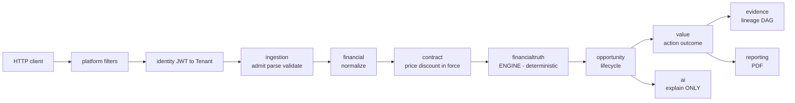

# AI_CFO Code-Flow Handbook

Engineering reference for the `com.fintech.cfo` Spring Boot backend: what every
file is for, what actually runs, what is only designed, and why each decision
was made the way it was.

Written against the working tree at commit `a0596b8` (branch
`docs/code-flow-handbook`).

| | |
|---|---|
| Stack | Java 25, Spring Boot 4.1.1, Maven wrapper |
| Production Java files | 466 (311 `BUILT`, 155 `STUB`) |
| Test Java files | 37 (14 real, 23 stub shells) |
| Flyway migrations | 10 (`V1`–`V10`, 42 tables) |
| Build state | `mvnw clean package` → BUILD SUCCESS, 329 tests, 0 failures, 0 errors |
| Chapters | 20 + this index + `_TEMPLATE.md` |
| Total prose | ~205,000 words |

---

## How to read this

Read `_TEMPLATE.md` first if you have never seen the handbook. It defines the
seven sections every chapter uses in the same order:

**A** why the module exists → **B** runtime flow → **C** every file in the
module → **D** method-by-method deep dive → **E** gotchas → **F** tests →
**G** wiring.

If a chapter does not have a section D, it is broken.

| symbol | meaning |
|---|---|
| `BUILT` | real implementation, callable today |
| `STUB` | empty shell; the chapter says what belongs there |
| `[PLANNED]` | designed, not yet executable |
| `→` | calls |
| `!` | gotcha or defect risk |
| ⚠ **Review** | something looks wrong; stated in the handbook, not fixed |
| `file.java:42` | line 42 in the real file, a reading aid rather than a contract |

Line numbers reflect the working tree at time of writing. Prefer method names
when citing.

---

## The five-minute version

AI_CFO ingests invoices and financial transactions (CSV/Excel, up to 25 MB /
200k rows), normalizes them into a canonical tenant-scoped model, resolves the
contract price and discount that were **in force on the invoice date**, and then
computes expected-versus-actual variance **deterministically with no model in the
math loop**. Those variances become audited opportunities with full lineage back
to the source row, through the calculation, to the finding, to the action, to the
realized outcome. Only at the very end is a language model allowed in, and only to
*explain* figures that were already computed.

Two rules hold the whole design together:

1. **Truth over AI.** Importing data and calculating the truth engine make zero
   LLM calls. A model that is unreachable cannot change a number.
2. **Tenant and reproducibility.** Every table carries `organization_id`. Every
   calculation records an input checksum, the term versions it evaluated, and a
   fingerprint, so any stored figure can be re-derived. No FX conversion, and no
   silent zero.

---

## Chapters

### Foundations

| chapter | files | words | what it covers |
|---|---|---|---|
| [01 — Overview, boot and boundaries](01-overview-boot-and-boundaries.md) | 3 | 5,700 | `CfoApplication`, startup order, the module-boundary rule, cross-module schema map, how 466 files are organised |
| [02 — Shared kernel](02-shared-kernel.md) | 24 | 15,100 | `Money`, `Result`, sealed interfaces, exception hierarchy, clock and ID providers — the vocabulary every other module speaks |
| [03 — Platform](03-platform.md) | 28 | 14,500 | filters, error handling, auditing, idempotency, the persistence and observability seam, V10 schema |
| [04 — Identity and tenancy](04-identity-tenancy.md) | 30 | 5,700 | JWT authentication, `TenantContext`, roles and permissions, `organization_id` enforcement, V1–V2 schema |
| [15 — Runtime config and logging](15-runtime-config-and-logging.md) | CONFIG | 6,900 | every property, every environment override, logback, MDC keys, what is bound versus ignored |
| [17 — Build and tooling](17-build-and-tooling.md) | CONFIG | 5,000 | `pom.xml`, the MapStruct and Lombok strictness that breaks builds, UTC test timezone, wrappers |

### The pipeline, in execution order

| chapter | files | words | what it covers |
|---|---|---|---|
| [05 — Ingestion](05-ingestion.md) | 79 | 16,200 | upload, validation, parsing, source-record landing, ingestion runs and errors, V3 schema |
| [06 — Financial data](06-financial-data.md) | 43 | 14,600 | canonical customers, products, invoices, lines, transactions, identity resolution, V4 schema |
| [07 — Contract](07-contract.md) | 55 | 20,900 | bitemporal terms, precedence and specificity, price resolution and clamping, discount caps, rule safety, extraction, V5 schema |
| [08 — Financial truth engine](08-financial-truth-engine.md) | 50 | 18,600 | the deterministic engine: expected versus actual, variance, impact, checksums and fingerprints, V6 schema |
| [09 — Evidence and lineage](09-evidence-lineage.md) | 26 | 7,300 | snapshots, evidence records, references, the lineage DAG, V7 schema |
| [10 — Opportunity](10-opportunity.md) | 40 | 13,400 | findings, impacts, lifecycle events, assignments, reviews, investigations, V8 schema |
| [11 — Value realization](11-value-realization.md) | 24 | 5,800 | action plans, executions, outcomes, realized value and attribution, V9 schema |
| [12 — AI layer](12-ai-layer.md) | 37 | 11,000 | what the model is allowed to do, guardrails, prompts, the refusal boundary, and why it never computes |
| [13 — Investigation, reporting, processing](13-investigation-reporting-processing.md) | 29 | 8,500 | investigation workspaces, PDF generation, the async processing runtime |

### Reference

| chapter | words | what it covers |
|---|---|---|
| [14 — Database schema](14-database-schema.md) | 16,400 | V1–V10 in order, all 42 tables, an ER diagram per migration, the 35-table tenancy fan-out, every constraint and index |
| [16 — Test suite](16-test-suite.md) | 11,600 | 37 test files, what each invariant locks down, the 23 stub shells, coverage holes stated plainly |
| [18 — End-to-end traces](18-end-to-end-traces.md) | 11,600 | full request traces with file and method references at every hop |
| [19 — Glossary and FAQ](19-glossary-and-faq.md) | 4,100 | the vocabulary, and the questions that come up repeatedly |
| [20 — Stub roadmap](20-stub-roadmap.md) | 4,100 | every one of the 155 production stubs, what belongs in each, and the dependency order for building them |

---

## Where to start for a specific job

| I want to | Read |
|---|---|
| understand the whole system in an hour | 01, 02, then the pipeline table above |
| trace one CSV upload end to end | 18, then 05 and 08 |
| change pricing or discount behaviour | 07 sections D.5 and D.6, then 08 section D |
| add a field to the schema | 14, then the owning chapter's section C |
| write a test for the truth engine | 16, then 08 section F |
| implement a stub | 20, then the owning chapter's section C row |
| debug a tenancy or security issue | 04, then 03 |
| understand why AI cannot corrupt a number | 12 section D, then 08 section E |

---

## Known warnings

These are stated in the handbook rather than fixed, because this is a
documentation set. Each appears in full in the owning chapter's section E.

- ⚠ `InvoiceLine` record drops the `version` field the schema and DTO carry.
- ⚠ `ck_invoice_lines_total` cannot be satisfied as written for discounted lines.
- ⚠ `canonicalform` in the contract module is dead code.
- ⚠ `contractTermInForce` is defined twice with different contracts.
- ⚠ Nothing in production consumes the contract module yet.
- ⚠ `financialtruth` carries a parallel, unshared term model.
- ⚠ Only `AuditEventEntity` and `IdempotencyRecord` are `@Entity`, so Hibernate
  validates 2 of approximately 30 tables at startup.
- ⚠ Several YAML properties are declared but never bound to a configuration class.
- ⚠ The idempotency TTL is hard-coded rather than configurable.
- ⚠ `Instant.now()` is called directly instead of through the clock port in some
  places.