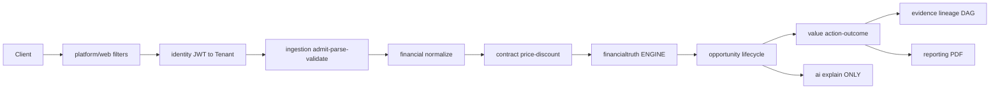

# AI_CFO Handbook (start here)

> com.fintech.cfo, Boot 4.1.1 / Java 25. 452 files:
> 280 REAL + 24 SPEC (design done, code TODO) + 148 STUB.
> mvn compile passes.

## How to use

| Want | Read | Time |
|---|---|---|
| 5-min model | README 1+2 | 5 min |
| Trace CSV upload | README 2, then 01-2, 02-3 | 20 min |
| Why math is trusted | 02 + 06 | 20 min |
| Implement TODO | chapter 6 + linked Test | 1 hr |

Legend: REAL=done, SPEC=Javadoc spec + TODO stub (read it first),
STUB=empty shell, ->=calls, !=gotcha. Chapters 00-06 share one
template (see _TEMPLATE.md: WHY, FLOW, FILE TABLE, DEEP DIVE,
GOTCHAS, IMPLEMENT, NEXT).

## 1. What this system is

AI_CFO ingests invoices (CSV/Excel 25MB/200k rows), normalizes,
resolves contract price/discount in force on invoice date,
deterministically computes expected vs actual -> variance ->
impact with NO AI in math (ADR-002), turns variances into
audited opportunities with lineage
(source row -> result -> opportunity -> action -> outcome),
then optionally asks LLM to explain computed numbers under
guardrails. Tenant = organization_id (V1).
Repro = checksum + rule_version + fingerprint (V6).

## 2. Flow

Stage map: 0 boot(00,05) | 2 ingest(01,V3V4) |
3 price(02-4,V5) | 4 truth CORE(02-2/3,V6) |
5 opp/val/evi(03,V7V8V9) | 6 AI(04-2) | 7 report(04-3/4,V10).

## 3. Catalogue

CfoApplication->00 | shared 24 REAL->05-1 |
platform 28 REAL->05-2/4 | ingestion 69->01 |
financial 37 (20 REAL + 17 SPEC)->01 | contract 51 (46+5STUB)->02-4 |
financialtruth 50 REAL->02 HEART | evidence 26 (5 REAL enums)->03-4 |
opportunity 40 STUB->03-2 | value 24 STUB->03-3 |
ai 24 STUB->04-2 | reporting 10 STUB->04-3 |
investigation 7 STUB->04-4 | identity 30 STUB->05-7 |
processing 12 (8 REAL + 4 SPEC)->05-8 | V1-V10+yml+prompts->05/06.

## 4. Golden rules

1. Truth over AI: truth+contract import zero LLM.
2. Tenant+repro: every row org_id; every calc
checksum+version+fingerprint. No FX, no silent zero.

## 5. Chapters

00 boot | 01 ingest | 02 truth+contract | 03 opp/val/evi |
04 ai/report | 05 kernel/V1-V10/yml | 06 ER/FAQ/checklist |
STATUS counts | placeholders 172 grouped.
