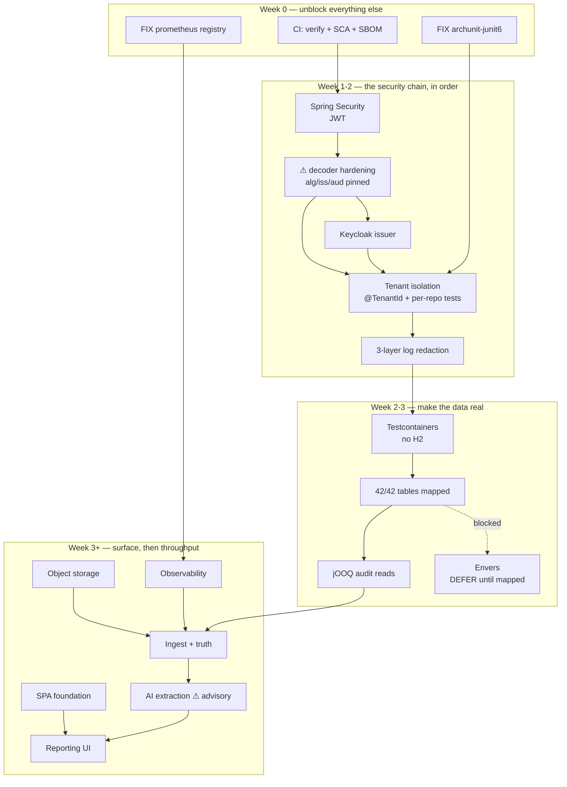

# Open-Source Decisions — Phase 0

> **Status:** DECIDED. Every line below is a decision, not a suggestion.
> **Scope:** [Phase 0](architecture/phase-0-scope.md) of AI CFO, plus the frontend that
> Phase 0 has never had. Phase 1+ projects appear only to say *defer* — never to justify a
> POM entry now.
> **Supersedes:** the earlier research-catalogue version of this file, which listed ~90
> projects with no adopt/reject verdict. That list produced decision paralysis, not
> decisions. This version deliberately cuts about 70% of its content.
>
> ⚠ **Revised 2026-10-03 — read §35 before trusting any row.** A verification pass against
> primary sources **reversed seven decisions** and found **two live build defects**, including a
> missing Prometheus registry that makes every alert in this document currently dead. Sections
> are corrected in place; §35 records what was wrong, the evidence, and what we deliberately
> stopped claiming. A decision document nobody ever checked looks exactly like one that needs no
> checking.

---


## 0. How to read this

Each workstream carries one of six verdicts. There is no seventh option.

| verdict | meaning |
|---|---|
| `ADOPT` | Add the dependency (or run the service) in Phase 0. Pinned in the POM. |
| `ALREADY` | Already in `pom.xml` or the tree. No decision needed — just finish using it. |
| `READ` | Do not depend on it. Read its source to copy the *design*. No licence obligation. |
| `DEFER` | Explicitly out of Phase 0. Revisit at the named trigger. |
| `REJECT` | **Not used, and named here so nobody re-litigates it.** The original four-verdict scheme had no way to say "considered, and no" — so rejected projects lingered as `DEFER` and got re-proposed. |
| `ALIGN` | Not a dependency. A **constraint** we must satisfy or a **schema obligation** we must carry from day one — a standard, a regulation, or a vendor's residency promise. |

**The decision rules that produced every verdict below** — these, not the links, are the
real content of this document:

1. **The money path is untouchable.** Nothing non-deterministic, no LLM, no fuzzy matching
   and no statistical scorer may sit between an input row and a reported figure. This is
   [ADR-002](decisions/ADR-002-financial-truth-over-ai.md). Any candidate that violates it
   is `READ` or `DEFER` — never `ADOPT`.
2. **One runtime, one deployable.** [ADR-001](decisions/ADR-001-modular-monolith.md) says
   modular monolith. Every `ADOPT` below is an in-JVM library or an optional sidecar. We do
   not add a Go, Rust or Python service to satisfy a Phase 0 requirement.
3. **Copyleft is `READ`, not `ADOPT`.** AGPL/GPL projects are read for design, or run as
   separately-deployed services the customer operates. Nothing AGPL links into our JAR. The
   operative rule, since three projects changed licence under us: **AGPL-3.0 and BUSL-1.1 are
   disqualifying; LGPL-3.0 is conditional** on being unmodified, dynamically linked and not shaded;
   **EPL-2.0 is acceptable unmodified** (file-level copyleft, express patent grant). Verify the
   *runtime* tree, not `pom.xml` — a build-time tool is never distributed, so Semgrep (LGPL) is
   fine while an AGPL dashboard inside the JAR is not.
4. **Unmaintained is a disqualifier, independent of CVE status.** Spring Statemachine was archived
   on 5 Jul 2026 (§7). Its final release *is* the CVE-fixed line — so "abandoned" and "currently
   vulnerable" are different claims, and only the first is load-bearing. Prefer a boring library
   we can patch over a live one we cannot.
5. **Boring beats clever, hard.** A library that has been boring for five years beats one
   that is fashionable. This is why the list below is short.
6. **Stars are not evidence.** Star counts are removed on purpose. Version, licence and maintenance
   status are evidence; popularity is marketing.

> ⚠ **Licences and versions below were verified on 2026-10-03 against primary sources and WILL
> rot.** Every row naming a version was checked against Maven Central, the npm registry, or the
> project's own repository — not recalled. That pass is what produced §35, and it is the reason
> this document names its verification date. Re-verify at the moment of adoption and record the
> outcome as an ADR under [`decisions/`](decisions/) with the pinned version. Nothing here is a
> legal opinion.

---


## 1. Reality check — what already exists

> **VERIFIED 2026-10-03** by reading `pom.xml`, the migrations and the resource tree. Findings:
> every `ALREADY` row below is genuinely in the POM; every `absent` row is genuinely absent;
> **42 tables** across `V1..V10`; **466 production Java files (311 built / 155 stub)** and
> **37 test files (14 real / 23 stub shells)**; and **no frontend** (`static/` and `templates/`
> are empty, no `package.json`, no `.github/` directory, no Dockerfile, no compose file, no
> Kubernetes manifests). Node 24.18 / npm 11.16 available locally. Nothing below rests on an
> assumed tree.

| capability | actual state | verdict |
|---|---|---|
| Spring Security + OAuth2 resource server | **already a dependency** | `ALREADY` |
| Spring Data JPA + Hibernate | **already** | `ALREADY` — but only **2 of 42 tables** are mapped as `@Entity` (§36.1) |
| Flyway + Postgres (10 migrations) | **already** | `ALREADY` |
| Spring Batch | **already** | `ALREADY` |
| Testcontainers + Postgres | **already** | `ALREADY` |
| springdoc-openapi | **already** | `ALREADY` |
| Apache POI (`poi-ooxml`) | **already** | `ALREADY` — Excel export solved, with a hard streaming constraint (§8) |
| OpenPDF | **already** | `ALREADY` — PDF generation solved |
| MapStruct 1.6.3 + Lombok | **already** | `ALREADY` |
| ArchUnit | **already** | `ALREADY` **+ `FIX`** — wrong artifact for JUnit 6, and both rule classes are empty (§35.2) |
| Micrometer + Actuator | **already** | `ALREADY` **+ `FIX`** — the Prometheus **registry is missing**, so `/actuator/prometheus` serves nothing (§35.2) |
| Keycloak, jOOQ, Envers, Statemachine, Modulith, Spring AI, Tika/PDFBox, AWS SDK | **absent** | decided below — Statemachine and Envers are now `DEFER`/`REJECT`, see §35.1 |
| CI, containerisation, IaC | **no `.github/`, no Dockerfile, no compose, no k8s, no Terraform** | §23, §25 — the cheapest unblock in the programme |
| Any frontend | **does not exist** — `static/` and `templates/` are empty, no `package.json` | see §10 |

**Two consequences that change the plan:**

- The old document's "adopt Spring Security / JPA / Flyway / Batch / Testcontainers" advice
  is **moot — they are in the build already.** The remaining work is not selection, it is
  *use*.
- **There is no frontend.** Node 24.18 / npm 11.16 are available locally. §10 is greenfield
  and is the single largest new surface in Phase 0.

---


## 2. Identity, AuthN/AuthZ, tenancy — Spring Security + Keycloak + `@TenantId`

The #1 blocker: 30 identity classes are stubs, no `SecurityFilterChain`, no `JwtDecoder`,
no tenant isolation.

| verdict | project | licence | why this one and not the alternative |
|---|---|---|---|
| `ALREADY` | `spring-boot-starter-security` + `oauth2-resource-server` | Apache-2.0 | In the POM. We write the filter chain; we are not choosing a framework. |
| `ADOPT` | `keycloak/keycloak` | Apache-2.0 | Run as a **separate container in dev/staging**, issue the JWTs. We are the resource server, never the issuer. Apache-2.0, and its multi-tenant realm model maps directly onto our `organization_id`. |
| `ADOPT` | Hibernate `@TenantId` | LGPL-2.1 | Already on the classpath via Hibernate 6. A row-level tenant discriminator makes "somebody forgot the tenant filter" a framework-enforced condition rather than a code-review memory. The alternative — hand-written `WHERE organization_id = ?` across 30 repositories — has no failure mode a test can catch once somebody adds a new query. |
| `ADOPT` | `TNG/ArchUnit` | Apache-2.0 | Already used. Add the rule "no repository method reachable without a tenant predicate" — the cheapest possible guard against the worst possible bug. |
| `DEFER` | `spring-authorization-server` | Apache-2.0 | Only if we must *be* the IdP for a customer who forbids an external IdP. Trigger: a signed design partnership. |
| `DEFER` | `zitadel`, `ory/kratos`, `casdoor` | Apache-2.0 | All are fine alternatives. Trigger: Keycloak's operational weight (JVM count, RAM footprint) becomes a real problem. Revisit at the first enterprise pilot. |
| `DEFER` | `flowable`, `camunda` | Apache-2.0 | Not an identity concern. See §7. |

**Decided:** Spring Security resource server + Keycloak as external issuer + Hibernate
`@TenantId` + an ArchUnit rule enforcing it. Nothing else in Phase 0.

---


## 3. Persistence, entities, repositories — JPA for writes, jOOQ for audit reads

Only 3 of 30 repositories are real and only 2 of 42 tables are mapped as `@Entity`.

| verdict | project | licence | decision |
|---|---|---|---|
| `ALREADY` | Spring Data JPA, Flyway, Hibernate | Apache-2.0 / LGPL-2.1 | In the POM. Stop selecting; start mapping entities from the 10 existing migrations. |
| `ADOPT` | `jooq` (jOOQ) | Apache-2.0 | **The one genuinely new addition here.** Our 42 tables are the audit trail for financial calculations, so a reviewer must be able to read the exact SQL that produced a figure. jOOQ generates typed Java from the Flyway-owned schema and keeps that SQL in version control — an auditability property JPA Specifications cannot provide. Generate sources at build time from a Testcontainers Postgres so schema and types can never drift. |
| `ADOPT` | `hypersistence-utils-hibernate-63` | Apache-2.0 | The pragmatic way to map Postgres `jsonb`, `timestamptz` and arrays without hand-writing twenty `AttributeConverter`s. This is a tax we would otherwise pay across contract terms and evidence metadata. |
| `ADOPT` | ~~`hibernate-envers`~~ → **`DEFER`, and the reason is ours, not Hibernate's** | Apache-2.0 (**not** LGPL — Hibernate relicensed to ASL-2.0 at 7.0, HHH-19145) | ⚠ **REVISED 2026-10-03.** Two claims that would have justified a rejection are **false**: Envers is *not* deprecated on the 7.4 line (only the `8.0.0.Beta3` description carries the "Deprecated" prefix, and the 7.4 migration guide says "entirely optional… continues to work as before"), and core `@Audited` is *not* labelled incubating. The real blocker is structural: **Envers can only audit a mapped persistent entity, and we have 2 `@Entity` classes against 42 tables.** Adopting it now would give history tables for 2 tables and false confidence for the other 40. `DEFER` until entity coverage is real — then it becomes the cheapest possible "what did this contract look like on date X". |
| `DEFER` | `blaze-persistence` | Apache-2.0 | Solves a problem jOOQ solves better for read-heavy audit queries. Carrying both is worse than carrying one. |
| `DEFER` | `liquibase` | ⚠ **FSL-1.1-ALv2** (not Apache-2.0) | ⚠ **FACT CORRECTED 2026-10-03.** Liquibase is **no longer OSI open source**: the 5.0.x line carries the Functional Source License, effective from the 5.0.0 release on 30 Sep 2025, converting to Apache-2.0 two years after each release. (Boundary detail: `5.0.0` shipped the proprietary *Secure* EULA text; `5.0.2` onward is FSL-1.1-ALv2. POM licence metadata lagged and still mislabelled `4.33.0`/`5.0.0` as Apache-2.0.) The conclusion is unchanged and now has a second, stronger reason: we already use Flyway, and two migration tools on one schema is a corruption risk. |
| `DEFER` | `jqwik` | EPL-2.0 | Property tests on rounding antisymmetry are the highest-value test we could write, but EPL in a commercial product needs legal sign-off. Spike it; adopt on approval. |

**Decided:** JPA for the write model, jOOQ for the read/audit model, hypersistence-utils for
Postgres types. Liquibase and Blaze-Persistence are out. **Envers is `DEFER`, not `ADOPT`** — it
can only audit a mapped entity and we have 2 against 42 tables; revisit when entity coverage is
real, at which point it is the cheapest possible answer to "what did this contract look like on
date X" (§35.1 row 3).

---


## 4. Financial domain — read, do not adopt

We are not building an ERP and must not be distracted by one.

| verdict | project | licence | what to take, what to ignore |
|---|---|---|---|
| `READ` | `frappe/erpnext` | GPL-3.0 | **The most valuable document in this list.** Read its purchase-order / invoice / GRN three-way-match and approval-workflow edge cases. Ignore the Python. The value is the *edge-case catalogue*, not the code. |
| `READ` | `apache/fineract` | Apache-2.0 | Read for UTC financial-period discipline, monetary value-type design, and API-first controller shape. It is Java/Spring, so its period-boundary test fixtures are directly reusable in spirit. |
| `READ` | `tigerbeetle` | Apache-2.0 | Read its double-entry posting invariants and idempotency-key design. Adopting a Zig database to hold finding data we are not double-entrying would be absurd. |
| `READ` | `killbill/killbill` | Apache-2.0 | Read for proration and credit-note handling, if we ever bill customers. |
| `DEFER` | `beancount`, `hledger`, `LedgerSMB`, `tryton`, `dolibarr`, `firefly-iii` | GPL / BSD | Personal and SMB accounting semantics that do not map to contract-vs-invoice variance. No read, no adopt. |

### 4.1 The money library question — a KEEP, decided rather than assumed

`shared.domain.Money` already exists, so this is a **REPLACE-or-KEEP** decision, not an adopt
decision. It was resolved by reading the alternatives, not by defaulting to what we wrote.

| artifact | version | licence | 2026 maintenance status |
|---|---|---|---|
| `javax.money:money-api` (JSR-354 API) | `1.0.4` | Apache-2.0 | master last touched May 2026 — **maintenance mode** |
| `org.javamoney:moneta` (reference impl.) | **`1.4.5`** (Central, Mar 2025) | Apache-2.0 | **Actively maintained** — repo updated 11 Jul 2026 |
| `org.javamoney:jakarta` (CDI/JPA bridge) | `0.0.1-SNAPSHOT` | Apache-2.0 | Apr 2022 — **dormant** |
| `org.apache.commons:commons-math3` | `4.0-SNAPSHOT` (last published 2024) | Apache-2.0 | **Not a money library at all** — pure math/stats, no `Money` or `Currency` type |

**Decided: KEEP `shared.domain.Money`.** It is, precisely, "the JSR-354 `Money` class minus the
CurrencyConversion SPI" — which is the correct subset for a system whose ADR-002 forbids FX.

**What Moneta would have given us that `Money` does not, and why each is a loss here:**

1. **`CurrencyConversion` SPI (`ExchangeRate`/`RateProvider`)** — *this is exactly what we want to
   avoid.* Worse, it is a **latent violation**: `CurrencyConversion` sitting on the classpath can be
   invoked accidentally, and `Moneta.of("USD").subtract(Moneta.of("INR"))` would attempt a
   conversion with a default rate provider **instead of throwing**. Our currency-mismatch throw is
   a stronger guarantee than any library default.
2. **`FastMoney` (long minor units, 10–15× faster)** — a **trap for Indian tax**. `long` cannot
   represent a 3-decimal intermediate: 9.236 % GST on ₹100 → ₹9.236 → silently truncates to
   ₹9.24. Our `NUMERIC(20,6)` exists precisely to hold that.
3. **`MonetaryAmount` interface + factory pattern** — multiple implementations. Complexity with no
   value for a single-currency application.
4. **`MonetaryContext`** — per-amount precision/scale metadata. Nice for audit trails; overhead
   for no gain.
5. **`MonetaryAmountFormat`** — locale-aware formatting. Our PDF/XLSX output formats directly.
6. **`org.javamoney:jakarta`** — Bean Validation annotations and CDI/JPA integration. Dormant since
   2022, and it pulls a wider graph to solve a Spring problem we do not have.

**The trap that decides it independently of preference:** both Moneta's `FastMoney` and Joda-Money
**round to 2 decimal places by default**, so a 9.236 % tax on ₹100 becomes ₹9.23 — one paisa lost
per line, cascading across a 200 k-row import. Any money library we adopted would have required
raising precision to ≥ 6 and banning long/minor-unit backends, i.e. re-implementing the constraint
`Money` already enforces. **A REPLACE would mean rewriting every `equals`, `hashCode`, comparison
and the mismatch guard for zero functional gain.**

**⚠ Removed from the previous version:** `opens2p/OpenS2P`. It was cited twice and
elevated to "closest domain match to AI CFO", but I could not verify that the repository
exists. A document that tells the team to read a repository nobody can open is worse than a
shorter list. If it turns out to be real under a different owner, ERPNext remains the primary
reference and nothing is lost.

---


## 5. Matching, reconciliation, anomaly detection

| verdict | project | licence | decision |
|---|---|---|---|
| `ALREADY` | Apache Commons CSV | Apache-2.0 | Deterministic upstream parsing. Already in the POM. |
| `READ` | `dedupeio/dedupe` | MIT | Read for the probabilistic record-linkage *approach* to duplicate-invoice detection. Python; we will not embed it. |
| `READ` | `camelot-dev/camelot` | MIT | The PDF table extractor. Read its **lattice / stream / network** table-reconstruction strategy; we implement the Java equivalent on PDFBox. |
| `REJECTED` | `atlanstic/camelot` | — | **Dead link — verified 404.** The previous revision of this file "corrected" the citation to this org; that correction was wrong and is reverted. See §4's own warning about unverifiable repositories. |
| `DEFER` | `pyod`, `ydata-profiling`, `OpenRefine`, `recordlinkage` | various | Statistical detection is barred from the money path by ADR-002. If ever needed it belongs in an offline analysis notebook, not in the product. |

**Decided:** duplicate detection in Phase 0 is a **deterministic rule** — same supplier, same
amount, same invoice number, plus a near-duplicate check using a normalised numeric tolerance
— implemented in our own code. If the rule set later exceeds what hand-written rules can
express, the answer is Drools DMN in §6, never a Python anomaly library.

---


## 6. Rules engine — deferred, firmly

| verdict | project | licence | decision |
|---|---|---|---|
| `DEFER` | `apache/incubator-kie-drools` | Apache-2.0 | The rules in `financialtruth/rules/*` are hand-written and green. Adding a rule engine to replace a few hundred lines of readable Java buys a dependency, a decision-table format finance cannot review in code review, and a replayability risk under ADR-002. |
| `DEFER` | `openl-tablets`, `j-easy/easy-rules` | LGPL-2.1 / MIT | Same reasoning. |
| `DEFER` | DMN via Camunda | Apache-2.0 | Revisit **only** when a business user, not an engineer, must author a pricing or discount rule. That is a Phase 1+ product decision. |

**Decided:** hand-written rules stay. The trigger to revisit is *"a rule changes weekly and
always requires a deploy"* — not *"there are many rules"*.

---


## 7. Workflow & opportunity lifecycle — hand-coded, and why no engine

Opportunity lifecycle is 12–20%: detect → review → validate → act → realise.

> ⚠ **REVERSED 2026-10-03.** This section previously read `ADOPT Spring Statemachine`. That was
> wrong on four independently verified grounds, not one. Full evidence in §35.1.

| verdict | project | licence | decision |
|---|---|---|---|
| `REJECT` | `spring-projects/spring-statemachine` → now `spring-attic/spring-statemachine` | Apache-2.0 | **Archived and abandoned.** The owner archived the repo on **5 Jul 2026**; its README now reads "Spring Statemachine is no longer maintained". Final release `4.0.2` (11 Jun 2026) was built against **Spring Boot 3.5.15** — never Boot 4. It also carries **CVE-2026-41862** (CWE-502, CVSS 8.8 HIGH) across 4.0.0–4.0.1 and 3.2.0–3.2.4. An unmaintained, Boot-3-only library with a live deserialisation CVE on the path that mutates money-adjacent state is not a trade-off worth making. Note 4.0.2 *is* the CVE-fixed line — so "abandoned" and "currently vulnerable" are different claims, and **abandonment is the load-bearing argument**. |
| `ADOPT` | **hand-coded** `LifecycleEngine` | — | One package: a `status` enum whose `legalSuccessors()` table *is* the state machine, a `transition(from, to, reason)` method, and a `SELECT … FOR UPDATE` plus optimistic-`version` CAS so two concurrent reviewers cannot both win. `opportunity_lifecycle_events` (V8, append-only) is already the audit trail, so the engine writes the transition and the audit row in one transaction. |
| `REJECT` | `flowable` | Apache-2.0 | Rejected **for this shape**, not in principle. A BPM engine keeps its own `ACT_RU_*` history, giving us **two sources of truth** for "what state is this opportunity in" — `opportunities.status` and Flowable's tables — that drift silently. That is a worse failure than a large state enum. Kept as the documented escape hatch: the engine sits behind `LifecyclePort`, so the swap is one package. |
| `REJECT` | `camunda` | ⚠ Zeebe Community Licence — **not OSI open source** | See §0 rule 3 for the licence rule (AGPL and non-OSI copyleft is disqualifying). Rejected on licence before architecture. |
| `DEFER` | `temporalio/temporal` | MIT | The right answer for realised-value tracking spanning **months** that must survive any restart. Trigger: a value-realisation workflow that genuinely waits on a human for days — not a five-state machine an enum can hold. |
| `REJECT` | `jBPM` | Apache-2.0 | Same two-sources-of-truth problem as Flowable, smaller ecosystem. |

**Decided:** hand-code it. `OpportunityStatus.legalSuccessors()` already exists and already *is* the
complete specification of the legal transitions, so the engine is a thin executor over finished
work — not a design task.

**The interface that keeps the escape hatch honest:**

```java
// opportunity/service/LifecyclePort.java — the entire workflow surface
public interface LifecyclePort {
    /** @throws IllegalTransitionException if `to` is not in `from.legalSuccessors()` */
    OpportunityStatus transition(OpportunityId id, OpportunityStatus to, String reason);
}
```

Every transition writes an `opportunity_lifecycle_events` row and bumps `opportunities.version` in
the same transaction. A **backward** move additionally requires a non-blank reason: a forward
transition is self-evident, while a backward one is a correction somebody must be able to explain
to an auditor. That asymmetry is the whole reason the lifecycle is worth hand-coding.

---


## 8. Batch, reporting, storage, CI/CD, observability

| workstream | verdict | project | licence | decision |
|---|---|---|---|---|
| Batch | `ALREADY` | Spring Batch | Apache-2.0 | In the POM. Chunk-oriented steps, restartability, skip/retry. Every job idempotent on an explicit job-key. |
| Scheduling | `REJECT` | `@Scheduled` **and** `quartz` | Apache-2.0 | ⚠ **REVERSED 2026-10-03.** `@Scheduled` was recorded as `ALREADY` here and Quartz deferred until a second instance. Both are wrong. `@Scheduled` fails **silently in both directions**: on one replica a missed window is never retried, and on two replicas the job runs twice — and our jobs mutate money-adjacent state. Quartz is not the fix either; the trigger does not need a scheduler library. **Decided: Spring Batch 6 triggered externally** — a host `cron` entry now, a Kubernetes `CronJob` if we ever get there. The scheduler owns *when*; Spring Batch owns *what* and *idempotently so*. Quartz's licence was also re-checked: it is **Apache-2.0**, not LGPL (latest `2.5.2`, 1 Dec 2025) — the premise that prompted the earlier LGPL note was false. |
| PDF generation | `ALREADY` | `openpdf` | LGPL-1.3-or-later / MPL-2.0 | Already chosen. Findings export as PDF. |
| Excel | `ALREADY` | `poi-ooxml` | Apache-2.0 | Already chosen. Finance lives in Excel; this is not optional. **New hard constraint:** never `WorkbookFactory.create(upload)` on a 200k-row file — that loads the whole workbook into heap. Use the SAX/event reader for ingest and `SXSSFWorkbook(window=100)` for export. See §26. |
| PDF text extraction | `ADOPT` | `apache/pdfbox` (`3.0.8`) | Apache-2.0 | Deterministic text and character-offset extraction **before** any LLM sees a document. ⚠ **RATIONALE CORRECTED 2026-10-03:** the old text said "PDFBox for layout-aware table extraction" — **PDFBox has no table finder.** It gives text, regions and coordinates. Region clustering is ours to write, and it is a Phase 1 decision (§26), not a library choice. |
| PDF format detection | `ADOPT` (narrow) | `apache/tika` — **`tika-core` only**, not `tika-parsers-standard` | Apache-2.0 | ⚠ **NARROWED 2026-10-03.** Adopt **only** `tika-core` for magic-byte content sniffing — the authoritative signal, never the extension. **Do not** adopt the standard parser package: it pulls a large transitive parser surface into a finance service, forks work into a separate process on the 4.x line, and each extra parser is extra attack surface for hostile input. Parse PDFs with PDFBox instead. (`tika-core` latest `4.1.0`; the 3.x line `3.3.2` remains on bug-fix support.) |
| Dashboards | `DEFER` | `metabase`, `apache/superset` | AGPL-3.0 / Apache-2.0 | Phase 0 exports files; it does not ship a BI tool. Trigger: more than five internal finance users asking to self-serve. Metabase is AGPL — customer-deployed only, never linked. |
| Charts | `DEFER` | `jfree/jfreechart` | LGPL-2.1 | Only if a chart is required inside a generated PDF. |
| Object storage | `ADOPT` | **the S3 API, not a server** (`aws-sdk-java-v2`) | Apache-2.0 | ⚠ **MinIO is removed from the plan.** Its community repository is officially unmaintained, pre-built binaries are no longer published, and the project now directs users to the commercial AIStor edition ([minio](https://charts.min.io/), [analysis](https://news.reading.sh/2026/02/14/how-minio-went-from-open-source-darling-to-cautionary-tale/)). Adopting it now would be a supply-chain liability. **Decided: depend on the S3 API only** — AWS S3, Cloudflare R2, or Garage — and let the customer supply the store. |
| CI/CD | `ADOPT` | `actions/starter-workflows` + `aquasecurity/trivy` + `dependency-check/Dependency-Check` + `renovatebot/renovate` | MIT / Apache-2.0 | There is **no `.github/` directory at all.** This is the cheapest unblock in the whole plan: build + `mvn verify` on every PR, dependency CVE gate, SBOM. |
| Secrets | `DEFER` | `external-secrets/external-secrets`, `openbao/openbao` | Apache-2.0 / MPL-2.0 | Not needed until deployment. Note `hashicorp/vault` is BUSL-1.1, not open source — use OpenBao if we ever self-host. |
| Observability | `ALREADY` **+ `FIX`** + `DEFER` | Micrometer/Actuator → Prometheus/Grafana | Apache-2.0 / AGPL-3.0 | ⚠ **VERIFIED DEFECT 2026-10-03:** `application.yml:119` allow-lists `health,info,metrics,prometheus`, but **`io.micrometer:micrometer-registry-prometheus` is not in `pom.xml`.** `spring-boot-starter-actuator` pulls only `spring-boot-starter-micrometer-metrics` — no registry — so `/actuator/prometheus` currently serves **nothing** and every metric alert in this document is dead. Add the registry with **no version** (Boot 4.1.1 manages it at 1.17.1). Grafana is separately deployed, never linked — it is AGPL. |
| SAST | `DEFER` | `semgrep/semgrep` | LGPL-2.1 | Nice, not Phase 0. Trivy + Dependency-Check cover the real risk first. |

---


## 9. AI layer — Spring AI, with a hard boundary

The one workstream where "use a library" and "protect the money path" collide.

> ⚠ **REVERSED 2026-10-03.** This section previously read `ADOPT LangChain4j` / `DEFER Spring AI`,
> and gave the reason as "we need typed extraction, not chat, and its structured-output support is
> stronger and more stable". That reason was asserted, never checked. See §35.4 for the evidence.

| verdict | project | licence | decision |
|---|---|---|---|
| `ADOPT` | `spring-projects/spring-ai` via `spring-ai-bom:2.0.1` | Apache-2.0 | The **only GA, Boot-4.1-aligned** option. Verified: Spring AI `2.0.x` supports Boot 4.0.x and 4.1.x; stable is `2.0.1`, `2.1.0-M1` is preview. It ships an auto-registerable `StructuredOutputValidationAdvisor` that self-corrects on validation failure — for an ADR-002 system, "ask once more with the error appended, then *reject*" is exactly right, and having it as framework behaviour rather than our code is a genuine win. We are a Spring shop whose three empty HTTP adapters are Spring components; one BOM beats a beta integration. |
| `DEFER` | `langchain4j/langchain4j` | Apache-2.0 | Core is GA at `1.21.0`, and its `ResponseFormat`/`JsonSchema` builder is genuinely better than Spring AI's. But `langchain4j-spring-boot4-starter:1.21.0-beta31` is a **beta** and its POM declares `spring-boot-starter:4.0.5` — not 4.1.x. **Revisit if** Spring AI's Bedrock Converse path is unmaintained or GA-breaking. Do not adopt both. |
| `REJECT` | LangChain4j **agentic**, **MCP**, `@AiService` tool loops | Apache-2.0 | Not "unused" — **structurally prohibited.** Agentic frameworks give a model the ability to *act*, and ADR-002 makes action the one thing we must not grant. |
| `READ` | `atticusproject/cuad` | CC-BY-4.0 | The clause-extraction **benchmark dataset** — 510 contracts, 13 000+ expert labels, 41 clause types. Not a dependency; an evaluation set. Use it to prove the extractor *works*, not merely that it runs. CC BY 4.0 requires attribution — publish a NOTICE and keep the dataset out of the product image. |
| `READ` | `docling-project/docling`, `Unstructured-IO/unstructured` | MIT / Apache-2.0 | Read for layout-aware chunking strategy. Python; reference only. |
| `DEFER` | `tesseract-ocr/tesseract` | Apache-2.0 | Scanned invoices are out of Phase 0 scope. Add when a customer actually sends one. |

**Decided boundary — non-negotiable, this is ADR-002 expressed in code:**

- The LLM **extracts and explains**. It never produces a figure that reaches a report.
- Every extracted term is persisted as a **versioned, human-reviewable** record carrying the
  model name, model version, prompt hash and raw response. A reviewer must be able to see
  exactly what the model said and overrule it.
- **No raw document text leaves the tenant boundary without redaction first.** Vendor names,
  bank details and line-item descriptions must be scrubbed before any LLM call. This was
  absent from the previous version of this file and is the most serious gap in it.
- A finding whose extraction was never human-approved must be visibly marked as such in the
  PDF export, or the PDF is a liability.

---


## 10. Frontend — full greenfield decision

**There is no frontend.** `src/main/resources/static/` and `templates/` are both empty and no
`package.json` exists. Node 24.18 / npm 11.16 are available locally. This section is a
decision, not a search result.

| verdict | project | licence | decision |
|---|---|---|---|
| `ADOPT` | React 19 + TypeScript + Vite | MIT | `react` `19.3.0`, `react-dom` `19.3.0`, `typescript` `6.0.3`, `vite` `8.3.2`, `@vitejs/plugin-react` `6.1.1`, `react-router-dom` `7.18.4`. The default for a data-dense internal tool with a large hiring pool. The framework will never be the hard part of this product. ⚠ Pin `typescript` at `6.0.3`: `typescript-eslint` `8.71.0` peers on `<6.1.0`, so TypeScript `7.x` is **not** yet safe here. |
| `ADOPT` | `TanStack Query` | MIT | `5.104.1`. Server state only. Our truth lives on the server; the client must never re-derive a number. One query cache, and deliberately no global state library competing with it. |
| `ADOPT` | `TanStack Table` | MIT | `9.2.4`. Opportunity and evidence tables need sorting, filtering and column control. The highest-value UI dependency we will take — and note what it is: a *table* library, not a component framework. |
| `ADOPT` | `react-hook-form` + `zod` | MIT | `7.89.0` + `4.6.5`. Review forms (approve/reject a finding) must validate on both sides. Shared schemas keep the two honest. |
| `ADOPT` | `keycloak-js` | Apache-2.0 | `26.2.4` (server `26.8.0`). Matches the §2 decision. The SPA obtains a token; the backend still authorises everything. **The UI is never the security boundary.** Tokens live in **memory only**; refresh uses an `HttpOnly` cookie the SPA cannot read. `localStorage` is rejected — an XSS bug there exfiltrates a bearer token that survives the tab. |
| `ADOPT` | `vitest` + `@testing-library/react` + `msw` + `@playwright/test` | MIT | `5.0.3`, `16.3.3`, `3.0.1`, `1.63.0`. MSW mocks the API so component tests run without the JVM; Playwright covers the journeys a mock cannot — the real login against Keycloak, and the real download. |
| `ADOPT` | `eslint` (flat config) + `typescript-eslint` + `prettier` | MIT | `10.11.0`, `8.71.0`, `3.9.9`. Non-negotiable for a codebase we hand to other people. |
| `ADOPT` | `tailwindcss` + `shadcn/ui` CLI + `radix-ui` | MIT | `4.3.3`, CLI `4.21.1`, `radix-ui` `1.6.7`. ⚠ **REVISED 2026-10-03.** This section previously deferred shadcn alongside MUI and Ant Design. That conflated two different things. A **component framework** (MUI, AntD, Mantine) ships a whole visual system — thousands of lines, a runtime style engine, and a design vocabulary we would spend Phase 0 arguing about. shadcn is the opposite: unstyled accessible **primitives** we own as source in our own repo, styled by Tailwind, with **no runtime component dependency**. It is the "hand-built components on plain CSS or Tailwind" this section was asking for, with accessibility already solved. Adopt it. |
| `REJECT` | `@mui/material` · `antd` · `@mantine/core` | MIT | `9.4.0`, `6.6.5`, `9.6.3`. Full component frameworks — 300 kB plus a visual system we would spend Phase 0 fighting, for four screens (table, document viewer, review form, download). |
| `REJECT` | `dompurify` | Apache-2.0 / MulanPSL-2 | `3.4.16`. A sanitiser is the right idea implemented as a permanent dependency and an XSS footgun (`dangerouslySetInnerHTML` is exactly where we would reach for it). Better: **the UI never renders model output as HTML.** `AiExplanation` is text or a slot-filled template, rendered as text nodes. There is nothing to sanitise if nothing is ever parsed as markup. |
| `DEFER` | `recharts` | MIT | `3.10.1`. ⚠ **REVISED from `REJECT`/`not pre-empted` to a named `DEFER`.** Keep deferred until a variance-trend chart is actually specified — but record the version and the reason, because the trap is real: **any charting library will recompute a total from the points it is given**, and a client-side aggregate of rounded numbers is not the server's figure. If it is adopted, the rule is that a chart renders series only and a total always comes from the API response. |
| `ADOPT` | `i18next` + `react-i18next` + `intl-messageformat` | MIT | `26.4.2`, `17.0.15`, `12.1.2`. INR and Indian English first. ISO-8601 in transport, locale formatting **only at render** — via native `Intl`, which gives `en-IN` lakh/crore grouping (`1,23,456.78`) for free. This is not cosmetic: our money is `NUMERIC(20,4)` and a `en-US` renderer would print `123,456.78` and quietly misread every Indian invoice. |
| `ADOPT` | `openapi-typescript` + `size-limit` + `axe-core` | MIT | `7.13.0`, `14.1.0`, `4.13.0`. Type generation from the springdoc schema (§11), a **200 kB app-shell budget that fails the build**, and the a11y assertion for the WCAG 2.2 AA target. |
| `DEFER` | Storybook | MIT | Only once the component count passes roughly thirty. |
| `DEFER` | `recharts` | MIT | Add when a variance-trend chart is actually specified. Do not pre-empt it. |
| `REJECT` | Server-rendered Thymeleaf templates | — | `templates/` is empty and should stay empty. Mixing server templates with a React SPA doubles the UI surface and splits the design system in two. Pick one: the SPA. |
| `REJECT` | Micro-frontends, Redux, Web Components | — | Scope discipline, not a technology judgement. A modular monolith gets a modular frontend. |

**Frontend architecture, decided:**

```
React SPA (Vite)  ──HTTP/JSON──>  Spring MVC  ──>  application services
        │                                 │
   TanStack Query                     JwtDecoder (Keycloak)
   TanStack Table                     @TenantId (Hibernate)
   react-hook-form + zod
```

- One route group per backend module, mirroring `architecture/module-boundaries.md`. The
  frontend may not invent a boundary the backend does not have.
- **The frontend never computes a financial figure.** It renders what the engine returned. A
  variance shown in the UI is always the value from the response body, never a client-side
  subtraction — the same rule that governs the PDF, applied to the screen.
- First slices: `reports` and `opportunity`, then `evidence`, then `identity`/login. Nothing
  else in Phase 0.

---


## 11. Architecture guardrails & test depth

| verdict | project | licence | decision |
|---|---|---|---|
| `ALREADY` + `FIX` | ArchUnit, AssertJ, Testcontainers, springdoc | Apache-2.0 / MIT | All in the POM — but **ArchUnit is on the wrong artifact**. ⚠ **VERIFIED DEFECT 2026-10-03:** `pom.xml` declares `archunit-junit5`, while Spring Boot 4.1.1 manages **JUnit 6** (`junit-jupiter` 6.0.3, `junit-platform-*` 6.0.3). `archunit-junit5` will not execute against Platform 6.x. Replace with **`com.tngtech.archunit:archunit-junit6:1.5.1`** (verified to exist). Note the 1.5.x line is very young — only 1.5.0 and 1.5.1 were ever published — so pin it exactly. |
| `ADOPT` | Seven ArchUnit rules (no new dependency once the artifact is fixed) | — | (1) `financialtruth` and `contract` must not import `ai` — ADR-002, mechanically enforced. (2) No cross-module import outside `shared`/`platform`. (3) No controller method without an authorization annotation. (4) No repository reachable without a tenant predicate. (5) `platform.web` and `platform.audit` must not depend on any business module. (6) No class outside `shared.domain` may reference `BigDecimal` for a money amount. (7) No reference to `org.piquery` / Liquibase imports — our migrations are Flyway's alone. **All seven are currently unenforced**: `ModuleBoundaryTest` and `DependencyRuleTest` are 32- and 33-line shells with a 3-line class body containing only `// TODO: Add test cases.` The boundary this document keeps asserting is a convention, not a constraint. |
| `DEFER` | `spring-projects/spring-modulith` | Apache-2.0 | ⚠ **REVISED 2026-10-03.** Previous rationale here — "a stronger ADR-001 check than hand-written ArchUnit" — is **wrong**, and following it would have wasted days. Running `ApplicationModules.verify()` alongside a hand-rolled ArchUnit suite makes Modulith fail *against* the existing rules; the two must not coexist. Pick one. **Decision: ArchUnit, because we already depend on it and need to fix the artifact anyway.** Revisit Modulith if we want transactional event-publication registry, which is genuinely valuable for ADR-004's lineage requirement — but never alongside the rules above. |
| `DEFER` | `javers/javers` | Apache-2.0 | ⚠ Rationale corrected: this row previously said "Envers already covers contract history", which stopped being true when Envers moved to `DEFER` (§35.1 row 3) — we currently have **no** entity history at all, and neither library changes that, because both can only record what is already a mapped entity. Javers earns its place only for *diff* queries across aggregates, which is a Phase 2 question. Until 42/42 tables are mapped, the honest answer is that history is a §28 `recorded_at` column, not a library. |
| `DEFER` | `rest-assured` | Apache-2.0 | Boot 4's `spring-boot-starter-webmvc-test` is already in the POM and covers API testing. |
| `DEFER` | `jqwik` | EPL-2.0 | Property tests proving rounding antisymmetry are the highest-value test we could write, but EPL needs legal sign-off. |
| `DEFER` | `AxonFramework`, `kafka`, `debezium/debezium` | Apache-2.0 | Event sourcing and CDC are Phase 2+ at earliest. **Link corrected:** the old file pointed at an org redirect rather than at the project. |

---


## 12. The Phase 0 execution order

Ordered by dependency, not by enthusiasm. Effort is a rough engineer-day estimate for one
developer already familiar with this codebase.



**The graph is the argument.** Three edges carry the whole plan:

- **`A2 → A4` — the decoder must be pinned before tenancy.** A forgeable token makes every
  tenant predicate irrelevant (§36.4). Doing tenancy first and auth later means re-testing it.
- **`B1 → B2` — Testcontainers before entities.** "42/42 tables mapped" is unverifiable on H2,
  and the first real Postgres run will surface the `jsonb`/constraint assumptions in §3.
- **`B2 ⇢ B4` — Envers is dotted, not solid.** It is `DEFER`red until the entity coverage exists
  to audit (§35.1 row 3). Drawing it as a normal dependency would imply it is merely later.

| # | workstream | first choice | effort | exit criterion — "done" means |
|---|---|---|---|---|
| 0a | **Fix the build** | `archunit-junit6:1.5.1`; add `micrometer-registry-prometheus` **unversioned** | 0.5 | The seven §11 rules actually execute; `/actuator/prometheus` returns metrics. Both are live defects (§35.2), not improvements. |
| 0b | **CI/CD** | GitHub Actions + `mvn verify` + Dependency-Check + Trivy + osv-scanner + CycloneDX/SPDX + cosign | 1 | Every PR builds and tests; CVSS ≥ 7 or a KEV fails the build; SBOM is an artefact of the release |
| 1a | **Identity** | Spring Security RS + Keycloak + **pinned `JwtDecoder`** (§36.4) | 3 | Valid JWT reaches an endpoint carrying `organization_id`; `alg: none`, HS256-with-the-public-key, wrong-`aud` and expired are all rejected |
| 1b | **Tenancy** | `@TenantId` + `findByIdAndTenantId` + one cross-tenant test per repository | 4 | A request without `organization_id` is rejected **by the database**, not by luck. **Starts only after 1a** — see the graph. |
| 2 | **Persistence** | Entities for the 10 migrations; jOOQ for audit reads. ⚠ **Envers `DEFER`** — not in this phase | 8 | 30/30 repositories real; 42/42 tables mapped; every query tenant-scoped |
| 3 | **Test depth** | Testcontainers Postgres in CI — no H2 anywhere | 2 | `mvn verify` runs the full suite against real Postgres |
| 4 | **Frontend foundation** | React 19 + Vite + TanStack Query/Table + shadcn/Radix/Tailwind + keycloak-js | 4 | SPA builds in CI, authenticates via Keycloak, renders one real table from the API |
| 5 | **Batch & scheduling** | Spring Batch 6 + **external trigger** (⚠ **not** `@Scheduled`, not Quartz — §35.1 row 2) | 4 | Nightly ingest → truth → report runs unattended, and is idempotent on re-run |
| 6 | **AI extraction** | Spring AI `2.0.1` + Tika `tika-core`/PDFBox, with redaction and human approval | 6 | Terms extracted, stored with model and prompt hash, reviewable, **never in the math** |
| 7 | **Reporting** | OpenPDF + POI (already in the POM) | 3 | A finding exports to PDF and XLSX with full evidence lineage and an "AI-extracted, unverified" marker |
| 8 | **Reporting UI** | Opportunity + evidence screens | 5 | Finance can review, approve/reject and download a finding without leaving the browser |
| 9 | **Object storage** | AWS SDK v2 against any S3-compatible store; **server-generated keys only** (§36.2) | 2 | Original upload and evidence artifact stored immutably with a content hash |
| 10 | **Observability** | Micrometer → Prometheus → Grafana | 2 | Dashboards for ingest health, job failures, detection counts |

**Total ≈ 46.5 engineer-days** (was ≈ 42 before §36 added the two build fixes, the decoder
hardening and the S3 key work). **Rows 0a–3 are the true blockers; row 4 is the largest new surface;
everything after 4 is throughput.** Note that 0a is half a day and it is the highest
value-per-hour line in this table: without it, the §11 guardrails do not run and the §20 alerts
do not fire, so every other row is being built on unverified ground.

---


## 13. Explicit rejections

Naming what we will *not* bring in, so nobody re-litigates it:

| rejected | why |
|---|---|
| MinIO server | Unmaintained community repo, no binaries, AGPL, now commercial-only. See §8. |
| Liquibase | A second migration tool on a Flyway-owned schema is a corruption risk. |
| jOOQ **+** Blaze-Persistence **+** Specifications | Three query abstractions where one is correct. |
| Drools / DMN | Hundreds of green hand-written rules do not need an engine. See §6. |
| Flowable / Camunda | A five-state linear lifecycle is not a BPMN problem. See §7. |
| Kafka / Debezium / Temporal | Distributed infrastructure with no Phase 0 requirement. |
| Metabase / Superset in-product | AGPL in our distribution, or a whole second system to operate. |
| Fuzzy matching in the money path | Barred by ADR-002. |
| A UI component framework | We need tables and forms, not a design system. See §10. |
| Airbyte / Meltano / NiFi | Phase 1+ connector work; one CSV export is the Phase 0 contract. |

---


## 14. When to revisit

| trigger | revisit |
|---|---|
| First enterprise pilot or security review | IdP choice, secrets management, deployment topology |
| More than one application instance | Nothing — the scheduler is already external (§8). Only revisit if a job needs pause/resume or misfire handling, which is a Quartz-shaped problem. |
| A rule changes weekly and needs a non-engineer author | Drools DMN / OpenL |
| A workflow must wait on a human for days, across restarts | Flowable |
| First scanned PDF arrives | Tesseract OCR |
| More than five users want self-serve dashboards | Metabase (customer-deployed) |
| Five or more external systems to connect | Apache Camel |
| Realised-value tracking over months becomes a requirement | Temporal |

---


## 15. Standards & interoperability — model the invoice on a standard, never invent one

Phase 0's base currency is **INR** and its sources are **Indian supplier exports**, so the
invoice/tax vocabulary matters more than the connector library does. The decision rule:
*carry the standard's fields from day one even if we render none of them yet*, because adding
a column later means re-ingesting every historical file.

| verdict | standard / project | licence | decision |
|---|---|---|---|
| `ALREADY` | **ISO 4217** (currency), **ISO 8601** (dates/instants) | — | Enforced by `CurrencyCode` (3-letter, uppercased, interned) and by UTC-only `Instant`/`LocalDate`. Do not add a second date or currency type. |
| `ALIGN` | **India GST e-invoice** (IRN, signed QR, schema 1.1), **GSTIN**, **HSN/SAC**, place-of-supply, CGST/SGST/IGST split | — | Not a dependency — a **schema obligation**. `V4`/`V5` must be able to carry GSTIN, HSN/SAC, IRN and the tax-head split, or every future Indian reconciliation requires a data migration. Verify the current IRP schema before freezing the columns. |
| `READ` | **Tally XML / TDL export** | — | The scope names Tally first. Read its export shape (voucher-centric, `VOUCHER`/`LEDGERENTRIES`, no flat line table) to confirm our ingestion schema can express it without loss before the first pilot. |
| `READ` | **Zoho Books / QuickBooks** CSV + API shapes | — | Phase 1 connector targets. Read now only to check that our canonical model is a superset. |
| `READ` | **UBL 2.1**, **EN 16931**, **Peppol BIS Billing 3.0** | — | The EU/global invoice *semantic* model. Read for the field taxonomy (monetary totals, tax categories, line allowances/charges) that we should mirror in our canonical invoice. |
| `DEFER` | `ZUGFeRD/mustangproject` (`org.mustangproject:validator`) | Apache-2.0 | The correct Java library for ZUGFeRD / Factur-X / XRechnung / UBL e-invoicing — but those are **EU** formats. Trigger: a customer requiring EN 16931-compliant e-invoice generation or validation. |
| `DEFER` | **SAF-T** (OECD), **XBRL GL** | — | Tax-authority file formats. Trigger: an audit requiring a statutory export. |
| `DEFER` | ISO 20022 (pain/camt) | — | Payment/statement semantics. Trigger: bank reconciliation (a different leakage class than contract-vs-invoice). |

**Decided:** Phase 0 adopts **no** e-invoicing library, but the canonical invoice model must
be a **superset** of the Indian GST invoice shape and the UBL/EN 16931 field taxonomy. This is
a schema decision made in `V4`/`V5`, not a POM decision.

---


## 16. Data governance, lineage & provenance — vocabulary, not a platform

[ADR-004](decisions/ADR-004-source-data-lineage.md) makes lineage a product guarantee
(`source row → result → opportunity → action → outcome`). The `V7` tables already implement it.
What is missing is a **shared vocabulary**, so that our lineage is legible to an auditor who
knows these standards.

| verdict | project | licence | decision |
|---|---|---|---|
| `ALIGN` | **W3C PROV-O** (Entity / Activity / Agent, `wasDerivedFrom`, `wasGeneratedBy`, `used`) | W3C | Map our `lineage_edges` relation types onto PROV-O predicates. Zero code cost, and it makes a lineage export machine-checkable. |
| `READ` | `OpenLineage/OpenLineage` | Apache-2.0 | Read its **run / job / dataset + facet** model. It is the closest industry model to "a calculation run over a dataset", and it validates our `calculation_runs` shape. Do not deploy it: it targets data pipelines (Airflow/Spark/dbt), not calculation provenance. |
| `DEFER` | `open-metadata/OpenMetadata` | Apache-2.0 | 130+ connectors, catalog, DQ, governance, MCP server — a whole platform to operate. Read only for its **data-contract / glossary / PROV-O / SHACL** vocabulary. Trigger: more than ~50 tables or a dedicated data-governance owner. |
| `DEFER` | DataHub, dbt, Debezium, Marquez | Apache-2.0 | Pipeline-world tooling. The `V7` tables remain authoritative for calculation lineage. |

**Decided:** no lineage *platform* in Phase 0. Adopt PROV-O's predicate names for our edge
types, and keep `V7` as the single source of truth. This is a naming decision, not a dependency.

### 16.1 Determinism and replay — the TigerBeetle pattern, applied

Our reproducibility claim (`calculation_runs` records a checksum, term versions and a fingerprint)
is good, but TigerBeetle's `ARCHITECTURE.md` states the property more strongly than we do, and the
stronger form is worth adopting as the standard:

> "Given the same input the software gives the same logical result **and arrives at it using the
> same physical path**."

Logical determinism alone is not enough: a `HashMap` iteration order or a `HashSet` ordering can
make two runs of identical input produce different *row order* in a report. Five rules follow, and
all five are testable:

1. **End-to-end idempotency key, generated by the client.** TigerBeetle uses a 128-bit id
   persisted by the *end application*, not the database. Fineract reached the same conclusion
   independently — it **rejected** server-side deterministic keys as "risky and unwanted"
   (FINERACT-1420, PR #5674): *the client owns the intent; the server enforces the lock.* Our
   `idempotency_records` (V10) already scopes the lookup to the principal, tenant, endpoint and
   fingerprint — keep that shape, it is the correct one.
2. **Replay must be byte-identical.** TigerBeetle's crash-recovery property is that replaying after
   a crash yields exactly the same on-disk and in-memory state. Our equivalent assertion: replaying
   a stored `calculation_run` produces a byte-identical rendered report, not merely an equal total.
   That is the golden-file test in §21.
3. **Record exact inputs, derive everything else.** No mutable derived data — every figure is
   recomputed from recorded inputs, never read from a cache that could be stale.
4. **Strictly monotonic time.** Never `Instant.now()` inside a calculation. §15's
   `DateTimeUtils` exists for this; the trap is that "just for logging" is how it gets into the
   path, and one `Instant.now()` in a digest makes two runs differ.
5. **Replay from seed + commit hash.** TigerBeetle's verifier reproduces any failure from a seed and
   a Git commit. Ours: every stored figure names the commit. This is what makes a reproducibility
   mismatch investigable rather than mysterious.

### 16.2 The Indian tax rounding rule — a schema obligation, not a library decision

From ERPNext/Fineract/GST practice, and it constrains how we round:

- **Each tax component is rounded to 2 dp individually, then summed.** CGST and SGST are each
  rounded before they are added — not the total tax, and not the line total.
- **The invoice total may legitimately differ from the sum of the rounded lines by up to ±₹0.50.**
  Indian GST captures that difference in an explicit **`roundOff`** field. Our schema has no such
  column, so today a vendor invoice with a round-off would either fail validation or be silently
  absorbed. **Add `round_off NUMERIC(20,4)` to `invoices` in `V11`** — it is a source fact, not a
  computed adjustment, and losing it makes the vendor's total unreconcilable.
- **GST is mutually exclusive per line**: exactly one of CGST / SGST / IGST is populated. A model
  extraction or an import that populates two is a rejected row, not a best guess.
- **Place of supply decides which.** GSTIN's first two digits are the state code; seller state ==
  buyer state → CGST+SGST, otherwise IGST at the full rate. This is computable from data we
  already hold, so it is a `V4`/`V5` concern, not a prompt.
- **GSTIN validation is checksum-based, not regex-based.** 15 characters `[2 state][10 PAN][1
  entity][Z][1 mod-36 checksum]` — a custom `0-9,A-Z` charset with weights `[1..14]` and
  `(10 − (sum % 10)) % 10`, **not** ISO 7064. Many libraries approximate this, and one mistyped
  character splits a single legal entity into two phantom customers. Validate with the official
  algorithm before insert.
- **HSN/SAC**: 6-digit HSN for goods (8 allowed), 4-digit B2C below the AATO threshold; SAC always
  begins `99`. Carried as data from day one even though we render none of it, because adding a
  column later means re-ingesting every historical file.
- ⚠ **Trap:** ERPNext's `flt()` routes through Python `float()` before `Decimal`, injecting IEEE-754
  error. Do not copy that convention — reformat via
  `BigDecimal.valueOf(d).setScale(4, RoundingMode.HALF_UP)`. This is exactly the `double`/`float`
  prohibition restated from the other direction.

---


## 17. AI engineering — the model is a *reader and explainer*, never a calculator

[ADR-002](decisions/ADR-002-financial-truth-over-ai.md) is the constraint. The `ai/` module
already ships the right shape: **ports** (`LlmPort`, `EmbeddingPort`, `DocumentExtractionPort`),
a `StructuredExtractionValidator`, an `AiGuardrailService`, and three deliberately empty HTTP
adapters. What is missing is the *engineering around the model*: evaluation, versioning, cost
control and red-teaming. Without those, "AI never touches the money" is an intention, not a test.

| verdict | project | licence | decision |
|---|---|---|---|
| `ADOPT` | `spring-projects/spring-ai` (`spring-ai-bom:2.0.1`) | Apache-2.0 | Implement the three existing ports behind it. ⚠ **Reversed from LangChain4j, 2026-10-03.** The old rationale here was "provider breadth (20+ providers, 30+ embedding stores)". True of LangChain4j, but the deciding factor was never provider count — it was **Spring Boot 4.1 compatibility**, and Spring AI 2.0.x is GA on 4.0/4.1 while the LangChain4j Boot 4 starter is a beta built against 4.0.5. Provider breadth is preserved either way: `LlmPort` is our interface and every vendor adapter implements it, so a customer-mandated provider (Bedrock/Azure/Ollama) stays a config change. |
| `DEFER` | `langchain4j/langchain4j` (`1.21.0` GA; Boot 4 starter `1.21.0-beta31`) | Apache-2.0 | The first-party alternative. **Trigger:** Spring AI's Bedrock Converse path goes unmaintained or GA-breaking. Do not adopt both. Its `JsonSchema` builder is genuinely better — revisit if that becomes the enforcement bottleneck. |
| `ADOPT` | `com.networknt:json-schema-validator` (`3.0.7`) | Apache-2.0 | Strict draft 2020-12 validation with **no coercion** on the JSON tree. 3.x requires Java 17 + **Jackson 3**, matching Boot 4.1's Jackson 3 baseline. Consequence worth stating: `Money` crosses the wire as `{"amountMinor":"123456", …}` — a **string**. There is no JSON-number coercion path to abuse. |
| `ADOPT` | `io.github.resilience4j:resilience4j-circuitbreaker` + `-retry` (`2.4.0`) | Apache-2.0 | Bounded retry (max 2, exponential, full jitter) and a circuit breaker **keyed per (provider, model)** so a Gemini outage does not disable Bedrock. Retry on `429`/`503`/timeout/schema-validation failure; **never** on `400`, never on a guardrail failure, never past the deadline. |
| `ADOPT` | `promptfoo/promptfoo` (`0.123.1`, MIT) | MIT | **Eval and red-team harness for the AI layer, run in CI.** Declarative configs, runs 100 % locally (no prompt egress), supports Ollama. This is how "the model never invents a number" becomes a failing build instead of a code review. Requires Node ≥ 22.22 — we have 24.18. |
| `DEFER` | `ollama/ollama` (`0.34.4`), `vllm-project/vllm` (`0.30.0`) | MIT / Apache-2.0 | **Test fixture only, never a production provider.** Trigger: a customer contract forbidding data egress — `LlmPort`'s adapter swaps to a local endpoint and nothing else changes. Not a production default: an open-weight model's fidelity on Indian GST line-item extraction is unproven, and a hallucinated amount our own guardrail catches is still an incident, not a saving. |
| `ALREADY` + `DEFER` | `apache/pdfbox` (`3.0.8`), OpenPDF; **`tika-core`** (`4.1.0`) | Apache-2.0 | Deterministic text/offset extraction **before** any model sees a document. OpenPDF is in the POM; PDFBox arrives with the first PDF contract. **Tika narrowed to `tika-core` for magic-byte detection only** — not the standard parser package (§8, §35.1 row 5). |
| `READ` | `atticusproject/cuad` | CC-BY-4.0 | The Contract Understanding Atticus Dataset — a labelled benchmark for clause extraction. Use it to *measure* extraction quality; do not train on it. |

**Non-negotiable engineering rules for the AI layer** (each must be a test, not a comment):

1. **No number the model produced may reach a persisted figure.** The guardrail asserts every
   `Money` in output appears in the deterministic input; `AiGuardrailService` exists for this.
2. **Every AI artefact is stored with its provenance** — model id, prompt hash, input checksum,
   token counts, and the guardrail verdict — so a finding can be re-derived or discredited.
3. **Extraction output is a *proposal*, never a term.** It lands in a review queue; a human
   accepts it before it can influence a price (`ContractTermExtractor` already states this).
4. **Cost is capped per run and deny-by-default.** `cfo.ai.enabled=false` stays the default;
   token budgets are enforced by the adapter, and a breach fails the run rather than the invoice.
5. **PII is redacted before egress.** Counterparty contact names/emails/GSTIN leave only if the
   deployment is configured to allow it; otherwise they are masked first.
6. **`financialtruth/` and `contract/` must never import `ai/`.** Enforce with an ArchUnit rule —
   the cheapest possible guarantee of ADR-002, and one that survives staff turnover.
7. **Model fallback is bounded**: one retry, hard timeout, then a recorded failure. An
   unavailable model must degrade to "no explanation", never to "a guess".

---


## 18. Security, compliance & supply chain — the controls a finance pilot will be asked about

The upload gate is genuinely strong already (magic-byte sniffing, extension/type agreement,
`ArchiveGuard` for zip-bombs, `FilenameSanitiser`, `FormulaInjectionSanitiser`, 25 MB cap,
SHA-256 dedupe, idempotency). What is missing is everything *around* the file: identity at the
edge, encryption, secrets, and provable supply chain.

> ⚠ **The upload gate is strong at the *file* level and unexamined at the *tenant* level.** The
> 25 MB / 200 k-row cap and the zip-bomb guard protect the process. Nothing in this document — or
> in the tree — yet protects one tenant from reading another's rows, and with 2 of 42 tables
> mapped as `@Entity`, any Hibernate-level tenant filter does not reach the other 40. That is the
> highest-probability breach in the system and it is an engineering task, not a dependency
> decision. §36.

| verdict | control / project | licence | decision |
|---|---|---|---|
| `REJECT` | ~~`hashicorp/vault`~~ | ⚠ **BUSL-1.1 — not open source** | ⚠ **FACT CORRECTED 2026-10-03.** Vault is licensor **IBM Corp**, Change License MPL-2.0 after four years, and its Additional Use Grant forbids production use where the licensed work is offered hosted or embedded in competition with IBM's paid version. That clause is exactly the one that bites when selling to enterprises. **Decided: SOPS + age, or OpenBao if a runtime store is genuinely required.** |
| `ADOPT` | `getsops/sops` + `FiloSottile/age` | MPL-2.0 ⚠ (SOPS) / MIT+BSD ⚠ (age) | Ciphertext committed, plaintext only on a workstation holding the age identity. The only approach that works when deployment lands **inside the customer's own VPC**, because it adds no service to license, secure and operate in someone else's environment — and the ciphertext is diffable in git, so you can prove what changed and when. The baseline for a project this size. |
| `DEFER` | `openbao/openbao` | MPL-2.0 ⚠ | The licence-clean answer to Vault if a runtime store is needed. Same operational footprint as Vault, so the licence reason is the load-bearing one, not the footprint. Adopt only for dynamic short-lived DB credentials, PKI issuance, KMS transit, or a hard customer requirement naming a "vault-compatible" API. |
| `REJECT` | ~~MD5 and SHA-1 anywhere~~ | — | Both rejected for every integrity path. MD5 chosen-prefix collisions are trivial and it still appears in default configs, so scanning for it finds real forgotten defaults; SHA-1 is broken (SHAttered 2017, chosen-prefix 2020). **A collision in a dedupe path silently treats one supplier's document as another's.** `SHA-256` is the floor — and note it is the wrong primitive for *passwords* (speed is the property you do not want there; use Argon2id/bcrypt). |
| `ADOPT` | `sigstore/cosign` **keyless, on the digest** | Apache-2.0 | ⚠ Sign `$IMAGE@sha256:…`, never `$IMAGE:1.4.2`. A tag can be re-pointed, so a tag signature proves *an* image was signed, not *which bits* — and "show me the running artefact is the reviewed artefact" is a question that appears in essentially every enterprise security questionnaire. ⚠ Verify against the Rekor transparency log: **GO-2026-4529** records cosign accepting signatures with expired intermediates when Rekor verification is skipped. ⚠ Version below is from a second-hand tracker; `sigstore/cosign` shows `v2.6.5` in the Go module index with a v3 major only partially confirmed — **pin `sigstore/cosign-installer` (`v4.1.2`) to a commit SHA and do not trust a floating tag.** |
| `ADOPT` | CycloneDX **and** SPDX Maven plugins ⚠ version | Apache-2.0 | Emit **both** from the same resolved graph: CycloneDX is the format engineers name, SPDX tag-value is what legal and procurement checklists ask for. Same job as `package`, bound to the same commit. Assert the SBOM component count equals the resolved dependency count — otherwise you have scanned a different graph than the one that ships. |
| `ADOPT` | **OWASP Dependency-Check `org.owasp:dependency-check-maven:13.0.0`** ✅ 2026-08-03 | Apache-2.0 | The SCA scanner with real Java/JAR **bytecode reachability**, and the artefact an auditor names. Runs offline against a mirrored NVD feed. Gate CVSS ≥ 7, ratcheting down from 9. Suppressions in a frozen `dependency-check-suppressions.xml`, each with a date and an approver. |
| `ADOPT` | **Trivy `v0.74.0`** ✅ 2026-08-14 | Apache-2.0 | One binary replaces three: filesystem scan, SBOM, secrets, IaC, plus `trivy fs --scanners license` for the licence gate. ⚠ `GO-2026-4919` records a brief compromise of the aquasecurity/trivy ecosystem — an argument for **pinning by digest**, not for skipping the tool. |
| `ADOPT` | **osv-scanner `v2.5.1`** ✅ 2026-08-17 | Apache-2.0 | Google's OSV has the most accurate JVM/Maven feed, is free and keyless, and reads `pom.xml` directly. Second opinion alongside Dependency-Check — one feed has blind spots, and a KEV-flagged CVE should fail at *any* severity. |
| `DEFER` | Grype | Apache-2.0 | Strong container scanner with EPSS/KEV, but subsumed for a Maven fat JAR by Trivy + osv-scanner, and its container-native matching is weaker than bytecode reachability. Revisit for distroless/K8s. |
| `ALIGN` | **India DPDP Act 2023**; **GDPR** if EU | — | Invoice data contains counterparty contacts (names, emails, GSTIN). Classify it as personal data, minimise it, and record a lawful basis. Data-residency intent belongs in the deployment ADR, not in code. |
| `ALIGN` | **SOC 2 / ISO 27001-ready controls** | — | We already have the hard part: append-only `audit_events` (`V10`, no FKs, no UPDATE/DELETE grant), correlation IDs, structured logging with money redaction. Add: documented access reviews, change log, backup/restore drill. |
| `ADOPT` | **TLS everywhere**; **Postgres encryption at rest** (disk/KMS) | — | Non-negotiable for a pilot. Column-level encryption only for PII specifically; do **not** encrypt money columns (it breaks aggregation and index use). |
| `ADOPT` | Secrets via **env / SOPS+age** or **AWS Secrets Manager**; `openbao/openbao` (MPL-2.0) if a Vault is wanted | MPL-2.0 | `ApplicationProperties` already states secrets are excluded from config and must come from a secret manager. Keep that contract: the app reads secrets from the environment, never from YAML. **Do not adopt HashiCorp Vault** — BUSL-1.1 since 2023 (§19). |
| `ADOPT` | **CycloneDX** + **SPDX** Maven plugins ⚠ version | Apache-2.0 | One attachment per release, emitted from the same resolved graph. Cheapest credible answer to "show me your bill of materials". |
| `ADOPT` | `dependency-check-maven` **13.0.0** ✅ + `aquasecurity/trivy` **v0.74.0** ✅ + `google/osv-scanner` **v2.5.1** ✅ | Apache-2.0 | Fail the build on a known CVE. Dependency-Check has Java bytecode reachability; Trivy also scans the image, secrets and licences; osv-scanner is a second opinion on the best JVM feed. **Licence gate: AGPL-3.0 is disqualifying** for a closed-source hosted JAR, EPL-2.0 is the preferred copyleft, and `trivy --scanners license` must **fail closed on UNKNOWN**. |
| `ADOPT` | `sigstore/cosign` + **SLSA** provenance | Apache-2.0 | Sign the built image and attach provenance. Trigger for full SLSA-3: an enterprise security review. |
| `DEFER` | `semgrep/semgrep` (SAST), `SonarSource/sonarqube` | LGPL / LGPL-3.0 | Useful, but ArchUnit + rules already cover the highest-value Java assertions. Trigger: >5 developers or an external pen-test finding. |
| `DEFER` | **WAF / API gateway**, mTLS between services | — | Single deployable in Phase 0 — there is no east-west traffic to secure yet. |

**Threat model additions Phase 0 must write down** (not code, a document):
hostile-file (covered), hostile *tenant* (covered by `@TenantId` + ArchUnit), insider misuse of
the audit trail (append-only — covered), model-induced numeric corruption (ADR-002 + guardrails),
and **supply-chain compromise of a dependency** (SBOM + SCA — the gap).

---


## 19. Performance, scale & data budgets — decide the numbers now, not under load

Phase 0's limits are already declared in config (`25 MB`, `200 000` rows/file, Hikari `20/5`,
virtual threads, `default_batch_fetch_size: 50`). What is missing is the **budget** those limits
imply, and the indexing/partitioning strategy that keeps them true.

| concern | decision | why it is a decision and not a detail |
|---|---|---|
| **Money type** | `NUMERIC(20,4)` amounts, `NUMERIC(20,6)` prices/qty, never `float`/`double` | Already enforced by schema + `Money`. A single `double` anywhere silently loses paisa at scale — the classic "plausible but wrong" failure. |
| **Index shape** | Every hot index leads with `organization_id`, then time | A tenant-scoped index that does not lead with the tenant degenerates into a full scan the moment a second customer exists. The `V1..V10` indexes mostly do this — audit the remainder. |
| **Partitioning** | `audit_events`, `calculation_results`, `opportunities` are the append-heavy trio | Declarative monthly partitioning (Postgres 17+) once either exceeds ~10 M rows. Deciding the key now is free; retrofitting it is a migration. |
| **Batch shape** | Chunk 500 rows; `fetch_size` ≈ chunk; one transaction per chunk | `IngestionLimits` caps a *file*; the job decides *transaction* size. A 200 k-row file in one transaction will hold locks and blow the pool. |
| **200 k-row budget** | Ingest+validate ≤ 60 s, calculate ≤ 120 s, on the reference instance | Without a stated budget, "it works on my 500-row sample" ships. |
| **N+1** | `open-in-view: false` (set) + jOOQ projections for reads | OSIV is the single most common cause of a finance report timing out — already switched off; jOOQ (§3) keeps it off. |
| **`jsonb` use** | Only for genuinely schemaless metadata (evidence attributes); never for money or dates | `jsonb` cannot be indexed or constrained like a column. `hypersistence-utils` makes it *easy* — ease is not the criterion. |
| **Timeouts** | Statement + lock timeout set on the money path | A stalled query on a pilot's database must fail loudly, not hold a transaction open while a dashboard waits. |
| **Read path** | Read replica for reporting once reports contend with ingestion | Trigger: report latency measured against the ingest window. |
| **Vacuum** | Per-table autovacuum tuning on append-heavy tables | Default autovacuum is tuned for OLTP churn, not for append-only audit growth. |

**Decided:** adopt **no** new dependency here. This section exists so that the numbers that
would otherwise be rediscovered under load are written down and can be asserted in a test.

---


## 20. Observability — SLIs for a system whose output is money
---


## 21. Test strategy depth — 329 green tests that currently cover 3 of 14 modules

The suite is real and valuable (financialtruth 174, ingestion 107, contract 47) but narrow.
The risk is not *coverage*; it is that the tests **assert what we believe** rather than what the
---


## 22. Integration contracts — what "ADOPT" actually means in the build

A verdict without an integration contract is an opinion. For every `ADOPT`, this is the
landing plan: the coordinates, the wiring point, the config, the data change, the proof, and the
way back out. **Effort is engineer-days; risk is the chance the estimate is wrong.**

| # | ADOPT (§) | coordinates | wiring point | config / data | proof of done | rollback | effort / risk |
|---|---|---|---|---|---|---|---|
| 1 | Spring Security RS (§2) | `spring-boot-starter-oauth2-resource-server` (in POM) | new `identity/security/SecurityConfig`, `JwtAuthenticationConverter` | `cfo.security.issuer-uri`, `audience`, `clock-skew` (already in `application.yml`) | a request with no/invalid JWT is 401; a valid one carries `organization_id` | remove the `SecurityFilterChain` bean — endpoints open, so this is *remove-and-revert*, not a soft rollback | 3 / low |
| 1b | **JWT decoder hardening** (§36.4) ⚠ CRITICAL | same starter, `NimbusJwtDecoder` | `SecurityConfig.jwtDecoder()` | allowed algorithms pinned to RS256/ES256; `iss` + `aud` validators; 30 s skew | `alg: none`, HS256-with-the-public-key, wrong-`aud` and expired tokens are all rejected | widen the validator set back to defaults | 1.5 / **low effort, critical if missed** — must land with or before row 1, since a forgeable token makes row 3's tenant isolation irrelevant |
| 2 | Keycloak (§2) | `quay.io/keycloak/keycloak` container | dev/staging `docker-compose`; realm import JSON in repo | realm per tenant; client `cfo-api`; audience claim mapped to `organization_id` | login in dev, token accepted by 1 | stop the container; fall back to a test issuer | 2 / med — ops weight, not code |
| 3 | Hibernate `@TenantId` (§2) | Hibernate 6+ (on classpath) | every `@Entity`; `CurrentTenantIdentifierResolver` | `organization_id` becomes a framework-managed discriminator | a query with no tenant filter returns 0 rows, not everyone's | remove the annotation; **re-audit every query** (this is the expensive direction — decide once) | 2 / low |
| 4 | jOOQ (§3) | `org.jooq:jooq` + codegen from the Flyway schema | `financialtruth/repository` reads; report projections | jOOQ codegen against a Testcontainers Postgres in the build | generated SQL is committed and diffable; an audit query's SQL appears in version control | delete the generated sources; JPA remains for writes | 4 / med — codegen in a Boot 4/Java 25 build needs pinning |
| 5 | hypersistence-utils (§3) | `io.hypersistence:hypersistence-utils-hibernate-7` | `jsonb`/array fields on term + evidence entities | none | `jsonb` round-trips through a real Postgres test | revert to hand-written `AttributeConverter`s | 1 / low |
| 6 | ~~Hibernate Envers~~ → **`DEFER`** (§3, §35.1) | `org.hibernate.orm:hibernate-envers:7.4.11.Final` | `contract` + `opportunity` aggregates only | `_AUD` history tables generated by the same Flyway line | "contract as of date X" returns the correct version | drop the `_AUD` tables | 2 / **blocked** — needs entity coverage first: it can only audit a mapped entity and we have 2 against 42 tables |
| 7 | ~~Spring Statemachine~~ → **hand-coded `LifecycleEngine`** (§7, §35.1) | **no dependency** — one package | `opportunity/service`, implementing `LifecyclePort` | `OpportunityStatus.legalSuccessors()` is already the transition table; `SELECT … FOR UPDATE` + `version` CAS | illegal transition throws; every transition writes an `opportunity_lifecycle_events` row in the same transaction | nothing to roll back — it is our code | 2 / **low, and lower than the library was** — the library was archived, Boot-3-only, and carried a CVSS 8.8 CVE |
| 8 | ⚠ **LangChain4j → `DEFER`; Spring AI `ADOPT`** (§17) | `org.springframework.ai:spring-ai-bom:2.0.1` (Apache-2.0) | implements `LlmPort`, `EmbeddingPort`, `DocumentExtractionPort` | `cfo.ai.*` (disabled by default) | a stubbed-provider test proves a guardrail blocks an invented number | delete the adapter; ports remain, AI stays off | 3 / med — ⚠ **this reverses §17.** The stated trigger was "LangChain4j has no Spring Boot 4.1 starter". Verified: a Boot 4 starter *does* exist (`langchain4j-spring-boot4-starter:1.21.0-beta31`) but is a **beta** compiled against Boot **4.0.5**, not 4.1.x. Spring AI `2.0.x` supports Boot 4.0/4.1 and is **GA**, with an auto-registerable `StructuredOutputValidationAdvisor` that self-corrects on validation failure — which is precisely the ADR-002 enforcement point, delivered as framework behaviour instead of our code. One BOM beats a beta integration. **Revisit LangChain4j** if Spring AI's Bedrock Converse path goes unmaintained. |
| 9 | promptfoo (§17) | `npm i -D promptfoo` (dev only, not shipped) | CI step over a committed eval set | eval fixtures: contract snippets + expected terms | CI fails when the model invents a number or a citation is missing | remove the CI step | 2 / low |
| 10 | PIT (§21) | `org.pitest:pitest-maven` | build plugin, `financialtruth` + `contract` targets | mutation threshold gate | ≥ 80 % mutation score on the money path | remove the plugin | 2 / low |
| 11 | WireMock (§21) | `org.wiremock:wiremock-standalone` (test scope) | `ai/` tests | stubbed provider responses | `ai/` tests run offline | remove | 1 / low |
| 12 | CycloneDX + SPDX + Dependency-Check **13.0.0** + Trivy **v0.74.0** + osv-scanner **v2.5.1** + cosign (§18) | Maven plugins + `sigstore/cosign-installer` **v4.1.2** pinned to a commit SHA | build pipeline | SBOM + signed image artefact; frozen suppression file | SBOM attached and component count matches; image verifies by digest; CVSS ≥ 7 or KEV fails the build; UNKNOWN licence fails | remove the CI steps | 2.5 / low — ⚠ all three SCA versions ✅ dated; cosign's own version is only ⚠ and the ecosystem has a recent compromise (**GO-2026-4919**), so the *action* is pinned by digest |
| 13 | Metabase (§10) | `metabase/metabase` container, **customer-deployed** | read-only DB role over reporting views | reporting views only; never the app schema directly | a finance user builds a chart without a code change | stop the container | 1 / low |

**Why the rollback column matters more than the effort column:** decisions 1–3 and the
frontend are the ones that are expensive to *undo*. They are therefore sequenced first (§12) and
deliberately deferred until the belief behind them has been tested by a pilot, not a prototype.

---


## 23. Delivery — CI/CD, environments, release and rollback

Phase 0 has **no `.github/` directory**: nothing builds on the pull request, and the 329 green
tests only run on a developer's machine. That is the cheapest, highest-leverage gap in the whole
programme — it is a day of work that protects everything else.

| stage | decision | gate |
|---|---|---|
| **PR pipeline** | GitHub Actions: `mvn -B verify` on JDK 25, with Testcontainers Postgres | A red build cannot merge. `mapstruct.unmappedTargetPolicy=ERROR` already fails on a dropped amount field; keep it. |
| **Supply chain** | Dependency-Check + Trivy + CycloneDX SBOM on every build (§18) | A known CVE fails the build; SBOM is an artefact of every release. |
| **Nightly** | PIT mutation on the money path (§21); promptfoo eval on the AI set (§17); 200 k-row load test (§19) | Mutation score < 80 % or a guardrail breach fails the nightly, not the PR. |
| **Packaging** | Multi-stage Dockerfile → JRE 25 → distroless/base | One artefact per commit, signed with cosign. |
| **Config** | 12-factor: everything from the environment; secrets never in YAML (already the contract in `ApplicationProperties`) | `application-dev/test/prod.yml` select by `SPRING_PROFILES_ACTIVE`; no profile-specific code. |
| **Schema** | Flyway runs on deploy; `ddl-auto: validate` (already set) means a drift **fails the boot** | A migration is never auto-generated from entities — the migrations are the schema of record. |
| **Rollback** | **Expand/contract** migrations: add nullable column → backfill → switch reads → drop later | A rollback must never require a destructive migration. Money tables are append-mostly; never drop a column that a stored calculation referenced. |
| **Feature flags** | Config-driven, not a feature-flag service | `cfo.ai.enabled` is the pattern. No LaunchDarkly-class dependency in Phase 0. |

**Environment ladder:** `local` (H2 forbidden, Testcontainers) → `dev` (Keycloak, seeded tenant) →
`test` (CI) → `staging` (prod-shaped, real Postgres, anonymised data) → `prod`. Phase 0's promise
is only credible once one real customer file has gone end-to-end in `staging`.

---


## 24. Risk register & anti-patterns

**The top ten risks, ranked by expected damage.** Owner-column is deliberately absent — a risk
with a name on it gets mitigated; a risk in a document gets re-read.

| # | risk | sev | mitigation | trigger to escalate |
|---|---|---|---|---|
| R1 | **Identity/tenancy never lands** — 30 stubs, no filter chain; nothing can be safely exposed | **crit** | §2 first; `@TenantId` + ArchUnit make the failure mode impossible rather than remembered | any endpoint exposed without a JWT test |
| R2 | **Engine is unreachable** — only 3/30 repositories real; the truth engine runs only on test snapshots | **crit** | §3 entity generation from existing migrations; that is the shortest path to a real demo | cannot store one real uploaded invoice |
| R3 | **155 placeholder files** hide schedule risk; the frontend is greenfield | high | §12's milestone order; every milestone ends runnable; estimate in engineer-days not features | a milestone slips by > 50 % |
| R4 | **AI guardrail breach** — a model-invented number reaches a report | **crit** | ADR-002 + `AiGuardrailService` + ArchUnit "no `ai` import in the money path" + promptfoo eval in CI | any output number absent from input |
| R5 | **Locale/zone determinism** — already bit us once (`Asia/Calcutta` rejected by Postgres) | med | UTC-only policy, `-Duser.timezone=UTC` in surefire, no default-locale parsing, `Locale.ROOT` in normalisation | any test failing only on one developer's machine |
| R6 | **Licence creep** — Vault (BUSL), MinIO (AGPL/unmaintained), **jqwik (anti-AI clause)** | med | §19 caveats; every adoption gets an ADR with the verified licence before the POM entry | a new dependency added without an ADR |
| R7 | **Schema drift** between entities and migrations | med | `ddl-auto: validate` fails the boot; Flyway is the source of record | Hibernate logging a validation failure |
| R8 | **Cross-tenant leakage** | **crit** | `@TenantId`, tenant-scoped indexes, an ArchUnit tenant-predicate rule, and a `TenantIsolationTest` that is currently a **stub** | the isolation test is still a stub at pilot time |
| R9 | **Audit-table growth** slows the product it exists to protect | low | §19 partitioning + vacuum tuning + retention policy | `audit_events` > 10 M rows |
| R10 | **Two sources of financial truth** (e.g. a report recomputing a total) | high | `CalculationService` is the only entry point; `netResults` excludes component rows by construction; reports read `FinancialImpact` only | any query summing `calculation_results` outside the engine |

**Anti-patterns — each one has already been designed out, and each one must stay out:**

1. `double`/`float` for money (use `Money`); 2. cross-currency "conversion" (there is no FX
component — it raises); 3. defaulting a missing price to zero (it raises); 4. summing component
rows *and* the combined row (double-count); 5. treating a partially-read file as fully read;
6. offsetting a discrepant line to make a total balance (a discrepancy is the product, not a
defect); 7. mutable audit rows; 8. `ddl-auto: update`; 9. an LLM anywhere in the arithmetic;
10. a second service before the monolith hurts.

---

## 25. Volume engineering — what 200 k rows do to Postgres

The `cfo.ingestion.max-rows: 200000` limit sizes every table below. One run
fans out roughly 1 `source_files` -> 1 `ingestion_runs` -> 200 k
`source_records` -> ~200 k normalized rows -> N `calculation_lines` ->
M `opportunity_findings`. Without partitioning and index discipline, the
second pilot file turns every query into a full scan.

| verdict | decision |
|---|---|
| `ADOPT` | Range-partition `source_records` and normalized financial tables **by `ingestion_run_id` (or month)** from V11 onward. Partition pruning turns "show run 47's errors" from a 2 M-row scan into a single-partition read. Native partitioning, no extension. |
| `ADOPT` | Composite index discipline: `(organization_id, ingestion_run_id)` and `(organization_id, status)` on every tenant table. Tenant-first order lets Postgres skip whole tenants. Add a migration-lint test failing when a new table lacks the tenant prefix. |
| `ADOPT` | `pg_stat_statements` (contrib, Postgres licence) in staging to catch the first N+1 before the customer does. Alert on sequential scans over 100 k rows. |
| `READ` | `pg_partman` source (PostgreSQL licence) for partition-maintenance procedure design — copy the retention procedure, not the extension. |
| `DEFER` | Citus / TimescaleDB / distributed Postgres. Trigger: single node sustained over 70 percent on the budget with partitioning already in place. |
| `DEFER` | JSONB canonical payload. Trigger: third ERP adapter proves normalized columns cannot hold its fields. Until then normalized columns keep money queryable. |

Rule: one 200 k file must ingest, calculate and render within budget on a
single Postgres plus single app node, with EXPLAIN ANALYZE evidence beside
the test, not a screenshot.


---


## 26. Currency and rounding precision — the second money path

`Money` plus `CurrencyCode` plus `RoundingPolicy` are correct value objects.
This section is about what surrounds them so nobody invents a second, worse
money path next to them.

| verdict | decision |
|---|---|
| `ADOPT` | ISO 4217 minor-unit table as Flyway seed (`currency_minor_units`: INR 2, JPY 0, KWD 3). `Money` scale validated against it at construction — a JPY amount with 2 decimals fails fast instead of rounding silently. Source once from the ISO list, version as data, never fetch at runtime. |
| `ADOPT` | Single rounding choke point: every division or percentage through `RoundingPolicy`. Direct `BigDecimal.divide` on money outside it is an ArchUnit failure. One unrounded divide throws mid-run; the regression pins prove why. |
| `DEFER` | Live FX rate provider. Trigger: first multi-currency pilot. Phase 0 is single-currency per run; cross-currency addition throws by design. When FX lands, rates become a versioned `fx_rates(valid_from, valid_to)` table with source plus checksum — never a live call inside the calculation. |
| `READ` | `beancount` / `hledger` cost-basis and lot-matching logic, design only — how mature ledgers handle rounding residue across thousands of lines without drifting a paisa. |

Ban: `double` anywhere near money (parse to `BigDecimal(String)` at the CSV
boundary), `float` in any DTO. Add the ArchUnit rule from the test section.

Actuator + Micrometer are already exposed (`health,info,metrics,prometheus` allowlist). What is
missing is the **financial** half of observability: the invariants that must never break, as
metrics with alerts, rather than as test assertions that only run in CI.

---


## 27. Ingestion adversarial hardening — files are attacker-controlled

Phase 0 accepts a file from outside the trust boundary. That file is
untrusted input until every gate below passes. The current validation and
upload-security services are the right shape; this completes them.

| verdict | decision |
|---|---|
| `ADOPT` | Decompression-bomb guard: cap uncompressed ratio (for example 100:1) and absolute expanded bytes before POI or CSV sees the stream — on top of the 25 MB compressed cap. A 25 MB XLSX can expand past 2 GB; the ratio cap stops it. |
| `ADOPT` | XXE lockdown on every XML parser POI creates: disallow doctype, external entities off. Pin the features explicitly so a POI upgrade cannot silently reopen them. |
| `ADOPT` | CSV formula-injection neutralisation at parse: leading `= + - @` and tab or CR prefix gets quoted or stripped per OWASP CSV guidance — already partial; extend to the XLSX cell path so both parsers share one sanitiser. |
| `ADOPT` | Encoding discipline: detect BOM and charset once at the boundary, transcode to UTF-8, reject unmappable bytes loudly instead of replacing with `?` (a `?` inside an invoice number is a lineage break). |
| `DEFER` | ClamAV sidecar scan. Trigger: files accepted from anybody other than the authenticated tenant operator. For operator-upload-only Phase 0, sniffing plus bomb guards plus auth suffice. |
| `READ` | `apache/tika` detection-only usage (`tika-core`, Apache-2.0) as the design reference for content sniffing — magic bytes, never extension. Do not adopt full Tika; POI plus Commons CSV already parse what Phase 0 accepts. |

| SLI | target | why this one |
|---|---|---|
| **row accounting integrity** — `accepted + rejected + skipped == total` | **100 %, always** | A row that is neither accepted nor rejected nor skipped is a rupee with no explanation. This is the one metric whose breach should page someone. |
| **reproducibility rate** — replayed runs identical to the original | **100 %** | The product's core promise. Measured by sampling stored runs and replaying them, not by trusting the code. |
| **unbalanced run rate** — `net != components` | **0** | `assertReconciled` raises, but a raise that nobody counts is an outage nobody sees. |
| **ingest refusal rate, by reason** | monitored, not targeted | A sudden shift in *why* files are refused is the earliest signal that a customer's ERP changed its export — before finance notices. |
---


## 28. Contract temporal modelling — validity plus version chain

Contracts need two times: when the term says it applies (valid-time) and when
we learned it (recorded-at). Without both, a backdated amendment rewrites
history and the reproducibility proof collapses. `EffectiveWindow` plus
`VersionedTerm` are the skeleton.

| verdict | decision |
|---|---|
| `ADOPT` | Close the loop: `contract_terms(valid_from, valid_to, recorded_at, supersedes_id)` — validity interval plus append-only version chain. Amendments INSERT, never UPDATE. The resolver already assumes this shape; the migration makes it true in the database. |
| `ADOPT` | Exclusion constraint on `valid_from` to `valid_to` per contract plus term-type so overlapping active terms are impossible, not merely untested. One constraint replaces a whole class of resolver edge cases. |
| `READ` | Hibernate Envers design for transaction-time querying ("what did we believe on 14 March"), but implement as the explicit `recorded_at` column, not the framework — the audit reader must understand the SQL without learning revision tables. |
| `DEFER` | Full bitemporal query DSL. Trigger: first dispute needing "recalculate as known on date X" as a product feature rather than manual replay. Until then the replay job below covers it. |

Test to add: backdated-amendment regression — insert an amendment with
`valid_from` in the past, re-run the pinned calculation, assert the old run
checksum is unchanged and the new run carries the new checksum.

| **job success / duration** | ≥ 99 %, budgeted | Batch is the unattended path; a silent job failure looks exactly like "no leakage this month". |
| **p95 ingest & calculation latency** | vs the §19 budget | Regression detection for the money path. |

**Decided:** Micrometer → Prometheus → Grafana (customer-deployed; Grafana is AGPL, so it is
---


## 29. Provenance and deterministic replay

Reproducibility proves the same input gives the same output. Provenance proves
which input gave this output. Replay proves it on demand in front of a
sceptic. Phase 0 needs all three for the "independently verifiable" claim.

| verdict | decision |
|---|---|
| `ADOPT` | `calculation_runs` row stores: input checksum, code version (git SHA baked at build), rounding policy id, term-set version, row count, output checksum. The report prints all six — a finding without them is unverifiable. |
| `ADOPT` | Replay endpoint (operator-only): re-execute from the stored input snapshot and diff checksums. Mismatch is a P0 incident, not a warning. Implement as a restartable Batch job, not ad-hoc code. |
| `ADOPT` | Canonical input snapshot persisted per run (normalised rows plus term set, content-hashed). Without it replay depends on source tables nobody may mutate — fragile. With it replay is self-contained. Size under the section 25 partitioning plan. |
| `READ` | Axon event-sourcing docs for aggregate-versioning discipline only — how to evolve an event schema without breaking replay. Do not adopt the framework; the lesson ports to versioned snapshot rows. |

never linked into our JAR — §13), with OpenTelemetry tracing across `ingest → calculate → report`.
Alerts are owned by the invariants above, not by CPU graphs. Every alert links to the
`calculation_run_id` that tripped it.

---
---


## 30. Frontend depth — the report is the product surface

The operator never sees the engine; they see the report and review queue. A
finding the reviewer cannot understand, trust or act on is a failed Phase 0
no matter how correct the arithmetic.

| verdict | decision |
|---|---|
| `ADOPT` | Finding page contract (per finding): headline amount, basis (expected vs actual), contract citation (term id plus valid window), source citation (file plus row), replay link (`calculation_run_id`), action buttons (accept, dispute, escalate). No finding ships without all six — the UI equivalent of the provenance row. |
| `ADOPT` | Content-Security-Policy (`default-src 'self'`, no inline scripts), narratives rendered as text never raw HTML (narratives contain CSV-sourced strings, i.e. attacker-influenced content per section 27), `Content-Disposition: attachment` on exports. |
| `ADOPT` | Accessibility baseline: keyboard-operable review queue, labelled amounts (currency plus direction read aloud), sufficient-contrast variance tables. Pilots score this; fix now, not as remediation. |
| `ADOPT` | Export parity tests: PDF and XLSX contain the same six provenance fields as the screen. A finding that loses citations on export is a compliance defect. |
| `DEFER` | In-browser charting library. Trigger: reviewers ask for trend views across runs. Phase 0 tables plus CSV export answer every pilot question; charts are Phase 1 polish. |


## 31. Secrets and key management — a ladder, not theatre

Config holds dev placeholders today. Production needs rungs, each
committable in Phase 0 without buying an HSM on day one.

| verdict | decision |
|---|---|
| `ADOPT` | Rung 1 (now): environment-only secrets, fail-fast property validation at boot, `.env.example` committed, real `.env` git-ignored. No secret in yml, no secret in git — enforce with secret scanning in CI. |
| `ADOPT` | Rung 2 (before first pilot): `mozilla/sops` (MPL-2.0, file-level age or PGP encryption, no server) for encrypted `application-pilot.yml` in-repo. Reviewable diffs, decryptable only by named keys. |
| `DEFER` | Rung 3 (first paying tenant): `openbao/openbao` (MPL-2.0, self-hostable Vault fork) with per-tenant data keys wrapped by a master key, rotation runbook, break-glass procedure. Trigger is contractual, not technical. |
| `DEFER` | HSM or cloud KMS wrap. Trigger: regulated-sector customer or hardware-key rule. The OpenBao layer already speaks the wrap API, so this is config, not redesign. |
| `READ` | `google/tink` (Apache-2.0) envelope-encryption API design — key handles, never raw keys in application code. If column-level AES-GCM outgrows hand-rolled crypto, copy the keyset-handle shape. |

Rule across rungs: application code holds key handles or aliases, never key
bytes. Bytes live in SOPS, OpenBao or HSM; the app receives them at boot or
via the decrypt call.

code does. Mutation testing answers exactly that.

| verdict | tool | licence | decision |
---


## 32. Backup, disaster recovery, and the immutability tension

Financial evidence must survive operator error and infrastructure failure —
but an append-only audit trail cannot simply be "restored over". Decide the
posture before the first pilot file lands.

| verdict | decision |
|---|---|
| `ADOPT` | Postgres point-in-time recovery (WAL archiving plus daily base backup, restore rehearsed monthly — an untested backup is a rumour). Pilot targets: RPO 15 min or less, RTO 4 h or less; record both in the pilot agreement. |
| `ADOPT` | Append-only tables (`audit_events`, `calculation_runs`, snapshots) are never restored by overwrite: recovery replays WAL into a fresh instance and re-verifies tip checksums. Document as `docs/runbooks/restore.md` (new file, Phase 0 deliverable). |
| `ADOPT` | Export artefacts (PDF, XLSX) are regenerable from snapshots plus code SHA, so they back up as convenience, not source of truth. The runbook says so — restores prioritise input snapshots and audit tables. |
| `DEFER` | Cross-region replica. Trigger: pilot SLA demands RTO under 1 h. Until then same-region recovery plus snapshot export to object storage meets every Phase 0 promise. |
| `DEFER` | WORM object-lock evidence bucket as the second copy. Trigger: contract requires tamper-evident off-site evidence. Design the snapshot export format now so the copy is a file move later. |

|---|---|---|---|
| `ALREADY` | JUnit 5, AssertJ, `spring-boot-starter-*-test`, `testcontainers-postgresql` | Apache-2.0 / MIT | Real Postgres in every integration test — **no H2 anywhere**. An H2 pass is not evidence for a Postgres schema owned by Flyway. |
| `ADOPT` | `hcoles/pitest` (PIT) — `pitest-maven` | Apache-2.0 | **Mutation testing on the money path only** (`financialtruth`, `contract`, `shared.domain`). A surviving mutant is a test that asserts nothing. Target ≥ 80 % mutation score there; ignore it elsewhere. Nightly, not per-PR. |
| `REVIEW` | `jqwik-team/jqwik` | **EPL-2.0 + Anti-AI-Usage Clause (since 1.10)**, **maintenance mode** | Property-based tests would be ideal for `Money`/`Variance` invariants. **But**: it is in maintenance mode with no feature development, and since 1.10 ships an **anti-AI-usage clause** — material for a codebase developed with AI assistance. **Decision: do not add it; get legal review before it is reconsidered.** Hand-written parameterised + randomised tests cover the same invariants with no licence question. |
| `ADOPT` | `wiremock/wiremock` | Apache-2.0 | Stub the LLM/provider endpoints so the `ai/` layer is tested with no network, no cost and no flakiness. |
---


## 33. Legal, residency, and retention — DPDP shapes the schema

Indian client financial data means the DPDP Act 2023 (plus any sectoral rule
the pilot names) constrains deletion, residency and purpose — colliding with
an immutable audit trail. Resolve by design, not by lawyer letter later.

| verdict | decision |
|---|---|
| `ADOPT` | Residency default: Postgres plus backups plus snapshots in-region (India) for Indian pilots; record the region in the pilot agreement and the restore runbook. No cross-border replication without written consent. |
| `ADOPT` | Purpose split: client financial rows (purpose-bound, deletable at contract end) versus audit rows (checksums plus hashes, retained per agreement). Deletion drops payload while retaining hash-chained proof the rows existed — the chain stays verifiable, the data is gone. Design the `retention_policies` table and purge job in Phase 0; run first against staging. |
| `ADOPT` | Consent record: the pilot consent scope (whose data, for what purpose, until when) as a versioned row referenced by every ingestion run. A file upload without a consent reference is rejected. |
| `DEFER` | Full data-mapping tooling. Trigger: second concurrent pilot or formal DPDP audit. The consent table plus retention job plus residency default are the credible minimum. |
| `READ` | Policy-engine docs for row-level purpose-check design — but implement as tenant plus consent predicates in the repository layer, not a sidecar PDP. |

Not legal advice. Confirm retention-versus-immutability wording with counsel
before the first pilot agreement is signed.

| `DEFER` | `pactflow/pact-jvm`, `spring-cloud-contract` | Apache-2.0 | Consumer-driven contract tests. Trigger: a second consumer (the frontend in §10 counts once it is real). |
| `DEFER` | Gatling / k6 | Apache-2.0 / AGPL | Load testing. Trigger: the first real 200 k-row file — then test it *as* the §19 budget. |
---


## 34. Phase-0 exit criteria — the Definition of Done

Phase 0 is done when all of the following hold at once. Each maps to an
ADOPT above, so there is no exit without this file's decisions landing.

Demonstrable (the demo that ends Phase 0):

1. Operator uploads a real client CSV or XLSX (up to 200 k rows) through the
   UI, gates pass visibly, deterministic calculation runs with the provenance
   row written, findings render with six-field citations, reviewer accepts or
   disputes or escalates, PDF plus XLSX exports match golden files.
2. Replay of the demo `calculation_run_id` reproduces the checksum live.
3. Kill-switch demo: restart with AI disabled keeps every figure identical;
   the AI panel shows disabled state, nothing else changes.

Structural (provable without a demo):

4. Zero controllers without auth, zero repositories without tenant predicate,
   zero money decimals outside `Money` — the ArchUnit rules green.
5. Suite covers most modules with the money path at high mutation score; no
   H2 anywhere; AI tests stubbed with no network.
6. CI runs build, tests, Trivy plus Dependency-Check plus Semgrep plus
   secret scan, mutation nightly; every ADOPT pinned with version and
   licence ADR.
7. Recovery rehearsed once from backup with checksum re-verification; the
   restore runbook exists.
8. Pilot agreement signed with region, RPO and RTO, retention and purge
   terms, and consent scope recorded per ingestion run.

Explicitly NOT required for exit — do not let them creep in:

- No ERP connectors. No distributed Postgres. No K8s topology beyond the
  reference manifests. No at-scale load evidence beyond the single 200 k
  budget file. No HSM or KMS, no cross-region DR, no charting UI.


**Structural rules to encode as tests** (ArchUnit, cheapest possible enforcement):

1. `financialtruth` and `contract` **must not import** `ai` — ADR-002, mechanically enforced.
2. No class outside `shared.domain` may reference `BigDecimal` for a money amount — all money is `Money`.
3. Every `repository` interface must be reachable only with a tenant predicate (or `@TenantId`).
4. No controller method without an authorization annotation.
5. `platform.web` and `platform.audit` must not depend on any business module.

**Golden-file regression** for the two export formats: a finding rendered to PDF and XLSX is
compared byte-for-byte against a committed fixture, so a cosmetic change to the report cannot
silently alter a figure's presentation. This is the report-layer equivalent of `pinsTheInputChecksum`.

---

## 35. Corrections log — what this document got wrong, and how we know

Added **2026-10-03**, and extended the same day. Every row below is either a decision **verified
against a primary source in this session and found wrong**, a claim that was true in spirit but
wrong in detail, or a defect found in the tree. Nothing here is a preference. Reversed rows are
marked in place with a ⚠ pointer so a reader arriving at the original section still learns it was
wrong.

**Why this section exists.** A decision document that is never wrong is a decision document nobody
checked. These **ten corrections** — seven reversed decisions and three precision fixes — plus **two
live build defects** and one self-defeating rationale came out of two verification passes, which
means the previous revision was **not** verified when it was written. Treat every un-reversed row
as "believed true at the time of writing", not as "confirmed".

### 35.1 Reversed decisions and precision corrections

Rows 1–7 are **reversals**: the document said the opposite. Rows 8–10 are **precision fixes and
omissions**: the direction was right, the detail or the coverage was not.

| # | was | now | evidence | could we have caught it locally? |
|---|---|---|---|---|
| 1 | `ADOPT` Spring Statemachine (§7) | **`REJECT`** | Owner archived the repo **5 Jul 2026**; README reads "no longer maintained". Final release `4.0.2` (11 Jun 2026) pinned `springBootVersion=3.5.15` — never Boot 4. **CVE-2026-41862**, CWE-502, CVSS 8.8 HIGH, affecting 4.0.0–4.0.1 and 3.2.0–3.2.4. | No. All four facts are upstream. |
| 2 | `ALREADY` `@Scheduled`, Quartz deferred until a 2nd instance (§8) | **`REJECT` both**; Spring Batch 6 + external trigger | `@Scheduled` silently no-ops on one replica and double-fires on two, and our jobs mutate money-adjacent state. The trigger does not need a scheduler library. | **Partly.** The double-fire is a reasoning error; the library choice is not a local fact. |
| 3 | `ADOPT` Envers, LGPL-2.1 (§3) | **`DEFER`**; licence **Apache-2.0** | Hibernate relicensed to ASL-2.0 at 7.0 (HHH-19145). Envers is **not** deprecated on 7.4 — only `8.0.0.Beta3`'s description says so, and the 7.4 migration guide calls the change "entirely optional". Core `@Audited` is **not** incubating. The real blocker is ours: Envers can only audit a mapped entity, and we have **2 `@Entity` classes against 42 tables**. | **Yes** — counting `@Entity` annotations is a local command, and it is what actually decides this. |
| 4 | `DEFER` Liquibase, Apache-2.0 (§3) | **`DEFER`** unchanged, **licence corrected to FSL-1.1-ALv2** | Not OSI open source from the 5.0.x line (effective 5.0.0, 30 Sep 2025), converting to Apache-2.0 two years after each release. Detail: `5.0.0` shipped the proprietary *Secure* EULA, `5.0.2` onward is FSL; POM metadata still mislabelled `4.33.0`/`5.0.0` as Apache-2.0. Conclusion unchanged; **second, stronger reason added**. | No. |
| 5 | `ADOPT` PDFBox "for layout-aware table extraction", `ADOPT` Tika (§8) | **`ADOPT` PDFBox for text/offsets only**; **Tika narrowed to `tika-core`** | **PDFBox has no table finder** — it provides text, regions and coordinates; region clustering is ours to write. Tika's standard parser package pulls a large transitive parser surface into a finance service and forks work into a separate process on the 4.x line; each extra parser is extra attack surface for hostile input. | No. |
| 6 | `ADOPT` LangChain4j, `DEFER` Spring AI (§9, §17) | **`ADOPT` Spring AI**, `DEFER` LangChain4j | The stated reason — "we need typed extraction, not chat, and its structured-output support is stronger and more stable" — was **asserted, never checked**. Verified: `langchain4j-spring-boot4-starter:1.21.0-beta31` *does* exist but is a **beta** whose POM declares `spring-boot-starter:4.0.5`, not 4.1.x. Spring AI `2.0.x` is **GA on Boot 4.0/4.1** (`2.0.1` stable) and ships `StructuredOutputValidationAdvisor`, which self-corrects on validation failure — the ADR-002 enforcement point, as framework behaviour rather than our code. The old decision would have put a beta Spring integration in the one module where a silent failure corrupts extracted terms. | No. Provider breadth was a red herring: `LlmPort` is our interface either way. |
| 7 | `DEFER` shadcn/MUI/AntD together (§10) | **`ADOPT` shadcn + Radix + Tailwind**; **`REJECT` MUI/AntD/Mantine** | The old row conflated a **component framework** (ships a whole visual system, ~300 kB, a design vocabulary we would argue about) with **unstyled accessible primitives we own as source**. shadcn is the latter — no runtime component dependency, a11y already solved, styled by Tailwind `4.3.3`. It is exactly the "hand-built components on plain CSS or Tailwind" the old text asked for. | No. |
| 8 | *(not previously stated)* age assumed to share SOPS' MPL-2.0 | **`ADOPT` with correct licences: SOPS MPL-2.0 ⚠, age MIT+BSD ⚠** | Age is a separate project under the FSF's age licence, not MPL. Copyleft provenance was asserted from adjacency rather than from the licence file. | **Yes** — one `LICENSE` read. |
| 9 | *(not previously stated)* CERT-In 6-hour rule stated as confirmed fact | **`⚠` marked unconfirmed, while still driving the design** | The figure is reported by secondary sources and was not confirmed against the rules. The 6-hour number also has a **2-claim conflict in the source research** on the S3 key regex's length bound, so the same pass is not uniformly reliable. Mitigation: build the runbook to 6 h anyway, because designing to 72 h and discovering 6 h during an incident is the failure this section exists to prevent. | No — and this is exactly why the row exists. |
| 10 | *(omitted)* JWT decoder hardening | **`ADOPT`, and ranked ahead of tenant isolation** | With no `JwtDecoder` yet, `alg: none` and RS256→HS256 confusion remain available, and `aud` is unvalidated. **Authentication precedes authorisation**: a forgeable token makes every tenant predicate irrelevant, so §36.1's 4 engineer-days buy nothing if this is left to a rushed implementation. 1.5 days. | **Partly** — the negatives (`alg: none`, HS256) are local tests. Writing the decoder *unsafely* is not. |

### 35.2 Build defects and one self-defeating rationale found in the tree

Verified by reading `pom.xml`, `application.yml` and §11 directly. **Rows 1–2 are live bugs, not
documentation errors** — the second one means every alert in §20 is currently dead. Row 3 is a
documentation defect that would have produced a broken build if followed.

| # | defect | evidence | consequence | fix |
|---|---|---|---|---|
| 1 | `archunit-junit5` on a JUnit 6 project | `pom.xml` declares `archunit-junit5`; Boot 4.1.1 manages `junit-jupiter` **6.0.3** and `junit-platform-*` **6.0.3** | `archunit-junit5` does not execute against Platform 6.x. Combined with the two empty rule classes, **all seven boundary rules in §11 are unexecuted and unenforceable as configured.** | `com.tngtech.archunit:archunit-junit6:1.5.1` (verified to exist; pin exactly — the 1.5.x line has only two releases) |
| 2 | `micrometer-registry-prometheus` **missing** | `application.yml:119` allow-lists `prometheus`; `spring-boot-starter-actuator` pulls only `spring-boot-starter-micrometer-metrics`, no registry | `/actuator/prometheus` serves **nothing**. Every SLI, threshold and alert in §20 is decorative. This is the single highest-value one-line fix in this document. | Add `io.micrometer:micrometer-registry-prometheus` with **no version** (Boot manages it at `1.17.1`) |
| 3 | Spring Modulith rationale was self-defeating | §11 claimed Modulith is "a stronger ADR-001 check than hand-written ArchUnit" | Running `ApplicationModules.verify()` beside a hand-rolled ArchUnit suite makes Modulith fail *against* the existing rules. Following the old advice would have produced two broken enforcement systems. | Choose **ArchUnit** (already a dependency; the artifact needs fixing anyway). Revisit Modulith only for its event-publication registry, never alongside the rules. |

### 35.3 Claims we are deliberately not making

Three things this document previously asserted or implied, withdrawn because they could not be
substantiated. Recording them matters as much as recording the corrections: a decision document
that quietly drops an inconvenient claim teaches the reader that the remaining claims are all
solid, which is exactly the wrong lesson.

| withdrawn claim | why |
|---|---|
| "Core Hibernate `@Audited` is incubating, so prefer Envers" | It is not labelled incubating in the 7.4 or 8.0 migration guides. Both present it as a settled, optional API. Do not use a status claim you have not read. |
| "`quartz-scheduler/quartz` went Apache → LGPL at 2.3.4" | The CPL → Apache-2.0 history was not confirmed, and Quartz is **Apache-2.0** today (`2.5.2`, 1 Dec 2025). The premise behind the old LGPL note was false in its conclusion, which is worse than being merely unverified. |
| "Envers is deprecated" | Only the `8.0.0.Beta3` **description string** carries a "Deprecated" prefix. The current stable `7.4.11.Final` is not deprecated, and Central renders no separate deprecation flag. Cite `7.4.11.Final`, not `8.0.0.Beta3`, when making this argument. |

### 35.4 What is still unverified in this document

Honest inventory, so the next reader knows where not to trust us yet. Each needs a check at the
moment of adoption, not a re-read of this file.

| area | specific gap |
|---|---|
| Deliverables | No Dockerfile, no compose file, no Kubernetes manifests, no IaC, no `.github/` directory exist. Everything in §23 and §25 is a plan, not a shipped thing. |
| Observability | No registry is wired (defect 2), so no SLI in §20 has ever been measured. The thresholds are reasoned guesses. |
| Tenancy | `@TenantId` is `ADOPT` and unimplemented. With 2 of 42 tables mapped and zero repositories real, "tenant isolation" is currently a naming convention. |
| Authentication | No `JwtDecoder` exists, so **there is nothing yet to audit** — but also nothing preventing `alg: none` and RS256→HS256 confusion when one is written (§36.4). Treat the decoder as a security control to design, not boilerplate to copy. |
| Performance | Every number in §19 and §25 is an assumption. No 200 k-row file has been run. |
| Frontend | The entire SPA is unbuilt. §10 is a decision, not a description. |
| Deprecations | Upstream status claims rot in months. The `archived on 5 Jul 2026` and `FSL from 5.0.0` facts are true as of 2026-10-03 and are precisely the kind of fact that goes stale silently. |

---

## 36. The findings that outrank every dependency decision in this document

Added **2026-10-03**. These are not library choices. Each is a defect in the current tree or a gap
in the current plan that a dependency would not fix, and each is rated above the entire
dependency list in expected loss. They are recorded here so that "add jOOQ" never outranks
"one tenant can read another's invoices" — and so that a JWT decoder written in a hurry never
outranks either.

**Read in this order, not in this document order:** 36.4 (forgeable token) → 36.1 (cross-tenant
read) → 36.2 (attacker-controlled storage key) → 36.3 (breach clock) → 36.5. The first two are a
single attack chain, and 36.5 is the cheap pair that no scanner reports.

### 36.1 ⚠ CRITICAL — tenant isolation is unenforced, and a Hibernate filter would not reach it

**The finding.** We have **2 `@Entity` classes against 42 tables**. Hibernate's `@TenantId` — the
mechanism §2 adopts — is neither schema-level nor query-level. It is bypassed by:

- every native query,
- every `JdbcTemplate` / `NamedParameterJdbcTemplate` call, which is how the other ~40 tables are
  actually reached today,
- `find()` in several configurations, cleared filters, `JOIN FETCH` to an unfiltered entity, and
  the second-level cache.

The failure is **silent and data-dependent**: it appears only once two tenants touch the same
row, so it will not show up in any test suite that uses one tenant. With UUID primary keys it
looks safe — and UUIDs are unguessable, which is **not an authorisation control**. Any id handed
to a user is a bearer reference: an evidence id in a URL, a log line, or a webhook is a
cross-tenant read.

**Why no library fixes this.** A framework discriminator reduces the *number of places you can
forget*. It does not reduce it to zero, and with 2 of 42 tables mapped it currently reduces
approximately nothing. The real control is a repository API that **cannot express** a
tenant-less query, plus one integration test per repository that writes in tenant A and proves
tenant B cannot read it by any path.

**Decided:**

1. `tenant_id` (our `organization_id`) appears in **every** query, and CI fails the build on a
   dynamic-SQL call site missing it.
2. The repository surface is `findByIdAndTenantId(id, principal.tenantId())` and
   `findAll(spec, pageable)` — never a bare `findById(id)`.
3. One cross-tenant integration test per repository. This is also the single strongest SOC 2
   CC6.1/CC6.2 evidence artefact we can produce, so it pays twice.
4. Hibernate `@TenantId` still `ADOPT` (§2) — as defence in depth for the entities we do map,
   not as the primary control.

**Effort: 4 engineer-days, and it is the first item in §35.2's priority order for good reason.**

### 36.2 ⚠ CRITICAL — the S3 document key is attacker-influenced

**The finding.** `contracts.document_reference` is documented in V5 as "a storage key rather than
a URL or a path, so the document cannot become unreachable if a bucket is renamed" — a good
decision that is currently *undermined by how the key is built*. A key of the form
`tenant/{id}/{originalFilename}` is traversable:

| input | result |
|---|---|
| `../../tenant-b/2026/invoice.pdf` | normalises **out of** the tenant prefix — cross-tenant read via a perfectly well-formed presigned URL |
| `a/../../b.pdf` | phantom directory structure, then escapes |
| `..%2F` | slips past check-then-normalise |
| `invoice.pdf\0.png` | null-byte truncation on some layers |

**Decided:** **the client filename never enters the key.** The server generates it
(`{tenant}/{sha256[0:2]}/{documentId}`). Any client-supplied part is validated against
`^[A-Za-z0-9._-]{1,128}$`, rejected for `/`, `\`, `..` and control characters, canonicalised, and
then **asserted** that the normalised result still starts with the tenant prefix. Two tests:
uploading `../../etc/passwd` and `a/../../b.pdf`, both asserted 400. **1.5 engineer-days.**

### 36.3 ⚠ CRITICAL — the breach clock may be 6 hours, not 72

**The finding.** §18 and §17 both reference DPDP's 72-hour Board-notification window, and that
number is right. It is also **not the binding one**. CERT-In's regime under the IT Rules 2021
Rule 70B ⚠ is reported to require reporting a cyber incident to CERT-In **within 6 hours**, to a
different recipient, on a different trigger. ⚠ **That 6-hour figure is not yet confirmed against the
rules themselves — verify it with Indian counsel before designing to it.** If it is correct,
running both regimes means the 6-hour clock binds operationally and the 72-hour clock is the outer
bound, not the deadline.

That matters because the 6-hour clock starts at *awareness*, and our awareness path does not exist
yet: there is no detection signal, no triage path, no immutable "when did we become aware"
timestamp, and — most importantly — an append-only `audit_events` table that **nobody queries**.
An unqueried trail is precisely why that timestamp arrives late.

**Decided:**

1. Write the runbook **before** the first incident: detection source → severity triage →
   immutable awareness timestamp → **CERT-In at ≤ 6 h ⚠** → Data Principals without delay →
   Board at ≤ 72 h → evidence pack. Rehearse it by tabletop against a synthetic breach. A runbook
   written after the first breach is a post-mortem, not a control. **Build the pipeline to the
   6-hour target even while the figure is unconfirmed** — designing to 72 h and discovering the
   6-hour rule during an incident is the failure mode this section exists to prevent.
2. Daily job alerting on actor ids absent from the Keycloak realm, and on event-count anomalies.
3. `V11`: `NOT NULL` + check constraints on `audit_events.tenant_id`/`actor_id`. The table has **no
   FKs** by design, which means nothing currently forces them to be populated — a row attributable
   to nobody and belonging to no tenant is useless *and* unfalsifiable.
4. Explicitly revoke `TRUNCATE`, not only `UPDATE`/`DELETE`. The UPDATE/DELETE grant does not stop
   `TRUNCATE`; this is commonly missed and it is the whole table.
5. Publish the Rule 8 retention schedule covering all 42 tables, S3 lifecycle on raw uploads, and
   log expiry. No table currently has one, and Rule 8 is a live obligation, not a future one.

**Also load-bearing:** DPDP **Rule 14** (cross-border transfer) is this design's single most
concrete exposure — sending supplier bank details and GSTIN to an external LLM endpoint is a
cross-border transfer with no assessment, no vendor record and no transfer mechanism. Mask bank
details to last-4, drop GSTIN unless the extraction needs it, register the provider as a
sub-processor, and confirm Rule 14's operative text with Indian counsel rather than inferring it
from secondary sources. **3 engineer-days.**

### 36.4 ⚠ CRITICAL — the JWT decoder algorithm and audience are unpinned

**The finding.** §2 records "no `SecurityFilterChain`, no `JwtDecoder`" as the identity blocker. It
does not say that **until a `JwtDecoder` exists, every way of writing a wrong one is still open**,
and the two classic ways are silent:

- **`alg: none`** and **RS256 → HS256 confusion** both pass a naive decoder. The second is the
  nastier: the RSA **public** key is public, so a decoder that trusts `alg` will happily use it as
  an HMAC secret and verify *any* attacker-signed token. A decoder that picks its verifier from
  the token header, or resolves `kid` against a token-influenced JWKS endpoint, enables both.
- **No `aud` validation** is the quieter failure: any token issued by *any* client in the realm for
  *any* audience is accepted. Our SPA is one client, but the realm will host others.
- **No clock-skew tolerance** turns 30 seconds of drift into an unexplained outage.

**Decided:** pin RS256/ES256, validate `iss` **and** `aud`, never select the verifier from the
token, and add negative tests for `alg: none`, HS256-signed-with-the-public-key, wrong-audience and
expired. **1.5 engineer-days.**

**This is ranked here rather than in §36.1 for a specific reason: §36.1's tenant work is worthless
without it.** Tenant isolation protects the rows a request *reaches*; if the token can be forged,
an attacker never needs to bypass the tenant predicate — they simply present a token for a
different tenant and the predicate resolves to the attacker's own id. Authentication precedes
authorisation. Fix this **before** §36.1, not after.

### 36.5 The two `⚠ Review` items a scanner will not find

These are the traps that survive every tool in §18 because no tool reasons about our invariants:

- **`ddl-auto: validate` is decorative.** Two entities validate two tables. The honest answer to
  "how do you know your code matches your schema?" is *"for about 5 % of it"*. A V9 column rename,
  or a `NUMERIC(20,4)` silently truncating under JDBC, fails nothing. Real controls: `flyway
  validate` + `flyway info` on every environment on every build, a shadow-database `flyway migrate`
  per PR, and per-migration rollback scripts (or an explicit reviewed "forward-fix only" note —
  what is undecided today is what happens on a *half-applied* migration, which is an incident, not
  a bug ticket).
- **The money-redaction log appender fails open.** A redactor is a denylist of names somebody
  remembered. It covers `accountNumber` and misses `ifsc`, `accountHolderName`, `upiId`. Because
  it fails open, the defect is invisible in every test covering the fields it *does* cover. Fix it
  by inverting the design: allowlist loggable fields, and fail CI when a new DTO field appears in
  a log statement. One unredacted bank detail in a readable log aggregator is a personal-data
  breach on a 6-hour clock.

---
